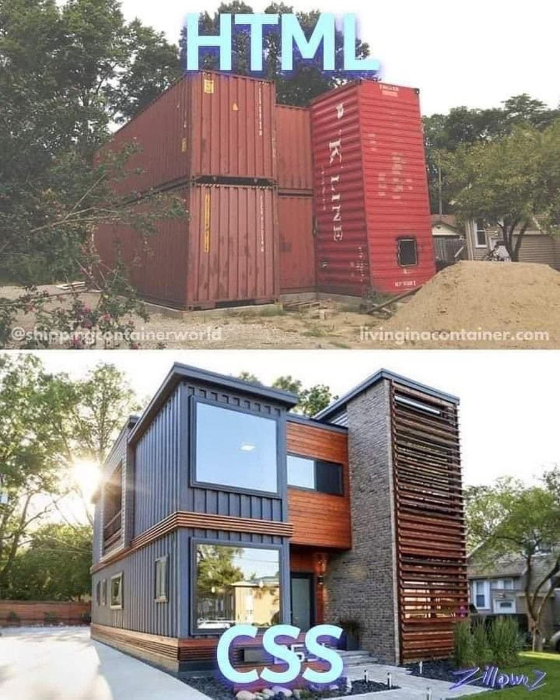

# Introduction Framework CSS

::: details Sommaire
[[toc]]
:::


Vous avez maintenant découvert le HTML et le CSS, et l'imbrication des balises. Vous avez également entre-aperçu l'importance de la CSS pour la mise en forme de votre site (sans CSS, votre site est vraiment basique).

Vous avez également découvert le CSS, et vous avez pu voir que le CSS est un langage très puissant, mais peut-être un peu complexe à prendre en main (ça va venir, ne vous inquiétez pas, il faut juste un peu de pratique).

En tant que futur développeur, vous allez devoir également apprendre à être efficace, c'est pour ça que nous allons aborder les frameworks CSS.



## Qu'est-ce qu'un framework CSS ?

Un framework (ou cadre de travail en français) est un ensemble de fichiers et de dossiers qui permettent de créer un site web rapidement et efficacement. C'est en quelque sorte un squelette / ou une base de travail. Il existe des frameworks pour tous les langages de programmation, et donc également pour le CSS.

L'avantage d'un framework CSS est qu'il permet de gagner du temps, et de ne pas avoir à réinventer la roue. En effet, un framework CSS contient déjà des styles CSS pour les éléments de base (boutons, formulaires, etc.), et permet donc de gagner du temps. **Et surtout** de partager des pratiques / des standards communes avec d'autres développeurs.

## Une multitude de frameworks CSS

Comme dans beaucoup de domaine de l'informatique, nous allons avoir le choix entre plusieurs frameworks CSS. Il existe des frameworks CSS très simples, et d'autres beaucoup plus complexes. Certains sont très populaires, d'autres beaucoup moins. L'important est de comprendre qu'il s'agit d'un outil, et que vous devez choisir l'outil qui vous convient le mieux.

## Les frameworks CSS les plus populaires

Il existe de nombreux frameworks CSS, mais nous allons nous concentrer sur les plus populaires :

- [Bootstrap](https://getbootstrap.com/)
- [Tailwind CSS](https://tailwindcss.com/)
- [Bulma](https://bulma.io/)
- [Foundation](https://get.foundation/)
- [Semantic UI](https://semantic-ui.com/)
- [Materialize](https://materializecss.com/)

Bien entendu, il en existe d'autres, mais nous allons nous concentrer sur les plus populaires.

### Bootstrap

Bootstrap est le framework CSS le plus populaire. Il est utilisé par de nombreux développeurs, et est très complet. Il est également très simple à prendre en main, et permet de créer des sites web rapidement.

L'avantage de Boostrap est qu'il permet de créer très rapidement des sites web avec un ensemble d'éléments de base (boutons, formulaires, etc.). Il permet également de créer des sites web responsive (qui s'adaptent à la taille de l'écran).

Mais il a l'inconvénient d'être très utilisé, et donc de créer des sites web qui se ressemblent tous. Il est difficile de créer des sites web personnalisés avec Bootstrap.

::: tip Un instant

Bootstrap est un incontournable… Oui… mais pour combien de temps ? Boostrap vieillis et commence à être dépassé par d'autres frameworks CSS. Je vous conseille de vous tourner vers d'autres frameworks CSS, comme Tailwind CSS. Qui ont une approche différente, et qui sont plus modernes.

**Mais**, faire l'impasse sur Bootstrap serait une erreur, car il est très utilisé, et vous serez amené à travailler avec.

:::

### Tailwind CSS

Tailwind est le nouveau roi des frameworks CSS. Il est très populaire, et est très différent de Bootstrap. Il est également très simple à prendre en main, et permet de créer des sites web rapidement.

Tailwind repose sur un ensemble de classes CSS, qui vont vous permettre de styliser vos éléments HTML. Pas besoin ici de connaitre des propriétés CSS, il suffit de connaitre les classes CSS de Tailwind. C'est très simple à prendre en main, et très efficace.

La communauté Tailwind est également très active, et il existe de nombreux sites web qui proposent des composants Tailwind comme [Tailwind Components](https://tailwindcomponents.com/).

### Materialize

Materialize est un framework CSS qui reprend les principes du Material Design de Google. Un peu comme Bootstrap, il permet de créer des sites web rapidement, et de gagner du temps, mais il est moins populaire que Bootstrap.

Par contre, il implémente des « codes » / « usages » de Google, et permet donc de créer des sites web qui respectent les standards de Google. C'est un framework très intéressant à connaitre.

### Il en existe d'autres

J'ai volontairement limité la liste des frameworks CSS à 3, mais il en existe d'autres. Je vous invite à les découvrir, et à vous faire votre propre avis.

Avant d'allez plus loin, je vous invite à vous rendre sur la liste des frameworks CSS présentés un peu plus haut, et à regarder les sites web de démonstration. Cela vous permettra de vous faire une idée de ce que vous pouvez faire avec ces frameworks CSS.

::: tip Un instant

L'auto-formation est une compétence très importante pour un développeur. Vous devez être capable de vous former par vous-même, et de vous faire votre propre avis.

:::

## Pourquoi utiliser un framework CSS ?

Vous vous demandez peut-être pourquoi utiliser un framework CSS ? Pourquoi ne pas créer à chaque fois un site web de A à Z ? C'est une question légitime, et je vais vous donner quelques raisons d'utiliser un framework CSS :

- **Gagner du temps** : Un framework CSS permet de gagner du temps, car il contient déjà des styles CSS pour les éléments de base (boutons, formulaires, etc.). Cela permet de ne pas avoir à réinventer la roue à chaque fois.
- **Partager des standards** : Un framework CSS permet de partager des standards / des bonnes pratiques avec d'autres développeurs. Cela permet de créer des sites web qui respectent les standards, et qui sont donc plus faciles à maintenir.
- **Créer des sites web responsive** : Un framework CSS permet de créer des sites web responsive (qui s'adaptent à la taille de l'écran). C'est un point très important, car aujourd'hui, la majorité des sites web sont consultés sur mobile.
- **Créer des sites web modernes** : Un framework CSS permet de créer des sites web modernes, avec des animations, des transitions, etc. C'est un point très important, car les sites web modernes sont très appréciés des utilisateurs.

Évidemment, vous pouvez faire sans, c'est intéressant… mais la compléxité peu rapidement vous dégouter. Utiliser un framework vas vous permettre de vous concentrer sur le code, et non sur la mise en forme (dans une certaine mesure, et dans un premier temps).

## Comment utiliser un framework CSS ?

Vous avez vu comment inclure une feuille de style CSS dans une page HTML. Mais comment inclure un framework CSS dans une page HTML ? C'est très simple, il suffit d'inclure la feuille de style CSS du framework dans votre page HTML.

Et oui ! C'est aussi simple que ça !

::: tip Un instant

C'est vrai pour la majorité des frameworks CSS, mais Tailwind CSS est un peu différent, il faut également inclure un fichier JavaScript (nous reviendrons plus tard sur la raison).

Il est donc préféreable de lire la documentation du framework CSS que vous souhaitez utiliser (comme toujours).

:::

## L'un empêche pas l'autre

Vous vous demandez peut-être si vous devez utiliser un framework CSS, ou si vous devez créer votre propre CSS. La réponse est simple : **les deux**.

En effet, vous pouvez utiliser un framework CSS pour créer rapidement un site web, et ensuite personnaliser le CSS pour créer un site web unique. C'est ce que font la majorité des développeurs.

**Cependant**, il est important de NE JAMAIS MODIFIER LES FICHIERS DU FRAMEWORK CSS. En effet, si vous modifiez les fichiers du framework CSS, vous ne pourrez plus le mettre à jour, et vous ne pourrez plus profiter des nouvelles fonctionnalités.

**Cependant 2**, il est important de NE JAMAIS UTILISER DEUX FRAMEWORKS CSS EN MÊME TEMPS. Les frameworks CSS sont très complets, et il est inutile d'en utiliser deux en même temps. Cela va créer des conflits, et vous allez perdre du temps.

## Tester Bootstrap

Nous allons découvrir dans un premier temps Bootstrap. Celui-ci repose sur un ensemble de classes CSS (que vous ne pouvez pas inventer). Pour prendre en main Bootsrap il faut utiliser massivement la documentation.

Voici les pages importantes pour débuter :

- [Introduction](https://getbootstrap.com/docs/5.2/getting-started/introduction/), qui vous explique comment créer la première page HTML avec Bootstrap.
- [Layout](https://getbootstrap.com/docs/5.2/layout/containers/), qui vous explique comment créer la structure de votre page avec Bootstrap.
- [Grid](https://getbootstrap.com/docs/5.2/layout/grid/), qui vous explique comment créer une page responsive avec Bootstrap.
- [Les formulaires](https://getbootstrap.com/docs/5.2/forms/overview/), qui vous explique comment créer des formulaires avec Bootstrap.
- [Les boutons](https://getbootstrap.com/docs/5.2/components/buttons/), qui vous explique comment créer des boutons avec Bootstrap.
- [Les cards](https://getbootstrap.com/docs/5.2/components/card/), qui vous explique comment créer des cards avec Bootstrap.

::: tip Un instant

Comment lire la documentation ? La documentation à toujours le même format :

- Une expliquation du composant / de la fonctionnalité.
- Un exemple du rendu.
- Le code HTML pour obtenir le rendu (que vous ~pouvez~ **devez** copier / coller pour démarrer).
:::

Évidemment, il existe de nombreuses autres pages, mais celles-ci sont les plus importantes pour débuter. Je vous invite à les lire attentivement.

### Votre première page

Avant d'intégrer Boostrap dans votre blog (ou pas), je vous propose de le faire « pour tester » dans une page HTML vierge. Cela vous permettra de vous familiariser avec Bootstrap, et de voir comment il fonctionne.

Pour cela, je vous invite à créer un fichier `index.html` dans un dossier `bootstrap` (ou autre). Et à y copier / coller le code suivant :

```html
<!doctype html>
<html lang="en">
  <head>
    <meta charset="utf-8">
    <meta name="viewport" content="width=device-width, initial-scale=1">
    <title>Bootstrap demo</title>
    <link href="https://cdn.jsdelivr.net/npm/bootstrap@5.2.3/dist/css/bootstrap.min.css" rel="stylesheet" integrity="sha384-rbsA2VBKQhggwzxH7pPCaAqO46MgnOM80zW1RWuH61DGLwZJEdK2Kadq2F9CUG65" crossorigin="anonymous">
  </head>
  <body>
    <h1>Hello, world!</h1>
    <script src="https://cdn.jsdelivr.net/npm/bootstrap@5.2.3/dist/js/bootstrap.bundle.min.js" integrity="sha384-kenU1KFdBIe4zVF0s0G1M5b4hcpxyD9F7jL+jjXkk+Q2h455rYXK/7HAuoJl+0I4" crossorigin="anonymous"></script>
  </body>
</html>
```

Vous pouvez maintenant ouvrir le fichier `index.html` dans votre navigateur, et vous devriez voir le texte `Hello, world!`. Jusque là, rien de nouveau, c'est du HTML.

La vraie nouveauté, c'est que vous avez inclus la feuille de style CSS de Bootstrap dans votre page HTML. Vous avez donc maintenant accès à toutes les classes CSS de Bootstrap.

### Créer une structure responsive

Nous allons maintenant créer une structure responsive, modifier le code précédent pour retirer le `h1`, et le remplacer par le code suivant :

```html
<div class="container">
  <!-- Votre contenu ici -->
  <h1>Hello, world!</h1>
</div>
```

Tester à nouveau dans votre navigateur. À l'aide de [la documentation](https://getbootstrap.com/docs/5.2/layout/containers/), regarder ce qui se passe lorsque vous réduisez la taille de la fenêtre. Vous devriez voir que le texte est centré, et que la largeur de la page est limitée.

#### Et que le texte soit centré ! 🎉

Vous voulez que le texte soit centré ? C'est très simple, il suffit d'ajouter la classe `text-center` à votre `h1` :

```html
<div class="container">
  <!-- Votre contenu ici -->
  <h1 class="text-center">Hello, world!</h1>
</div>
```

Uniquement sur mobile ?

```html
<div class="container">
  <!-- Votre contenu ici -->
  <h1 class="text-center text-md-start">Hello, world!</h1>
</div>
```

Et oui, c'est aussi simple que ça ! Je vous laisse regarder la documentation pour en savoir plus. [La documentation](https://getbootstrap.com/docs/5.2/utilities/text/#text-alignment).

### Une grille responsive

L'avantage d'un framework CSS est qu'il permet de créer des sites web responsive. C'est-à-dire des sites web qui s'adaptent à la taille de l'écran. Pour cela, Bootstrap utilise une grille responsive.

Pour créer une grille responsive, il faut utiliser les classes CSS `row` et `col`. La classe `row` permet de créer une ligne, et la classe `col` permet de créer une colonne. C'est très simple, et très efficace.

Nous allons modifier le code précédent pour créer une grille de 2 colonnes (une colonne de 6, et une colonne de 6). Pour cela, il faut utiliser le code suivant :

```html
<div class="container">
  <div class="row">
    <div class="col-6">
        Colonnes de 6
    </div>
    <div class="col-6">
        Colonnes de 6
    </div>
  </div>
</div>
```

Tester à nouveau dans votre navigateur. À l'aide de [la documentation](https://getbootstrap.com/docs/5.2/layout/grid/), regarder ce qui se passe lorsque vous réduisez la taille de la fenêtre. Vous devriez voir que les colonnes passent les unes en dessous des autres.

### Créer une liste avec des cards

Les colonnes et les lignes, c'est bien, mais ce n'est pas très joli. Nous allons maintenant créer une liste avec des cards. Une `card` est un composant de Bootstrap qui permet de créer des cartes. C'est un élément que l'on retrouve un peu partout sur le web (Twitter, Facebook, etc.).

La card permet de structure le contenu, et de le mettre en valeur.

Je vous laisse modifier le code précédent pour créer une liste verticale avec 3 cards. Pour cela, il faut utiliser le code suivant :

```html
<div class="d-grid gap-3">
    <div class="card">
        <div class="card-body">
            This is some text within a card body.
        </div>
    </div>
    <div class="card">
        <div class="card-body">
            This is some text within a card body.
        </div>
    </div>
    <div class="card">
        <div class="card-body">
            This is some text within a card body.
        </div>
    </div>
</div>
```

### Des cards pour des articles

Maintenant que nous avons vu comment utiliser les cards, nous allons les utiliser pour afficher des articles. Je vous laisse tester le code suivant, voici un exemple pour un article :

Code qui affiche une card avec dedans une image à gauche et à droite un titre et un texte :

```html
<div class="card flex-row">
    
    <div class="card-body">
        <h4 class="card-title">Left image</h4>
        <p class="card-text">Example text</p>
    </div>
</div>
```

### Navigation entre deux pages

Avec Bootstrap, il est possible de mettre un bouton pour naviguer entre deux pages. Pour cela, il faut utiliser les classes suivantes (sur un lien par exemple) :

```html
<a href="#" class="btn btn-primary">Lire l'article</a>
```

::: warning C'est à vous

Je vous laisse créer une seconde page HTML, et créer un lien entre les deux pages. 

:::

### Conclusion

Vous avez maintenant découvert Bootstrap, et vous avez pu voir qu'il est très simple à prendre en main. Il permet de créer des sites web rapidement, et de gagner du temps. Il permet également de créer des sites web responsive, et modernes.

Nous avons ici pavé la route, vous pouvez utiliser cette base pour créer votre blog.

Pour aller plus loin, vous pouvez consulter le [TP Bootstrap](../../tp/html_css/bootstrap.md).

## Tester Tailwind CSS

L'approche de Tailwind est un peu différente. L'un des problèmes de Bootsrtrap est qu'il est « relativement » lourd (poid important) et difficile à personnaliser. L'approche de Tailwind est donc d'offrir un ensemble de classes CSS qui indépendament ne sont « que des éléments CSS classiques ». Mais qui bien assemblées permettent de créer des sites web rapidement.

Exemple, si je souhaite faire une image de profile ronde, je vais devoir utiliser les classes CSS suivantes :

```html

```

Ce qui va donner :


Une bonne démo de ça est disponible dès la page d'accueil de Tailwind : [https://tailwindcss.com/](https://tailwindcss.com/).

### Les classes CSS

Nous avons donc à notre disposition **plein** de classe CSS :

- `w-24` : pour définir une largeur de 24px.
- `h-24` : pour définir une hauteur de 24px.
- `rounded-full` : pour définir un arrondi de 50%.
- `mx-auto` : pour centrer l'image.
- `bg-blue-500` : pour définir un fond bleu.
- `hover:bg-blue-700` : pour définir un fond bleu plus foncé au survol.
- … (la liste est litéralement infinie)

Exemple concret :


Et bien d'autres encore. Vous pouvez consulter la [documentation](https://tailwindcss.com/docs/) pour en savoir plus.

### La force, les préfixs CSS

Tailwind est très puissant car il intègre des préfix CSS permettant de faire rapidement des comportement de base :

- `md:` : pour les écrans de taille moyenne (tablette).
- `lg:` : pour les écrans de grande taille (ordinateur).
- `xl:` : pour les écrans de très grande taille (grand écran).
- `dark:` : pour les thèmes sombres.
- …

Avec ce genre de préfix, il est possible de faire des choses très rapidement. Exemple, si je souhaite faire un bouton bleu, je vais devoir utiliser les classes CSS suivantes :

```html
<button class="bg-blue-500 hover:bg-blue-700 text-white font-bold py-2 px-4 rounded">
  Button
</button>
```

Et si je souhaite que celui-ci soit blanc en thème sombre, je vais devoir utiliser les classes CSS suivantes :

```html
<button class="bg-blue-500 hover:bg-blue-700 text-white font-bold py-2 px-4 rounded dark:bg-white dark:text-black">
  Button
</button>
```

::: tip Un instant
Ça semble compliqué ? C'est normal, c'est un peu compliqué au début. Mais une fois que vous avez compris le principe, c'est très simple et très efficace.
:::

### Les pages importantes pour débuter

L'approche de Tailwind est très différente de Bootstrap, il faut donc utiliser massivement la documentation. Voici les pages importantes pour débuter :

- [Introduction](https://tailwindcss.com/docs/installation), qui vous explique comment installer Tailwind.
- [Layout](https://tailwindcss.com/docs/container), qui vous explique comment créer la structure de votre page avec Tailwind.
- [Grid](https://tailwindcss.com/docs/grid-template-columns), qui vous explique comment créer une page responsive avec Tailwind.
- [Les modèles de la communautée](https://tailwindcomponents.com/)

### Installer Tailwind

Tailwind à pour objectif de ne pas tout générer « dans une grosses feuille de style CSS ». Tailwind repose donc sur du JavaScript pour générer les classes CSS. Idéalement, il faut utiliser des technologies comme PostCSS (que vous verez plus tard). Pour l'instant nous allons suivre la documentation officielle, et utiliser un CDN.

Dans un nouveau fichier `index.html` (dans le dossier `tailwind`), copier / coller le code suivant :

```html
<!doctype html>
<html>
    <head>
        <meta charset="UTF-8">
        <meta name="viewport" content="width=device-width, initial-scale=1.0">
        <script src="https://cdn.tailwindcss.com"></script>
    </head>
    <body>
        <h1 class="text-3xl font-bold underline">
            Hello world!
        </h1>
    </body>
</html>
```

::: tip Un instant 👋
Pas de CSS ? Et non, le code javascript inclus dans la page va générer les classes CSS. C'est un peu magique, mais c'est très efficace.
:::

### Créont une structure pour un blog

Maintenant que nous avons vu comment fonctionne Tailwind, nous allons voir comment créer une structure pour un blog. Pour cela, nous allons utiliser les classes CSS suivantes :

- `bg-gray-100` : pour définir un fond gris clair.
- `container` : pour définir une largeur de 1000px.
- `mx-auto` : pour centrer le contenu.
- `py-8` : pour définir un padding de 8px en haut et en bas.
- `text-3xl` : pour définir une taille de texte de 3xl (48px).
- `font-bold` : pour définir une police en gras.
- `text-gray-900` : pour définir une couleur de texte grise foncée.
- `mb-4` : pour définir une marge en bas de 4px.
- `grid` : pour définir une grille.
- `grid-cols-1` : pour définir une colonne.
- `md:grid-cols-2` : pour définir deux colonnes sur les écrans de taille moyenne.
- `lg:grid-cols-3` : pour définir trois colonnes sur les écrans de grande taille.
- …

Très bien, ça fait pas mal de classes CSS, comment assembler tout ça ?

```html
<!DOCTYPE html>
<html lang="fr">

<head>
  <meta charset="UTF-8">
  <meta name="viewport" content="width=device-width, initial-scale=1.0">
  <script src="https://cdn.tailwindcss.com"></script>
  <title>Mon blog</title>
</head>

<body class="bg-gray-100">
  <div class="container mx-auto py-8">
    <h1 class="text-3xl font-bold text-gray-900 mb-4">Mon Blog</h1>
    <div class="grid grid-cols-1 md:grid-cols-2 lg:grid-cols-3 gap-4">
      <!-- Article 1 -->
      <div class="bg-white shadow-lg rounded-lg p-4">
        
        <h2 class="text-xl font-semibold text-gray-800 mb-2">Titre de l'article 1</h2>
        <p class="text-gray-600 mb-4">Lorem ipsum dolor sit amet, consectetur adipiscing elit. Vivamus fringilla posuere tempor. Nullam nec neque eget ipsum hendrerit ullamcorper a ac nulla.</p>
        <a href="#" class="text-blue-500 font-semibold hover:underline">Lire la suite...</a>
      </div>

      <!-- Article 2 -->
      <div class="bg-white shadow-lg rounded-lg p-4">
        
        <h2 class="text-xl font-semibold text-gray-800 mb-2">Titre de l'article 2</h2>
        <p class="text-gray-600 mb-4">Lorem ipsum dolor sit amet, consectetur adipiscing elit. Vivamus fringilla posuere tempor. Nullam nec neque eget ipsum hendrerit ullamcorper a ac nulla.</p>
        <a href="#" class="text-blue-500 font-semibold hover:underline">Lire la suite...</a>
      </div>

      <!-- Article 3 -->
      <div class="bg-white shadow-lg rounded-lg p-4">
        
        <h2 class="text-xl font-semibold text-gray-800 mb-2">Titre de l'article 3</h2>
        <p class="text-gray-600 mb-4">Lorem ipsum dolor sit amet, consectetur adipiscing elit. Vivamus fringilla posuere tempor. Nullam nec neque eget ipsum hendrerit ullamcorper a ac nulla.</p>
        <a href="#" class="text-blue-500 font-semibold hover:underline">Lire la suite...</a>
      </div>
    </div>
  </div>
</body>

</html>
```

::: warning C'est à vous

Je vous laisse décliner une seconde page permettant d'afficher un article complet. Vous pouvez vous inspirer de [cette page](https://tailwindcomponents.com/component/blog-post).

:::

## Tester Materialize

Materialize est très similaire au autres frameworks CSS, je ne vais donc pas rentrer dans un détail trop important. Je vous invite à consulter la [documentation](https://materializecss.com/) pour en savoir plus.

L'approche est semblable à Bootstrap, il faut utiliser massivement la documentation. Voici les pages importantes pour débuter :

- [Introduction](https://materializecss.com/getting-started.html), qui vous explique comment créer la première page HTML avec Materialize.
- [Layout](https://materializecss.com/templates/starter-template/preview.html), un template de base pour créer une page HTML avec Materialize (vous pouvez regarder le code HTML pour le comprendre).
- [Grid](https://materializecss.com/grid.html), qui vous explique comment créer une page responsive avec Materialize.
- [Les formulaires](https://materializecss.com/text-inputs.html), qui vous explique comment créer des formulaires avec Materialize.

Avec ce que vous avez vu pour Bootstrap, vous devriez être capable de comprendre la documentation de Materialize. Et vous devriez être capable de créer une page HTML avec Materialize si besoin.

::: warning C'est à vous

Je vous laisse créer une page HTML avec Materialize, et vous faire votre propre avis.

:::

## Conclusion

Vous avez maintenant découvert les frameworks CSS, et vous avez pu voir qu'il en existe de nombreux. Vous avez également pu voir que les frameworks CSS permettent de gagner du temps, et de partager des standards / des bonnes pratiques avec d'autres développeurs.

Vous avez également pu voir que les frameworks CSS permettent de créer des sites web responsive, et modernes. C'est un point très important, car aujourd'hui, la majorité des sites web sont consultés sur mobile.

Maintenant la balle est dans votre camp, je vous invite à tester les frameworks CSS que nous avons vu, et à vous faire votre propre avis.