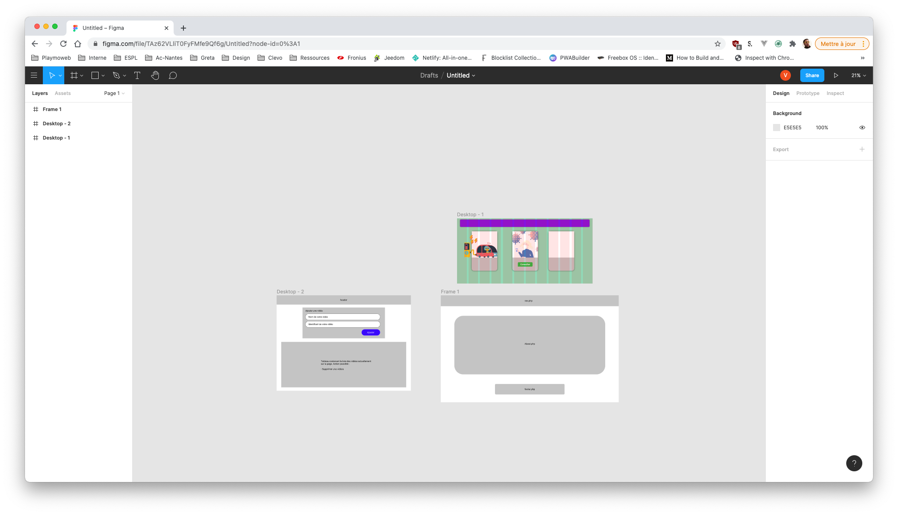

# Maquetter un site Internet

::: details Sommaire
[[toc]]
:::

Avant d'écrire la moindre ligne de HTML, un professionnel commence par dessiner : c'est la maquette. Elle permet de valider l'organisation de la page avec le client (ou le professeur 😉) avant d'investir du temps dans le code. Dans ce TP nous allons découvrir [Figma](https://www.figma.com/), l'outil de maquettage le plus utilisé actuellement.

::: tip D'autres outils existent

Nous allons utiliser Figma, mais il existe d'autres outils permettant de faire la même chose :

- [Sketch](https://www.sketch.com/)
- [Penpot](https://penpot.app/) (libre et open source)
- [Pencil](https://pencil.evolus.vn/)
- [Draw.io (diagrams.net)](https://www.diagrams.net/)
- …

:::

## Prérequis

- Un compte Figma (la version gratuite suffit largement).
- Avoir en tête un site à maquetter : nous allons maquetter **votre CV** (le sujet du [TP CV](./tp5.md)).

## Objectifs

À la fin de ce TP vous saurez :

- Créer un wireframe (maquette basse fidélité).
- Créer une maquette haute fidélité (couleurs, polices, images).
- Décliner une maquette en version mobile.
- Partager votre maquette pour la faire valider.

## Découverte de l'interface

Je vous laisse créer un compte puis un nouveau fichier de design. Nous allons découvrir ensemble les éléments de base :

- Les **frames** : les « écrans » de votre maquette (Figma vous propose des tailles toutes prêtes : Desktop, iPhone, etc.).
- Les **formes** et le **texte** : les briques de base de votre design.
- Le panneau de droite : position, tailles, couleurs, alignements.

### À faire

- Créer une frame « Desktop ».
- Y placer un rectangle et un texte, puis les aligner ensemble.

## Le wireframe (basse fidélité)

Un wireframe est une maquette « en noir et blanc » : uniquement des rectangles, des traits et des zones de texte. Pas de couleur, pas d'image, pas de vraie police. L'objectif est de définir **l'organisation** de la page, rien d'autre.

### À faire

Réaliser le wireframe de votre CV, avec au minimum :

- Une entête (votre nom, votre titre).
- Une zone « à propos ».
- Une zone « compétences ».
- Une zone « expériences / formations ».
- Un pied de page avec les liens vers vos réseaux.

::: details Question : pourquoi commencer sans couleur ni image ?
Parce qu'à cette étape, on veut valider la structure. Si vous mettez tout de suite des couleurs et des images, la personne qui relit votre maquette va réagir sur le design (« je n'aime pas ce bleu ») au lieu de réagir sur l'organisation (« la zone compétences devrait être plus haute »). Chaque chose en son temps.
:::

::: tip Point de contrôle
Votre wireframe doit être compréhensible par quelqu'un qui ne connait pas votre projet. Faites le test avec votre voisin : peut-il vous dire à quoi sert chaque zone ?
:::

## La maquette (haute fidélité)

Maintenant que la structure est validée, place au design. Dupliquez votre frame (c'est l'intérêt de Figma, on ne repart jamais de zéro) et transformez votre wireframe en vraie maquette :

- Choisissez une palette de couleurs (2 ou 3 couleurs maximum, [coolors.co](https://coolors.co/) peut vous aider).
- Choisissez une police ([Google Fonts](https://fonts.google.com/) est intégré à Figma).
- Remplacez les rectangles « image » par de vraies images.

::: tip Le duo gagnant avec la CSS
Les choix que vous faites ici (couleurs, police, espacements) sont exactement les valeurs que vous utiliserez ensuite dans votre feuille de style. Figma vous donne même les valeurs exactes (code hexadécimal, taille en pixels) dans le panneau de droite. La maquette est le contrat, la CSS est l'exécution.
:::

## La version mobile

Vous vous en souvenez, le trafic mobile n'est pas à négliger. Je vous laisse créer une frame « iPhone » et y décliner votre maquette.

::: details Question : que faut-il changer entre la version desktop et mobile ?
En général : les colonnes passent les unes sous les autres, le menu se replie (menu « burger »), les tailles de texte s'adaptent. C'est exactement ce que vous ferez ensuite en CSS avec les media queries : la maquette mobile est la spécification de votre responsive.
:::

## Partager votre maquette

Une maquette sert à être montrée. Avec le bouton « Share » de Figma, générez un lien de partage en lecture seule.

### À faire

- Récupérer votre lien de partage.
- Le faire tester à votre voisin (et récupérer ses retours).

## Conclusion

Dans ce TP vous avez :

- Créé un wireframe pour valider la structure de votre CV.
- Transformé ce wireframe en maquette haute fidélité.
- Décliné votre maquette en version mobile.
- Partagé votre travail pour le faire valider.

La suite logique ? [Réaliser votre CV en HTML + CSS](./tp5.md) en suivant votre maquette. C'est à vous de jouer !

👋 Si vous avez des questions, n'hésitez pas.
