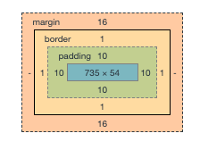
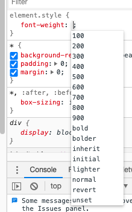
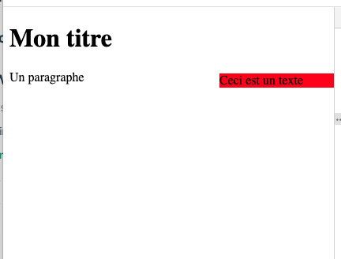
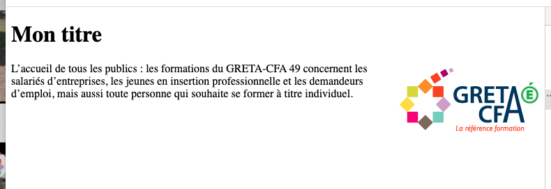
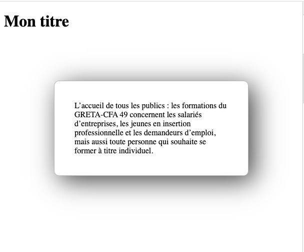
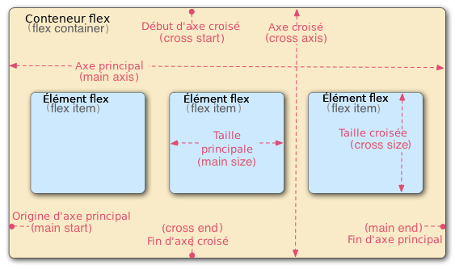
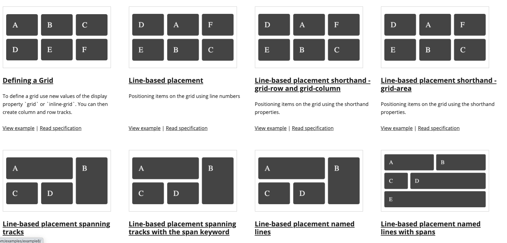
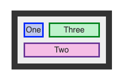
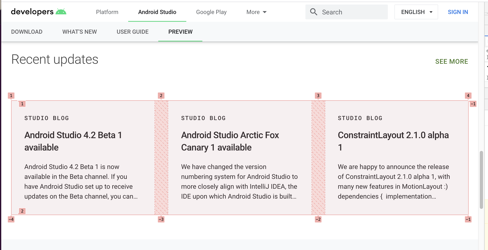

# Complément du cours CSS

Ce document est un complément du cours. Il vous permettra de revenir sur les différentes notions avec différents exemples. La CSS est un vaste sujet il serait difficile de tout couvrir dans un simple document.

[[toc]]

## Boite à outils

Je ne le répèterai jamais assez, mais vous devez avoir une boite à outils de ressources. Celle-ci vous servira d'inspiration, de technique, mais aussi « de référence ».

- [CodePen](https://codepen.io)
- Les autres sites (Inspecteurs d'éléments, sources …)
- [MDN CSS](https://developer.mozilla.org/fr/docs/Web/CSS)
- [Material.io](https://material.io/design)

Cette liste est bien évidemment non exhaustive.

## Id ou Class ?

| Sélecteur | Usage                                         |
| --------- | --------------------------------------------- |
| #item     | Élément unique dans votre page                |
| .rouge    | Class réutilisable (multiple) dans votre code |
| p         | L'ensemble des balises de type `<p>`          |

- `class="rouge"` => `.rouge`
- `id="monId"` => `#monId`

::: tip Petite aide mnémotechnique

- `id=` => `#`
- `class=` => `.`

C'est une notation universelle qui sera également valable en JavaScript
:::

## Les espacements

Actuellement vos éléments sont tous « collés » aux autres. C'est normal vous n'avez aucun espacement de défini. En CSS vous avez la possibilité de choisir deux types d'espacements :

- `padding` (Espacement à l'intérieure de l'élément)
- `margin` (Espacement à l'extérieure de l'élément)



En termes d'unités, nous avons plusieurs choix :

- en pixel (exemple `padding: 10px`)
- en pourcentage (exemple `margin: 10%`)

## Fonds et couleurs

Il faut imaginer votre navigateur un peu comme Word (ou Libre Office Writter), c'est-à-dire un logiciel capable de faire de la mise en forme « d'éléments ». Dans le cas du navigateur nous n'avons pas d'interface graphique pour le faire, nous avons seulement du code.

La base de la personnalisation c'est les « couleurs » et les images de fonds.

### Les couleurs

Pour les couleurs, c'est relativement simple. Nous avons trois solutions :

- Une [des 140 couleurs disponibles](https://www.w3schools.com/cssref/css_colors.asp).
- Via le code hexadécimal d'une couleur.
- Via la notation RGB (ou RGBA avec de la transparence).

La notation hexadécimale est quelque chose de massivement utilisé dans le monde de l'informatique (et du design) pour représenter les couleurs. Cette notation offre un choix très large de couleurs avec la possibilité de réaliser de la transparence (appelée alpha).

Une couleur « Hex » est représentée comme ça :


Vous pouvez l'écrire à la main… C'est une question d'habitude! Mais le plus simple est de passer par un logiciel qui possède un « colorimètre » (un Color Picker en anglais) :

- Gimp
- Photoshop
- [Via un site en ligne](https://www.webfx.com/web-design/color-picker/)
- [Directement sur Google](https://www.google.com/search?q=colorpicker&oq=colorpicker)

### Les images de fonds

Mais votre navigateur ne se limite pas à une simple couleur de fond et du texte… Il permet également d'afficher des images. Nous l'avons vu il est possible d'afficher des images avec la balise ``, mais pas uniquement.

Il est possible également d'afficher des images en CSS. Via la propriété `background-…` ou `background`. La propriété `background` est très puissante et vous nous permettre de « composer » un fond avec énormément de possibilités.

::: tip Ah oui !
Vous allez le voir, il est possible d'appliquer un fond sur « presque » n'importe quels éléments HTML. (div, h1, p, body, …)
:::

#### Définir un fond

Mettre un fond à un élément en HTML s'effectue avec la propriété `background-image`. Celle-ci accepte plusieurs formats d'image cette liste dépend de votre navigateur, mais à minima vous pouvez mettre :

- png
- jpeg
- gif

Une fois votre fichier « au bon format » il vous suffit de spécifier le lien de celui-ci avec la syntaxe suivante :

```css
.monElement {
  background-image: url("lien-vers-votre-image.png");
}
```

::: danger Attention
De base, le fond se répète à l'infini dans toutes les directions.

_Exemple avec le logo du Greta :_

:::

#### Régler son comportement

Comme vous avez pu le constater, nous avons pour l'instant un fond qui se répète dans toute les directions. Dans certains cas c'est pratique, par exemple un fond de site qui va se répéter à l'infini pour créer un « pattern ». Mais dans certains cas nous ne voulons pas forcément de répétitions.

Nous avons donc la liste suivante :

| Propriété             | Valeurs                                      |
| --------------------- | -------------------------------------------- |
| background-attachment | fixed, scroll                                |
| background-repeat     | no-repeat, repeat-x, repeat-y, repeat        |
| background-position   | en pixel, ou top, bottom, left, right center |

`background-repeat` vas nous permettre de choisir le comportement de répétitions du fond. Cette propriété permet de définir une non-répétition avec `no-repeat`, mais également d'autres options comme une répétition seulement en `x` ou seulement en `y`.

`background-attachment` permet de choisir comment le fond va se comporter lors du scroll. Par défaut votre fond `scroll` quand vous vous descendez dans la page. Mais vous pouvez également choisir « d'ancrer » le fond pour que celui-ci soit toujours visible.

`background-position` permet de choisir la position de notre fond, celle-ci peut-être exprimé en pixel ou en « anglais » avec `top`, `bottom`, `left`, `right` ou encore `center`. Avec cette propriété vous allez pouvoir placer finement votre fond, avec une notation X,Y exemple :

```css
.monElement {
  background-image: url("lien-vers-votre-image.png");
  background-position: bottom left;
}

/* ou encore */
body {
  background-image: url("lien-vers-votre-image.png");
  background-position: center;
}
```

::: tip Exemple

L'ensemble des propriétés est combinable afin d'afficher le fond **tel que vous le souhaitez**

```css
body {
  background-image: url("greta.png");
  background-attachment: fixed; /* Le Logo sera fixe */
  background-repeat: no-repeat; /* Le logo ne sera pas répété */
  background-position: center; /* Le logo sera centré */
}
```

_En reprenant le logo du greta comme exemple :_


:::

#### La « short-hand »

Comme vous pouvez le voir, rapidement « ça va être verbeux », en CSS vous pouvez combiner l'ensemble des propriétés via une notation appelée « short-hand » :

```css
background: url("greta.png") fixed no-repeat center;
```

::: tip Astuce de pro
Ne vous inquiétez pas, votre IDE (éditeur de code) vous proposera très certainement de simplifier votre CSS.
:::

## Formater du texte

Comme je vous le disais précédemment, votre navigateur est un vrai « Word », vous pouvez également mettre en forme votre texte comme bon vous semble.

| Propriété       | Usage                              | Valeurs                                                       |
| --------------- | ---------------------------------- | ------------------------------------------------------------- |
| font-weight     | Indique « le gras de votre texte » | 100 à 900 (ou bold, bolder, light, lighter, normal)           |
| font-style      | Style de votre texte               | normal, italic                                                |
| text-decoration | Décoration de votre police         | underline, line-through                                       |
| font-size       | Défini la taille de votre texte    | Taille absolue _ou_ relative (px, em ou anglais)              |
| color           | La couleur de votre texte          | Couleur en hexa, Anglais ou RGB (comme les fond donc)         |
| text-align      | Position de votre texte            | Positionnement de votre texte (left, right, center, justify…) |
| font-family     | Police à utiliser                  | Nom d'une police « présent sur le navigateur de la personne » |

### Choisir la police

Voilà un point épineux… La police, par defaut vous n'avez accès qu'au police présent sur l'ordinateur de la personne. C'est rapidement problématique, on nous demande que rarement d'installer la font X Y Z pour accéder à un site Internet.

Le CSS intègre un système nous permettant d'afficher la police de notre choix. Pour son utilisation c'est simple il faut utiliser `font-family` et spécifier ensuite le nom de la font souhaité par exemple :

```css
.monElement {
  font-family: Verdana;
}
```

Vous n'avez pas d'idée sur les fonts ? Vous pouvez utiliser un site comme [Google Fonts](https://fonts.google.com/). Il « vous offre » un CDN qui se chargera d'ajouter la font pour qu'elle puisse être affichée sur votre page Web.

Exemple :

```html
<html>
  <head>
    <link rel="preconnect" href="https://fonts.gstatic.com" />
    <link
      href="https://fonts.googleapis.com/css2?family=Open+Sans:wght@300&display=swap"
      rel="stylesheet"
    />

    <style>
      body {
        font-family: "Open Sans", sans-serif;
      }
    </style>
  </head>
  <body>
    <!-- Votre contenu -->
  </body>
</html>
```

### Taille du texte (absolue ou relative ?)

En CSS nous avons deux possibilités pour la taille de la police.

- Absolue
- Relative

#### Absolue

Si vous choisissez de définir votre taille de texte en valeur absolue, vous devez indiquer votre taille en `pixel` avec la notation px. Cette notation doit être utilisée avec la plus grande des précautions en effet, en fonction de l'écran (densité de pixels) le texte peut apparaitre trop petit.

```css
.element {
  font-size: 18px;
}
```

::: tip À savoir
Les `px` ne sont pas la seule unité disponible vous pouvez également définir la taille en `cm` ou en `mm`. Cependant comme vous l'imaginez ces unités ne sont pas vraiment « adaptées pour un écran d'ordinateur ».
:::

#### Relative

La notation relative est clairement la notation à privilégier, celle-ci utilise une notation en `em` (ou `rem`) elle permet de définir une taille de texte qui changera proportionnellement à la densité de pixel de l'écran de la personne qui visite votre site 👌.

::: tip À savoir
`em`, `rem` ? Kézako ? La notation `em` est relative au parent. La notation `rem` est basée à la racine de votre document. Concrètement ça veut dire que votre taille sera relative au parent ou non.
:::

### Gras, Italic, Souligné

Dans notre « traitement de texte » sans interface, nous avons également la possibilité de définir le style de notre texte. Pour ça nous utiliserons les propriétés suivantes :

- font-weight
- font-style
- text-decoration

`font-weight` permet de définir « le niveau de gras » de votre police. Vous pouvez définir cette valeur en chiffre en utilisant la notation de 100 à 900 ou via une notation relative en anglais bold, bolder, light, lighter, normal.

`font-style` nous permet d'indiquer le style de la police à savoir `italic` ou `normal`.

`font-decoration` nous permet de « décorer » votre texte. Concrètement ça veut dire si celui-ci sera souligné ou barré par exemple.

::: tip Astuce de pro
Votre navigateur vous propose une interface de développement puissante vous permettant de voir les valeurs possibles pour chaque propriété. C'est disponible dans votre inspecteur d'éléments.


:::

### Les alignements

Je vais me répéter, mais comme dans « word » vous pouvez en CSS placer votre texte. Pour ça nous utiliserons la propriété `text-align`. Celle-ci peut prendre les valeurs suivantes :

- left
- right
- center
- justify

Je ne m'étale pas sur le sujet les valeurs parlent d'elles-mêmes.

## Placer des éléments

En CSS il est possible de placer les éléments dans la page. Nous avons deux possibilités pour placer les éléments :

- Absolue
- Relative

### Les positions

Les positions absolue et relative fonctionnent de la même façon, mais n'ont pas la même référence de placement

`absolue` Un placement absolu prend ça référence par rapport au coin en haut à gauche du navigateur du client.

```html
<html>
  <body>
    <h1>Mon titre</h1>
    <div>
      <p>Un paragraphe</p>
      <div class="exemple">Ceci est un texte</div>
    </div>

    <style>
      .exemple {
        position: absolute;
        top: 0;
        background-color: red;
      }
    </style>
  </body>
</html>
```


`relative` Un placement relative prend ça référence par rapport au parent de l'élément à placer.

```html
<html>
  <body>
    <h1>Mon titre</h1>
    <div>
      <p>Un paragraphe</p>
      <div class="exemple">Ceci est un texte</div>
    </div>

    <style>
      .exemple {
        position: relative;
        left: 90%;
        background-color: red;
        top: -30px;
      }
    </style>
  </body>
</html>
```



### Fonctionnement

Le placement en CSS fonctionne donc toujours de la même façon :

- On indique le point d'origine. (absolute ou relative)
- On indique « par rapport » à ce point d'origine le placement de notre objet via les propriétés :
  - top
  - left
  - right
  - bottom

### Les unités

Vous utilisez un mobile, vous savez donc que la taille d'un écran est « variable » et surtout plus ou moins grande. Pour répondre à cette problématique, le placement (`top`, `bottom`, `right`, `left`) possède une multitude d'unités possible :

- En pixel (non responsive :danger:).
- en pourcentage (attention responsive, mais par rapport **à la largeur de l'écran**).
- en VH (pourcentage par rapport à la hauteur de l'écran).
- en VW (pourcentage par rapport à la largeur de l'écran).

::: tip Beaucoup de possibilités
Le placement est un problème complexe en CSS. Le mieux est de répondre à des cas « précis » d'usage. Il est difficile de répondre « de manière » théorique à toutes vos questions.
:::

### Le Float

Autre possibilité de placement. En CSS il est possible de rendre les éléments `flottant`. Ça va vous permettre par exemple d'entourer une image de texte. La propriété `float` peut prendre deux valeurs :

- left
- right

```html
<html>
  <body>
    <h1>Mon titre</h1>
    <p>
      
      L’accueil de tous les publics : les formations du GRETA-CFA 49 concernent
      les salariés d’entreprises, les jeunes en insertion professionnelle et les
      demandeurs d’emploi, mais aussi toute personne qui souhaite se former à
      titre individuel.
    </p>

    <style>
      .float {
        float: left;
      }
    </style>
  </body>
</html>
```

Avec un `float: left`:


Avec un `float: right`:


::: danger Attention
Tout ce qui va suivre sera automatiquement flottant. Si vous voulez arrêter « le mode flottant », vous devez l'indiquer à votre navigateur. Pour ça il existe une propriété `clear` celle-ci peut prendre trois valeurs :

- both
- left
- right

:::

## Centrer en CSS

À froid comme ça, cette notion peu paraitre simple… En réalité c'est un problème complèxe en CSS. Nous avons à notre disposition un certains nombres de façon de centrer en CSS. Nous allons voir ensemble que chaqu'une des solutions apportent une réponse différente pour une résultat identique :

- `text-align: center`
- `margin: auto`
- `display: flex`
- `display: grid`
- […](https://web.dev/centering-in-css/)

::: tip La pratique est la clef
C'est seulement avec la pratique et la mise en situation que vous aller réussir à centrer vos différents en CSS. Sachez juste que, le **display: flex** n'est pas la solution ultime à tout les centrages. Dans beaucoup de cas un simple `text-align: center` voir un `margin: auto` sera suffisant.
:::

## Le placement simplifié

Nous avons maintenant un moyen plus simple pour placer des éléments en CSS, le `flex`. Le `display: flex` vas nous permettre de placer relativement finement les éléments. Le `flex` propose pas mal d'options, mais nous pouvons l'utiliser « simplement » et rapidement en ne connaissant que la base.

_Le Flex repose sur quatre règles :_

- La direction de l'affichage : colonne ou ligne. (`flex-direction`)
- Le comportement si la place nécessaire pour l'affichage est insuffisante. (`flex-wrap`)
- Un placement X. (`justify-content`)
- Un placement Y. (`align-items`)
- L'alignement des éléments « dans le design ». (`align-content`)

Testons interactivement [les différentes propriétés en cliquant ici](http://flexbox.help/)

::: tip Flexbox permet encore plus
Ces propriétés sont « la base », mais il est possible d'aller bien plus loin. Nous avons par exemple la possibilité de choisir quel(s) élément(s) s'agrandissent (`grow`) et lesquels se réduisent (`shrink`).

Nous allons également pouvoir ordonner les éléments les uns par rapport aux autres. Cette fonctionnalité va nous permettre d'agencer comme nous le souhaitons notre interface.

[En savoir plus](https://developer.mozilla.org/fr/docs/Apprendre/CSS/CSS_layout/Flexbox)
:::

_Par exemple, pour afficher deux éléments « côte à côte » :_

<ExternalIframe src="/demo/css/flexbox/" />

_Nous allons simplement écrire :_

```html
<!DOCTYPE html>
<html lang="en">
  <head>
    <meta charset="UTF-8" />
    <meta name="viewport" content="width=device-width, initial-scale=1.0" />
    <title>Document</title>
    <style>
      .flex {
        display: flex;
        align-items: center;
        justify-content: center;
      }
    </style>
  </head>
  <body>
    <div class="flex">
      
      <h1>Ceci est un titre</h1>
    </div>
  </body>
</html>
```

### S'entrainer avec les flexbox

Pratiquer c'est apprendre… Je vous propose donc [de pratiquer avec un outil en ligne « flexboxfroggy »](https://flexboxfroggy.com/#fr)

## Décoration / Mise en forme

La CSS vous permet aussi de mettre en forme votre contenu de manière riche sans forcément utiliser d'image. Il y a quelques années, il fallait absolument passer par des images pour créer des bordures ou des ombres.

Maintenant ces éléments sont intégrés à la CSS. Vous pourrez donc créer en un tour de main des ombres ou des bordures à vos éléments, et même des bordures arrondies :tada:



```css
.monElement {
  border: 1px solid #0000004a;
  box-shadow: 11px 10px 50px 0px rgba(0, 0, 0, 0.75);
  border-radius: 10px;
  padding: 40px;
  margin: 100px;
}
```

### Border

Définir une bordure est très simple en CSS. Il suffit d'utiliser la propriété `border` elle prend « 3 paramètres » :

- La taille de la bordure (exprimée en pixel `px`)
- Le type de la bordure en Anglais (`solid`, `dashed`, …)
- La couleur de la bordure en hexadécimal ou en RGB (ou en Anglais)

```css
.monElement {
  border: 1px solid black;
  /* ou */
  border: 10px dashed #fafafa;
}
```

::: tip Astuce du chef
Ce n’est pas très joli une bordure « droite ». En CSS ajouter des bords arrondis c'est très simple il suffit de spécifier une `border-radius` avec une valeur en pixel.

Exemple :

```css
.monElement {
  border: 1px solid #0000004a;
  border-radius: 10px;
}
```

:tada: À vous les interfaces comme le Material Design de Google :tada:
:::

### Shadow (les ombres)

La propriété `box-shadow` nous permet de définir un ensemble de paramètres permettant de créer des « ombrages ». Cette propriété est « complexe », elle est vaste à couvrir le plus simple est très certainement de la tester directement via un outil :

[Tester en ligne](https://cssgenerator.org/box-shadow-css-generator.html)

## Interactivité

Vous l'avez certainement remarqué vos liens (balise `<a></a>`) ne sont pas vraiment très jolie, ils sont certainement violet et de couleurs différentes si vous avez cliqué sur le lien en question, ou même simplement au survol de la souris

Nous avons la possibilité en CSS de personnaliser via un sélecteur le comportement d'un élément pour des états spécifiques (survol, visité …)

Un exemple simple le survol :

```css
div:hover {
  border: 1px solid red;
  background: red;
}
```

> Les pseudo-classes permettent d'appliquer un style à un élément non seulement en fonction de son contenu dans l'arbre du document, mais aussi en fonction de facteurs externes (l'historique de navigation par exemple avec :visited ; le statut du contenu avec :checked ; la position de la souris :hover).

_Source:_ MDN

::: tip Bon à savoir
Sur un ordinateur avec une « souris » pas de problème… Les choses sont plus compliquées sur un mobile ! En effet sur un mobile nous n'avons pas de :hover… Et c'est logique ! Votre doigt n'est pas détecté si celui-ci ne « touche » pas votre écran.

:hand: Avec l'inspecteur d'éléments aucun problème pour tester « comme un mobile ». Je vous montrerai.

:::

En réalité, ça nous permettra de faire des interactions riches avec l'utilisateur. Comme par exemple une élévation au survol.

<ExternalIframe bordered src="/demo/css/survol/index.html" />

---

## Le CSS « plus plus »

La suite du support va un peu plus loin. Nous aborderons l'ensemble des notions en cours et en pratique. Mais voilà en quelques mots des usages avancés du CSS

## Les pseudo-éléments

Un pseudo-élément est un mot-clé ajouté à un sélecteur qui permet de mettre en forme certaines parties de l'élément ciblé par la règle.

[Consulter la documentation des pseudo-éléments](https://developer.mozilla.org/fr/docs/Web/CSS/Pseudo-%C3%A9l%C3%A9ments)

En quelques mots, avec les pseudo-éléments nous allons pouvoir faire des sélecteurs « plus précis » sans forcément ajouter des `class` sur chaque élément.

## Les variables CSS

Vous l'avez certainement remarqué, en CSS nous avons beaucoup d'unité, de valeurs, de couleurs… Historiquement nous devions manuellement « recopier » les valeurs identiques partout ou nous les utilisions (ou alors utiliser des solutions alternative tel que [la SCSS](https://sass-lang.com/)). En CSS 3.0 nous avons la possibilité de déclarer des variables qui seront utilisables plus tard, la syntaxe est similaire à ce que nous avons déjà vu à savoir `clé: valeur`.

Pour déclarer une variable, il suffit d'ajouter `--` devant une propriété par exemple :

```css
:root {
  --main-bg-color: #eeeeee;
}
```

Et pour l'utiliser, il suffit d'utiliser le mot `var(…)`, par exemple :

```css
body {
  background-color: var(--main-bg-color);
}
```

::: tip L'astuce du jour

Ça semble anodin… Mais cette notation avec des variables permet de simplifier grandement les animations CSS. Pourquoi ? Et bien, tout simplement, car maintenant si vous souhaitez changer une couleur au survol il suffit de redéfinir la variable.

```css
:root {
  --main-card-shadow: rgba(36, 170, 69, 0.75);
}

div {
  box-shadow: 0px 0px 40px 0px var(--main-card-shadow);
  transition: all 1s;
}

div:hover {
  --main-card-shadow: rgb(230, 53, 53);
}
```

<ExternalIframe bordered src="/demo/css/variables/index.html" />

:eyes: Hyper lisible non ?
:::

## Les animations

Vous souhaitez mettre quelques transitions dans votre page web ? Sans trop perdre de temps ? En CSS c'est simple, nous avons une propriété nommée `transition` elle permet d'animer le changement entre deux états.

```css
div {
  background: red;
  transition: all 1s;
}

div:hover {
  background: green;
}
```

Le changement de couleur de fond sera fait en `1s`, via la directive :

```css
transition: all 1s;
```

## Le responsive

Le responsive ? Le responsive, c'est le nom que l'on donne à un site web qui s'adapte à la taille de l'écran. C'est un vaste sujet, très vaste… Nous sommes ici dans une introduction aux bases du HTML, je pense qu'il faudrait plus de détail pour vraiment comprendre les tenants et les aboutissants du responsive.

Ce que vous pouvez retenir c'est de manière générale le responsive est exprimé en colonnes, généralement 12. Nous allons donc déterminer combien de colonnes doivent s'afficher en fonction de la taille de l'écran (large, medium, small). C'est donc une langue commune entre le designer et le développeur.

::: warning Un instant

Pour l'instant, ce qu'il faut retenir, c'est que si vous souhaitez faire du « Responsive » le plus simple est d'utiliser un « Framework CSS » type [Bootstrap](https://getbootstrap.com/) ou [Tailwind](https://tailwindcss.com/) ils vous permettront de gérer simplement ce système de colonne.

:::

Pour nous développeur CSS, comment ça fonctionne ? Tailwind, Bootstrap et autre framework fonctionnent tous de la même façon, il définisse des règles d'affichage en fonction de la taille d'écran. Pour faire ça en CSS nous, utilisons-les `media queries`. Les médias queries c'est une notation particulière qui nous permet décrire des sélecteurs CSS en fonction de paramètres du navigateur du client (la larguer, la hauteur, etc.)

[En savoir plus sur MDN](https://developer.mozilla.org/fr/docs/Web/CSS/Requ%C3%AAtes_m%C3%A9dia/Utiliser_les_Media_queries#Am%C3%A9liorations_syntaxiques_avec_la_sp%C3%A9cification_de_niveau_4)

```css
body {
  background: blue;
}

@media (max-width: 1200px) {
  body {
    background: red;
  }
}

@media (min-width: 1201px) {
  body {
    background: green;
  }
}
```

Il existe une autre façon de faire, il est possible de conditionner directement le chargement de la CSS en fonction de la taille de l'écran de la personne.

```html
<link rel="stylesheet" media="screen and (max-width: 960px)" href="small.css" />
```

::: tip Pas de solution universel

Que vous choisissiez la première ou la seconde façon de faire il n'y a pas de solution « miracle », j'aurais personnellement tendance à choisir la première solution par habitude. Mais le `<link>` conditionné est également valide.

:::

### Quelques exemple de Media Queries

```css
/** Largeur min 400px AND paysage **/
@media screen and (min-width: 400px) and (orientation: landscape) {
  body {
    color: blue;
  }
}

@media (prefers-color-scheme: dark) {
  /** Thème sombre de votre mobile / ordinateur **/
}

@media (prefers-color-scheme: light) {
  /** Thème clair de votre mobile / ordinateur **/
}
```

[Pour plus d'exemple](https://developer.mozilla.org/fr/docs/Apprendre/CSS/CSS_layout/Media_queries)

## Les tailles d'affichage

| Mobile  | Taille d'affichage (par defaut) |
| ------- | ------------------------------- |
| iPhone  | 980 px                          |
| Android | 800px                           |

## Des « Breakpoints générique » ?

```css
// Small devices (landscape phones, 576px and up)
@media (min-width: 576px) {
  /* Votre CSS pour cette résolution */
}

// Medium devices (tablets, 768px and up)
@media (min-width: 768px) {
  /* Votre CSS pour cette résolution */
}

// Large devices (desktops, 992px and up)
@media (min-width: 992px) {
  /* Votre CSS pour cette résolution */
}

// Extra large devices (large desktops, 1200px and up)
@media (min-width: 1200px) {
  /* Votre CSS pour cette résolution */
}
```

## La propriété display

Nous avons plusieurs types d'affichage possible en CSS, de base les éléments sont soient :

- `none` (cache l'élément)
- `inline` (en ligne, les éléments côte à côte).
- `block` (les un après les autres, à la ligne)
- `table` (spécifique aux `<table></table>`)

Il y'a d'autres types d'affichage, mais c'est grossièrement les principales façons d'affiche le contenu.

### La révolution des flex

Vous allez rapidement vous rendre compte qu'il est assez difficile de centrer des éléments en CSS (surtout verticalement). Pendant longtemps c'était un problème… Mais plus maintenant, nous avons à notre disposition un nouveau type d'affichage, le `display: flex`. Le `flex` est très puissant, votre navigateur calcul l'ensemble des contraintes pour placer très finement vos éléments. Difficiles de le décrire en quelques mot le plus simple. Le tester :

[flexbox.help](http://flexbox.help/)

Le principe de fonctionnement repose sur un système de colonne(s) _ou_ de ligne(s). Avec des propriétés permettant de faire des retours à la ligne ou non.



[Plus de détail](https://developer.mozilla.org/fr/docs/Apprendre/CSS/CSS_layout/Flexbox)

### La révolution du grid

Le flex répond à beaucoup de problématique… Mais pas à toutes ! Il y a des cas où nous voulons faire un layout complexe, ou les éléments sont agencés en ligne et en colonnes en même temps.



Pour ça en CSS vous pouvez utiliser le système de grid. Le système de grid est relativement complexe à prendre en main, le mieux est de regarder des exemples pour comprendre son fonctionnement.

- [Exemple](https://gridbyexample.com/examples/)
- [Pattern déjà prêt](https://gridbyexample.com/patterns/)
- [Un outil pour designer les grid](https://grid.layoutit.com/)
- [MDN : Grid](https://developer.mozilla.org/fr/docs/Web/CSS/grid)

Une notation un peu particulière :

```css
grid: auto-flow dense / 40px 40px 1fr;
```



::: danger Attention au support
Le système de grid est plutôt « récent » l'ensemble des navigateurs n'intègre pas encore toute la spécification. N'hésitez pas à aller voir [Can I Use](https://caniuse.com/?search=grid)
:::

#### S'entrainer avec le Grid

Comme pour le flex, voilà une solution en ligne afin de vous entrainer à utiliser le flex [CSS Grid Garden](https://cssgridgarden.com/#fr)



## L'organisation de la CSS

L'organisation / la structure est un élément important en développement. Le monde du développement est régi pas un certain nombre de designs patterns, ils sont là pour vous assurer que votre « code » sera compris par tous, et que vous pourrez le maintenir pendant longtemps.

### Les Designs Patterns

- [BEM - BEM - Block Element Modifier](http://getbem.com/)
- [Atomic Design](https://atomicdesign.bradfrost.com/)

### Écrire moins… Pour gagner plus !

Vous l'avez remarqué (si ce n’est pas le cas, vous allez rapidement le voir), la CSS est rapidement très « verbeux » c'est-à-dire que nous avons à écrire beaucoup de choses pour faire ce que l'on souhaite. (Les sélecteurs, les propriétés, etc.)

Nous avons maintenant un certain nombre d'outils appelés « Pré-Processeurs CSS » qui ont pour but de nous faire écrire moins (ou mieux), le plus utilisé pour l'instant est Sass / Scss. Mais il existe des alternatives :

- [Sass / Scss](https://sass-lang.com/)
- [Less](http://lesscss.org/)
- [Post CSS](https://postcss.org/)

C'est un vaste sujet, ce qu'il faut retenir c'est que votre navigateur ne comprend **que la CSS**, la SCSS (ou autre) est écrite par vous et transformé par un outil en CSS pour que votre navigateur puisse le comprendre. Voilà quelques exemples :

```scss
a {
  text-decoration: none;

  &:hover {
    color: red;
  }

  &:visited {
    color: green;
  }
}
```

est l'équivalent de :

```css
a {
  text-decoration: none;
}

a:hover {
  color: red;
}

a:visited {
  color: green;
}
```

Autre exemple :

```scss
div {
  color: green;

  &.important {
    background-color: red;
  }

  > p {
    > strong {
      color: red;
    }

    &:hover {
      background-color: #fafafa;
      border: 1px solid red;
      border-radius: 10px;
    }
  }
}
```

Est l'équivalent de :

```css
div {
  color: green;
}
div.important {
  background-color: red;
}
div > p > strong {
  color: red;
}
div > p:hover {
  background-color: #fafafa;
  border: 1px solid red;
  border-radius: 10px;
}
```
