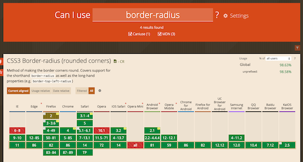
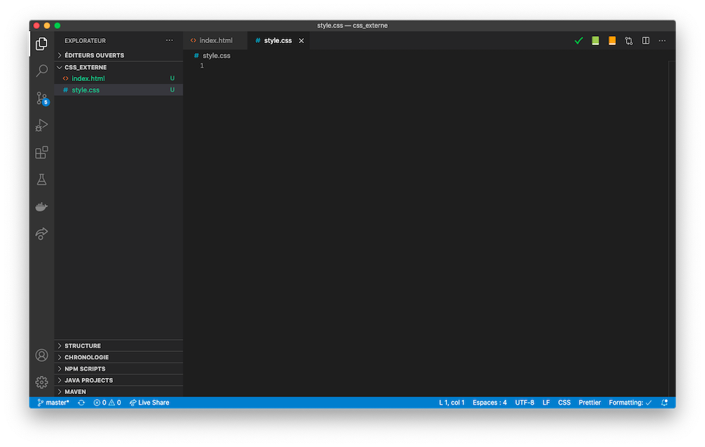
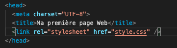
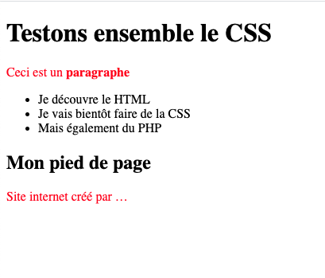

# Découverte de la CSS

::: details Sommaire
[[toc]]
:::

Dans le [TP précédent](./tp1.1.md) votre site a gagné des pages, des liens et des images… mais il ressemble encore à un document de 1995. Dans ce TP nous allons découvrir les bases de la CSS à travers la personnalisation d'une page web.

## Les slides

Avant de commencer, un tour rapide des compétences du jour : la syntaxe d'une règle CSS, les sélecteurs et la cascade.

<ClientOnly>
<SlidesDeck src="introduction_css" />
</ClientOnly>

## Prérequis

- Avoir réalisé les TP précédents ([TP 1](./tp1.md) et [TP 1.1](./tp1.1.md)).

## Objectifs

À la fin de ce TP vous saurez :

- Déclarer une feuille de style externe.
- Écrire une règle CSS (sélecteur, propriété, valeur).
- Cibler des éléments par balise, par `class` et par `id`.

## Introduction

Comme vu dans le cours, vous allez écrire votre première feuille de style. Au travers de différents exemples, nous allons apprendre comment sélectionner, appliquer et personnaliser une page avec la CSS.

Bien évidemment la CSS est un domaine très large, il sera difficile de couvrir l'ensemble des cas d'usage.

### Boite à outils

En tant que développeur vous devez avoir une boite à outils de site web de référence. L'un d'entre eux est [Can I Use](https://caniuse.com/), pour rappel Can I Use est un site qui va nous permettre de vérifier si ce que l'on souhaite utiliser est compatible avec le navigateur que nous ciblons.



Un autre site à avoir en permanence est le site de la MDN. Et dans le cas qui nous intéresse [la référence CSS](https://developer.mozilla.org/fr/docs/Web/CSS/Reference)

::: tip À vos favoris
Votre navigateur possède un système de favoris. N'hésitez pas à l'utiliser :wink:. Les différents liens que je vous communique sont vraiment des éléments à conserver.
:::

## Votre première CSS

Comme vu ensemble nous avons 3 façons de déclarer notre CSS :

- Dans un fichier externe.
- Dans le `head` de notre fichier HTML.
- Directement dans la balise via l'attribut `style=''`.

::: warning Attention
Comme évoqué ensemble pendant le cours, je vous conseille vivement de faire un fichier externe pour déclarer votre CSS. Et d'éviter au maximum de faire des déclarations via l'attribut `style=''`.
:::

### Première étape : Un fichier HTML

Une CSS seule ne veut pas dire grand-chose. Afin de tester certaines fonctionnalités de la CSS, je vous propose le contenu suivant :

```html
<!DOCTYPE html>
<html>
  <head>
    <meta charset="utf-8" />
    <title>Ma première page Web</title>
  </head>
  <body>
    <h1>Testons ensemble la CSS</h1>

    <p>Ceci est un <strong>paragraphe</strong></p>
    <ul>
      <li>Je découvre le HTML</li>
      <li>Je vais bientôt faire de la CSS</li>
      <li>Mais également du PHP</li>
    </ul>

    <h2>Mon pied de page</h2>
    <p>Site internet créé par …</p>
  </body>
</html>
```

Dans un premier temps, validez que votre site fonctionne correctement. Pour ça, affichez celui-ci dans votre navigateur.

::: warning STOP
Double-cliquer sur le fichier « ça fonctionne ». Mais je vous conseille vivement de passer par un serveur web local (type Wamp, Mamp, …). Pourquoi ? Simplement afin de reproduire le plus possible les conditions réelles.
:::

### Étape 2 : La feuille de style

Dans votre éditeur favori créez un nouveau fichier nommé `style.css`. Votre projet doit maintenant ressembler à :



Comme vous pouvez le constater, votre fichier CSS est « à côté » de votre fichier HTML. Si vous voulez le ranger dans un sous-dossier c'est possible, libre à vous de vous organiser comme bon vous semble (dans le fil rouge, nous le rangerons dans un dossier `css/`).

### Étape 3 : Déclarer la feuille de style

Vous avez vos deux fichiers « le HTML et la CSS ». Nous allons donc maintenant ajouter une ligne dans votre fichier HTML dans la balise `<head>` :

```html
<link rel="stylesheet" href="style.css" />
```



::: tip Petite note rapide
La ligne que vous avez ajoutée indique que votre fichier HTML doit charger une autre ressource en même temps que la page. À savoir le fichier style.css
:::

### Étape 4 : Ajouter vos directives CSS

Votre fichier CSS est pour l'instant vide, il n'a donc aucun effet. Je vous propose de commencer par une première directive CSS :

```css
p {
  color: red;
}
```

Ajoutez le code précédent dans votre fichier CSS et rechargez votre page. Allez dans votre navigateur pour constater le changement.



## Et le style dans le head ?

En cours nous avons vu qu'il était également possible de mettre la CSS dans une balise style directement dans le `<head>` de votre page. Je vous laisse tester cette façon de faire.

_Retirer la ligne :_

```html
<link rel="stylesheet" href="style.css" />
```

_Remplacez-la par :_

```html
<style>
  p {
    color: red;
  }
</style>
```

Testez à nouveau votre site.

::: danger Attention
Bien qu'il soit possible de mettre la CSS dans une balise style, je déconseille vraiment cette pratique. En effet, le but de la CSS est de changer l'apparence de **l'ensemble** des pages de votre site. Le but ? Donner un style unique à tout votre site web. Le plus simple est donc de « sortir » la CSS afin que celle-ci soit centralisée à un seul endroit.

Nous le verrons plus tard en PHP ou en JavaScript/Typescript, un développeur doit être organisé et doit rendre générique son travail. L'objectif de cette organisation ? Être efficace dans ses missions quotidiennes.

Dans le cas présent, votre site sera certainement à terme constitué de plusieurs pages… Ça semble donc évident de ne pas « copier / coller » la CSS dans chaque page. Mais évidemment de la mettre dans un fichier externe.
:::

## Quelques explications

Avant de continuer petit rappel vis-à-vis du cours :


Votre fichier CSS sera constitué de règles CSS (sélecteur). Pour l'instant vous n'en avez qu'une seule. Celle-ci indique que le texte de toutes les balises `<p>` doit être rouge.

::: tip Les commentaires en CSS
Comme en HTML, vous pouvez (devez) commenter votre CSS. La syntaxe est différente :

```css
/* Ceci est un commentaire CSS,
   il peut tenir sur plusieurs lignes */
p {
  color: red; /* Ou en fin de ligne */
}
```

:::

## Styliser les titres

Je vous propose maintenant de changer le style des deux titres :

- Augmenter la taille de la police `font-size: 4em`.
- Mettre les textes en bleu `color: #1D2D3A`.

Je vous laisse écrire le sélecteur CSS nécessaire. Celui-ci devrait ressembler à :

```css
votreSelecteurDeTitre {
    font-size: 4em;
    … la suite
}
```

::: details Voir un indice
Je vous rappelle que vous pouvez écrire un sélecteur multiple, et plusieurs lignes comme style.

```css
h1,
h2 {
  font-size: 4em;
  background-color: red;
}
```

:::

## Appliquer le style sur un id ou class

La CSS permet d'appliquer un style de manière fine. Pour l'instant vous avez appliqué la CSS sur « un type d'élément » (p, h1, div… ). Il est possible d'être bien plus précis que ça.

En CSS vous avez la possibilité d'écrire des sélecteurs sur un certain nombre d'éléments, nous allons pour l'instant nous concentrer sur « ceux de base » à savoir les `id` et les `class`. L'id comme la class sont des attributs que nous pouvons ajouter sur une balise HTML.

::: tip Rappel
Un attribut HTML est un élément que vous allez ajouter **dans** la balise HTML. Exemple :

```html
<div class="demo">Ceci est une démo</div>
```

```html
<div id="monId">Ceci est une démo</div>
```

Différence entre `class` et `id` ? L'id doit être unique dans votre page, il va également nous permettre de manipuler simplement l'élément en JavaScript.

:::

## Les balises span et div

Parfois, vous voudrez styliser une portion de page… qui ne correspond à aucune balise existante. Le HTML propose pour ça deux balises « neutres », sans aucun sens particulier :

- `<span>` : pour une portion **dans** une ligne (quelques mots dans un paragraphe).
- `<div>` : pour un **bloc** entier (un groupe d'éléments).

```html
<p>Mon numéro préféré est le <span class="highlight">42</span>.</p>

<div class="carte">
  <h2>Un titre</h2>
  <p>Un contenu regroupé dans un bloc.</p>
</div>
```

::: warning Ne divisez pas tout
`div` et `span` sont des balises « de dernier recours » : si une balise avec du sens existe (un titre, un paragraphe, une liste…), utilisez-la. Un site tout en `div` est illisible, pour les développeurs comme pour les moteurs de recherche. Nous en reparlerons avec les balises structurantes.
:::

### Rappel sur les sélecteurs

Il est difficile de faire un « mémo » sur la CSS. Cependant, vous pouvez retenir cette liste de sélecteurs, elle vous sera toujours utile. C'est en quelque sorte la base :

| Sélecteur | Cible                               |
| --------- | ----------------------------------- |
| \*        | Tous les éléments de la page        |
| #item     | Élément avec id `item`              |
| .item     | Élément(s) avec class `item`        |
| p         | Élément(s) de type `p`              |
| div, p    | Élément(s) de type `div` ou `p`     |
| p i       | Élément(s) de type `i` contenu dans un `p` (descendant) |
| p > i     | Élément(s) de type `i` enfant direct de `p`     |
| .item > i | Élément(s) de type `i` enfant direct de `.item` |

Cette liste est « non-exhaustive ». Consulter [une liste plus complète ici](https://developer.mozilla.org/fr/docs/Web/CSS/CSS_selectors)

## Id ou Class ?

| Sélecteur | Usage                                         |
| --------- | --------------------------------------------- |
| #item     | Élément unique dans votre page                |
| .rouge    | Class réutilisable (multiple) dans votre code |
| p         | L'ensemble des balises de type `<p>`          |

- `class="rouge"` => `.rouge`
- `id="monId"` => `#monId`

::: tip Petite aide mnémotechnique

- `id=` => `#`
- `class=` => `.`

C'est une notation universelle qui sera également valable en JavaScript
:::

### À faire

- Ajouter dans votre page un nouveau paragraphe `p`. Avec comme class `text`. (`<p class='text'>Votre texte</p>`)
- Créer le sélecteur pour personnaliser l'élément.

### À faire 2

- Même opération, mais avec un id

## Modifier votre premier projet

Maintenant que vous savez faire quelques « sélecteurs » en CSS. Je vous laisse reprendre vos premières pages pour tenter de modifier un peu le style.

En manque d'inspiration ? [CodePen vous aidera à trouver des idées](https://codepen.io/)

## Le fil rouge : votre blog

Votre blog mérite lui aussi sa feuille de style, c'est parti :

- Dans le dossier `blog`, créer un dossier `css`.
- Dans le dossier `css`, créer un fichier `style.css`.
- Définir une première charte graphique pour vos titres (police, tailles, couleurs) et l'écrire dans `style.css`.
- Faire le lien vers la feuille de style dans **toutes** les pages du blog (l'index **et** l'article).
- Et normalement tout fonctionne 😊 ou non, donc au boulot !

::: details Coup de pouce : le chemin depuis l'article
Votre page article est dans le dossier `article/`, mais la CSS est dans `css/`. Le `href` du `<link>` n'est donc pas le même que depuis l'index… Le `../` vu au TP précédent va encore servir.
:::

::: tip Point de contrôle
La même charte s'applique sur toutes les pages du blog (modifiez une couleur dans `style.css` : tout le site change d'un coup). Faites-moi valider avant de partir.
:::

## Conclusion

Dans ce TP vous avez :

- Déclaré une feuille de style externe, partagée entre les pages.
- Écrit vos premières règles CSS (sélecteur, propriété, valeur).
- Ciblé des éléments par balise, `class` et `id`.
- Donné une première charte graphique à votre blog.

Pensez à sauvegarder votre travail. La suite : [le texte, les couleurs et les fonds](./tp2.1.md), pour donner une vraie personnalité à vos pages.

👋 Si vous avez des questions, n'hésitez pas.
