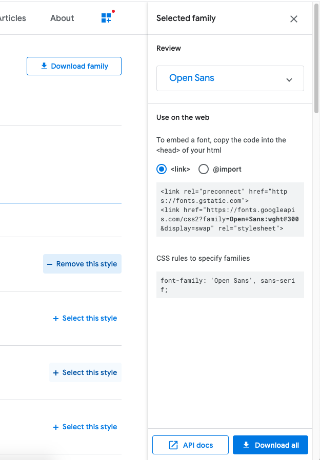
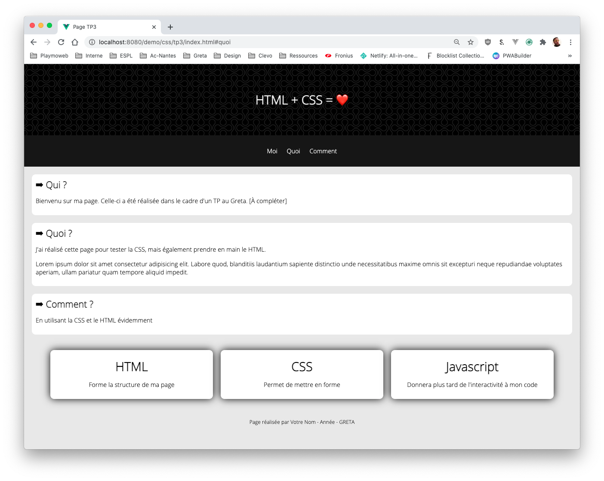
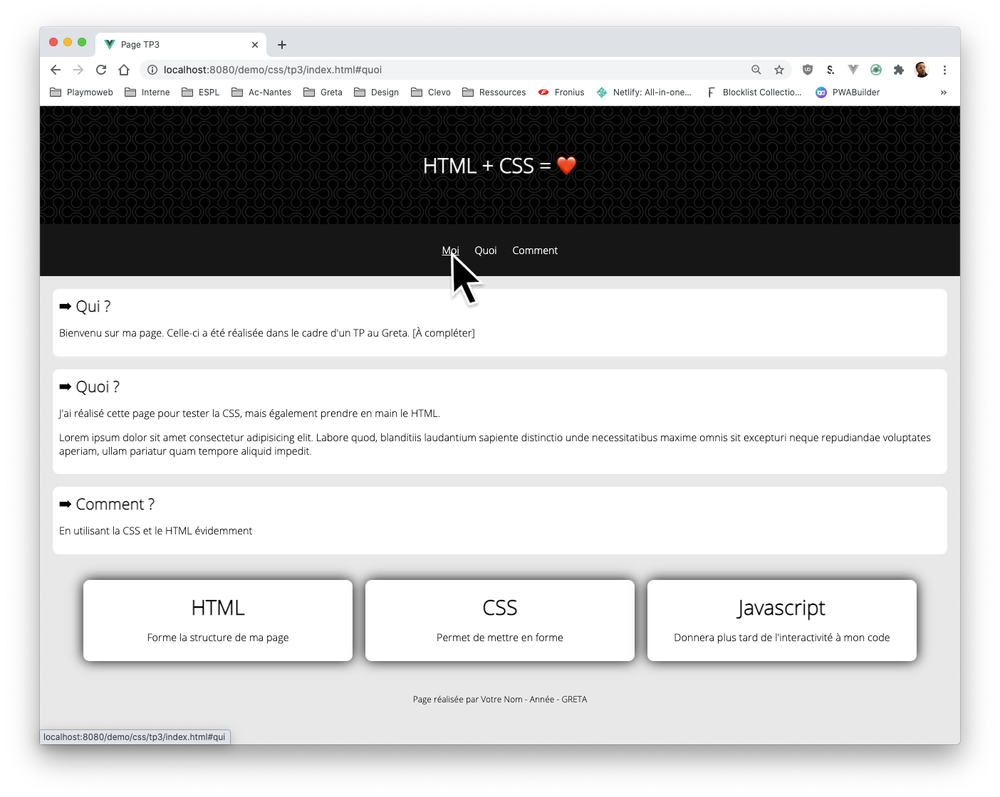
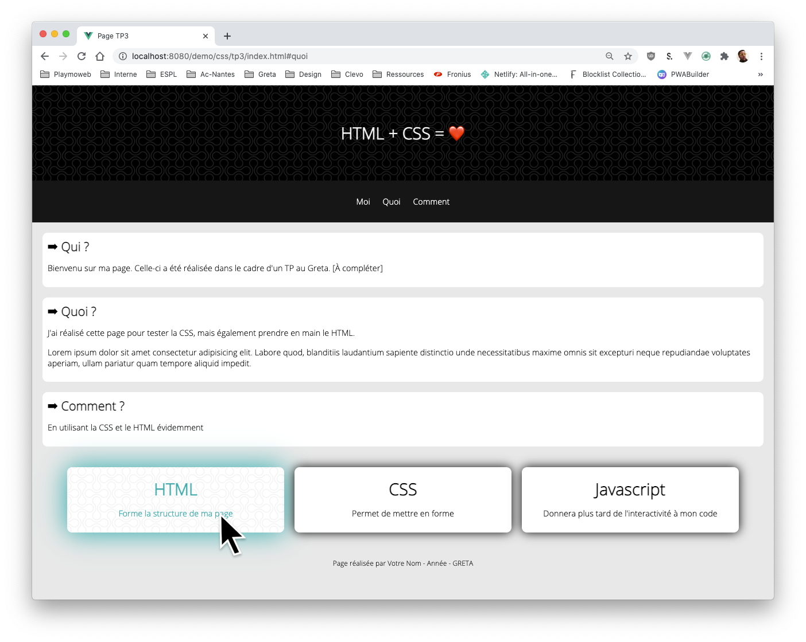
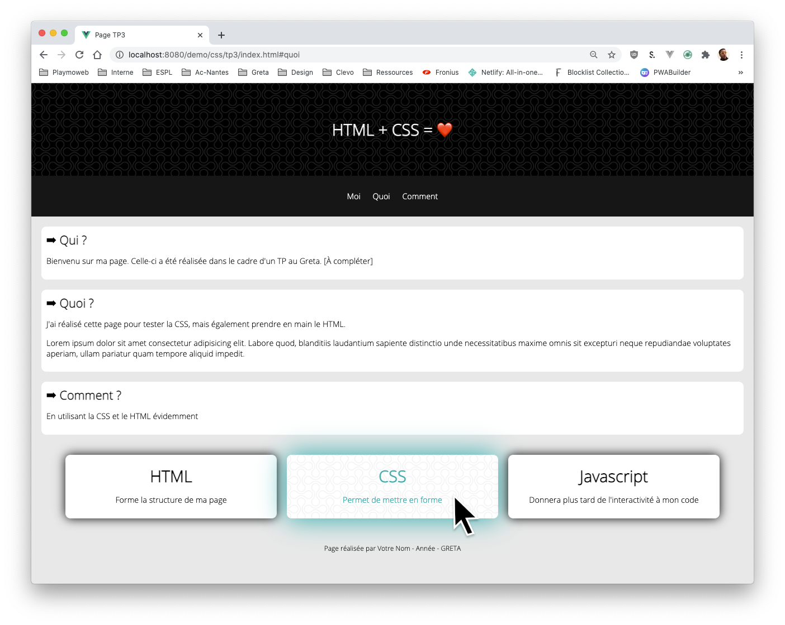
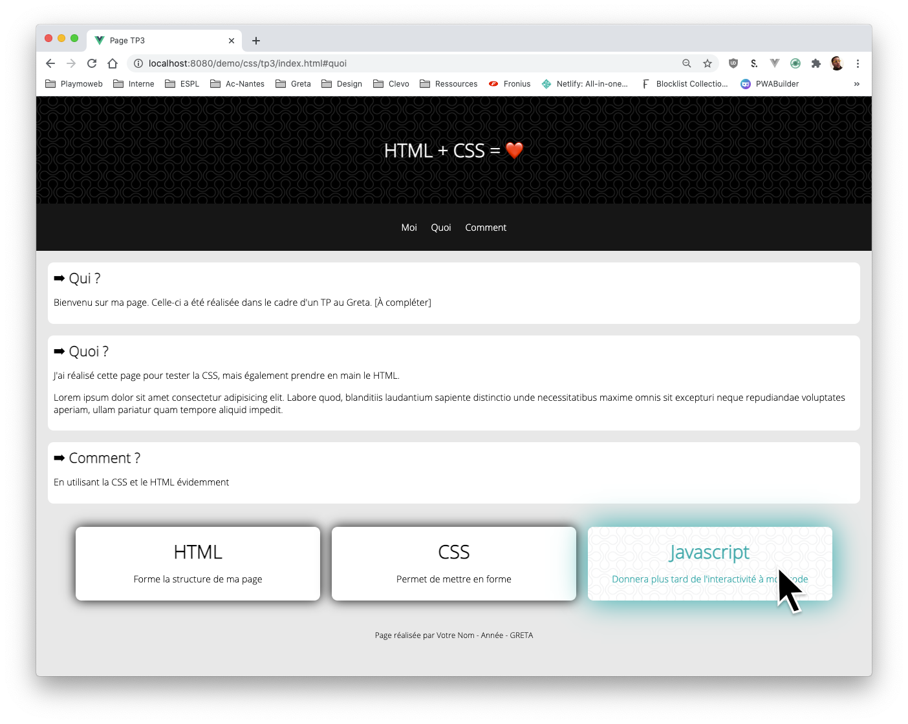

# Mise en pratique CSS

Nous avons vu « beaucoup » d'élément de manière théorique, il faut maintenant pratiquer pour assimiler l'ensemble des concepts. Le plus simple, et surtout le plus efficace c'est de réaliser une vraie page Web.

Dans ce TP, je vais vous donner une base de code HTML « mais sans CSS ». Je vous donne le résultat à obtenir, et grâce aux ressources vues ensemble ([et listée ici](/tp/html_css/support.html)) je vous laisse (avec mon aide si besoin) réaliser la feuille de style nécessaire.

## Code source

Voilà le code source

```html
<!DOCTYPE html>
<html lang="en">
  <head>
    <meta charset="UTF-8" />
    <title>Page TP3</title>
  </head>
  <body>
    <header>
      <h1>HTML + CSS = ❤️</h1>
    </header>

    <nav>
      <ul>
        <li><a href="#qui">Moi</a></li>
        <li><a href="#quoi">Quoi</a></li>
        <li><a href="#comment">Comment</a></li>
      </ul>
    </nav>

    <main>
      <section id="qui">
        <h2>Qui ?</h2>
        <p>
          Bienvenu sur ma page. Celle-ci a été réalisée dans le cadre d'un TP au
          Greta. [À compléter]
        </p>
      </section>

      <section id="quoi">
        <h2>Quoi ?</h2>
        <p>
          J'ai réalisé cette page pour tester la CSS, mais également prendre en
          main le HTML.
        </p>
        <p>
          Lorem ipsum dolor sit amet consectetur adipisicing elit. Labore quod,
          blanditiis laudantium sapiente distinctio unde necessitatibus maxime
          omnis sit excepturi neque repudiandae voluptates aperiam, ullam
          pariatur quam tempore aliquid impedit.
        </p>
      </section>

      <section id="comment">
        <h2>Comment ?</h2>
        <p>En utilisant la CSS et le HTML évidemment</p>
      </section>

      <section class="article_col">
        <article>
          <h3>HTML</h3>
          <p>Forme la structure de ma page</p>
        </article>

        <article>
          <h3>CSS</h3>
          <p>Permet de mettre en forme</p>
        </article>

        <article>
          <h3>Javascript</h3>
          <p>Donnera plus tard de l'interactivité à mon code</p>
        </article>
      </section>
    </main>

    <footer>Page réalisée par Votre Nom - Année - GRETA</footer>
  </body>
</html>
```

Je vous laisse créer le fichier sur votre disque.

::: tip Je vous aide un peu
J'ai préparé dans le code quelques class, mais il faudra très certainement en ajouter. Si vous pensez également qu'il faut ajouter des balises HTML aucun problème, le code fourni est une base.
:::

## Les images « ressources »

Les images à utiliser dans votre page :

- Dans le header en haut.
- Au survol sur le card en bas.


## La font

La police à utiliser dans le projet est la suivante `Open Sans`

Pour ça vous pouvez utiliser [le site Google Font](https://fonts.google.com/specimen/Open+Sans)



## L'objectif

Voilà le rendu de la page que je souhaite.

La page de base :



Les différents survol :




