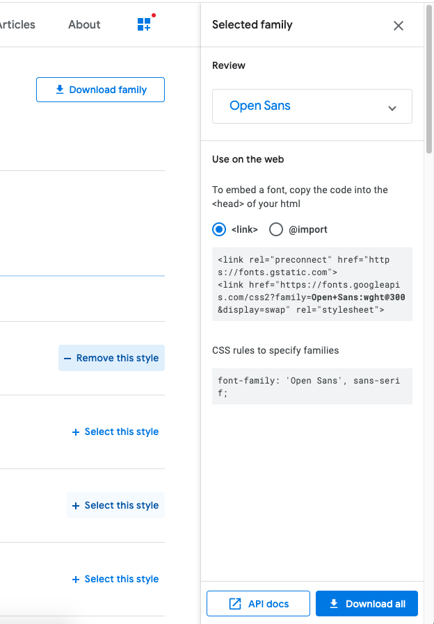
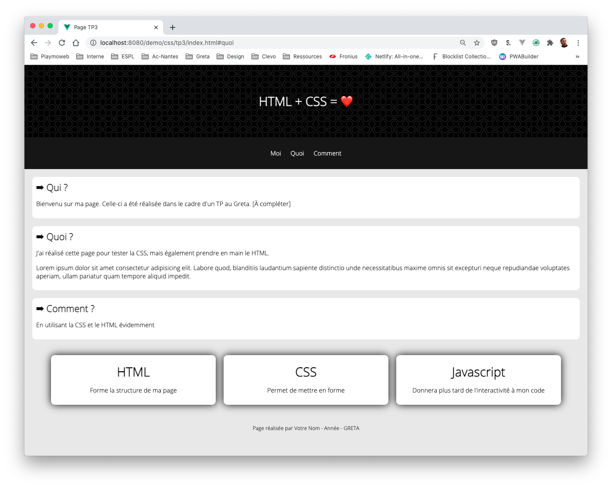
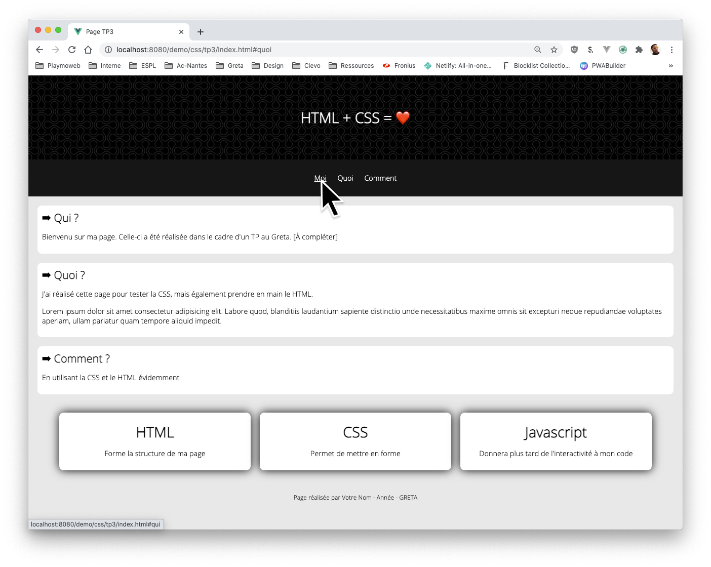
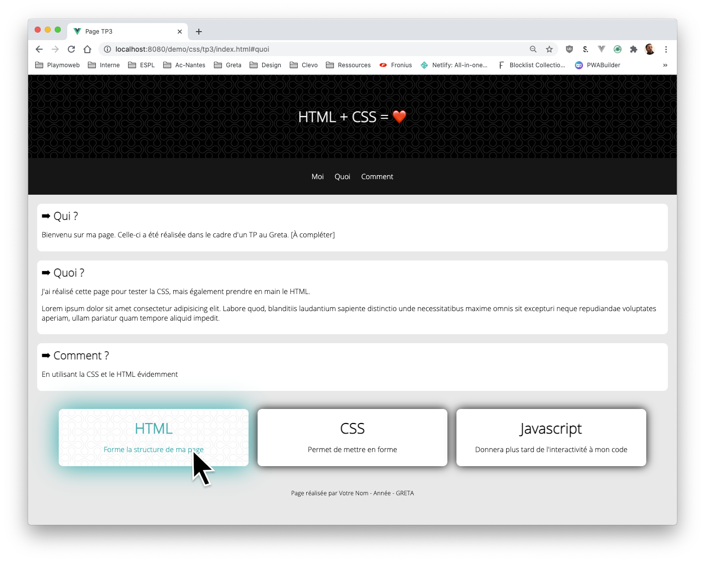
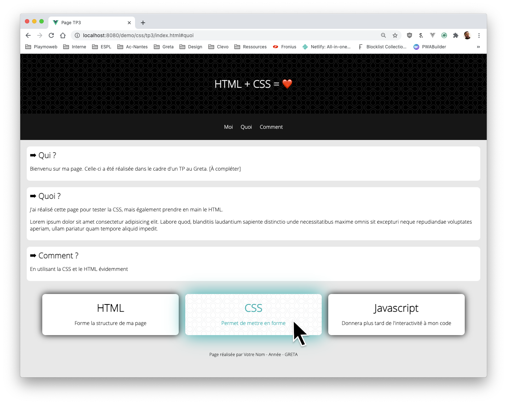
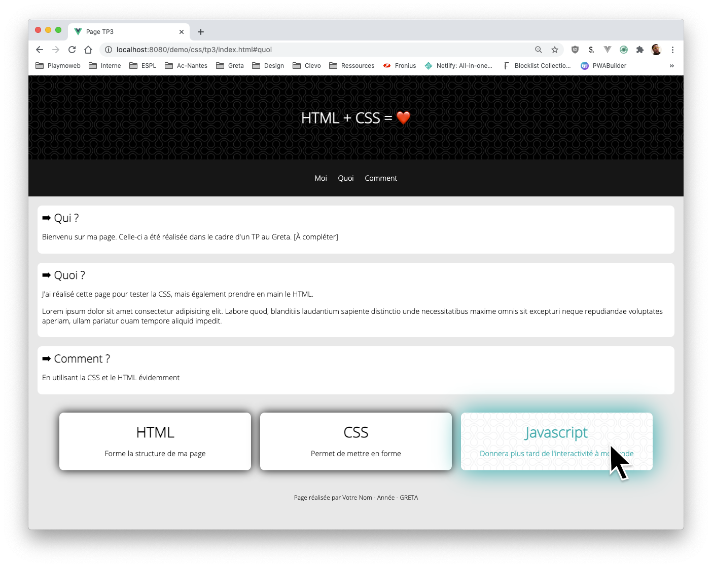

# Mise en pratique CSS

::: details Sommaire
[[toc]]
:::

Nous avons vu « beaucoup » d'éléments de manière théorique, il faut maintenant pratiquer pour assimiler l'ensemble des concepts. Le plus simple, et surtout le plus efficace c'est de réaliser une vraie page Web.

Dans ce TP, je vais vous donner une base de code HTML « mais sans CSS ». Je vous donne le résultat à obtenir, et grâce aux ressources vues ensemble ([et listées ici](/tp/html_css/support.html)) je vous laisse (avec mon aide si besoin) réaliser la feuille de style nécessaire.

## Les slides

Avant de commencer, un tour rapide de la compétence du jour : les balises structurantes du HTML 5.

<ClientOnly>
<SlidesDeck src="html_semantique" />
</ClientOnly>

## Prérequis

- Avoir réalisé les TP précédents (jusqu'au [TP 2.2](./tp2.2.md)).

## Objectifs

À la fin de ce TP vous saurez :

- Structurer une page avec les balises sémantiques du HTML 5.
- Reproduire une maquette complète en CSS.

## La structure sémantique

Jusqu'ici, vos pages étaient une suite de titres et de paragraphes. Le HTML 5 propose des balises pour **découper** votre page en zones qui ont du sens :

| Balise      | Utilité                            |
| ----------- | ---------------------------------- |
| `<header>`  | L'en-tête (logo, bannière, titre)  |
| `<nav>`     | Les liens de navigation            |
| `<main>`    | Le contenu principal de la page    |
| `<section>` | Une partie thématique du contenu   |
| `<article>` | Un contenu autonome (un article de blog par exemple) |
| `<aside>`   | Un contenu complémentaire (encart) |
| `<footer>`  | Le pied de page (contact, mentions légales) |

Vous allez retrouver toutes ces balises dans le code source que je vous fournis juste en dessous : regardez-le avec cette grille de lecture.

::: details Question : pourquoi ne pas tout faire avec des div ?
Visuellement, ça marcherait : une `div` stylée en CSS ressemble à s'y méprendre à un `header`. Mais ces balises apportent du **sens** : un lecteur d'écran peut sauter directement au contenu principal, Google comprend ce qui est de la navigation et ce qui est du contenu, et votre code est infiniment plus lisible pour un autre développeur. Même rendu, mais meilleure accessibilité, meilleur référencement, meilleure maintenance : il n'y a que des avantages.
:::

## Code source

Voilà le code source

```html
<!DOCTYPE html>
<html lang="fr">
  <head>
    <meta charset="UTF-8" />
    <title>Page TP3</title>
  </head>
  <body>
    <header>
      <h1>HTML + CSS = ❤️</h1>
    </header>

    <nav>
      <ul>
        <li><a href="#qui">Moi</a></li>
        <li><a href="#quoi">Quoi</a></li>
        <li><a href="#comment">Comment</a></li>
      </ul>
    </nav>

    <main>
      <section id="qui">
        <h2>Qui ?</h2>
        <p>
          Bienvenue sur ma page. Celle-ci a été réalisée dans le cadre d'un TP
          en BTS SIO. [À compléter]
        </p>
      </section>

      <section id="quoi">
        <h2>Quoi ?</h2>
        <p>
          J'ai réalisé cette page pour tester la CSS, mais également prendre en
          main le HTML.
        </p>
        <p>
          Lorem ipsum dolor sit amet consectetur adipisicing elit. Labore quod,
          blanditiis laudantium sapiente distinctio unde necessitatibus maxime
          omnis sit excepturi neque repudiandae voluptates aperiam, ullam
          pariatur quam tempore aliquid impedit.
        </p>
      </section>

      <section id="comment">
        <h2>Comment ?</h2>
        <p>En utilisant la CSS et le HTML évidemment</p>
      </section>

      <section class="article_col">
        <article>
          <h3>HTML</h3>
          <p>Forme la structure de ma page</p>
        </article>

        <article>
          <h3>CSS</h3>
          <p>Permet de mettre en forme</p>
        </article>

        <article>
          <h3>Javascript</h3>
          <p>Donnera plus tard de l'interactivité à mon code</p>
        </article>
      </section>
    </main>

    <footer>Page réalisée par Votre Nom - Année - BTS SIO</footer>
  </body>
</html>
```

Je vous laisse créer le fichier sur votre disque.

::: tip Je vous aide un peu
J'ai préparé dans le code quelques class, mais il faudra très certainement en ajouter. Si vous pensez également qu'il faut ajouter des balises HTML aucun problème, le code fourni est une base.
:::

## Les images « ressources »

Les images à utiliser dans votre page :

- Dans le header en haut.
- Au survol sur la card en bas.


## La font

La police à utiliser dans le projet est la suivante `Open Sans`

Pour ça vous pouvez utiliser [le site Google Font](https://fonts.google.com/specimen/Open+Sans)



## L'objectif

Voilà le rendu de la page que je souhaite.

La page de base :



Les différents survols :





C'est à vous de jouer ! Tout ce qu'il faut pour y arriver a été vu dans les TP précédents (et se retrouve dans [le support](/tp/html_css/support.md)).

::: tip Point de contrôle
Votre page ressemble à la maquette : la police est chargée, le header a son image de fond, et les survols fonctionnent. Faites-moi valider avant de partir.
:::

## Conclusion

Dans ce TP vous avez :

- Découvert les balises structurantes du HTML 5 (`header`, `nav`, `main`, `section`, `article`, `aside`, `footer`).
- Reproduit une page complète à partir d'une maquette, comme en entreprise.

Pensez à sauvegarder votre travail. Il reste un problème : réduisez la fenêtre de votre navigateur… pas très joli sur mobile n'est-ce pas ? La suite : [le responsive](./tp4.md) !

👋 Si vous avez des questions, n'hésitez pas.
