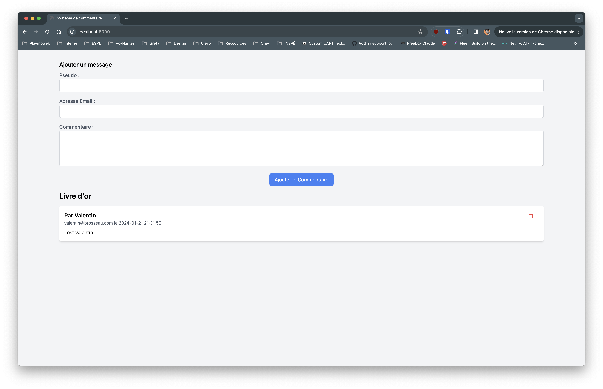
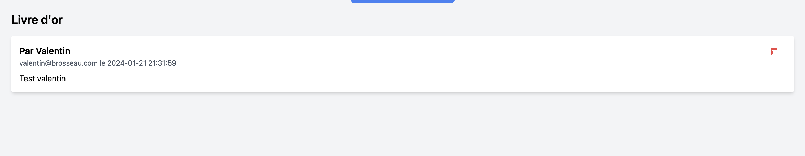

# Découverte de HTMX

::: details Sommaire
[[toc]]
:::

## Prérequis

Dans ce TP nous allons voir comment intégrer HTMX dans un projet pour le rendre dynamique (via des appels AJAX). Pour réaliser ce TP, nous allons créer un projet Laravel fictif qui nous servira de base pour intégrer HTMX.

Comprendre le fonctionnement de l'Ajax (client/serveur) et surtout le principe de l'asynchrone.

## Introduction

[HTMX](https://htmx.org) est une librairie JavaScript permettant de simplifier le chargement de contenu dynamique. Elle permet de faire des appels AJAX sans avoir à écrire une seule ligne de JavaScript. Elle est très simple à utiliser et permet de rendre un site web dynamique en quelques minutes. C'est une alternative au gros framework JavaScript comme VueJS ou ReactJS.

Évidemment, HTMX ne permet pas de faire l'ensemble des choses que nous pouvons faire avec VueJS par exemple. Elle prend du sens dans des projets ou nous avons un serveur en mesure de générer du contenu HTML (Laravel dans notre cas). En effet, VueJS permet de générer très facilement des SPA (Single Page Application) mais écrire des SPA n'est pas toujours la meilleure des solutions (exemple d’une application de gestion de stock complexe).

Il faut donc bien comprendre que HTMX n'est pas un concurrent de VueJS ou ReactJS mais plutôt une alternative au tout JavaScript actuellement très populaire.

Vous le verrez dans ce TP, HTMX est très simple à utiliser et permet de rendre un site web dynamique en quelques minutes.

## Les technologies

Pour réaliser ce TP, nous allons utiliser les technologies suivantes :

- [Laravel](https://laravel.com) : Framework PHP permettant de créer rapidement des applications web.
- [HTMX](https://htmx.org) : Librairie JavaScript permettant de simplifier le chargement de contenu dynamique.
- [TailwindCSS](https://tailwindcss.com) : Framework CSS permettant de créer rapidement des interfaces web.

## Le fonctionnement de HTMX

HTMX est une librairie JavaScript permettant de simplifier le chargement de contenu dynamique. Elle permet de faire des appels AJAX sans avoir à écrire une seule ligne de JavaScript.

Nous allons avoir à notre disposition de nouveaux attributs HTML qui vont nous permettre de faire les actions relatives à l'Ajax. Sans être exhaustif, voici les principaux attributs que nous allons utiliser :

- `hx-get` : Permet de faire une requête AJAX de type `GET`.
- `hx-post` : Permet de faire une requête AJAX de type `POST`.
- `hx-trigger` : Permet de définir l'événement qui va déclencher la requête AJAX (exemple : `load`, `click`, `mouseover`, etc.).
- `hx-target` : Permet de définir l'endroit qui recevra le résultat de la requête AJAX.
- `hx-swap` : Permet de définir le type de remplacement du contenu (exemple : `outerHTML`, `innerHTML`, `afterbegin`, etc.).

Contrairement à ce que nous avons vu avec les API Rest, HTMX va nous permettre de charger directement du HTML depuis le serveur. C'est-à-dire que nous allons pouvoir insérer directement du HTML dans notre page sans avoir à le générer en JavaScript.

Pour plus d'informations sur les attributs, je vous invite à consulter la [documentation officielle](https://htmx.org/docs/).

::: tip Un instant

HTMX a pour vocation d'être très simple à utiliser, il ne faut donc pas se retourner le cerveau pour comprendre comment ça fonctionne. Il suffit de lire la documentation et de l'appliquer.

La meilleure des démos c'est de voir HTMX en action [en consultant les exemples](https://htmx.org/examples/).

:::

## Le projet

Le projet que nous allons réaliser est un système de livre d'or très simple, le principe est simple :

- Liste des messages.
- Ajout d'un message.
- Suppression d'un message.



::: tip Le point de l'ancien !

Le fait de charger directement du HTML depuis le serveur était en quelque sorte passé de mode. En effet, les API Rest comme nous l'avons vu dans les TP précédents sont très populaires (car ils permettent de connecter des clients de type différent). Cependant, le fait de charger du HTML depuis le serveur permet de simplifier le développement et de réduire la quantité de code à écrire.

Avec la montée en complexité des applications web, certains se tournent à nouveau vers des solutions « très simples » comme HTMX. Pour avoir à nouveau des projets simples sans avoir à écrire des centaines de lignes de code pour des cas d'usage simple.

:::

Vous êtes prêt ? C'est parti !

<iframe src="https://giphy.com/embed/BpGWitbFZflfSUYuZ9" width="480" height="400" frameBorder="0" class="giphy-embed" allowFullScreen></iframe>

## Créer le projet

Pour commencer, nous allons créer un projet Laravel vide.

```sh
composer create-project laravel/laravel htmx-comment
```

Une fois le projet créé, nous allons créer une base de données et modifier le fichier `.env` pour y ajouter les informations de connexion de votre base de données.

::: tip Pourquoi Laravel ?

Laravel est populaire et permet de créer rapidement un projet, tout en utilisant de bonnes pratiques de développement. Évidemment si vous le souhaitez vous pouvez utiliser un autre langage/framework pour réaliser ce TP (exemple, Django, Flask et jinja2 pour Python, bun, etc.).

L'important ici est de comprendre la logique de HTMX et non pas de savoir utiliser Laravel.

:::

## La base de données

Pour ce projet, nous allons utiliser la base de données suivante :

```sql
CREATE TABLE `comments` (
  `id` int(11) NOT NULL,
  `pseudo` varchar(255) NOT NULL,
  `email` varchar(255) NOT NULL,
  `commentaire` text NOT NULL,
  `created_at` datetime NOT NULL DEFAULT current_timestamp()
) ENGINE=InnoDB DEFAULT CHARSET=utf8mb4 COLLATE=utf8mb4_general_ci;
```

Notre table `comments` contient les champs suivants :

- `id` : Identifiant du commentaire (clé primaire, auto-incrémentée).
- `pseudo` : Pseudo de l'auteur du commentaire.
- `email` : Adresse email de l'auteur du commentaire.
- `commentaire` : Contenu du commentaire.
- `created_at` : Date de création du commentaire.

Comme pour les autres TP, vous pouvez utiliser Reliese/Laravel pour générer les modèles Eloquent :

```sh
composer require reliese/laravel --dev                   
php artisan vendor:publish --tag=reliese-models
php artisan config:clear
```

Puis importer le modèle de la table `comments` :

```sh
php artisan code:models --table=comments
```

::: danger Rappel

La commande ci-dessus va créer **pour vous** le modèle Eloquent pour accéder à votre base de données. Il est stocké dans le dossier `app/Models/` fichier `Comment.php`.

:::

## Le contrôleur

Nous allons maintenant créer le contrôleur qui va nous permettre de gérer les commentaires. Il regroupera les méthodes suivantes :

- `index` : La page d'accueil.
- `comments` : Liste des commentaires (via une requête AJAX).
- `store` : Ajout d'un commentaire (via une requête AJAX).
- `delete` : Suppression d'un commentaire par son identifiant (via une requête AJAX).

```sh
php artisan make:controller CommentController
```

## La méthode `index`

La méthode `index` va nous permettre d'afficher la page d'accueil. Vu que nous allons utiliser de l'ajax, notre template Blade sera très simple.

```php
public function index()
{
    return view('index');
}
```

```html
<!DOCTYPE html>
<html lang="fr">
<head>
    <meta charset="UTF-8">
    <meta name="viewport" content="width=device-width, initial-scale=1.0">
    <title>Livre d'or</title>
    <script src="https://cdn.tailwindcss.com"></script>
</head>
<body class="bg-gray-100">

<div class="container mx-auto mt-8">
    <h2 class="text-lg font-semibold mb-2">Ajouter un message</h2>
    <form class="bg-white p-4 rounded-md shadow-md">
        <div class="mb-4">
            <label for="pseudo" class="block text-gray-600 font-medium">Pseudo :</label>
            <input type="text" id="pseudo" name="pseudo" class="w-full p-2 border border-gray-300 rounded-md">
        </div>
        <div class="mb-4">
            <label for="email" class="block text-gray-600 font-medium">Adresse Email :</label>
            <input type="email" id="email" name="email" class="w-full p-2 border border-gray-300 rounded-md">
        </div>
        <div class="mb-4">
            <label for="commentaire" class="block text-gray-600 font-medium">Commentaire :</label>
            <textarea id="commentaire" name="commentaire" rows="4"
                        class="w-full p-2 border border-gray-300 rounded-md"></textarea>
        </div>
        <div class="text-center">
            <button type="submit" class="px-4 py-2 bg-blue-500 text-white rounded-md">
                Ajouter le Commentaire
            </button>
        </div>
    </form>

    <h1 class="text-2xl font-semibold mb-4 mt-4">Les messages</h1>
    <div class="mb-8" id="comments">
        <!-- Ici nous allons insérer les commentaires -->
    </div>
</div>

</body>
</html>
```

Je vous laisse créer le fichier `index.blade.php` dans le dossier `resources/views/` pour y mettre le code ci-dessus. Maintenant que nous avons la structure de base, nous allons pouvoir passer à la suite.

Modifier maintenant le fichier `routes/web.php` pour y déclarer la route `/` qui va appeler la méthode `index` du contrôleur `CommentController` :

::: details Un doute ?

```php
Route::get('/', [CommentController::class, 'index']);
```

:::

Et c'est tout ! Nous avons maintenant une page d'accueil qui affiche un formulaire et plus bas la liste des commentaires (vide pour le moment).

## La méthode `comments`

La méthode `comments` va nous permettre de récupérer la liste des commentaires. Pour cela, nous allons utiliser le modèle `Comment` que nous avons généré précédemment.

```php
public function comments()
{
    $comments = Comment::orderBy('created_at', 'desc')->get();
    return view("comments", ["comments" => $comments]);
}
```

Et oui, c'est tout ! Notre méthode va récupérer la liste des commentaires et les passer à la vue `comments` qui va se charger de les afficher. Pour cela, nous allons créer le fichier `comments.blade.php` dans le dossier `resources/views/` :

```php
<div>
    @forelse($comments as $comment)
    <div class="bg-white p-4 rounded-md shadow-md mb-4 flex root">
        <div class="flex-grow">
            <h3 class="text-lg font-semibold">Par {{$comment->pseudo}}</h3>
            <p class="text-gray-600 text-sm">{{$comment->email}} le {{$comment->created_at}}</p>
            <p class="mt-2 whitespace-pre-wrap">{{$comment->commentaire}}</p>
        </div>
        <span>
            <button class="px-4 py-2 text-red-500 rounded-md">
                <svg xmlns="http://www.w3.org/2000/svg" width="16" height="16" fill="currentColor" class="bi bi-trash" viewBox="0 0 16 16">
                    <path d="M5.5 5.5A.5.5 0 0 1 6 6v6a.5.5 0 0 1-1 0V6a.5.5 0 0 1 .5-.5m2.5 0a.5.5 0 0 1 .5.5v6a.5.5 0 0 1-1 0V6a.5.5 0 0 1 .5-.5m3 .5a.5.5 0 0 0-1 0v6a.5.5 0 0 0 1 0z"/>
                    <path d="M14.5 3a1 1 0 0 1-1 1H13v9a2 2 0 0 1-2 2H5a2 2 0 0 1-2-2V4h-.5a1 1 0 0 1-1-1V2a1 1 0 0 1 1-1H6a1 1 0 0 1 1-1h2a1 1 0 0 1 1 1h3.5a1 1 0 0 1 1 1zM4.118 4 4 4.059V13a1 1 0 0 0 1 1h6a1 1 0 0 0 1-1V4.059L11.882 4zM2.5 3h11V2h-11z"/>
                </svg>
            </button>
        </span>
    </div>
    @empty
        <p class="text-gray-600">Aucun commentaire pour le moment.</p>
    @endforelse
</div>
```

Comme vous pouvez le voir, nous avons une boucle `@forelse` qui va parcourir la liste des commentaires et les afficher. Si la liste est vide, nous affichons un message.

Tester votre code, ajouter une route `/comments` qui va appeler la méthode `comments` du contrôleur `CommentController`. Cette route doit être de type `GET`.

::: details Un doute ?

```php
Route::get('/comments', [CommentController::class, 'comments']);
```

:::

Après avoir ajouté la route, vous pouvez tester votre code en vous rendant sur l'URL `/comments`. Vous pouvez tester le fonctionnement en ajoutant des commentaires directement dans la base de données.

Pour l'instant rien de bien compliqué, nous avons juste une page qui affiche la liste des commentaires. Nous allons maintenant passer à la partie dynamique. Pour ça nous allons voir comment ajouter HTMX à notre projet.

## Ajouter HTMX

Comme je le disais en introduction, HTMX est relativement simple. Il s'utilise en appliquant des attributs HTML sur les éléments que vous souhaitez rendre dynamiques. Pour commencer, nous allons ajouter HTMX à notre projet.

Dans l'entête de notre page, nous allons ajouter les lignes suivantes :

```html
<script src="https://unpkg.com/htmx.org@1.9.10"></script>
<script>
    // Permet d'ajouter le token CSRF à chaque requête AJAX,
    // pour éviter les erreurs 419, spécifiques à Laravel.
    document.addEventListener('DOMContentLoaded', function () {
        document.body.addEventListener('htmx:configRequest', (event) => {
            event.detail.headers['X-CSRF-Token'] = '{{ csrf_token() }}';
        })
    });
</script>
<style>
    div.htmx-swapping div {
        opacity: 0;
        transition: opacity 1s ease-out;
    }
</style>
```

Détaillons un peu ce code :

- La première ligne permet d'ajouter HTMX à notre projet. Nous utilisons le CDN fourni dans la documentation officielle.
- Le second script permet d'ajouter le token CSRF à chaque requête AJAX, pour éviter les erreurs 419, **spécifiques à Laravel.**  Si vous n'utilisez pas Laravel, vous pouvez supprimer cette ligne.
- Le style va nous permettre d'ajouter une transition lors du remplacement du contenu (dans le cas de la suppression d'un commentaire ici).

Et voilà, votre projet est maintenant configuré pour utiliser HTMX. Première étape de faite ! Passons maintenant à la partie chargement de la liste des commentaires.

## La liste des commentaires

Pour charger la liste des commentaires, nous allons utiliser la méthode `comments` que nous avons créée précédemment. Pour cela, nous allons utiliser l'attribut `hx-get` sur le conteneur `div` qui contient la liste des commentaires.

Je vous laisse trouver la partie du code HTML qui correspond à la liste de commentaires pour le modifier comme ceci :

```html
<div class="mb-8" hx-get="/comments" hx-trigger="load" id="comments"></div>
```

Nous avons ici ajouté deux attributs :

- `hx-get` : Permet de faire une requête AJAX de type `GET`. Nous allons appeler la route `/comments` qui va nous retourner la liste des commentaires.
- `hx-trigger` : Permet de définir l'événement qui va déclencher la requête AJAX. Ici nous allons déclencher la requête AJAX au chargement de la page.

Je vous laisse tester votre code. Si tout fonctionne, vous devriez avoir la liste des commentaires qui s'affiche.



::: tip Un instant

Pourquoi `hx-get` et non pas `hx-post` ? Car nous n'avons pas besoin de passer de données à notre route. Nous voulons juste récupérer la liste des commentaires. Et vous avez du déclarer la route `/comments` en `GET` et non pas en `POST`.

:::

Ça semble évident ? Parfait ! C'est le principe de HTMX.

## Ajouter un commentaire

Maintenant que nous avons la liste des commentaires, nous allons pouvoir passer à l'ajout d'un commentaire. Pour cela, nous allons utiliser l'attribut `hx-post` sur le formulaire d'ajout de commentaire.

```html
    <form hx-post="/comment" hx-target="#comments" hx-on::after-request="this.reset()" class="bg-white p-4 rounded-md shadow-md">
```

Nous avons ici ajouté trois attributs :

- `hx-post` : Permet de faire une requête AJAX de type `POST`. Nous allons appeler la route `/comment` qui va nous permettre d'ajouter un commentaire.
- `hx-target` : Permet de définir l'endroit qui recevra le résultat de la requête AJAX. Ici nous allons remplacer le contenu du conteneur `div` qui contient la liste des commentaires.
- `hx-on::after-request` : Permet de définir une action à effectuer après la requête AJAX. Ici nous allons réinitialiser le formulaire (`this.reset()` va effacer l'ensemble des champs du formulaire).

Je vous laisse modifier votre code pour qu'il ressemble au code ci-dessus, puis nous allons maintenant passer à la partie serveur.

### La route

Pour ajouter un commentaire, nous allons utiliser la route `/comment` qui va appeler la méthode `store` du contrôleur `CommentController`. Cette route doit être de type `POST`.

::: details Un doute ?

```php
Route::post('/comment', [CommentController::class, 'store']);
```

:::

### La méthode `store`

La méthode `store` va nous permettre d'ajouter un commentaire. Pour cela, nous allons utiliser le modèle `Comment` que nous avons généré précédemment. HTMX ne change pas le fonctionnement de Laravel et du HTML au sens strict. Vous avez donc accès aux données du formulaire via la variable $request.

```php
public function store(Request $request)
{
    // Méthode à compléter
    // Vous devez ici ajouter un commentaire dans la base de données.
    // $comment = new Comment();
    // …
    // Pour récupérer les données du formulaire, vous pouvez utiliser la variable $request.
    // Exemple : $request->pseudo pour récupérer le pseudo. etc.


    // Puis retourner la liste des commentaires.
    return redirect()->route("comments");
}
```

::: tip Et la validation ?

N'oubliez pas, Laravel intègre un système de validation très puissant. Vous pouvez donc valider les données du formulaire avant de les enregistrer dans la base de données.

Le code suivant permet de valider les données du formulaire avant de les enregistrer dans la base de données :

```php
$this->validate($request, [
    "pseudo" => "required",
    "email" => "required|email",
    "commentaire" => "required"
]);
```

:::

À vous de jouer ! Vous devez maintenant ajouter un commentaire dans la base de données puis retourner la liste des commentaires.

::: tip Un instant

Avez-vous regardé pourquoi nous n'avions pas besoin de vue en retour ? Car nous avons défini l'attribut `hx-target` sur le formulaire. HTMX va donc remplacer le contenu du conteneur `div` qui contient la liste des commentaires par le résultat de la requête AJAX.

Requête AJAX qui va retourner la liste des commentaires (via la méthode `comments` du contrôleur `CommentController`).

:::

### Tester votre code

Vous pouvez maintenant tester votre code. Si tout fonctionne, vous devriez pouvoir ajouter des commentaires dans la base de données et voir la liste des commentaires se mettre à jour.

## Supprimer un commentaire

Nous avons maintenant la possibilité d'ajouter des commentaires, il nous reste plus qu'à pouvoir les supprimer. Pour cela, nous allons utiliser l'attribut `hx-delete` sur le bouton de suppression.

```html
<button hx-delete="/comment/{{$comment->id}}" class="px-4 py-2 text-red-500 rounded-md">
```

Nous avons ici ajouté un attribut :

- `hx-delete` : Permet de faire une requête AJAX de type `DELETE`. Nous allons appeler la route `/comment/{id}` qui va nous permettre de supprimer un commentaire.

Je vous laisse modifier votre code pour qu'il ressemble au code ci-dessus, puis nous allons maintenant passer à la partie serveur.

### La route

Pour supprimer un commentaire, nous allons utiliser la route `/comment/{id}` qui va appeler la méthode `delete` du contrôleur `CommentController`. Cette route doit être de type `DELETE`.

::: details Un doute ?

```php
Route::delete('/comment/{id}', [CommentController::class, 'delete']);
```

:::

### La méthode `delete`

La méthode `delete` va nous permettre de supprimer un commentaire. Pour cela, nous allons utiliser le modèle `Comment` que nous avons généré précédemment.

```php
public function delete($id)
{
    // Méthode à compléter
    // Vous devez ici supprimer un commentaire dans la base de données.
    // $comment = Comment::find($id);
    // …

    return "";
}
```

Je vous laisse compléter la méthode `delete` pour qu'elle supprime un commentaire dans la base de données. Puis retourne une chaîne vide.

::: tip Une chaines vide ?

Oui, c'est étonnant à première vue… Mais pour l'instant nous n'avons pas besoin de retourner une vue. Nous allons voir plus tard comment il est possible avec HTMX de mettre à jour une partie de la page sans avoir à retourner une vue.

:::

### Tester votre code

Vous pouvez maintenant tester votre code. Si tout fonctionne, vous devriez pouvoir supprimer des commentaires dans la base de données. Pour l'instant, vous ne voyez pas le résultat de la suppression. Nous allons voir comment mettre à jour la liste des commentaires sans avoir à recharger la page.

## Mettre à jour la liste des commentaires

Maintenant que nous avons la possibilité de supprimer un commentaire, nous allons voir comment mettre à jour la liste des commentaires sans avoir à recharger la page. Pour cela, nous allons utiliser l'attribut `hx-swap` sur le conteneur `div` qui contient la liste des commentaires.

```html
<div hx-confirm="Confirmez la suppression ?" hx-target="closest div" hx-swap="outerHTML swap:1s">
    <!-- Le code avec le @forelse … -->
</div>
```

Nous avons ici ajouté trois attributs :

- `hx-confirm` : Permet d'afficher une boîte de dialogue de confirmation avant de déclencher la requête AJAX. Ici nous allons afficher une boîte de dialogue avec le message `Confirmez la suppression ?`.
- `hx-target` : Permet de définir l'endroit qui recevra le résultat de la requête AJAX. Ici nous allons remplacer le contenu du conteneur `div` qui contient la liste des commentaires.
- `hx-swap` : Permet de définir le type de remplacement du contenu. Ici nous allons supprimer le conteneur `div` qui contient le commentaire. Nous allons utiliser une transition de 1 seconde pour supprimer le commentaire (le fameux style que nous avons ajouté au début du TP).

Je vous laisse modifier votre code pour qu'il ressemble au code ci-dessus, puis nous allons maintenant passer à la partie serveur.

### Tester votre code

Vous pouvez maintenant tester votre code. Si tout fonctionne, vous devriez pouvoir supprimer des commentaires dans la base de données et voir la liste des commentaires se mettre à jour.

## Conclusion

Dans ce TP/TD nous avons mis en place HTMX pour dynamiser un site web. HTMX est une librairie intéressante et surtout « à connaître ». Elle ne change que très peu le fonctionnement initial de votre site. Ici pas d'API Rest, pas de SPA, très peu de JavaScript.

HTMX n'est certainement pas la solution à tous les développements web, mais elle peut être une solution intéressante pour ajouter de l'interactivité à un site web sans avoir à tout repenser.

## Pour aller plus loin

Pour aller plus loin, je vous propose d'implémenter les fonctionnalités suivantes :

- Ajouter une pagination à la liste des commentaires.
- Limiter les actions (ajout, suppression) aux utilisateurs authentifiés.

### Pagination

Vous le savez, Laravel intègre un système de pagination très simple à utiliser via la méthode `paginate`. En modifiant le code de la méthode `comments` du contrôleur `CommentController`, vous pouvez facilement ajouter une pagination à la liste des commentaires.

```php
public function comments()
{
    $comments = Comment::orderBy('created_at', 'desc')->paginate(10);
    return view("comments", ["comments" => $comments]);
}
```

En utilisant la documentation de HTMX je vous laisse traiter la partie client pour ajouter la pagination à la liste des commentaires.

[Chargement infini](https://htmx.org/examples/infinite-scroll/)

### Authentification

Pour gérer l'authentification, nous allons utiliser le package [Laravel Breeze](https://laravel.com/docs/8.x/starter-kits#laravel-breeze). Il permet de mettre en place très rapidement un système d'authentification.

Je vous laisse le mettre en place, puis modifier le code pour limiter les actions (ajout, suppression) aux utilisateurs authentifiés.

Vous modifierez évidemment le code pour afficher le pseudo de l'utilisateur authentifié dans la liste des commentaires en faisant un lien dans la base de données entre le commentaire et l'utilisateur.

Rappel :

```php
@auth
    <!-- L'utilisateur est authentifié -->
@else
    <!-- L'utilisateur n'est pas authentifié -->
@endauth

<?php
    // Récupérer l'utilisateur authentifié
    $user = Auth::user();
?>
```

Pour vous aider également [Aide mémoire Laravel](/cheatsheets/laravel/quick.md)

C'est à vous de jouer !