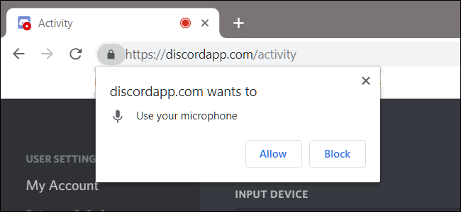
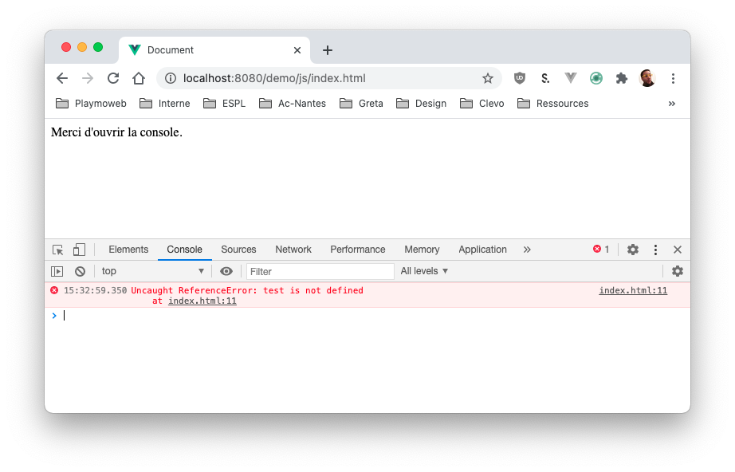
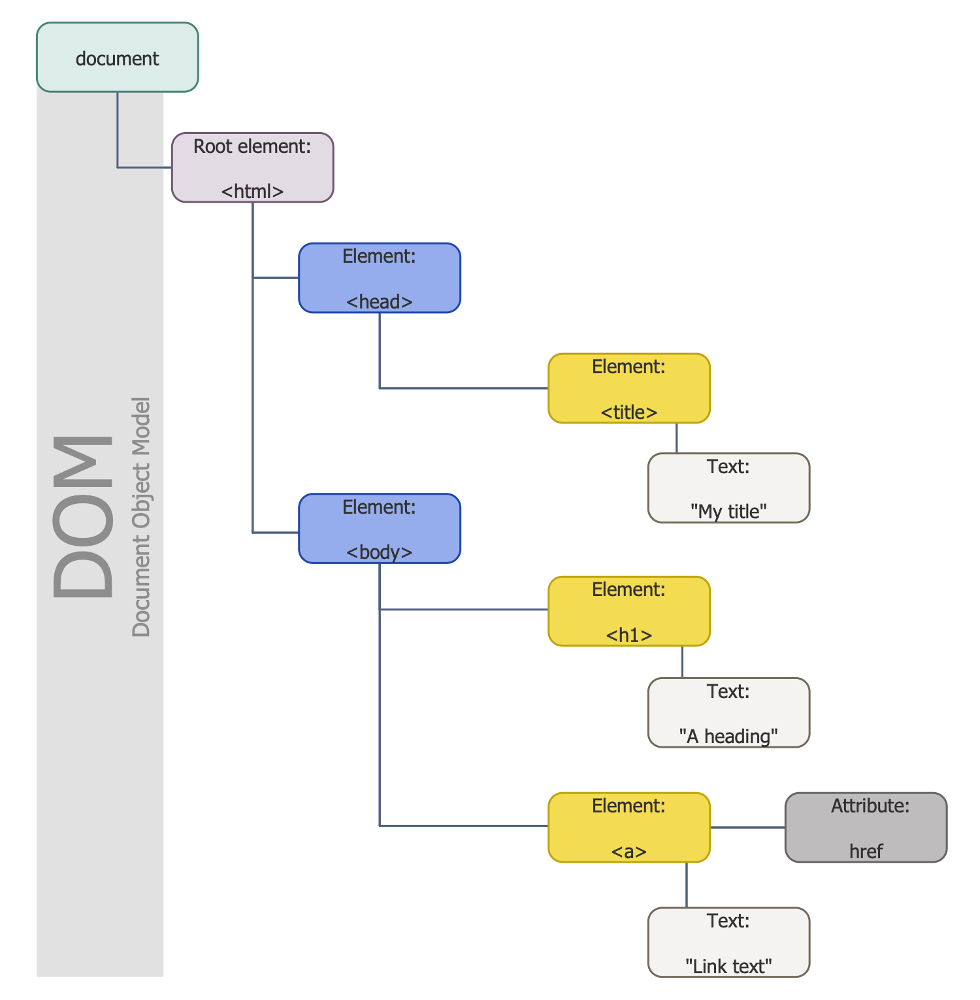

# Complément du cours JavaScript

Ce document est un complément du cours. Il vous permettra de revenir sur les différentes notions avec différents exemples.

[[toc]]

## Introduction

Le JavaScript… Vous allez l'aimer… Ou le détester ! Mais en tout cas c'est l'incontournable du développeur Web. Le JavaScript est maintenant partout, dans votre navigateur bien évidemment, mais également sur nos serveurs, mais aussi dans nos applications! Bref il est littéralement partout.

Dans ce cours nous allons voir les bases du JavaScript, nous ne reverrons pas ici [les bases du développement comme ce que nous avons fait en PHP](/tp/php/support.md).


::: warning Prérequis
Le cours fait référence à des notions de programmation orientée-objet, je ne couvrirais pas les bases de la programmation objet.
:::

## Le fonctionnement

Le JavaScript est un langage de programmation relativement récent il date de **1994**. Cependant il a connu une évolution assez rapide ces dernières années et ne ressemble plus vraiment au JavaScript du début.

Le JavaScript est une implémentation d'une norme plus large l'ECMAScript (aussi appelé ES20XX, mais également ESX), cette norme définit le fonctionnement du langage aussi bien dans un navigateur, mais également sur d'autres supports comme les serveurs.

Nous allons utiliser au maximum les dernières fonctionnalités de la norme (ES6), celle-ci est maintenant largement compatible avec le parc de navigateur actuel. Si par hasard vous devez supporter un navigateur incompatible, nous aborderons les options pour « le gérer ».

Le JavaScript qui fonctionne dans votre navigateur est un langage **client** il est donc exécuté _dans votre navigateur_ ce détail est important. Ça veut dire que votre serveur ne sera pas du tout sollicité lors de l'exécution d'un programme codé en JavaScript.

Votre navigateur est très puissant, tellement puissant que nous allons pouvoir faire énormément de choses en JavaScript :

- Contrôle de saisie.
- Interactivité avec le client (interaction avec l'utilisateur, clic, clavier, mouvement de la souris).
- Afficher / masqué des éléments aux cliques.
- Ajouter des éléments dans une page, manipuler la CSS.
- Charger des éléments de manière asynchrone via le Réseau (Ajax)
- Utiliser les Cookies (comme en PHP).
- Sauvegarder des données sur le poste du client (LocalStorage).

Mais… Ce n’est pas tout ! Votre navigateur est tellement puissant que vous allez pouvoir faire :

- Des applications en JavaScript
- Accéder au Bluetooth de votre appareil
- Accéder au GPS
- La liste est vraiment infinie !

::: tip
Le JavaScript est vraiment le miroir de la vitesse avec laquelle Web est une plateforme qui va très vite. Il ne se passe pas 6 mois sans que vous puissiez faire encore plus.

La veille dans ce domaine est donc primordiale. Nous allons voir ici seulement les bases de ce qui vous servira plus tard dans votre métier.
:::

::: warning
Le JavaScript est puissant, tellement puissant que votre navigateur « vous bridera ». Afin que vous n'abusiez pas des fonctionnalités, certaines d'entres elles sont soumises à permission / validation. Comme votre mobile donc :



Autres limitations, votre code JavaScript ne peut pas accéder :

- Aux autres onglets actuellement ouverts.
- Aux domaines autres que celui sur lequel vous vous trouvez (Ajax).


:::

### Moteur JavaScript

Votre navigateur possède donc un « Moteur JavaScript » que l'on appelle parfois la « JavaScript Virtual Machine » (rien à voir avec _le Java_). Chaque moteur JavaScript est donc différent, et fonctionne différemment, ils ont des noms comme vos navigateurs. Par exemple :

- V8 : Chrome, Opéra, Edge.
- SpiderMonkey : Firefox.
- Chakra pour Internet Explorer.
- ChakraCore Microsoft Edge (avant l'évènement « Chromium »)
- Nitro et SquirrelFish pour Safari.

::: tip Un Moteur ?
Le moteur a pour but de :

- Lis le JavaScript.
- Compile le JavaScript en langage machine (et le valide).
- Votre ordinateur exécute le langage machine (très rapide)

:::

### Pourquoi le JavaScript est-il donc incontournable.

- Intégration avec le HTML/CSS.
- Simple d'apprentissage et dans la manipulation.
- Actif par défaut, et supporté par l'ensemble des navigateurs.

## Les navigateurs

L'autre gros sujet du JS est le support… Vous êtes certainement jeunes, vous n'avez connu _que Google Chrome_, la réalité est plus complexe que ça (surtout en entreprise). Dans votre carrière vous allez rencontrer des blocages et obligations de support. Même en 2020 nous avons des navigateurs différents (pourvu que ça dure) :

- Google Chrome
- Safari
- Firefox
- Edge
- Internet Explorer `> 11`
- Interne Explorer `< 10`

Ça vous parait très certainement anecdotique, mais les navigateurs n'interprètent pas vraiment de la même façon le code, le JavaScript en fait parti. En fonction des navigateurs, le support sera plus ou moins complet. En 2020 nous n'avons plus trop de problèmes. L'ensemble des navigateurs support « à peu près là même choses ». Mais avant ce n'était clairement pas le cas.

Nous allons donc avoir besoin de [_librairies_ (appelé polyfill)](https://polyfill.io/v3/), ces librairies ont pour but d'ajouter le support de fonctionnalité moderne sur d’anciens navigateurs. Le support n'est évidemment pas total, et souvent les performances sont un peu moins bonnes. Mais cette solution est souvent la meilleure pour supporter les anciens navigateurs.

## Librairies or not ?

C'est là grande question ! En JS nous avons la possibilité de nous passer complètement de librairie afin d'utiliser uniquement ce que propose le navigateur, c'est ce que l'on appelle `VanillaJS`. En 2020 ça fonctionne très bien! C'est même ce que j'aurais tendance à conseiller… Mais (oui il y a toujours un mais) la réalité est qu’en agence vous allez rencontrer des projets qui utiliseront [jQuery](https://jquery.com/).

Au vu du temps que nous allons avoir à consacrer au JS ça me semble important de vous parler un peu de `jQuery` mais également des équivalents `VanillaJS`.

Je ne dis pas que `jQuery` est un mauvais choix… Je pense par contre que celui-ci n'est plus forcément un « obligatoire » à partir de maintenant.

::: tip Et les Frameworks alors ?
Ah en voilà une bonne question ! Les frameworks JS sont un sujet aussi vaste que le JS en lui-même, nous aurons le plaisir de les pratiquer ultérieurement. Dans tous les cas, ce que nous allons voir ensemble « dans les bases du JS » nous resservira avec les frameworks.

_Sachez juste qu'il est possible de tout faire avec un framework JS (type `VueJS`), mais ce n'est pas forcément la réponse à toutes les questions._
:::

## Les animations

Attention à ne pas tomber dans le piège du tout JavaScript. Il peut-être tentant de tout faire un JavaScript, il fut un temps ou c'était une solution acceptable. Maintenant que nos navigateurs sont très puissants, cette solution devient même imaginable…

Mais **il ne faut pas le faire** ! Si vous souhaitez animer votre page **privilégier au maximum le combo CSS + HTML** (et JavaScript si un pilotage est nécessaire). Pourquoi est-ce important ? C'est important, car l'exécution du votre CSS est complètement différentes que le JS :

- La CSS est en grande partie gérée par votre GPU (Carte graphique). Cela utilise donc des instructions très spécifiques, optimisé, et très rapide (fluide).
- Le JS est quant à lui exécuté sur votre CPU (Processeur). Donc, en fonction de votre ordinateur les performances sont plus ou moins bonnes (et consomme plus de batteries).

::: tip Vous vous souvenez des boucles ?
Les animations en JS sont faites de boucles « infinies » ou très longues. C'est donc très peu optimisé. **Méfiance donc !**
:::

## JavaScript do you speak JavaScript ?

Nous allons voir plus tard que le JavaScript à certains defaut. Nous ne l'évoquerons pas vraiment dans ce cours, mais il est possible d'écrire du JavaScript dans d'autres langages qui seront ensuite « transpilé » (converti lors d'une étape de compilation) en du JavaScript :

- CoffeeScript, syntaxe plus concise très utilisée par les utilisateurs de Ruby.
- TypeScript, très populaire, il permet principalement de typer « fortement les données. Il permet de créer du code propre même dans le cas de gros projets complexes. Il est développé par Microsoft. (Très intéressant).
- Kotlin, Kotlin le langage utilisé par la plateforme Android de Google. Le compilateur permet de créer également du code JS à partir de fichier `.kt`.

Il y a encore beaucoup d'exemples, le langage n'étant que « Transpilé » il est important de comprendre le JavaScript pour l'utiliser efficacement.

## Les outils du développeur

Le JavaScript ne déroge pas à la règle, pour bien travailler il nous faut de bonnes ressources. Pour le JS je vous propose :

- [https://developer.mozilla.org/](https://developer.mozilla.org/)
- [https://caniuse.com/](https://caniuse.com/)
- [https://web.dev/](https://web.dev/)
- [https://kangax.github.io/compat-table/es6/](https://kangax.github.io/compat-table/es6/)

::: tip Un instant
Bien évidemment cette liste peut-être bien plus grande. N'hésitez pas à vous inspirer :

- De certains projets Github.
- De compte Twitter
- …

:::

### Les IDE

L'IDE est aussi important que les idées. Pour éditer du JavaScript, vous pouvez utiliser un simple éditeur de texte (type Notepad). Cependant, je vous déconseille vraiment de le faire, écrire du JavaScript peut parfois être complexe, et il faut bien l'avouer un peu d'aide de la part d'un IDE peut-être **très très intéressant**, vous avez beaucoup de possibilités :

- WebStorm (Payant, mais très bon).
- VisualStudio Code (Gratuit, bon aussi).
- Atom (je ne le conseille plus).
- Vim (pour les experts seulement).

::: tip Astuce du pro
Quel que soit l'éditeur choisi, il faut savoir l'exploiter. N'hésitez pas à l'apprivoiser pour connaitre les options et donc devenir efficace avec.
:::

### La console

Nous avons déjà utilisé « La console » de votre navigateur quand nous faisions du HTML. Celle-ci sera encore plus utile avec le JS, elle nous permettra :

- De voir les Erreurs et Warnings.
- Faire des points d'arrêt.
- Afficher des logs.

Cette console existe sur l'ensemble des navigateurs modernes. Elle contient des informations **très précieuse** à partir de maintenant, j'aimerais que celle-ci soit toujours ouverte lors de vos developpement.

::: tip Cas concret



La ligne `Uncaught ReferenceError: test is not defined at index.html:11`, nous indique, que notre page `index.html` contient une erreur à la ligne 11.

Vous pouvez, vous aussi tester [cette page en cliquant ici](/demo/js/index.html)

:::

## Votre premier Hello World

Concentrons-nous maintenant sur le code en lui-même. Nous allons travailler exclusivement dans notre navigateur. Un peu comme la balise `form` la balise `script` peut-être mise n'importe où dans le code HTML. Cette balise peut fonctionner de deux façons différentes :

- Code JavaScript directement dans le code
- Code JavaScript chargé depuis un fichier externe.

_Directement dans le code :_

```html
<!DOCTYPE html>
<html>
  <head>
    <title>Titre de la bage</title>
  </head>
  <body>
    <p>Lorem Ipsum</p>

    <script>
      alert("Bonjour à tous");
    </script>

    <p>Lorem Ipsum suite</p>
  </body>
</html>
```

_Via un script externe :_

```html
<script src="/public/js/votre_script.js"></script>
```

::: tip Astuce de Pro
Vous pouvez bien évidemment mettre **plusieurs** balises script. Un peu comme le PHP l'organisation est importante, n'hésitez pas à découper votre code (encore, et encore, et encore).

```html
<script src="/public/js/votre_script1.js"></script>
<script src="/public/js/votre_script2.js"></script>
<script src="/public/js/votre_script3.js"></script>
```

Vous pouvez également charger des scripts « externe » :

```html
<script src="https://ajax.googleapis.com/ajax/libs/jquery/3.5.1/jquery.min.js"></script>
```

:::

::: warning
Attention à la sécurité dans le cas du chargement via un CDN. Vous charger du contenu « non sure depuis Internet ». C'est à mon sens un très gros risque.
:::

### Mise en pratique

Maintenant que vous avez vu les bases… Place à la pratique avec [le TP1](/tp/javascript/tp1.md)

Rien de bien compliqué dans le TP, il s'agit juste de mettre en pratique.

## Plusieurs lignes ?

Pour l'instant nous avons écrit du code très simple. Nous allons plus tard avoir bien évidemment des fonctions, des conditions des boucles, bref plusieurs lignes de code. En JavaScript chaque ligne de code **doivent se terminer par un `;`**.

```javascript
console.log("Ceci est un message dans la console");
alert("Bloqué");
```

## Les commentaires

Commenter son code c'est important (pour vous). Il faut le faire dès que cela est nécessaire :

```js
/**
 * Commentaire multignes
 * Par exemple en début de fichier pour détailler le contenu
 */

// Commenter une ligne.
console.log("Ceci est un exemple");

console.log("Ceci est un exemple 2"); // Peux également être placé en fin de ligne.
```

::: tip Astuce d'ancien !
Commenté, commenté, commente votre code. Il n'y a jamais trop de commentaires dans du code. Et par pitié :pray: utilisé les raccourcis clavier de votre éditeur pour commenter :+1:
:::

## Les variables

Comme en PHP (ou d'autres langages), il est possible d'écrire des variables en JavaScript. Les variables fonctionnent de la même façon qu'en PHP, celle-ci sont « temporaire » leur contenu est remis à zéro à chaque lancement de votre script.

Nous avons deux types de variables en PHP :

- Les variables, fonctionnement classique.
- Les constantes, variable qui ne peut-être écrite qu'une seule fois. Si vous tentez de « l'écraser » votre navigateur produira une erreur.

### Les variables

Les variables s'utilisent de la même façon que ce que vous avez déjà vu à savoir :

- Une déclaration
- Des assignations
- Des « manipulations » (conditions, boucles, fonctions, etc.)

La déclaration d'une variable doit-être faite avec le mot-clé `let`, par exemple :

```javascript
let nom;
nom = "Brosseau";
alert(nom);

// Ou alors en une seule ligne.
let nom = "Brosesau";
alert(nom);
```

::: tip Un peu d'historiques
L'usage du mot-clé `let` est plutôt récent en JavaScript. Historiquement nous utilisions plus le mot `var`. Il n'y a pas vraiment de différence entre les deux. Sachez juste que maintenant vous devez utiliser `let` plutôt que `var`.
:::

::: warning Attention

Contrairement au PHP, une variable déclarée ne peut-être redéclarée, si vous tenter de le faire votre navigateur produira une erreur dans la console. :

```javascript
let nom = "Valentin";
nom = "Thomas"; // Pas de problème

let nom = "Romain"; // Erreur.
// VM1498:4 Uncaught SyntaxError: Identifier 'nom' has already been declared
```

:::

### Les constantes

Une constante s'utilise comme une variable classique, sauf que celle-ci ne peut-être écrasé. Nous utiliserons ce type de variable pour « empêcher » que certaines valeurs puissent être perdues via une mauvaise ligne de code.

```javascript
const age_du_capitaine = 84;
age_du_capitaine = 33;
// VM1583:2 Uncaught TypeError: Assignment to constant variable.
```

Un exemple d'usage ? Par exemple, un lien « vers une API », ou encore la couleur principale de votre site web. Où plus simplement mémoriser sous « une étiquette » des valeurs plus longue :

```javascript
const IN_PROGRESS = "200";
const DONE = "400";
const FAILED = "1000";
```

Il est en effet plus simple de lire un ligne :

```javascript
if (order.status == DONE) {
  alert("Commande finalisée");
}
```

Que mémoriser que 400 == Done :

```javascript
if (order.status == 400) {
  alert("Commande finalisée");
}
```

::: tip Astuce de pro
Je vous conseille de nommer vos constantes avec un nom en majuscule. Ça vous permettra de toutes de suite les reconnaitre
:::

### Les types

Comme en PHP les variables possèdent des types « implicitement déterminés » :

| Type      | Contenu                                 | Type d'opération                | Usage                                                                               |
| --------- | --------------------------------------- | ------------------------------- | ----------------------------------------------------------------------------------- |
| `string`  | "Une chaine de caractère"               | Gestion du texte, concaténation | Permets de stocker du texte (saisie utilisateur par exemple).                       |
| `int`     | 42                                      | Opération mathématique          | Comme en mathématique                                                               |
| `boolean` | `True` ou `False`                       | Opération logique               | Permets de faire des actions logiques. C'est un type très important en informatique |
| `float`   | 10.3                                    | Opération mathématique          | Comme en mathématique. Attention la notation du chiffre à virgule est avec un `.`.  |
| `array`   | ["a", "b", "c"]                         |                                 | Contiens des listes de « quelques choses »                                          |
| `object`  | `{nom: "Brosseau", prenom: "Valentin"}` |                                 | Structure de données                                                                |

En JS, nous n'avons pas de « Tableaux associatifs », nous avons à la place un type `object`, il nous permettra de structurer au mieux nos données.

### À faire

Nous avons vu comment déclarer des variables, [je vous propose de les manipuler un peu avec le TP 1.1](./tp1.1.md)

## Manipuler les données

Un langage de programmation est prévu pour manipuler des données. Pour le JavaScript c'est là même chose, toutes les opérations vu en PHP fonctionneront de la même façon en JS, la synthaxe sera très proche voir identique. Voici quelques exemples.

### Les conditions

Aucune différence par rapport à ce que nous avons précédemment vu ensemble :

```javascript
if (true) {
  // Condition toujours vrai
}

let i = 1;
if (i > 10) {
  // Condition toujours fausse
}
```

### Les boucles

```javascript
while (true) {
  console.log("Votre première boucle infinie");
}

for (let i = 0; i < 3; i++) {
  alert(i);
}
```

### Les fonctions

Nous pouvons déclarer des fonctions en JS :

```js
function maFonction() {
  return Math.random();
}
```

Elle fonctionne et s'utilise comme ce que nous avons précédemment vu.

### À faire

Tester en JavaScript l'usage de c'est Fonction, Condition, et Boucle. (Nous utiliserons plus en détail c'est élément après avoir vu comment manipuler le DOM)

## Manipuler le HTML et la CSS

Comme je disais précédemment, le JavaScript et le HTML sont « entièrement » compatible, vous pouvez créer, supprimer, modifier n'import quels éléments présent dans votre page. Il est donc possible de créer entièrement une page HTML via du JS. Il est également possible de modifier le style de chacun des éléments présents dans votre page Internet.

Cette interaction entre les deux, nous permettra plus tard de créer « de vraies expériences » 100% en JavaScript.

::: danger Une limite…
Manipuler votre page aucun problème. Par contre attention, impossible de modifier du code « qui ne vous appartient pas », c'est-à-dire dans une `iframe` ou dans un autre onglet que la page actuelle.
:::

### Créer des éléments dans la page

Je ne pense pas qu'il soit très important de connaitre ce genre de manipulation, mais je constate qu'en entreprise certains d'entre vous seront confrontés à ce genre de problématique. Vous avez la possibilité de créer n'importe quel type d'élément directement depuis votre code JS.

Votre navigateur ne fera aucune distinction entre un élément créé « normalement » et un élément créé via le JavaScript. La création d'un élément se passera en deux temps :

- Le créer l'élément, le personnaliser (contenu, texte, css).
- L'ajouter dans votre page

### Le DOM

Avant d'écrire du code, un peu de théorie ! Votre navigateur n'est pas magique, il repose sur une logique qui est toujours la même depuis le début. Celui-ci repose sur ce qu’on l'arbre du DOM (**D**ocument **O**bject **M**odel). Nous parlerons donc d'un Arbre HTML, prenont un exemple :

```html
<!DOCTYPE html>
<html>
  <head>
    <title>My Title</title>
  </head>
  <body>
    <h1>A heading</h1>
    <a href="http://…">Link text<a>
  </body>
</html>
```

Peut être représenté comme ça :



::: tip Remarque
L'Arbre du DOM peut-être très gros, nous allons plus tard parler de ShadowDow / Dom Virtuel. Même si vous ne manipulez pas cette notion il est important de voir que celle-ci existe. Elle est pour l'instant la pierre angulaire des Frameworks JS moderne.
:::

### Exemple de création d'éléments

La logique est toujours la même :

```javascript
var h = document.createElement("h1"); // Création de l'élément h1
h.innerHTML = "Ceci est un titre"; // Ajout du texte dans le h1
h.className = "titleClass"; // Définition d'un titre pour l'élément

// Ajout du titre dans le body de la page courante.
document.body.appendChild(h);
```

Dans une page ça peut donner :

```html
<!DOCTYPE html>
<html lang="fr">
  <head>
    <meta charset="UTF-8" />
    <meta name="viewport" content="width=device-width, initial-scale=1.0" />
    <title>Ma page</title>
  </head>
  <body>
    <script>
      var h = document.createElement("h1"); // Création de l'élément h1
      h.innerHTML = "Ceci est un titre"; // Ajout du texte dans le h1
      h.className = "titleClass"; // Définition d'un titre pour l'élément

      // Ajout du titre dans la page en cours
      document.body.appendChild(h);
    </script>
  </body>
</html>
```

::: tip appendChild ?

Dans le précédent exemple, nous avons ajouté l'élément « à la fin » du body. Mais d'autres options existent :

- `node.append(nodes ou strings)` – ajoute « nodes ou strings » à la fin,
- `node.prepend(nodes ou strings)` – ajoute « nodes ou strings » au début,
- `node.before(nodes ou strings)` –- ajoute « nodes ou strings » avant le node,
- `node.after(nodes ou strings)` –- ajoute « nodes ou strings » après le node,
- `node.replaceWith(nodes ou strings)` –- remplace le node par l'élément fourni « nodes or strings ».

:warning Nous allons voir qu'il est possible de choisir le `node` via un sélecteur.
:::

#### À faire

Je vous laisse tester dans votre navigateur.

### Exemple de création d'éléments version alternative

Nous pouvons également insérer « une chaine de caractère », celle-ci sera transformée automatiquement en code HTML valide par votre navigateur :

```javascript
// Ajout du titre dans le body de la page courante.
document.body.insertAdjacentHTML(
  "afterend",
  "<h1 class='titleClass'>Ceci est un titre</h1>"
);
```

::: tip afterend ?
Comme dans l'exemple précédent, c'est la position de l'élément que vous souhaitez insérer. Les valeurs possibles sont les suivantes :

- `beforebegin` : Avant l'élément lui-même.
- `afterbegin` : Juste à l'intérieur de l'élément , avant son premier enfant.
- `beforeend` : Juste à l'intérieur de l'élément , après son dernier enfant.
- `afterend` : Après élément lui-même.

L'exemple de la W3School est très explicite :

```html
<!-- beforebegin -->
<p>
  <!-- afterbegin -->
  foo
  <!-- beforeend -->
</p>
<!-- afterend -->
```

:::

::: danger Attention
Cette solution peut sembler tentante… Mais attention, si la valeur ajoutée contient une saisie utilisateur, vous risquez une XSS sur votre site Internet.

Donc méfiance.
:::

### Les sélecteurs

Vous vous doutez que nous allons pas tout gérer avec un simple `document.body`. Le JS nous offre beaucoup de possibilité, et nous offre surtout une « interface » très puissante pour choisir l'endroit où nous allons insérer un élément (très très puissante vous allez voir).

Vous vous souvenez des sélecteurs en CSS ? Et bien, nous avons la même chose en JavaScript. Nous avons de **base sans rien ajouter** une méthode permettant de « trouver » un élément dans le DOM

```javascript
// Retourne la liste (array) des éléments
document.querySelectorAll("#elementId");
document.querySelectorAll(".maClass");
document.querySelectorAll("div");

// Retourn le premier élément trouvé
document.querySelector("#elementId");
document.querySelector(".maClass");
document.querySelector("div");
```

::: tip C'est « neuf »
Ces API (Méthodes) sont très peu utilisés (voir même connues), elles sont pourtant très puissantes. Elles sont à choisir si vous souhaitez faire du code moderne.

Sur Internet (voir dans du code existant), vous trouverez l'ancienne version à savoir :

```javascript
document.getElementById("elementId");
document.getElementsByClassName("maClass");

document.getElementsByTagName("div");
```

Aucun changement dans le fonctionnement.

:::

### Les sélecteurs et jQuery

À plusieurs reprises je vous ai parlé de jQuery sans vraiment vous expliquer pourquoi celui-ci était aussi populaire. jQuery est populaire, car il va nous permettre des raccourcis. Si on reprend l'exemple du sélecteur, jQuery va nous permettre d'unifier la manière dont ont trouve / manipule un élément.

Dès lors que vous ajoutez jQuery dans votre code, nous allons avoir à notre disposition un nouvelle « objet » nommé tout simplement `$` (rien à voir avec les variables en PHP), cet objet va nous permettre plein de choses (vraiment plein). Si on reprend la recherche d'un élément :

```javascript
$("#elementId");
$(".maClass");
$("div");
```

Je ne vais pas m'étaler sur le sujet, mais si on souhaite masquer tous les éléments trouvés avec jQuery, et bien c'est _très_ simple…

```javascript
$("div").hide();
```

::: tip Ajouter jQuery ?
C'est super simple, il suffit « juste » d'ajouter dans votre page :

```html
<script src="https://ajax.googleapis.com/ajax/libs/jquery/3.5.1/jquery.min.js"></script>
```

:::

Pourquoi ne pas toujours utiliser jQuery alors ? Tout simplement que maintenant il est possible d'écrire « sensiblement la même chose » directement en JavaScript sans « dépendance à une librairie ». (Comme nous l'avons vu par exemple avec `querySelectorAll` et `querySelector`).

### Utiliser le résultat d'un sélecteur

TODO

### Mise en pratique

TP Bart version JS

### Jouer sur la visibilité

### Changer le style (et les classes)

## Les évènements

Interagir avec l'utilisateur.

- onclick
- onsubmit
- …

## Ajouter des contrôles de saisie sur le TP Bart (version PHP)

### Sans Lib

### Avec une Lib

## L'Ajax

### L'asynchrone c'est quoi ?

### Charger du contenu « à la demande »

### Les usages « avancés »

## Se « balader » dans le DOM

- Parent
- etc.

### Les sélécteur jQuery « avancés »
