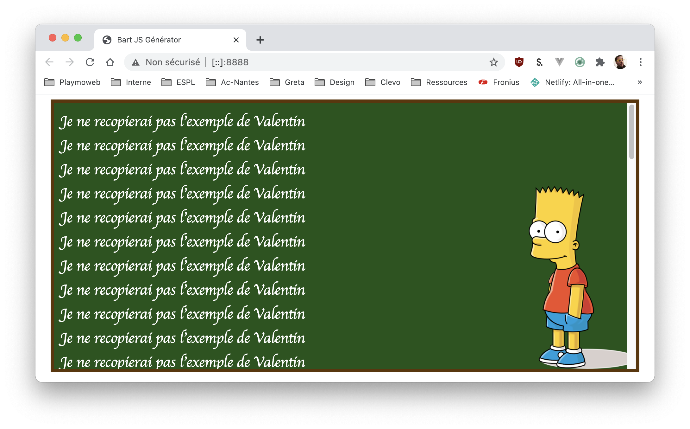

# Le retour de Bart

[Vous vous souvenez du générateur de Bart écrit en PHP?](/tp/php/tp1.1.md) Et bien cette fois-ci nous allons coder la version JavaScript du générateur de phrase.

## Introduction

Dans ce TP nous allons pratiquer la manipulation du DOM en JavaScript. Bien que je trouve que ça ne soit pas forcément la meilleure façon de faire (je préfère de loin l'approche VueJS), il est complètement possible de créer, afficher, conditionner l'affichage d'éléments 100% avec du JavaScript. Dans ce TP vous allez écrire le code JavaScript afin de réaliser :



## Création de la structure

Nous l'avons fait de multiple fois, je vous laisse mettre en place la structure de votre projet. J'ai souhaite cependant que celle-ci respecte quelques règles :

- Votre fichier HTML doit s'appeler `index.html`.
- L'ensemble de vos ressources `public` doivent être dans un dossier `public`.
- La CSS doit être externalisée dans un dossier nommé `style`.
- Le JavaScript doit être dans un fichier `main.js` dans un dossier nommé `js`.

::: tip La fainéantise ! La clé du succès 🔑
Nous en avons déjà parlé, un développeur doit être efficace (et fainéant)… Ne vous amusez donc pas à recoder l'ensemble. Reprenez le code que vous avez réalisé lors de la création du [Bart en version PHP](/tp/php/tp1.1.md)
:::

::: danger Halt !

Quelques petits rappels…

```HTML
<!-- Inclure une CSS -->
<link rel="stylesheet" href="public/style/main.css" />

<!-- Inclure un fichier JS -->
<script src="public/js/main.js"></script>
```

:::

## Le HTML

Voilà la structure de **mon HTML** :

```html
<!DOCTYPE html>
<html lang="fr">
  <head>
    <meta charset="UTF-8" />
    <meta name="viewport" content="width=device-width, initial-scale=1.0" />
    <title>Bart JS Générator</title>
    <link rel="stylesheet" href="public/style/main.css" />
    <script src="public/js/main.js"></script>
  </head>
  <body>
    <div id="tableau"></div>
  </body>
</html>
```

## le JS

Votre fichier JavaScript va contenir la logique de notre application. Pour rappel, celle-ci est très simple elle ne « fait que » afficher des phrases dans la `div` avec comme édentant `#tableau`.

Votre travail va donc se résumer à :

- Créer les variables (phrase et nombre de lignes).
- Une boucle (type `for`, voir vos notes ou le cours).
- Un sélecteur pour obtenir le tableau (`let tableau = document.getElementById('tableau');`)
- L'ajout d'élément « dans la div tableau ». ([voir le support](/tp/javascript/support.md#creer-des-elements-dans-la-page))

::: tip réfléchir avant d'agir
Écrire le code immédiatement est tentant ? Mais arrêtons-nous un instant pour réfléchir à notre code. Tenter d'écrire votre code en français (ou via un diagramme)
:::

### Où placer le JS ?

Maintenant que vous avez votre code JavaScript, vous avez deux solutions :

- La première est de mettre votre JS à la fin de votre HTML. L'objectif faire en sorte que celui-ci soit exécuté quand votre page est chargée. (À votre avis, est-ce une bonne idée ?)
- La seconde est de mettre votre JS dans le `head` de votre site. Celui-ci sera donc chargé au plus tôt par contre le code sera lancé immédiatement… Alors, comment faire ?

::: tip La solution ?
Attendre que votre page « soit entièrement chargée » afin de déclencher votre JavaScript ! Cet évènement est appelé `Dom Ready` (il est très important), dès que cet évènement est « levé » vous pouvez exécuter votre JS.
:::

Concrètement il faut écrire :

_En pure JS :_

```js
document.addEventListener("DOMContentLoaded", function () {
  // Votre code ici
  for (let index = 0; index < 10000000; index++) {
    console.log("Je m'affiche quand la page est chargée entièrement.");
  }
});
```

_Avec jQuery :_

```js
$(function () {
  console.log("Je m'affiche quand la page est chargée entièrement.");
});
```

::: tip Une petite remarque
Comme vous pouvez le constater jQuery est bien plus concis, on verra qu'avec VueJS ça sera encore plus simple.
:::

Je vous laisse écrire le code nécessaire au bon fonctionnement de votre site.

::: details Bloqué ?
Besoin d'aide ? [Voici ma version](/demo/js/bart/index.html)
:::

## Allons plus loin

Vous avez codé votre application en pure JS. Je vous laisse migrer votre code pour utiliser :

- Les sélecteurs [jQuery](https://jquery.com/).
- La création et la manipulation du DOM grace à jQuery.

::: tip Petit rappel

Inclure jQuery dans votre projet est aussi simple que d'ajouter dans votre `head` :

```html
<script src="https://ajax.googleapis.com/ajax/libs/jquery/3.5.1/jquery.min.js"></script>
```

:::

C'est à vous, je vous laisse travailler.
