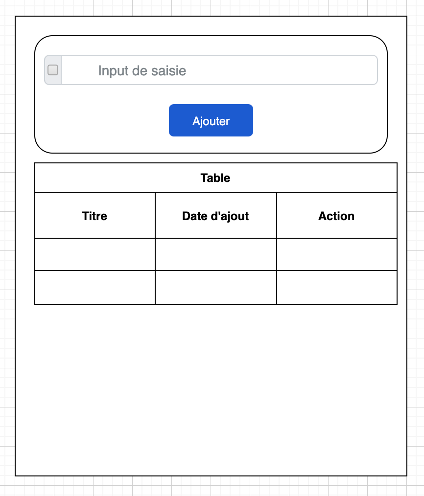
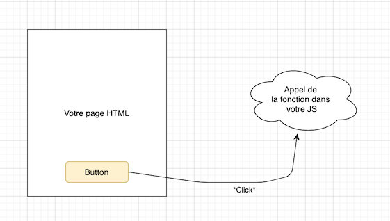

# Interactivité

Nous avons créé dans l'exemple précédent une page avec un formulaire. Je vous propose un autre exemple très simple, nous allons créé une page interactive avec seulement du javascript.

Cette fois-ci je vous laisse travailler avec comme seule information « mon cahier des charges » / « le visuel que je souhaite ».



## Cahier des charges

- La page doit être en HTML.
- Le champ de saisie permet de saisir du texte libre.
- Le bouton ajouté doit :
  - Ajouter une ligne dans la table présente en dessous.
  - La colonne titre est remplie avec la valeur saisie.
  - La colonne date contient la date au moment de l'ajout. `Date()`.
  - L'action est un bouton permettant de supprimer la ligne en question.
- Votre Javascript doit être externalisé (fichier .js)

## Technologies souhaitées

Pour réaliser cette page, je vous propose d'utiliser :

- Bootstrap (ou tailwind).
- jQuery (ou du VanillaJS).
- Datatable pour avoir une table interactive. (en option, plus complexe)

Je vous laisse plancher sur le sujet. N'oubliez pas :

- [L'aide mémoire](/cheatsheets/javascript/)
- [Le support de cours](/tp/javascript/support.md)

::: danger STOP

⚠️ Un appel important ⚠️

En JavaScript votre code est appelé au moment de l'interaction, **Il doit donc toujours être dans une fonction** :



:::

::: details Quelques éléments en vrac pour aider

### Obtenir la valeur d'un input

```js
// En jQuery
$("#idDeLinput").val();

// En VanillaJS
document.getElementById("idDeLinput").value;
```

### Ajouter des éléments dans un tableau

```js
$("#maTable").append(
  "<tr><td>" + phrase + "</td><td>" + Date() + "</td><td>L'input…</td></tr>"
);
```

### Obtenir la date actuelle

```js
Date();
```

### Supprimer la ligne d'un tableau

```html
<tr>
  <td><button onclick="deleteRow(this)">Suppr</button></td>
</tr>
```

```js
// Avec jQuery
function deleteRow(elem) {
  $(elem)
    .closest("tr")
    .remove();
}
```

### Rafraichir la table

C'est du test, nous sommes en mode sauvage.

```js
$("#myTable")
  .DataTable()
  .destroy();

$("#myTable").DataTable();
```

:::
