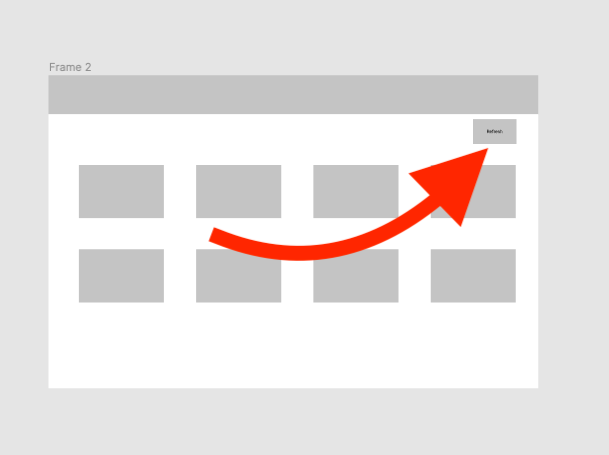
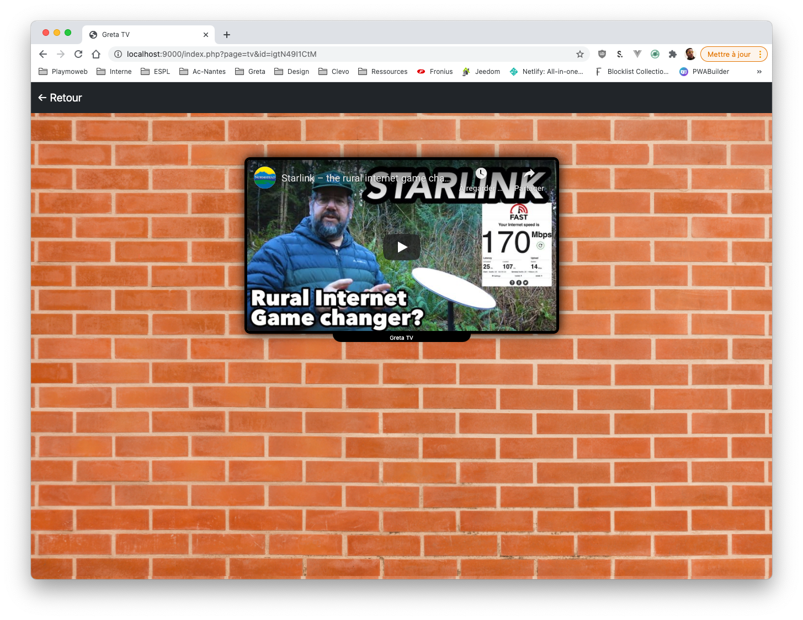
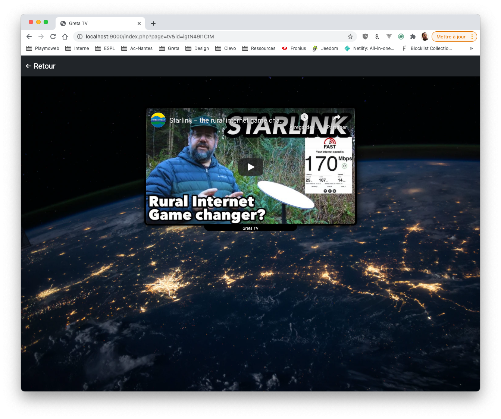
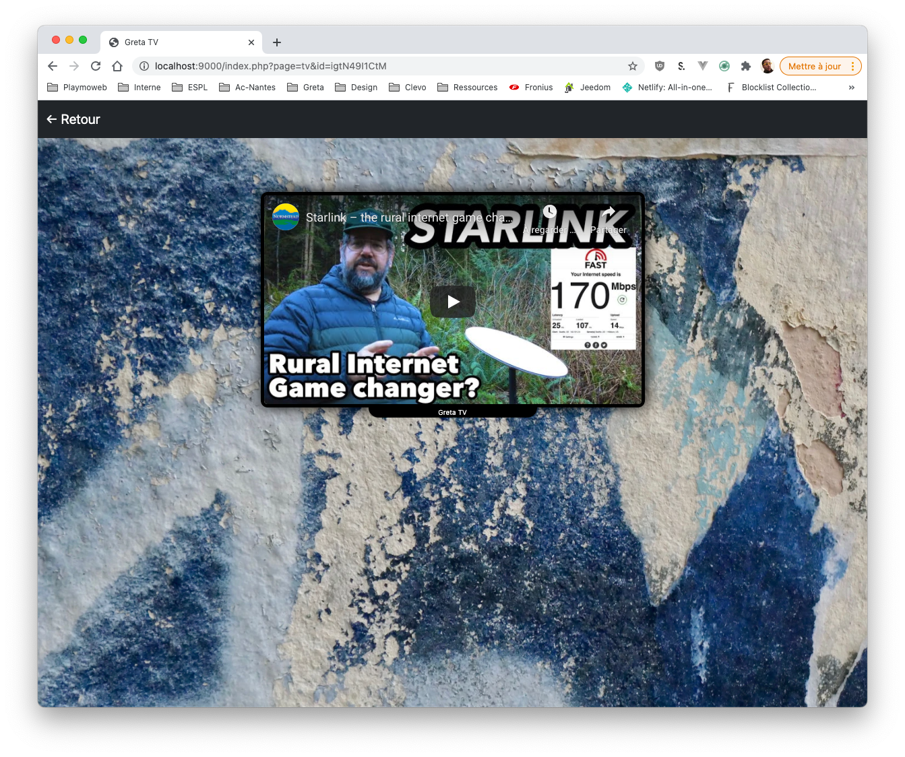

# Pratiquer l'Ajax, adaptons un code existant

Nous avons créé deux cas « de tests », je vous propose de le mettre en place dans un code existant. Nous avons réalisé un site la GRETA TV, ce site comportait **«deux pages** :

- Une page d'accueil `home.php`, qui affiche la liste des vidéos.
- Une page `tv.php` ayant pour but l'affichage de la vidéo souhaité.

::: tip Vous n'avez pas le code source ?
Celui-ci est [disponible ici](/demo/php/greta-tv/refactor-structure.zip). Il pourra vous servir de base de travail. (c'est une version sans base de données, pour simplifier l'installation locale)
:::

::: tip Vous préférez une approche MVC ?
La première version du code source fourni est très simple. En tant que développeur, on préfère une approche un peu plus complète que celle-ci. C'est pour ça que je vous propose plutôt d'utiliser la version MVC du projet.

Celui-ci est [disponible ici](/demo/php/greta-tv/refactor-structure-mvc.zip). La [documentation est disponible ici](/tp/php/mvc/tp1.md)

**Attention**, la suite du TP repose sur la première version du code source. Les nommages sont différents, mais globalement le fonctionnement reste le même. Si vous voulez jouer, tentez la version MVC.
:::

Comment allons-nous procéder ?

- Dans un premier temps, nous allons regarder le fonctionnement du site actuel.
- Puis, nous allons supprimer les parties PHP « qui affichent les vidéos ». Nous testerons que notre code fonctionne toujours, mais en n’affichant aucune vidéo.
- Nous allons par la suite créer une API. Son but ? Retourner uniquement le contenu (au format JSON bien entendu)
- Puis nous appellerons notre API en Ajax grâce à Fetch depuis notre page.

## La page `home.php`

Nous allons rendre dynamique la page d'accueil `home.php`, dans le sens où :

- Notre serveur va générer une page « Vide » (c'est-à-dire sans la liste de vidéos).
- Notre navigateur va, via un appel Ajax charger la liste des vidéos, et se charger en JavaScript de l'affichage de la liste.

Avant tout, **pourquoi faire ça ?** L'avantage de découper le traitement comme ça. C'est que nous pourrions très simplement créer un client « Mobile », et ça sans toucher au code de notre serveur. Pleins d'avantages :

- Code unique pour le Web et les autres plateformes
- Centralisation de la logique dans un code dédié à la récupération « du contenu » (les vidéos en l'occurrence).
- Approche microservices, nous pouvons donc héberger notre site Internet sur une autre plateforme que l'API.

::: danger Un INSTANT !
Une API ? What ? Alors, une API dans le fond c'est « comme un site web ». Mais, cette page web ne produit pas du HTML et n'a pas pour vocation d'être lue par un humain.

C'est donc du code (PHP ou autre) qui va permettre de faire parler deux ordinateurs (le client et le serveur) dans un langage spécifique (XML, JSON …)
:::

### Étape 1 : Analyse du code

La première étape va être de créer l'API, nous allons donc regarder comment fonctionne le code que vous avez téléchargé. Je vous laisse regarder, une fois analysé nous allons en parler ensemble.

::: details Analyse du code

Le code qui nous intéresse est présent dans le fichier `home.php` ; celui-ci contient quelques lignes de code, mais si nous y regardons de plus près seules quelques lignes sont intéressantes :

```php
<?php
$videos = array("BcgsOgjHgWA","lcOxhH8N3Bo","jTuBnZrLbq0", "M2VtfZDOcHQ", "i1iIaSbK9bg", "MTaHw-S6IDo", "KfMCApWc5xE", "igtN49I1CtM");
$i = 0;
foreach ($videos as $id) {
    $i++;
?>
    <div class="col-sm-12 col-md-3 p-3">
        <div class="card">
            <div class="card-body text-center">
                    <a href="index.php?page=tv&id=<?=$id?>" class="btn btn-outline-primary">Video <?= $i ?></a>
            </div>
        </div>
    </div>
<?php
}
?>
```

Nous pouvons y voir un exemple de code PHP très simple à savoir :

- Une variable `$videos`, celle-ci contient la liste des vidéos à afficher. _C'est notre source de données_.
- `$i` est une variable qui permettra d'afficher `Video X` (1… X). _Note, cette variable peut-être remplacée par une boucle foreach différente `foreach $videos as $i => $id`_
- Du code HTML, celui-ci permet d'afficher une liste de Card à la suite avec dedans un bouton permettant d'accéder à la page `tv.php`.

:::

---

Une autre partie du code est intéressante, le fichier `index.php` ; ce fichier est un entrypoint, c'est une bonne pratique que je vous encourage vraiment à pratiquer. Regardons le fichier ensemble ! Et plus particulièrement la variable `$whitelist` celle-ci contient la liste des pages **autorisées**.

::: tip Whitelist ?

La sécurité vous connaissez ? J'espère, quand vous développez un site Internet, vous êtes par définition « en short » sur la toile. Votre site peut-être et sera certainement (je vous le garantis pour l'avoir vécue) piraté par une personne malveillante. Comment s'en prémunir alors ? Tout simplement empêchant au maximum l'exploitation de problème connut.

Créer une `whitelist` va nous permettre de dormir paisiblement, nous allons contrôler finement ce que l'utilisateur va pouvoir inclure. Vous retrouverez cette pratique dans différents langages sous différent nom (Un `router` peut-être assimilé à ce genre de pratique).

:::

---

Le précédent développeur a visiblement travaillé pour vous… :wink: :wink:. Vous trouverez également dans le projet un fichier `api.php` ainsi qu'un dossier `api` celui-ci contient le code permettant de :

- Déclarer des API. (dossier `api/`)
- Sécuriser les API.
- Centraliser la gestion de celle-ci. (`api.php`)

::: tip 👀 Vous pouvez tester dès maintenant 👀

Vous avez une API de disponible dans le projet. Celle-ci contient du contenu fictif, vous pouvez l'appeler avec le lien :

- http://localhost/leDossierDeVotreProjet/api.php?page=sample

🤓 Je vous laisse tester.
:::

### Étape 2 : Créer l'API

Nous avons maintenant analysé le code actuellement fonctionnel. Nous allons donc créer une API qui devra retourner « seulement la liste des vidéos ». Nous allons utiliser la fonction `json_encode` fournie **de base** en PHP.

Cette fonction permet :

> Retourne une chaine de caractères contenant la représentation JSON de la valeur value.
>
> L'encodage est affecté par les flags fournis. De plus, l'encodage des valeurs flottantes dépend de la valeur de serialize_precision.

_Source:_ https://www.php.net/manual/fr/function.json-encode.php

Cette fonction nous permet donc de transformer une `variable` en quelque chose de transférable simplement vers un autre système. Ce quelque chose est du JSON :

> JSON est un format de données textuelles dérivé de la notation des objets du langage JavaScript. Il permet de représenter de l’information structurée comme le permet XML par exemple.

_Source:_ Wikipédia

#### Place au code

Nous devons donc écrire une API… Une API c'est **juste un fichier PHP** comme un autre ; à la seule différence que celui-ci ne retourne pas du HTML, mais du JSON. Vous avez un exemple d'API dans le projet avec le fichier `sample.php`, je vous laisse le regarder…

Une fois celui-ci analysé, je vous laisse créer votre fichier, exemple `videos.php` **dans le dossier `api/`** ça sera notre futur API ! Nous avons maintenant une API **vide** ! Mais que mettre dedans ?

- À votre avis ?
- Du code PHP :-O
- La réponse D ?

Je vous aide! Nous allons y mettre du code PHP… Et plus particulièrement le contenu de **notre source de données** ! Mais quel code à votre avis ?

- Vous allez devoir créer la variable `$videos` (comme sur la home).
- Utiliser la fonction `json_encode` et `echo` pour envoyer le contenu de la variable au client au format JSON.

::: details En panne d'inspiration ?

Je vous aide :

```php
    <?php
        $videos = array("BcgsOgjHgWA","lcOxhH8N3Bo","jTuBnZrLbq0", "M2VtfZDOcHQ", "i1iIaSbK9bg", "MTaHw-S6IDo", "KfMCApWc5xE", "igtN49I1CtM");
        echo json_encode($videos);
    ?>
```

:::

Je vous laisse mettre en place l'API dans votre code. **N'oubliez pas de la tester !**

::: tip L'astuce du chef
Pour tester votre API, vous avez la possibilité d’utiliser le logiciel PostMan. PostMan va vous permettre de tester vos API simplement avec une interface graphique.

Téléchargez-le [ici](https://www.getpostman.com/)
:::

### Étape 2 : Modifier le code existant

Je vous laisse modifier le code PHP de la page `home.php` pour le vider de tout `PHP` celui-ci doit-être vide ! Il ne va contenir que le minimum à savoir la structure interne de la page :

```html
<div class="container">
  <div class="container">
    <div class="row pt-5" id="content">
      <!-- Nous allons insérer ICI le contenu grace à l'AJAX -->
    </div>
  </div>
</div>

<script>
  // Vous ajouterez ici prochainement le code JavaScript permettant de faire l'appel Ajax (avec fetch)
</script>
```

### Étape 3 : Appeler l'API en Ajax

Comme nous l'avons fait précédemment je vous laisse reprendre le code. Mais le code va ressembler à :

```javascript
fetch("./api.php?page=videos")
  .then((response) => response.json())
  .then((datas) => {
      // Votre code ICI, vous devez parcourir les vidéos (comme dans l'exemple précédent) pour les ajouter dans le #content (comme dans l'exemple précédent)
    });
  });
```

::: details à court d'idées sur le code à écrire ?

NON ? Vous n'allez pas tricher comme ça… Non pas vous ?

```js
// À mettre dans le then
let i = 0;
datas.forEach((el) => {
    document.getElementById("content").insertAdjacentHTML(
    "beforeend",
    `
    <div class="col-sm-12 col-md-3 p-3">
        <div class="card">
            <div class="card-body text-center">
                <a href="index.php?page=tv&id=${el}" class="btn btn-outline-primary">Video ${i}</a>
            </div>
        </div>
    </div>
    `
    );
```

⚠️ Non… Ce n'est pas la seule façon de faire. Maintenant que vous avez vu MA solution. Je vous laisse écrire la vôtre.

:::

🤓 Je vous laisse travailler à la mise en place du code en question. Tester ensuite que la page s'affiche comme précédemment.

### Étape 4 : Évolution de la page

Ajouter un bouton rafraichir dans la page. Le bouton rafraichir doit permettre de récupérer à nouveau la liste des vidéos pour les mettre à jour dans la page.

- Ajouter une icône à droite dans l'interface.
- Utiliser les icônes fournies par bootstrap.
- Ajouter une action `onClick` permettant de déclencher l'action (`function`) permettant d'obtenir les vidéos en Ajax (c'est le code que vous avez déjà écrit)

Voilà la maquette :



## Allons plus loin

Nous avons fait la page `home.php` ensemble. Actuellement, nous avons un fond « brick » sur la page TV (`tv.php`) ; je vous propose de changer cette page ! Pour ça vous allez devoir procéder à différents ajustements :

- Ajouter dans la structure de données la notion de thème. (un thème différent par vidéo)
- Retourner dans **une nouvelle** API (`getVideoDetails`), les informations nécessaires au bon affichage du thème.
- Utiliser le retour dans votre page.

::: details Quelques éléments en plus pour vous aider

- Vous allez avoir besoin évidemment de `fetch` (ou de jQuery) afin de faire l'appel Ajax.
- Votre API doit retourner la class CSS à appliquer au `body`.
- Vous pouvez appliquer la class CSS via : `document.body.classList.add("votreClass")`.

Comme dans le premier exemple, vous devez utiliser le résultat de votre API, cette fois-ci le JSON n'est pas obligatoire, voilà une piste de réponse :

```javascript
fetch("lurldevotreapi")
  .then((r) => r.text())
  .then((resultat) => document.body.classList.add(resultat));
```

:::

Voilà quelques exemples du résultat :






## L'étape bonus

Je vous ai indiqué en introduction que le but de créer des API était de permettre de créer simplement plusieurs clients avec comme source de données la même information. Je vous propose donc de mettre ça en pratique ! Nous allons donc créer un autre client web qui consommera nos données. Voilà les éléments que vous devrez réaliser :

- Le client Web devra être hébergé sur [Netlify](https://www.netlify.com).
- Avoir un visuel différent de votre page (home.php) actuelle. (Vous pouvez vous inspirer de YouTube par exemple ou Twitch).
- Avoir une information indiquant chargement pendant la récupération de la liste des vidéos.

::: warning Un instant !
Lors de votre développement, vous allez rencontrer un problème de Cross Origin. Le Cross Origin Resource Sharing (CORS) est une protection intégrée dans votre navigateur qui vous empêche depuis le domaine A d'appeler une ressource sur le domaine B. La raison ? Elle est simple empêcher le partage non désiré d'information entre deux sites.

En tant que développeur (si si), vous pouvez contrôler comment fonctionne cette protection. Vous pouvez dans vos API décider qui vous appellera (quel domaine), de manière fine ou de manière complètement ouverte (`*`). Pour rendre votre code le plus permissif possible vous pouvez ajouter dans votre API PHP le code suivant (tout en haut) :

```php
header('Access-Control-Allow-Origin: *');
```

Vous pouvez évidemment être plus précis, en indiquant un domaine spécifique :

```php
header('Access-Control-Allow-Origin: https://www.example.com');
```

:::
