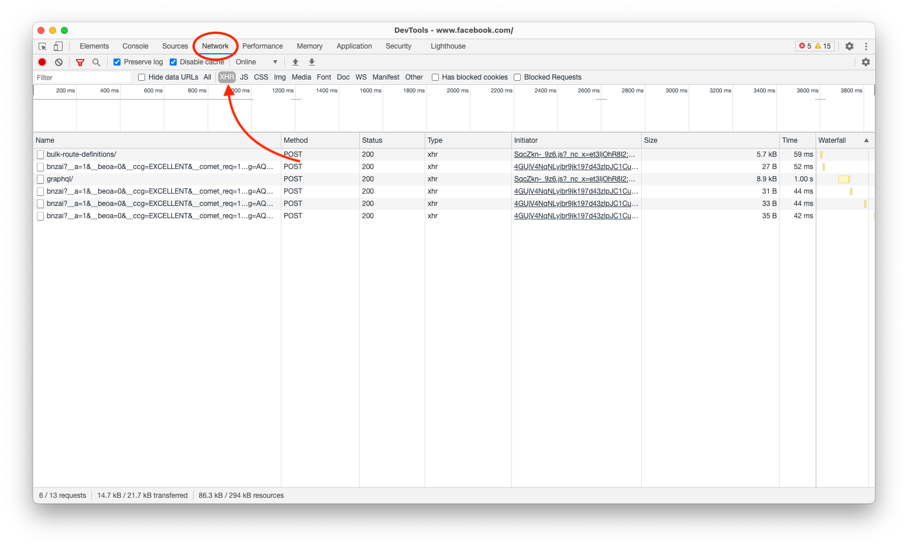

# Pratiquer l'Ajax

Dans ce TP nous allons mettre en pratique l'Ajax au travers de deux exemples.

## Introduction

L'Ajax est vraiment le coeur de nos sites Internet moderne. On le retrouve dans de simples chats comme dans des applications « complexes ». Avec l'avènement des PWA, nous utilisons maintenant l'Ajax comme nous pouvons utiliser une API dans une application classique.

Nous allons utiliser à nouveau la Greta TV comme base de code. Nous allons rendre dynamique la page d'accueil pour que celle-ci puisse être chargée via un appel réseau asynchrone (Ajax).

## Cas 1 : Le serveur génère toujours la page (mais pas entière)

Dans cette première version, nous allons « juste » découper la logique de génération de notre page. Celle-ci va être construite en deux temps, lors du chargement nous allons avoir la structure principale de notre page. Puis dans un second temps notre page va télécharger le contenu manquant via un appel réseau.

Le contenu en question sera généré comme « avant » via du PHP (ou autre langage serveur), mais il se limitera à la partie donnée. Avant d'attaquer, utilisons un exemple simple qui permettra d'illustrer la logique de construction asynchrone.

_Page index.html_ :

```html
<!DOCTYPE html>
<html lang="en">
  <head>
    <meta charset="UTF-8" />
    <meta name="viewport" content="width=device-width, initial-scale=1.0" />
    <title>Ceci est une page dynamique</title>
  </head>
  <body>
    <h1>Voilà ma page</h1>

    <div id="contenuAsynchrone">
      <!-- Vide au chargement -->
      …Chargement en cours…
    </div>

    <script>
      setTimeout(() => {
        fetch("./monContenuAsynchrone.php")
          .then((response) => response.html())
          .then((content) =>
            document.getElementById("#contenuAsynchrone").html(content)
          );
      }, 5000);
    </script>
  </body>
</html>
```

_Contenu dynamique_ `monContenuAsynchrone.php` :

```php
<ul>
<?php
    for ($i = 1; $i <= 10; $i++) {
        echo "Valeur $i";
    }
?>
</ul>
```

Je vous laisse mettre en place le code suivant sur votre machine.

- Que va-t-il se passer ?
- À quoi sert la fonction `setTimeout`, pourquoi est-ce inutile ? Mais dans notre cas utile ?
- À quoi correspond le `then` ?
- Seriez-vous capable de le faire seule ?

::: warning ATTENTION
Vous vous souvenez des XSS ? Faites très attention avec cette façon de faire… Car nous avons ici un XSS puissance 10000. Vous insérez dans votre page du code provenant d'Internet. Et ça sans aucune validation.

C'est TRÈS TRÈS TRÈS RISQUÉ. Très clairement, le risque est très important. Je vous conseille vivement de choisir une solution « sans HTML », comme nous allons faire dans le cas 2.
:::

## Cas 2 : Le serveur génère juste la donnée (au format JSON)

Nous allons ici faire travailler à la fois votre navigateur et le serveur. Le serveur va nous produire de la donnée « au format brut », c'est-à-dire un format compréhensible par un ordinateur. Votre JavaScript construira le code HTML par rapport à cette donnée.

C'est la façon que moi je préfère, on verra plus tard avec VueJS que cette solution nous permettra de réaliser rapidement, et sans écrire énormément de code des interfaces web réactivent.

Avant d'allez plus loin, voyons un exemple simple ensemble :

```html
<!DOCTYPE html>
<html lang="en">
  <head>
    <meta charset="UTF-8" />
    <meta name="viewport" content="width=device-width, initial-scale=1.0" />
    <title>Ceci est une page dynamique</title>
  </head>
  <body>
    <h1>Voilà ma page</h1>

    <div id="contenuAsynchrone">
      <!-- Vide au chargement -->
      …Chargement en cours…
    </div>

    <script>
      setTimeout(() => {
        fetch("./monContenuAsynchrone.php")
          .then((response) => response.json())
          .then((datas) => {
            datas.forEach((el) => {
              document
                .getElementById("#contenuAsynchrone")
                .insertAdjacentHTML("beforeend", "<li>" + el + "</li>");
            });
          });
      }, 5000);
    </script>
  </body>
</html>
```

_Contenu dynamique_ `monContenuAsynchrone.php` :

```php
<?php
    header('Content-Type: application/json');

    $data = [];
    for ($i = 1; $i <= 10; $i++) {
        $data[] = "Valeur $i";
    }

    echo json_encode($data);
?>
```

Je vous laisse mettre en place le code sur votre ordinateur.

- Quelles différences notez-vous par rapport au précédent exemple ?
- À quoi correspond le `header` ?
- `json_encode` ? À quoi sert cette fonction ?

::: tip API ?
Ce que vous venez de créer est une API. Une API est le coeur de beaucoup de systèmes moderne. Il est important de comprendre ce concept dès à présent. Pourquoi faire une API ?

Une API va nous permettre de séparer la logique entre client et serveur afin de réaliser si vous le souhaitez différent client pour la même donnée (exemple Twitter avec des clients multiplateformes).

Pourquoi préférer une API « JSON / XML » à un retour HTML basic ? Tout simplement, car l'API va être universelle; nous pourrons donc l'utiliser dans un site Internet, mais également dans une application ou n'importe quel client applicatif.
:::

### Regardons d'autres sites.

Nous avons vu qu'il était possible assez simplement de charger de contenu de manière asynchrone. Ce chargement asynchrone est la base du web que vous pratiquez tous les jours (sans vous en rendre compte). Maintenant que vous savez ça, je vous propose une petite expérimentation :

- Rendez-vous sur GMAIL, constatez que le chargement est fait « de manière asynchrone », et que seul l'intérieur change.
- Idem sur Facebook (ou instagram Web)
- Idem sur Twitter

Nous allons maintenant regarder ce qu'il se passe « à l'intérieur » (dans le code), grâce à `l'inspecteur d'éléments` vous allez pouvoir entrevoir ce qu'il se passe. Rendez-vous sur par exemple `Facebook`, puis ouvrez l'inspecteur :



## Concrètement dans un site existant

Nous avons fait deux pages de tests, je vous propose de faire la même chose, mais dans un code plus complet [→ La suite est par ici ←](./tp4.1.md)
