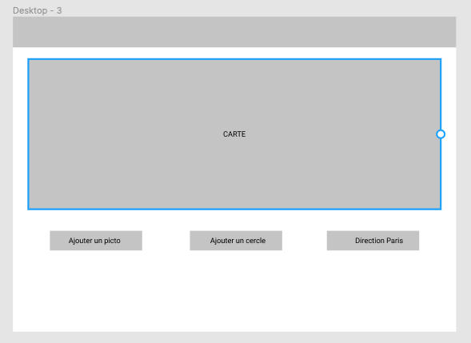

# Les librairies pour vous sauver

Nous avons vu ensemble que jQuery était un vrai gain de temps et de lignes en termes d'écriture de JavaScript. Même si celui-ci n'est plus « aussi obligatoire » / « courant » qu'il y a quelques années ; celui-ci reste quand même un incontournable que vous devez au moins connaitre.

::: tip 2021 ?
En 2021, j'ai envie de dire, vous n'avez plus besoin de jQuery ! Nous avons de super alternatives sans librairies (ES6, etc.), et si vous voulez gagner du temps ? Je vous conseille plutôt la mise en place de Framework autorisant à être intégré comme des librairies (c'est-à-dire dans un petit morceau du site) comme par exemple VueJS.

**Attention, je ne dis pas que jQuery est un mauvais choix ! Je pense juste que celui-ci ne doit pas/plus être automatique en 2021**
:::

Dans ce TP nous allons voir l'avantage des librairies « add-on » que nous avons à disposition sur Internet.

## Créer une page

Première étape, nous allons créer une page vide, elle nous servira de base de travail :

```html
<!DOCTYPE html>
<html lang="en">
  <head>
    <meta charset="UTF-8" />
    <meta http-equiv="X-UA-Compatible" content="IE=edge" />
    <meta name="viewport" content="width=device-width, initial-scale=1.0" />
    <title>Document</title>
  </head>
  <body></body>
</html>
```

::: tip N'oubliez pas
Votre IDE intègre très certainement un template permettant la création du fichier en automatique. Exemple sous VSCode il suffit de saisir :

`html:5` suivi de la touche `tab`
:::

Notre page est vide ! Profitons-en pour ajouter jQuery, vous avez deux choix possibles :

- Télécharger jQuery
- Utiliser un CDN

Il n'y a pas de réponse magique, l'un comme l'autre ça va fonctionner. Cependant, ayez en tête que si vous choisissez de passer par un CDN **vous devrez avoir Internet** pour que votre site fonctionne.

::: danger Et la sécu ?
Autre point important, jQuery « c'est que du JavaScript », en utilisant un CDN vous téléchargez du code depuis Internet sans savoir ce qui est dedans. **Pire** le contenu peut être différent, voire modifié par un tiers plus tard dans la vie de votre site Internet.

**Donc attention**
:::

Dans notre cas, il suffit d'ajouter avant la fermeture de `</body>` :

```html
<script src="https://ajax.googleapis.com/ajax/libs/jquery/3.5.1/jquery.min.js"></script>
```

## Votre première librairie : Datatable

C'est chiant les tableaux non ? La pagination vous n'aimez pas ça non ? Trier les données ne vous intéresse pas ? Eh bien, rassurez-vous ! Globalement personne n'aime ça ! Les développeurs étant globalement fainéants… Ils ont créé des librairies permettant de ne plus écrire le code « chiant ». La gestion des tableaux en faisant partie, je vous propose de mettre en place dans votre site Internet l'excellente librairie [Datatable](https://datatables.net/).

Comme pour jQuery vous avez deux choix, le CDN ou la version téléchargée. Dans ce TP je vous propose d'utiliser la version CDN (par simplicité), nous allons donc ajouter dans notre code :

```html
<link
  rel="stylesheet"
  href="https://cdn.datatables.net/1.10.23/css/jquery.dataTables.min.css"
/>
<script src="https://cdn.datatables.net/1.10.23/js/jquery.dataTables.min.js"></script>
```

### Ajouter une table

Nous faisons du JavaScript pas du HTML, je vous laisse donc écrire votre tableau, quelques consignes cependant :

- Au moins 5 colonnes. (`td*5`).
- Au moins 100 lignes. (`tr*100`, `tr*100>td*5`).
- Une ligne d'entête. (`thead>tr>th`).
- Doit posséder un id. (`table#myTable`).

<center>

N'oubliez pas… Votre IDE va vous aider… Il contient `emmet` !

<iframe src="https://giphy.com/embed/0DYipdNqJ5n4GYATKL" width="480" height="360" frameBorder="0" class="giphy-embed" allowFullScreen></iframe>

Vous pouvez donc écrire :

`table#myTable>(thead>tr>th*5>lorem1)+(tbody>tr*100>td*5>lorem)` puis `tab`.

</center>

### Transformer votre tableau

Nous avons maintenant une page, un tableau… Et un truc pas vraiment sexy. C'est là où Datatable va entrer en jeu. Avec un simple petit ajout de JavaScript dans votre page, nous allons transformer ce simple tableau en SUPER TABLEAU.

```js
$(document).ready(function () {
  $("#myTable").DataTable();
});
```

Je vous laisse mettre le code.

## Votre 2de librairie : FullCalendar

Dans le même genre, nous avons également FullCalendar. [FullCalendar](https://fullcalendar.io/) est une librairie qui nous affiche un calendrier. Ce n’est certes pas une problématique que vous allez souvent rencontrer, mais si ça vous arrive avant de vouloir tout développer vous-même sachez que certains ont déjà réfléchi à ce sujet… Et mieux que vous !

Je vous propose d'installer FullCalendar [dans votre site](https://fullcalendar.io/docs/initialize-globals):

```html
<link
  href="https://cdn.jsdelivr.net/npm/fullcalendar@5.5.1/main.min.css"
  rel="stylesheet"
/>
<script src="https://cdn.jsdelivr.net/npm/fullcalendar@5.5.1/main.min.js"></script>
<script>
  document.addEventListener("DOMContentLoaded", function () {
    var calendarEl = document.getElementById("calendar");
    var calendar = new FullCalendar.Calendar(calendarEl, {
      initialView: "dayGridMonth",
    });
    calendar.render();
  });
</script>

<div id="calendar"></div>
```

✋ Hey ! Mais il n'y a pas de jQuery ici ? Effectivement… Pas de jQuery ici, FullCalendar n'a pas de dépendance à jQuery.

### Ajouter des événements

Pour ajouter des événements, [il suffit de suivre la documentation par exemple](https://fullcalendar.io/docs/event-parsing)

Exemple :

```js
document.addEventListener("DOMContentLoaded", function () {
  var calendarEl = document.getElementById("calendar");
  var calendar = new FullCalendar.Calendar(calendarEl, {
    initialView: "dayGridMonth",
    events: [
      {
        title: "New Year",
        start: "2021-01-01",
        end: "2021-01-01",
      },
      {
        title: "Valentin Brosseau",
        start: "2021-02-28",
        end: "2021-02-28",
      },
    ],
  });
  calendar.render();
});
```

## Et si nous voulons une carte ?

Google Maps c'est pratique ? Si vous souhaitez un Google Maps intégrable et manipulable en code directement dans votre code, c'est possible ; et c'est plutôt simple…

Grâce à [Leaflet](https://leafletjs.com/) réaliser des cartes c'est très simple ! Pour l'ajouter dans votre projet :

- Dans votre head :

```html
<link
  rel="stylesheet"
  href="https://unpkg.com/leaflet@1.7.1/dist/leaflet.css"
  integrity="sha512-xodZBNTC5n17Xt2atTPuE1HxjVMSvLVW9ocqUKLsCC5CXdbqCmblAshOMAS6/keqq/sMZMZ19scR4PsZChSR7A=="
  crossorigin=""
/>
<script
  src="https://unpkg.com/leaflet@1.7.1/dist/leaflet.js"
  integrity="sha512-XQoYMqMTK8LvdxXYG3nZ448hOEQiglfqkJs1NOQV44cWnUrBc8PkAOcXy20w0vlaXaVUearIOBhiXZ5V3ynxwA=="
  crossorigin=""
></script>

<style>
  #mapid {
    height: 180px;
  }
</style>
```

- Dans le body, à l'endroit où vous souhaiterez avoir la carte :

```html
<div id="mapid"></div>
<script>
  var mymap = L.map("mapid").setView([47.4661788, -0.5560418], 13);
  L.tileLayer("https://{s}.tile.openstreetmap.org/{z}/{x}/{y}.png", {
    maxZoom: 18,
    attribution:
      'Map data &copy; <a href="https://www.openstreetmap.org/copyright">OpenStreetMap</a> contributors',
    id: "mapbox/streets-v11",
    tileSize: 512,
    zoomOffset: -1,
  }).addTo(mymap);
</script>
```

Et c'est TOUT ! Votre carte est maintenant disponible.

Je vous laisse intégrer ce code.

### Ajouter un marker dans la carte

```javascript
var marker = L.marker([47.4661788, -0.5560418]).addTo(mymap);
```

C'est à vous, je vous laisse ajouter le code.

## Allons plus loin… VueJS en tant que librairie

Utiliser du code automatique c'est bien… Mais nous avons accès à d'autres librairies ! Des librairies, un peu comme jQuery, des librairies permettant d'écrire moins de code, rendre notre code dynamique, globalement mieux travailler.

Vous allez voir c'est très simple, mais alors très simple.

- Dans votre head :

```html
<script src="https://cdn.jsdelivr.net/npm/vue@2/dist/vue.js"></script>
```

- Dans votre page :

```html
<div id="app">
  <h1>{{message}}</h1>
  <input type="button" value="Click" @click="clickMe" />
</div>

<script>
  var app = new Vue({
    el: "#app",
    data: {
      message: "Bonjour 👋!",
    },
    methods: {
      clickMe() {
        alert("Click YES");
      },
    },
  });
</script>
```

👀 Je vous laisse tester.

## Allons plus loin… VueJS et Leaflet

Avec le code précédent, nous avons vu qu'il était finalement assez simple d'ajouter VueJS dans un site existant. Nous pourrions utiliser l'excellent Vue2Leaflet… Mais finalement ce n’est pas forcément obligatoire.

En utilisant le code du premier exemple, je vous propose d'ajouter une carte interactive. Cette fois-ci pas de code fourni. ~Vous allez l'écrire~, nous allons l'écrire ensemble. Je vous offre juste le visuel à réaliser (vous allez être déçu 👀) :



On attaque ?
