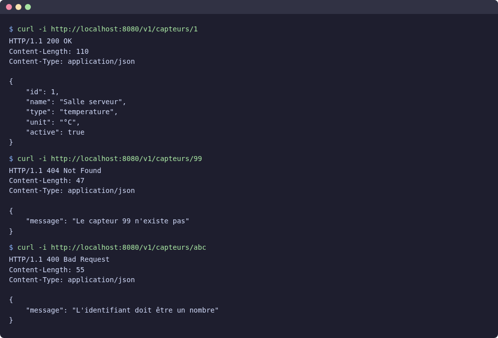
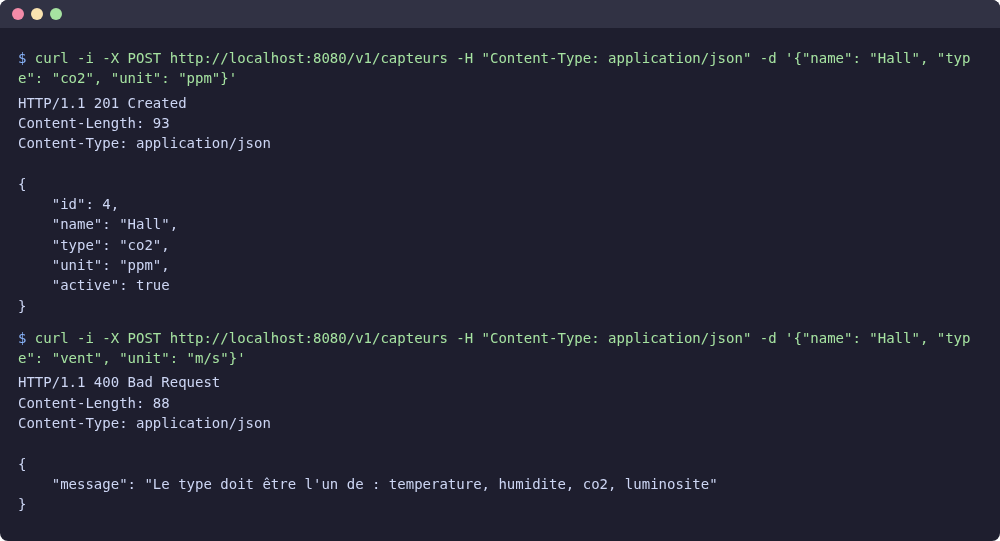
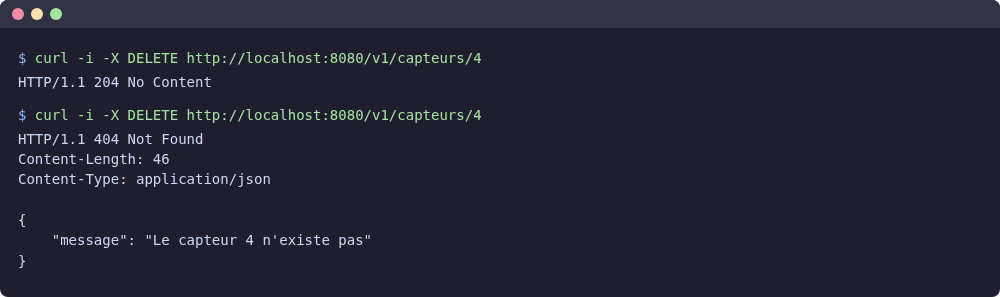
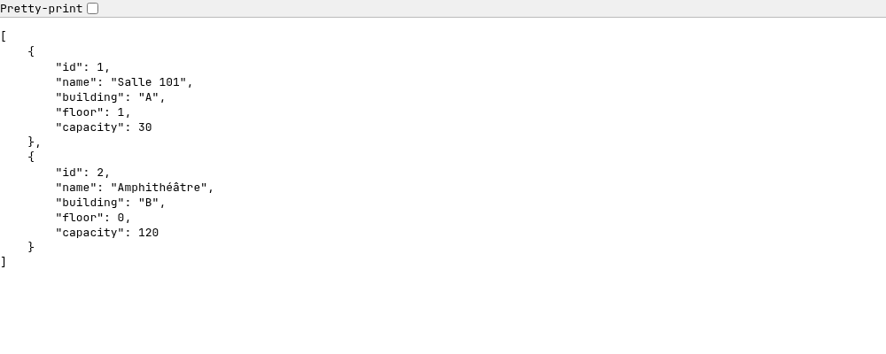
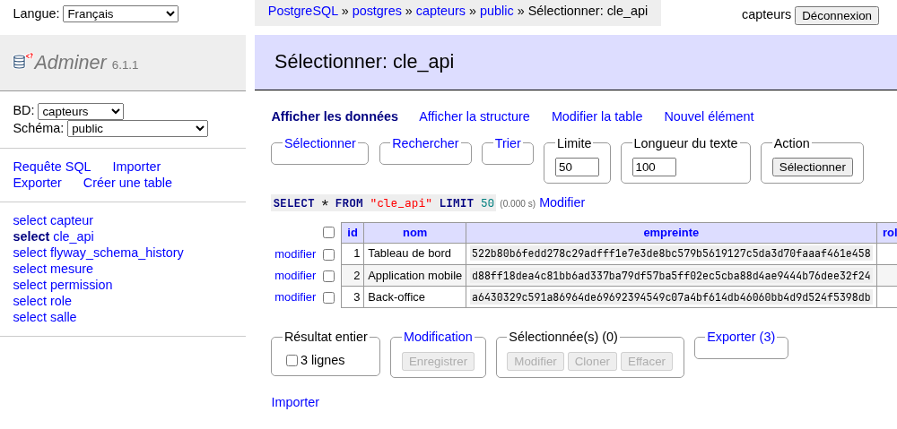
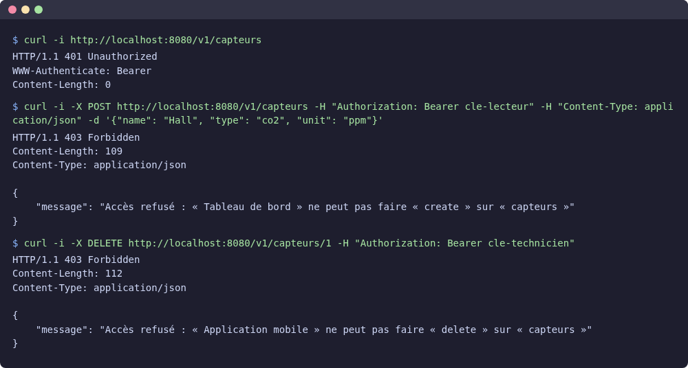
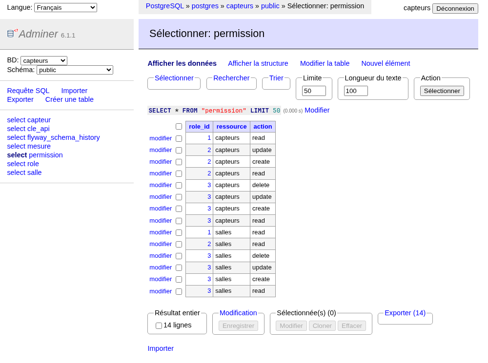

# Créer des API avec Kotlin : CRUD et droits

::: details Sommaire
[[toc]]
:::

## Introduction

Dans le [TP précédent](./decouverte.md), nous avons mis en place toute la structure de notre API : la base PostgreSQL, les migrations, Exposed, Koin et une première route qui liste les capteurs.

Dans ce TP, nous allons nous appuyer sur cette structure pour :

1. **compléter le CRUD des capteurs** : obtenir, créer, modifier et supprimer, avec une gestion propre des erreurs (partie guidée) ;
2. **créer une seconde ressource, les salles**, cette fois en autonomie ;
3. **protéger l'API avec un système de droits** : chaque client s'identifie avec une clé, et son rôle détermine ce qu'il a le droit de faire (partie guidée) ;
4. **appliquer ces droits aux salles**, en autonomie.

## Prérequis

- Avoir terminé le [TP précédent](./decouverte.md) : la route `GET /v1/capteurs` doit fonctionner. Pas de panique si ce n'est pas le cas : [récupérez le projet ici](/demo/ktor/api-capteurs-tp1.zip).
- La stack Docker doit être démarrée : `docker compose up -d --wait`.
- Connaître les codes de réponse HTTP : l'[aide-mémoire API](/cheatsheets/api/#un-code-une-signification) les résume. Pour la syntaxe Kotlin (`require`, `?:`, `companion object`, lambdas…), gardez l'[aide-mémoire Kotlin](/cheatsheets/kotlin/) sous la main.

::: tip Un TP en deux séances
Ce TP est copieux. Il se découpe naturellement en deux séances : les parties 1 et 2 (le CRUD), puis les parties 3 et 4 (les droits). Les points étape Git marquent les bons endroits pour s'arrêter.
:::

## Objectifs

À la fin de ce TP vous saurez :

- écrire les quatre opérations d'un CRUD avec Ktor et Exposed ;
- recevoir et valider des données JSON ;
- renvoyer les bons codes HTTP (`200`, `201`, `204`, `400`, `404`) et des messages d'erreur clairs ;
- reproduire seuls toute la structure pour une nouvelle ressource ;
- distinguer l'**authentification** de l'**autorisation** (et donc les codes `401` et `403`) ;
- mettre en place des droits par rôle, ressource et action.

## Partie 1 : le CRUD des capteurs

### Gérer les erreurs proprement

Que doit répondre l'API si on demande le capteur numéro 99, qui n'existe pas ? Une erreur `404`, avec un message clair. Et si le nom d'un capteur est vide ? Une erreur `400`.

Plutôt que de gérer ces cas dans chaque route, nous allons utiliser des **exceptions** : n'importe quelle couche (le plus souvent le service) lève une exception, et un plugin Ktor, **StatusPages**, la transforme en réponse HTTP.

Commencez par créer le package `com.example.common` et le fichier `ApiException.kt` :

```kotlin
package com.example.common

import io.ktor.http.HttpStatusCode
import kotlinx.serialization.Serializable

class ApiException(val status: HttpStatusCode, message: String) : Exception(message)

@Serializable
data class ErrorResponse(val message: String)
```

- `ApiException` : notre exception « métier », qui porte le code HTTP à renvoyer ;
- `ErrorResponse` : le format JSON de toutes nos erreurs, par exemple `{ "message": "Le capteur 99 n'existe pas" }`.

Puis créez `plugins/ErrorHandling.kt` :

```kotlin
package com.example.plugins

import com.example.common.ApiException
import com.example.common.ErrorResponse
import io.ktor.http.HttpStatusCode
import io.ktor.server.application.Application
import io.ktor.server.application.install
import io.ktor.server.application.log
import io.ktor.server.plugins.BadRequestException
import io.ktor.server.plugins.statuspages.StatusPages
import io.ktor.server.response.respond

fun Application.configureErrorHandling() {
    install(StatusPages) {
        // Nos erreurs « métier » : 404, 400…
        exception<ApiException> { call, cause ->
            call.respond(cause.status, ErrorResponse(cause.message ?: "Erreur"))
        }
        // Un JSON mal formé ou incomplet
        exception<BadRequestException> { call, _ ->
            call.respond(HttpStatusCode.BadRequest, ErrorResponse("Le corps de la requête est invalide"))
        }
        // Une règle de validation non respectée (require)
        exception<IllegalArgumentException> { call, cause ->
            call.respond(HttpStatusCode.BadRequest, ErrorResponse(cause.message ?: "Requête invalide"))
        }
        // Tout le reste : on journalise et on ne révèle rien au client
        exception<Throwable> { call, cause ->
            call.application.log.error("Erreur inattendue", cause)
            call.respond(HttpStatusCode.InternalServerError, ErrorResponse("Erreur interne du serveur"))
        }
    }
}
```

Pour chaque type d'exception, on indique la réponse à envoyer. StatusPages choisit toujours le gestionnaire **le plus précis** : une `ApiException` est traitée par le premier bloc, et seules les exceptions non prévues arrivent dans le dernier.

::: warning Ne jamais révéler une erreur interne
Le dernier bloc renvoie un message générique, et écrit le détail dans les logs du serveur. Renvoyer le message d'une exception inattendue au client pourrait révéler des informations sur votre code ou votre base de données (noms de tables, requêtes…), qu'un attaquant saurait exploiter.
:::

Enfin, ajoutez `configureErrorHandling()` dans `Application.kt`, juste après `configureSerialization()` :

```kotlin
fun Application.module() {
    configureKoin()
    configureDatabase()
    configureSerialization()
    configureErrorHandling()
    configureRouting()
}
```

### Lire l'identifiant dans l'URL

Plusieurs routes vont recevoir un identifiant dans l'URL (`/v1/capteurs/{id}`). Pour ne pas répéter la lecture et la vérification de ce paramètre, créez une petite fonction dans `common/CallExtensions.kt` :

```kotlin
package com.example.common

import io.ktor.http.HttpStatusCode
import io.ktor.server.application.ApplicationCall

fun ApplicationCall.requireId(): Int =
    parameters["id"]?.toIntOrNull()
        ?: throw ApiException(HttpStatusCode.BadRequest, "L'identifiant doit être un nombre")
```

`parameters["id"]` lit le paramètre `{id}` de l'URL, sous forme de texte. `toIntOrNull()` le convertit en nombre, ou renvoie `null` si ce n'est pas possible (`/v1/capteurs/abc`) : dans ce cas, l'opérateur `?:` lève une erreur `400`.

### Obtenir un capteur

Nous allons maintenant ajouter chaque opération en suivant toujours le même chemin : **DAO**, puis **service**, puis **route**.

**Le DAO.** Ajoutez la méthode dans l'interface :

```kotlin
interface SensorDao {
    fun findAll(): List<Sensor>
    fun findById(id: Int): Sensor?
}
```

Puis son implémentation dans `ExposedSensorDao` (pensez à l'import `org.jetbrains.exposed.v1.core.eq`) :

```kotlin
override fun findById(id: Int): Sensor? = transaction {
    SensorTable.selectAll()
        .where { SensorTable.id eq id }
        .map { it.toSensor() }
        .singleOrNull()
}
```

- `.where { SensorTable.id eq id }` est l'équivalent de `WHERE id = ?`. Le mot `eq` (*equal*) remplace le `=` du SQL ;
- `.singleOrNull()` renvoie l'unique élément de la liste, ou `null` si elle est vide. D'où le type de retour `Sensor?` : le capteur peut ne pas exister.

**Le service.** C'est lui qui décide que « pas de capteur » signifie « erreur 404 » :

```kotlin
package com.example.sensor

import com.example.common.ApiException
import io.ktor.http.HttpStatusCode

class SensorService(private val sensorDao: SensorDao) {

    fun getAll(): List<Sensor> = sensorDao.findAll()

    fun getById(id: Int): Sensor =
        sensorDao.findById(id) ?: throw notFound(id)

    private fun notFound(id: Int) = ApiException(HttpStatusCode.NotFound, "Le capteur $id n'existe pas")
}
```

Remarquez que `getById` renvoie un `Sensor` et non un `Sensor?` : si la fonction se termine normalement, c'est que le capteur existe. La couche du dessus n'a plus à gérer le cas `null`.

**La route.** Dans `SensorRoutes.kt`, ajoutez l'import `com.example.common.requireId`, puis à l'intérieur du bloc `route("/capteurs")` :

```kotlin
get("/{id}") {
    call.respond(sensorService.getById(call.requireId()))
}
```

::: tip Point de contrôle
Relancez le serveur, puis testez les trois cas :

```sh
curl -i http://localhost:8080/v1/capteurs/1     # 200 et le capteur
curl -i http://localhost:8080/v1/capteurs/99    # 404 et « Le capteur 99 n'existe pas »
curl -i http://localhost:8080/v1/capteurs/abc   # 400 et « L'identifiant doit être un nombre »
```

L'option `-i` affiche aussi les en-têtes de la réponse, et donc le code HTTP :


:::

### Créer un capteur

Pour créer un capteur, le client envoie du JSON. Mais il n'envoie pas tout : l'`id`, c'est la base qui le choisit. Il nous faut donc un second objet, qui décrit **ce que l'API reçoit**. Complétez `Sensor.kt` :

```kotlin
package com.example.sensor

import kotlinx.serialization.Serializable

// Ce que l'API renvoie
@Serializable
data class Sensor(
    val id: Int,
    val name: String,
    val type: String,
    val unit: String,
    val active: Boolean
)

// Ce que l'API reçoit pour créer ou modifier un capteur
@Serializable
data class SensorRequest(
    val name: String,
    val type: String,
    val unit: String,
    val active: Boolean = true
) {
    fun validate() {
        require(name.isNotBlank()) { "Le nom est obligatoire" }
        require(type in ALLOWED_TYPES) { "Le type doit être l'un de : ${ALLOWED_TYPES.joinToString()}" }
        require(unit.isNotBlank()) { "L'unité est obligatoire" }
    }

    companion object {
        val ALLOWED_TYPES = listOf("temperature", "humidite", "co2", "luminosite")
    }
}
```

- `active: Boolean = true` : un champ avec une valeur par défaut devient **facultatif** dans le JSON reçu ;
- `require(condition) { message }` lève une `IllegalArgumentException` si la condition est fausse. StatusPages la transformera en `400`, avec notre message ;
- `companion object` contient ce qui appartient à la classe elle-même plutôt qu'à chaque objet (l'équivalent d'un `static`).

Question :

- Le type JSON est vérifié automatiquement : si le client envoie `"name": 42`, la désérialisation échoue. Pourquoi faut-il quand même une méthode `validate()` ?

::: details Réponse
La désérialisation vérifie la **forme** des données (les champs obligatoires sont présents, les types sont corrects). Elle ne vérifie pas leur **sens** : `"name": ""` est une chaîne valide, mais un capteur sans nom n'a pas de sens pour notre application. Ce sont des règles métier, et c'est à nous de les écrire.
:::

**Le DAO.** Dans l'interface, ajoutez :

```kotlin
fun create(request: SensorRequest): Sensor
```

Puis l'implémentation (import `org.jetbrains.exposed.v1.jdbc.insert`) :

```kotlin
override fun create(request: SensorRequest): Sensor = transaction {
    val newId = SensorTable.insert {
        it[SensorTable.name] = request.name
        it[SensorTable.type] = request.type
        it[SensorTable.unit] = request.unit
        it[SensorTable.active] = request.active
    }[SensorTable.id]

    Sensor(newId, request.name, request.type, request.unit, request.active)
}
```

`insert { ... }` exécute un `INSERT INTO capteur (...) VALUES (...)`. Dans le bloc, `it[colonne] = valeur` associe chaque valeur à sa colonne. À la fin, `[SensorTable.id]` récupère l'identifiant généré par la base (le `SERIAL`).

**Le service.** On valide **avant** d'enregistrer :

```kotlin
fun create(request: SensorRequest): Sensor {
    request.validate()
    return sensorDao.create(request)
}
```

**La route.** Ajoutez les imports `io.ktor.http.HttpStatusCode` et `io.ktor.server.request.receive`, puis :

```kotlin
post {
    val request = call.receive<SensorRequest>()
    call.respond(HttpStatusCode.Created, sensorService.create(request))
}
```

- `call.receive<SensorRequest>()` lit le corps de la requête et le convertit en `SensorRequest`. Si le JSON est invalide, Ktor lève une `BadRequestException` (et donc une `400`, grâce à StatusPages) ;
- `HttpStatusCode.Created` est le code `201` : la ressource a été créée. On renvoie l'objet créé, avec son nouvel `id`.

::: tip Point de contrôle
```sh
curl -i -X POST http://localhost:8080/v1/capteurs \
  -H "Content-Type: application/json" \
  -d '{"name": "Hall", "type": "co2", "unit": "ppm"}'
```

Vous obtenez un code `201` et le capteur créé, avec son nouvel `id` (4 si vous n'avez pas ajouté de capteur à la fin du TP précédent) et `"active": true`. Essayez ensuite avec `"name": ""`, avec `"type": "vent"`, puis avec un JSON incomplet comme `{"name": "Hall"}` : vous devez obtenir trois erreurs `400`, chacune avec un message différent.


:::

::: details Les commandes curl sous Windows
Le `\` en fin de ligne permet d'écrire une commande sur plusieurs lignes sous Linux et macOS. Sous Windows, écrivez la commande sur une seule ligne, utilisez `curl.exe` dans PowerShell, et échappez les guillemets du JSON :

```sh
curl.exe -i -X POST http://localhost:8080/v1/capteurs -H "Content-Type: application/json" -d "{\"name\": \"Hall\", \"type\": \"co2\", \"unit\": \"ppm\"}"
```

Un client graphique comme [Postman](https://www.postman.com/) vous évitera ces subtilités.
:::

### Point étape : Git

```sh
git add .
git commit -m "Capteurs : obtenir et créer, gestion des erreurs"
```

### Modifier un capteur

Pour la modification, nous utilisons le verbe `PUT` : le client envoie le capteur **complet**, qui remplace l'ancien. On réutilise donc `SensorRequest`.

**Le DAO.** Dans l'interface :

```kotlin
fun update(id: Int, request: SensorRequest): Sensor?
```

Et l'implémentation (import `org.jetbrains.exposed.v1.jdbc.update`) :

```kotlin
override fun update(id: Int, request: SensorRequest): Sensor? = transaction {
    val updatedRows = SensorTable.update({ SensorTable.id eq id }) {
        it[SensorTable.name] = request.name
        it[SensorTable.type] = request.type
        it[SensorTable.unit] = request.unit
        it[SensorTable.active] = request.active
    }

    if (updatedRows == 0) null else Sensor(id, request.name, request.type, request.unit, request.active)
}
```

`update` prend deux paramètres : la condition (le `WHERE`), puis les nouvelles valeurs (le `SET`). Il renvoie le **nombre de lignes modifiées** : 0 signifie qu'aucun capteur ne porte cet identifiant.

**Le service.** C'est à vous de jouer ! En vous inspirant de `getById` et de `create`, écrivez la méthode `update(id: Int, request: SensorRequest): Sensor`. Elle doit valider la requête, puis lever une `404` si le capteur n'existe pas.

::: details Voir l'une des solutions possibles
```kotlin
fun update(id: Int, request: SensorRequest): Sensor {
    request.validate()
    return sensorDao.update(id, request) ?: throw notFound(id)
}
```
:::

**La route.** Je vous laisse aussi écrire la route `PUT /{id}` (import `io.ktor.server.routing.put`). Elle combine ce que font `get("/{id}")` et `post`.

::: details Voir l'une des solutions possibles
```kotlin
put("/{id}") {
    val request = call.receive<SensorRequest>()
    call.respond(sensorService.update(call.requireId(), request))
}
```

Pas besoin de préciser le code : par défaut, `call.respond` renvoie `200`.
:::

::: tip Point de contrôle
```sh
curl -i -X PUT http://localhost:8080/v1/capteurs/4 \
  -H "Content-Type: application/json" \
  -d '{"name": "Hall principal", "type": "co2", "unit": "ppm", "active": false}'
```

Remplacez `4` par l'identifiant obtenu à la création. Vous obtenez un `200` et le capteur modifié. La même requête sur `/v1/capteurs/99` renvoie une `404`.
:::

### Supprimer un capteur

Dernière opération. Cette fois, je vous laisse écrire les trois couches, avec les indications suivantes :

- **DAO** : `fun delete(id: Int): Boolean`, qui renvoie `true` si un capteur a été supprimé. La fonction Exposed s'appelle `deleteWhere` (import `org.jetbrains.exposed.v1.jdbc.deleteWhere`) et renvoie le nombre de lignes supprimées.
- **Service** : `fun delete(id: Int)`, qui lève une `404` si rien n'a été supprimé.
- **Route** : `DELETE /{id}` (import `io.ktor.server.routing.delete`), qui répond `204 No Content` (la suppression a réussi, et il n'y a rien à renvoyer).

::: details Coup de pouce : le DAO
```kotlin
override fun delete(id: Int): Boolean = transaction {
    SensorTable.deleteWhere { SensorTable.id eq id } > 0
}
```
:::

::: details Voir l'une des solutions possibles
```kotlin
// SensorService.kt
fun delete(id: Int) {
    if (!sensorDao.delete(id)) throw notFound(id)
}
```

```kotlin
// SensorRoutes.kt
delete("/{id}") {
    sensorService.delete(call.requireId())
    call.respond(HttpStatusCode.NoContent)
}
```
:::

::: tip Point de contrôle
```sh
curl -i -X DELETE http://localhost:8080/v1/capteurs/4   # 204
curl -i -X DELETE http://localhost:8080/v1/capteurs/4   # 404 : il n'existe plus
```

Là encore, remplacez `4` par l'identifiant de votre capteur « Hall ».


:::

### Le bilan du CRUD

Votre fichier `SensorRoutes.kt` doit maintenant ressembler à ceci :

```kotlin
package com.example.sensor

import com.example.common.requireId
import io.ktor.http.HttpStatusCode
import io.ktor.server.request.receive
import io.ktor.server.response.respond
import io.ktor.server.routing.Route
import io.ktor.server.routing.delete
import io.ktor.server.routing.get
import io.ktor.server.routing.post
import io.ktor.server.routing.put
import io.ktor.server.routing.route
import org.koin.ktor.ext.inject

fun Route.sensorRoutes() {
    val sensorService by inject<SensorService>()

    route("/capteurs") {
        get {
            call.respond(sensorService.getAll())
        }

        get("/{id}") {
            call.respond(sensorService.getById(call.requireId()))
        }

        post {
            val request = call.receive<SensorRequest>()
            call.respond(HttpStatusCode.Created, sensorService.create(request))
        }

        put("/{id}") {
            val request = call.receive<SensorRequest>()
            call.respond(sensorService.update(call.requireId(), request))
        }

        delete("/{id}") {
            sensorService.delete(call.requireId())
            call.respond(HttpStatusCode.NoContent)
        }
    }
}
```

Et voici les codes HTTP que renvoie notre API :

| Code | Signification | Quand ? |
|---|---|---|
| `200 OK` | Succès | Lecture, modification |
| `201 Created` | Ressource créée | Création |
| `204 No Content` | Succès, rien à renvoyer | Suppression |
| `400 Bad Request` | Requête invalide | Identifiant non numérique, JSON invalide, règle métier non respectée |
| `404 Not Found` | Ressource inexistante | Mauvais identifiant |
| `500 Internal Server Error` | Erreur du serveur | Un bug : à corriger ! |

Question :

- Où se trouve la règle « un capteur doit avoir un nom » ? Et la règle « un capteur inexistant donne une 404 » ? Pourquoi pas dans la route ?

::: details Réponse
Les deux règles sont dans le **service** (via `validate()` et `notFound()`). La route ne fait que traduire HTTP en appels de méthodes. Si demain les capteurs peuvent aussi être créés autrement (un import de fichier, une autre route…), les règles s'appliqueront automatiquement, sans être dupliquées.
:::

## Point étape : Git

```sh
git add .
git commit -m "Capteurs : CRUD complet"
```

## Partie 2 : à vous de jouer, les salles

Le bâtiment a des **salles**, et il faut maintenant pouvoir les gérer par l'API. Cette fois, pas de pas-à-pas : vous avez tout ce qu'il faut dans la partie précédente. C'est le moment de vérifier que vous avez compris la structure !

### Le cahier des charges

Une salle possède :

| Champ (JSON) | Colonne (SQL) | Type | Règle |
|---|---|---|---|
| `id` | `id` | entier | généré par la base |
| `name` | `nom` | texte (100) | obligatoire, non vide |
| `building` | `batiment` | texte (50) | obligatoire, non vide |
| `floor` | `etage` | entier | obligatoire (peut être `0` ou négatif) |
| `capacity` | `capacite` | entier | obligatoire, supérieur à 0 |

L'API doit proposer le CRUD complet sur `/v1/salles`, avec les mêmes codes HTTP que pour les capteurs. La table doit contenir deux salles au départ :

- « Salle 101 », bâtiment A, 1er étage, 30 places ;
- « Amphithéâtre », bâtiment B, rez-de-chaussée, 120 places.

### La liste des tâches

1. Une migration `V2__create_salle.sql`, avec la table et les deux salles. La règle « capacité supérieure à 0 » peut aussi être vérifiée par la base, avec une contrainte `CHECK`.
2. Dans un nouveau package `com.example.room` :
   - `Room.kt` : les classes `Room` et `RoomRequest` (avec `validate()`) ;
   - `RoomTable.kt` : la table Exposed ;
   - `RoomDao.kt` : l'interface et son implémentation ;
   - `RoomService.kt` ;
   - `RoomModule.kt` : le module Koin ;
   - `RoomRoutes.kt`.
3. Le branchement : le module Koin dans `plugins/Koin.kt`, les routes dans `plugins/Routing.kt`.

::: tip Une méthode efficace
Ouvrez chaque fichier du package `sensor` à côté de celui que vous écrivez. Mais **ne faites pas de copier-coller de fichiers entiers** en remplaçant les mots : écrivez chaque ligne en vous demandant à quoi elle sert. C'est exactement l'objectif de cet exercice.
:::

::: tip Point de contrôle
- Au démarrage, les logs indiquent `Migrating schema "public" to version "2 - create salle"`.
- `GET /v1/salles` renvoie les deux salles :

  

- Créer une salle avec `"capacity": 0` renvoie une `400` avec un message clair.
- Le CRUD complet fonctionne : création (`201`), lecture, modification, suppression (`204`), et `404` sur une salle inexistante.
:::

::: details Coup de pouce : la migration
```sql
CREATE TABLE salle (
    id        SERIAL PRIMARY KEY,
    nom       VARCHAR(100) NOT NULL,
    batiment  VARCHAR(50)  NOT NULL,
    etage     INTEGER      NOT NULL,
    capacite  INTEGER      NOT NULL CHECK (capacite > 0)
);

INSERT INTO salle (nom, batiment, etage, capacite) VALUES
    ('Salle 101', 'A', 1, 30),
    ('Amphithéâtre', 'B', 0, 120);
```
:::

::: details Coup de pouce : le modèle et la table
```kotlin
// Room.kt
package com.example.room

import kotlinx.serialization.Serializable

@Serializable
data class Room(
    val id: Int,
    val name: String,
    val building: String,
    val floor: Int,
    val capacity: Int
)

@Serializable
data class RoomRequest(
    val name: String,
    val building: String,
    val floor: Int,
    val capacity: Int
) {
    fun validate() {
        require(name.isNotBlank()) { "Le nom est obligatoire" }
        require(building.isNotBlank()) { "Le bâtiment est obligatoire" }
        require(capacity > 0) { "La capacité doit être supérieure à 0" }
    }
}
```

```kotlin
// RoomTable.kt
package com.example.room

import org.jetbrains.exposed.v1.core.Table

object RoomTable : Table("salle") {
    val id = integer("id").autoIncrement()
    val name = varchar("nom", 100)
    val building = varchar("batiment", 50)
    val floor = integer("etage")
    val capacity = integer("capacite")

    override val primaryKey = PrimaryKey(id)
}
```
:::

::: details Voir l'une des solutions possibles
```kotlin
// RoomDao.kt
package com.example.room

import org.jetbrains.exposed.v1.core.ResultRow
import org.jetbrains.exposed.v1.core.eq
import org.jetbrains.exposed.v1.jdbc.deleteWhere
import org.jetbrains.exposed.v1.jdbc.insert
import org.jetbrains.exposed.v1.jdbc.selectAll
import org.jetbrains.exposed.v1.jdbc.transactions.transaction
import org.jetbrains.exposed.v1.jdbc.update

interface RoomDao {
    fun findAll(): List<Room>
    fun findById(id: Int): Room?
    fun create(request: RoomRequest): Room
    fun update(id: Int, request: RoomRequest): Room?
    fun delete(id: Int): Boolean
}

class ExposedRoomDao : RoomDao {

    override fun findAll(): List<Room> = transaction {
        RoomTable.selectAll()
            .orderBy(RoomTable.id)
            .map { it.toRoom() }
    }

    override fun findById(id: Int): Room? = transaction {
        RoomTable.selectAll()
            .where { RoomTable.id eq id }
            .map { it.toRoom() }
            .singleOrNull()
    }

    override fun create(request: RoomRequest): Room = transaction {
        val newId = RoomTable.insert {
            it[RoomTable.name] = request.name
            it[RoomTable.building] = request.building
            it[RoomTable.floor] = request.floor
            it[RoomTable.capacity] = request.capacity
        }[RoomTable.id]

        Room(newId, request.name, request.building, request.floor, request.capacity)
    }

    override fun update(id: Int, request: RoomRequest): Room? = transaction {
        val updatedRows = RoomTable.update({ RoomTable.id eq id }) {
            it[RoomTable.name] = request.name
            it[RoomTable.building] = request.building
            it[RoomTable.floor] = request.floor
            it[RoomTable.capacity] = request.capacity
        }

        if (updatedRows == 0) null else Room(id, request.name, request.building, request.floor, request.capacity)
    }

    override fun delete(id: Int): Boolean = transaction {
        RoomTable.deleteWhere { RoomTable.id eq id } > 0
    }

    private fun ResultRow.toRoom() = Room(
        id = this[RoomTable.id],
        name = this[RoomTable.name],
        building = this[RoomTable.building],
        floor = this[RoomTable.floor],
        capacity = this[RoomTable.capacity]
    )
}
```

```kotlin
// RoomService.kt
package com.example.room

import com.example.common.ApiException
import io.ktor.http.HttpStatusCode

class RoomService(private val roomDao: RoomDao) {

    fun getAll(): List<Room> = roomDao.findAll()

    fun getById(id: Int): Room =
        roomDao.findById(id) ?: throw notFound(id)

    fun create(request: RoomRequest): Room {
        request.validate()
        return roomDao.create(request)
    }

    fun update(id: Int, request: RoomRequest): Room {
        request.validate()
        return roomDao.update(id, request) ?: throw notFound(id)
    }

    fun delete(id: Int) {
        if (!roomDao.delete(id)) throw notFound(id)
    }

    private fun notFound(id: Int) = ApiException(HttpStatusCode.NotFound, "La salle $id n'existe pas")
}
```

```kotlin
// RoomModule.kt
package com.example.room

import org.koin.core.module.dsl.singleOf
import org.koin.dsl.bind
import org.koin.dsl.module

val roomModule = module {
    singleOf(::ExposedRoomDao) bind RoomDao::class
    singleOf(::RoomService)
}
```
:::

::: details Voir l'une des solutions possibles
```kotlin
// RoomRoutes.kt
package com.example.room

import com.example.common.requireId
import io.ktor.http.HttpStatusCode
import io.ktor.server.request.receive
import io.ktor.server.response.respond
import io.ktor.server.routing.Route
import io.ktor.server.routing.delete
import io.ktor.server.routing.get
import io.ktor.server.routing.post
import io.ktor.server.routing.put
import io.ktor.server.routing.route
import org.koin.ktor.ext.inject

fun Route.roomRoutes() {
    val roomService by inject<RoomService>()

    route("/salles") {
        get {
            call.respond(roomService.getAll())
        }

        get("/{id}") {
            call.respond(roomService.getById(call.requireId()))
        }

        post {
            val request = call.receive<RoomRequest>()
            call.respond(HttpStatusCode.Created, roomService.create(request))
        }

        put("/{id}") {
            val request = call.receive<RoomRequest>()
            call.respond(roomService.update(call.requireId(), request))
        }

        delete("/{id}") {
            roomService.delete(call.requireId())
            call.respond(HttpStatusCode.NoContent)
        }
    }
}
```

Dans `plugins/Koin.kt` :

```kotlin
modules(sensorModule, roomModule)
```

Dans `plugins/Routing.kt` :

```kotlin
route("/v1") {
    sensorRoutes()
    roomRoutes()
}
```
:::

## Point étape : Git

```sh
git add .
git commit -m "Salles : CRUD complet"
```

## Partie 3 : les droits

::: tip Vous reprenez à une nouvelle séance ?
Pensez à relancer la stack (`docker compose up -d --wait`). Votre CRUD des capteurs ou des salles ne fonctionne pas complètement ? Pas de panique : [récupérez le projet à cette étape ici](/demo/ktor/api-capteurs-crud.zip) (parties 1 et 2 terminées). Si Flyway refuse alors de démarrer, c'est que votre base contient vos propres migrations : repartez d'une base vide avec `docker compose down -v`.
:::

### Le problème

Pour l'instant, **n'importe qui** peut supprimer tous les capteurs de notre API : il suffit de connaître son adresse. Dans la réalité, plusieurs clients vont l'utiliser, avec des besoins différents :

- un **tableau de bord** affiche les capteurs : il doit pouvoir les lire, rien de plus ;
- l'**application mobile** des techniciens ajoute et modifie des capteurs, mais ne doit pas pouvoir en supprimer ;
- le **back-office** des administrateurs peut tout faire.

### Authentification et autorisation

Deux questions distinctes se posent à chaque requête :

| Question | Nom | En cas d'échec |
|---|---|---|
| **Qui êtes-vous ?** | L'authentification | `401 Unauthorized` : « je ne sais pas qui vous êtes » |
| **Avez-vous le droit de faire ça ?** | L'autorisation | `403 Forbidden` : « je sais qui vous êtes, mais c'est interdit » |

Pour l'authentification, chaque client recevra une **clé d'API** : une chaîne secrète qu'il envoie dans l'en-tête de chaque requête :

```
Authorization: Bearer cle-lecteur
```

Pour l'autorisation, nous allons construire un modèle simple, mais très répandu :

- chaque clé est rattachée à un **rôle** (lecteur, technicien, administrateur) ;
- chaque rôle possède des **permissions** : une **action** (`read`, `create`, `update`, `delete`) sur une **ressource** (`capteurs`, `salles`).

```
cle_api ──► role ──► permission (ressource, action)

« Tableau de bord » ──► lecteur ──► (capteurs, read)
« Application mobile » ──► technicien ──► (capteurs, read), (capteurs, create), (capteurs, update)
```

Chaque route déclarera la permission dont elle a besoin : par exemple, `DELETE /v1/capteurs/{id}` exige l'action `delete` sur la ressource `capteurs`.

Question :

- Pourquoi rattacher les permissions à un rôle, plutôt que directement à chaque clé ?

::: details Réponse
Parce que plusieurs clés partagent les mêmes droits : les dix tablettes des techniciens ont chacune leur clé, mais toutes ont le rôle « technicien ». Pour donner un nouveau droit aux techniciens, on ajoute **une** permission au rôle, au lieu de modifier dix clés. Et pour révoquer une tablette perdue, on supprime **sa** clé sans toucher aux autres.
:::

### La migration

Créez `V3__create_droits.sql` :

```sql
CREATE TABLE role (
    id   SERIAL PRIMARY KEY,
    nom  VARCHAR(50) NOT NULL UNIQUE
);

CREATE TABLE cle_api (
    id         SERIAL PRIMARY KEY,
    nom        VARCHAR(100) NOT NULL,
    empreinte  CHAR(64)     NOT NULL UNIQUE,
    role_id    INTEGER      NOT NULL REFERENCES role (id)
);

CREATE TABLE permission (
    role_id    INTEGER     NOT NULL REFERENCES role (id),
    ressource  VARCHAR(50) NOT NULL,
    action     VARCHAR(10) NOT NULL CHECK (action IN ('read', 'create', 'update', 'delete')),
    PRIMARY KEY (role_id, ressource, action)
);

INSERT INTO role (nom) VALUES ('lecteur'), ('technicien'), ('administrateur');

-- Les clés ne sont jamais stockées en clair : on garde uniquement leur empreinte SHA-256
INSERT INTO cle_api (nom, empreinte, role_id) VALUES
    ('Tableau de bord', encode(sha256('cle-lecteur'::bytea), 'hex'), (SELECT id FROM role WHERE nom = 'lecteur')),
    ('Application mobile', encode(sha256('cle-technicien'::bytea), 'hex'), (SELECT id FROM role WHERE nom = 'technicien')),
    ('Back-office', encode(sha256('cle-admin'::bytea), 'hex'), (SELECT id FROM role WHERE nom = 'administrateur'));

-- Le lecteur consulte, le technicien gère les capteurs sans pouvoir en supprimer, l'administrateur peut tout faire
INSERT INTO permission (role_id, ressource, action)
SELECT r.id, 'capteurs', a.action
FROM role r
JOIN (VALUES
    ('lecteur', 'read'),
    ('technicien', 'read'), ('technicien', 'create'), ('technicien', 'update'),
    ('administrateur', 'read'), ('administrateur', 'create'), ('administrateur', 'update'), ('administrateur', 'delete')
) AS a (role, action) ON a.role = r.nom;
```

Quelques points à remarquer :

- **la clé primaire de `permission` est composée** des trois colonnes : un rôle ne peut pas avoir deux fois la même permission ;
- **les clés ne sont pas stockées en clair**, seulement leur **empreinte** (*hash*) SHA-256. Si la base fuite, les clés restent inutilisables. C'est le même principe que pour les mots de passe ;
- la dernière requête insère toutes les permissions d'un coup, à partir d'une petite liste (`VALUES`) jointe à la table `role`. Elle évite d'écrire les identifiants des rôles en dur.

Nos trois clés de test sont donc `cle-lecteur`, `cle-technicien` et `cle-admin`.

::: danger Des clés de développement
Des clés écrites dans une migration sont visibles par tous ceux qui ont accès au code : elles ne servent **qu'au développement**. En production, les clés sont générées aléatoirement (au moins 32 caractères) puis transmises une seule fois au client, et seule leur empreinte est enregistrée.
:::

::: details SHA-256 pour des clés, mais pas pour des mots de passe ?
Une empreinte SHA-256 se calcule très vite. Pour un mot de passe choisi par un humain (souvent court et prévisible), c'est un défaut : un attaquant peut tester des milliards de combinaisons. On utilise alors un algorithme volontairement lent comme bcrypt (voir le [TP sur l'authentification](/tp/securite/tp4_authentification.md)). Une clé d'API générée aléatoirement est longue et imprévisible : SHA-256 suffit, et la vérification reste rapide à chaque requête.
:::

### Le package security

Créez le package `com.example.security`. Commençons par deux petites définitions, dans `ApiClient.kt` :

```kotlin
package com.example.security

// Le « qui » de la requête : le client identifié par sa clé d'API
data class ApiClient(val name: String, val roleId: Int)

// Les actions possibles sur une ressource
enum class Action(val code: String) {
    READ("read"),
    CREATE("create"),
    UPDATE("update"),
    DELETE("delete")
}
```

Puis la description des tables, dans `SecurityTables.kt` :

```kotlin
package com.example.security

import org.jetbrains.exposed.v1.core.Table

object ApiKeyTable : Table("cle_api") {
    val id = integer("id").autoIncrement()
    val name = varchar("nom", 100)
    val hash = char("empreinte", 64)
    val roleId = integer("role_id")

    override val primaryKey = PrimaryKey(id)
}

object PermissionTable : Table("permission") {
    val roleId = integer("role_id")
    val resource = varchar("ressource", 50)
    val action = varchar("action", 10)

    override val primaryKey = PrimaryKey(roleId, resource, action)
}
```

Nous n'avons pas besoin de décrire la table `role` : le code n'utilise que son identifiant, présent dans les deux autres tables.

### Le DAO et le service

Le DAO répond à deux questions : « à quel client correspond cette empreinte ? » et « ce rôle a-t-il cette permission ? ». Créez `SecurityDao.kt` :

```kotlin
package com.example.security

import org.jetbrains.exposed.v1.core.and
import org.jetbrains.exposed.v1.core.eq
import org.jetbrains.exposed.v1.jdbc.selectAll
import org.jetbrains.exposed.v1.jdbc.transactions.transaction

interface SecurityDao {
    fun findClientByHash(hash: String): ApiClient?
    fun hasPermission(roleId: Int, resource: String, action: Action): Boolean
}

class ExposedSecurityDao : SecurityDao {

    override fun findClientByHash(hash: String): ApiClient? = transaction {
        ApiKeyTable.selectAll()
            .where { ApiKeyTable.hash eq hash }
            .map { ApiClient(name = it[ApiKeyTable.name], roleId = it[ApiKeyTable.roleId]) }
            .singleOrNull()
    }

    override fun hasPermission(roleId: Int, resource: String, action: Action): Boolean = transaction {
        PermissionTable.selectAll()
            .where {
                (PermissionTable.roleId eq roleId) and
                    (PermissionTable.resource eq resource) and
                    (PermissionTable.action eq action.code)
            }
            .count() > 0
    }
}
```

`and` combine plusieurs conditions, comme en SQL. `count()` exécute un `SELECT COUNT(*)` : on vérifie simplement qu'au moins une ligne existe.

Le service calcule l'empreinte de la clé reçue avant d'interroger le DAO. Créez `SecurityService.kt` :

```kotlin
package com.example.security

import java.security.MessageDigest

class SecurityService(private val securityDao: SecurityDao) {

    // Retrouve le client correspondant à une clé, ou null si la clé est inconnue
    fun authenticate(apiKey: String): ApiClient? = securityDao.findClientByHash(sha256(apiKey))

    fun isAllowed(client: ApiClient, resource: String, action: Action): Boolean =
        securityDao.hasPermission(client.roleId, resource, action)

    private fun sha256(value: String): String =
        MessageDigest.getInstance("SHA-256")
            .digest(value.toByteArray())
            .joinToString("") { "%02x".format(it) }
}
```

`digest()` renvoie l'empreinte sous forme de 32 octets. `"%02x".format(...)` écrit chaque octet en hexadécimal sur deux caractères : on obtient la même chaîne de 64 caractères que celle produite par `encode(sha256(...), 'hex')` dans la migration.

Et le module Koin, `SecurityModule.kt` :

```kotlin
package com.example.security

import org.koin.core.module.dsl.singleOf
import org.koin.dsl.bind
import org.koin.dsl.module

val securityModule = module {
    singleOf(::ExposedSecurityDao) bind SecurityDao::class
    singleOf(::SecurityService)
}
```

N'oubliez pas de l'ajouter dans `plugins/Koin.kt` :

```kotlin
modules(sensorModule, roomModule, securityModule)
```

### L'authentification

Ktor fournit un plugin **Authentication**, avec plusieurs méthodes prêtes à l'emploi. Celle qui nous intéresse s'appelle `bearer` : elle lit l'en-tête `Authorization: Bearer <clé>` et nous confie la vérification de la clé. Créez `plugins/Security.kt` :

```kotlin
package com.example.plugins

import com.example.security.SecurityService
import io.ktor.server.application.Application
import io.ktor.server.application.install
import io.ktor.server.auth.Authentication
import io.ktor.server.auth.bearer
import org.koin.ktor.ext.inject

fun Application.configureSecurity() {
    val securityService by inject<SecurityService>()

    install(Authentication) {
        bearer("api-key") {
            authenticate { credential ->
                securityService.authenticate(credential.token)
            }
        }
    }
}
```

- `"api-key"` est le **nom** de cette méthode d'authentification : nous l'utiliserons pour protéger les routes ;
- le bloc `authenticate` reçoit la clé (`credential.token`) et doit renvoyer le client correspondant, ou `null`. Si c'est `null`, ou si l'en-tête est absent, Ktor répond automatiquement `401`.

Ajoutez `configureSecurity()` dans `Application.kt`, **avant** `configureRouting()` :

```kotlin
fun Application.module() {
    configureKoin()
    configureDatabase()
    configureSerialization()
    configureErrorHandling()
    configureSecurity()
    configureRouting()
}
```

### L'autorisation : le plugin de permission

Il reste à vérifier, pour chaque route, que le client a la bonne permission. Nous allons écrire notre propre **plugin de route**, qui s'exécute juste après l'authentification. Créez `security/Permission.kt` :

```kotlin
package com.example.security

import com.example.common.ErrorResponse
import io.ktor.http.HttpStatusCode
import io.ktor.server.application.createRouteScopedPlugin
import io.ktor.server.auth.AuthenticationChecked
import io.ktor.server.auth.principal
import io.ktor.server.response.respond
import io.ktor.server.routing.Route
import io.ktor.server.routing.RouteSelector
import io.ktor.server.routing.RouteSelectorEvaluation
import io.ktor.server.routing.RoutingResolveContext
import org.koin.ktor.ext.inject

class PermissionConfig {
    lateinit var resource: String
    lateinit var action: Action
    lateinit var securityService: SecurityService
}

// Le plugin vérifie la permission juste après l'authentification
val PermissionPlugin = createRouteScopedPlugin("PermissionPlugin", ::PermissionConfig) {
    val resource = pluginConfig.resource
    val action = pluginConfig.action
    val securityService = pluginConfig.securityService

    on(AuthenticationChecked) { call ->
        val client = call.principal<ApiClient>() ?: return@on

        if (!securityService.isAllowed(client, resource, action)) {
            call.respond(
                HttpStatusCode.Forbidden,
                ErrorResponse("Accès refusé : « ${client.name} » ne peut pas faire « ${action.code} » sur « $resource »")
            )
        }
    }
}

// Un sélecteur « transparent » : il ne change pas l'URL, il sert juste à regrouper des routes
private class PermissionSelector(private val resource: String, private val action: Action) : RouteSelector() {
    override suspend fun evaluate(context: RoutingResolveContext, segmentIndex: Int) =
        RouteSelectorEvaluation.Transparent

    override fun toString() = "(permission $action sur $resource)"
}

fun Route.withPermission(resource: String, action: Action, build: Route.() -> Unit): Route {
    val securityService by inject<SecurityService>()
    val route = createChild(PermissionSelector(resource, action))

    route.install(PermissionPlugin) {
        this.resource = resource
        this.action = action
        this.securityService = securityService
    }
    route.build()
    return route
}
```

C'est le fichier le plus technique du TP. Pas de panique, prenons-le dans l'ordre :

1. **`PermissionConfig`** contient les réglages du plugin : la ressource, l'action et le service à utiliser. `lateinit` indique qu'ils seront renseignés plus tard, au moment où on installe le plugin.
2. **`PermissionPlugin`** est créé avec `createRouteScopedPlugin` : un plugin qui ne s'applique qu'à certaines routes. Avec `on(AuthenticationChecked)`, on s'accroche au moment précis où Ktor vient de vérifier l'authentification. À cet instant, `call.principal<ApiClient>()` contient le client renvoyé par notre bloc `authenticate`. S'il n'a pas la permission, on répond `403`, et la route n'est jamais exécutée.
3. **`withPermission`** est la fonction que nous utiliserons dans les routes. Elle crée une route « enfant », y installe le plugin avec les bons réglages, puis y déclare les routes passées en paramètre (`build`).
4. **`PermissionSelector`** est un détail technique : chaque route enfant de Ktor a besoin d'un sélecteur. Le nôtre est **transparent**, il n'ajoute rien à l'URL.

::: tip Que se passe-t-il derrière ?
Voici le trajet d'une requête `DELETE /v1/capteurs/1` avec la clé du technicien :

1. le routage trouve la route `delete("/{id}")`, placée dans `authenticate("api-key")` puis dans `withPermission("capteurs", Action.DELETE)` ;
2. le plugin Authentication lit l'en-tête, calcule l'empreinte de `cle-technicien` et trouve le client « Application mobile » (rôle technicien) ;
3. notre plugin cherche la permission (technicien, capteurs, delete) : elle n'existe pas ;
4. il répond `403`. Le code de la route n'est jamais exécuté, aucun capteur n'est supprimé.
:::

### Protéger les routes des capteurs

Tout est prêt : il ne reste plus qu'à indiquer, pour chaque route, la permission nécessaire. Modifiez `SensorRoutes.kt` :

```kotlin
package com.example.sensor

import com.example.common.requireId
import com.example.security.Action
import com.example.security.withPermission
import io.ktor.http.HttpStatusCode
import io.ktor.server.auth.authenticate
import io.ktor.server.request.receive
import io.ktor.server.response.respond
import io.ktor.server.routing.Route
import io.ktor.server.routing.delete
import io.ktor.server.routing.get
import io.ktor.server.routing.post
import io.ktor.server.routing.put
import io.ktor.server.routing.route
import org.koin.ktor.ext.inject

fun Route.sensorRoutes() {
    val sensorService by inject<SensorService>()

    route("/capteurs") {
        authenticate("api-key") {
            withPermission("capteurs", Action.READ) {
                get {
                    call.respond(sensorService.getAll())
                }
                get("/{id}") {
                    call.respond(sensorService.getById(call.requireId()))
                }
            }

            withPermission("capteurs", Action.CREATE) {
                post {
                    val request = call.receive<SensorRequest>()
                    call.respond(HttpStatusCode.Created, sensorService.create(request))
                }
            }

            withPermission("capteurs", Action.UPDATE) {
                put("/{id}") {
                    val request = call.receive<SensorRequest>()
                    call.respond(sensorService.update(call.requireId(), request))
                }
            }

            withPermission("capteurs", Action.DELETE) {
                delete("/{id}") {
                    sensorService.delete(call.requireId())
                    call.respond(HttpStatusCode.NoContent)
                }
            }
        }
    }
}
```

Le code des routes n'a pas changé : il est simplement **emballé** dans deux niveaux. `authenticate("api-key")` exige une clé valide, puis `withPermission` exige la bonne permission. En lisant ce fichier, on voit immédiatement qui peut faire quoi.

### Tester

Relancez le serveur : la migration `3 - create droits` s'applique. Regardez d'abord la table `cle_api` dans Adminer : seules les empreintes y figurent, impossible d'y lire les clés.



Puis testez :

```sh
# Sans clé : 401
curl -i http://localhost:8080/v1/capteurs

# Le lecteur ne peut pas créer : 403
curl -i -X POST http://localhost:8080/v1/capteurs \
  -H "Authorization: Bearer cle-lecteur" \
  -H "Content-Type: application/json" \
  -d '{"name": "Hall", "type": "co2", "unit": "ppm"}'

# Le technicien ne peut pas supprimer : 403
curl -i -X DELETE http://localhost:8080/v1/capteurs/1 \
  -H "Authorization: Bearer cle-technicien"
```

Vous devez obtenir :



C'est à vous de jouer ! Complétez ce tableau en testant chaque case, puis vérifiez qu'il correspond aux permissions de la migration. Testez aussi une clé inconnue (`Authorization: Bearer mauvaise-cle`) : quel code obtenez-vous ?

| Clé | Lister | Créer | Modifier | Supprimer |
|---|---|---|---|---|
| (aucune) | | | | |
| `cle-lecteur` | | | | |
| `cle-technicien` | | | | |
| `cle-admin` | | | | |

::: details Voir le tableau attendu
| Clé | Lister | Créer | Modifier | Supprimer |
|---|---|---|---|---|
| (aucune) | `401` | `401` | `401` | `401` |
| `cle-lecteur` | `200` | `403` | `403` | `403` |
| `cle-technicien` | `200` | `201` | `200` | `403` |
| `cle-admin` | `200` | `201` | `200` | `204` |
:::

::: tip Point de contrôle
Avec `cle-technicien`, la suppression d'un capteur renvoie :

```json
{
    "message": "Accès refusé : « Application mobile » ne peut pas faire « delete » sur « capteurs »"
}
```

Et le capteur est toujours présent dans la liste.
:::

Question :

- Les routes des salles fonctionnent-elles encore sans clé ? Est-ce normal ?

::: details Réponse
Oui : nous n'avons protégé que les capteurs. Les droits ne s'appliquent qu'aux routes placées dans `authenticate` et `withPermission`. C'est l'objet de la dernière partie.
:::

## Point étape : Git

```sh
git add .
git commit -m "Droits : clés d'API, rôles et permissions sur les capteurs"
```

## Partie 4 : à vous de jouer, protéger les salles

Dernière étape : appliquer les droits aux salles. Les règles sont les suivantes :

- tout le monde (lecteur, technicien, administrateur) peut **consulter** les salles ;
- seul l'**administrateur** peut les créer, les modifier et les supprimer.

Deux choses à faire :

1. ajouter les permissions sur la ressource `salles` dans la base ;
2. protéger les routes de `RoomRoutes.kt`.

::: warning Attention au piège
Ne modifiez pas `V3__create_droits.sql` ! Elle est déjà appliquée : Flyway refuserait de démarrer. Il faut une **nouvelle** migration.
:::

::: tip Point de contrôle
- Le serveur démarre et applique la migration `4`.
- `GET /v1/salles` sans clé renvoie `401`.
- `GET /v1/salles` avec `cle-lecteur` renvoie `200`.
- `POST /v1/salles` avec `cle-technicien` renvoie `403`.
- `POST /v1/salles` avec `cle-admin` renvoie `201`.
:::

::: details Coup de pouce : la migration
Inspirez-vous de la dernière requête de `V3__create_droits.sql` : seules la ressource et la liste des couples (rôle, action) changent.
:::

::: details Voir l'une des solutions possibles
```sql
-- V4__permissions_salle.sql
-- Les salles : seul l'administrateur peut les modifier, tout le monde peut les consulter
INSERT INTO permission (role_id, ressource, action)
SELECT r.id, 'salles', a.action
FROM role r
JOIN (VALUES
    ('lecteur', 'read'),
    ('technicien', 'read'),
    ('administrateur', 'read'), ('administrateur', 'create'), ('administrateur', 'update'), ('administrateur', 'delete')
) AS a (role, action) ON a.role = r.nom;
```

Après le redémarrage, la table `permission` contient les droits sur les deux ressources :



```kotlin
// RoomRoutes.kt
package com.example.room

import com.example.common.requireId
import com.example.security.Action
import com.example.security.withPermission
import io.ktor.http.HttpStatusCode
import io.ktor.server.auth.authenticate
import io.ktor.server.request.receive
import io.ktor.server.response.respond
import io.ktor.server.routing.Route
import io.ktor.server.routing.delete
import io.ktor.server.routing.get
import io.ktor.server.routing.post
import io.ktor.server.routing.put
import io.ktor.server.routing.route
import org.koin.ktor.ext.inject

fun Route.roomRoutes() {
    val roomService by inject<RoomService>()

    route("/salles") {
        authenticate("api-key") {
            withPermission("salles", Action.READ) {
                get {
                    call.respond(roomService.getAll())
                }
                get("/{id}") {
                    call.respond(roomService.getById(call.requireId()))
                }
            }

            withPermission("salles", Action.CREATE) {
                post {
                    val request = call.receive<RoomRequest>()
                    call.respond(HttpStatusCode.Created, roomService.create(request))
                }
            }

            withPermission("salles", Action.UPDATE) {
                put("/{id}") {
                    val request = call.receive<RoomRequest>()
                    call.respond(roomService.update(call.requireId(), request))
                }
            }

            withPermission("salles", Action.DELETE) {
                delete("/{id}") {
                    roomService.delete(call.requireId())
                    call.respond(HttpStatusCode.NoContent)
                }
            }
        }
    }
}
```
:::

Question :

- Le directeur souhaite que les techniciens puissent désormais modifier les salles (mais toujours pas en créer ni en supprimer). Que faut-il changer dans le **code Kotlin** ?

::: details Réponse
Rien ! Il suffit d'une nouvelle migration qui ajoute la permission (technicien, salles, update). Les routes déclarent la permission nécessaire, et c'est la base qui décide quel rôle la possède. Séparer le « quoi » (le code) du « qui » (les données) rend les droits faciles à faire évoluer.
:::

## Point étape : Git

```sh
git add .
git commit -m "Droits : protection des salles"
```

## Conclusion

Dans ce TP, vous avez :

- complété un CRUD avec Ktor et Exposed, en suivant toujours le même chemin : DAO, service, route ;
- centralisé la gestion des erreurs avec StatusPages, pour renvoyer des codes HTTP et des messages cohérents ;
- validé les données reçues dans le service ;
- reproduit seuls toute la structure pour une nouvelle ressource ;
- mis en place un système de droits : authentification par clé d'API (`401`), puis autorisation par rôle, ressource et action (`403`) ;
- fait évoluer la base uniquement par de nouvelles migrations.

Cette organisation (des couches bien séparées, des migrations, des droits déclarés sur chaque route) est celle de nombreuses API professionnelles. Ajouter une nouvelle ressource suit maintenant toujours la même recette.

### Le projet complet

[Le projet complet de ce TP est téléchargeable ici](/demo/ktor/api-capteurs-final.zip) (les quatre parties terminées). Pour le lancer, depuis le dossier décompressé :

```sh
docker compose up -d --wait
./gradlew run
```

Sous Windows, dans PowerShell : `.\gradlew.bat run`. Les clés de test sont `cle-lecteur`, `cle-technicien` et `cle-admin`.

::: warning Repartir d'une base vide
Si vous lancez ce projet alors que la base contient déjà les tables de votre propre version, Flyway peut refuser de démarrer (les scripts diffèrent des vôtres). Dans ce cas, repartez d'une base vide avec `docker compose down -v`, puis relancez.
:::

### Pour aller plus loin

Vous êtes en avance ? Voici quelques pistes :

- **Relier les capteurs aux salles** : ajoutez une colonne `salle_id` à la table `capteur` (nouvelle migration, avec une clé étrangère), puis une route `GET /v1/salles/{id}/capteurs` qui liste les capteurs d'une salle. Regardez du côté de `innerJoin` dans Exposed.
- **Filtrer** : `GET /v1/capteurs?type=co2` ne renvoie que les capteurs de ce type. Le paramètre se lit avec `call.request.queryParameters["type"]`.
- **Les tests automatisés** : Ktor fournit `testApplication`, qui permet d'appeler les routes dans un test, sans lancer de vrai serveur.
- **Documenter l'API** : générez une page Swagger qui liste toutes les routes, avec le plugin OpenAPI de Ktor.

👋 Si vous avez des questions, n'hésitez pas.
