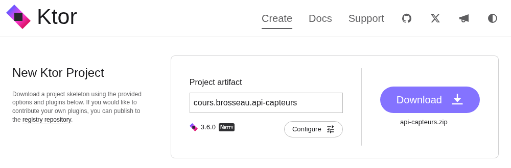
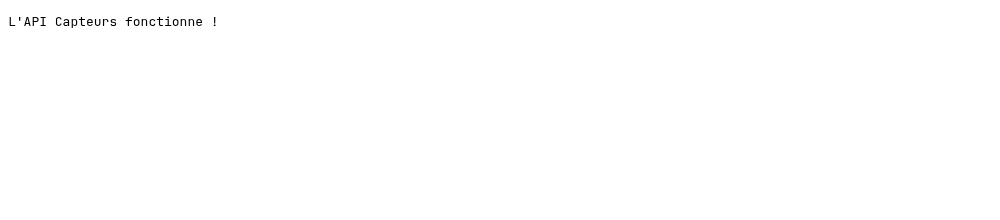
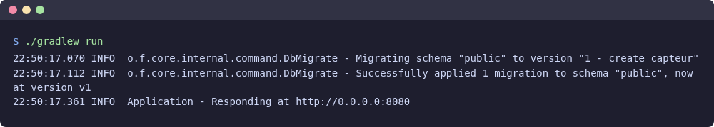
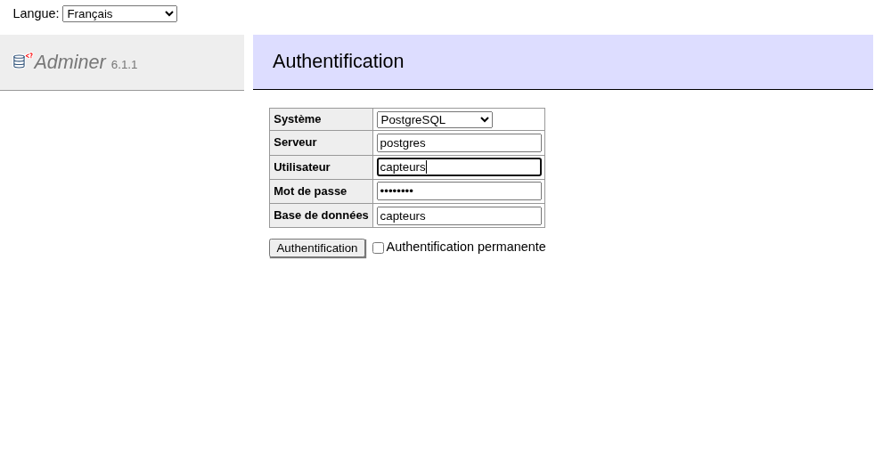
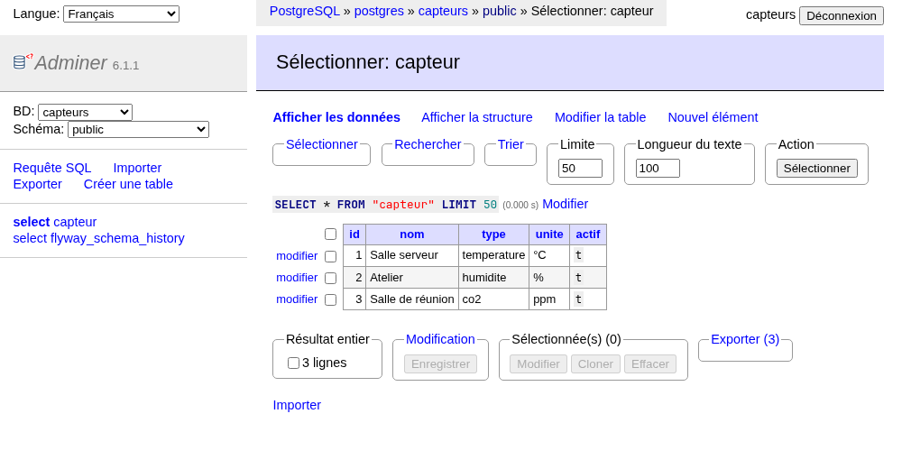
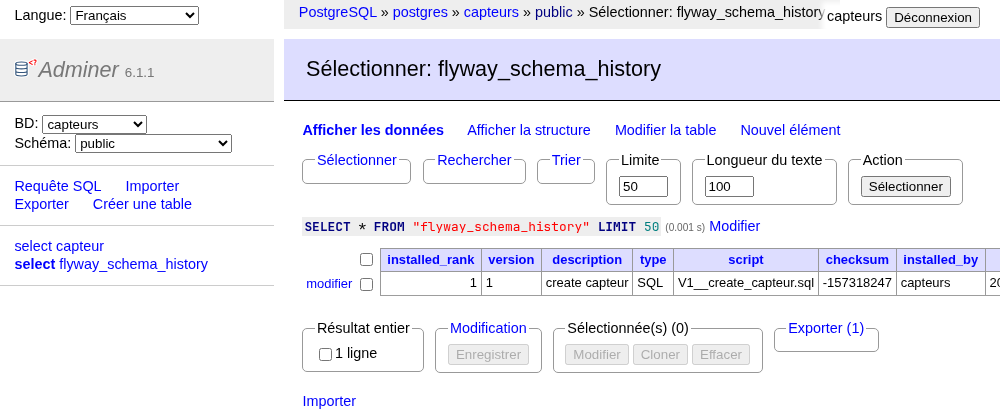
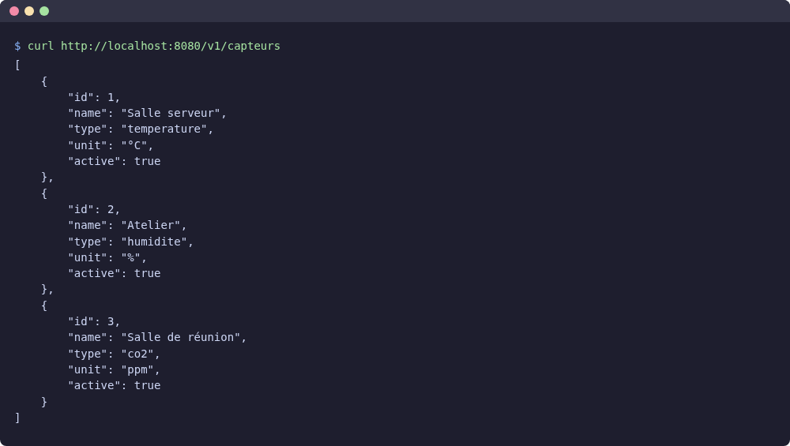
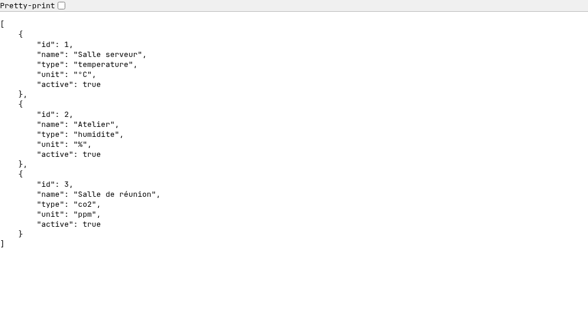

# Créer des API avec Kotlin : le projet

::: details Sommaire
[[toc]]
:::

## Introduction

Vous connaissez Kotlin côté Android ? Bonne nouvelle : le même langage permet aussi d'écrire la partie **serveur** d'une application. Dans cette série de deux TP, nous allons créer une API REST complète avec [Ktor](https://ktor.io/), le framework serveur de JetBrains (les créateurs de Kotlin).

Notre fil rouge : une API qui gère les **capteurs** d'un bâtiment (température, humidité, CO2…). Une application mobile, un tableau de bord ou un autre serveur pourront ensuite interroger cette API pour lister les capteurs, en ajouter, les modifier, etc.

Ce premier TP pose toutes les fondations :

- la création du projet ;
- une base de données PostgreSQL qui tourne dans Docker ;
- une organisation du code en couches, celle que vous retrouverez dans la plupart des projets professionnels ;
- une première route qui lit les capteurs en base et les renvoie en JSON.

Dans le [second TP](./crud-droits.md), nous compléterons l'API (création, modification, suppression), puis nous la protégerons avec un système de droits.

::: tip Un instant
Une API ne s'affiche pas joliment dans un navigateur : elle renvoie des données (ici en JSON) destinées à d'autres programmes. Pour la tester, nous utiliserons `curl` en ligne de commande. Vous pouvez aussi utiliser [Postman](https://www.postman.com/) ou tout autre client d'API.
:::

## Les slides

Avant de commencer, voici une présentation rapide de la partie théorie de notre TP du jour : Ktor, l'architecture en couches, les migrations, l'ORM et l'injection de dépendances.

<ClientOnly>
<SlidesDeck src="ktor_decouverte" />
</ClientOnly>

## Prérequis

- Connaître les bases de Kotlin. Vous venez d'un autre langage ? L'[aide-mémoire Kotlin](/cheatsheets/kotlin/) vous donnera l'essentiel.
- Savoir ce qu'est une API REST et les verbes HTTP (`GET`, `POST`, `PUT`, `DELETE`). Au besoin, revoyez les [slides d'introduction aux API](/cours/introduction_api) et l'[aide-mémoire API](/cheatsheets/api/).
- Un poste avec :
  - le **JDK 21** ;
  - un IDE pour Kotlin : je vous conseille [IntelliJ IDEA](https://www.jetbrains.com/idea/download/) (la version gratuite suffit) ;
  - **Docker** et Docker Compose (voir l'[aide-mémoire Docker](/cheatsheets/docker/)) ;
  - **Git** (voir l'[aide-mémoire Git](/cheatsheets/git/)).

Pour installer et vérifier tout cela pas à pas, suivez la page [Préparer son poste](/cheatsheets/poste-android/) : chaque installation se termine par un point de contrôle (vous pouvez ignorer la partie sur le téléphone, inutile ici).

::: details Vous utilisez la dev-box ?
La [dev-box](/cheatsheets/dev-box/) convient parfaitement à ce TP. Il vous faut :

- Java : `devbox dev-env java` ;
- Podman activé, pour pouvoir lancer `docker compose` à l'intérieur de la dev-box (voir [les bases de données](/cheatsheets/dev-box/#les-bases-de-donnees)) ;
- les ports `8080` (l'API) et `8081` (Adminer) ajoutés dans votre `compose.override.yaml`, comme expliqué dans [Voir votre site depuis le navigateur](/cheatsheets/dev-box/#voir-votre-site-depuis-le-navigateur).

Inutile en revanche de lancer `devbox dbs postgres` : la base de ce TP est fournie par le `docker-compose.yml` du projet.
:::

## Objectifs

À la fin de ce TP vous saurez :

- créer un projet Ktor et comprendre sa configuration Gradle ;
- lancer une base PostgreSQL avec Docker Compose ;
- faire évoluer une base de données avec des migrations (Flyway) ;
- décrire une table et l'interroger en Kotlin avec un ORM (Exposed) ;
- organiser votre code en couches : route, service, DAO ;
- brancher le tout avec l'injection de dépendances (Koin) ;
- renvoyer du JSON depuis une route.

## Le projet

### Ce que nous allons construire

À la fin des deux TP, notre API proposera les routes suivantes :

| Méthode  | Chemin              | Description                |
| -------- | ------------------- | -------------------------- |
| `GET`    | `/v1/capteurs`      | Lister les capteurs        |
| `GET`    | `/v1/capteurs/{id}` | Obtenir un capteur         |
| `POST`   | `/v1/capteurs`      | Créer un capteur           |
| `PUT`    | `/v1/capteurs/{id}` | Modifier un capteur        |
| `DELETE` | `/v1/capteurs/{id}` | Supprimer un capteur       |

Dans ce premier TP, nous nous concentrons sur la première ligne : lister les capteurs. Ça paraît peu ? C'est voulu : pour cette seule route, nous allons mettre en place toute la structure du projet. Les routes suivantes iront ensuite beaucoup plus vite.

::: tip Pourquoi /v1 ?
Le préfixe `/v1` indique la **version** de l'API. Le jour où vous devrez changer le format des réponses, vous créerez une `/v2` sans casser les applications qui utilisent encore la `/v1`.
:::

### L'architecture en couches

Plutôt que de tout écrire dans un seul fichier, nous allons découper le code en **couches**, chacune avec un rôle précis :

```
Client (curl, application mobile…)
   │  GET /v1/capteurs
   ▼
┌─────────────────────────────────────────────────────────────┐
│ Route    Reçoit la requête HTTP, appelle le service,        │
│          renvoie la réponse (JSON + code HTTP)              │
├─────────────────────────────────────────────────────────────┤
│ Service  Les règles métier (« un capteur doit avoir un nom »)│
├─────────────────────────────────────────────────────────────┤
│ DAO      Les requêtes vers la base de données               │
├─────────────────────────────────────────────────────────────┤
│ Table    La description de la table en Kotlin (ORM)         │
└─────────────────────────────────────────────────────────────┘
   ▼
PostgreSQL (table capteur)
```

La règle d'or : **chaque couche ne parle qu'à celle du dessous**. La route ne fait jamais de SQL, le DAO ne sait pas ce qu'est une requête HTTP.

Question :

- À votre avis, quel est l'intérêt de ce découpage ? Le code ne serait-il pas plus simple dans un seul fichier ?

::: details Réponse
Pour une seule route, un seul fichier serait effectivement plus court. Mais dès que l'API grossit :

- **on s'y retrouve** : un bug dans une requête SQL ? C'est dans le DAO. Une règle métier à changer ? C'est dans le service ;
- **on peut changer une couche sans toucher aux autres** : passer de PostgreSQL à MariaDB ne concerne que le DAO ;
- **on peut tester chaque couche séparément**, par exemple tester le service avec un faux DAO, sans base de données.

C'est le même principe que le découpage MVVM que vous avez peut-être vu sur Android.
:::

### Les outils

Voici les briques que nous allons assembler. Pas de panique, nous les verrons une par une :

| Outil | Rôle |
|---|---|
| [Ktor](https://ktor.io/) | Le framework web : reçoit les requêtes HTTP et renvoie les réponses |
| [kotlinx.serialization](https://kotlinlang.org/docs/serialization.html) | Transforme nos objets Kotlin en JSON (et inversement) |
| [PostgreSQL](https://www.postgresql.org/) | La base de données, lancée dans Docker |
| [Flyway](https://www.red-gate.com/products/flyway/community/) | Applique les scripts SQL de création et d'évolution de la base |
| [HikariCP](https://github.com/brettwooldridge/HikariCP) | Le pool de connexions : garde quelques connexions ouvertes vers la base et les réutilise |
| [Exposed](https://www.jetbrains.com/exposed/) | L'ORM : décrire les tables et écrire les requêtes en Kotlin |
| [Koin](https://insert-koin.io/) | L'injection de dépendances : crée nos objets et les fournit là où on en a besoin |

## Créer le projet

### Le générateur

JetBrains propose un générateur de projet en ligne : [start.ktor.io](https://start.ktor.io/). Ouvrez-le et renseignez le champ **Project artifact** avec `cours.brosseau.api-capteurs`. Laissez les autres options (bouton **Configure**) par défaut : Gradle et Netty.



N'ajoutez aucun plugin : nous ajouterons nous-mêmes ce dont nous avons besoin, c'est le meilleur moyen de comprendre à quoi sert chaque brique. Cliquez sur **Download**, décompressez l'archive `api-capteurs.zip`, puis ouvrez le dossier dans IntelliJ IDEA.

::: tip Et la version de Ktor ?
Le générateur propose toujours la dernière version de Ktor. Ce n'est pas un problème : dans la configuration que nous allons écrire, nous fixons nous-mêmes les versions de toutes les bibliothèques. Vous êtes ainsi certains d'avoir exactement les mêmes que celles utilisées pour écrire ce TP.
:::

::: tip Que se passe-t-il derrière ?
Le générateur fournit surtout le **squelette** du projet : le *wrapper* Gradle (`gradlew`, `gradlew.bat`, le dossier `gradle/wrapper`), qui télécharge automatiquement la bonne version de Gradle, et l'arborescence des dossiers. La configuration, elle, nous allons l'écrire nous-mêmes juste après.
:::

### Faire un peu de ménage

Le générateur a créé un peu de code d'exemple. Supprimez :

- les fichiers `main.kt` et `Routing.kt` du dossier `src/main/kotlin` ;
- les fichiers `application.yaml` et `logback.xml` du dossier `src/main/resources` ;
- le dossier `src/test` (nous ne ferons pas de tests automatisés dans cette série de TP).

Gardez le reste : `gradlew`, `gradlew.bat`, le dossier `gradle/`, `build.gradle.kts`, `settings.gradle.kts`, `gradle.properties` et `README.md` (que vous pourrez compléter plus tard). Nous allons modifier certains de ces fichiers juste après.

Le générateur ne fournit pas de fichier `.gitignore`. Créez-le à la racine du projet : il indique à Git les fichiers à ne pas versionner.

```
.gradle/
build/
.idea/
.kotlin/
*.iml
```

`build/` et `.gradle/` sont des dossiers générés par Gradle, `.idea/` et `*.iml` des réglages propres à votre IntelliJ : ils n'ont rien à faire dans Git.

## La configuration Gradle

Gradle est l'outil qui compile le projet et télécharge les bibliothèques. Il s'appuie sur trois fichiers.

### Les versions des bibliothèques

Le fichier `gradle/libs.versions.toml` est un **catalogue de versions** : il regroupe en un seul endroit toutes les bibliothèques utilisées et leurs versions. Remplacez son contenu (ou créez-le) :

```toml
[versions]
kotlin = "2.3.10"
ktor = "3.4.1"
exposed = "1.1.1"
koin = "4.2.0"
flyway = "12.1.1"
hikaricp = "7.0.2"
postgresql = "42.7.9"
logback = "1.5.32"

[libraries]
ktor-server-core = { module = "io.ktor:ktor-server-core", version.ref = "ktor" }
ktor-server-netty = { module = "io.ktor:ktor-server-netty", version.ref = "ktor" }
ktor-server-content-negotiation = { module = "io.ktor:ktor-server-content-negotiation", version.ref = "ktor" }
ktor-serialization-kotlinx-json = { module = "io.ktor:ktor-serialization-kotlinx-json", version.ref = "ktor" }
ktor-server-status-pages = { module = "io.ktor:ktor-server-status-pages", version.ref = "ktor" }
ktor-server-auth = { module = "io.ktor:ktor-server-auth", version.ref = "ktor" }
koin-ktor = { module = "io.insert-koin:koin-ktor", version.ref = "koin" }
koin-logger-slf4j = { module = "io.insert-koin:koin-logger-slf4j", version.ref = "koin" }
exposed-core = { module = "org.jetbrains.exposed:exposed-core", version.ref = "exposed" }
exposed-jdbc = { module = "org.jetbrains.exposed:exposed-jdbc", version.ref = "exposed" }
postgresql = { module = "org.postgresql:postgresql", version.ref = "postgresql" }
hikaricp = { module = "com.zaxxer:HikariCP", version.ref = "hikaricp" }
flyway-core = { module = "org.flywaydb:flyway-core", version.ref = "flyway" }
flyway-postgresql = { module = "org.flywaydb:flyway-database-postgresql", version.ref = "flyway" }
logback-classic = { module = "ch.qos.logback:logback-classic", version.ref = "logback" }

[plugins]
kotlin-jvm = { id = "org.jetbrains.kotlin.jvm", version.ref = "kotlin" }
kotlin-serialization = { id = "org.jetbrains.kotlin.plugin.serialization", version.ref = "kotlin" }
ktor = { id = "io.ktor.plugin", version.ref = "ktor" }
```

::: tip Pourquoi un catalogue ?
Sans catalogue, les versions seraient éparpillées dans les fichiers de build. Ici, pour mettre à jour Ktor, il suffit de changer **une** ligne. C'est aussi ce qu'utilisent les projets Android récents : vous retrouverez ce fichier partout.
:::

### Les réglages du projet

Remplacez le contenu de `settings.gradle.kts` :

```kotlin
plugins {
    id("org.gradle.toolchains.foojay-resolver-convention") version "1.0.0"
}

rootProject.name = "api-capteurs"
```

- `rootProject.name` : le nom du projet ;
- le plugin `foojay-resolver-convention` permet à Gradle de **télécharger automatiquement** le JDK demandé par le projet (Java 21, voir plus bas) s'il ne le trouve pas sur votre machine.

### Le build

Remplacez le contenu de `build.gradle.kts` :

```kotlin
plugins {
    alias(libs.plugins.kotlin.jvm)
    alias(libs.plugins.kotlin.serialization)
    alias(libs.plugins.ktor)
}

group = "cours.brosseau"
version = "1.0.0"

repositories {
    mavenCentral()
}

application {
    mainClass.set("cours.brosseau.ApplicationKt")
}

kotlin {
    jvmToolchain(21)
}

dependencies {
    // Le serveur web
    implementation(libs.ktor.server.core)
    implementation(libs.ktor.server.netty)
    implementation(libs.ktor.server.content.negotiation)
    implementation(libs.ktor.serialization.kotlinx.json)
    implementation(libs.ktor.server.status.pages)
    implementation(libs.ktor.server.auth)

    // L'injection de dépendances
    implementation(libs.koin.ktor)
    implementation(libs.koin.logger.slf4j)

    // La base de données
    implementation(libs.exposed.core)
    implementation(libs.exposed.jdbc)
    implementation(libs.postgresql)
    implementation(libs.hikaricp)
    implementation(libs.flyway.core)
    implementation(libs.flyway.postgresql)

    // Les logs
    implementation(libs.logback.classic)
}
```

Quelques explications :

- `plugins` : le compilateur Kotlin, le plugin de sérialisation (qui génère le code de conversion en JSON) et le plugin Ktor (qui ajoute notamment la tâche `run`) ;
- `repositories` : où télécharger les bibliothèques (Maven Central, le dépôt public de référence) ;
- `application` : la classe qui contient la fonction `main`, notre point d'entrée ;
- `jvmToolchain(21)` : le projet est compilé pour Java 21 ;
- `dependencies` : les bibliothèques, désignées par leur nom dans le catalogue (`libs.ktor.server.core` correspond à la ligne `ktor-server-core`).

Une fois les fichiers modifiés, IntelliJ vous propose de recharger le projet Gradle (une petite icône d'éléphant en haut à droite) : acceptez. Le premier chargement télécharge toutes les bibliothèques et peut prendre quelques minutes.

::: tip Un instant
Nous déclarons dès maintenant toutes les dépendances des deux TP (y compris `status-pages` et `auth`, qui ne serviront que dans le second). Comme ça, nous n'aurons plus à toucher à Gradle.
:::

## La base de données avec Docker

Plutôt que d'installer PostgreSQL sur votre machine, nous allons le lancer dans un conteneur. Créez un fichier `docker-compose.yml` **à la racine du projet** :

```yaml
services:
  postgres:
    image: postgres:18
    environment:
      POSTGRES_DB: capteurs
      POSTGRES_USER: capteurs
      POSTGRES_PASSWORD: capteurs
    ports:
      - "5432:5432"
    volumes:
      - pgdata:/var/lib/postgresql
    healthcheck:
      test: ["CMD-SHELL", "pg_isready -U capteurs -d capteurs"]
      interval: 2s
      timeout: 5s
      retries: 15

  adminer:
    image: adminer
    ports:
      - "8081:8080"
    depends_on:
      - postgres

volumes:
  pgdata:
```

Deux services :

- `postgres` : la base de données. La base `capteurs`, l'utilisateur et le mot de passe sont créés automatiquement au premier lancement. Les données sont conservées dans un volume (`pgdata`) : elles survivent à l'arrêt du conteneur ;
- `adminer` : une petite interface web pour voir le contenu de la base, disponible sur le port `8081`.

Lancez la stack :

```sh
docker compose up -d --wait
```

::: tip Que se passe-t-il derrière ?
`-d` lance les conteneurs en arrière-plan. `--wait` attend que les services soient prêts : c'est le rôle du `healthcheck`, qui interroge PostgreSQL toutes les 2 secondes avec `pg_isready`. Sans lui, la commande rendrait la main alors que PostgreSQL est encore en train de démarrer, et notre serveur échouerait à s'y connecter.
:::

::: tip Point de contrôle
La commande `docker compose ps` affiche les deux services démarrés, avec la mention `healthy` pour PostgreSQL. Ouvrez [http://localhost:8081](http://localhost:8081) : la page de connexion d'Adminer s'affiche.
:::

::: warning Le port 5432 est déjà utilisé ?
Si un PostgreSQL tourne déjà sur votre machine, Docker ne pourra pas utiliser le port `5432`. Arrêtez l'autre PostgreSQL, ou changez la ligne en `"5433:5432"` (et pensez à utiliser le port `5433` dans la configuration de l'application, plus bas).
:::

Pour arrêter la stack plus tard : `docker compose down` (vos données sont conservées dans le volume). Pour repartir d'une base vide : `docker compose down -v` (le `-v` supprime aussi le volume).

## Le point d'entrée

### La configuration de l'application

Ktor lit sa configuration dans `src/main/resources/application.conf` (au format HOCON). Créez ce fichier :

```hocon
ktor {
    deployment {
        port = 8080
        port = ${?PORT}
    }
    application {
        modules = [ cours.brosseau.ApplicationKt.module ]
    }
}

database {
    url = "jdbc:postgresql://localhost:5432/capteurs"
    url = ${?DATABASE_URL}
    user = "capteurs"
    user = ${?DATABASE_USER}
    password = "capteurs"
    password = ${?DATABASE_PASSWORD}
}
```

::: tip Que veut dire ${?PORT} ?
Chaque valeur est déclarée deux fois : d'abord une valeur par défaut, puis `${?NOM}`, qui la **remplace** si la variable d'environnement `NOM` existe. En développement, les valeurs par défaut suffisent. En production, on fournit les vraies valeurs (mot de passe compris) par des variables d'environnement, sans jamais les écrire dans le code.
:::

Ajoutez aussi `src/main/resources/logback.xml`, qui règle l'affichage des logs dans la console :

```xml
<configuration>
    <appender name="STDOUT" class="ch.qos.logback.core.ConsoleAppender">
        <encoder>
            <pattern>%d{HH:mm:ss.SSS} %-5level %logger{36} - %msg%n</pattern>
        </encoder>
    </appender>
    <root level="INFO">
        <appender-ref ref="STDOUT"/>
    </root>
    <logger name="com.zaxxer.hikari" level="WARN"/>
</configuration>
```

### L'application

Le code source va dans `src/main/kotlin/cours/brosseau`. Créez ce dossier (le *package* `cours.brosseau`) puis le fichier `Application.kt` :

```kotlin
package cours.brosseau

import cours.brosseau.plugins.configureRouting
import io.ktor.server.application.Application
import io.ktor.server.netty.EngineMain

fun main(args: Array<String>) {
    EngineMain.main(args)
}

fun Application.module() {
    configureRouting()
}
```

- `main` démarre le serveur Netty, qui lit `application.conf` ;
- la configuration indique que le module de l'application est `cours.brosseau.ApplicationKt.module` : c'est la fonction `module()` juste en dessous ;
- `module()` configure l'application. Pour l'instant, elle ne fait qu'une chose : déclarer les routes.

IntelliJ souligne `configureRouting` en rouge ? C'est normal : nous créons cette fonction juste après.

::: tip ApplicationKt ?
En Kotlin, une fonction peut exister en dehors de toute classe. Le compilateur la range alors dans une classe générée qui porte le nom du fichier suivi de `Kt` : les fonctions du fichier `Application.kt` se retrouvent dans `ApplicationKt`.
:::

### Une première route

Créez le package `cours.brosseau.plugins` puis le fichier `Routing.kt` :

```kotlin
package cours.brosseau.plugins

import io.ktor.server.application.Application
import io.ktor.server.response.respondText
import io.ktor.server.routing.get
import io.ktor.server.routing.routing

fun Application.configureRouting() {
    routing {
        get("/") {
            call.respondText("L'API Capteurs fonctionne !")
        }
    }
}
```

La syntaxe se lit presque comme une phrase : « dans le routage, pour un `GET` sur `/`, répondre ce texte ». `call` représente l'échange en cours : la requête reçue et la réponse à envoyer.

::: tip Une fonction d'extension
`fun Application.configureRouting()` est une **fonction d'extension** : elle ajoute une méthode `configureRouting()` à la classe `Application` de Ktor. C'est ce qui permet d'écrire simplement `configureRouting()` dans `module()`. Nous allons utiliser ce principe pour chaque brique : un fichier, une fonction `configureXxx()`.
:::

### Lancer le serveur

Dans un terminal, à la racine du projet :

```sh
./gradlew run
```

Sous Windows, dans PowerShell : `.\gradlew.bat run`. Vous pouvez aussi lancer la fonction `main` directement depuis IntelliJ, avec la flèche verte dans la marge.

::: tip Point de contrôle
Les logs se terminent par `Responding at http://0.0.0.0:8080`. Ouvrez [http://localhost:8080](http://localhost:8080) : le message « L'API Capteurs fonctionne ! » s'affiche.


:::

Le projet démarre : c'est le bon moment pour initialiser le dépôt (`git init`) et faire un premier commit. Avant de commiter, vérifiez avec `git status` que ni le dossier `build/` ni le dossier `.gradle/` n'apparaissent. Si c'est le cas, revoyez votre fichier `.gitignore`.

Arrêtez le serveur (`Ctrl + C`) : nous allons maintenant le relier à la base de données.

## La base de données : les migrations

### Le principe

Comment créer les tables ? Vous pourriez les créer à la main dans Adminer… mais comment vos collègues, ou le serveur de production, obtiendraient-ils la même structure ?

La solution : les **migrations**. Ce sont des scripts SQL numérotés, rangés dans le projet, qui décrivent chaque évolution de la base. Au démarrage du serveur, **Flyway** regarde quels scripts ont déjà été appliqués (il le note dans une table `flyway_schema_history`) et exécute les nouveaux, dans l'ordre.

```
src/main/resources/db/migration/
├── V1__create_capteur.sql      ← appliqué au premier démarrage
├── V2__create_mesure.sql       ← appliqué au démarrage suivant (TP 2)
└── V3__...
```

Le nom des fichiers suit une convention stricte : `V` + numéro + deux tirets bas `__` + description.

::: danger La règle d'or des migrations
Une migration déjà appliquée ne se modifie **jamais**. Flyway vérifie une somme de contrôle de chaque fichier : si un script déjà passé a changé, le serveur refuse de démarrer. Pour corriger ou faire évoluer la base, on écrit **une nouvelle migration**.
:::

### La première migration

Créez le dossier `src/main/resources/db/migration` puis le fichier `V1__create_capteur.sql` :

```sql
CREATE TABLE capteur (
    id     SERIAL PRIMARY KEY,
    nom    VARCHAR(100) NOT NULL,
    type   VARCHAR(30)  NOT NULL,
    unite  VARCHAR(10)  NOT NULL,
    actif  BOOLEAN      NOT NULL DEFAULT TRUE
);

INSERT INTO capteur (nom, type, unite) VALUES
    ('Salle serveur', 'temperature', '°C'),
    ('Atelier', 'humidite', '%'),
    ('Salle de réunion', 'co2', 'ppm');
```

La migration crée la table et y insère trois capteurs, pour que nous ayons des données à afficher.

### Se connecter à la base au démarrage

Créez le package `cours.brosseau.database` puis le fichier `Database.kt` :

```kotlin
package cours.brosseau.database

import com.zaxxer.hikari.HikariConfig
import com.zaxxer.hikari.HikariDataSource
import io.ktor.server.application.Application
import io.ktor.server.application.ApplicationStopped
import org.flywaydb.core.Flyway
import org.jetbrains.exposed.v1.jdbc.Database

fun Application.configureDatabase() {
    val config = environment.config

    // 1. Le pool de connexions
    val dataSource = HikariDataSource(HikariConfig().apply {
        jdbcUrl = config.property("database.url").getString()
        username = config.property("database.user").getString()
        password = config.property("database.password").getString()
        maximumPoolSize = 5
    })

    // 2. Les migrations
    Flyway.configure()
        .dataSource(dataSource)
        .load()
        .migrate()

    // 3. Exposed utilisera ce pool pour toutes ses requêtes
    Database.connect(dataSource)

    // 4. On ferme proprement le pool quand le serveur s'arrête
    monitor.subscribe(ApplicationStopped) {
        dataSource.close()
    }
}
```

Quatre opérations, dans cet ordre :

1. **Le pool de connexions** (HikariCP). Ouvrir une connexion à une base de données est lent. Le pool en ouvre quelques-unes (5 au maximum ici) et les **réutilise** d'une requête à l'autre. Les paramètres viennent de `application.conf`.
2. **Les migrations.** Flyway cherche par défaut ses scripts dans `db/migration` et applique ceux qui manquent.
3. **La connexion d'Exposed.** L'ORM utilisera le pool pour toutes les requêtes.
4. **La fermeture du pool** à l'arrêt du serveur, pour ne pas laisser de connexions ouvertes.

Ajoutez l'appel dans `Application.kt`, avec son import :

```kotlin
package cours.brosseau

import cours.brosseau.database.configureDatabase
import cours.brosseau.plugins.configureRouting
import io.ktor.server.application.Application
import io.ktor.server.netty.EngineMain

fun main(args: Array<String>) {
    EngineMain.main(args)
}

fun Application.module() {
    configureDatabase()
    configureRouting()
}
```

Relancez le serveur avec `./gradlew run`.

::: tip Point de contrôle
Dans les logs, vous devez voir la migration s'appliquer, puis le serveur démarrer :



Dans [Adminer](http://localhost:8081), connectez-vous avec : système **PostgreSQL**, serveur **postgres**, utilisateur **capteurs**, mot de passe **capteurs**, base **capteurs**.



La table `capteur` contient trois lignes :



Et la table `flyway_schema_history` contient une ligne pour notre migration :


:::

Question :

- Relancez le serveur une seconde fois. Que se passe-t-il pour la migration ? Les trois capteurs sont-ils insérés en double ?

::: details Réponse
Non. Au second démarrage, Flyway voit dans `flyway_schema_history` que la version 1 est déjà appliquée : il n'exécute rien (le log indique `Schema "public" is up to date. No migration necessary.`). C'est tout l'intérêt de cette table d'historique.
:::

::: tip Serveur : serveur postgres ?
Dans Adminer, le serveur s'appelle `postgres` et non `localhost` : Adminer tourne lui-même dans un conteneur, et dans le réseau créé par Docker Compose, chaque service est joignable par son nom. Notre application, elle, tourne sur votre machine : elle passe par `localhost:5432`, le port publié par Docker.
:::

## La liste des capteurs, couche par couche

La base est prête. Nous allons maintenant écrire nos couches, de bas en haut : le modèle, la table, le DAO, le service, puis la route. Chaque couche tient dans un fichier du package `sensor`.

### L'objet renvoyé par l'API

Commençons par ce que l'API renverra : un capteur. Créez le package `cours.brosseau.sensor` (toutes les classes liées aux capteurs y seront rangées) puis le fichier `Sensor.kt` :

```kotlin
package cours.brosseau.sensor

import kotlinx.serialization.Serializable

// Ce que l'API renvoie
@Serializable
data class Sensor(
    val id: Int,
    val name: String,
    val type: String,
    val unit: String,
    val active: Boolean
)
```

- Une `data class` est l'équivalent d'une structure : elle regroupe des données.
- `@Serializable` demande au plugin de sérialisation de générer le code qui convertit cet objet en JSON (et inversement). Sans cette annotation, Ktor ne saurait pas l'envoyer.

::: tip Pourquoi des noms en anglais ?
Comme dans les autres TP, le **code** (classes, variables, fonctions) est écrit en anglais, et la **base de données** (tables, colonnes) en français. La couche suivante va justement faire le lien entre les deux.
:::

### La table, côté Kotlin

Pour interroger la table `capteur`, Exposed a besoin de connaître sa structure. Créez `SensorTable.kt` dans le même package :

```kotlin
package cours.brosseau.sensor

import org.jetbrains.exposed.v1.core.Table

object SensorTable : Table("capteur") {
    val id = integer("id").autoIncrement()
    val name = varchar("nom", 100)
    val type = varchar("type", 30)
    val unit = varchar("unite", 10)
    val active = bool("actif")

    override val primaryKey = PrimaryKey(id)
}
```

- `Table("capteur")` : le nom de la table **en base** ;
- chaque propriété décrit une colonne : son type (`integer`, `varchar`, `bool`…) et son nom **en base**. C'est ici que se fait le lien `name` (Kotlin) ↔ `nom` (SQL) ;
- `object` crée une instance unique : il n'y a qu'une table `capteur`, il n'y a donc qu'un `SensorTable`.

::: warning Exposed ne crée pas la table
Cette description doit correspondre **exactement** à la migration SQL : c'est Flyway qui crée la table, Exposed se contente de la décrire pour pouvoir l'interroger. Si vous ajoutez une colonne, il faudra modifier les deux : une nouvelle migration, et `SensorTable`.
:::

Question :

- Quel est le rôle d'un ORM ? Quel avantage par rapport à des requêtes SQL écrites dans des chaînes de caractères ?

::: details Réponse
Un ORM (*Object-Relational Mapping*) fait le lien entre les tables de la base et les objets du langage. Avec Exposed, les requêtes s'écrivent en Kotlin : le compilateur vérifie les noms de colonnes et les types. Une faute de frappe dans un nom de colonne devient une erreur de compilation, au lieu d'une erreur au moment de l'exécution. Et comme les valeurs sont transmises en paramètres, les injections SQL sont évitées.
:::

### Le DAO : les requêtes

Le DAO (*Data Access Object*) contient les requêtes vers la base. Créez `SensorDao.kt` :

```kotlin
package cours.brosseau.sensor

import org.jetbrains.exposed.v1.core.ResultRow
import org.jetbrains.exposed.v1.jdbc.selectAll
import org.jetbrains.exposed.v1.jdbc.transactions.transaction

interface SensorDao {
    fun findAll(): List<Sensor>
}

class ExposedSensorDao : SensorDao {

    override fun findAll(): List<Sensor> = transaction {
        SensorTable.selectAll()
            .orderBy(SensorTable.id)
            .map { it.toSensor() }
    }

    // Transforme une ligne de la base en objet Sensor
    private fun ResultRow.toSensor() = Sensor(
        id = this[SensorTable.id],
        name = this[SensorTable.name],
        type = this[SensorTable.type],
        unit = this[SensorTable.unit],
        active = this[SensorTable.active]
    )
}
```

Prenons le temps de lire ce code :

- **L'interface `SensorDao`** décrit *ce que* sait faire le DAO. **La classe `ExposedSensorDao`** décrit *comment* elle le fait, avec Exposed.
- **`transaction { }`** : toute requête Exposed doit se trouver dans une transaction. Le bloc emprunte une connexion au pool, exécute les requêtes, valide (*commit*) puis rend la connexion. En cas d'erreur, il annule tout (*rollback*).
- **`SensorTable.selectAll().orderBy(SensorTable.id)`** est l'équivalent de `SELECT * FROM capteur ORDER BY id`.
- **`.map { it.toSensor() }`** transforme chaque ligne du résultat (`ResultRow`) en objet `Sensor`.
- **`this[SensorTable.name]`** lit la valeur d'une colonne dans une ligne.

Question :

- Pourquoi passer par une interface ? `ExposedSensorDao` seul ne suffirait-il pas ?

::: details Réponse
Le service (la couche du dessus) va dépendre de l'**interface** `SensorDao`, pas de l'implémentation. Il ne sait donc pas que les données viennent d'Exposed et de PostgreSQL. Avantages :

- pour tester le service, on peut lui donner un faux DAO qui renvoie des données en dur, sans base de données ;
- pour changer de technique d'accès aux données, on écrit une nouvelle implémentation sans toucher au service.
:::

### Le service : les règles métier

Créez `SensorService.kt` :

```kotlin
package cours.brosseau.sensor

class SensorService(private val sensorDao: SensorDao) {

    fun getAll(): List<Sensor> = sensorDao.findAll()
}
```

Pour l'instant, le service se contente de transmettre l'appel au DAO. Il paraît inutile ? Il se remplira dans le prochain TP : c'est lui qui vérifiera qu'un capteur existe, que son nom n'est pas vide, etc.

Remarquez que le service **reçoit** son DAO dans son constructeur : il ne le crée pas lui-même. Mais alors, qui crée le DAO et le donne au service ?

### L'injection de dépendances avec Koin

C'est le rôle de **Koin**. On lui décrit comment construire nos objets, et il les crée puis les fournit là où on en a besoin. Créez `SensorModule.kt` :

```kotlin
package cours.brosseau.sensor

import org.koin.core.module.dsl.singleOf
import org.koin.dsl.bind
import org.koin.dsl.module

val sensorModule = module {
    singleOf(::ExposedSensorDao) bind SensorDao::class
    singleOf(::SensorService)
}
```

- `singleOf(::ExposedSensorDao) bind SensorDao::class` : « crée **une seule** instance de `ExposedSensorDao`, et fournis-la à quiconque demande un `SensorDao` » ;
- `singleOf(::SensorService)` : « crée une seule instance de `SensorService` ». Koin voit que son constructeur demande un `SensorDao` : il lui donne automatiquement celui déclaré juste au-dessus.

Il reste à démarrer Koin. Créez `plugins/Koin.kt` :

```kotlin
package cours.brosseau.plugins

import cours.brosseau.sensor.sensorModule
import io.ktor.server.application.Application
import io.ktor.server.application.install
import org.koin.ktor.plugin.Koin
import org.koin.logger.slf4jLogger

fun Application.configureKoin() {
    install(Koin) {
        slf4jLogger()
        modules(sensorModule)
    }
}
```

`install(...)` est la façon d'ajouter un **plugin** à Ktor. Ici, le plugin Koin, avec la liste de nos modules.

::: tip Que se passe-t-il derrière ?
Sans injection de dépendances, il faudrait écrire quelque part `val service = SensorService(ExposedSensorDao())`, et faire passer ce `service` à toutes les routes qui en ont besoin. Avec Koin, chaque classe déclare simplement ce dont elle a besoin (dans son constructeur), et Koin s'occupe de « câbler » l'ensemble. Quand le projet compte des dizaines de classes, la différence est énorme.
:::

### Le JSON

Pour que Ktor sache transformer nos objets en JSON, il faut installer le plugin **ContentNegotiation**. Créez `plugins/Serialization.kt` :

```kotlin
package cours.brosseau.plugins

import io.ktor.serialization.kotlinx.json.json
import io.ktor.server.application.Application
import io.ktor.server.application.install
import io.ktor.server.plugins.contentnegotiation.ContentNegotiation
import kotlinx.serialization.json.Json

fun Application.configureSerialization() {
    install(ContentNegotiation) {
        json(Json {
            prettyPrint = true
        })
    }
}
```

`prettyPrint = true` indente le JSON produit. C'est plus lisible pendant le développement (en production, on le retire souvent pour alléger les réponses).

### La route

Dernière couche : la route. Créez `SensorRoutes.kt` dans le package `sensor` :

```kotlin
package cours.brosseau.sensor

import io.ktor.server.response.respond
import io.ktor.server.routing.Route
import io.ktor.server.routing.get
import io.ktor.server.routing.route
import org.koin.ktor.ext.inject

fun Route.sensorRoutes() {
    val sensorService by inject<SensorService>()

    route("/capteurs") {
        get {
            call.respond(sensorService.getAll())
        }
    }
}
```

- `by inject<SensorService>()` demande le service à Koin ;
- `route("/capteurs") { ... }` regroupe toutes les routes qui commencent par `/capteurs` ;
- `call.respond(...)` envoie la liste : grâce à ContentNegotiation, elle est automatiquement convertie en JSON.

Branchez ces routes dans `plugins/Routing.kt`, sous le préfixe `/v1` :

```kotlin
package cours.brosseau.plugins

import cours.brosseau.sensor.sensorRoutes
import io.ktor.server.application.Application
import io.ktor.server.response.respondText
import io.ktor.server.routing.get
import io.ktor.server.routing.route
import io.ktor.server.routing.routing

fun Application.configureRouting() {
    routing {
        get("/") {
            call.respondText("L'API Capteurs fonctionne !")
        }
        route("/v1") {
            sensorRoutes()
        }
    }
}
```

Et enfin, complétez `Application.kt` :

```kotlin
package cours.brosseau

import cours.brosseau.database.configureDatabase
import cours.brosseau.plugins.configureKoin
import cours.brosseau.plugins.configureRouting
import cours.brosseau.plugins.configureSerialization
import io.ktor.server.application.Application
import io.ktor.server.netty.EngineMain

fun main(args: Array<String>) {
    EngineMain.main(args)
}

fun Application.module() {
    configureKoin()
    configureDatabase()
    configureSerialization()
    configureRouting()
}
```

Question :

- Pourquoi `configureKoin()` est-il appelé en premier, et `configureRouting()` en dernier ?

::: details Réponse
Les routes demandent le `SensorService` à Koin : Koin doit donc être démarré **avant** que les routes soient déclarées. De même, la base doit être prête avant qu'une requête ne l'utilise. On configure d'abord les fondations, puis ce qui s'appuie dessus.
:::

### Tester

Relancez le serveur (`./gradlew run`), puis dans un autre terminal :

```sh
curl http://localhost:8080/v1/capteurs
```

::: tip Point de contrôle
Vous obtenez la liste des trois capteurs, en JSON :



Une route `GET` peut aussi s'ouvrir dans le navigateur : essayez [http://localhost:8080/v1/capteurs](http://localhost:8080/v1/capteurs).


:::

::: details curl sous Windows
Dans **PowerShell**, `curl` est un alias vers une autre commande, qui n'accepte pas les mêmes options. Tapez `curl.exe` à la place de `curl` (la vraie commande est installée avec Windows 10 et 11).
:::

C'est à vous de jouer ! Ajoutez un capteur directement en base, depuis Adminer (menu « Nouvel élément » sur la table `capteur`), puis rappelez la route : votre capteur doit apparaître.

## Récapitulatif

Faisons le point sur l'organisation du projet :

```
api-capteurs/
├── .gitignore                       Ce que Git doit ignorer
├── docker-compose.yml               PostgreSQL + Adminer
├── settings.gradle.kts              Le nom du projet, le téléchargement du JDK
├── build.gradle.kts                 Le build
├── gradle/libs.versions.toml        Les versions des bibliothèques
└── src/main/
    ├── resources/
    │   ├── application.conf         Port, base de données
    │   ├── logback.xml              Les logs
    │   └── db/migration/
    │       └── V1__create_capteur.sql
    └── kotlin/cours/brosseau/
        ├── Application.kt           Point d'entrée : assemble les briques
        ├── database/Database.kt     Pool, migrations, Exposed
        ├── plugins/                 Une brique de configuration par fichier
        │   ├── Koin.kt
        │   ├── Routing.kt
        │   └── Serialization.kt
        └── sensor/                  Tout ce qui concerne les capteurs
            ├── Sensor.kt            Le modèle (JSON)
            ├── SensorTable.kt       La table (Exposed)
            ├── SensorDao.kt         Les requêtes
            ├── SensorService.kt     Les règles métier
            ├── SensorModule.kt      La déclaration pour Koin
            └── SensorRoutes.kt      Les routes HTTP
```

Le trajet d'une requête `GET /v1/capteurs` :

1. Ktor trouve la route correspondante dans `SensorRoutes.kt` ;
2. la route appelle `SensorService.getAll()`, fourni par Koin ;
3. le service appelle `SensorDao.findAll()` ;
4. le DAO exécute `SELECT * FROM capteur ORDER BY id` grâce à Exposed, dans une transaction ;
5. chaque ligne est transformée en `Sensor` ;
6. la liste remonte jusqu'à la route, qui la renvoie en JSON.

## Conclusion

Dans ce TP, vous avez :

- créé un projet Ktor et configuré Gradle avec un catalogue de versions ;
- lancé PostgreSQL et Adminer avec Docker Compose ;
- créé la base avec une migration Flyway ;
- décrit une table et écrit une requête avec Exposed ;
- organisé le code en couches (route, service, DAO) ;
- relié ces couches avec Koin ;
- renvoyé du JSON depuis une route.

Cela fait beaucoup de fichiers pour une seule route, mais la structure est maintenant en place. Dans le [TP suivant](./crud-droits.md), vous verrez que chaque nouvelle fonctionnalité se glisse naturellement dans cette organisation : nous allons compléter le CRUD des capteurs, relier deux tables, créer une seconde ressource en autonomie, puis protéger l'API avec un système de droits.

N'oubliez pas de **commiter votre projet**, nous allons le réutiliser dans le TP suivant.

### Le projet complet

[Le projet complet de ce TP est téléchargeable ici](/demo/ktor/api-capteurs-tp1.zip). Pour le lancer, depuis le dossier décompressé :

```sh
docker compose up -d --wait
./gradlew run
```

Sous Windows, dans PowerShell : `.\gradlew.bat run`.

👋 Si vous avez des questions, n'hésitez pas.
