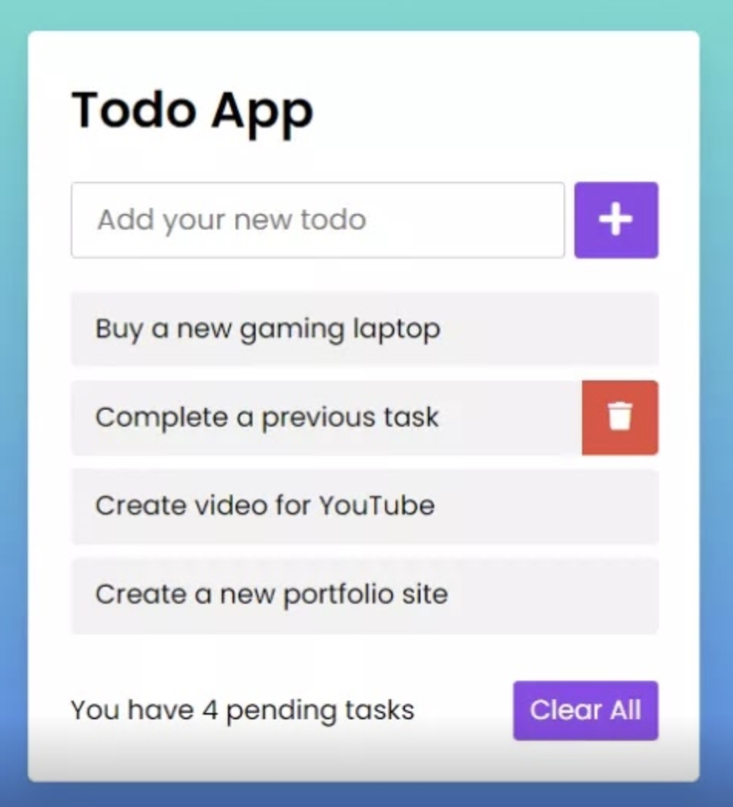

# Aller plus loin avec Laravel


::: details Sommaire
[[toc]]
:::

Ce TP conclut notre découverte de Laravel. Depuis le [TP d'introduction](./introduction.md), nous avons construit pas à pas un projet complet : une TODO List [persistante en base de données](./base_de_donnees.md), protégée par [un système d'authentification](./authentification_manuelle.md) complet, [reset de mot de passe](./reset_mot_de_passe.md) compris.

Dans ce dernier TP, nous allons **finaliser** ce projet comme le ferait un développeur : lier les TODO aux utilisateurs (relations entre tables), remplir la base avec des données de test, limiter les abus (rate limiting), découvrir Tinker, et soigner l'apparence.

Dans ce TP, je vous invite à avoir en parallèle :

- [L'aide-mémoire Laravel](/cheatsheets/laravel/)
- [La synthèse des commandes](/cheatsheets/laravel/quick.md)

## Prérequis

Ce TP repose sur le projet des TP précédents. Avant de commencer, vérifiez que vous avez :

- La TODO List fonctionnelle (lister, ajouter, terminer, supprimer), voir le [TP base de données](./base_de_donnees.md).
- L'authentification (inscription, connexion, déconnexion, middleware `CheckAuth`), voir le [TP authentification](./authentification_manuelle.md).

::: details Il vous manque un morceau ?

Reprenez le TP concerné, les étapes y sont détaillées. Ce TP est une consolidation : sans la base, vous allez bloquer rapidement.

:::

## Objectifs

À la fin de ce TP vous saurez :

- Limiter le nombre d'appels à une route (**rate limiting**).
- Utiliser **Tinker** pour manipuler votre application depuis le terminal.
- Générer des données factices avec les **factories** et **seeders**.
- Créer des **relations** entre vos tables (`belongsTo` / `hasMany`).
- Structurer vos vues avec des **composants**.

## Étape 1 : Limiter le nombre d'appels à une route

Le rate limiting est une technique qui permet de limiter le nombre de requêtes à une route. Cela permet de protéger votre application contre les abus (robots, utilisateurs malveillants…). Laravel propose un système de rate limiting très simple à mettre en place.

Celui-ci est documenté [ici](https://laravel.com/docs/11.x/routing#rate-limiting).

Comme souvent, nous allons protéger au plus proche de l'appel réseau, c'est-à-dire dans le routeur. Pour cela, nous allons ajouter une méthode `middleware` à notre route :

```php
Route::middleware('throttle:5,1')->get('/throttle', function () {
    return 'Hello World';
});
```

Ici, pour tester, nous avons déclaré une route `/throttle` qui va limiter à 5 requêtes par minute. Vous pouvez tester directement avec votre navigateur. Après 5 requêtes, vous devriez voir une erreur `429 Too Many Requests`.

Question :

- `throttle` est un middleware fourni par Laravel. Quel autre middleware avez-vous déjà écrit vous-même dans les TP précédents ?

### C'est à vous

Je vous laisse modifier votre code, pour intégrer la règle suivante :

- Limiter à 50 requêtes par minute la route permettant de lister les TODO.
- Limiter à 10 requêtes par minute la route permettant d'ajouter une TODO.

## Étape 2 : Laravel Tinker

Laravel Tinker est un outil en ligne de commande qui permet d'interagir avec votre application Laravel. Il est basé sur PsySH, un shell interactif pour PHP. Il permet d'exécuter du code PHP dans le contexte de votre application Laravel. C'est un outil très puissant pour tester du code, interagir avec la base de données, etc.

Pour lancer Tinker, il suffit de taper la commande suivante dans votre terminal :

```sh
php artisan tinker
```

Vous pouvez maintenant exécuter du code PHP dans le contexte de votre application Laravel. Par exemple, pour récupérer l'ensemble des TODO en base de données, vous pouvez taper :

```php
App\Models\Todo::all();
```

Je vous laisse tester rapidement.

Allons plus loin, vous pouvez également créer une TODO directement depuis Tinker :

```php
App\Models\Todo::create(['texte' => 'Ma première TODO', 'termine' => false]);
```

Je vous laisse tester rapidement.

Nous allons encore plus loin, récupérer une TODO pour changer son état :

```php
$todo = App\Models\Todo::find(1);
$todo->termine = true;
$todo->save();
```

Je vous laisse tester rapidement.

Nous pouvons également récupérer les résultats de manière paginée :

```php
App\Models\Todo::paginate(10);
```

Vous l'avez compris, Tinker est intéressant pour tester du code rapidement. C'est une bonne solution pour tester du code dans le contexte de votre application Laravel.

Question :

- Après avoir créé une TODO depuis Tinker, rechargez votre page `/todo` dans le navigateur. Que constatez-vous ? Qu'est-ce que ça prouve sur le fonctionnement de Tinker ?

## Étape 3 : Remplir la base de données avec des données factices

Pour tester une application, il faut des données. Les saisir à la main est long et pénible… Laravel propose les `factories` pour générer rapidement des données factices en base. C'est ce que l'on appelle du `seeding`.

Pour commencer, créez une factory pour le modèle `Todo` :

```sh
php artisan make:factory TodoFactory --model=Todo
```

Cette commande va créer un fichier `database/factories/TodoFactory.php`. Vous devez modifier ce fichier pour définir les données factices, dans la méthode `definition` :

```php
public function definition(): array
{
    return [
        'texte' => fake()->sentence(),
        'termine' => fake()->boolean(),
    ];
}
```

::: tip Qu'avons-nous fait ici ?

Nous avons utilisé la bibliothèque `Faker` pour générer des données factices. La méthode `fake()->sentence()` génère une phrase aléatoire, et la méthode `fake()->boolean()` génère un booléen aléatoire.

:::

Ensuite, créez un seeder pour le modèle `Todo` :

```sh
php artisan make:seeder TodoSeeder
```

Cette commande va créer un fichier `database/seeders/TodoSeeder.php`. Vous devez modifier ce fichier pour utiliser la factory que nous avons créée précédemment, dans la méthode `run` :

```php
public function run(): void
{
    \App\Models\Todo::factory()->count(50)->create();
}
```

Cette commande définit le nombre de données factices à créer (ici 50).

Il faut maintenant indiquer à Laravel que notre `Model` `Todo` possède une factory. Pour cela, ajoutez dans le modèle `app/Models/Todo.php` le code suivant :

```php
use Illuminate\Database\Eloquent\Factories\HasFactory;

class Todo extends Model
{
    use HasFactory;
// Le reste de votre code
}
```

Enfin, exécutez le seeder pour remplir la base de données avec les données factices :

```sh
php artisan db:seed --class=TodoSeeder
```

::: tip Point de contrôle

Rechargez votre page `/todo`, vous devez voir vos 50 TODO factices.

:::

## Étape 4 : Lier les TODO à un utilisateur

Actuellement, tous les utilisateurs voient les mêmes TODO… Nous allons lier chaque TODO à l'utilisateur qui l'a créée. Pour cela, nous allons ajouter une colonne `utilisateur_id` dans la table `todos`. Cette colonne va contenir l'id de l'utilisateur qui a créé la TODO.

::: danger Attention le nom est important

Nous l'avons vu ensemble, Laravel utilise des conventions de nommage. Pour les relations entre les tables, il est important de respecter ces conventions. Par exemple, pour lier une TODO à un utilisateur, il est important de respecter le nom `utilisateur_id`.

En respectant ces conventions, Laravel va automatiquement faire le lien entre les tables et vous permettre de récupérer les données facilement (c'est la magie de l'ORM Eloquent). Ici Laravel va automatiquement lier la colonne `utilisateur_id` de la table `todos` à la colonne `id` de la table `utilisateurs`.

:::

Pour commencer, créez une migration pour ajouter la colonne `utilisateur_id` :

```sh
php artisan make:migration add_utilisateur_id_to_todos
```

Ajoutez la colonne dans la migration :

```php
// Colonne à ajouter & la clé étrangère
$table->unsignedBigInteger('utilisateur_id');
$table->foreign('utilisateur_id')->references('id')->on('utilisateurs')->onDelete('cascade');
```

Mettez à jour la table en exécutant la migration :

```sh
php artisan migrate
```

::: tip N'oubliez pas de bien spécifier la table dans la migration

Dans la méthode `up` de la migration, vous devez spécifier la table sur laquelle vous voulez ajouter la colonne. Par exemple :

```php
Schema::table('todos', function (Blueprint $table) {
  // Colonne à ajouter & la clé étrangère
  $table->unsignedBigInteger('utilisateur_id');
  $table->foreign('utilisateur_id')->references('id')->on('utilisateurs')->onDelete('cascade');
});
```

:::

::: warning Votre migration ne passe pas ?

Si votre table `todos` contient déjà des données (les 50 TODO factices de l'étape 3 par exemple), l'ajout d'une colonne obligatoire avec clé étrangère peut échouer. Le plus simple dans notre cas : repartir d'une base propre avec `php artisan migrate:fresh` (⚠️ cette commande **supprime toutes les données**, y compris vos utilisateurs, il faudra donc vous réinscrire).

Question : pourquoi une telle commande est-elle acceptable en développement, mais interdite en production ?

:::

Pour le modèle `Todo`, ajoutez la relation avec l'utilisateur :

```php
public function utilisateur()
{
    return $this->belongsTo(Utilisateur::class);
}
```

Pour le modèle `Utilisateur`, ajoutez la relation avec les TODO :

```php
public function todos()
{
    return $this->hasMany(Todo::class);
}
```

Ces relations vont permettre de récupérer les TODO d'un utilisateur et l'utilisateur d'une TODO. Par exemple :

```php
// Récupérer les TODO d'un utilisateur
$utilisateur = Utilisateur::find(1);
$todos = $utilisateur->todos; // Retourne la liste des TODO de l'utilisateur

// Récupérer l'utilisateur d'une TODO
$todo = Todo::find(1);
$utilisateur = $todo->utilisateur; // Retourne l'utilisateur de la TODO
```

Maintenant que les relations sont en place, vous pouvez :

- Modifier la méthode `addTodo` pour ajouter l'id de l'utilisateur dans la TODO (vous pouvez récupérer l'utilisateur connecté avec `Auth::user()`, ou directement son id avec `Auth::id()`).
- Modifier la méthode `listTodo` pour afficher uniquement les TODO de l'utilisateur connecté.

C'est à vous ! Je vous laisse réaliser ces étapes en vous aidant de [l'aide-mémoire](/cheatsheets/laravel/) et de la [documentation de Laravel](https://laravel.com/docs/11.x/eloquent-relationships).

::: tip Testez avec Tinker

Vous venez d'apprendre Tinker, c'est le moment de l'utiliser : vérifiez vos relations directement depuis le terminal (`App\Models\Utilisateur::find(1)->todos` par exemple) avant même de toucher à vos contrôleurs.

:::

::: tip Point de contrôle

Créez deux comptes utilisateurs, ajoutez des TODO avec chacun. Chaque utilisateur ne doit voir **que ses propres TODO**.

:::

## Étape 5 : Les pages « profil »

Pour compléter notre application, je vous propose de créer des pages permettant de voir les TODO d'un utilisateur. Pour cela, vous allez devoir :

- Créer une route permettant d'afficher les TODO d'un utilisateur.
- Créer une méthode dans le contrôleur permettant d'afficher les TODO d'un utilisateur.
- Créer une vue permettant d'afficher les TODO d'un utilisateur.
- Créer une page listant l'ensemble des utilisateurs et permettant de voir les TODO de chaque utilisateur.

C'est à vous ! Je vous laisse réaliser ces étapes.

::: details Besoin d'un indice pour la route ?

Vous avez déjà fait une route avec un paramètre dans le TP base de données : <code v-pre>Route::get('/todo/terminer/{id}', …)</code>. Ici ce sera le même principe avec l'id de l'utilisateur.

:::

## Bonus : L'apparence

La mise en forme. Actuellement votre application s'affiche et est fonctionnelle. Cependant, c'est plutôt brut ! Pourquoi ne pas travailler la mise en forme ? Je vous propose donc de modifier l'apparence de votre site pour ressembler à :



C'est à vous !

::: tip N'oubliez pas les composants

Nous avons le temps, explorez la création de composants pour structurer / réutiliser votre code. Pourquoi ne pas créer des composants :

- Pour la barre de navigation.
- Pour les boutons.
- Pour un élément de la liste des TODO.
- Pour le conteneur de la liste des TODO (type card).

Pour rappel, les composants sont des morceaux de code réutilisables placés dans `resources/views/components/` et utilisables via des balises comme `<x-card></x-card>`. [La documentation officielle est ici](https://laravel.com/docs/11.x/blade#components).

:::

## Conclusion du parcours

Bravo 🎉, vous êtes arrivé au bout de la découverte de Laravel ! Prenez un moment pour mesurer le chemin parcouru depuis le [TP d'introduction](./introduction.md), vous savez maintenant :

- Structurer une application avec le modèle **MVC** : routes, contrôleurs, vues Blade (layouts, directives, composants).
- Persister des données avec les **migrations** et **Eloquent**, y compris avec des **relations** entre tables.
- Sécuriser une application : **CSRF**, mots de passe **hashés**, **middlewares**, **rate limiting**.
- Utiliser les outils du quotidien : `artisan`, **Tinker**, les **factories** et **seeders**.

Autrement dit : vous avez réalisé une application web complète, de la base de données jusqu'à l'interface.

Pour la suite du parcours :

- [L'authentification avec Breeze](./authentification.md) : générer une authentification complète « standard du marché » avec Laravel.
- [Eloquent les modèles simplement](./generation_model.md) : aller plus loin avec les modèles.
- Puis les projets : [Micro-Messages](./x.md) et [Larablog](./larablog.md) pour mettre tout ça en pratique.
