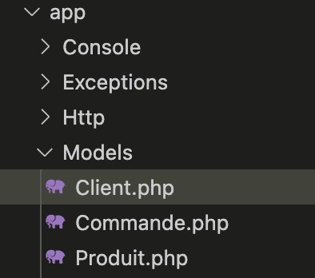
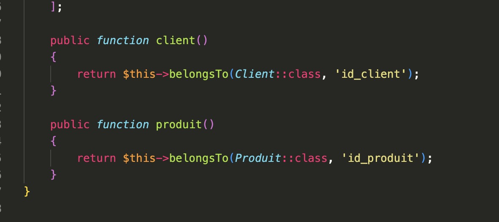

# Des API avec Laravel

Dans ce TP nous allons voir comment il est possible de créer des API avec Laravel. En reprenant les bases vues dans les TP précédents, nous allons voir comment il est possible de créer une API permettant de gérer des données.

::: details Sommaire
[[toc]]
:::

::: tip Un instant

Avant de continuer, dans ce TP nous allons réaliser des API. Les API en elles-mêmes ne servent pas directement. Elles seront utilisées par des applications mobiles ou des sites web.

Nous allons donc voir comment créer des API et comment les utiliser.

Vous utiliserez les outils que vous souhaitez pour tester les API. Je vous conseille d'utiliser [Postman](https://www.postman.com/) qui est un outil très pratique pour tester les API.

Plus tard, dans le cours de développement Flutter vous utiliserez ces API pour générer une application dynamique.

:::

## Description du projet

Ici nous n'allons pas utiliser de HTML, CSS ou autres. Nous allons uniquement manipuler de la donnée et les renvoyer au format JSON. Notre projet va permettre :

- Lister les produits présents en base de données.
- Commander un ou plusieurs produits.
- Se connecter avec un compte client.

::: tip API, JSON ?
Une API est le cœur de beaucoup de systèmes moderne. Il est important de comprendre ce concept dès à présent. Pourquoi faire une API ?

Une API va nous permettre de séparer la logique entre client et serveur afin de réaliser si vous le souhaitez différent client pour la même donnée (exemple Twitter avec des clients multiplates-formes).

Pourquoi préférer une API « JSON / XML » à un retour HTML basic ? Tout simplement, car l'API va être universelle; nous pourrons donc l'utiliser dans un site Internet, mais également dans une application ou n'importe quel client applicatif (web, Android, iOs, une voiture, une TV…).
:::

## Prérequis

Pour pouvoir réaliser ce TP, vous devez avoir installé Composer sur votre machine. Je vous invite à suivre la documentation officielle : [https://getcomposer.org/download/](https://getcomposer.org/download/) si ce n'est pas déjà fait.

## La base de données

Dans ce TP, nous allons inverser la manière dont nous utilisons laravel. Habituellement, nous créons une base de données et nous créons ensuite les migrations. Ici je vais vous fournir un script SQL qui va créer la base de données et les tables.

```sql

CREATE TABLE clients (
  id int(11) NOT NULL PRIMARY KEY AUTO_INCREMENT,
  nom varchar(255) COLLATE utf8_bin NOT NULL,
  prenom varchar(255) COLLATE utf8_bin NOT NULL,
  email varchar(255) COLLATE utf8_bin NOT NULL,
  password varchar(255) COLLATE utf8_bin NOT NULL
) ENGINE=InnoDB DEFAULT CHARSET=utf8 COLLATE=utf8_bin;

CREATE TABLE commandes (
  id int(11) NOT NULL PRIMARY KEY AUTO_INCREMENT,
  id_client int(11) NOT NULL,
  id_produit int(11) NOT NULL,
  quantite int(11) NOT NULL,
  date date NOT NULL
) ENGINE=InnoDB DEFAULT CHARSET=utf8 COLLATE=utf8_bin;

CREATE TABLE produits (
  id int(11) NOT NULL PRIMARY KEY AUTO_INCREMENT,
  nom varchar(255) COLLATE utf8_bin NOT NULL,
  description varchar(255) COLLATE utf8_bin NOT NULL,
  lien_image varchar(255) COLLATE utf8_bin NOT NULL,
  prix decimal(10,2) NOT NULL,
  tva decimal(10,2) NOT NULL
) ENGINE=InnoDB DEFAULT CHARSET=utf8 COLLATE=utf8_bin;

ALTER TABLE commandes
  ADD KEY fk_idClient (id_client),
  ADD KEY fk_idProduit (id_produit),
  ADD CONSTRAINT fk_idClient FOREIGN KEY (id_client) REFERENCES `clients` (id) ON DELETE CASCADE ON UPDATE CASCADE,
  ADD CONSTRAINT fk_idProduit FOREIGN KEY (id_produit) REFERENCES produits (id) ON DELETE CASCADE ON UPDATE CASCADE;
```

::: tip C'est à vous

Je vous laisse créer la base de données en utilisant le script SQL ci-dessus. Vous pouvez utiliser le logiciel de votre choix pour créer la base de données.

:::

## Création d'un projet

Maintenant que nous avons notre base de données, nous allons créer notre projet. Pour cela, nous allons utiliser la commande `create-project` de Composer.

✋ Attention, le projet sera créé dans le dossier courant.

```bash
composer create-project --prefer-dist laravel/laravel mon-premier-projet
```

La commande va télécharger l'ensemble des dépendances nécessaire et va créer un dossier `mon-premier-projet` avec les sources.

::: details vous avez récupéré le projet via GIT ?

Si vous avez récupéré le projet depuis GIT vous n'allez bien évidemment pas utiliser la commande `create-project`… Par contre vous allez devoir réinstaller les dépendances (`vendor`) de votre projet. C'est très simple :

Dans le dossier de votre projet, lancer la commande :

```sh
composer install
```

:::

## Initialisation

Votre nouveau projet contient un fichier `.env` ouvrez-le, et indiquer à Laravel la base de données à utiliser.

## Tester le projet

Avant de commencer à coder, nous allons tester que notre projet fonctionne correctement. Pour cela, nous allons utiliser la commande `serve` de Laravel.

```bash
php artisan serve
```

## Importer la base de données

L'idée de ce TP est de générer automatiquement les modèles à partir de la structure de votre base de données.

Pourquoi générer nos modèles ? L'avantage de générer nos modèles c'est qu'ils vont vraiment être complets.

Ils contiendront évidemment les, `$fillable` mais également les jointures entre les tables !

### Installer le générateur de modèle

Pour générer les modèles, nous allons utiliser un plugin que nous allons ajouter avec Composer.

Le plugin en question [Reliese Laravel Model Generator](https://github.com/reliese/laravel)

Pour l'installer, la procédure est simple :

```sh
composer require reliese/laravel --dev
php artisan vendor:publish --tag=reliese-models
php artisan config:clear
```

::: tip Un instant !

Qu'avez-vous installé ? Quels fichiers ont été modifiés ? Je vous laisse regarder, nous allons en parler !

:::

### Générer les modèles

::: danger Attention

Avant de générer les modèles, je vous laisse vérifier la configuration de votre, `.env` notamment au niveau de la base de données.

:::

Maintenant que votre base de données est configurée et prête à être utilisée depuis Laravel, nous allons pouvoir générer l'ensemble des modèles de notre application.

Pour générer **l'ensemble des modèles,** nous allons saisir une nouvelle commande (celle-ci a été ajoutée par le plugin que vous venez d'ajouter) :

```sh
php artisan code:models
```

::: tip C'est rapide et ça fonctionne !
En quelques secondes le plugin a créé l'ensemble des modèles de votre projet. Je vous laisser regarder les modifications dans votre projet, et surtout le dossier `models`
:::

### Les modèles générés

Avant d'aller plus loin, regardons ensemble un peu les modèles :



Vous vous souvenez des jointures ? Je vous avais expliqué qu'il était possible de les définir dans Laravel pour requêter simplement votre base de données. Dans le code généré par le plugin, nous avons évidemment celle-ci, voilà un exemple :



::: danger STOP

Ici, pas de magie ! Le plugin ne fait qu'écrire du code à votre place. Le code vous ne pouvez **évidemment pas l'inventer,** il est dans la documentation officielle de Laravel.

Vous l'avez oublié ? Pas de problème :

[Aide mémoire Laravel](/cheatsheets/laravel/quick.html)
[La documentation de base](https://laravel.com/docs/8.x/eloquent)
[Les jointures et Eloquent](https://laravel.com/docs/8.x/eloquent-relationships)

:::

## Créer un jeu de données de test

Nous avons donc maintenant une base de données de test. Avant d'aller plus loin… Je vous laisse insérer des données fictives pour que nous ayons un peu de contenu.

Vous avez deux façons de faire ça :

- Directement en base « manuellement ».
- [Via Une Factories + Un Seeder de Laravel](https://laravel.com/docs/8.x/seeding)

L'avantage du seeder ? Il va permettre de créer beaucoup de données en un rien de temps ! 50 Clients ? Aucun problème !

### Autoriser les factories

Pour permettre à votre Modèle d'être « rempli », vous devez vérifier que la classe possède bien les use suivants (à mettre dans la classe du modèle) :

```php
use HasApiTokens, HasFactory, Notifiable;
```

::: details Exemple

```php
<?php

namespace App\Models;

use Illuminate\Database\Eloquent\Factories\HasFactory;
use Illuminate\Database\Eloquent\Model;
use Illuminate\Notifications\Notifiable;
use Laravel\Sanctum\HasApiTokens;

class Client extends Model
{
    use HasApiTokens, HasFactory, Notifiable;

    // ... le reste du code
}
```

::: danger Attention aux imports

N'oublier pas d'importer les classes nécessaires pour utiliser les factories.

```php
use Illuminate\Database\Eloquent\Factories\HasFactory;
use Illuminate\Notifications\Notifiable;
use Laravel\Sanctum\HasApiTokens;
```

:::

⚠️ Sans cela, vous ne pourrez pas utiliser les factories.

### Créer une factory

```shell
php artisan make:factory ClientFactory
```

Je vous laisse configurer la factory (`/database/factories/ClientFactory.php`) en prenant exemple sur celle de la partie User. Mais dans les grandes lignes, il faut ajouter.

```php
public function definition(){
  return [
      'nom' => $this->faker->firstName,
      'prenom' => $this->faker->lastName,
      'email' => fake()->unique()->safeEmail(),
      'password' => password_hash($this->faker->password, PASSWORD_DEFAULT),
  ];
}
```

La factory permet de générer un tableau associatif qui sera utilisé par le seeder pour créer les données.

La liste des options disponible pour fake est [disponible ici](https://github.com/fzaninotto/Faker)

### Définir votre Seeder

Éditer maintenant le DatabaseSeeder pour ajouter dans le run() :

```php
Client::factory()->count(50)->create();
```

```shell
php artisan db:seed
# Vous avez maintenant 50 clients dans votre table
```

### Et les Produits ?

C'est à vous que je vous laisse réaliser la même opération pour les produits.

::: tip Aide
pour l'image du produit, vous pouvez utiliser [https://picsum.photos/200/300](https://picsum.photos/200/300) pour générer des images aléatoires.
:::

## Création de l'API

La création d'une API va être très proche de ce que nous connaissons déjà. Première étape, créer un contrôleur ; pour rappel celui-ci permet de gérer le trafic et de répondre aux demandes des / du client.

Notre API sera très simple, elle contiendra **3 routes / fonctionnalités** :

| Méthode | Chemin              | Fonctionnalité                                                               |
| ------- | ------------------- | ---------------------------------------------------------------------------- |
| GET     | `/api/produits`     | Liste de l'ensemble des produits                                             |
| GET     | `/api/produit/{id}` | Obtention du produit spécifié en paramètre `id`                              |
| POST    | `/api/produit`      | Ajouter un nouveau produit dans la table `Produit`                           |
| POST    | `/api/commande`     | Ajout d'une commande nouvelle commande pour « un produit » et « un client »  |

## Testons les modèles

Vous avez maintenant à votre disposition l'ensemble des modèles de votre base de données.

Les modèles seuls ne sont pas très utiles. Nous allons donc déclarer un contrôleur qui va nous permettre de les requêter.

### 1. Création du contrôleur

```sh
php artisan make:controller ProduitsController
```

### 2. Déclarer les routes

Nous allons créer une nouvelle route qui va nous permettre d'appeler le `ProduitsController` et de récupérer l'ensemble des produits.

Vu que nous réalisons une API REST, nous allons placer cette route dans le fichier `routes/api.php`

```php
Route::get('/produits', [ProduitsController::class, "liste"]);
```

::: danger un instant ✋

En PHP objet il y a la notion de namespace, Laravel utilise de base les namespace, ça veut dire que nous allons avoir à utiliser le mot clé `use` pour importer (include). Quand vous voulez utiliser une classe qui n'est pas dans le même fichier, il faudra déclarer l'emplacement via un `use`. Exemple, pour que la classe `Demo` soit accessible depuis une autre classe, il faudra :

```php
use App\Models\Demo;
```

- ⚠️ Si vous utilisez **PHPStorm,** cet import sera automatique.
- ⚠️ Si vous utilisez **VSCode,** il faudra passer par une extension [disponible ici](https://marketplace.visualstudio.com/items?itemName=MehediDracula.php-namespace-resolver)

Pour **PHPStorm**, alt+entrée permettra de déclencher l'ajout dû use.

Pour **VSCode** je vous laisse regarder l'usage de l'extension :


:::

### 3. Déclarer la méthode

Si vous avez bien suivi, vous avez compris que nous allons devoir ajouter dans notre `ProduitsController` une méthode `liste`.

Dans votre contrôleur, ajouter le code suivant :

```php
    function liste(){
        return response()->json(Produit::all());
    }
```

La méthode `response()->json()` permet de retourner un objet JSON. C'est une méthode de Laravel qui permet de retourner un objet JSON.

Elle prend en paramètre un tableau associatif qui sera converti en JSON. Ici nous retournons l'ensemble des produits. Pour cela nous utilisons la méthode `all()` qui permet de récupérer l'ensemble des produits. Cette méthode est disponible sur tous les modèles.

::: tip Et oui !
C'est aussi simple que ça ! Avec cette simple méthode, vous avez écrit votre première API.

<center><iframe src="https://giphy.com/embed/UtQHZEv5M7POO8t2WW" width="280" height="160" frameBorder="0" class="giphy-embed" allowFullScreen></iframe></center>
:::

### 4. Testons

Pour tester, il suffit de lancer votre serveur et d'aller sur la route `/api/produits`. 

Pour tester, nous avons deux cas, soit vous avez un navigateur, soit vous avez un outil de requête HTTP.

#### Avec un navigateur

Si vous avez un navigateur, vous pouvez aller sur la route `/api/produits` et vous devriez voir un tableau JSON.

#### Avec un outil de requête HTTP

Nous allons pouvoir le tester, pour tester les API c’est plutôt simple. Il suffit d’utiliser des outils tels que [Postman](https://www.getpostman.com/), l’idée c’est de se construire un « cahier » de test vous permettant de valider le fonctionnement de votre application rapidement (comprendre dès que vous modifiez le code). C’est dans ce but que je vous ai préparé une collection de « tests » qui devrait vous permettre de valider rapidement le bon fonctionnement de vos API.

(Pssst! La création de comptes **n'est pas obligatoire**) <-- ⚠️⚠️

Ici nous allons utiliser un outil qui va nous permettre de faire des requêtes HTTP.

Cet outil s'appelle **Postman** et est disponible [ici](https://www.postman.com/downloads/)

Cette application va nous permettre de faire des requêtes HTTP et de voir les réponses. Elle est très pratique pour tester les API, c'est un standard en entreprise.

Nous allons le tester ensemble.

- Lancez Postman
- Créez une nouvelle requête
- Dans la barre d'adresse, tapez `http://localhost:8000/api/produits`
- Cliquez sur le bouton `Send`

Vous devriez voir une réponse de type `200` et un tableau JSON. 

## Point étape : GIT

Et Git ? Vous avez oublié de faire un commit ? Pas de panique, vous pouvez toujours faire un commit avec les fichiers modifiés.

```sh
git add .
git commit -m "Ajout de la route liste des produits"
```

## La route permettant de récupérer un produit en particulier

Nous allons maintenant ajouter la route qui va nous permettre de récupérer un produit en particulier. Pour cela nous allons utiliser la méthode `find()` qui permet de récupérer un produit en particulier. Cette méthode prend en paramètre l'identifiant du produit.

Je vous laisse écrire la route et la méthode dans le contrôleur.

::: tip Rappel

Pour récupérer un produit en particulier, il faut utiliser la méthode `find()`. Exemple pour récupérer le produit avec l'identifiant 1 :

```php
Produit::find(1);
```

Pour passer un paramètre à une route, il faut utiliser les accolades. Exemple pour une route qui prend un paramètre `id` :

```php
Route::get('/produits/{id}', [ProduitsController::class, "detail"]);
```

Le paramètre `id` sera accessible dans la méthode `detail` du contrôleur. 

```php
function detail($id){
    // Code permettant d'obtenir le produit avec l'identifiant $id (find($id))
}
```

:::

C'est à vous, je vous laisse écrire le code et tester :

- Créez la route.
- Créez la méthode dans le contrôleur.
- Testez avec Postman (ou un navigateur).

N'oubliez pas de faire un commit si tout fonctionne.

## Créer un nouveau produit

Nous allons maintenant créer une route qui va nous permettre de créer un nouveau produit. Pour cela nous allons utiliser la méthode `create()` qui permet de créer un nouveau produit. Cette méthode prend en paramètre un tableau associatif qui contient les données du produit.

### 1. Créer la route

Pour créer une route, il faut utiliser la méthode `post()` de la classe `Route`. Cette méthode prend en paramètre l'URL et la méthode du contrôleur à appeler.

```php
Route::post('/produits', [ProduitsController::class, "ajouter"]);
```

### 2. Créer la méthode

Ajouter la méthode `ajouter` dans le contrôleur `ProduitsController`.

```php
function ajouter(Request $request){
    $produit = new Produit();
    $produit->nom = $request->nom;
    $produit->description = $request->description;
    $produit->lien_image = $request->lien_image;
    $produit->prix = $request->prix;
    $produit->tva = $request->tva;
    $produit->save();
    return response()->json($produit);
}
```

Cette méthode va créer un nouveau produit et le retourner en JSON. Pour cela nous utilisons la méthode `response()->json($produit)` qui prend en paramètre le produit à retourner.

Pour la création d'un produit, nous créons un nouveau produit et nous lui assignons les valeurs des champs. Pour récupérer les valeurs des champs, nous utilisons la variable `$request` qui contient les données envoyées par le client. Pour récupérer une valeur.

### 3. Tester

Pour tester, vous devrez utiliser Postman. À votre avis pourquoi ? 

Nous allons le réaliser ensemble, mais si vous le souhaitez, voilà la procédure :

- Créez une nouvelle requête
- Dans la barre d'adresse, tapez `http://localhost:8000/api/produits`
- Dans la partie, `Body` sélectionnez `raw` et `JSON`
- Dans la partie, `Body` tapez les données du produit à créer
- Cliquez sur le bouton `Send`

Vous devriez voir une réponse de type `200` et le produit créé en JSON.

## Point étape : GIT

Et oui encore un commit…

```sh
git add .
git commit -m "Ajout de la route création d'un produit"
```

::: tip pourquoi est-ce important ?
En cas de problème, vous pourrez revenir à un commit précédent et ainsi retrouver votre code.
:::

## Créer une nouvelle commande

Nous allons maintenant créer une route qui va nous permettre de créer une nouvelle commande. Pour cela nous allons utiliser la méthode `ajouterCommande()` qui permet de créer une nouvelle commande.

Je vous laisse écrire le code pour cette partie. En reprenant les étapes précédentes, vous devriez pouvoir :

- Créer la route (de type `post`, URL `/commandes`).
- Créer la méthode dans le contrôleur (nom de la méthode `ajouterCommande`).
- Écrire le code pour créer une nouvelle commande.

::: tip Rappel

Une commande est composée d'un client et d'un produit. Pour créer une commande, il faut donc un identifiant de client et un identifiant de produit.

Vous pouvez les passer en paramètre de la route ou les récupérer dans le corps de la requête. Exemple :

```php
// Exemple de méthode qui prend en paramètre un identifiant de client et un identifiant de produit
function ajouterCommande($idClient, $idProduit){
    // Code permettant de créer une commande
}

// Exemple de méthode qui récupère les identifiants de client et de produit dans le corps de la requête
function ajouterCommande(Request $request){
    $idClient = $request->idClient;
    $idProduit = $request->idProduit;
    // Code permettant de créer une commande
}
```

:::

## Lister toutes les commandes d'un client

Nous allons maintenant créer une route qui va nous permettre de lister toutes les commandes d'un client. Pour cela nous allons utiliser la méthode `commandesClient()` qui permet de lister toutes les commandes d'un client.

Je vous laisse écrire le code pour cette partie. En reprenant les étapes précédentes, vous devriez pouvoir :

- Créer la route (de type `get`, URL `/commandes/{idClient}`).
- Créer la méthode dans le contrôleur (nom de la méthode `commandesClient`).
- Écrire le code pour lister toutes les commandes d'un client.

::: danger Un instant

Où allons-nous ranger cette méthode ? Dans le contrôleur `CommandesController` ou dans le contrôleur `ClientsController` ?

- Si vous avez choisi `CommandesController`, vous avez raison. 

Pourquoi ? Parce que nous listons les commandes d'un client. Donc nous devons aller chercher les commandes dans le contrôleur `CommandesController`.

En utilisant l'aide mémoire, je vous laisse créer le contrôleur `CommandesController` et la méthode `commandesClient()`.

:::

::: tip Rappel

Un client possède plusieurs commandes. Pour lister les commandes d'un client, il faut donc un identifiant de client.

Vous pouvez le passer en paramètre de la route ou le récupérer dans le corps de la requête. Exemple :

```php
// Exemple de méthode qui prend en paramètre un identifiant de client
function commandesClient($idClient){
    // Code permettant de lister les commandes d'un client
}
```

:::

### Obtenir les commandes d'un client

Un peu d'aide pour cette partie. Pour obtenir toutes les commandes d'un client, nous allons utiliser la méthode `commandes()` qui permet de récupérer les commandes d'un client. 

```php
// Exemple de méthode qui récupère toutes les commandes d'un client
function commandesClient($idClient){
    return response()->json(Client::find($idClient)->commandes()->get());
}
```

Nous passons ici par le modèle `Client` pour récupérer les commandes d'un client. Pourquoi ? Parce que nous avons défini une relation entre le modèle `Client` et le modèle `Commande`. Cette relation permet de récupérer les commandes d'un client.

Mais nous pouvons également récupérer les produits de chaque commande. Pour cela, nous allons utiliser la méthode `with()` qui permet de récupérer les produits d'une commande.

```php
// Exemple de méthode qui récupère toutes les commandes d'un client avec les produits de chaque commande
function commandesClient($idClient){
    return response()->json(Client::find($idClient)->commandes()->with('produit')->get());
}
```

Il est également possible de passer directement via le modèle `Commande` pour récupérer les commandes d'un client. Pour cela, nous allons utiliser la méthode `where()` qui permet de filtrer les résultats. Comme présenté dans la solution alternative suivante.

### Obtenir les produits commandés par un client solution alternative

Un peu d'aide pour cette partie. Pour obtenir toutes les commandes d'un client, nous allons utiliser la méthode `where()` qui permet de filtrer les résultats. Cette méthode prend en paramètre le nom du champ et la valeur à filtrer.

```php
// Exemple de méthode qui récupère toutes les commandes d'un client
function commandesClient($idClient){
    return response()->json(Commande::where('id_client', $idClient)->get());
}
```

Cette méthode va nous retourner un tableau JSON contenant toutes les commandes du client. Mais ce n'est pas très pratique. Nous voudrions plutôt avoir un tableau JSON contenant les produits commandés par le client.

Pour cela nous allons utiliser la méthode `with()` qui permet de récupérer les données d'une autre table. Cette méthode prend en paramètre le nom de la table à récupérer.

```php
// Exemple de méthode qui récupère toutes les commandes d'un client
function commandesClient($idClient){
    return response()->json(Commande::where('id_client', $idClient)->with('produit')->get());
}
```

Je vous laisse observer la différence entre les deux réponses.

::: tip `with()`

Le `with()` permet de récupérer les données d'une autre table. Vous pouvez également déclarer le `with()` dans le modèle. 

Exemple, **dans le modèle `Commande`** :

```php
$with = ['produit'];
```

En indiquant le `$with` dans le modèle, votre jointure sera automatiquement effectuée. Vous n'aurez plus besoin de passer par le `with()` dans le contrôleur. Pratique pour automatiser les jointures.

:::

::: details Qu'avez-vous observez ? 

- La première réponse contient les commandes du client.
- La deuxième réponse contient les commandes du client et les produits commandés.

:::

## Supprimer une commande

Nous allons maintenant créer une route qui va nous permettre de supprimer une commande. Pour cela nous allons utiliser la méthode `supprimerCommande()` qui permet de supprimer une commande.

Je vous laisse écrire le code pour cette partie. En reprenant les étapes précédentes, vous devriez pouvoir :

- Créer la route (de type `delete`, URL `/commandes/{idCommande}`).
- Créer la méthode dans le contrôleur (nom de la méthode `supprimerCommande`).
- Écrire le code pour supprimer une commande.

::: tip Rappel

Pour supprimer une commande, il faut un identifiant de commande. 

Vous pouvez le passer en paramètre de la route ou le récupérer dans le corps de la requête. Exemple :

```php
// Exemple de méthode qui prend en paramètre un identifiant de commande
function supprimerCommande($idCommande){
    // Code permettant de supprimer une commande
}
```

Eloquent nous permet de supprimer une commande en utilisant la méthode `destroy()` qui prend en paramètre l'identifiant de la commande à supprimer.

```php
// Exemple de méthode qui supprime une commande. 
// Cette méthode prend en paramètre un identifiant de commande et supprime la commande correspondante (si elle existe, sinon elle ne fait rien)

// Dans cette exemple, nous supprimons la commande dont l'identifiant est 1
Commande::destroy(1);
```

:::

## Créer un client

Nous allons maintenant créer une route qui va nous permettre de créer un client. Pour cela nous allons utiliser la méthode `creerClient()` qui permet de créer un client.

Je vous laisse écrire le code pour cette partie. En reprenant les étapes précédentes, vous devriez pouvoir :

- Créer la route (de type `post`, URL `/api/client`).
- Créer la méthode dans le contrôleur (nom de la méthode `creerClient`).
- Écrire le code pour créer un client.

::: tip Rappel

Pour créer un client, il faut un nom, un prénom et un email et un mot de passe.

Vous pouvez passer ces informations en paramètre de la route ou les récupérer dans le corps de la requête. Exemple :

```php
// Exemple de méthode qui prend en paramètre un nom, un prénom, un email et un mot de passe
function creerClient(Request $request){
    // Code permettant de créer un client
    // $request->nom, $request->prenom, $request->email, $request->motDePasse
}
```

⚠️ Attention, il faut vérifier que l'email n'est pas déjà utilisé par un autre client. Si c'est le cas, il faut retourner une erreur. Il faudra également vérifier que le mot de passe fait au moins 8 caractères.

Attention également à bien hasher le mot de passe avant de l'enregistrer dans la base de données.

:::

## Authentification d'un client

Nous allons maintenant créer une route qui va nous permettre d'authentifier un client. Pour cela nous allons utiliser la méthode `authentifierClient()` qui permet d'authentifier un client.

Je vous laisse écrire le code pour cette partie. En reprenant les étapes précédentes, vous devriez pouvoir :

- Créer la route (de type `post`, URL `/client/authentification`).
- Créer la méthode dans le contrôleur (nom de la méthode `authentifierClient`).
- Écrire le code pour authentifier un client.
- Retourner le client authentifié.

::: tip Rappel

Pour authentifier un client, il faut un email et un mot de passe. 

Vous pouvez passer ces informations en paramètre de la route ou les récupérer dans le corps de la requête. Exemple :

```php
// Exemple de méthode qui prend en paramètre un email et un mot de passe
function authentifierClient(Request $request){
    // Code permettant d'authentifier un client
    // $request->email, $request->motDePasse
}
```

Vous allez devoir utiliser password_verify() pour vérifier le mot de passe.

⚠️ N'oublier pas de retourner le client authentifié.
:::

## Aller plus loin

Pour aller plus loin dans la partie API, vous pouvez :

- Utiliser `sanctum` pour créer des tokens d'authentification. <<https://laravel.com/docs/9.x/sanctum>
- Utiliser les `abilities` pour gérer les droits d'accès. <https://laravel.com/docs/9.x/sanctum#token-abilities>

Sanctum, c'est un package (un peu comme Breeze), mais ici pas d'interface, nous avons « juste » la logique pour :

- Créer des tokens d'authentification (`$token = $request->user()->createToken($request->token_name);`)
- Gérer les droits d'accès pour chaque route (`->middleware('auth:sanctum')`)
- Authentifier les utilisateurs via un token (appelé bearer token).

::: tip C'est du bonus

Cette partie n'interessera pas tout le monde. Si vous êtes intéressé, vous pouvez regarder la documentation de Sanctum. Et me demander si vous avez des questions.

:::

## Conclusion

Nous avons maintenant terminé la partie API. Nous avons vu comment créer des routes, des contrôleurs et des modèles. Nous avons aussi vu comment utiliser les méthodes `get()`, `post()`, `put()` et `delete()` pour créer des routes. 

En Bonus, nous avons aussi vu comment utiliser les méthodes `where()` et `with()` pour filtrer les résultats.

Nous allons maintenant passer à la partie Frontend. Nous allons créer une application web ou mobile qui va nous permettre de gérer nos commandes et nos clients.

Ne vous inquiétez pas, pour réaliser notre client, nous utiliserons deux frameworks simple et puissant :

- Vue.js pour le Frontend
- Flutter pour le Mobile

Vous avez un exemple d'application [Flutter utilisant une API](/tp/flutter/sample_code.md). Vous pouvez vous en inspirer pour réaliser votre application.

<iframe src="https://giphy.com/embed/m9eG1qVjvN56H0MXt8" width="295" height="480" frameBorder="0" class="giphy-embed" allowFullScreen></iframe>