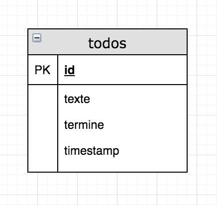
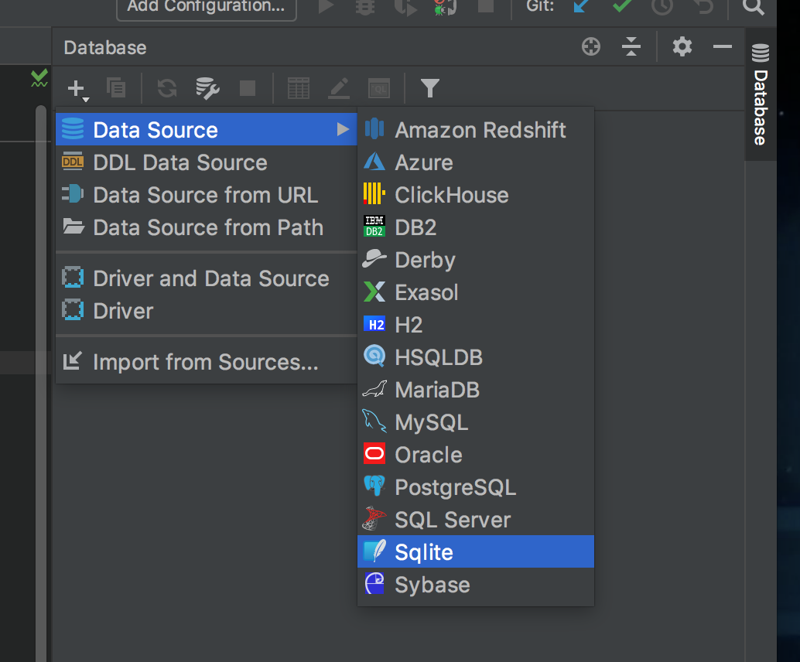
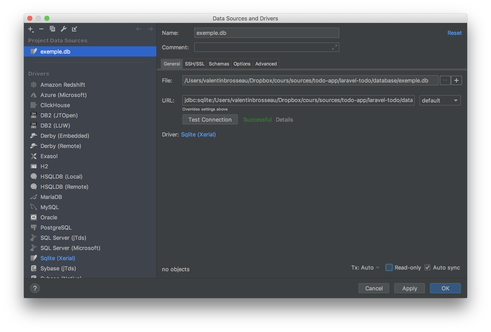
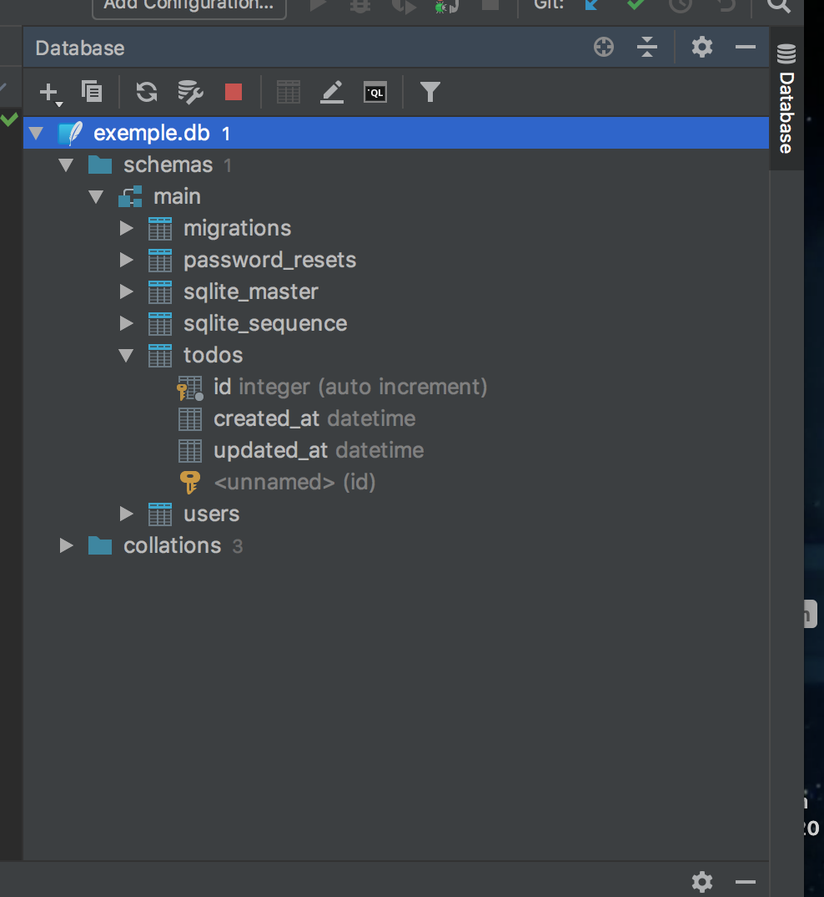
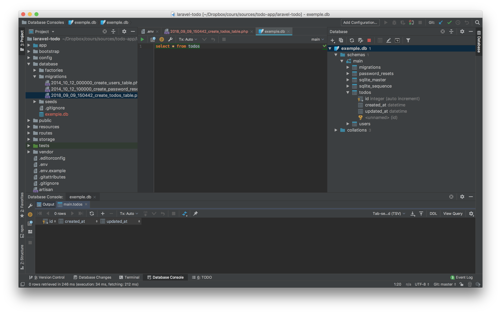
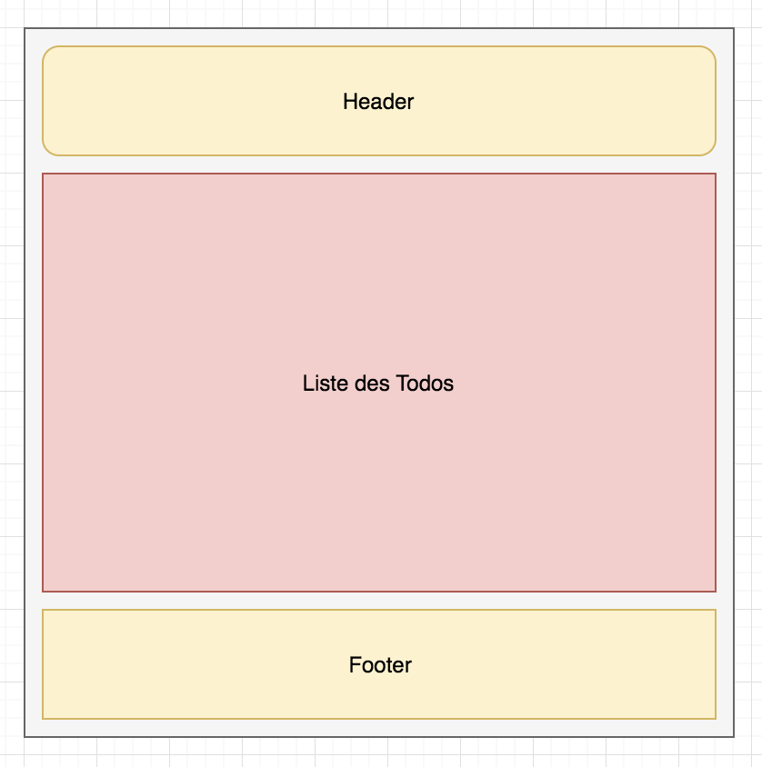
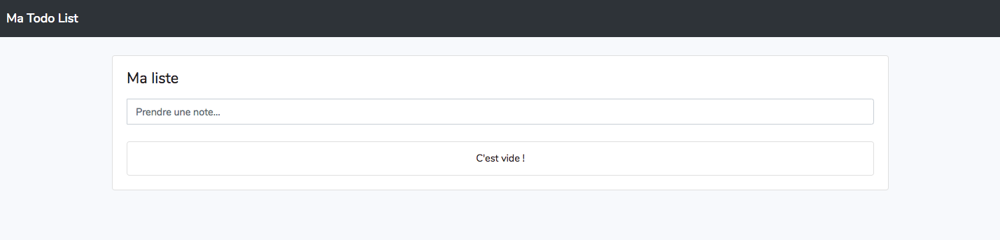
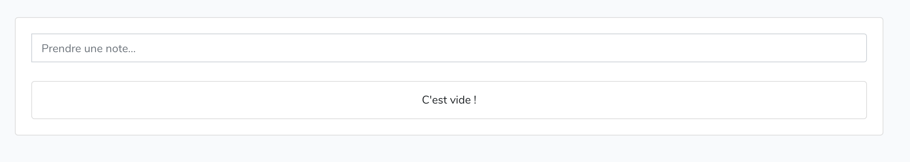
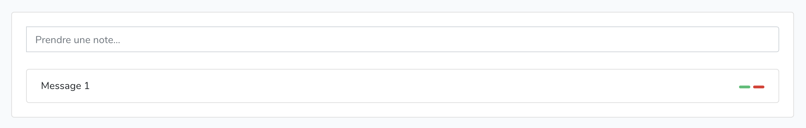

# Application Todo Liste

::: details Sommaire
[[toc]]
:::

## Introduction

Dans ce TP, nous allons réaliser une application / site web dont le but est la prise de notes de type « TODO », aussi appelée liste de tâches.

Une TODO List est un procédé qui se veut simple et efficace pour gérer les tâches d'un projet. Ces tâches peuvent être indépendantes ou devoir, au contraire, être accomplies dans un certain ordre.

Voilà la liste des fonctionnalités de l’application que l'on va créer :

- Lister les tâches.
- Ajouter une tâche.
- Marquer comme terminé une tâche.
- Suppression d'une tâche.

## Technologies

Dans ce TP nous allons utiliser les technologies suivantes :

- Laravel (Framework PHP)
- Bootstrap 5 (Framework HTML / CSS / JS)

## Initialiser le projet

La première étape lors d'un projet Laravel est la création de la structure avec une simple ligne de commande, dans notre cas :

```sh
$ composer create-project --prefer-dist laravel/laravel laravel-todo
Creating a "laravel/laravel" project at "./laravel-todo"
Installing laravel/laravel
[…]
```

✋ Attention, le projet va être créé dans le dossier `laravel-todo` dans le dossier courant.

La création prend environ 1 minute, un certain nombre de librairies sont téléchargées. Une fois terminé, prenez quelques instants pour regarder les fichiers qui ont été créés.

### 🤓 Questions

- Où sont les librairies ?
- Quel est l'intérêt à votre avis d'utiliser un outil pour initialiser un projet ?

## Configurer le projet, le .env

Le projet qui vient d'être créé est « générique » c'est-à-dire qu'il ne possède aucune personnalisation et peut donc servir de base, quel que soit votre développement.

La première étape va donc être d'éditer le fichier `.env` pour configurer les options de base de votre projet tel que :

- Le nom
- Le type de base de données
- …

C'est parti !

### Nom de l'application

- Todolist

### Base de données

Pour ne pas avoir à installer un serveur MySQL nous allons utiliser une base de données « locale ».

Connaissez-vous le nom d'un type de base de données permettant de travailler en « local » c'est-à-dire sans serveur ?

<Reveal text="Voir la suite du TP">

La réponse est SQLite. SQLite est une base de données de type SQL, mais ne nécessitant pas de serveur, l'ensemble des données est contenu dans un fichier « local ».

Bonne nouvelle : depuis Laravel 11, SQLite est la base de données par défaut. Vérifiez simplement dans votre fichier `.env` la présence de la ligne :

```txt
DB_CONNECTION=sqlite
```

Le fichier `database/database.sqlite` a normalement été créé automatiquement à l'initialisation du projet. S'il est absent, créez-le simplement :

```sh
$ touch database/database.sqlite
```

Attention : sous Windows, utilisez Git Bash (ou WSL) pour avoir la commande `touch`.

</Reveal>

#### Tester

Vous pouvez maintenant tester votre application / site web. Comme vu en cours, Laravel intègre un serveur de développement ce qui permet de le tester rapidement. Le lancement se fait via la commande suivante :

```sh
$ php artisan serve
```

#### 🤓 Questions

- À votre avis, comment revenir à une base de données de type MySQL ?
- Est-il possible d'utiliser les deux types de bases de données (par exemple MySQL en production et SQLite en développement) ?
- SQLite est-il toujours pertinent ?

### Le reste du fichier .env

Nous n'allons pas toucher aux autres paramètres, mais certains sont tout de même intéressants. Je vous laisse donc consulter la documentation en ligne de Laravel :

[Consulter en ligne](https://laravel.com/docs/12.x/configuration)

## Conception de la base de données

Voilà à quoi va ressembler notre base de données :



🤓 C’est parti ! Tout est prêt, nous pouvons commencer à écrire du code.

## Création de la « migration »

Laravel utilise un ORM pour manipuler la base de données. Pour rappel, un ORM est :

> Un mapping objet-relationnel (en anglais object-relational mapping ou ORM) est une technique de programmation informatique qui crée l'illusion d'une base de données orientée objet à partir d'une base de données relationnelle en définissant des correspondances entre cette base de données et les objets du langage utilisé.

L'ORM utilisé par Laravel est Eloquent, il est à la fois puissant et relativement simple. Autrement dit, avec un ORM, dans la plupart des cas vous n'écrivez plus de requête SQL, mais vous manipulez des objets représentant la base de données.

Comme pour la création du projet, la création de la définition de la table « todos » va se faire via une requête dans votre terminal :

```bash
php artisan make:migration create_todos_table --create=todos
```

L’option `--create=todos` permet d’indiquer le nom de la table à créer.

✋ Le contenu du fichier créé est fictif, il est là pour illustrer comment travailler. Nous allons le modifier pour mettre les informations relatives à notre table.

La commande vient de créer un nouveau fichier dans le dossier `database/migrations`. Dans mon cas, le fichier se nomme :

```bash
YYYY_11_09_150442_create_todos_table.php
```

Nous allons définir notre schéma (à savoir la définition de la table) pour y ajouter les 2 colonnes qui nous seront utiles `texte` et `termine`. L'ORM étant une librairie objet, la définition de nouveaux champs se fait via une méthode, dans notre cas :

```php
    $table->string('texte');
    $table->boolean('termine');
```

Vous pouvez ajouter les deux champs dans la méthode `up` du fichier.

<Reveal text="Voir le fichier avec les nouveaux champs">

```php
<?php

use Illuminate\Database\Migrations\Migration;
use Illuminate\Database\Schema\Blueprint;
use Illuminate\Support\Facades\Schema;

return new class extends Migration
{
    /**
     * Run the migrations.
     */
    public function up(): void
    {
        Schema::create('todos', function (Blueprint $table) {
            $table->id();
            $table->string('texte');
            $table->boolean('termine');
            $table->timestamps();
        });
    }

    /**
     * Reverse the migrations.
     */
    public function down(): void
    {
        Schema::dropIfExists('todos');
    }
};
```

</Reveal>

### 🤓 Questions

- À quoi correspond la méthode `up` et `down` ?
- L'ordre des champs est-il important ?

## Création en base

Maintenant que le script est terminé, nous allons indiquer à Laravel d'effectuer « la migration » c'est-à-dire de transformer votre définition PHP en instruction SQL pour créer réellement la base de données. Retour dans la ligne de commande :

```sh
$ php artisan migrate
[…]
Migrating: YYYY_09_09_150442_create_todos_table
Migrated:  YYYY_09_09_150442_create_todos_table
```

Votre base de données est maintenant prête à être utilisée. Vous pouvez aller voir le contenu grâce à PHPStorm qui est capable (une fois configuré) de requêter une base SQLite.






### Le modèle

Maintenant que nous avons fait le script de création / migration, nous allons définir notre modèle.

```sh
$ php artisan make:model Todos
```

La commande va créer le fichier `Todos.php` dans le dossier `app/Models`.

Ajouter dans la classe :

```php
    protected $fillable = ['texte', 'termine'];
```

⚠️ Cette propriété est optionnelle, elle vous autorisera plus tard à faire du « mass-assignment », c'est-à-dire à créer un objet « Todos » depuis, par exemple, le POST HTTP.

## Le controller

Maintenant que nous avons la migration et le modèle de notre base de données, nous allons créer le controller. Pour rappel le controller va faire « le lien » entre la base de données et les appels HTTP. C’est ici que nous allons mettre la logique métier de notre application.

Pour commencer, nous allons créer « la structure de base » de notre controller.

```sh
$ php artisan make:controller TodosController
```

Le fichier `TodosController.php` vient d'être créé dans le chemin suivant `app/Http/Controllers/`.

Bien ! Notre code est maintenant prêt. Nous allons créer les méthodes permettant la manipulation de notre base de données tout en répondant à nos problématiques d'interface (liste, création, terminer, suppression).

Nous allons maintenant écrire une méthode pour chaque action. Avec les différentes conditions nécessaires au bon fonctionnement de l'application.

### La méthode « Liste »

La méthode `liste` est certainement la plus simple, nous allons faire appel à la méthode `all()` de Eloquent (ORM pour l’accès à la base de données). Pour ça, créez une nouvelle méthode dans la classe `TodosController` avec le code suivant.

Pour l'instant nous n'allons pas intégrer Eloquent, mais uniquement définir notre méthode.

```php
public function liste(){
    return "Liste";
}
```

Rien de bien compliqué, comme vous pouvez le voir.

### Les autres méthodes

✋ Pour l'instant nous allons nous arrêter là pour la partie code PHP. Cette méthode est suffisante pour « tester » le premier template que nous allons écrire.

### Ajout route /

Nous allons tester la route `/`, pour ça nous allons remplacer le contenu du fichier `routes/web.php` par :

```php
<?php

use Illuminate\Support\Facades\Route;
use App\Http\Controllers\TodosController;

Route::get('/', [TodosController::class, "liste"]);
```

✋ Notez le `use App\Http\Controllers\TodosController;` en haut du fichier : c'est lui qui permet de référencer la classe `TodosController` via la syntaxe `TodosController::class`.

Vous pouvez relancer votre serveur de test, vous devez maintenant voir « Liste ».

## Créer les templates

Nous avons donc maintenant :

- La structure Laravel.
- La définition de notre base de données.

Nous allons donc pouvoir commencer la création des templates. L'organisation du code est quelque chose d'important, elle n'est pas à négliger. Un code organisé est un code agréable à rédiger.

Notre vue va être découpée en 3 parties :



- ✋ Pourquoi le découpage en « 3 templates » est-il important ?
- Quel est l'avantage pour le développeur ?

### Le template principal

Nous allons commencer par définir notre « Template principal » celui-ci va contenir l'ensemble des éléments partagés sur toutes nos pages à savoir :

- Les JS
- Les CSS
- La structure commune

```html
<html>
  <head>
    <meta charset="utf-8" />
    <meta name="viewport" content="width=device-width, initial-scale=1" />
    <meta name="csrf-token" content="{{ csrf_token() }}" />

    <title>@yield('title')</title>

    <!-- Les CSS / JS (Bootstrap…) seront ajoutés ici un peu plus loin dans le TP -->
  </head>
  <body>
    <nav class="navbar navbar-expand-md navbar-dark bg-dark fixed-top">
      <a class="navbar-brand" href="#">Ma Todo List</a>
    </nav>

    @yield('content')
  </body>
</html>
```

Maintenant que nous avons le contenu, nous devons créer un nouveau fichier.

- Créer un nouveau fichier `resources/views/template.blade.php`
- Copier-Coller le HTML dans le fichier.

👏👏 Bravo, vous venez de créer votre premier template.

#### 🤓 Questions

- Pourquoi le fichier est-il nommé `….blade.php` ?
- À quoi correspond <span v-pre> `{{ asset('…') }}` </span>?
- À quoi correspond la directive « yield » ? En quoi est-ce très important ?
- Est-il possible de définir une « zone » où d'autres ressources JS / CSS seront insérées lors de l'exécution ? [Voir la documentation](https://laravel.com/docs/12.x/blade#stacks)
- Maintenant que vous avez la réponse, ajouter une « stack » pour le script et le style dans l'entête.

<Reveal text="Voir la solution">

```php
    @stack('scripts')
    @stack('styles')
```

</Reveal>

### Tester

Pour lancer votre application, c'est dans le terminal que ça se passe :

```sh
$ php artisan serve
```

Une fois lancé, [rendez-vous sur http://127.0.0.1:8000](http://127.0.0.1:8000).

<Reveal text="Un souci, non ?">

Rien n’a changé ? C'est normal… Continuons !

</Reveal>

## Installation des dépendances client

Maintenant que la partie base de données est prête, nous allons nous occuper de la partie visualisation de notre application / site web. Nous allons utiliser bootstrap pour gérer la problématique d'affichage et de responsive.

### Ajout des libraires

La structure de base de Laravel n'intègre pas Bootstrap, par contre il est possible de l'installer dans votre projet.

La façon la plus rapide est d'intégrer directement dans le `<head>` de votre projet les librairies suivantes :

Éditer le fichier `template.blade.php` pour ajouter (dans le `<head>`):

```html
<link
  rel="stylesheet"
  href="https://cdn.jsdelivr.net/npm/bootstrap@5.3.3/dist/css/bootstrap.min.css"
  integrity="sha384-QWTKZyjpPEjISv5WaRU9OFeRpok6YctnYmDr5pNlyT2bRjXh0JMhjY6hW+ALEwIH"
  crossorigin="anonymous"
/>
<script
  src="https://cdn.jsdelivr.net/npm/bootstrap@5.3.3/dist/js/bootstrap.bundle.min.js"
  integrity="sha384-YvpcrYf0tY3lHB60NNkmXc5s9fDVZLESaAA55NDzOxhy9GkcIdslK1eN7N6jIeHz"
  crossorigin="anonymous"
></script>
```

Vous venez d'ajouter Bootstrap 5 et l'ensemble des éléments nécessaires à son bon fonctionnement (contrairement à Bootstrap 4, jQuery n'est plus nécessaire). Notre site a également besoin d'une CSS spécifique. Celle-ci doit être ajoutée manuellement.

Créer un fichier `main.css` dans `public/css`. Mettre le contenu suivant :

```css
body {
  padding-top: 5rem;
}

form.add {
  padding-bottom: 10px;
}

.pull-right {
  float: right;
}

.action > .btn {
  padding: 1px 7px 1px;
}
```

Ajouter à nouveau cette CSS dans le `<head>` de votre site :

```HTML
<link href="{{ asset('css/main.css') }}" rel="stylesheet" />
```

::: tip Et Vite dans tout ça ?
Un projet Laravel récent intègre [Vite](https://laravel.com/docs/12.x/vite) pour compiler les CSS / JS (via NodeJS + npm). C'est la solution « professionnelle », mais elle ajoute une étape de build. Pour rester concentrés sur Laravel, nous utilisons ici un CDN et le dossier `public`, ce qui est parfaitement fonctionnel.
:::

#### Modifications demandées

✋ Cette modification n'est nécessaire que dans le cas où vous n'utilisez **pas** Vite (NodeJS + npm).

Comme vous l'avez vu avec le fichier `main.css` il est possible d'avoir un CSS / JS en local dans le dossier public.

- Télécharger l'ensemble de librairies http / https (css + js) dans le dossier public (attention à bien les ranger) et les utiliser dans votre head.

### Question

- Pourquoi est-ce plus sécurisé ?
- Pourquoi la solution des CDN n'est finalement pas si « non sécurisée » ?

### Liste des todos

Maintenant que nous avons défini notre template de base, nous allons pouvoir définir notre page principale, la page « liste des todos ». Celle-ci va ressembler à :



Avant de commencer la réalisation de ce template, regardons ce que l'on peut y voir :

- Un formulaire « form »
- Une « liste »

Nous allons donc avoir besoin de composants Bootstrap. Première étape : regarder [la documentation de Bootstrap !](https://getbootstrap.com/docs/5.3/components/alerts/)

#### 🤓 Questions

- De quels composants (components) allons-nous avoir besoin ?
- Sont-ils les seuls ?

#### Définition du template « Liste » / « Home »

Nous allons créer un 2nd template, celui qui va être chargé d'afficher la liste des todos. Créer un nouveau fichier `resources/views/home.blade.php` et y mettre le contenu suivant :

```HTML
@extends("template") @section("title", "Ma Todo List") @section("content")
<div class="container">
  <div class="card">
    <div class="card-body">
      <!-- Action -->
      <form action="/action/add" method="post" class="add">
        <div class="input-group">
          <span class="input-group-text" id="basic-addon1">✏️</span>
          <input
            id="texte"
            name="texte"
            type="text"
            class="form-control"
            placeholder="Prendre une note…"
            aria-label="My new idea"
            aria-describedby="basic-addon1"
          />
        </div>
      </form>

      <!-- Liste -->
      <ul class="list-group">
        @forelse ($todos as $todo)
        <li class="list-group-item">
          <span>{{ $todo->texte }}</span>
          <!-- Action à ajouter pour Terminer et supprimer -->
        </li>
        @empty
        <li class="list-group-item text-center">C'est vide !</li>
        @endforelse
      </ul>
    </div>
  </div>
</div>
@endsection
```

### 🤓 Questions

- `@extends` ? À quoi sert cette directive, pourquoi « template » ?
- Modifier le titre affiché dans la barre.
- À quoi correspond le `@forelse … @empty … @endforelse` ?

## Et maintenant ?

Bien… récapitulons ! Nous avons :

- Le modèle.
- Le contrôleur.
- Les templates (template et home).

Il faut maintenant assembler l'ensemble pour que votre page s'affiche lors d'une requête.

::: tip Point de contrôle
Vous voyez « Liste » ? C'est OK !
:::

## Affichage de la liste

Bon, afficher « Liste », c'est un bon début… Modifier la méthode `liste()` pour qu'elle ressemble à :

```php
    return view("home", ["todos" => Todos::all()]);
```

✋ Pensez à ajouter le `use` correspondant en haut de votre contrôleur :

```php
use App\Models\Todos;
```

::: tip Point de contrôle
La page s'affiche ? Super !
:::

- Ajouter une entrée « à la main » grâce à l'explorateur de base de données de PHPStorm.

Rafraichissez la page, vous devez maintenant voir votre texte 😎.

## Action d'ajout

Maintenant que nous avons implémenté la liste, nous allons pouvoir faire le code pour la partie « ajout d'une tâche ». La méthodologie sera la même que pour la liste à savoir :

- Ajout du code dans le contrôleur.
- Ajout de la route.
- Modification du template pour implémenter la fonctionnalité.

### Le contrôleur

Nous allons faire un mapping automatique entre la requête HTTP et le modèle `Todos`

```php
public function saveTodo(Request $request){
    Todos::create($request->all());
    return redirect("/");
}
```

Que va-t-il se passer lors de l’appel ? L’objet `$request` contient tous les paramètres de l’appel HTTP, la méthode `all()` permet de les récupérer. L’objet `Todos` possède une méthode permettant de créer un nouvel enregistrement en base de données. Les valeurs passées en paramètre de `create()` permettent de renseigner automatiquement les champs en base de données.

✋ Tester l'ajout. Normalement, ça ne doit pas fonctionner… Pourquoi ? Tout simplement, car nous ne spécifions pas l'ensemble des champs nécessaires à la création de notre objet.

- Quelle est l'autre solution possible ?

<Reveal text="Voir la solution">
La première approche est la plus rapide, mais elle sous-entend que tous les paramètres soient bien initialisés dans « l’input » HTTP. Dans cette version, la méthode est plus complète et gère la création de l’objet Todos manuellement, en récupérant les différents éléments dans la requête HTTP.

```php
public function saveTodo(Request $request){
    $texte = $request->input('texte');

    if($texte){
      $todo = new Todos();
      $todo->texte = $texte;
      $todo->termine = 0;
      $todo->save();
    }

    return redirect("/");
}
```

</Reveal>

Et c'est tout ! Simple non ?

### La Route

Pour la route modifier le fichier `routes/web.php` :

```php
use App\Http\Controllers\TodosController;

Route::post('/action/add', [TodosController::class, "saveTodo"]);
```

#### 🤓 Questions

- À quoi correspond le mot-clé « post » ?
- Que se passe-t-il si on fait un appel de type GET (ou PUT, …) ?

#### Tester

Maintenant que nous avons notre action d'ajout, nous allons pouvoir tester notre Todo List réellement.

- Démarrer votre serveur de test (`php artisan serve`).
- Ajouter une nouvelle todo dans l'interface.
- Vous devez avoir une erreur 419. À quoi correspond-elle ?

#### Correction de l'erreur 419

L'erreur 419 indique que votre Token `CSRF` (antirejeu) est expiré, ou plutôt dans notre cas que vous ne l'avez pas fourni. C'est une sécurité intégrée à Laravel pour l'ensemble des requêtes POST qui arrivent dans votre code.

Nous devons donc ajouter un input « caché » dans notre formulaire pour envoyer en plus du texte une valeur dite de sécurité.

Modifier le template `home.blade.php` pour ajouter le code suivant dans la partie `<form>` :

```
<form […]>
@csrf <!-- << L'annotation ici ! -->
[…]
</form>
```

🤓 Oui, oui, c'est juste ça.

#### Retester

Normalement c'est OK !




## Action : marquer comme terminé

Pour l’action « terminer », nous allons devoir mettre à jour un enregistrement en base de données. Pour ça, nous allons le récupérer puis mettre le `boolean` `termine` à 1.

```php
public function markAsDone($id){
    $todo  = Todos::find($id);
    if($todo){
        $todo->termine = 1;
        $todo->save();
    }
    return redirect("/");
}
```

### Route

Ajouter une route de type `get` avec un paramètre nommé `{id}` dans le fichier `routes/web.php`.

Le lien doit être : `/action/done/{id}` et la méthode à appeler `[TodosController::class, "markAsDone"]`. En vous inspirant des exemples précédents, ajouter la bonne instruction dans le fichier `routes/web.php`.

## Action de suppression

Pour la partie suppression, nous allons devoir dans un premier temps récupérer la todo par son ID.

```php
public function deleteTodo($id){
        $todo  = Todos::find($id);
        if($todo){
            $todo->delete();
        }

        return redirect("/");
}
```

### Route

Ajouter une route de type `get` avec un paramètre nommé `{id}` dans le fichier `routes/web.php`.

Le lien doit être : `/action/delete/{id}` et la méthode à appeler `[TodosController::class, "deleteTodo"]`. En vous inspirant des exemples précédents, ajouter la bonne instruction dans le fichier `routes/web.php`.

#### Questions

- Un `delete` de type `get` est-ce normal ?
- Quelle est l'autre solution ?
- Pourquoi dans notre cas c'est « la seule solution » ?

## Ajouter les actions dans le template

Maintenant que nous avons déclaré nos « 3 actions » dans notre contrôleur (et dans le fichier de route) nous allons les utiliser dans notre template « home » voici les étapes :

- Éditer le fichier `resources/views/home.blade.php`.
- Vérifier l'URL de l'action de votre formulaire (`/action/add`).
- Ajouter sur chaque ligne de la boucle « foreach » deux liens qui vont « supprimer » et « terminer ».

Aide :

Pour accéder à une variable exemple `id` : `$todo->id`.

Exemple <span v-pre>`<a href="lien{{ $todo->id }}">Terminer</a>` </span>

## Ajout d'une 2nde page

Ajouter une nouvelle page dans votre site web : cette page sera la page « À propos ». Aucune aide, autre que les étapes suivantes :

- Route.
- Méthode dans le contrôleur.
- Template qui « @extends » du gabarit / template de base.
- Ajouter un lien pour accéder à cette page dans le header du site.

## Évolution souhaitée : Nommer les routes

Comme vous l'avez constaté, nous utilisons les routes comme une simple URL. Avec Laravel il est possible de faire mieux que ça ! Il est possible de nommer les routes (exemple `todo.save`) pour les utiliser directement dans notre template. Ça va permettre d'améliorer votre code (changement de contrôleur plus simple par exemple) et surtout de le rendre plus lisible.

### Modifier le fichier route

Éditer le fichier `routes/web.php` pour remplacer le contenu par :

```php
<?php
use Illuminate\Support\Facades\Route;
use App\Http\Controllers\TodosController;

Route::get('/', [TodosController::class, "liste"])->name("todo.list");
Route::post('/action/add', [TodosController::class, "saveTodo"])->name('todo.save');
Route::get('/action/done/{id}', [TodosController::class, "markAsDone"])->name('todo.done');
Route::get('/action/delete/{id}', [TodosController::class, "deleteTodo"])->name('todo.delete');

```

- Avez-vous vu la différence ? Des `->name("…")` sont en plus, vos routes sont maintenant nommées.

### Éditer votre template « home »

Maintenant que nous avons édité nos routes, il faut les utiliser dans le template pour ça modifier les différents liens (dans le form et dans les `<a>` d'action) :

```html
[…]
<form action="{{ route('todo.save') }}" method="post" class="add">
  […]

  <a href="{{ route('todo.done', ['id' => $todo->id]) }}">[…]</a>
  <a href="{{ route('todo.delete', ['id' => $todo->id]) }}">[…]</a>
</form>
```

- Avez-vous vu la différence ?

### Utilisation dans le contrôleur

Il est également possible de les utiliser dans le contrôleur via la directive :

```php
    return redirect()->route('todo.list');
```

Modifier votre code pour les utiliser.

### 🤓 Question

- Quel est l'avantage d'utiliser les routes nommées ?

## Évolution souhaitée : Ajout de contrôle

Seuls les `Todos` marqués comme terminés peuvent être supprimés, il faudra donc contrôler l’état avant de faire le `delete()` en base de données.

- Modifier la méthode `deleteTodo` du contrôleur pour ajouter la règle de gestion (Indice : `$todo->termine`)
- Ajouter la directive `@if` dans le template pour afficher uniquement les bonnes actions en fonction de l'état du todo. [Voir la documentation du if avec blade](https://laravel.com/docs/12.x/blade#if-statements)
- Pour les boutons d'actions, utilisez des icônes :
  - Exemple [fontawesome](https://fontawesome.com/how-to-use/on-the-web/setup/getting-started?using=web-fonts-with-css)
  - Choisir [une icône](https://fontawesome.com/icons?d=gallery)
  - Utilisation : `<i class="fas fa-stroopwafel"></i>`
- « Encapsuler » votre icône autour d'un `a` exemple <span v-pre>`<a href="/actions/done/{{$todo->id}}" class="btn btn-success"><i class="fas fa-check"></i></a>`</span>

## Évolution souhaitée : Message en cas d'erreur

Avertir l'utilisateur en cas d'erreur est important ! Comme vous l'avez constaté, aucune gestion de message d'erreur n'est présente dans le contrôleur. Implémenter des messages (basiques) grâce à l'aide suivante :

### Ajouter un message à afficher

```php
[…]
Session::flash('message', "Message d'erreur de traitement à définir.");
// Ou
$request->session()->flash('message', "Message d'erreur de traitement à définir.");
[…]
```

### Afficher le message dans votre template

```html
@if(Session::has('message'))
<p class="alert alert-danger">{{ Session::get('message') }}</p>
@endif
```

[Explication sur la méthode Flash](https://laravel.com/docs/12.x/session#flash-data)

### Ajout des catégories

Actuellement votre liste de Todo n'est pas catégorisée. Nous allons donc ajouter :

- Un nouveau `modèle` nommé `Categorie`. (`id`, `nom`)
- Ajouter une relation entre `Todos` et `Categorie`. [De type One To Many](https://laravel.com/docs/12.x/eloquent-relationships#one-to-many)

Pourquoi One To Many ? Réfléchissons : une catégorie possède **plusieurs** todos, et un todo appartient à **une seule** catégorie. La clé étrangère (`categorie_id`) est donc portée par la table `todos`. Côté code, cela se traduit par :

- `belongsTo` dans le modèle `Todos` (le todo « appartient à » une catégorie).
- `hasMany` dans le modèle `Categorie` (la catégorie « possède plusieurs » todos).

Modifier le modèle `Todos` pour y ajouter :

```php
  // …
  public function categorie()
  {
      return $this->belongsTo(Categorie::class);
  }
  // …
```

Et le modèle `Categorie` pour y ajouter la relation inverse :

```php
  // …
  public function todos()
  {
      return $this->hasMany(Todos::class);
  }
  // …
```

- Modifier votre base de données (grâce à une nouvelle migration) pour ajouter une clé étrangère vers une table catégorie

⚠️ Eloquent détermine automatiquement la clé étrangère en fonction du nom. Dans la migration vous DEVEZ nommer la clé étrangère `categorie_id`.

Vous devez donc écrire une migration avec :

```php
Schema::table('todos', function (Blueprint $table) {
  $table->foreignId('categorie_id')->nullable()->constrained('categories');
});
```

- Créer une nouvelle table dans une autre migration pour y ajouter la définition de la table Categorie (`id`, `nom`, `timestamps()`)

⚠️ Attention à l'ordre des migrations : la table `categories` doit être créée **avant** d'ajouter la clé étrangère sur `todos`.

[Pour plus d'information](https://laravel.com/docs/12.x/migrations#foreign-key-constraints)

### Ajouter une page pour créer des catégories

Ajouter un nouveau contrôleur pour gérer la partie catégorie (Liste + Ajout)

### Sélection de la catégorie

Ajouter dans la page principale (`/`) une liste des catégories présentes en base de données. Cette liste doit être à côté du champ de saisie.

### Migration vers MySQL / MariaDB

Maintenant que nous avons testé SQLite, nous allons migrer vers un « vrai système de base de données ». Modifier la configuration de votre site internet pour utiliser MySQL.
