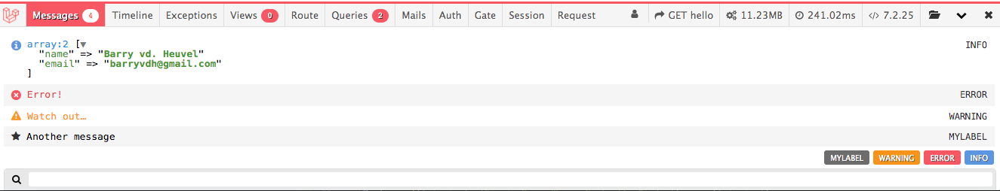
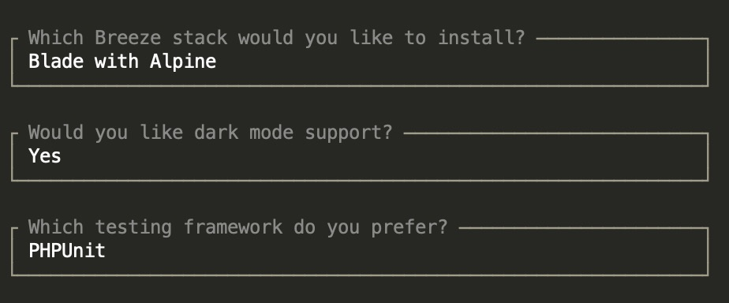
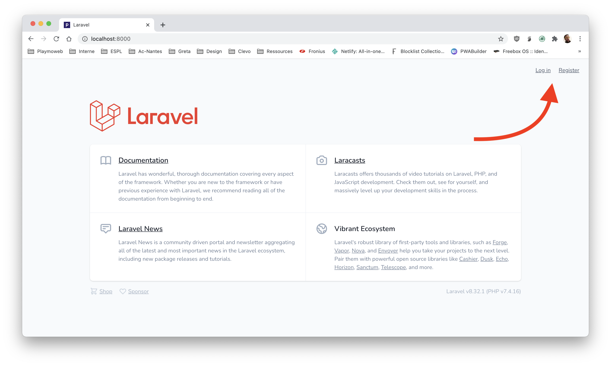
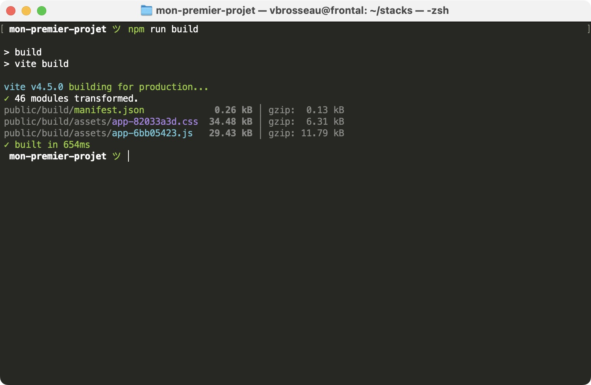
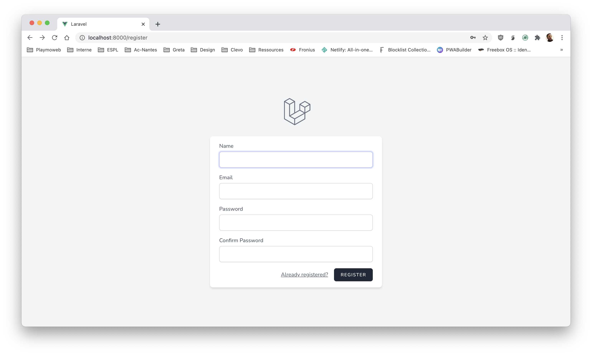
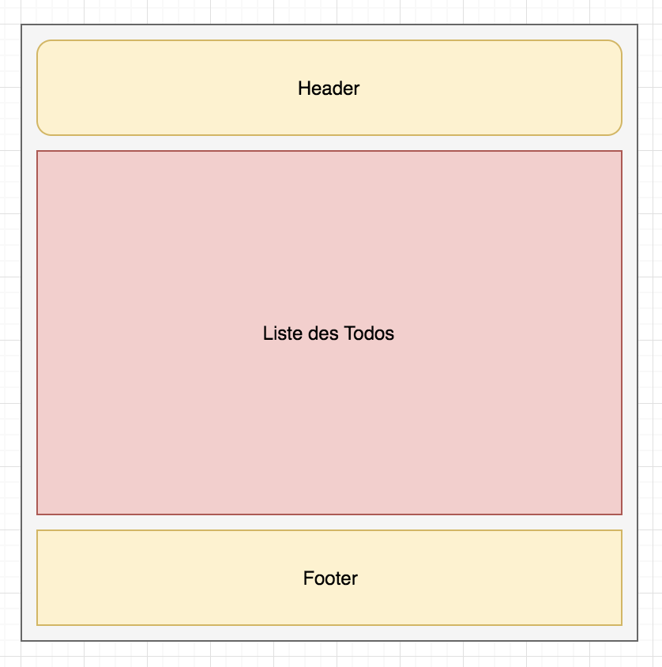
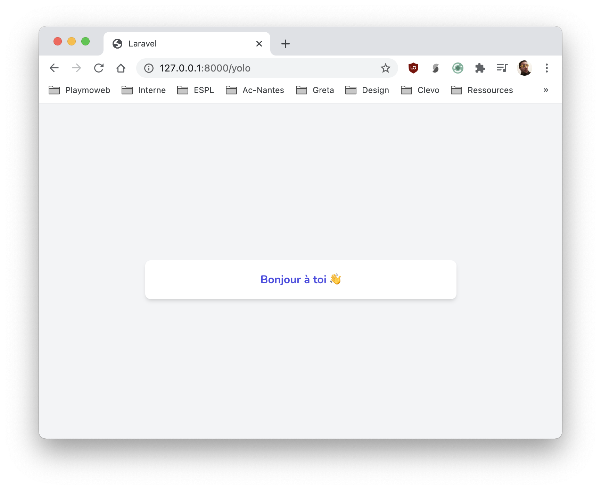
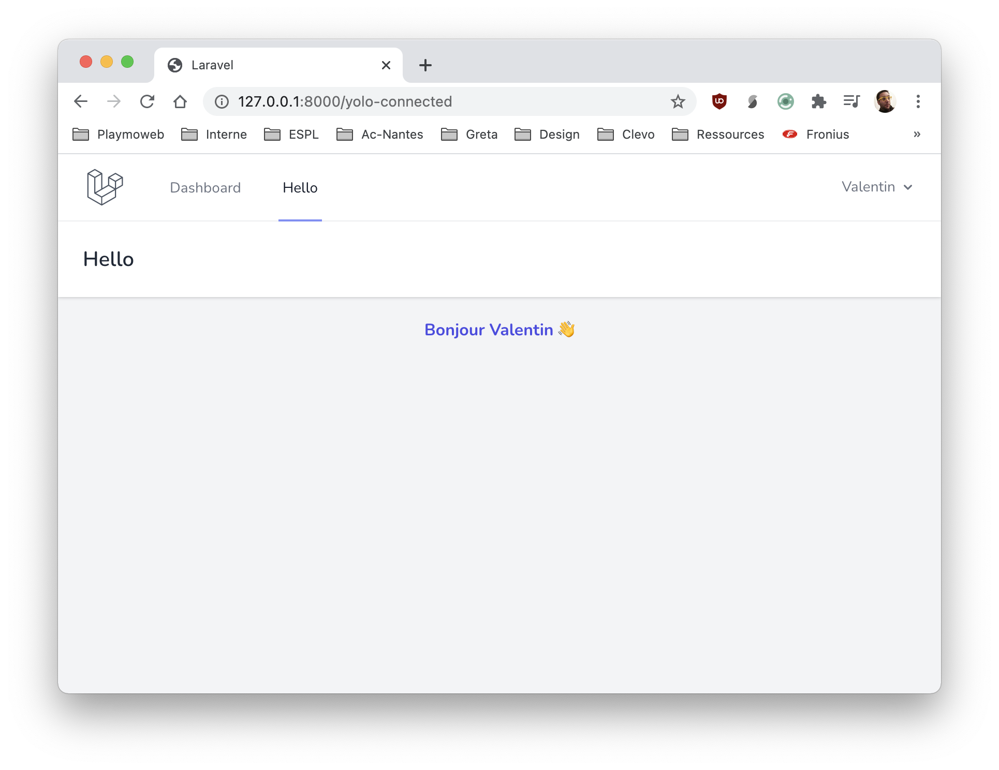

# Laravel & l'authentification

Nous avons vu dans [le TP introduction](./introduction.md) qu'il était très simple de créer un petit site avec Laravel. L'autre problème que Laravel résout « simplement » c'est la partie authentification.

La gestion des utilisateurs est en effet un élément complexe d'une application entre :

- L'authentification.
- Limiter l'accès à certaines ressources.
- La sécurité des mots de passe.
- La gestion du mot de passe oubliée.
- …

Vous l'avez compris, la liste est longue… Vous pouvez évidemment tout coder vous-même! Mais nous allons le voir la force de Laravel c'est également ça, intégrer l'ensemble des briques pour une application qualitative dans les standards du marché.

::: details Sommaire
[[toc]]
:::

## Créer votre projet

Pour cette étape, je vous laisse suivre le début du [précédent TP](./introduction.md).

**Attention** a bien installer au moins la version >=11 de Laravel.

## Installer la laravel debug bar

Vous avez remarqué que les pages d'erreurs de Laravel sont toujours pleines de bonnes informations. Avec Laravel nous pouvons avoir « encore mieux », vous avez à votre disposition une extension à Laravel qui vous permettra de voir :

- Le contenu de la session.
- Les requêtes SQL réalisé par l'ORM.
- …



Après installation cette barre va apparaître automatiquement en bas de votre site Laravel (évidemment uniquement le temps du développement). Pour l'installer la commande est la suivante :

```sh
composer require barryvdh/laravel-debugbar --dev
```

::: warning

La Debugbar sera automatiquement active quand APP_DEBUG est à `true`.

:::

[En savoir plus](https://github.com/barryvdh/laravel-debugbar)

## Ajout de l'authentification

Nous allons intégrer l'authentification en utilisant [Laravel Breeze](https://laravel.com/docs/10.x/starter-kits#laravel-breeze) ce paquet `Composer` va ajouter l'ensemble des :

- Routes
- Contrôleur
- Vue (templates blades)

Permettant de gérer simplement l'ensemble des problématiques.

::: warning Nous avons plusieurs choix

Laravel Breeze n'est pas la seule option, vous avez également : [Laravel Jetstream](https://jetstream.laravel.com/introduction.html) qui est plus complet, mais également plus complexe à mettre en place. Pour l'instant nous allons nous concentrer sur Breeze, mais vous pouvez regarder Jetstream si vous le souhaitez (je vous conseille cependant de débuter avec Breeze, Jetstream est réellement plus complexe à mettre en place).

:::

### Ajout de la dépendance

::: tip Un instant

**Attention** pour que breeze s'installe il vous faut NPM, vous devez avoir `NodeJS`. Si vous ne l'avez pas, vous pouvez le télécharger [ici](https://nodejs.org/).

:::

L'ajout de dépendances, pour cette étape aucun problème, il suffit d'ajouter dans votre projet « breeze » dans le dossier de votre projet :

```sh
composer require laravel/breeze --dev
```

Une fois ajoutée, nous allons devoir installer breeze pour que celui-ci active l'ensemble des fonctionnalités :

```sh
php artisan migrate

php artisan breeze:install

php artisan migrate
```

La commande `breeze:install` va vous poser quelques questions, voici les réponses que vous pouvez donner :



::: tip Vous avez vu ?

Nous venons d'ajouter de nouvelles routes, celles-ci sont dans le dossier `route/auth.php` **,mais ce n'est pas tout** vous avez également maintenant l'ensemble des contrôleurs, mais également l'ensemble des `Layout Blade` nécessaires à toute la partie authentification.

Pour le reste c'est dans les dossiers que vous connaissez déjà.
:::

Lors de cette phase d'installation, Breeze va rajouter un ensemble de dépendances JavaScript (Vite, Alpine, Tailwind). Ne vous inquiétez pas, tout est déjà configuré, vous n'avez rien à faire.

### L'UI

Si vous lancez dès maintenant votre projet via la commande `php artisan serve` vous allez voir que votre page d'accueil intègre maintenant deux nouveaux liens :



Vous pouvez cliquer dès à présent sur les différents liens, **cependant** les fichiers que vous avez ajoutés avec Breeze reposent sur un « framework UI » autre que Bootstrap celui-ci se nomme [Tailwind](https://tailwindcss.com/) l'approche de Laravel est moderne et Tailwind repose sur un concept similaire à Bootstrap, mais en ce focalisant plus sur un système de classes `css` que l'on va appeler « utilitaire ».

Nous allons donc avoir besoin de `node`, mais surtout de `npm` pour compiler l'ensemble des ressources nécessaires au bon fonctionnement de l'interface ajouté. Si vous avez déjà pratiqué `node` et `npm` vous savez peut-être que ces outils sont plus utilisés dans le monde du JavaScript que du PHP ; rien d'étonnant dans notre cas, nous allons utilisé `npm` pour ajouter l'ensemble des dépendances UI de notre projet, mais également les « compiler » / « packager » dans un gros fichier CSS et JS pour nos clients.

::: tip ✋ Un instant !

Notre projet va contenir seulement Tailwind après installation, si vous souhaitez avoir également Bootstrap vous avez deux options :

- Ajouter les librairies Bootstrap via le CDN de votre choix.
- Ajouter Bootstrap dans les dépendances npm de votre projet. (à faire via le `package.json` et `webpack.mix.js`, attention c'est plus complexe)

:::

Pour installer puis « compiler » vos ressources, il va falloir entrer les commandes suivantes dans le dossier de votre projet :

```sh
npm install

# Lancer la compilation des ressources
npm run build

# Ou si vous souhaitez que les ressources soient recompilées à chaque modification
npm run dev
```

Si vous lancez la commande `npm run build`, votre projet sera compilé une seule fois. C'est intéressant pour la mise en production, mais pas pour le développement. Si vous souhaitez que vos ressources soient recompilées à chaque modification, vous pouvez lancer la commande `npm run dev` en arrière-plan. Celle-ci va surveiller les modifications de vos fichiers et recompiler vos ressources à chaque modification.

Une fois le processus terminé, vous devriez avoir un résultat comme celui-ci :



Vos pages d'authentification sont maintenant fonctionnelles, votre site intègre maintenant toute la mécanique permettant de gérer cette problématique.

Exemple :



::: tip Petit point important
Laravel Breeze est intéressant, car il ne cache pas le code **l'ensemble des éléments sont accessibles** vous pouvez modifier le code fourni aucun problème ! C'est d'ailleurs ce que nous allons faire.
:::

::: danger npm run build ?

La commande `npm run build` va compiler vos ressources afin de le figer dans le temps après des modifications. Pendant la phase de développement vous serez amené à de plusieurs reprises à lancer cette commande pour mettre à jours vous ressources.

Si vous souhaitez le faire de manière « automatique », vous pouvez lancer en arrière-plan `npm run dev` (en local uniquement évidemment), afin de surveiller le code client (CSS, JS) pour mettre à jour vos ressources.

:::

### Tester le code

Vous avez normalement tout suivi, votre site est donc fonctionnel ! Avant d'aller plus loin, je vous laisse tester l'ensemble de votre site.

- Home.
- Création de comptes.
- Connexion.

::: tip Avant d'aller plus loin
Regarder également les templates, les règles de validation de saisie présente dans les contrôleurs, bref tout ce que vous avez pu installer de manière automatique !
:::

<div style="width:100%;height:0;padding-bottom:56%;position:relative;"><iframe src="https://giphy.com/embed/YWy93Zf9eW8RMlK0gK" width="100%" height="100%" style="position:absolute" frameBorder="0" class="giphy-embed" allowFullScreen></iframe></div>

## Les « Composants » et les templates blades

Si vous avez regardé l'ensemble du code, vous noterez une syntaxe un peu particulière dans les templates Blades ; celle-ci vous permet de créer des composants, mais également des templates de base (ce sont les `x-` quelque chose dans le code blade).

Tout est déjà configuré, vous pouvez dès à présent l'utiliser, mais également créer de nouveau composant en ajoutant les fichiers `blade` dans `views/components/`

[Pour plus d'information, rendez-vous ici](https://laravel.com/docs/8.x/blade#rendering-components)

::: tip Nous avons vu la dernière fois, l'héritage
Nous avions vu la dernière fois [l'héritage de template](https://laravel.com/docs/8.x/blade#layouts-using-template-inheritance) et bien la c'est là mêmes choses, mais via un système de « composant » très à la mode en ce moment.
:::

👋 Regardons ensemble comment ça fonctionne ! (vous pouvez m'appeler)

::: details Pour résumer
Le système de composant va vous permettre :

- De rendre générique un morceau de code que vous utilisez plusieurs fois dans votre projet.
- Penser composant plutôt que HTML copié depuis Internet.
- Rendre « générique les layouts » pour les partager entre les pages.
  :::

### Migrer la page « / » vers le nouveau système

Le nouveau système de template est très très sympa, il permet de découper son travail pour sortir les parties génériques dans un « layouts » partageables entre toutes vos pages. Par exemple :



::: tip Hey toi lecteur ! Stop !

L'organisation est tout aussi importante que le code, tu peux copier-coller du code entre tous les templates oui… Mais sache que c'est pas efficace, que tu perds du temps et que si on te demande une modification **tu perdras du temps** !

Prendre du temps pour utiliser le système de layout tels proposé par Laravel est un vrai gain de temps ! Le toi du futur te remercie d'avance.

Promis, ça va bien se passer !

:::

Avec le Scaffolding de Breeze nous avons à notre disposition **deux templates** :

- `app.blade.php` pour les clients **connectés**. Accessible dans votre template via `<x-app-layout>`
- `guest.blade.php` pour les clients **non connectés**. Accessible dans votre template via `<x-guest-layout>`

Nous allons donc migrer notre page d'accueil pour utiliser le nouveau système de composant. Pour ça rien de plus simple, il nous suffit d'utiliser `<x-guest-layout>` dans le template `welcome.blade.php`, je vous laisse le faire celui-ci va remplacer l'ensemble du code HTML de la page d'accueil.

::: tip Un instant 👋

Les composants sont une alternative à l'héritage des templates, ici nous allons réaliser l'équivalent du `@extends` du précédent TP. Je vous laisse choisir la version que vous préférez. Personnellement, j'aime bien l'approche composant bien plus moderne et lisible.

:::

Nous allons donc modifier `welcome.blade.php`, pour utiliser le composant `<x-guest-layout>` :

```html
<x-guest-layout>
    @if (Route::has('login'))
      <div class="fixed top-0 right-0 px-6 py-4 sm:block">
        @auth
          <a href="{{ url('/dashboard') }}" class="text-sm text-white underline">Dashboard</a>
        @else
          <a href="{{ route('login') }}" class="text-sm text-white underline">Log in</a>

          @if (Route::has('register'))
            <a href="{{ route('register') }}" class="ml-4 text-sm text-white underline">Register</a>
          @endif 
        @endauth
      </div>
    @endif

    Bienvenue sur mon site !
</x-guest-layout>
```

⚠️ Je vous laisse constater la différence.

::: danger À partir de maintenant
J'espère qu'à partir de maintenant, vous allez utiliser le système de template ! Je vous encourage vivement à le faire.
:::

### Fonctionnement des composants

Vous avez utilisé les composants, mais avez-vous compris le fonctionnement ? Un composant, c'est quelque chose de très simple. Il s'agit d'un morceau de vue réutilisable (un bouton, une card, etc.), il s'agit donc de « code HTML ». Si vous voulez une comparaison, nous pourrions comparer cela à une sorte de fonction. Prenons un exemple.

Si nous souhaitons faire une `Card`. Notre composant pourrait ressembler à :

```html
<div class="min-h-screen flex flex-col sm:justify-center items-center pt-6 sm:pt-0 bg-gray-100">
    <div class="w-full sm:max-w-md mt-6 px-6 py-4 bg-white shadow-md overflow-hidden sm:rounded-lg">
        {{ $slot }}
    </div>
</div>
```

Vous pouvez mettre ce code dans `resources/views/components/card.blade.php`

L'important dans le code ici est <span v-pre>`{{ $slot }}`</span>. `$slot` est une variable qui va contenir les éléments à l'intérieure de votre Card lors de son usage. Dans votre `welcome.blade.php`, vous pouvez utiliser votre composant comme ceci :

```html
<x-card>
  Ceci est une démo
</x-card>
```

Dans ce cas, la variable `$slot` contiendra… `Ceci est une démo`. Vous venez en quelque sorte de créer votre propre élément HTML réutilisable comme une `div` un `span` ou un `li`, mais ici cet élément est plus complet il peut contenir, du style, un comportement, des données par défaut.

Je vous laisse parcourir les composants déjà disponibles dans le dossier `components`.

## Protéger une page

Le but de l'authentification est donc de limiter l'accès à certaines pages vous l'avez bien compris… Sauf que pour l'instant nous n'avons pas encore vu comment le faire sur les pages que nous souhaitons protéger !

Nous allons créer un contrôleur fictif, celui-ci vous nous permettre de tester la protection.

```sh
php artisan make:controller YoloControler
```

Vous venez de créer un contrôleur vide. En reprenant si nécessaire les exemples du premier TP, je vous laisse créer dedans :

| Route             | Méthode         |
| :---------------- | :-------------- |
| `/yolo`           | `publicView()`  |
| `/yolo-connected` | `privateView()` |

### La partie publique

Pour la partie publique (non connecté), pas rapport à précédemment :

- Une méthode `publicView`, celle-ci doit retourner une `view` qui affichera pour l'instant `Bonjour non connecté`. Attention ! Cette vue doit utiliser le template `<x-guest-layout>`
- Ajouter cette route dans le fichier `routes/web.php`.

::: details Besoin d'aide ?

Avez-vous bien cherché ?

Je vous aide pour la partie route :

```php
Route::get('/yolo', ['App\Http\Controllers\YoloControler', 'publicView']);
```

Je vous aide pour la partie méthode :

```php
  return view("yolo.publicView");
```

:::

Nous avons le temps, n'hésitez pas à :

- Créer des composants si nécessaire.
- Utiliser les class de Tailwind (vous avez même de la complétion dans PhpStorm).

Pour ma part voilà mon rendu :



::: details Vous voulez-voir mon template ?

Est-ce vraiment une bonne idée ? Je vous encourage vraiment à faire le vôtre, d'autant plus que j'ai décidé de créer un composant nommé `card.blade.php` dans la partie composant. Mais voilà mon code :

_resources/views/yolo/publicView.blade.php:_

```html
<x-guest-layout>
  <x-card>
    <div class="text-center font-bold text-indigo-600">Bonjour Mr Anonyme 👋</div>
  </x-card>
</x-guest-layout>
```

:::

Je vous laisse coder **votre version**.

### La partie privée

Pour la partie privée, je vous laisse gérer l'ensemble de la base :

- Création de la méthode.
- Création du template. Attention cette fois-ci nous allons utiliser le composant `<x-app-layout>` qui contient toute la logique de la partie « information de connexion » (menu, etc.).

#### Le Layout

Pour le layout j'ai décidé de le nommer `privateView.blade.php` et de le mettre ici : `resources/views/yolo/privateView.blade.php`

```html
<x-app-layout>
  <x-slot name="header">
    <h2 class="font-semibold text-xl text-gray-800 leading-tight">Hello</h2>
  </x-slot>

  <div class="p-5">
    <div class="text-center font-bold text-indigo-600">
      Bonjour {{Auth::user()->name}} 👋
    </div>
  </div>
</x-app-layout>
```

### Le contrôleur

Pour le contrôleur, je vous laisse ajouter la méthode `privateView` comme demandé dans le tableau plus haut :

::: details Dans mon cas ça donne

```php
public function privateView(){
    return view("yolo.privateView");
}
```

:::

### La route

C'est la partie qui nous intéresse… Vous avez remarqué que dans les lignes précédentes, nous n'avons jamais parlé de l'authentification. Comment alors est-ce possible que la page ne soit accessible qu'aux gens connectés ?

Et bien … C'est simple ! Quand vous avez installé `breeze` vous avez également ajouté des `Middleware`, un middleware est un morceau de code qui va intercepter la demande initiale pour faire des contrôles supplémentaires. Dans notre cas le contrôle en plus va être « Est-ce que l'utilisateur est connecté » :


Nous allons donc ajouter dans le fichier `routes/web.php`

```php
Route::get('/yolo-connected', ['App\Http\Controllers\YoloControler', 'privateView'])->middleware(['auth'])->name("yoloPrivate");
```

Ici la protection est ajoutée grâce à la méthode `middleware(['auth'])`. Elle va permettre de ne laisser passer que les utilisateurs connectés.

::: tip Middleware

Pour rappel, le middleware `auth` est celui qui va vérifier si l'utilisateur est connecté ou non. Si ce n'est pas le cas, il va rediriger l'utilisateur vers la page de connexion.

Un Middleware est un morceau de code qui va être exécuté avant le contrôleur. Il peut être utilisé pour faire des contrôles supplémentaires, ou pour modifier la demande initiale.

:::

Voilà le résultat pour moi



⚠️ Je vous laisse implémenter la partie privée dans votre code. ⚠️

::: danger Un instant !

Vous noterez que dans ma version j'ai un menu avec un lien vers ma page… Pas de magie ! J'ai ajouté le code nécessaire dans le fichier `resources/views/layouts/navigation.blade.php`

Dans la partie « Navigation Link » :


:::

## Conclusion

Nous avons fait le tour de la base de ce qu'il faut savoir. Cependant le TP continue sur deux éléments qui peuvent être intéressants pour vous à la suite de cette conclusion.

::: tip Le code entier, mais uniquement si vous le demandez
Vous souhaitez voir mon code ? [J'ai un repository privé si nécessaire](https://github.com/c4software/laravel-auth-student)
:::

## Modifier les informations demandées

En reprenant ce que nous avons fait précédemment, je vous laisse modifier la structure de la base de données pour ajouter dans la table `users` un nouveau champ nommé par exemple `pseudo`.

- Ajouter la colonne en base
- Modifier le formulaire de création de comptes `resources/views/auth/register.blade.php` pour ajouter le champ dans le formulaire.
- Modifier le modèle `app/Models/User.php` pour ajouter dans les `$fillable` le nouveau champ.
- Modifier le contrôleur pour sauvegarder la nouvelle valeur. (méthode `store` dans `app/Http/Controllers/Auth/RegisteredUserController.php`)

Vous souhaitez le faire avec une migration ?

```sh
php artisan make:migration add_pseudo_to_users_table --table=users
```

Puis dans votre migration :

```php
public function up(): void
{
    Schema::table('users', function (Blueprint $table) {
        $table->string('pseudo');
    });
}
```

## Accéder aux informations du connecté

Nous l'avons fait dans notre exemple de contrôleur, mais, si vous ne l'aviez pas compris :

```html
{{Auth::user()->name}}
```

## Créer plusieurs enregistrements en base de données

Le but de Breeze est de vous permettre de modifier le code « préfourni » c'est ce que l'on appelle du Scaffolding, nous allons donc en profiter pour modifier son comportement afin de créer lors de l'ajout d'utilisateur une autre entrée en base de données, par exemple une `personne`.

- Créer la migration ainsi que le modèle. `php artisan make:model Personne --migration`
- Renseigner les champs dans votre migration **,mais également** dans le modèle. Exemple de migration :

```php
Schema::create('personnes', function (Blueprint $table) {
    $table->id();
    $table->string('ville');
    $table->date('dateNaissance');
    $table->string('genre');
    $table->foreignId('userId')->constrained('users');
    $table->timestamps();
});
```

- Lancer la migration `php artisan migrate`
- Modifier le code de la méthode `store` dans le contrôleur `app/Http/Controllers/Auth/RegisteredUserController.php` pour ajouter également un utilisateur :

Exemple dans mon cas :

```php
Personne::create([
    'ville' => $request->ville,
    'dateNaissance' => $request->dateNaissance,
    'genre' => $request->genre,
    'userId' => $user->id
])
```

Et voilà nous avons maintenant une méthode de « Création d'un utilisateur » qui ajoute également une personne.

::: tip C'est bien évidement un exemple
Je vous laisse l'implémenter… Cependant vous comprenez bien que c'est évidemment un exemple !
:::

::: danger N'oubliez pas la validation

Les données que vous récupérez dans le formulaire doivent être validées. Laravel propose un système de validation très complet. Je vous laisse regarder la documentation pour en savoir plus.

[https://laravel.com/docs/11.x/validation#available-validation-rules](https://laravel.com/docs/11.x/validation#available-validation-rules)

:::

Je vous laisse implémenter la modification dans votre code.

::: details Votre table existe ? Vous souhaitez la modifier ?

```php
php artisan make:migration add_ville_dateNaissance_genre_to_personnes_table --table=personnes
```

```php
public function up(): void
{
    Schema::table('personnes', function (Blueprint $table) {
        $table->string('ville');
        $table->date('dateNaissance');
        $table->string('genre');
    });
}
```

```sh
php artisan migrate
```

:::

## Afficher les informations de l'utilisateur

Maintenant que nous avons créé une personne lors de la création d'un utilisateur, nous allons afficher ces données dans la page d'accueil après la connexion.

- Modifier la vue `resources/views/dashboard.blade.php` pour afficher les informations de la personne connectée.
- Modifier le contrôleur `app/Http/Controllers/DashboardController.php` pour récupérer les informations de la personne connectée.

::: tip Vous avez besoin d'aide ?

Je vous aide pour le contrôleur :

```php
public function index()
{
    /**
     * Ici je récupère la personne connectée,
     * mais le mieux serait de faire une relation dans le modèle User du type :
     * public function personne(){
     *    return $this->hasOne(Personne::class, 'userId', 'id');
     * }
     * 
     * ET de récupérer la personne via :
     * 
     * $personne = Auth::user()->personne;
     */
    $personne = Personne::where('userId', Auth::user()->id)->first();
    return view('dashboard', ['personne' => $personne]);
}
```

:::

C'est à vous de jouer pour la vue !

## Utiliser le système de mapping des paramètres de route

En cours nous avons vu qu'il était possible de passer des paramètres dans des routes. Pour l'instant vous vous êtes contenté de récupérer des paramètres simple `id`, `slug`, etc. Mais il est possible de faire plus complexe.

- Créer une nouvelle route `/personne/{personne}` qui va afficher les informations de la personne.
- Créer une méthode dans le contrôleur `PersonneController` qui va récupérer les informations de la personne.
- Créer une vue `resources/views/personne.blade.php` qui va afficher les informations de la personne.

::: tip C'est à vous de jouer !

Je vous laisse créer le structure de cette demande.

:::

### Vous avez la base

Comment gagner du temps ? Et bien, c'est simple ! En utilisant le système de récupération automatique des objets de la base de données. Pour cela, il vous suffit de modifier le contrôleur `PersonneController` pour qu'il récupère directement l'objet `Personne` :

```php
public function show(Personne $personne)
{
    return view('personne', ['personne' => $personne]);
}
```

Et voilà, Laravel va automatiquement récupérer l'objet `Personne` correspondant à l'`id` passé dans la route. C'est magique ! C'est automatique ! Et c'est très pratique !

## Création d'une table pivot pour les rôles

Dans cette partie, nous allons voir comment créer une table pivot pour gérer les rôles des utilisateurs. Pour cela, nous allons créer une table `roles` qui va contenir les différents rôles disponibles, et une table `role_user` qui va faire le lien entre les utilisateurs et les rôles.

### Créer la table `roles`

Pour commencer, nous allons créer la table `roles` qui va contenir les différents rôles disponibles. Pour cela, nous allons créer une migration :

```sh
php artisan make:migration create_roles_table
```

Dans la migration, nous allons ajouter les champs suivants :

- `id` : l'identifiant du rôle.
- `name` : le nom du rôle.

Exemple de migration :

```php
Schema::create('roles', function (Blueprint $table) {
    $table->id();
    $table->string('name');
    $table->timestamps();
});
```

### Créer la table `role_user`

Ensuite, nous allons créer la table `role_user` qui va faire le lien entre les utilisateurs et les rôles. Pour cela, nous allons créer une migration :

```sh
php artisan make:migration create_role_user_table
```

Dans la migration, nous allons ajouter les champs suivants :

- `id` : l'identifiant de la relation.
- `user_id` : l'identifiant de l'utilisateur.
- `role_id` : l'identifiant du rôle.

Exemple de migration :

```php
Schema::create('role_user', function (Blueprint $table) {
    $table->id();
    $table->foreignId('user_id')->constrained();
    $table->foreignId('role_id')->constrained();
    $table->timestamps();
});
```

### Créer les modèles

Ensuite, nous allons créer les modèles `Role` et `RoleUser` pour gérer les rôles. Pour cela, nous allons créer les fichiers `Role.php` et `RoleUser.php` dans le dossier `app/Models` :

```sh
php artisan make:model Role
php artisan make:model RoleUser
```

Dans le modèle `Role`, nous allons ajouter la relation `belongsToMany` avec le modèle `User` :

```php
class Role extends Model
{
    public function users()
    {
        return $this->belongsToMany(User::class);
    }
}
```

Dans le modèle `RoleUser`, nous allons ajouter la relation `belongsTo` avec les modèles `User` et `Role` :

```php
class RoleUser extends Model
{
    public function user()
    {
        return $this->belongsTo(User::class);
    }

    public function role()
    {
        return $this->belongsTo(Role::class);
    }
}
```

Et dans le modèle `User`, nous allons ajouter la relation `belongsToMany` avec le modèle `Role` :

```php
    public function roles()
    {
        return $this->belongsToMany(Role::class);
    }
```

### Créer les roles en base de données

Pour créer les rôles en base de données, nous allons ajouter les rôles dans la méthode `run` du seeder `DatabaseSeeder` :

```php
public function run()
{
    // À la fin de la méthode run
    // Création des rôles par défaut de l'application
    Role::factory()->create(['name' => 'admin']);
    Role::factory()->create(['name' => 'user']);
}
```

Ensuite, nous allons exécuter le seeder pour ajouter les rôles en base de données :

```sh
php artisan db:seed
```

### Affecter un rôle à un utilisateur lors de la création

Dans la méthode `store` du contrôleur `RegisteredUserController`, nous allons ajouter le code nécessaire pour affecter un rôle à un utilisateur lors de la création :

```php
// Après la création de l'utilisateur (role user)
$user->attach(2);
```

La méthode `attach` permet d'ajouter un rôle à un utilisateur. Elle prend en paramètre l'identifiant du rôle à ajouter. Elle va ajouter une entrée dans la table `role_user` pour faire le lien entre l'utilisateur et le rôle.

::: tip Code magique ?

Vous avez vu le code magique ? Vous avez vu comment Laravel simplifie la gestion des relations entre les tables ? C'est ça la magie de Laravel ! C'est ça la puissance de l'ORM Eloquent !

:::

### Afficher les rôles de l'utilisateur

Pour tester, ajouter une page `/roles` qui va afficher les rôles de l'utilisateur connecté. Pour cela, vous pouvez ajouter une méthode `roles` dans le contrôleur `DashboardController` :

```php
public function roles()
{
    $roles = Auth::user()->roles;
    return view('roles', ['roles' => $roles]);
}
```

Je vous laisse écrire la vue `roles.blade.php` pour afficher les rôles de l'utilisateur. Cette page doit être disponible uniquement pour les utilisateurs connectés et visible dans le menu du dashboard.

### Super bouton

Dans le but de tester notre système de rôles, nous allons ajouter un super bouton dans le dashboard qui va permettre à l'utilisateur de changer de rôle. Pour cela, nous allons ajouter une méthode `glowUpAsAdmin` dans le contrôleur `DashboardController`, elle aura pour objectif de remplacer le rôle de l'utilisateur par le rôle d'administrateur.

```php
public function glowUpAsAdmin()
{
    $user = Auth::user();
    $user->roles()->sync([1]);
    return redirect()->route('dashboard');
}
```

::: tip Pourquoi sync ?

`sync` est une méthode qui va synchroniser les rôles de l'utilisateur avec les rôles passés en paramètre. Cela signifie que les rôles de l'utilisateur seront remplacés par les rôles passés en paramètre.

:::

## Ajouter un système de chat

Pour conclure ce TP, je vais vous demander d'ajouter un système de chat à votre application. Ce chat doit être accessible uniquement aux utilisateurs connectés.

Voici les fonctionnalités que vous devez implémenter :

- Un utilisateur connecté doit pouvoir envoyer un message à tous les autres utilisateurs connectés.
- Les messages seront disponible dans une page `/chat`, celle-ci doit être accessible depuis le dashboard de l'utilisateur. Elle doit s'intégrer visuellement à votre application (menu, etc.).
- Les messages doivent être stockés en base de données (vous pouvez utiliser une table `messages`).
- Les messages doivent être affichés en temps réel.
- Les messages doivent être affichés dans l'ordre chronologique.
- Les messages doivent contenir le nom de l'utilisateur qui l'a envoyé, la date et l'heure d'envoi, et le contenu du message.
- Les utilisateurs avec le rôle d'administrateur doivent pouvoir supprimer les messages.

::: tip Rôle d'administrateur ?

Pour vérifier si un utilisateur a le rôle d'administrateur, vous pouvez utiliser la méthode `roles` du modèle `User` :

```php
if (Auth::user()->roles->contains('name', 'admin')) {
    // L'utilisateur a le rôle d'administrateur
}
```

:::

### Faire évoluer le code pour utiliser de l'Ajax

::: danger Un instant !

Avant d'attaquer cette partie, nous allons réaliser ce mini TP [ici](../javascript/tp4.md) pour comprendre comment fonctionne l'Ajax.

:::

Votre chat fonctionne, mais il ne se met pas à jour automatiquement. Pour cela, vous allez devoir utiliser de l'Ajax pour récupérer les messages en temps réel. Pour cela nous allons devoir découper notre code en plusieurs parties :

- Vous devez créer une page `/getMessages` qui va retourner la liste des messages en HTML. Cette page sera utilisée pour afficher les messages en temps réel.
- Vous devez modifier la page `/chat` pour afficher les messages en temps réel. Vous pouvez utiliser du JavaScript

#### Pour le JavaScript

En général, pour récupérer des messages, on utilise une API Rest qui retourne du JSON. Ici, nous allons faire autrement, nous allons retourner du HTML directement. C'est une approche très « Web centric » qui permet de simplifier le code JavaScript.

Votre page `/getMessages` doit retourner un code HTML qui contient les messages (le code HTML doit être le même que celui que vous utilisez pour afficher les messages dans la page `/chat` évidemment) :

Exemple de code HTML pour la récupération des messages :

```html
<!-- Message 1 -->
<div class="message">
    <div class="user">Valentin</div>
    <div class="content">Bonjour tout le monde !</div>
</div>

<!-- Message 2 -->
<div class="message">
    <div class="user">Valentin</div>
    <div class="content">Ceci est un test</div>
</div>

<!-- etc. -->
```

Grace à l'Ajax, nous allons pouvoir récupérer ce code HTML et l'ajouter à notre page `/chat` pour afficher les messages périodiquement dans notre chat. Par exemple, toutes les 15 secondes.

Voici un exemple de code JavaScript pour récupérer les messages :

```javascript
function getMessages() {
    fetch('/getMessages')
        .then(response => response.text())
        .then(html => {
            document.getElementById('messages').innerHTML = html;
        });
}

setInterval(() => {
    getMessages();    
}, 15000);

document.addEventListener('DOMContentLoaded', function() {
    getMessages();
});
```

Quelques explications :

- `setInterval` permet d'exécuter une fonction toutes les 15 secondes.
- `fetch` permet de faire une requête HTTP pour récupérer les messages.
- `response.text()` permet de récupérer le contenu de la réponse en tant que texte.
- `document.getElementById('messages').innerHTML = html;` permet d'ajouter le code HTML des messages à la page. Ici, `messages` est l'identifiant de la balise HTML qui contiendra les messages.
- `document.addEventListener('DOMContentLoaded', function() { getMessages(); });` permet de récupérer les messages une première fois lorsque la page est chargée.

Extrait du template `chat.blade.php` :

```html
<div id="messages">
  Chargement des messages...
  <!-- Les messages vont remplacer ce texte automatiquement -->
</div>
```

Les messages seront affichés dans la balise `div` avec l'identifiant `messages`.

#### L'Approche HTMX ?

HTMX est une librairie JavaScript qui permet de faire des requêtes HTTP pour récupérer du HTML et l'ajouter à la page. C'est une approche très simple et très efficace pour faire des applications Web modernes.

Pour les curieux, je vous invite à consulter le site officiel de [HTMX](https://htmx.org/). Ou mon TP sur le sujet [ici](../htmx/tp1.md)

Pour utiliser HTMX dans votre projet, vous pouvez ajouter la librairie via un CDN :

```html
<script src="https://unpkg.com/htmx.org@1.9.10"></script>
<script>
    // Permet d'ajouter le token CSRF à chaque requête AJAX,
    // pour éviter les erreurs 419, spécifiques à Laravel.
    document.addEventListener('DOMContentLoaded', function () {
        document.body.addEventListener('htmx:configRequest', (event) => {
            event.detail.headers['X-CSRF-Token'] = '{{ csrf_token() }}';
        })
    });
</script>
<style>
    div.htmx-swapping div {
        opacity: 0;
        transition: opacity 1s ease-out;
    }
</style>
```

Puis, vous pouvez utiliser HTMX pour récupérer les messages :

```html
<div id="messages" hx-get="/getMessages">
  Chargement des messages...
  <!-- Les messages vont remplacer ce texte automatiquement -->
</div>
```

Avec HTMX, vous n'avez pas besoin de JavaScript pour récupérer les messages. HTMX va s'occuper de tout pour vous.

::: tip C'est magique !

HTMX est très intéressant pour faire des sites web ! Elle utilise une approche différente de VueJS ou React, mais elle est également très intéressante. Je vous encourage à l'essayer pour voir si elle correspond à vos besoins.

:::

#### Bonus : Et si vous faisiez l'ajout en Ajax ?

Pour aller plus loin, vous pouvez également ajouter un formulaire pour envoyer des messages en Ajax. Pour cela, vous pouvez utiliser HTMX pour envoyer le formulaire en Ajax.

Voici un exemple de formulaire qui envoie un message en Ajax :

```html
<form hx-post="/sendMessage" hx-target="#messages" hx-swap="outerHTML">
    <input type="text" name="message" placeholder="Votre message">
    <button type="submit">Envoyer</button>
</form>
```

Ce formulaire va envoyer le message en Ajax à la route `/sendMessage` et remplacer le contenu de la balise `div` avec l'identifiant `messages` par le contenu de la réponse (qui doit être si vous avez bien suivi du code HTML, et si vous avez bien suivi le TP, la liste des messages).

::: tip C'est à vous de jouer !

Ici, l'idée c'est de vous laisser faire. Vous avez toutes les informations nécessaires pour ajouter un chat à votre application. C'est à vous de jouer !

:::