# Introduction base de données et ORM avec Laravel


::: details Sommaire
[[toc]]
:::

Dans le [TP d'introduction](./introduction.md) nous avons découvert les bases de Laravel : les routes, les vues (Blade), les contrôleurs et les messages flash. Notre site fonctionne… mais il ne retient rien ! Dès que nous rechargeons la page, tout est perdu.

Dans ce TP nous allons découvrir la partie base de données de Laravel pour construire une **TODO List persistante** : les tâches seront sauvegardées en base de données et retrouvées à chaque visite.

::: danger TP découverte

Nous sommes toujours dans la découverte de Laravel, ce TP est donc **très guidé**.

Je vous laisse faire très attention à chaque étape, et surtout à bien comprendre le fonctionnement des éléments évoqués.

👋 Si vous avez des questions, n'hésitez pas.

:::

## Les slides

Avant de commencer, voici une présentation rapide de la partie théorie de notre TP du jour : l'ORM, les migrations et Eloquent.

<ClientOnly>
<SlidesDeck src="laravel_bdd" />
</ClientOnly>

Dans ce TP, je vous invite à avoir en parallèle :

- [L'aide mémoire Laravel](/cheatsheets/laravel/)
- [La synthèse des commandes](/cheatsheets/laravel/quick.md)

## Prérequis

Nous allons continuer sur le projet créé lors du [TP d'introduction](./introduction.md). Ouvrez le dossier de votre projet et vérifiez qu'il se lance toujours :

```sh
php artisan serve
```

::: details Vous n'avez pas le projet du TP précédent ?

Pas de panique, vous pouvez repartir de zéro :

```sh
composer create-project --prefer-dist laravel/laravel mon-premier-projet
```

Il vous faudra également recréer un layout de base `resources/views/layouts/base.blade.php` (voir [le TP d'introduction](./introduction.md#creer-le-layout)), c'est lui que nous utiliserons pour nos vues.

Si vous récupérez votre projet depuis GIT, n'oubliez pas de réinstaller les dépendances avec `composer install`.

:::

## Objectifs

À la fin de ce TP vous saurez :

- Créer un **modèle** et sa **migration** avec `artisan`.
- Créer / mettre à jour la structure de votre base de données avec `php artisan migrate`.
- Interroger votre base de données avec **Eloquent** (l'ORM de Laravel) : lister, créer, modifier, supprimer.
- Construire une application complète : la TODO List (lister, ajouter, terminer, supprimer une tâche).
- Faire évoluer une base existante et lier deux tables avec une **relation** Eloquent (`belongsTo` / `hasMany`).
- Créer un **Middleware** pour filtrer les requêtes.

## Pourquoi un ORM ?

Jusqu'à maintenant (en PHP pur), pour manipuler une base de données vous deviez :

- Écrire les requêtes SQL à la main (`SELECT`, `INSERT`, `UPDATE`, `DELETE`).
- Gérer la connexion (PDO), les erreurs, les injections SQL…
- Transformer les résultats en tableaux ou en objets.

Avec Laravel, nous allons utiliser **Eloquent**, l'ORM (Object-Relational Mapping) intégré. L'idée est simple : chaque table de votre base de données est représentée par une **classe PHP** (un modèle), et chaque ligne par un **objet**.

Le flux complet dans notre application sera donc :

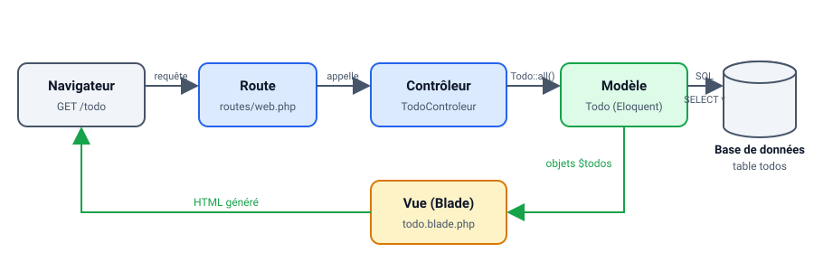

Le contrôleur ne parle jamais SQL : il demande au modèle, qui s'en charge, puis transmet les objets obtenus à la vue.

L'avantage d'un framework, c'est qu'il intègre déjà toute la partie base de données. Dans un développement classique, tout serait à « ré-inventer » ; ici le framework nous donne une structure et un cadre pour aller plus vite.

## Créer la table et son modèle

Dans les versions précédentes de Laravel la base de données était préconfigurée pour utiliser MySQL. Depuis Laravel en version 11, la base de données par défaut est SQLite, **évidemment** vous pouvez changer cette configuration dans le fichier `.env`, mais pour l'instant nous allons rester sur SQLite.

::: tip SQLite ?

SQLite est un système de gestion de base de données relationnelle, il est très simple à mettre en place et ne nécessite pas de configuration particulière. C'est donc parfait pour un TP.

Pour entrer un peu plus dans le détail, SQLite est un système de base de données (comme MySQL) mais qui ne nécessite pas de serveur. Les données sont stockées dans un fichier `.sqlite` (ou `.db`). Ce genre de base de données est très utilisée pour les applications mobiles par exemple.

C'est un excellent moyen également de prototyper très rapidement une idée sans même avoir besoin de serveur distant.

:::

Questions :

- Ouvrez votre fichier `.env`, quelle ligne concerne la base de données ?
- À votre avis, où se trouve le fichier SQLite dans votre projet ?

Comme pour la création d'un contrôleur, la première étape va passer par de la ligne de commande.

```sh
php artisan make:model Todo --migration
```

Cette commande va créer « la définition du modèle » (le modèle, c'est-à-dire la représentation objet de notre table), mais également la migration. La migration est le fichier qui va définir la structure de notre `Table`. Vous avez maintenant, dans votre projet, deux nouveaux fichiers :

- `app/Models/Todo.php`
- `database/migrations/YEAR_MONTH_DAY_TIME_create_todos_table.php`

::: tip Pourquoi `todos` au pluriel ?

Vous avez demandé un modèle `Todo`, et Laravel a nommé la table `todos`… C'est une **convention** : le modèle est au singulier, la table au pluriel. En respectant cette convention, Laravel fait le lien automatiquement entre les deux, sans aucune configuration.

:::

Pour bien visualiser le rôle de chacun de ces deux fichiers :

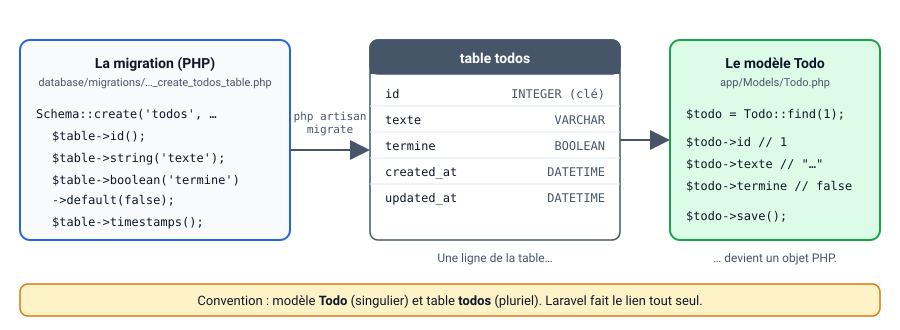

La **migration** décrit la structure (elle crée la table), le **modèle** permet de manipuler son contenu (chaque ligne devient un objet `Todo`).

### Définir la migration (structure de la table)

Le fichier de migration définit la structure de la table que vous allez créer, actuellement vous avez un « format type », votre table va contenir de base quelques colonnes (id, et dates). Nous allons ajouter dans la méthode `up()` nos colonnes :

```php
$table->string('texte');
$table->boolean('termine')->default(false);
```

Je vous laisse l'ajouter avec les autres colonnes.

::: details Vous avez un doute sur comment faire ? (je vous invite vraiment à le faire sans regarder la solution)

```php
<?php

use Illuminate\Database\Migrations\Migration;
use Illuminate\Database\Schema\Blueprint;
use Illuminate\Support\Facades\Schema;

return new class extends Migration
{
    /**
     * Run the migrations.
     */
    public function up(): void
    {
        Schema::create('todos', function (Blueprint $table) {
            $table->id();
            $table->string('texte');
            $table->boolean('termine')->default(false);
            $table->timestamps();
        });
    }

    /**
     * Reverse the migrations.
     */
    public function down(): void
    {
        Schema::dropIfExists('todos');
    }
};
```

:::

Questions :

- À votre avis, à quoi sert la méthode `down()` ?
- Pourquoi versionner la structure de la base de données dans des fichiers PHP plutôt que de créer les tables « à la main » (via PhpMyAdmin par exemple) ? Pensez au travail en équipe…

### Définition du modèle

Vous vous en doutez, si nous avons ajouté un champ dans notre « migration » / « table », nous allons devoir l'ajouter également dans notre modèle ! Pour ça je vous laisse éditer le fichier `app/Models/Todo.php` pour y ajouter :

```php
    protected $fillable = ['texte', 'termine'];
```

Avec cet ajout, nous indiquons à Laravel que les champs `texte` et `termine` pourront être assignés automatiquement lors de la création d'une entrée en base de données.

::: tip optionnel, mais intéressant !
Cette propriété n'est pas obligatoire dans tous les cas, mais elle devient indispensable dès que vous utilisez `Todo::create([...])` (le « mass-assignment », c'est-à-dire créer un objet depuis un tableau, par exemple les données d'un formulaire). Sans elle, Laravel refuse l'affectation en masse.
:::

### Créer réellement vos tables

Maintenant que le script est terminé, nous allons indiquer à Laravel d'effectuer « la migration » c'est-à-dire de transformer votre définition PHP en instruction SQL pour créer réellement la base de données.

Retour dans la ligne de commande :

```sh
php artisan migrate

   INFO  Running migrations.

  YEAR_MONTH_DAY_TIME_create_todos_table .......... 1.50ms DONE
```

::: warning Un instant
Avec SQLite il n'y a rien à configurer, Laravel a même créé le fichier `database/database.sqlite` pour vous si celui-ci n'existait pas. Si vous décidez plus tard d'utiliser MySQL, c'est dans le `.env` que ça se passera.
:::

Question :

- Que se passe-t-il si vous relancez une seconde fois `php artisan migrate` ? Testez, et expliquez le résultat.

### Vérifier le contenu de votre base

Votre table est créée, mais rien ne vaut une vérification visuelle. Le fichier `database/database.sqlite` contient votre base de données, vous pouvez l'ouvrir avec :

- [DB Browser for SQLite](https://sqlitebrowser.org/) (logiciel gratuit multiplateforme).
- L'extension VSCode [SQLite Viewer](https://marketplace.visualstudio.com/items?itemName=qwtel.sqlite-viewer).
- La vue « Database » de PHPStorm.

Je vous laisse ouvrir le fichier et vérifier que la table `todos` est bien présente avec les bonnes colonnes.

::: tip Gardez cet outil sous la main
Tout au long du TP, vous pourrez vérifier que vos actions (ajout, modification, suppression) ont bien un impact en base de données. C'est un excellent réflexe de développeur.
:::

## Requêter votre table

Pour vous montrer la simplicité d'Eloquent, voici les appels de méthodes les plus courants (nous les avons vus ensemble lors du cours).

::: danger Ce ne sont que des exemples

Cette section est un **catalogue** : lisez-le, comprenez-le, mais ne recopiez rien pour l'instant. Vous les utiliserez un peu plus loin, quand vous écrirez le contrôleur de la TODO List.

Vous n'avez ici qu'une petite liste de ce qu'il est possible de faire. Pour voir l'ensemble, je vous suggère [la documentation officielle](https://laravel.com/docs/eloquent).

:::

### Voici quelques exemples

Dans tous les exemples ci-dessous, `Todo` est votre modèle, c'est-à-dire la classe `app/Models/Todo.php` créée tout à l'heure. Chaque appel est transformé par Eloquent en une requête SQL, vous n'en écrivez aucune.

**Lire**

```php
// Toutes les lignes de la table `todos`
$todos = Todo::all();

// Une seule ligne, à partir de son id
$todo = Todo::find(1);

// Avec un filtre, un tri et une limite : les 10 premières TODO non terminées
$todos = Todo::where('termine', false)->orderBy('id')->take(10)->get();
```

**Créer**

```php
// Façon 1 : créer et enregistrer en une seule ligne (possible grâce au $fillable du modèle)
Todo::create(['texte' => 'Réviser le TP Laravel']);

// Façon 2 : construire l'objet, puis l'enregistrer
$todo = new Todo();
$todo->texte = 'Réviser le TP Laravel';
$todo->save();
```

**Modifier**

```php
$todo = Todo::find(1);  // Retrouver la ligne
$todo->termine = true;  // Modifier l'objet
$todo->save();          // Enregistrer (Eloquent génère un UPDATE)
```

**Supprimer**

```php
$todo = Todo::find(1);
$todo->delete();
```

Questions :

- À votre avis, quelle requête SQL est générée par `Todo::all()` ? Par `Todo::find(1)` ? Et par la version avec filtre ?
- Pourquoi `Todo::create([...])` fonctionne-t-il avec un simple tableau ? Relisez la section « Définition du modèle ».

### Testez-les avec Tinker

Pas besoin d'écrire un contrôleur pour essayer ces exemples : Laravel fournit **Tinker**, une console interactive dans laquelle vous pouvez taper du PHP et manipuler vos modèles directement. Lancez-la dans un second terminal (le premier fait tourner `php artisan serve`) :

```sh
php artisan tinker
```

Puis, ligne par ligne, créez une TODO, listez-les, modifiez-en une et supprimez-la :

```php
> use App\Models\Todo;

> Todo::create(['texte' => 'Réviser le TP Laravel']);
= App\Models\Todo {#7900
    texte: "Réviser le TP Laravel",
    updated_at: "2026-09-16 18:38:27",
    created_at: "2026-09-16 18:38:27",
    id: 1,
  }

> Todo::all();
= Illuminate\Database\Eloquent\Collection {#7457
    all: [
      App\Models\Todo {#7456
        id: 1,
        texte: "Réviser le TP Laravel",
        termine: 0,
        created_at: "2026-09-16 18:38:27",
        updated_at: "2026-09-16 18:38:27",
      },
    ],
  }

> $todo = Todo::find(1);
= App\Models\Todo {#7417
    id: 1,
    texte: "Réviser le TP Laravel",
    termine: 0,
    created_at: "2026-09-16 18:38:27",
    updated_at: "2026-09-16 18:38:27",
  }

> $todo->termine = true;
= true

> $todo->save();
= true

> $todo->delete();
= true
```

Commencez bien par la ligne `use App\Models\Todo;`. Tinker sait parfois retrouver vos modèles tout seul, mais uniquement si Composer a déjà « vu » passer la classe : juste après un `make:model`, ce n'est pas encore le cas et vous obtiendrez `Class "Todo" not found`. Le `use` règle la question (vous pouvez sinon lancer `composer dump-autoload` avant d'ouvrir Tinker). Pour quitter, tapez `exit`.

::: tip Regardez ce qui se passe en base

Gardez votre outil SQLite ouvert à côté : après chaque commande dans Tinker, rafraîchissez la table `todos`. Vous verrez la ligne apparaître, puis `termine` passer à 1, puis la ligne disparaître. C'est exactement ce que fera votre contrôleur dans un instant.

:::

Questions :

- Après `Todo::create(...)`, quelle valeur a la colonne `termine` ? Pourquoi, alors que vous ne l'avez pas indiquée ?
- Que retourne `Todo::find(42)` si la ligne n'existe pas ? Testez.

### Où écrirons ces appels ?

Si vous reprenez le schéma du début du TP : le contrôleur demande au modèle, puis transmet le résultat à la vue. Les appels ci-dessus se placent donc **dans une méthode de contrôleur**, jamais dans une vue.

Par exemple, pour afficher toutes les TODO :

```php
public function listTodo()
{
    // La vue « todo » reçoit une variable $todos contenant toutes les lignes de la table
    return view("todo", ["todos" => Todo::all()]);
}
```

Et pour enregistrer ce qu'un formulaire envoie en POST :

```php
public function addTodo(Request $request)
{
    // $request contient les données envoyées par le formulaire
    Todo::create([...]);
    return redirect("/todo");
}
```

Dans la vue, la variable `$todos` s'utilise ensuite avec une boucle `@foreach`, exactement comme dans le TP d'introduction.

::: danger Un instant ✋

En PHP objet il y a la notion de namespace, Laravel utilise de base les namespace, ça veut dire que nous allons avoir à utiliser le mot clé `use` pour importer (include). Quand vous voulez utiliser une classe qui n'est pas dans le même fichier, il faudra déclarer l'emplacement via un `use`. Exemple, pour que `Todo` soit accessible depuis le contrôleur, il faudra :

```php
use App\Models\Todo;
```

- ⚠️ Si vous utilisez **PHPStorm**, cet import sera automatique.
- ⚠️ Si vous utilisez **VSCode**, il faudra passer par une extension [disponible ici](https://marketplace.visualstudio.com/items?itemName=MehediDracula.php-namespace-resolver)

Pour **PHPStorm**, alt+entrée permettra de déclencher l'ajout du use.

Pour **VSCode** je vous laisse regarder l'usage de l'extension :


:::

## La TODO List

À partir de maintenant vous avez tout ce qu'il faut pour interroger votre base de données… Et oui c'est aussi simple que ça ! Pour la suite je vous laisse écrire le code par vous-même, **étape par étape**. À chaque étape, je vous indique quoi faire et où, mais pas le code : c'est à vous de jouer !

Voilà l'objectif final de cette partie, une fois toutes les étapes terminées (ici avec un peu de Bootstrap, le visuel n'est pas l'objectif) :

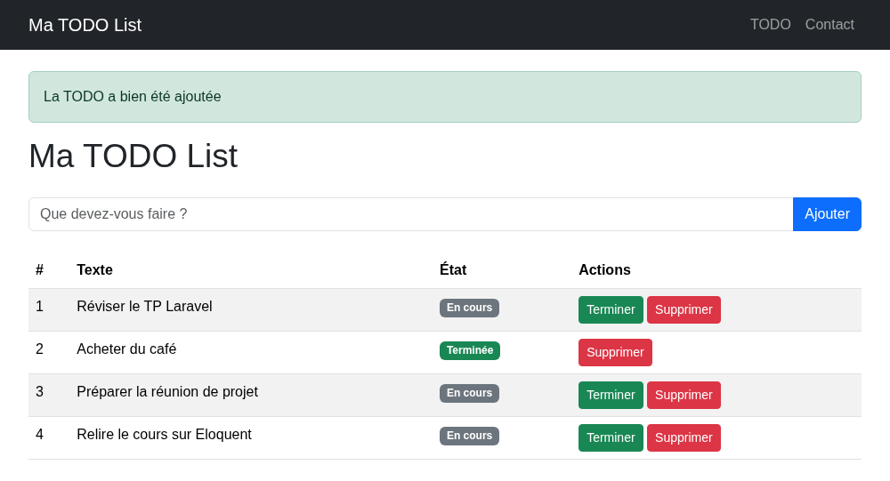

Nous allons y arriver progressivement, étape par étape.

### Le contrôleur

Créez un contrôleur `TodoControleur` avec `artisan`, comme dans le TP d'introduction. Il contiendra pour l'instant deux méthodes :

- `listTodo()` : récupère toutes les TODO et les transmet à la vue.
- `addTodo(Request $request)` : enregistre la TODO reçue du formulaire, puis redirige vers la liste.

Vous avez vu ces deux méthodes dans la section « Où écrire ces appels ? ». N'oubliez pas le `use App\Models\Todo;` en haut du fichier.

### Les routes

Ajoutez dans `routes/web.php` :

- Une route en `GET` sur `/todo` qui appelle `listTodo`.
- Une route en `POST` sur `/todo` qui appelle `addTodo`.

Question :

- Pourquoi deux routes avec la même URL mais deux verbes HTTP différents ? Que se passerait-il avec une seule route en `GET` ?

### La vue, afficher la liste

Créez la vue `resources/views/todo.blade.php` :

- Héritez de votre layout principal avec `@extends('layouts.base')`.
- Affichez les TODO dans une `table` HTML : une ligne par TODO, avec une boucle `@foreach` sur la variable transmise par le contrôleur.

Nous l'avons vu en cours, c'est [une directive Blade](/cheatsheets/laravel/#les-directives) qu'il faut utiliser ici. Voilà l'idée, à vous de l'adapter au nom de votre variable :

```html
<table>
  @foreach($LaVariableAvecLesValeursEnBase as $unElement)
  <tr>
    <td>{{$unElement->texte}}</td>
  </tr>
  @endforeach
</table>
```

::: tip Point de contrôle

Ouvrez `/todo` dans votre navigateur : la page s'affiche et le tableau est vide (ou contient les lignes laissées par vos essais dans Tinker).

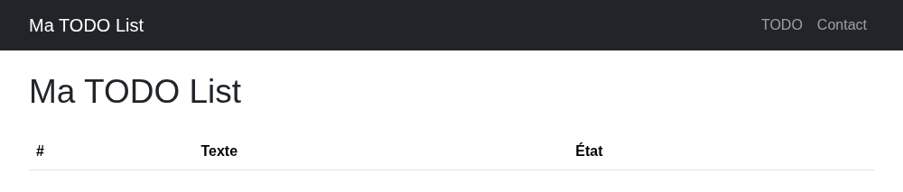

Pour vérifier votre boucle sans attendre le formulaire, ajoutez une ligne à la main dans la table `todos` via votre outil SQLite, puis rechargez la page : elle doit apparaître.

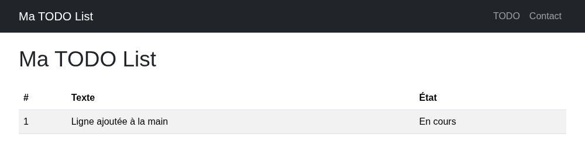

:::

### Le formulaire d'ajout

Ajoutez dans la même vue, au-dessus du tableau, un formulaire qui permet de saisir une nouvelle TODO :

- Méthode `POST`, action `/todo` (la route `POST` déclarée plus haut).
- Un champ texte nommé `texte` : c'est ce nom que le contrôleur lit dans `$request->texte`, et c'est aussi le nom de la colonne en base.
- Un bouton pour valider.
- La directive `@csrf` juste après la balise `<form>` (voir ci-dessous).

::: danger N'oubliez pas le CSRF
Je vous ai parlé de la sécurité non ? Laravel intègre directement la protection anti-rejeu (CSRF : une requête forgée par un autre site en votre nom). Pour pouvoir valider votre formulaire, vous allez devoir intégrer dans votre formulaire une petite annotation.

`@csrf`

Exemple :

```html
<form method="POST" action="/VOTRE-ACTION-DEFINIE-DANS-LES-ROUTES">
  @csrf

  <!-- La suite de votre formulaire -->
</form>
```

PS: Je vous laisse constater l'impact dans le code **en observant le code source via votre navigateur**.

[Plus d'information](https://laravel.com/docs/csrf)

:::

Rechargez `/todo` : le formulaire est là, au-dessus du tableau (encore vide si vous avez supprimé vos essais).

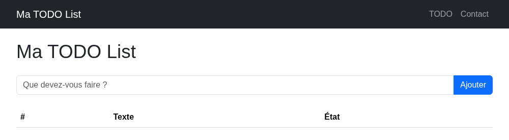

Maintenant que la page a sa forme définitive, c'est le bon moment pour l'habiller un peu si vous le souhaitez.

::: details Un peu de Bootstrap pour habiller la page ?

Bootstrap est déjà chargé dans votre layout depuis l'exercice « boîte à outils » du [TP d'introduction](./introduction.md), toutes vos pages en profitent donc automatiquement. Si ce n'est pas le cas, reprenez la balise `<link>` sur [la page d'installation par CDN](https://getbootstrap.com/docs/5.3/getting-started/download/#cdn-via-jsdelivr) et collez-la dans le `<head>` de `layouts/base.blade.php`.

Les composants utiles pour ce TP :

- [Les tableaux](https://getbootstrap.com/docs/5.3/content/tables/) : `table table-striped` sur votre `<table>` et la liste est déjà lisible.
- [Les formulaires](https://getbootstrap.com/docs/5.3/forms/overview/) : `form-control` sur le champ de saisie, `input-group` pour coller le champ et son bouton.
- [Les boutons](https://getbootstrap.com/docs/5.3/components/buttons/) : `btn btn-primary` pour valider, `btn btn-sm btn-success` ou `btn btn-sm btn-danger` pour les actions d'une ligne.
- [Les alertes](https://getbootstrap.com/docs/5.3/components/alerts/) : `alert alert-success` et `alert alert-danger` pour afficher vos messages flash.
- [Les badges](https://getbootstrap.com/docs/5.3/components/badge/) : parfaits pour signaler l'état d'une tâche (« En cours », « Terminée »).

Le visuel n'est pas l'objectif de ce TP, ne passez pas votre séance dessus.

:::

### Tester

À ce stade vous devez pouvoir ajouter une TODO via votre formulaire, la voir apparaître dans la liste, **et** la retrouver dans votre base via votre outil SQLite. Vérifiez avant de continuer.

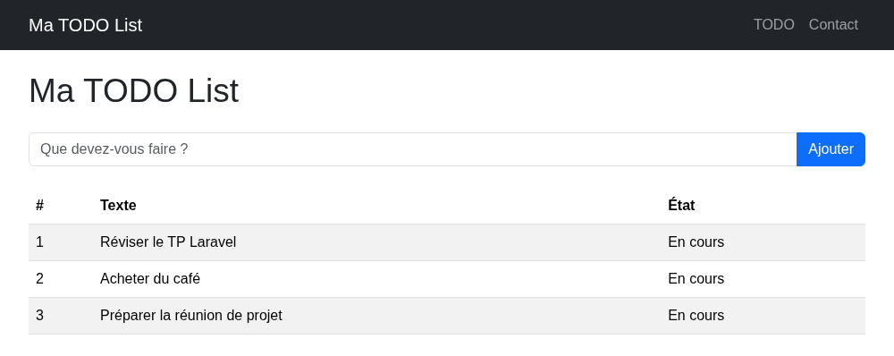

En ligne de commande, `sqlite3 database/database.sqlite` permet aussi de vérifier (les outils graphiques cités plus haut affichent la même chose) :

```
sqlite> .headers on
sqlite> .mode column
sqlite> SELECT id, texte, termine FROM todos;
id  texte                          termine
--  -----------------------------  -------
1   Réviser le TP Laravel          0
2   Acheter du café                0
3   Préparer la réunion de projet  0
```

## Aller plus loin : terminer, supprimer

Jusqu'ici je vous ai guidé pas à pas, en vous indiquant précisément quoi écrire et où. À partir de maintenant, le régime change : vous n'avez plus que la procédure et l'aide-mémoire, le code est entièrement à vous.

C'est le moment de voler de vos propres ailes, prenez le temps de réfléchir avant d'ouvrir les blocs d'aide. Je reste évidemment disponible si vous bloquez !

### Changer l'état d'une TODO

En utilisant [l'aide mémoire](/cheatsheets/laravel/) et la [documentation de Laravel](https://laravel.com/docs/eloquent) ajoutez :

- Une action permettant de marquer une TODO « comme terminée ». (l'action peut être un lien, ou un bouton)
- Cette action doit être mise dans le bon contrôleur

::: tip Rappel

```php
// Rechercher celui avec l’id « L'ID QUE VOUS SOUHAITEZ MODIFIER » (Exemple : 1)
$todo = Todo::find("L'ID QUE VOUS SOUHAITEZ MODIFIER");

// Le passer à terminer
$todo->termine = true;

// Le sauvegarder en base de données. (Ici Eloquent va générer une requête de type UPDATE)
$todo->save();
```

:::

Une fois l'action en place, la tâche terminée se distingue des autres dans la liste :

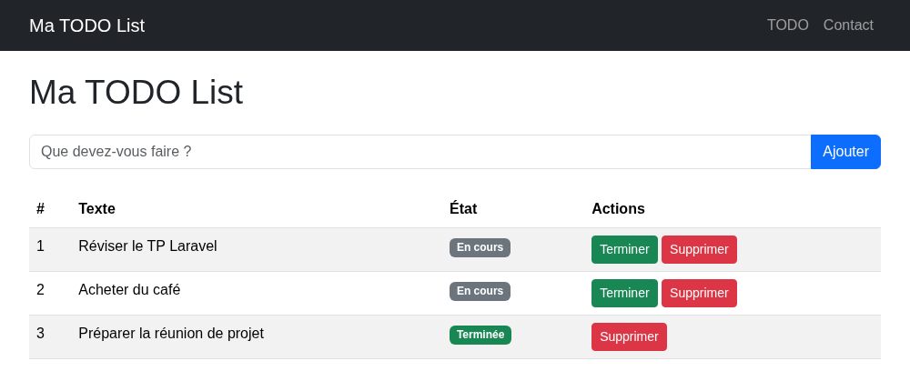

::: details Besoin d'aide pour l'action terminer ?

Je ne vais pas vous donner le code. Mais plutôt la procédure, vous devez :

- Pour chaque ligne de votre tableau : ajouter un lien qui permettra de modifier l'état d'un élément en base. Le lien peut être du type <code v-pre>/todo/terminer/{{ $unElement->id }}</code>.
- Ajout d'une route permettant de faire fonctionner le lien. Exemple : <code v-pre>Route::get('/todo/terminer/{id}', [TodoControleur::class, 'markAsDone']);</code>.
- Ajouter la méthode `markAsDone` dans votre contrôleur `public function markAsDone($id)`, celle-ci va réaliser l'action de marquer comme « terminée » pour la TODO `$id`
- À la fin du traitement, vous devez rediriger le demandeur avec `return redirect("/todo");`

:::

### Supprimer une TODO

En utilisant [l'aide mémoire](/cheatsheets/laravel/) et la [documentation de Laravel](https://laravel.com/docs/eloquent), ajoutez :

- Une action permettant de supprimer une TODO.
- Cette action doit être mise dans le bon contrôleur.
- Il ne doit pas être possible de supprimer une TODO qui n'est pas terminée.

La procédure est identique à celle de l'action terminer (lien, route, méthode, redirection). Pour la suppression elle-même, Eloquent vous laisse le choix :

```php
// Façon 1 : retrouver la ligne, puis la supprimer
$todo = Todo::find(1);
$todo->delete();

// Façon 2 : supprimer directement à partir de l'id
Todo::destroy(1);

// Façon 3 : en supprimer plusieurs
Todo::destroy(1, 2, 3);

// Façon 4 : supprimer avec une condition
Todo::where('termine', '=', 1)->delete();
```

Avant de supprimer, votre méthode doit vérifier que la TODO est bien terminée : pensez à ce qu'il se passe si quelqu'un tape l'URL de suppression à la main.

::: tip Point de contrôle

Déroulez le scénario complet, en gardant votre outil SQLite ouvert à côté :

1. Ajoutez une TODO depuis le formulaire, la ligne apparaît dans la table `todos`.
2. Tentez de la supprimer tout de suite : l'opération doit être refusée, car elle n'est pas terminée. La ligne est toujours en base.
3. Marquez-la « terminée », la colonne `termine` passe à 1.
4. Supprimez-la : cette fois l'opération est acceptée et la ligne disparaît de la table.

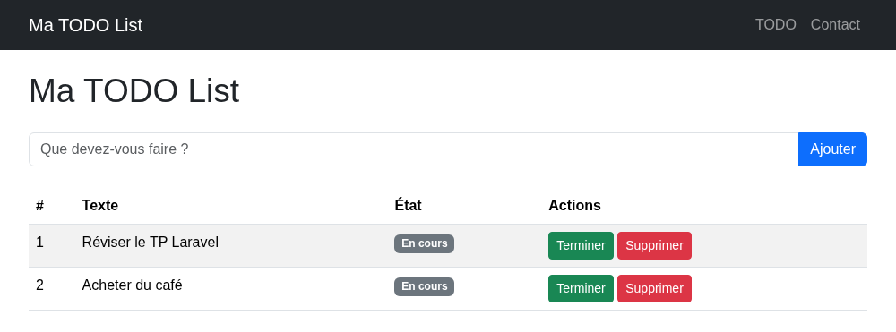

Si les quatre étapes se comportent comme prévu, votre CRUD est complet et vos règles de sécurité fonctionnent.

:::

### Améliorer le retour utilisateur

Dans le TP d'introduction, nous avons vu les **messages flash**. Je vous laisse les intégrer dans votre TODO List :

- Un message de succès après l'ajout d'une TODO.
- Un message de succès après la suppression.
- Un message d'erreur si l'utilisateur tente de supprimer une TODO non terminée.

Ce que l'utilisateur doit voir :

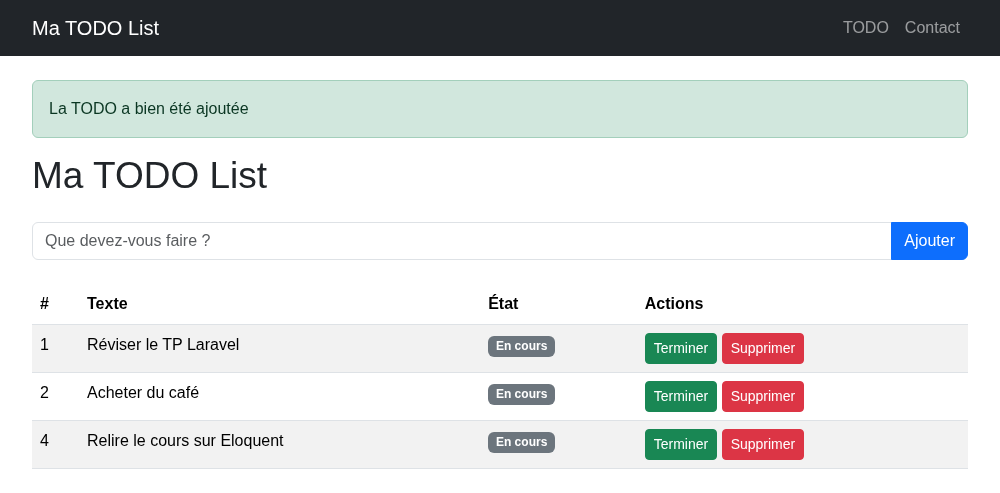

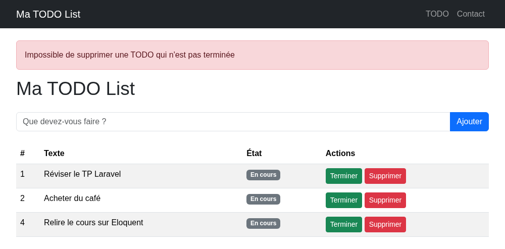

::: details Un trou de mémoire sur les messages flash ?

Côté contrôleur :

```php
return redirect("/todo")->with('success', 'La TODO a bien été ajoutée');
```

Côté vue :

```html
@if(session('success'))
<div style="color: green;">{{ session('success') }}</div>
@endif
```

:::

## Faire évoluer la base de données : les catégories

Votre TODO List fonctionne, mais toutes les tâches sont mélangées : « Acheter du café » et « Réviser le TP Laravel » se retrouvent dans la même liste. Nous allons les classer par **catégorie** (Maison, Travail, Études, Courses).

Pour y arriver, il nous faut deux choses : une nouvelle table `categories` (un identifiant, un nom, et les dates), et une colonne `categorie_id` dans la table `todos` pour indiquer, tâche par tâche, à quelle catégorie elle appartient.


Question :

- Pourquoi créer une table séparée plutôt que d'ajouter simplement une colonne texte `categorie` dans la table `todos` ? Pensez au jour où vous voudrez renommer une catégorie, ou simplement lister les catégories disponibles dans un menu déroulant.

### Faire évoluer la structure en SQL

Cette fois, pas de migration. Ce n'est pas une obligation dans Laravel : c'est un outil pratique, mais rien ne vous empêche de créer vos tables autrement. Nous allons donc le faire « à la main » : uniquement la définition du modèle côté Laravel, et un script SQL pour la structure. C'est exactement ce que vous ferez en AP, où la base de données vous est fournie sous forme de script SQL.

Je vous donne le SQL, c'est vous qui allez l'exécuter sur la base. Au passage, vous verrez concrètement ce qu'une migration fabrique « derrière » (une migration, au final, ce n'est que du SQL généré pour vous), et vous vérifierez qu'Eloquent sait très bien travailler avec une table qu'il n'a pas créée lui-même, du moment que les conventions sont respectées.

Voici le SQL à exécuter (il est écrit pour SQLite) :

```sql
CREATE TABLE categories (
    id INTEGER PRIMARY KEY AUTOINCREMENT,
    nom VARCHAR(255) NOT NULL,
    created_at DATETIME NULL,
    updated_at DATETIME NULL
);

INSERT INTO categories (nom, created_at, updated_at) VALUES
    ('Maison', datetime('now'), datetime('now')),
    ('Travail', datetime('now'), datetime('now')),
    ('Études', datetime('now'), datetime('now')),
    ('Courses', datetime('now'), datetime('now'));

ALTER TABLE todos ADD COLUMN categorie_id INTEGER NULL REFERENCES categories(id);
```

Prenez le temps de lire ces trois instructions : la première crée la table, la deuxième insère quatre catégories par défaut, la troisième ajoute la clé étrangère dans `todos`. La colonne est `NULL` par défaut, vos TODO existantes ne seront donc pas perdues : elles se retrouveront simplement « sans catégorie ».

::: details Et si on l'avait fait avec une migration ?

C'est tout à fait possible, et c'est même ce que vous feriez en équipe. Vous créeriez le fichier avec :

```sh
php artisan make:migration create_categories_table
```

Puis, dans la méthode `up()` :

```php
Schema::create('categories', function (Blueprint $table) {
    $table->id();
    $table->string('nom');
    $table->timestamps();
});

Schema::table('todos', function (Blueprint $table) {
    $table->foreignId('categorie_id')->nullable()->constrained();
});
```

L'avantage est évident : le fichier part dans Git, et vos collègues obtiennent la même structure avec un simple `php artisan migrate`.

⚠️ Attention à l'inverse : une table créée « à la main » comme nous venons de le faire n'est connue de personne d'autre. Le jour où quelqu'un lance un `php artisan migrate:fresh`, la base est reconstruite à partir des seules migrations, et votre table `categories` disparaît.

:::

### Exécuter ce SQL avec DBeaver

Pour taper du SQL, il vous faut un outil connecté à votre base. [DBeaver](https://dbeaver.io/) est gratuit, multiplateforme, et vous l'avez déjà utilisé avec MariaDB : il sait aussi ouvrir un fichier SQLite.

::: details La marche à suivre dans DBeaver

- Créez une nouvelle connexion (l'icône « prise » en haut à gauche, ou le menu `Base de données` puis `Nouvelle connexion`).
- Dans la liste des bases proposées, choisissez **SQLite**.
- Dans le champ `Chemin` (Path), sélectionnez le fichier `database/database.sqlite` de votre projet.
- DBeaver vous propose de télécharger le pilote SQLite : acceptez, puis cliquez sur `Terminer`.
- Faites un clic droit sur votre connexion, puis `Éditeur SQL` et `Nouveau script`.
- Collez le SQL ci-dessus dans l'éditeur.
- Exécutez le **script entier** avec `Alt`+`X` (ou le bouton « Exécuter le script »). Attention, `Ctrl`+`Entrée` n'exécute que l'instruction sous le curseur, vous n'auriez alors qu'un tiers du travail de fait.
- Dépliez `Tables` dans l'arborescence de gauche, puis actualisez avec `F5` (ou clic droit, `Actualiser`) pour voir apparaître la table `categories` et la nouvelle colonne de `todos`.

:::

Les autres outils cités plus haut (DB Browser for SQLite, l'extension VSCode, la vue Database de PHPStorm) proposent tous un onglet permettant de taper du SQL : si vous préférez rester sur celui que vous utilisez depuis le début du TP, c'est parfait aussi.

::: tip Point de contrôle

Dans DBeaver, ouvrez la table `categories` (onglet « Données ») : elle contient vos quatre lignes, Maison, Travail, Études et Courses. Ouvrez ensuite la table `todos` (onglet « Propriétés », puis « Colonnes ») : la colonne `categorie_id` est bien là, et vos anciennes TODO ont cette colonne à `NULL`.

:::

Profitez-en pour relancer `php artisan migrate` : Laravel vous répond `Nothing to migrate`, il ne voit aucun conflit avec ce que vous venez de faire à la main.

### Le modèle Categorie

La table existe déjà, nous n'avons donc besoin que du modèle. Cette fois, pas de `--migration` :

```sh
php artisan make:model Categorie
```

Le lien entre la classe et la table se fait tout seul : Laravel met le nom du modèle au pluriel « à l'anglaise » (il ajoute un `s`), `Categorie` devient donc `categories`. Ça tombe bien, c'est exactement le nom que nous avons donné à notre table en SQL.

Comme pour `Todo`, ajoutez la propriété qui autorise l'affectation en masse dans `app/Models/Categorie.php` :

```php
    protected $fillable = ['nom'];
```

Vérifiez tout de suite dans Tinker que le modèle voit bien vos quatre catégories :

```php
> use App\Models\Categorie;

> Categorie::all();
= Illuminate\Database\Eloquent\Collection {#8138
    all: [
      App\Models\Categorie {#8134
        id: 1,
        nom: "Maison",
        created_at: "2026-09-18 19:45:01",
        updated_at: "2026-09-18 19:45:01",
      },
      App\Models\Categorie {#8133
        id: 2,
        nom: "Travail",
        ...
      },
      ...
    ],
  }
```

Quatre objets `Categorie` sortent d'une table qu'Eloquent n'a jamais créée : la convention a suffi.

Question :

- Que se serait-il passé si nous avions appelé notre table `categorie` (sans `s`) ?

::: details La réponse

Laravel aurait cherché la table `categories` et vous auriez obtenu une erreur SQL du type `no such table: categories`. Il faut alors lui indiquer le nom réel, en ajoutant dans le modèle :

```php
    protected $table = 'categorie';
```

C'est possible, mais retenez surtout que respecter les conventions vous évite ce genre de ligne.

:::

### Lier les deux modèles

Nos deux tables sont reliées par la colonne `categorie_id`, mais Eloquent ne le sait pas encore. Nous allons lui décrire la relation, des deux côtés.

Dans `app/Models/Todo.php`, une TODO appartient à une catégorie :

```php
    public function categorie()
    {
        // Relation Eloquent : la colonne categorie_id de todos pointe vers l'id de categories
        return $this->belongsTo(Categorie::class, 'categorie_id');
    }
```

Dans `app/Models/Categorie.php`, une catégorie possède plusieurs TODO :

```php
    public function todos()
    {
        // Relation Eloquent : toutes les todos dont categorie_id vaut l'id de cette catégorie
        return $this->hasMany(Todo::class, 'categorie_id');
    }
```

Le second paramètre, `'categorie_id'`, indique explicitement à Eloquent la colonne qui porte la clé étrangère. Ici il est facultatif : par convention, le nom de la méthode (`categorie`) suivi de `_id` donne exactement `categorie_id`, et Laravel l'aurait deviné seul. Je vous le fais écrire quand même, pour que la relation soit lisible dans le code sans avoir à connaître la convention, et parce que vous en aurez besoin dès que vos noms de colonnes s'en écarteront (en AP par exemple).

Pensez enfin à autoriser l'enregistrement de cette colonne, en complétant le `$fillable` de `Todo` :

```php
    protected $fillable = ['texte', 'termine', 'categorie_id'];
```

Ces relations sont résumées dans [les jointures de l'aide mémoire](/cheatsheets/laravel/#les-jointures) et dans [la synthèse des commandes, section relations](/cheatsheets/laravel/quick.md#l-orm-relations). La documentation officielle est [ici](https://laravel.com/docs/eloquent-relationships).

Retour dans Tinker pour tester dans les deux sens (adaptez les identifiants à vos données, et n'oubliez pas d'affecter une catégorie à au moins une TODO dans votre outil SQLite) :

```php
> use App\Models\Todo;

> Todo::find(1)->categorie;
= App\Models\Categorie {#8573
    id: 3,
    nom: "Études",
    created_at: "2026-09-18 19:45:01",
    updated_at: "2026-09-18 19:45:01",
  }

> use App\Models\Categorie;

> Categorie::find(3)->todos;
= Illuminate\Database\Eloquent\Collection {#8569
    all: [
      App\Models\Todo {#8573
        id: 1,
        texte: "Réviser le TP Laravel",
        termine: 0,
        created_at: "2026-09-18 19:45:25",
        updated_at: "2026-09-18 19:45:25",
        categorie_id: 3,
      },
    ],
  }
```

Regardez bien : <code v-pre>$todo->categorie</code> renvoie **un objet**, alors que <code v-pre>$categorie->todos</code> renvoie **une collection**. C'est toute la différence entre `belongsTo` et `hasMany`, et vous n'avez écrit aucune jointure SQL.

### Utiliser les catégories dans l'application

Il ne reste plus qu'à faire vivre tout ça dans l'interface. Je vous donne la procédure, le code est à vous :

- Dans `listTodo`, transmettez aussi la liste des catégories à la vue, en plus des TODO (`Categorie::all()`), sans oublier le `use App\Models\Categorie;` en haut du contrôleur.
- Dans le formulaire d'ajout, ajoutez un menu déroulant `<select name="categorie_id">` rempli par une boucle `@foreach` sur ces catégories.
- Dans `addTodo`, enregistrez la valeur reçue, par exemple avec `'categorie_id' => $request->categorie_id` dans votre `Todo::create([...])`.
- Dans le tableau, ajoutez une colonne « Catégorie » qui affiche le nom de la catégorie de chaque TODO.

Pour le menu déroulant, voilà l'idée à adapter :

```html
<select name="categorie_id" class="form-select">
  <option value="">Sans catégorie</option>
  @foreach($categories as $uneCategorie)
  <option value="{{ $uneCategorie->id }}">{{ $uneCategorie->nom }}</option>
  @endforeach
</select>
```

Pour la colonne du tableau, attention : vos anciennes TODO ont un `categorie_id` à `NULL`, et demander le `nom` de « rien du tout » provoque une erreur. Le plus court est d'utiliser l'opérateur `?->` (appelle la propriété seulement si l'objet existe) avec une valeur de repli :

```html
<td>{{ $unElement->categorie?->nom ?? 'Sans catégorie' }}</td>
```

Un `@if` sur <code v-pre>$unElement->categorie</code> ferait tout aussi bien l'affaire, à vous de choisir.

::: tip Que se passe-t-il derrière ?

À chaque ligne affichée, Eloquent repart chercher la catégorie en base : une requête pour la liste, puis une requête par TODO (c'est le fameux problème « N+1 »). Vous pouvez tout charger d'un coup en remplaçant `Todo::all()` par `Todo::with('categorie')->get()`. Gardez l'idée dans un coin de votre tête, elle vous servira dès que vos listes s'allongeront.

:::

Rechargez `/todo` : le formulaire propose maintenant une catégorie, et chaque tâche affiche la sienne.

::: tip Point de contrôle

Ajoutez une TODO en choisissant « Travail » dans le menu déroulant : la ligne apparaît avec sa catégorie, et la colonne `categorie_id` de la table `todos` contient bien l'identifiant correspondant.

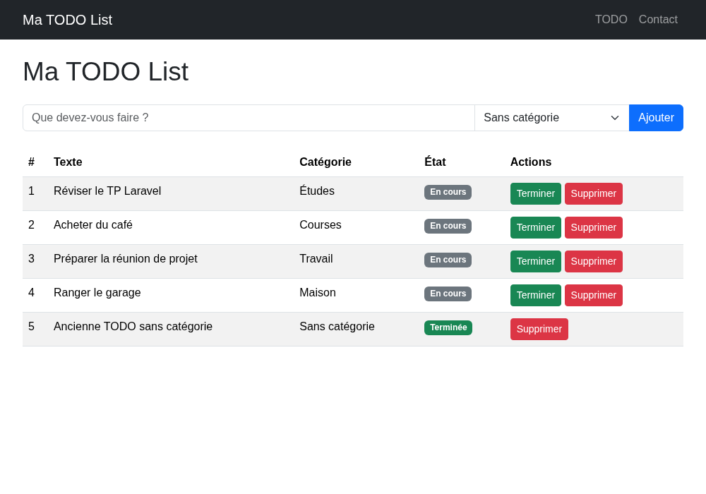

:::

Si vous voulez aller plus loin, essayez (sans aide cette fois) de filtrer la liste par catégorie, avec un lien du type `/todo?categorie=1`.

## Créer un Middleware

Pour tester les middleware, nous allons créer un Middleware qui va vérifier la présence d'un mot dans le texte de la TODO. Si le mot est présent, la TODO ne pourra pas être ajoutée en base de données.

Pour commencer, créez un Middleware :

```sh
php artisan make:middleware CheckTodo
```

Ajoutez la logique dans le Middleware :

```php
public function handle(Request $request, Closure $next): Response
{
    if (strpos($request->texte, 'twitter') !== false) {
        return redirect()->back()->with('error', 'Le mot twitter est interdit');
    }

    return $next($request);
}
```

Ajouter le Middleware sur la route que vous souhaitez protéger :

```php
->middleware(CheckTodo::class)
```

Pensez également à ajouter `use App\Http\Middleware\CheckTodo;` en tête de votre fichier de routes, sans quoi la classe ne sera pas trouvée.

::: tip Besoin d'aide ?

Je vous laisse implémenter le code dans votre projet. Si vous avez des questions, je suis là pour vous aider.

Le système de middleware est très puissant, c'est un peu comme un filtre qui va être exécuté avant ou après une action. C'est très utile pour la sécurité, la gestion des erreurs, etc.

:::

Question :

- À votre avis, pourquoi placer ce contrôle dans un Middleware plutôt que directement dans la méthode `addTodo` du contrôleur ?

::: tip Point de contrôle

Tentez d'ajouter une TODO contenant le mot « twitter » : elle n'est pas enregistrée et le message du Middleware s'affiche (le `redirect()->back()` vous ramène sur la liste).

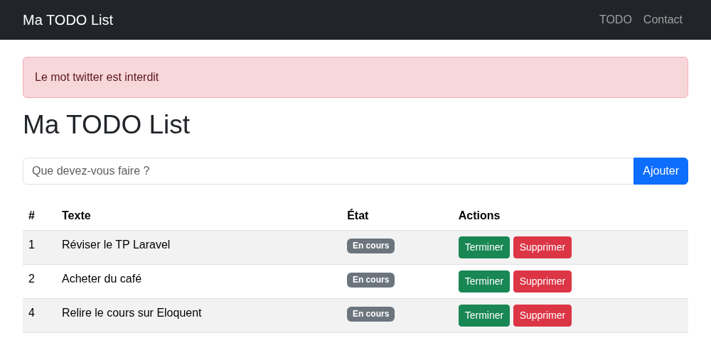

:::

Gardez bien ce mécanisme en tête : nous allons le réutiliser dès le TP suivant, mais cette fois pour protéger votre TODO List derrière une authentification.

## Exercice 1 : un formulaire de contact

::: tip Vous êtes en avance ?
Les deux exercices qui suivent sont un bonus pour les étudiants qui ont terminé. Le TP suivant ne dépend pas de ce formulaire de contact, vous pouvez donc y aller directement si le temps vous manque.
:::

J'aimerais que notre petit site de démonstration intègre un formulaire de demande de contact. Je vous laisse réfléchir comment réaliser l'opération, quelques pistes pour débuter :

- Le formulaire doit être en HTML.
- Les demandes faites via le formulaire doivent être sauvegardées en base de données (table spécifique, avec un id, un titre, un texte, un email et les dates).
- L'ajout doit être fait par un modèle.
- Vous devez créer un contrôleur spécifique pour réaliser l'opération.
- Un message flash doit être affiché pour indiquer à l'utilisateur que sa demande a bien été prise en compte.
- Un message flash doit être affiché pour indiquer à l'utilisateur que sa demande n'a pas été prise en compte.

C'est à vous ! Je suis là si besoin 🚀.

Un exemple de résultat attendu, après l'envoi d'une demande :

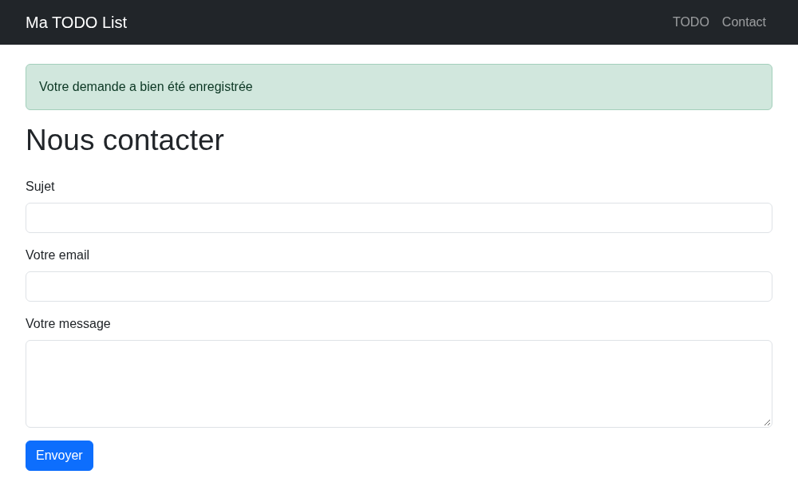

::: tip Prenez du recul

Ce formulaire de contact, c'est un mini-projet complet : migration + modèle + contrôleur + routes + vue. Exactement le même cheminement que pour la TODO List. Si vous savez le refaire seul, vous avez compris la mécanique de Laravel.

:::

## Exercice 2 : des catégories pour le contact

Vos demandes de contact arrivent toutes dans le même sac. Reprenons la mécanique de la section précédente, mais cette fois sans aide pas à pas : vous connaissez le chemin.

- Créez une table de catégories de demande, contenant par exemple « Question », « Bug », « Partenariat » et « Autre ».
- Cette fois, faites-le avec une **migration** Laravel, pas en SQL. Les quatre catégories par défaut doivent être insérées dès la migration (ou, si vous préférez, depuis Tinker).
- Ajoutez la clé étrangère correspondante sur la table des demandes de contact.
- Créez le modèle de cette nouvelle table, puis déclarez la relation **dans les deux modèles**.
- Ajoutez un menu déroulant dans le formulaire de contact pour choisir le type de demande.
- Affichez enfin la catégorie choisie, soit dans le message flash de confirmation, soit dans une page listant les demandes reçues.

C'est à vous de jouer ! Je reste disponible si vous bloquez.

Le résultat attendu, après l'envoi d'une demande :

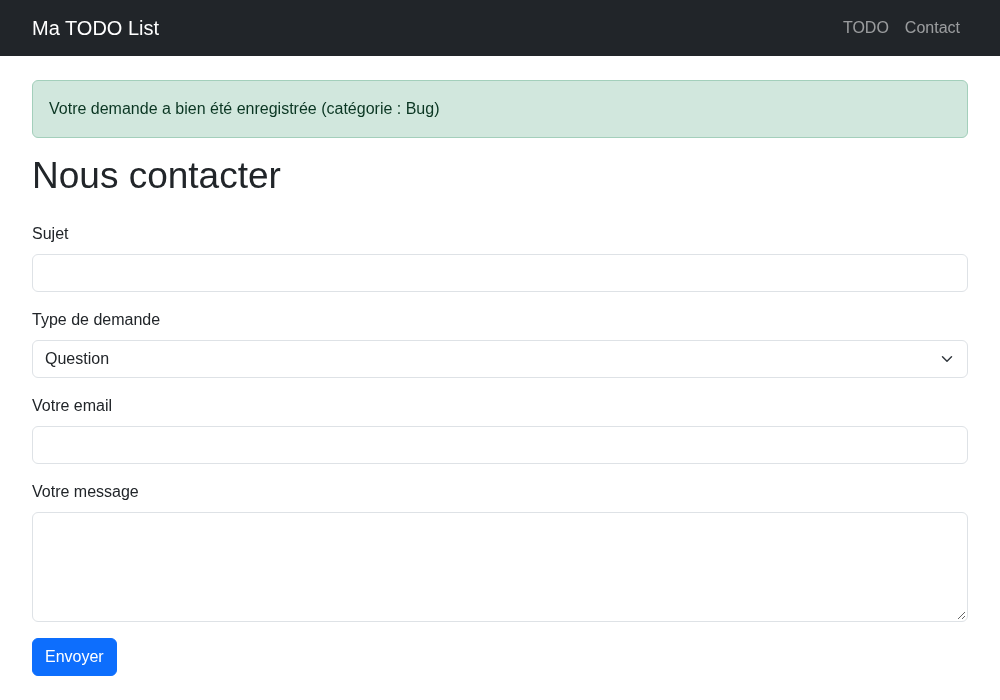

::: details Besoin d'aide ?

Pas de code ici, seulement la procédure :

- `php artisan make:model CategorieContact --migration` crée le modèle et sa migration.
- Dans la méthode `up()` de cette migration : la création de la table (un `id`, un `nom`, les `timestamps`), puis l'insertion des quatre catégories avec `DB::table('categorie_contacts')->insert([...])`.
- ⚠️ Le piège est là : pour un modèle `CategorieContact`, Laravel attend la table `categorie_contacts` et la clé étrangère `categorie_contact_id`. Respectez ces noms, ou déclarez le vôtre avec `protected $table = '...';` dans le modèle.
- Une seconde migration (ou la même) ajoute la colonne sur la table des contacts, avec `foreignId(...)->nullable()->constrained()`.
- `php artisan migrate` pour appliquer le tout, puis vérification de la table dans votre outil SQLite.
- Les relations : un `belongsTo` côté demande de contact, un `hasMany` côté catégorie. Sans oublier la nouvelle colonne dans le `$fillable` du modèle de contact.
- Le contrôleur transmet la liste des catégories à la vue du formulaire, et enregistre la valeur reçue du `<select>`.
- Pour le message flash, la relation vous donne directement le nom, par exemple avec `$contact->categorieContact->nom`.

:::

## Conclusion

Dans ce TP vous avez découvert toute la chaîne de persistance de Laravel :

- Les **migrations** pour définir (et versionner) la structure de votre base de données.
- Les **modèles** et **Eloquent** pour manipuler vos données sans écrire de SQL.
- Un CRUD complet (Create, Read, Update, Delete) avec la TODO List.
- Les **relations** entre deux tables (`belongsTo` et `hasMany`) pour classer vos TODO par catégorie.
- Les **middlewares** pour filtrer les requêtes.

N'oubliez pas de **commiter votre projet**, nous allons le réutiliser dans le TP suivant.

Justement, la suite : notre TODO List est accessible à tout le monde… Il est temps de protéger tout ça avec un système d'authentification. Rendez-vous dans le TP [Comprendre l'authentification](./authentification_manuelle.md).
