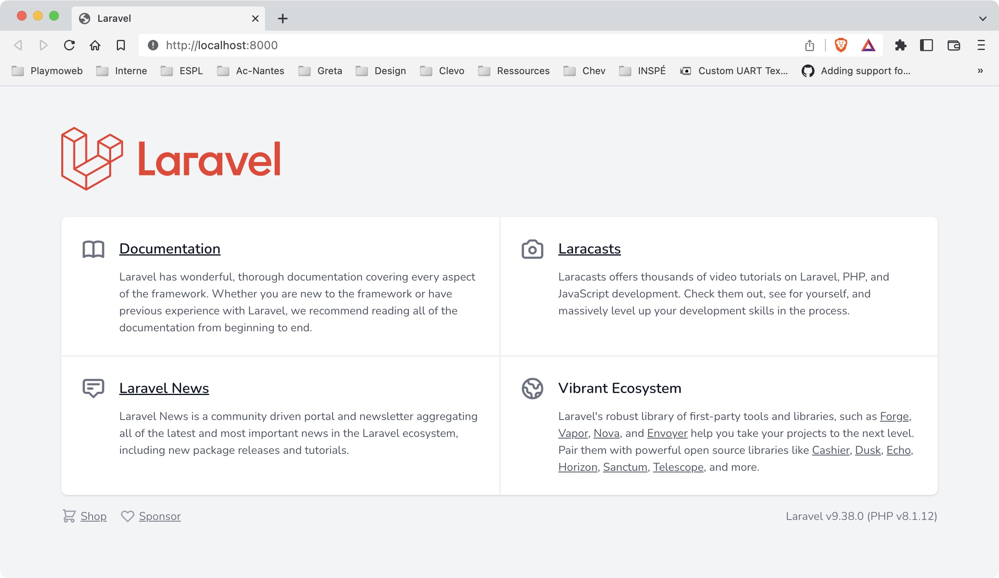
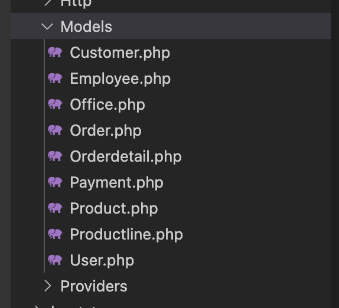
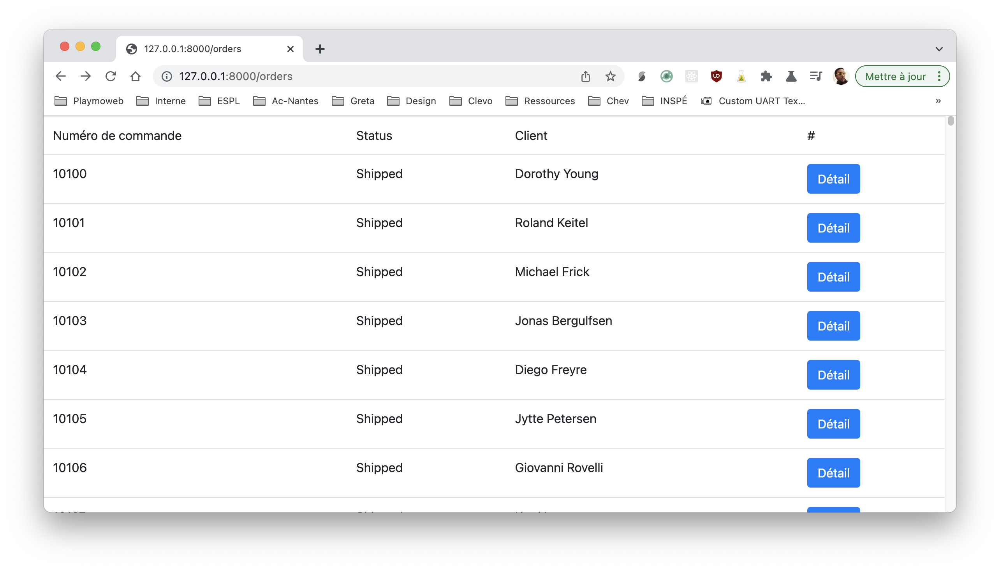
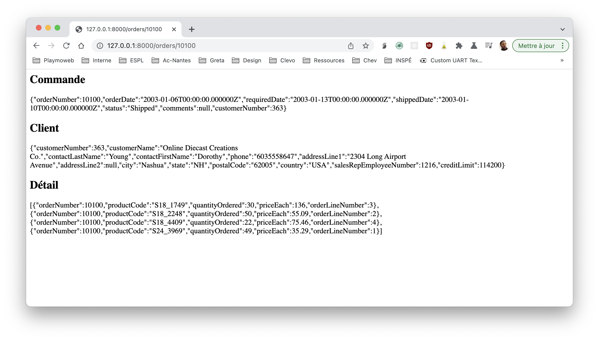

# Eloquent les modèles simplement

::: details Sommaires
[[toc]]
:::

Dans ce TP nous allons voir comment générer le modèle Laravel à partir d'une base de données existante.

## Introduction

Pour pouvoir utiliser Laravel, nous allons avoir besoin de différents outils :

- PHP 8
- Composer

Il y a bien plus de dépendances, mais celles-ci seront récupérées automatiquement par `Composer`

## Créer le projet

Votre poste est maintenant configuré pour Laravel, vous pouvez donc créer un nouveau projet grâce à la commande :

✋ Attention, le projet sera créé dans le dossier courant.

```bash
composer create-project --prefer-dist laravel/laravel generation-de-modele
```

La commande va télécharger l'ensemble des dépendances nécessaire et va créer un dossier `generation-de-modele` avec les sources.

::: tip Vous avez récupéré le projet via GIT ?

Si vous avez récupéré le projet depuis GIT vous n'allez bien évidemment pas utiliser la commande `create-project`… Par contre vous allez devoir réinstaller les dépendances (`vendor`) de votre projet. C'est très simple :

Dans le dossier de votre projet, lancer la commande :

```sh
composer install
```

:::

## Initialisation

Votre nouveau projet contient un fichier `.env` ouvrez-le, et éditez par exemple le nom du projet.

Questions :

- Le fichier est plutôt complet, à quoi servent les différents paramètres ?
- Dans les cours, je vous ai parlé de la APP_KEY, celle-ci est déjà remplie, à votre avis pourquoi ?

## Lancer le projet d’exemple

Laravel intègre un serveur de test permettant de valider son développement avec rien d’autre que PHP sur sa machine. Pour ça, dans le dossier du projet (`cd mon-premier-projet`) vous pouvez faire la commande suivante :

```bash
php artisan serve
```

Rendez-vous maintenant dans [votre navigateur](http://localhost:8000) pour voir le site de démonstration fourni par Laravel.



## La base de données

L'idée de ce TP est de générer automatiquement les modèles à partir de la structure de votre base de données.

Pourquoi générer nos modèles ? L'avantage de générer nos modèles c'est qu'ils vont vraiment être complets.

Ils contiendront évidemment les, `$fillable` mais également les jointures entre les tables !

### Importer la BDD

Dans un premier temps, je vous laisse restaurer la base suivante :

[Télécharger la base de données](./ressources/mysqlsampledatabase.sql)


- Je vous laisse importer la base de données dans MySQL.

### Installer le générateur de modèle

Pour générer les modèles, nous allons utiliser un plugin que nous allons ajouter avec Composer.

Le plugin en question [Reliese Laravel Model Generator](https://github.com/reliese/laravel)

Pour l'installer, la procédure est simple :

```sh
composer require reliese/laravel --dev
php artisan vendor:publish --tag=reliese-models
php artisan config:clear
```

::: tip Un instant !

Qu'avez-vous installé ? Quels fichiers ont été modifiés ? Je vous laisse regarder, nous allons en parler !

:::

### Générer les modèles

::: danger Attention

Avant de générer les modèles, je vous laisse vérifier la configuration de votre `.env` notamment au niveau de la base de données.

:::

Maintenant que votre base de données est configurée et prête à être utilisée depuis Laravel, nous allons pouvoir générer l'ensemble des modèles de notre application.

Pour générer **l'ensemble des modèles,** nous allons saisir une nouvelle commande (celle-ci a été ajoutée par le plugin que vous venez d'ajouter) :

```sh
php artisan code:models
```

::: tip C'est rapide et ça fonctionne !
En quelques secondes le plugin a créé l'ensemble des modèles de votre projet. Je vous laisser regarder les modifications dans votre projet, et surtout le dossier `models`
:::

### Les modèles générés

Avant d'aller plus loin, regardons ensemble un peu les modèles :



Vous vous souvenez des jointures ? Je vous avais expliqué qu'il était possible de les définir dans Laravel pour requêter simplement votre base de données. Dans le code généré par le plugins, nous avons évidemment celle-ci, voilà un exemple :


::: danger STOP

Ici, pas de magie ! Le plugin ne fait qu'écrire du code à votre place. Le code vous ne pouvez **évidemment pas l'inventer,** il est dans la documentation officielle de Laravel.

Vous l'avez oublié ? Pas de problème : 

[La documentation de base](https://laravel.com/docs/8.x/eloquent)
[Les jointures et Eloquent](https://laravel.com/docs/8.x/eloquent-relationships)

:::

## Testons avec la liste des commandes

Pour voir l'intérêt de tout ceci, nous allons réaliser quelques requêtes !

Pour ça nous allons ajouter quelques éléments dans votre projet… En premier lieu, un contrôleur qui permettra de réaliser les requêtes.

Pour tester, nous allons réaliser des requêtes dans la table `orders`.

Pour cette première fois, nous allons le faire ensemble.

### 1. Ajouter un contrôleur

La première étape, c'est la création du contrôleur :

```sh
php artisan make:controller OrdersControler
```

### 2. Déclarer la route

```php
Route::get('/orders', [OrdersController::class, 'list']);
```

::: danger Un instant ✋

En PHP objet il y a la notion de namespace, Laravel utilise de base les namespace, ça veut dire que nous allons avoir à utiliser le mot clé `use` pour importer (include). Quand vous voulez utiliser une classe qui n'est pas dans le même fichier, il faudra déclarer l'emplacement via un `use`. Exemple, pour que la classe `Demo` soit accessible depuis une autre classe, il faudra :

```php
use App\Models\Demo;
```

- ⚠️ Si vous utilisez **PHPStorm,** cet import sera automatique.
- ⚠️ Si vous utilisez **VSCode,** il faudra passer par une extension [Disponible ici](https://marketplace.visualstudio.com/items?itemName=MehediDracula.php-namespace-resolver)

Pour **PHPStorm**, alt+entrée permettra de déclencher l'ajout dû use.

Pour **VSCode** je vous laisse regarder l'usage de l'extension :


:::

### 3. Déclarer la méthode

Si vous avez bien suivi, vous avez compris que nous allons devoir ajouter dans notre `OrdersController` une méthode `list`.

Dans votre contrôleur, ajouter le code suivant :

```php
    function list(){
        return view("orders-list", ["orders" => Order::all()]);
    }
```

::: tip Un instant !

Qu'avez-vous copié / coller ?

- `Order::all()` ? À quoi correspond cette ligne ?
- `orders-list` ? Avez-vous créé ce fichier ?

:::

### 4. Créer la vue

Vous l'avez vu, nous avons besoin d'un template pour que la page s'affiche. Créer un fichier nommé `orders-list.blade.php` dans le dossier. `resources/view`

```html
<!DOCTYPE html>
<html lang="fr">
    <head>
        <meta charset="UTF-8">
        <meta http-equiv="X-UA-Compatible" content="IE=edge">
        <meta name="viewport" content="width=device-width, initial-scale=1.0">
        <link rel="stylesheet" href="https://maxcdn.bootstrapcdn.com/bootstrap/4.0.0/css/bootstrap.min.css" integrity="sha384-Gn5384xqQ1aoWXA+058RXPxPg6fy4IWvTNh0E263XmFcJlSAwiGgFAW/dAiS6JXm" crossorigin="anonymous">
    </head>
    <body>
        <div>
            <div>
                <table class="table">
                    <thead>
                        <tr>
                            <td>Numéro de commande</td>
                            <td>Status</td>
                            <td>Client</td>
                            <td>#</td>
                        </tr>
                    </thead>
                    <tbody class="bg-white dark:bg-slate-800">
                    @foreach($orders as $order)
                        <tr>
                            <td>{{$order->orderNumber}}</td>
                            <td>{{$order->status}}</td>
                            <td>{{$order->customer->contactFirstName}} {{$order->customer->contactLastName}}</td>
                            <td>
                                <a class="btn btn-primary" href="/orders/{{$order->orderNumber}}">Voir la page de détail</a>
                            </td>
                        </tr>    
                    @endforeach
                    </tbody>
                </table>
            </div>
        </div>
    </body>
</html>
```

Je vous laisse tester dans votre navigateur, si tout fonctionne correctement vous devriez avoir :




::: tip Un instant !

- Vous avez remarqué ? Non ? Vraiment ?
- Vous avez des données de commande, mais vous avez également des données `client` (`customer`) ! Comment est-ce possible ? Vous n'avez pas écrit de requête pourtant ?
- `$order->customer` est en fait un raccourci qui va faire la requête pour vous !
  - Attention… pas de magie… Le code est écrit dans la méthode `customer()` du modèle `Order`.
  - Avant d'aller plus loin, allez regarder le code du modèle.

:::

### 5. Ajouter une autre donnée

Vu que vous avez regardé le modèle `Order`, vous avez remarqué la méthode `orderdetails`. Je vous laisse :

- Ajouter dans le données une nouvelle colonne.
- Celle-ci doit contenir le nombre de produits commandés

Un indice

```html
({{sizeof($order->orderdetails)}})
```

C'est à vous !

## Ajouter la vue de détail

Nous allons maintenant faire la page de détail en prenant le même principe.

### 1. La méthode  

Pour vous aider, voilà le code. **Attention** avant de copier / coller trop rapidement, regardez bien…

```php
function detail($id){
    return view("orders-detail", ["order" => Order::find($id)]);
}
```

::: tip Un instant !

- D'où ça provient `$id` ?
- `::find($id)` ? À quoi sert cette méthode ?

:::

### 2. La route

Et pour assembler le tout… La route !

```php
Route::get('/orders/{id}', [OrdersController::class, 'detail']);
```

`{id}` ? Correspond à une route dynamique, grâce à cette notation, votre variable `$id` de votre contrôleur sera automatiquement remplie avec la valeur en provenance du lien.

### 3. Le template

Je vous laisse l'écrire, celui-ci va afficher (de manière sympa, dans une Card) :

- La commande
- Le client
- Le détail de la commande (liste des produit)

::: details Vous pouvez débuter avec…

```html
<h2>Commande</h2>
{{ $order }}

<h2>Client</h2>
{{ $order->customer }}

<h2>Détail</h2>
{{ $order->orderdetails }}
```

Ce n’est pas beau, mais ça fonctionne :



:::

## Créer une commande

Nous avons traité la lecture, maintenant nous allons voir comment créer une commande. Pour ça, nous allons devoir :

- Créer une route pour traiter le formulaire.
- Créer un formulaire pour saisir les informations de la commande.
- Créer une méthode dans le contrôleur pour traiter le formulaire.

### 1. Créer la route

Pour notre système, nous allons créer une route qui va permettre d'afficher le formulaire, et une autre qui va permettre de traiter le formulaire.

```php
Route::get('/orders/create', [OrdersController::class, 'createForm']);
Route::post('/orders/create', [OrdersController::class, 'create']);
```

::: tip Un instant !

- Pourquoi deux routes ?
- Pourquoi une route `get` et une route `post` ?

:::

### 2. Créer le formulaire

Pour créer le formulaire, rien de nouveau, nous allons utiliser comme d'habitude du HTML.

```html
<form action="/orders/create" method="post">
    @csrf
    <div>
        <label for="orderNumber">Numéro de commande</label>
        <input type="text" name="orderNumber" id="orderNumber">
    </div>
    <div>
        <label for="status">Status</label>
        <input type="text" name="status" id="status">
    </div>
    <div>
        <label for="comments">Commentaires</label>
        <textarea name="comments" id="comments" cols="30" rows="10"></textarea>
    </div>
    <div>
        <label for="customerNumber">Numéro de client</label>
        <select name="customerNumber" id="customerNumber">
            @foreach($customers as $customer)
                <option value="{{$customer->customerNumber}}">{{$customer->contactLastName}} {{$customer->contactFirstName}}</option>
            @endforeach
        </select>
    </div>
    <div>
        <input type="submit" value="Créer la commande">
    </div>
</form>
```

Quelques explications :

- `@csrf` ? C'est une protection de Laravel, il faut toujours l'ajouter dans les formulaires.
- `@foreach($customers as $customer)` ? Vous avez vu ? Nous avons une variable `$customers` qui contient l'ensemble des clients. Comment est-ce possible ? Vous n'avez pas écrit de requête ? C'est le modèle `Customer` qui va faire la requête pour vous !

### 3. Créer la méthode affichant le formulaire

Pour afficher le formulaire, nous allons devoir créer une méthode dans le contrôleur.

```php
function createForm(){
    return view("orders-create", ["customers" => Customer::all()]);
}
```

`Customer::all()` va permettre de récupérer l'ensemble des clients. La variable `$customers` sera donc disponible dans le template pour afficher la liste des clients.

### 4. Créer la méthode traitant le formulaire

Pour traiter le formulaire, nous allons devoir créer une méthode dans le contrôleur.

```php
function create(Request $request){
    $order = new Order();
    $order->orderNumber = $request->input("orderNumber");
    $order->status = $request->input("status");
    $order->comments = $request->input("comments");
    $order->customerNumber = $request->input("customerNumber");
    $order->save();
    return redirect("/orders");
}
```

## Et si nous allions plus loin!

Notre base de données est assez volumineuse et permet de faire bien plus ! Je vous laisse créer les routes et la vue permettant de constulter un `Customer` :

- Liste des `Customer`.
- Vue de détail d'un `Customer`.
  - Le détail du `Customer`.
  - Dans la vue de détail, je veux voir la liste des commandes du `Customer`.

Pour ça vous allez devoir :

- Créer un nouveau contrôleur.
- Les routes

::: tip Un Instant !

Pour réaliser les deux pages, vous n'avez besoin que d'un seul modèle (`Customer`). Via les jointures l'ensemble des autres requêtes sera automatique !

Exemple dans le PHP: 

```php

// Récupérer le client 1
$customer = Customer::find(1);

// Récupérer les commandes du client
$customer->orders;

// Récupérer les commandes du client avec le détail
$customer->orders->orderdetails;

// Récupérer les commandes du client avec le détail et le produit
$customer->orders->orderdetails->product;
```

Ou depuis un template blade :

```html
{{ $customer->orders }}
{{ $customer->orders->orderdetails }}
{{ $customer->orders->orderdetails->product }}
```

La variable `$customer` est un objet de type `Customer`, celui-ci contient les méthodes `orders` et `ordersdetails` qui vont faire les requêtes pour vous !

:::

C'est à vous !

## Évolution de la base de données

Actuellement notre `customers` ne peux avoir qu'une seule adresse, nous allons modifier la base de données pour que celui-ci puisse avoir plusieurs adresses.

Pour ça, nous allons devoir modifier la table `customers` et créer une nouvelle table `addresses`.

### 1. Modifier la table `customers`

Pour modifier la table `customers` nous allons devoir retirer la colonne retalif à l'adresse et ajouter une colonne `address_id`.

```sql
ALTER TABLE `customers` DROP COLUMN `addressLine1`;
ALTER TABLE `customers` DROP COLUMN `addressLine2`;
ALTER TABLE `customers` DROP COLUMN `city`;
ALTER TABLE `customers` DROP COLUMN `state`;
ALTER TABLE `customers` DROP COLUMN `postalCode`;
ALTER TABLE `customers` DROP COLUMN `country`;

ALTER TABLE `customers` ADD COLUMN `address_id` INT(11) NULL AFTER `customerNumber`;
```

### 2. Créer la table `addresses`

Pour créer la table `addresses` nous allons devoir créer une nouvelle table.

```sql
CREATE TABLE `addresses` (
  `id` int(11) NOT NULL AUTO_INCREMENT,
  `addressLine1` varchar(50) DEFAULT NULL,
  `addressLine2` varchar(50) DEFAULT NULL,
  `city` varchar(50) DEFAULT NULL,
  `state` varchar(50) DEFAULT NULL,
  `postalCode` varchar(15) DEFAULT NULL,
  `country` varchar(50) DEFAULT NULL,
  PRIMARY KEY (`id`)
) ENGINE=InnoDB DEFAULT CHARSET=latin1;
```

### 3. Regénération des modèles

Notre base de données a changé, nous allons devoir regénérer les modèles.

```sh
php artisan code:models --table=customers
php artisan code:models --table=addresses
```

Ces deux commandes vont permettre de regénérer le modèle `Customer` et générer le modèle `Address`.

### 4. Corriger votre précédente vue

Vous avez créé une vue permettant de voir le détail d'un `Customer`, celle-ci ne fonctionne plus, il va falloir la corriger pour afficher une liste d'adresse.

::: tip Comment faire ?

Vous avez un modèle `Customer` qui contient une méthode `addresses`. Vous pouvez donc écrire dans votre template :

```html
@forelse ($customer->addresses as $address)
    <div>
        <div>{{$address->addressLine1}}</div>
        <div>{{$address->addressLine2}}</div>
        <div>{{$address->city}}, {{$address->postalCode}}, {{ $address->state }} , {{$address->country}}</div>
    </div>
@empty
    <div>Aucune adresse</div>
@endforelse
```

Un peu de lecture :

- `@forelse`: C'est une boucle, si la liste est vide, le code dans le bloc `@empty` sera exécuté.
- `$address` : C'est l'adresse en cours de traitement dans la boucle.

:::

### 5. Créer une nouvelle adresse

Maintenant que nous avons corrigé la vue, nous allons pouvoir créer une nouvelle adresse pour un client. Pour ça nous allons créer deux nouvelles routes :

```php
Route::get('/customers/{id}/addresses/create', [CustomersController::class, 'createAddressForm']);
Route::post('/customers/{id}/addresses/create', [CustomersController::class, 'createAddress']);
```

Puis les méthodes dans le contrôleur :

```php
function createAddressForm($id){
    return view("customers-create-address", ["customer" => Customer::find($id)]);
}

function createAddress(Request $request, $id){
    // Création de l'adresse
    $address = new Address();
    $address->addressLine1 = $request->input("addressLine1");
    $address->addressLine2 = $request->input("addressLine2");
    $address->city = $request->input("city");
    $address->state = $request->input("state");
    $address->postalCode = $request->input("postalCode");
    $address->country = $request->input("country");
    $address->save();

    // Ajout de l'adresse au client
    $customer = Customer::find($id);
    $customer->addresses()->attach($address);
    
    // Redirection vers la page de détail du client
    return redirect("/customers/$id");
}
```

Et enfin le template :

```html
<form action="/customers/{{$customer->id}}/addresses/create" method="post">
    @csrf
    <!-- Je vous laisse écrire l'interieur du formulaire -->
</form>
```

- `@csrf` ? C'est une protection anti-rejeu de Laravel, il faut toujours l'ajouter dans les formulaires.
- `{{$customer->id}}` ? C'est l'identifiant du client, il est nécessaire pour ajouter l'adresse au client.

::: tip C'est à vous !

Je vous laisse assembler le code pour créer de nouvelle adresse pour un client.

:::

### 6. Afficher un message de succès

Avec Laravel il est très simple d'afficher un message de succès, pour ça nous allons utiliser la méthode `with` de l'objet `RedirectResponse`.

Modifier la méthode `createAddress` pour remplacer le return par le code suivant :

```php
return redirect("/customers/$id")->with("success", "L'adresse a bien été ajoutée");
```

Puis dans le template de la vue de détail, ajouter le code suivant :

```html
@if (session('success'))
    <div class="alert alert-success">
        {{ session('success') }}
    </div>
@endif
```

Comment ça fonctionne ?

- `session('success')` ? C'est une variable de session, elle est disponible dans tous les templates.
- `{{ session('success') }}` ? C'est la valeur de la variable de session `success`.
- `with("success", "L'adresse a bien été ajoutée")` ? C'est la méthode `with` qui va ajouter une variable de session `success` avec la valeur `L'adresse a bien été ajoutée`.

L'avantage ? Les variables de session ajoutées avec `with` seront automatiquement supprimées après la première lecture. Pratique !

### 7. Supprimer une adresse

Maintenant que vous avez compris le principe. Je vous laisse créer le code pour supprimer une adresse. Pour vous aider dans la démarche, voilà les étapes :

- Créer une nouvelle route `customers/{id}/addresses/{addressId}/delete`.
- Créer une nouvelle méthode dans le contrôleur `deleteAddress`.
- Le code doit trouver l'adresse en base de données et la supprimer. (`find` et `delete`).
- Le code doit rediriger vers la page de détail du client avec un message de succès ou d'erreur.

N'oubliez pas, pour vous aider, vous avez l'aide mémoire :

- [Aide mémoire Rapide](/cheatsheets/laravel/quick.md)
- [Aide mémoire Complète](/cheatsheets/laravel/readme.md)

## Aller plus loin

Déjà au bout ? Vous souhaitez un peu de challenge ? Je vous laisse aller plus loin :

1. Ajouter des rôles aux clients :

- Créer une nouvelle table `roles`.
- Créer une nouvelle table `customers_roles`.
- Créer les relations entre les tables.

2. Réexporter les modèles :

```sh
php artisan code:models --table=customers
php artisan code:models --table=custmers_roles
php artisan code:models --table=roles
```

3. Ajouter une page permettant de modifier les rôles d'un client (vous pouvez utiliser `sync` sur la relation `roles` du modèle `Customer`). Comment faire ?

Vous avez un modèle `Customer` qui contient une méthode `roles`. Vous pouvez donc écrire dans votre méthode :

```php
// Get roles from post
$roles = $request->input("roles"); // <- Tableau contenant les identifiants des rôles à ajouter [1, 2, 3]
Customer::find(1)->roles()->sync($roles);
```

Et dans votre template :

```html
<!-- Select multiple avec reselect des valeurs précédement choisi pour les roles du client -->
<select name="roles[]" id="roles" multiple>
    @foreach($roles as $role)
        <option value="{{$role->id}}" @if($customer->roles->contains($role->id)) selected @endif>{{$role->name}}</option>
    @endforeach
</select>
```

::: tip L'astuce

L'astuce ici, c'est d'utiliser un `select` avec l'attribut `multiple` pour pouvoir sélectionner plusieurs rôles. La notation `roles[]` permet de récupérer les valeurs dans un tableau.

Évidemment, le code ne fonctionnera pas si vous n'envoyez pas l'ensemble des rôles depuis votre méthode :

```php
return view("customers-edit-roles", ["customer" => Customer::find($id), "roles" => Role::all()]);
```

:::

## Conclusion

Vous avez vu, avec Laravel, il est possible d'écrire très peu de code pour avoir un résultat plutôt complet. Évidemment, comme toujours il faudra utiliser les outils à votre disposition pour appréhender le framework à savoir :

- La documentation officielle.
- Les exemples / tutoriels.
- Les aides mémoires.
- Les forums / StackOverflow / ChatGPT.

La suite, ça sera [Larablog](./larablog.md) une plateforme de blog codé entièrement avec Laravel.