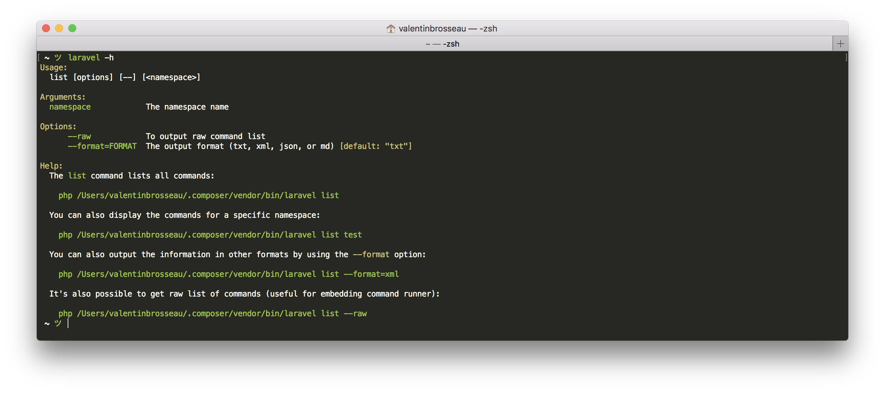
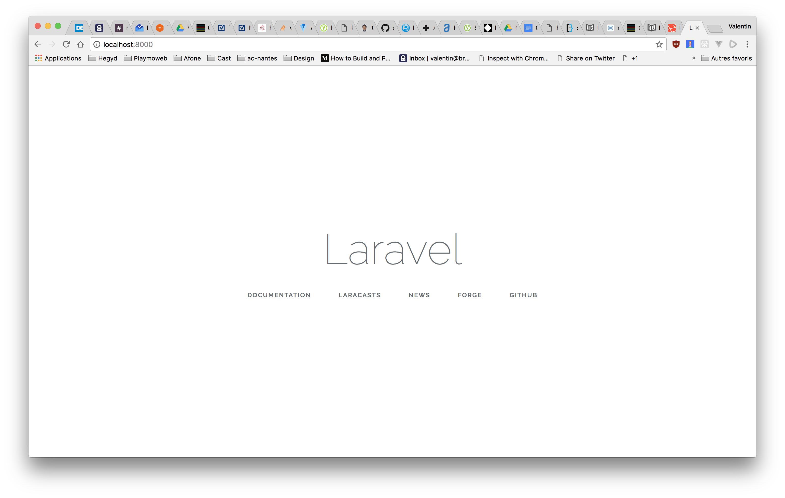

# Introduction à Laravel


::: details Sommaire
[[toc]]
:::

Dans ce TP nous allons couvrir l’installation, la configuration et la création d’un premier projet « démo » à base de Laravel.

## Introduction

Pour pouvoir utiliser Laravel, nous allons avoir besoin de différents outils :

- PHP7
- Composer

Il y a bien plus de dépendances, mais celles-ci seront récupérées automatiquement par `Composer`

### Windows

Pour « installer » Laravel sous Windows, vous devez dans un premier temps installer PHP7 sur votre machine. Dans un premier temps, installer Wamp + PHP7 :

- [Installation de Wamp.](http://www.wampserver.com/fr/#download-wrapper)
- Installer Wamp, et vérifier que celui-ci fonctionne correctement.
- Activer l’extension `php_openssl.dll` dans la liste des extensions PHP.

#### Installer Composer

- [Télécharger Composer pour Windows](https://getcomposer.org/Composer-Setup.exe), lors de l’installation il vous sera demandé de sélectionner l’exécutable PHP. `ATTENTION:` Bien sélectionner la version 8.0 minimum de PHP dans le dossier `C:\wamp\bin\php\php\8.X.X\bin\php.exe` <= Attention à prendre la bonne version (ou via XAMPP)
- vérifier que la commande est bien disponible en tapant `composer` dans un terminal

### Linux

Pour Linux c’est plus simple, il suffit d’installer PHP 7 sur votre machine (regarder la documentation de votre distribution). Une fois que PHP est installé, il suffit de faire :

```bash
php -r "copy('https://getcomposer.org/installer', 'composer-setup.php');"
php composer-setup.php
php -r "unlink('composer-setup.php');"
mv composer.phar /usr/local/bin/composer
```

Ajouter dans votre PATH la home de composer, exemple :

```bash
export PATH="$PATH:$HOME/.config/composer/vendor/bin"
```

::: tip Vous allez avoir besoin de paquets en plus

Si vous utilisez Ubuntu / Debian / Pop_OS! etc :

```sh
sudo apt install libapache2-mod-php php-common php-xml php-gd php-opcache php-mbstring php-tokenizer php-json php-bcmath php-zip unzip php-sqlite
```

Sans les paquets, vous ne pourrez pas continuer l'installation.

:::

### MacOS

Sur la dernière version de MacOS, PHP est déjà disponible en version 7. Il suffit donc d’installer `Composer`, pour l’installer il suffit :

```bash
php -r "copy('https://getcomposer.org/installer', 'composer-setup.php');"
php composer-setup.php
php -r "unlink('composer-setup.php');"
mv composer.phar /usr/local/bin/composer
```

Ajouter dans votre PATH la home de composer, exemple :

```bash
export PATH="$PATH:$HOME/.composer/vendor/bin"
```

Fermer et rouvrir le terminal.

## Installer Laravel

```bash
composer global require "laravel/installer"
```

✋ Vérifier que la commande laravel fonctionne. Comment faire ?
Pour vérifier que la commande `laravel` fonctionne, il suffit de faire dans une console `laravel -h`



## Créer le premier Projet

Votre poste est maintenant configuré pour Laravel, vous pouvez donc créer un nouveau projet grâce à la commande :

✋ Attention, le projet sera créé dans le dossier courant.

```bash
laravel new mon-premier-projet

# Ou

composer create-project --prefer-dist laravel/laravel mon-premier-projet
```

La commande va télécharger l'ensemble des dépendances nécessaire et va créer un dossier `mon-premier-projet` avec les sources.

::: tip Vous avez récupéré le projet via GIT ?

Si vous avez récupéré le projet depuis GIT vous n'allez bien évidemment pas utiliser la commande `create-project`… Par contre vous allez devoir réinstaller les dépendances (`vendor`) de votre projet. C'est très simple :

Dans le dossier de votre projet, lancer la commande :

```sh
composer install
```

:::

## Initialisation

Votre nouveau projet contient un fichier `.env` ouvrez-le, et éditez par exemple le nom du projet.

Questions :

- Le fichier est plutôt complet, à quoi servent les différents paramètres ?
- Dans les cours, je vous ai parlé de la APP_KEY, celle-ci est déjà remplie, à votre avis pourquoi ?

## Lancer le projet d’exemple

Laravel intègre un serveur de test permettant de valider son développement avec rien d’autre que PHP sur sa machine. Pour ça, dans le dossier du projet (`cd mon-premier-projet`) vous pouvez faire la commande suivante :

```bash
php artisan serve
```

Rendez-vous maintenant dans [votre navigateur](http://localhost:8000) pour voir le site de démonstration fourni par Laravel.



## Modification du template par défaut

Éditer le fichier `resources/views/welcome.blade.php`, ajouter la variable `$titre`. La syntaxe « blade » est la suivante <span v-pre>`{{ $titre }}`</span>.

Localiser dans le code l'endroit ou le logo de Laravel est affiché. Ajouter en dessous « <span v-pre>`{{ $titre }}`</span> ». Vous avez défini votre première variable c'est bien ! Mais pour l'instant rien ne se passe… Pour que quelque chose s'affiche :

Éditer le fichier `routes/web.php`, transformer :

```php
return view('welcome');
```

en

```php
return view('welcome', ['titre' => 'Mon premier exemple.']);
```

💡 Vous pouvez également appeler des fonctions dans les templates, exemple `time()`. Tester cette fonction en ajoutant :

```html
<p>Le Timestamp est {{ time() }}</p>
```

Questions :

- À votre avis est-il possible d'appeler d'autres fonctions ?

## Ajouter une nouvelle Route

Pour tester le fonctionnement, nous allons ajouter une nouvelle `Route` dans le projet de démonstration. Nous allons donc `ajouter` dans le fichier `routes/web.php` :

```php
Route::get('/ping', function () {
    return "pong";
});
```

Tester la modification en [accédant à votre site](http://localhost:8000/ping)

<Reveal text="Voir l’une des solutions possibles">

```php
Route::get('/', function () {
    return view('welcome', ['titre' => 'Mon premier exemple.']);
});

Route::get('/ping', function () {
    return "pong";
});
```

</Reveal>

::: danger Un instant

Nous avons écrit un peu de code. Vous avez pensé à GIT ? Git est en effet préconfiguré dans Laravel, nous avons de base un fichier `.gitignore` celui-ci limite l'ajout de quelques fichiers :

- `.env`
- Le dossier `vendor` etc…

Vous pouvez donc commiter sans problème vos sources.

:::

## Ajouter une nouvelle vue

Maintenant que nous avons déclaré une nouvelle route, nous allons revoir légèrement les templates pour :

- Déclarer un template principal (aussi appelé : layout).
- Modifier le welcome.blade.php pour y faire référence.
- Utiliser le layout pour répondre `pong`.

Question :

- À votre avis pourquoi un tel découpage ?

### Créer le layout

Créer un nouveau fichier `resources/views/layouts/base.blade.php` avec le contenu suivant :

```html
<!DOCTYPE html>
<html lang="{{ app()->getLocale() }}">
  <head>
    <meta charset="utf-8" />
    <meta http-equiv="X-UA-Compatible" content="IE=edge" />
    <meta name="viewport" content="width=device-width, initial-scale=1" />

    <title>Laravel - @yield('title')</title>

    <!-- Fonts -->
    <link
      href="https://fonts.googleapis.com/css?family=Raleway:100,600"
      rel="stylesheet"
      type="text/css"
    />

    <!-- Styles -->
    <style>
      html,
      body {
        background-color: #fff;
        color: #636b6f;
        font-family: "Raleway", sans-serif;
        font-weight: 100;
        height: 100vh;
        margin: 0;
      }
      .full-height {
        height: 100vh;
      }
      .flex-center {
        align-items: center;
        display: flex;
        justify-content: center;
      }
      .position-ref {
        position: relative;
      }
      .top-right {
        position: absolute;
        right: 10px;
        top: 18px;
      }
      .content {
        text-align: center;
      }
      .title {
        font-size: 84px;
      }
      .links > a {
        color: #636b6f;
        padding: 0 25px;
        font-size: 12px;
        font-weight: 600;
        letter-spacing: 0.1rem;
        text-decoration: none;
        text-transform: uppercase;
      }
      .m-b-md {
        margin-bottom: 30px;
      }
    </style>
  </head>
  <body>
    <div class="flex-center position-ref full-height">
      @if (Route::has('login'))
      <div class="top-right links">
        @auth
        <a href="{{ url('/home') }}">Home</a>
        @else
        <a href="{{ route('login') }}">Login</a>
        <a href="{{ route('register') }}">Register</a>
        @endauth
      </div>
      @endif

      <div class="content">@yield('content')</div>
    </div>
  </body>
</html>
```

✋ Mais d’où vient ce contenu ? C’est tout simplement un découpage en « layout » du template de base de démonstration.

Question :

- À votre avis, à quoi sert le mot-clé `@yield` ?

### Utiliser le layout dans welcome.blade.php

Maintenant que nous avons notre template de base, nous allons l’utiliser dans le template « Welcome ». Remplacer le contenu de `resources/views/welcome.blade.php` par :

```html
@extends('layouts.base') @section('title', 'Bienvenue') @section('content')
<div class="title m-b-md">Laravel</div>

<div class="links">
  <a href="https://laravel.com/docs">Documentation</a>
  <a href="https://laracasts.com">Laracasts</a>
  <a href="https://laravel-news.com">News</a>
  <a href="https://forge.laravel.com">Forge</a>
  <a href="https://github.com/laravel/laravel">GitHub</a>
</div>
@endsection
```

### Utiliser le layout dans la route Pong

Bon, maintenant que nous avons déclaré un layout utilisons-le dans la 2nd route ([/ping](http://localhost:8000/ping)) que nous avons créé tout à l’heure. Pour cette dernière action je ne vous donne pas de code, mais uniquement les étapes :

- Créez une Vue par exemple `ping.blade.php` (Dans le dossiers `views`)
- Utilisez `@extends('layouts.base')` pour « hériter » de votre layout principal.
- Modifiez `web.php` pour répondre avec la fonction `view` comme dans l’autre route. (en vous inspirant de l'autre déjà présente)

Avec ces quelques explications, vous allez pouvoir atteindre l’objectif. Bon courage.

<Reveal text="Voir l’une des solutions possibles pour ping.blade.php">

```php
@extends('layouts.base')

@section('title', 'Bienvenue')

@section('content')
   <h1>PONG</h1>
@endsection
```

</Reveal>

## Les composants

Au passage, nous avons maintenant (en Laravel 8) une autre façon de définir des templates / « morceaux de codes réutilisables ». C'est via un composant, nous détaillerons cette pratique un peu plus tard.

Le principe est très proche de l'héritage des templates vu précédemment. À la différence que nous allons avoir à notre disposition des balises personnalisées comme par exemple `<x-layout-base>` ou `<x-card></x-card>` ; c'est balise font référence à du code placé dans le dossier `resources/views/components/`.

Cette notation est très récente et n'est disponible qu'à partir de **Laravel 8**.

Nous utiliserons les composants dans le TP Authentification.

[Pour les plus curieux, la documentation officielle est disponible ici](https://laravel.com/docs/8.x/blade#components)

::: tip Un composant
L'organisation en composant est très populaire en ce moment, elle est la base de beaucoup de frameworks moderne. Vous devriez vivement vous y intéresser.

C'est par exemple la base du fonctionnement de VueJS 👌.
:::

## Utiliser un contrôleur

La force de Laravel est sa structure, nous avons vu ensemble que celui-ci propose un découpage « précis » et clair des couches « MVC » (Modèle, Vue, Controlleur). Nous allons donc organiser notre code pour utiliser un Contrôleur (qui je le rappelle à pour but de répondre aux requêtes HTTP des clients).

### Le Contrôleur:

C'est la première étape, un tour dans la console / terminal pour créer notre premier contrôleur.

```sh
php artisan make:controller PingPongControleur
```

Laravel, viens donc de créer un nouveau fichier dans votre projet, pour l'instant celui-ci est vide (aucune méthode).

::: tip C'est dans le terminal / console
Oui, c'est encore dans le terminal / console … Mais, nous gagnons du temps. Qui maitrise son clavier maitrise son ordinateur 👀.
:::

Notre contrôleur va contenir `deux méthodes`, ces deux méthodes vont représenter les deux `routes` de notre application :

|  Route  | Méthode  |
| :-----: | :------: |
| `/ping` | `ping()` |
| `/pong` | `pong()` |

Nous allons donc devoir ajouter dans notre `contrôleur` les deux routes. Je vous laisse ouvrir le `PingPongControleur` pour y ajouter les méthodes suivantes :

```php
    public function ping()
    {
        return view('ping', []);
    }

    public function pong()
    {
        return view('pong', []);
    }
```

::: warning [] ?
Vous avez oublié la signification des `[]` ? C'est « simplement » les données que nous pourrions envoyer à notre vue. Pratique !
:::

### Les routes

Nous allons maintenant ajouter les routes, pour rappel les routes sont ce qui permet aux utilisateurs d'accéder à vos contrôleurs. L'ensemble des routes sont à déclarer dans le fichier `routes/web.php`, éditer le pour y ajouter vos routes :

```php
Route::get('/ping', ['App\Http\Controllers\PingPongControleur', 'ping']);
```

Je vous laisse écrire la seconde `route` en fonction de ce que je vous ai fourni.

::: tip Une astuce ?

Vous pouvez simplement vérifier que votre route est bien prise en compte via la commande :

```sh
php artisan route:list
```

:::

### Les vues

Vous l'avez réalisé précédemment, je vous laisse écrire les deux `vue` / `layout`. Attention à bien hériter de votre « Layout de base » (`@extends('layouts.base')`) comme dans la précédente vue.

## La base de données

L'avantage d'utiliser un Framework, c'est qu'il est très simple d'y intégrer la partie base de données, contrairement à un développement classique où tout est a « ré-inventer » un framework nous donne une structure / un cadre pour aller plus vite. Comme pour la création du contrôleur, la première étape va passer par de la ligne de commande.

```sh
php artisan make:model Demo --migration
```

Cette commande va créer « la définition du modèle » (le modèle la représentation objet de notre table), mais également la migration. La migration est le fichier qui va définir la structure de notre `Table`. Vous avez maintenant, dans votre projet, deux nouveaux fichiers :

- `app/Models/Demo.php`
- `database/migrations/YEAR_MONTH_DAY_TIME_create_demos_table.php`

### Définir la migration (structure de la table)

Le fichier de migration défini la structure de la table que vous allez créer, actuellement vous avec un « format type », votre table va contenir de base quelques colonnes (id, et dates). Nous allons ajouter dans la méthode `up()` nos colonnes :

```php
$table->string('texte');
```

Je vous laisse l'ajouter avec les autres champs.

::: details Vous avez un doute sur comment faire ? (je vous invite vraiment à le faire sans regarder la solution)

```php
<?php

use Illuminate\Database\Migrations\Migration;
use Illuminate\Database\Schema\Blueprint;
use Illuminate\Support\Facades\Schema;

class CreateDemosTable extends Migration
{
    /**
     * Run the migrations.
     *
     * @return void
     */
    public function up()
    {
        Schema::create('demos', function (Blueprint $table) {
            $table->id();
            $table->string('texte');
            $table->timestamps();
        });
    }

    /**
     * Reverse the migrations.
     *
     * @return void
     */
    public function down()
    {
        Schema::dropIfExists('demos');
    }
}
```

:::

### Définition du modèle

Vous vous en doutez, si nous avons ajouté un champ dans notre « migration » / « table », nous allons devoir l'ajouter également dans notre modèle ! Pour ça je vous laisse éditer le fichier `app/Models/Demo.php` pour y ajouter :

```php
    protected $fillable = ['texte'];
```

Avec cet ajout, nous indiquons à Laravel que nous allons avoir un champ `texte` qui pourra être assigné en automatique lors de la création d'une entrée en base de données.

::: tip optionnel, mais intéressant !
Cette propriété est optionnelle, elle vous autorisera plus tard à faire du « mass-assignment » c'est-à-dire à créer un objet « Demos » depuis par exemple le POST HTTP.
:::

### Créer réellement vos tables

Maintenant que le script est terminé, nous allons indiquer à Laravel d'effectuer « la migration » c'est-à-dire de transformer votre définition PHP en instruction SQL pour créer réellement la base de données.

Retour dans la ligne de commande :

```sh
$ php artisan migrate
[…]
Migrating: YEAR_MONTH_DAY_TIME_create_demos_table
Migrated:  YEAR_MONTH_DAY_TIME_create_demos_table
```

::: warning Un instant
Je vous laisse configurer votre `.env` mais également vérifier si votre base de données fonctionne correctement (création etc).
:::

### Requêter votre table

Pour vous montrer la simplicité de Eloquent, je vous laisse juste avec les appels de méthodes (nous avons vu ça ensemble lors du cours)

::: danger Liste non exhaustive
Vous n’avez ici qu'une petite liste de ce qu'il est possible de faire. Pour voir l'ensemble, je vous suggère plutôt [la documentation officielle](https://laravel.com/docs/8.x/eloquent)
:::

#### Obtenir toutes les données

Voilà un exemple de code pour obtenir l'ensemble des données dans la table `demo`.

```php
$valeursEnBase = Demo::all()
```

#### Obtenir toutes les données avec filtre

Voilà un exemple de code pour obtenir 10 lignes de données avec un filtre et trié par `id`.

```php
$valeursFiltre = Demo::where('texte', "YOLO")->orderBy('id')->take(10)
```

::: danger Ce ne sont que des exemples

Vous avez ici des exemples, ça ne sert à rien de les prendres maintenant. Nous allons les utiliser **dans votre contrôleurs**.

:::

#### Utiliser les données depuis votre « vue »

Et c'est tellement simple que si vous souhaitez tout récupérer pour utiliser les données il vous suffit de faire :

```php
public function listDemo(Request $request){
  // Retourne à l'utilisateur le template nommés « monLayout » avec dedans une variable nommé `$demos` qui contiendra l'ensemble des éléments dans la table
  // Votre template devra utiliser cette variable avec par exemple un @foreach($demos as $demo) … @endforeach
  return view("monLayout", ["demos" => Demo::all()]);
}
```

::: danger Un instant ✋

En PHP objet il y a la notion de namespace, Laravel utilise de base les namespace, ça veut dire que nous allons avoir à utiliser le mot clé `use` pour importer (include). Quand vous voulez utiliser une classe qui n'est pas dans le même fichier, il faudra déclarer l'emplacement via un `use`. Exemple, pour que `Demo` soit accessible depuis le contrôleur il faudra :

```php
use App\Models\Demo;
```

- ⚠️ Si vous utilisez **PHPStorm** cet import sera automatique.
- ⚠️ Si vous utilisez **VSCode** il faudra passer par une extension [Disponible ici](https://marketplace.visualstudio.com/items?itemName=MehediDracula.php-namespace-resolver)

Pour **PHPStorm**, alt+entrée permettra de déclencher l'ajout du use.

Pour **VSCode** je vous laisse regarder l'usage de l'extension :


:::

#### Créer des données depuis un formulaire en POST

```php
public function addDemo(Request $request){
    Demos::create($request->all());
    return redirect("/demo");
}
```

### Finaliser

À partir de maintenant vous avez tout ce qu'il faut pour interroger votre base de données… Et oui c'est aussi simple que ça ! Pour la suite je vous laisse écrire le code par vous-même, mais la procédure va être la suivante :

- Créer un contrôleur « DemoControleur ».
- Créer la `Vue` (template blade) associée à votre contrôleur.
- Ajouter la route qui permettra d'accéder à cette page.
- Ajouter une méthode qui va afficher l'ensemble des entrées présent dans votre base de données (affichage dans une `table` html).
- Ajouter un formulaire dans votre `Vue` permettant d'ajouter des données dans la table.

::: tip Un instant

Nous l'avons vu en cours, la syntaxe du moteur de template blade. Ici il faudra donc bien utiliser Blade pour générer **votre page**, et plus particulièrement [les directives de blades](/cheatsheets/laravel/#les-directives). Vous allez devoir utiliser la boucle `Foreach`, la notation est rappelée dans l'aide mémoire. Mais voilà une idée de ce qu'il faudra faire :

```html
<table>
  @foreach($LaVariableAvecLesValeursEnBase as $unElement)
  <tr>
    <td>{{$unElement->texte}}</td>
  </tr>
  @endforeach
</table>
```

:::

::: danger N'oubliez pas
Utilisez `@extends('layouts.base')` pour « hériter » de votre layout principal.
:::

::: danger N'oubliez pas le CSRF
Je vous ai parlé de la sécurité non ? Laravel intègre directement la protection anti-rejeux. Pour pouvoir valider votre formulaire, vous allez devoir intégrer dans votre formulaire une petite annotation.

`@csrf`

Exemple :

```html
<form method="POST" action="/VOTRE-ACTIO-DEFINI-DANS-LES-ROUTES">
  @csrf

  <!-- La suite de votre formulaire -->
</form>
```

PS: Je vous laisse constater l'impact dans le code **en observant le code source via votre navigateur**.

[Plus d'information](https://laravel.com/docs/8.x/csrf)

:::

### Changer l'état d'une TODO

En utilisant [l'aide mémoire](https://cours.brosseau.ovh/cheatsheets/laravel/) et la [documentation de Laravel](https://laravel.com/docs/8.x/eloquent) ajouter :

- Une action permettant de marquer « comme terminer » une TODO. (l'action peut-être un lien, ou un bouton)
- Cette action doit être mise dans le bon contrôleur

::: tip Rappel

```php
// Rechercher celui avec l’id 1
$todo = App\TodoList::find("L'ID QUE VOUS SOUHAITEZ MODIFIER")->first();

// Le passer à terminer
$todo->termine = true;

// Le sauvegarder en base de données
$todo->save();
```

#### Besoin d'aide ?

Je ne vais pas vous donner le code. Mais plutôt la procédure vous devez :

- Pour chaque ligne de votre tableau : ajouter un lien qui permettra de modifier l'état d'un élément en base. Le lien peut-être du type <code v-pre>`/todo/terminer/{{ $unElement->id}}`</code>.
- Ajout d'une route permettant de faire fonctionner le lien. Exemple : <code v-pre>`Route::get('/todo/terminer/{id}', ['App\Http\Controllers\DemoControleur', 'markAsDone']);`</code>.
- Ajouter la méthode `markAsDone` dans votre contrôleur `public function markAsDone($id)`, celle-ci va réaliser l'action de marquer comme « terminer » pour la TODO `$id`
- À la fin du traitement, vous devez rediriger la personne avec `return redirect("/demo");`

### Supprimer une TODO

En utilisant [l'aide mémoire](https://cours.brosseau.ovh/cheatsheets/laravel/) et la [documentation de Laravel](https://laravel.com/docs/8.x/eloquent) ajouter :

- Une action permettant de marquer « supprimer » une TODO.
- Cette action doit être mise dans le bon contrôleur

::: tip Rappel

```php
// Façon 1
// Rechercher celui avec l’id 1
$todo = App\TodoList::find(1)->first();
$todo->delete(); // Le supprimer

// Façon 2
// Le supprimer directement
App\TodoList::destroy(1);

// Façon 3
// En supprimer plusieurs directement
App\TodoList::destroy(1,2,3);

// Façon 4
// Supprimer avec une condition
App\TodoList::where('termine', '==', 1)->delete();
```

N'oubliez pas la sécurité.

::: details Besoin d'aide ?
Ici pas de code, mais la procédure sera identique à celle de l'action terminer.
:::

:::

### Évolution 1

J'aimerais que notre petit site de démonstration intègre un formulaire de contact. Je vous laisse réfléchir comment réaliser l'opération, quelques pistes pour débuter :

- Le formulaire doit être en HTML.
- Les demandes faites via le formulaire doivent être sauvegardées en base de données (table spécifique, avec un id, un titre, un texte, un email et les dates).
- L'ajout doit être fait par un modèle.
- Vous devez créer un contrôleur spécifique pour réaliser l'opération.

C'est à vous ! Je suis là si besoin 🚀.
