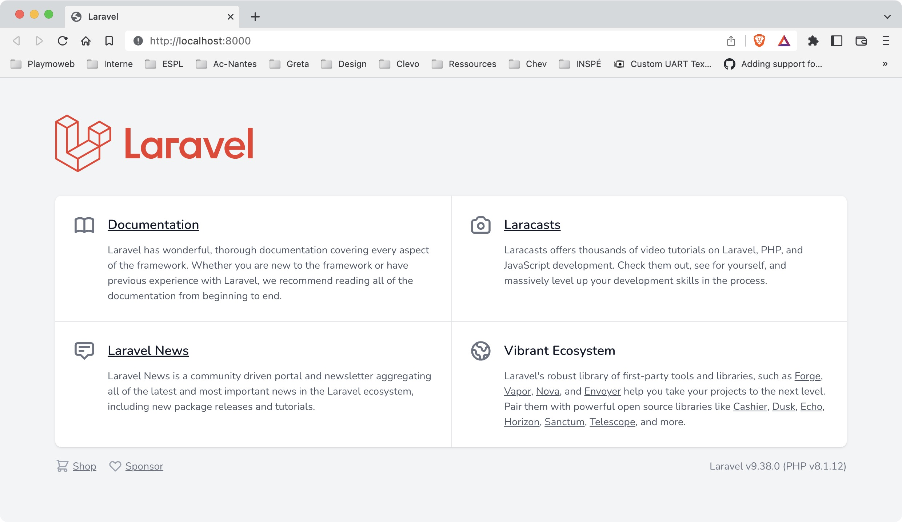

# Introduction à Laravel


::: details Sommaire
[[toc]]
:::

Dans ce TP nous allons couvrir l’installation, la configuration et la création d’un premier projet « démo » à base de Laravel.

::: danger TP découverte

Nous sommes sur le premier TP de découverte de Laravel. Nous allons voir les bases du framework. Il est donc **très guidé**.

Je vous laisse donc, faire très attention à chaque étape, et surtout à bien comprendre le fonctionnement des éléments évoqués.

👋 Si vous avez des questions, n'hésitez pas

:::

## Prérequis

Ce TP fait suite au TP [Transition vers Laravel](/tp/php/tp6.md), votre poste est donc normalement déjà prêt avec :

- PHP 8 (8.3 minimum).
- Composer.

Il y a bien plus de dépendances, mais celles-ci seront récupérées automatiquement par `Composer`.

::: details Votre poste n'est pas prêt ? (Windows, Linux, macOS)

La procédure complète est détaillée dans [la partie préparation du TP Transition vers Laravel](/tp/php/tp6.md#preparation). En résumé :

- **Windows** : installer [Wamp](http://www.wampserver.com/fr/#download-wrapper) (rien à faire si vous utilisez Xampp), activer l'extension `php_openssl.dll`, puis installer [Composer](https://getcomposer.org/Composer-Setup.exe) en sélectionnant bien PHP 8.3 minimum. Alternative recommandée : WSL avec [AlpineWSL-web](https://github.com/c4software/AlpineWSL-web/releases), un environnement Linux prêt pour le développement web.
- **Linux** : installer PHP 8 via votre distribution, puis Composer :

```bash
curl -sS https://getcomposer.org/installer | php
sudo mv composer.phar /usr/local/bin/composer
chmod +x /usr/local/bin/composer
```

- **macOS** : `brew install php` (Brew s'installe en suivant [la documentation officielle](https://brew.sh/fr/)).

:::

Dans ce TP, je vous invite à avoir en parallèle :

- [L'aide mémoire Laravel](/cheatsheets/laravel/)
- [La synthèse des commandes](/cheatsheets/laravel/quick.md)

## Créer le premier Projet

Votre poste est maintenant configuré pour Laravel, vous pouvez donc créer un nouveau projet grâce à la commande :

✋ Attention, le projet sera créé dans le dossier courant.

```bash
composer create-project --prefer-dist laravel/laravel mon-premier-projet
```

La commande va télécharger l'ensemble des dépendances nécessaire et va créer un dossier `mon-premier-projet` avec les sources.

::: tip Vous avez récupéré le projet via GIT ?

Si vous avez récupéré le projet depuis GIT vous n'allez bien évidemment pas utiliser la commande `create-project`… Par contre vous allez devoir réinstaller les dépendances (`vendor`) de votre projet. C'est très simple :

Dans le dossier de votre projet, lancer la commande :

```sh
composer install
```

:::

## Initialisation

Votre nouveau projet contient un fichier `.env` ouvrez-le, et éditez par exemple le nom du projet.

Questions :

- Le fichier est plutôt complet, à quoi servent les différents paramètres ?
- Dans les cours, je vous ai parlé de la APP_KEY, celle-ci est déjà remplie, à votre avis pourquoi ?

## Lancer le projet d’exemple

Laravel intègre un serveur de test permettant de valider son développement avec rien d’autre que PHP sur sa machine. Pour ça, dans le dossier du projet (`cd mon-premier-projet`) vous pouvez faire la commande suivante :

```bash
php artisan serve
```

Rendez-vous maintenant dans [votre navigateur](http://localhost:8000) pour voir le site de démonstration fourni par Laravel.



## Modification du template par défaut

Éditer le fichier `resources/views/welcome.blade.php`, ajouter la variable `$titre`. La syntaxe « blade » est la suivante <span v-pre>`{{ $titre }}`</span>.

Localiser dans le code l'endroit où le logo de Laravel est affiché. Ajouter en dessous « <span v-pre>`{{ $titre }}`</span> ». Vous avez défini votre première variable c'est bien ! Mais pour l'instant rien ne se passe… Pour que quelque chose s'affiche :

Éditer le fichier `routes/web.php`, transformer :

```php
return view('welcome');
```

en

```php
return view('welcome', ['titre' => 'Mon premier exemple.']);
```

💡 Vous pouvez également appeler des fonctions dans les templates, exemple `time()`. Tester cette fonction en ajoutant :

```html
<p>Le Timestamp est {{ time() }}</p>
```

Questions :

- À votre avis est-il possible d'appeler d'autres fonctions ?

## Ajouter une nouvelle Route

Pour tester le fonctionnement, nous allons ajouter une nouvelle `Route` dans le projet de démonstration. Nous allons donc `ajouter` dans le fichier `routes/web.php` :

```php
Route::get('/ping', function () {
    return "pong";
});
```

Tester la modification en [accédant à votre site](http://localhost:8000/ping)

<Reveal text="Voir l’une des solutions possibles">

```php
Route::get('/', function () {
    return view('welcome', ['titre' => 'Mon premier exemple.']);
});

Route::get('/ping', function () {
    return "pong";
});
```

</Reveal>

::: danger Un instant

Nous avons écrit un peu de code. Vous avez pensé à GIT ? Git est en effet préconfiguré dans Laravel, nous avons de base un fichier, `.gitignore` celui-ci limite l'ajout de quelques fichiers :

- `.env`
- Le dossier `vendor` etc…

Vous pouvez donc commiter sans problème vos sources.

:::

## Ajouter une nouvelle vue

Maintenant que nous avons déclaré une nouvelle route, nous allons revoir légèrement les templates pour :

- Déclarer un template principal (aussi appelé : layout).
- Modifier le welcome.blade.php pour y faire référence.
- Utiliser le layout pour répondre `pong`.

Question :

- À votre avis pourquoi un tel découpage ?

### Créer le layout

Créer un nouveau fichier `resources/views/layouts/base.blade.php` avec le contenu suivant :

```html
<!DOCTYPE html>
<html lang="{{ app()->getLocale() }}">
  <head>
    <meta charset="utf-8" />
    <meta http-equiv="X-UA-Compatible" content="IE=edge" />
    <meta name="viewport" content="width=device-width, initial-scale=1" />

    <title>Laravel - @yield('title')</title>

    <!-- Fonts -->
    <link
      href="https://fonts.googleapis.com/css?family=Raleway:100,600"
      rel="stylesheet"
      type="text/css"
    />

    <!-- Styles -->
    <style>
      html,
      body {
        background-color: #fff;
        color: #636b6f;
        font-family: "Raleway", sans-serif;
        font-weight: 100;
        height: 100vh;
        margin: 0;
      }
      .full-height {
        height: 100vh;
      }
      .flex-center {
        align-items: center;
        display: flex;
        justify-content: center;
      }
      .position-ref {
        position: relative;
      }
      .top-right {
        position: absolute;
        right: 10px;
        top: 18px;
      }
      .content {
        text-align: center;
      }
      .title {
        font-size: 84px;
      }
      .links > a {
        color: #636b6f;
        padding: 0 25px;
        font-size: 12px;
        font-weight: 600;
        letter-spacing: 0.1rem;
        text-decoration: none;
        text-transform: uppercase;
      }
      .m-b-md {
        margin-bottom: 30px;
      }
    </style>
  </head>
  <body>
    <div class="flex-center position-ref full-height">
      @if (Route::has('login'))
      <div class="top-right links">
        @auth
        <a href="{{ url('/home') }}">Home</a>
        @else
        <a href="{{ route('login') }}">Login</a>
        <a href="{{ route('register') }}">Register</a>
        @endauth
      </div>
      @endif

      <div class="content">@yield('content')</div>
    </div>
  </body>
</html>
```

✋ Mais d’où vient ce contenu ? C’est tout simplement un découpage en « layout » du template de base de démonstration.

Question :

- À votre avis, à quoi sert le mot-clé `@yield` ?

### Utiliser le layout dans welcome.blade.php

Maintenant que nous avons notre template de base, nous allons l’utiliser dans le template « Welcome ». Remplacer le contenu de `resources/views/welcome.blade.php` par :

```html
@extends('layouts.base') @section('title', 'Bienvenue') @section('content')
<div class="title m-b-md">Laravel</div>

<div class="links">
  <a href="https://laravel.com/docs">Documentation</a>
  <a href="https://laracasts.com">Laracasts</a>
  <a href="https://laravel-news.com">News</a>
  <a href="https://forge.laravel.com">Forge</a>
  <a href="https://github.com/laravel/laravel">GitHub</a>
</div>
@endsection
```

### Utiliser le layout dans la route Pong

Bon, maintenant que nous avons déclaré un layout utilisons-le dans la 2nd route ([/ping](http://localhost:8000/ping)) que nous avons créée tout à l’heure. Pour cette dernière action, je ne vous donne pas de code, mais uniquement les étapes :

- Créez une Vue par exemple `ping.blade.php` (dans le dossier `views`)
- Utilisez `@extends('layouts.base')` pour « hériter » de votre layout principal.
- Modifiez `web.php` pour répondre avec la fonction `view` comme dans l’autre route. (en vous inspirant de l'autre déjà présente)

Avec ces quelques explications, vous allez pouvoir atteindre l’objectif. Bon courage.

<Reveal text="Voir l’une des solutions possibles pour ping.blade.php">

```php
@extends('layouts.base')

@section('title', 'Bienvenue')

@section('content')
   <h1>PONG</h1>
@endsection
```

</Reveal>

## Les composants

Au passage, nous avons maintenant (**depuis Laravel 8**) une autre façon de définir des templates / « morceaux de codes réutilisables ». C'est via un composant, nous détaillerons cette pratique un peu plus tard.

Le principe est très proche de l'héritage des templates vu précédemment. À la différence que nous allons avoir à notre disposition des balises personnalisées comme par exemple `<x-layout-base>` ou `<x-card></x-card>` ; ces balises font référence à du code placé dans le dossier `resources/views/components/`.

Cette notation est très récente et n'est disponible qu'à partir de **Laravel 8**.

Nous utiliserons les composants dans le TP [Aller plus loin avec Laravel](./aller_plus_loin.md).

[Pour les plus curieux, la documentation officielle est disponible ici](https://laravel.com/docs/11.x/blade#components)

::: tip Un composant
L'organisation en composant est très populaire en ce moment, elle est la base de beaucoup de frameworks moderne. Vous devriez vivement vous y intéresser.

C'est par exemple la base du fonctionnement de VueJS 👌.
:::

## Utiliser un contrôleur

La force de Laravel est sa structure, nous avons vu ensemble que celui-ci propose un découpage « précis » et clair des couches « MVC » (Modèle, Vue, Contrôleur). Nous allons donc organiser notre code pour utiliser un Contrôleur (qui je le rappelle a pour but de répondre aux requêtes HTTP des clients).

### Le Contrôleur:

C'est la première étape, un tour dans la console / terminal pour créer notre premier contrôleur.

```sh
php artisan make:controller PingPongControleur
```

Laravel, viens donc de créer un nouveau fichier dans votre projet, pour l'instant celui-ci est vide (aucune méthode).

::: tip c'est dans le terminal / console
Oui, c'est encore dans le terminal / console … Mais, nous gagnons du temps. Qui maîtrise son clavier maîtrise son ordinateur 👀.
:::

Notre contrôleur va contenir `deux méthodes`, ces deux méthodes vont représenter les deux `routes` de notre application :

|  Route  | Méthode  |
| :-----: | :------: |
| `/ping` | `ping()` |
| `/pong` | `pong()` |

Nous allons donc devoir ajouter dans notre `contrôleur` les deux routes. Je vous laisse ouvrir le `PingPongControleur` pour y ajouter les méthodes suivantes :

```php
    public function ping()
    {
        return view('ping', []);
    }

    public function pong()
    {
        return view('pong', []);
    }
```

::: warning [] ?
Vous avez oublié la signification des `[]` ? C'est « simplement » les données que nous pourrions envoyer à notre vue. Pratique !
:::

### Les routes

Nous allons maintenant ajouter les routes, pour rappel les routes sont ce qui permet aux utilisateurs d'accéder à vos contrôleurs. L'ensemble des routes sont à déclarer dans le fichier `routes/web.php`, éditer le pour y ajouter vos routes :

```php
Route::get('/ping', [PingPongControleur::class, 'ping']);
```

Je vous laisse écrire la seconde `route` en fonction de ce que je vous ai fourni.

::: tip Une astuce ?

Vous pouvez simplement vérifier que votre route est bien prise en compte via la commande :

```sh
php artisan route:list
```

:::

::: tip Les routes nommées

Dans les projets professionnels, vous verrez très souvent les routes déclarées avec un **nom** :

```php
Route::get('/ping', [PingPongControleur::class, 'ping'])->name('ping');
```

Ce nom permet ensuite de générer l'URL sans l'écrire en dur : <code v-pre>{{ route('ping') }}</code> dans une vue, ou `redirect()->route('ping')` dans un contrôleur. Avantage : si l'URL change un jour, le reste du code continue de fonctionner sans modification.

Dans nos TP nous utiliserons les URL directement pour rester simples, mais retenez cette écriture : vous la croiserez dans tous les vrais projets (notamment en AP).

:::

### Les vues

Vous l'avez réalisé précédemment, je vous laisse écrire les deux `vue` / `layout`. Attention à bien hériter de votre « Layout de base » (`@extends('layouts.base')`) comme dans la précédente vue.

### Les directives

Avant de continuer le partie technique, nous allons regarder comment afficher des données dans nos vues. Nous allons surtout voir comment `manipuler` les données dans les vues.

En Laravel ce qu'il faut retenir c'est que nous avons des `directives`. Chaque directive est en général une action que vous auriez pu faire en PHP. Par exemple :

- Pour afficher une variable, vous pouvez utiliser `{ { $variable } }` (c'est l'équivalent de `echo $variable` en PHP)
- Pour faire une boucle, vous pouvez utiliser `@foreach($variable as $valeur) … @endforeach` (c'est l'équivalent de `foreach($variable as $valeur) { … }` en PHP)
- Pour faire une condition, vous pouvez utiliser `@if($variable) … @endif` (c'est l'équivalent de `if($variable) { … }` en PHP)

#### Afficher une variable

Nous allons donc modifier notre vue `ping.blade.php` pour afficher un variable `word`, pour cela ajouter dans votre vue (au bon endroit) :

```html
<h1>{{ $word }}</h1>
```

Et dans votre contrôleur, ajouter la variable `word` dans le tableau :

```php
return view('ping', ['word' => 'PING']);
```

C'est à vous. Je vous laisse simplifier le code de la vue `pong.blade.php` pour afficher `PONG`.

::: tip Une astuce ?

Si vous avez compris le principe… vous observerez que vous pouvez supprimer la vue `pong.blade.php` et simplement modifier le contrôleur pour afficher `PONG` dans la vue `ping.blade.php`.

Une question ? Je suis là pour vous aider.

:::

#### Créer une boucle

Maintenant que nous avons une variable, nous allons aller un peu plus loin. Nous allons créer une boucle pour afficher le contenu de la variable `$_SERVER` (qui contient les informations sur le serveur).

Pour cela, ajouter dans votre vue `ping.blade.php` :

```html
<ul>
  @foreach($serverInfo as $key => $value)
  <li>{{ $key }} : {{ $value }}</li>
  @endforeach
</ul>
```

Je vous laisse ajouter dans votre contrôleur la variable `$serverInfo` pour que la boucle fonctionne.

::: details Besoin d'aide ?

Votre contrôleur permet de passer des variables à votre vue. En lisant le code, vous devez observer la présence de la variable `$serverInfo` dans la vue `ping.blade.php`. Vous devez donc ajouter cette variable dans le tableau de la méthode `ping`.

Cette variable doit contenir les informations du serveur, pour cela vous pouvez utiliser la fonction `$_SERVER` de PHP.

Nous pourrions donc écrire :

```php
return view('ping', ['word' => 'PING', 'serverInfo' => $_SERVER]);
```

:::

#### Créer une condition

Pour finir, nous allons ajouter une condition dans notre vue `ping.blade.php`. Nous allons créer une condition, pour afficher un message différent en fonction de la valeur de la variable `word`.

Pour cela, ajouter dans votre vue `ping.blade.php` :

```html
@if($word == 'PING')
<p>La page est en mode PING ({{ time() }})</p>
@else
<p>La page est en mode PONG ({{ time() }})</p>
@endif
```

Je vous laisse ajouter cette condition dans votre vue.

Évidemment, il est possible de faire des conditions plus complexes, mais pour l'instant nous allons rester sur quelque chose de simple.

::: tip Une utilité de la condition

La système de condition est très pratique pour afficher ou pas des éléments en fonction de l'état de connexion de l'utilisateur par exemple. Avec Laravel, pour afficher ou non un bouton de connexion, il suffit de faire :

```html
@if(Auth::check())
<a href="{{ route('logout') }}">Déconnexion</a>
@else
<a href="{{ route('login') }}">Connexion</a>
@endif
```

:::

#### Les messages flash

La dernière directive intéressante que nous allons voir est la gestion des erreurs. Laravel propose un système de message flash, c'est-à-dire un message qui va s'afficher une seule fois (à la prochaine requête).

Ce système nous sera utile pour afficher des messages d'erreurs ou de succès.

Pour tester cette fonctionnalité, nous allons créer un nouveau contrôleur `TestFlashController` (car pourquoi pas). Ce contrôleur va contenir deux méthodes :

- `main` qui va afficher un formulaire.
- `traitement` qui va traiter le formulaire.

La méthode `main` va afficher un formulaire avec un champ `texte` et un bouton `submit`. La méthode `traitement` va vérifier si le champ `texte` est vide, si c'est le cas, un message d'erreur sera retourné à l'utilisateur (via un message flash).

Créer le contrôleur `TestFlashController` :

```bash
php artisan make:controller TestFlashController
```

Ajouter la méthode `main` :

```php
public function main()
{
    return view('flash', []);
}
```

Cette méthode est toute simple, elle va juste afficher notre formulaire :

```html
<form action="/traitement" method="post">
  @csrf
  <input type="text" name="texte" />
  <button type="submit">Envoyer</button>
</form>
```

::: tip quelques éléments à noter

- La directive `@csrf` est une directive de Laravel qui permet de protéger votre formulaire contre les attaques CSRF (Cross-Site Request Forgery).
- Le formulaire est envoyé en POST vers la route `/traitement`.

À part ça, rien de bien compliqué.

:::

Ajouter la méthode `traitement` :

```php
public function traitement(Request $request)
{
    if ($request->texte == '') {
        return redirect()->back()->with('error', 'Le champ texte ne peut pas être vide');
    }

    return redirect()->back()->with('success', 'Le champ texte est bien rempli');
}
```

Cette méthode est un peu plus complexe, elle va vérifier si le champ `texte` est vide, si c'est le cas, un message d'erreur sera retourné à l'utilisateur (via un message flash). Sinon, un message de succès sera retourné.

::: tip quelques éléments à noter

- La méthode `traitement` prend en paramètre un objet `Request` qui va contenir les données du formulaire.
- La méthode `redirect()->back()` permet de rediriger l'utilisateur vers la page précédente.
- La méthode `with()` permet de stocker un message flash dans la session (la même qu'en PHP classique avec `$_SESSION`).
- `$request->texte` permet de récupérer la valeur du champ `texte` du formulaire. C'est un raccourci pour `$request->input('texte')` ou en PHP classique `$_POST['texte']`.

:::

Ajouter les routes :

```php
Route::get('/flash', [TestFlashController::class, 'main']);
Route::post('/traitement', [TestFlashController::class, 'traitement']);
```

Tester votre formulaire en vous rendant sur la route `/flash`.

::: danger Rien ne se passe ?

Si rien ne se passe, c'est normal. Nous avons ajouté des messages flash, mais nous n'avons pas encore de vue pour les afficher.

:::

Modifier votre vue `flash.blade.php` pour afficher les messages flash :

```html
@if(session('error'))
<div style="color: red;">{{ session('error') }}</div>
@endif @if(session('success'))
<div style="color: green;">{{ session('success') }}</div>
@endif
```

Tester à nouveau votre formulaire, vous devriez voir les messages d'erreur ou de succès s'afficher.

::: tip Pour cette fois je vous donne le code

Dans ce premier TP, je vous donne énormément de code, mais c'est pour vous montrer la puissance de Laravel. Il va également vous servir de base pour d'autres TP.

Je vous laisse donc être très vigilant sur le code que vous écrivez, et surtout sur la compréhension de celui-ci.

:::

### Vous en voulez plus ?

Pour aller plus loin sur Blade et les directives, je vous invite à consulter la [documentation officielle](https://laravel.com/docs/11.x/blade).

Ou regarder l'aide mémoire : [les directives de blades](/cheatsheets/laravel/#les-directives)

## Conclusion

Ce premier TP de découverte est terminé, vous avez maintenant les bases de Laravel :

- Créer un projet et le lancer avec `artisan`.
- Les **routes** pour connecter une URL à une action.
- Les **vues Blade** : layouts, héritage, directives (`@foreach`, `@if`…).
- Les **contrôleurs** pour organiser votre code.
- Les **formulaires** avec la protection `@csrf` et les **messages flash**.

::: danger Gardez précieusement votre projet

N'oubliez pas de **commiter votre projet**, nous allons le réutiliser et l'enrichir dans les prochains TP.

:::

La suite de la découverte se déroule en quatre TP, toujours sur ce même projet :

1. [Introduction base de données et ORM avec Laravel](./base_de_donnees.md) : rendre notre site persistant avec Eloquent (nous allons construire une TODO List).
2. [Comprendre l'authentification](./authentification_manuelle.md) : coder nous-même un système de connexion (mots de passe hashés, sessions, middleware).
3. [Le reset de mot de passe](./reset_mot_de_passe.md) : la fonctionnalité « mot de passe oublié » (token, expiration, envoi d'email).
4. [Aller plus loin avec Laravel](./aller_plus_loin.md) : finaliser le projet (relations entre tables, données de test, rate limiting, Tinker…).

Et en bonus pour les plus rapides : [La double authentification (2FA)](./2fa.md).

Rendez-vous dans le TP [Introduction base de données et ORM avec Laravel](./base_de_donnees.md) 🚀.

