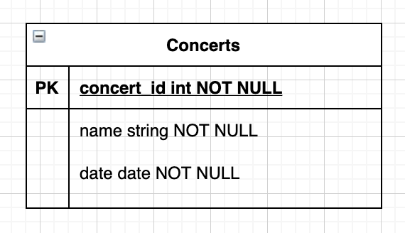

# API & Client Web Simple

::: tip Vous pouvez consulter une nouvelle version
🚨 Une nouvelle version de ce TP est disponible [ici](./api_produit.md).
:::

Nous avons vu précédemment qu'il était simple de créer des sites Web avec Laravel. Dans le monde du développement, il est très courant de ne pas échanger entre le client et le serveur directement en HTML, mais directement en JSON.

Nous appelons cela des API (dans notre cas des API REST), c'est le fondement même de beaucoup de sites Internet que vous utilisez tous les jours (Gmail, Facebook, …).

Laravel étant un framework « à tout faire » celui-ci nous permet bien évidemment de créer également des API. C'est ce que nous allons faire dans ce TP.

::: tip API ?
Ce que vous allez créer est une API. Une API est le cœur de beaucoup de systèmes modernes. Il est important de comprendre ce concept dès à présent. Pourquoi faire une API ?

Une API va nous permettre de séparer la logique entre client et serveur afin de réaliser, si vous le souhaitez, différents clients pour la même donnée (exemple Twitter avec des clients multiplateformes).

Pourquoi préférer une API « JSON / XML » à un retour HTML basique ? Tout simplement, car l'API va être universelle ; nous pourrons donc l'utiliser dans un site Internet, mais également dans une application ou n'importe quel client applicatif (web, Android, iOS, une voiture, une TV…).
:::

::: details Sommaire
[[toc]]
:::

## Créer votre projet

Pour cette étape, je vous laisse suivre le début du [précédent TP](./introduction.md).

**Attention** à bien installer au moins la version 11 de Laravel.

## Activer les API

Depuis Laravel 11, la structure des fichiers / dossiers a changé. Les API ne sont maintenant plus activées par défaut. Pour les activer, il suffit de lancer la commande suivante :

```bash
php artisan install:api
```

Cette commande va modifier votre projet pour activer le routeur spécifique aux API.

::: tip Note

Il est également possible de mettre les API directement dans le fichier `web.php` mais pour des raisons de clarté et de séparation des responsabilités, il est préférable de les mettre dans un fichier dédié.

:::

## Création de la base de données

La première étape comme toujours est d'ajouter dans votre projet « une nouvelle migration » afin de créer la base de données relative à notre problématique.

Dans notre cas, voilà la table que nous souhaitons créer :



Je vous laisse réaliser les étapes suivantes :

- Création de la migration et le modèle `php artisan make:model Concert --migration`
- Définir les champs dans la migration, mais également dans le `$fillable`.
- Lancer la migration `php artisan migrate`

::: tip Un doute sur comment faire ?
Ça fait plusieurs fois que nous faisons ce genre d'opération. Si vous avez un doute, vous pouvez regarder le détail [dans le TP base de données](./base_de_donnees.md)
:::

::: danger STOP !
Nous avons donc maintenant une base de données de test. Avant d'aller plus loin… Je vous laisse insérer des données fictives pour que nous ayons un peu de contenu.

Vous avez deux façons de faire ça :

- Directement en base « manuellement ».
- [Via une Factory + un Seeder de Laravel](https://laravel.com/docs/8.x/seeding)

L'avantage du seeder ? Il va permettre de créer beaucoup de données en un rien de temps ! 50 concerts ? Aucun problème, il suffit de faire :

```php
Concert::factory()->count(50)->create();
```

Pour l'implémentation, nous allons le faire ensemble, mais ça se résume à :

```shell
php artisan make:factory ConcertFactory
```

Je vous laisse configurer la factory (`/database/factories/ConcertFactory.php`) en prenant exemple sur celle de la partie User. Mais dans les grandes lignes, il faut ajouter :

```php
public function definition(){
  return [
      'name' => $this->faker->name,
      'date' => $this->faker->date(),
  ];
}
```

Éditer maintenant le `DatabaseSeeder` pour ajouter dans le `run()` :

```php
Concert::factory()->count(50)->create();
```

```shell
php artisan db:seed
# Vous avez maintenant 50 concerts dans votre table
```

Pratique !

:::

## Création de l'API

La création d'une API va être très proche de ce que nous connaissons déjà. Première étape : créer un contrôleur ; pour rappel, celui-ci permet de gérer le trafic et de répondre aux demandes du / des clients.

Notre API sera très simple, elle contiendra **3 routes / fonctionnalités** :

| Méthode | Chemin              | Fonctionnalité                                                  |
| ------- | ------------------- | --------------------------------------------------------------- |
| GET     | `/api/concert`      | Liste de l'ensemble des concerts                                |
| POST    | `/api/concert`      | Ajout d'un nouveau concert (en fournissant les données en POST) |
| DELETE  | `/api/concert/{id}` | Suppression du concert spécifié en paramètre `id`               |

L'ensemble des routes va retourner du JSON. Comme vu ensemble en cours, le format JSON est très facilement lisible, quel que soit le langage client. C'est donc un très bon choix !

::: warning Avant de coder il faut définir
Le petit tableau que je vous propose ici est très important. Il permet de savoir ce que je veux faire. Nous sommes ici dans un TP… Mais vous codez comme si vous étiez dans un projet « classique ».

Il est donc important de définir ce que l'on souhaite faire… Pour soi, mais également pour vos collègues, afin qu'ils sachent ce que vous êtes en train de faire.
:::

### Création du contrôleur

Le contrôleur vous savez faire, nous allons faire un nouveau contrôleur, celui-ci sera dédié à la partie API :

```bash
php artisan make:controller ApiController
```

Je ne vous détaille pas plus cette étape, nous l'avons vue plusieurs fois précédemment.

Bien ! Notre code est maintenant prêt. Nous allons créer les méthodes permettant la manipulation de notre base de données tout en répondant à nos API bien évidemment (liste, création, suppression).

Nous allons maintenant écrire une méthode pour chaque action. Avec les différentes conditions nécessaires au bon fonctionnement de votre application.

### Liste

La méthode `liste` est certainement la plus simple, nous allons simplement faire appel à la méthode `all()` de Eloquent (ORM pour l’accès à la base de données). Pour ça, créez une nouvelle méthode dans la classe `ApiController` avec le code suivant :

```php
public function listApi(){
    return response()->json(Concert::all());
}
```

Rien de bien compliqué, comme vous pouvez le voir, le `response()->json(…)` permet de créer une réponse au format JSON pour votre API (que l’on utilisera plus tard au moment de la mise en place des routes).

::: tip Et oui !
C'est aussi simple que ça ! Avec cette simple méthode, vous avez écrit votre première API.

<center><iframe src="https://giphy.com/embed/UtQHZEv5M7POO8t2WW" width="280" height="160" frameBorder="0" class="giphy-embed" allowFullScreen></iframe></center>
:::

::: danger Un instant ✋

En PHP objet, il y a la notion de namespace. Laravel utilise de base les namespaces, ça veut dire que nous allons devoir utiliser le mot-clé `use` pour importer (include). Quand vous voulez utiliser une classe qui n'est pas dans le même fichier, il faudra déclarer l'emplacement via un `use`. Exemple, pour que `Concert` soit accessible depuis le contrôleur, il faudra :

```php
use App\Models\Concert;
```

- ⚠️ Si vous utilisez **PHPStorm** cet import sera automatique.
- ⚠️ Si vous utilisez **VSCode** il faudra passer par une extension [Disponible ici](https://marketplace.visualstudio.com/items?itemName=MehediDracula.php-namespace-resolver)

Pour **PHPStorm**, alt+entrée permettra de déclencher l'ajout du use.

Pour **VSCode** je vous laisse regarder l'usage de l'extension :


:::

### La Création

Pour l'ajout, c'est un peu différent, nous allons créer dans la base de données un nouvel enregistrement à chaque requête de type `POST`. Nous allons donc devoir écrire un peu de code.

Pour la partie création, nous allons faire un mapping automatique entre la requête HTTP et le modèle `Concert`

```php
public function createApi(Request $request){
    $item = Concert::create($request->all());
    return response()->json($item);
}
```

::: tip 😬
Que va-t-il se passer lors de l’appel ? L’objet `$request` contient tous les paramètres de l’appel HTTP, la méthode `all()` permet de les récupérer. L’objet `Concert` possède une méthode permettant de créer un nouvel enregistrement en base de données. Les valeurs passées en paramètre de `create()` permettent de renseigner automatiquement les champs en base de données.
:::

### Création, version alternative

La première approche est la plus rapide, mais elle sous-entend que tous les paramètres soient bien initialisés dans « l’input » HTTP. Dans cette version, la méthode est plus complète et gère la création de l’objet Concert manuellement, en récupérant les différents éléments dans la requête HTTP :

```php
public function createApi(Request $request){
    $name = $request->input('name');
    $date = $request->input('date');

    if($name){
      $concert = new Concert();
      $concert->name = $name;
      $concert->date = $date;
      $concert->save();
      return response()->json(["status" => "success"]);
    }else{
      return response()->json(["status" => "error"]);
    }
  }
```

### Suppression

Pour la partie suppression, nous allons devoir dans un premier temps récupérer le Concert par son ID.

```php
public function deleteApi($id){
    $concert = Concert::find($id);
    if($concert){
        $concert->delete();
        return response()->json(["status" => "success"]);
    }else{
        return response()->json(["status" => "error"]);
    }
}
```

### Définir les routes

Votre code est maintenant prêt, il faut le « brancher » dans votre `Router` pour que celui-ci soit accessible aux utilisateurs. Cette fois-ci, nous n'allons pas ajouter nos routes dans le fichier `web.php`, car ce ne sont pas des liens « web »… Mais alors, où ?

…Roulement de tambour…
…
…Attention…
…

Dans `api.php` ! Je vous donne le code à ajouter, mais celui-ci est classique, ce sont juste des routes telles que nous les écrivons dans la partie `web.php` :

::: details Je pense que vous savez faire… Mais si vous avez oublié …

Je sais que vous avez cliqué sans vraiment chercher…

```php
Route::get('/concert', ['App\Http\Controllers\ApiController', 'listApi']);
Route::post('/concert', ['App\Http\Controllers\ApiController', 'createApi']);
Route::delete('/concert/{id}', ['App\Http\Controllers\ApiController', 'deleteApi']);
```

:::

🤓 Les routes que vous ajoutez dans le fichier `api.php` sont automatiquement préfixées par `/api/`.

::: danger Et le type de la méthode ?
N'oubliez pas le type de la méthode ! Surtout pas ! Dans le tableau nous avons défini des types de méthode (GET, POST, DELETE), c'est important de respecter nos spécifications !
:::

### Tester votre API

Maintenant que l’ensemble de votre code est terminé (et commenté 🕵🏻), nous allons pouvoir le tester, pour tester les API c’est plutôt simple. Vous pouvez utiliser au choix :

- Votre navigateur, pour les routes en `GET` (il suffit de saisir l'URL).
- La fonction `fetch` dans la console de votre navigateur, pour les routes en `POST` et en `DELETE`.
- Un client REST tel que [Postman](https://www.getpostman.com/) ou [Bruno](https://www.usebruno.com/), l'idée étant de vous construire un « cahier » de tests vous permettant de valider le fonctionnement de votre application rapidement (comprendre dès que vous modifiez le code).

(Pssst ! Si vous choisissez Postman, la création de compte **n'est pas obligatoire**) ⚠️⚠️

🤓 Commencez par la plus simple, par exemple `/api/concert` qui doit normalement retourner la liste actuelle des concerts. 🤓

✋ Tester l'ensemble de vos API avant de continuer.

## Et les clients dans tout ça ?

Nous avons écrit des API… Mais pour l'instant nous n'avons pas de client (interface qui les utilise), c'est dommage ! Je suis sympa, je vais vous donner une astuce ! Sur Internet nous trouvons tout (oui oui). Vos clients peuvent être :

- Une page Web.
- Une application Android.
- etc…

Nous allons tester que ça fonctionne correctement grâce à une page Web, et ça va être très simple… très très simple. Nous allons faire de l'Ajax (ne partez pas, ça va bien se passer). Pour simplifier, nous allons utiliser une excellente [librairie nommée Tabulator](http://tabulator.info/)

### Installer Tabulator

Tabulator est une librairie JavaScript qui va nous masquer toute la partie appel de l'API, mais également toute la partie création du tableau affichant les résultats (avec plein d'options super cools). La première étape est donc d'ajouter la librairie dans votre projet.

Pour ça il suffit de suivre le : [Guide d'installation](http://tabulator.info/docs/4.9/install#sources-cdn)

En suivant le guide d'installation, nous voyons qu'il faut ajouter dans notre projet (dans le `head`) les liens suivants :

```html
<link
  href="https://unpkg.com/tabulator-tables/dist/css/tabulator.min.css"
  rel="stylesheet"
/>
<script
  type="text/javascript"
  src="https://unpkg.com/tabulator-tables/dist/js/tabulator.min.js"
></script>
```

### Utiliser Tabulator

Nous allons charger de la donnée via un appel Ajax, avec Tabulator c'est très simple, c'est même intégré [il suffit de suivre la documentation](http://tabulator.info/docs/4.9/data#ajax)

Si nous suivons la documentation, nous voyons qu'il suffit d'ajouter dans votre page fraichement créée le code suivant :

```html
<div id="data"></div>
<script>
  let myTable = new Tabulator("#data", {
    height: "311px",
    layout: "fitColumns",
    ajaxURL: "/api/concert",
    placeholder: "Aucune donnée",
    columns: [
      { title: "Nom", field: "name", sorter: "string", width: 200 },
      { title: "Date du concert", field: "date", sorter: "date" },
    ],
  });

  // myTable.setData("/api/concert");
</script>
```

::: danger La documentation, la documentation
Je n'invente rien ! Tout ce que je vous donne ici ne sont que des utilisations telles que définies dans la [documentation](http://tabulator.info/docs/4.9/columns).
:::

### Ajouter les filtres dans Tabulator

En suivant la documentation, je vous laisse ajouter **dans le précédent tableau** des filtres permettant la recherche.

[La documentation](http://tabulator.info/docs/4.9/filter)

### Ajouter un élément via l'Ajax

Ce n'est pas le but de ce TP, mais si vous souhaitez ajouter un élément via une action en Ajax il vous suffit de faire en JavaScript :

```javascript
function createNewConcert(name, date) {
  const formData = new FormData();
  formData.append("name", name);
  formData.append("date", date);

  return fetch("/api/concert", { method: "POST", body: formData }).then(
    (response) => response.json()
  );
}
```

### Suppression via l'Ajax

Ce n'est pas le but de ce TP, mais si vous souhaitez supprimer un élément via une action en Ajax il vous suffit de faire en JavaScript :

```javascript
function deleteNewConcert(id) {
  fetch("/api/concert/" + id, { method: "DELETE" })
    .then((res) => res.json())
    .then((res) => console.log(res));
}
```

Vous pouvez par exemple l'implémenter en utilisant [les callbacks de Tabulator](http://tabulator.info/examples/3.1#callbacks).

## Création de l'API utilisateur

En reprenant la démarche précédente, je vous laisse implémenter la même logique pour créer l'API utilisateur :

| Méthode | Chemin             | Fonctionnalité                                                              |
| ------- | ------------------ | --------------------------------------------------------------------------- |
| GET     | `/api/client`      | Liste de l'ensemble des clients / utilisateurs                              |
| POST    | `/api/client`      | Ajout d'un nouvel utilisateur / client (en fournissant les données en POST) |
| DELETE  | `/api/client/{id}` | Suppression d'un utilisateur spécifié en paramètre `id`                     |

- Création des API.
- Création des routes.
- Création du code permettant l'affichage des données.

::: tip N'oubliez pas !

La partie API, c'est bien ! Mais je souhaite avoir en base de données un jeu d'essai conséquent.

:::
