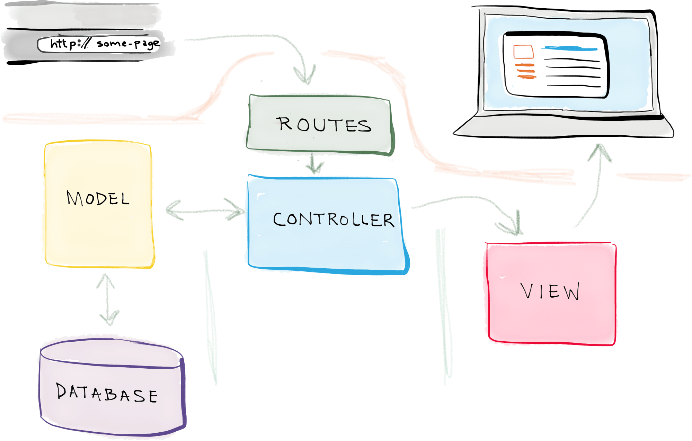

# Le framework Laravel

## Introduction à Laravel

Laravel est un framework PHP moderne pour le développement web, créé par Taylor Otwell en 2011. Il est devenu l'un des frameworks PHP les plus populaires grâce à sa philosophie de "développement web artisanal".

- **Open-source et gratuit**: Laravel est gratuit et open-source sa communauté contribue activement à son développement.
- **Approche MVC**: Laravel utilise le modèle Modèle-Vue-Contrôleur (MVC) pour organiser le code de l'application.
- **Simplicité et facilité d'apprentissage**: Laravel est conçu pour être accessible aux débutants tout en offrant des fonctionnalités puissantes pour les développeurs expérimentés.

Taylor Otwell a créé Laravel en réaction à la complexité de CodeIgniter, visant à offrir une alternative plus souple et plus simple à apprendre.

::: tip Laravel et Symfony

Certains en stage ont peut-être utilisé Symfony. Laravel est souvent comparé à Symfony, un autre framework PHP populaire. Laravel est souvent considéré comme plus simple et plus rapide à prendre en main que Symfony, qui est plus complexe, mais offre une plus grande flexibilité.

**Cependant**, Laravel utilise de nombreux composants de Symfony, notamment le composant HTTP Kernel, le composant Routing, le composant Console, etc. Les deux frameworks partagent donc des similitudes malgré leurs différences.

:::

## Caractéristiques principales

Laravel se distingue par plusieurs caractéristiques clés :

- **PHP moderne**: Laravel exploite les fonctionnalités les plus récentes de PHP.
- **Création rapide**: La mise en place d'un projet Laravel est rapide et simple.
- **Développement orienté objet**: Laravel encourage les bonnes pratiques de programmation orientée objet.
- **Gestion des dépendances centralisées**: Laravel utilise Composer, un gestionnaire de dépendances pour PHP.

## Architecture MVC

L'architecture MVC de Laravel se compose de trois parties principales :

1. **Modèle (Model)**: Gère la logique de données et les interactions avec la base de données via la librairie Eloquent (ORM: Object-Relational Mapping).
2. **Vue (View)**: Gère la présentation des données, principalement à travers le moteur de template Blade.
3. **Contrôleur (Controller)**: Gère la logique de l'application et sers d'intermédiaire entre le Modèle et la Vue.

## Fonctionnement de Laravel



### 1. Le routeur

Le système de routage de Laravel permet de définir les URL de l'application et de les lier aux contrôleurs appropriés. Les routes sont définies dans différents fichiers selon leur usage :

- `web.php`: Pour les routes web standard (sans préfixe). (Par exemple, `/`, `/about`, `/contact`
- `api.php`: Pour les routes d'API. (Toujours préfixé par `/api`, automatiquement. L'authentification est également gérée différemment. Via un système de jetons avec [Laravel Sanctum](https://laravel.com/docs/12.x/sanctum))
- `console.php`: Pour les commandes console. Nous ne les verrons pas en cours, mais c'est un élément important dans la souplesse de Laravel.

Exemple de définition de route **très simple** :

```php
Route::get('/', function () {
    return "Bonjour Monde";
});
```

Cette route renvoie "Bonjour Monde" lorsqu'on accède à la racine du site. Elle est très basique et ne référence pas de contrôleur. En réalité, nous préférerons utiliser la syntaxe suivante :

```php
Route::get('/', [HelloController::class, "main"]);
```

Dans cet exemple, la route `/` est associée à la méthode `main` du contrôleur `HelloController`. Celle-ci renverra le texte "Bonjour Monde".

::: tip Pourquoi utiliser des contrôleurs ?

Les contrôleurs permettent de séparer la logique de routage de la logique métier de l'application. **Rappel**, la logique métier est le code concret que vous allez écrire pour répondre à une demande (fonctionnalités).

Cela rend le code plus modulaire et plus facile à maintenir.

:::

### 2. Contrôleurs

Les contrôleurs gèrent la **logique métier de l'application**. Ils peuvent être créés facilement via l'interface en ligne de commande Artisan :

```bash
$ php artisan make:controller DemoController
```

Exemple de contrôleur :

```php
class DemoController extends Controller
{
    public function index()
    {
        return view('demo.index');
    }

    public function voir(Request $request, $id)
    {
        return view('demo.voir', ['id' => $id]);
    }
}
```

Nous avons ici deux méthodes : `index` et `voir`. La première renvoie une vue `demo.index`, la seconde une vue `demo.voir` avec un paramètre `$id`.

- La variable `$request` est un objet représentant la requête HTTP. Elle est automatiquement injectée par Laravel. Elle est l'équivalent de `$_GET` et `$_POST` en PHP natif.
- La variable `$id` est un paramètre de la route. Elle est automatiquement injectée par Laravel. Elle correspond à la valeur de `{id}` dans la route.

::: tip À quoi ressemble le routeur pour ce contrôleur ?

```php
Route::get('/demo', [DemoController::class, "index"]);
Route::get('/demo/{id}', [DemoController::class, "voir"]);
```

:::

### 3. Modèles (Eloquent ORM)

Eloquent est l'ORM (Object-Relational Mapping) de Laravel. Il permet de travailler avec la base de données de manière orientée objet.

Exemple de définition de modèle :

```php
class TodoList extends Model
{
    protected $table = "todoList";
    protected $fillable = array('texte', 'termine');
}
```

Eloquent gère également les relations entre les modèles, comme One-to-One, One-to-Many, et Many-to-Many.

::: tip ORM ?

Un ORM est un outil qui permet d'abstraire la base de données au travers d'objets. Cela permet d'interagir avec la base de données sans écrire de requêtes SQL.

Cela permet surtout **d'être indépendant de la base de données**. Vous pouvez changer de moteur de base de données sans changer votre code (exemple: MySQL vers PostgreSQL).

:::

### 3.1. Exemple d'utilisation d'Eloquent

Une fois le modèle défini, vous pouvez l'utiliser pour interagir avec la base de données :

```php
// Créer un nouvel enregistrement
$todo = new TodoList();
$todo->texte = "Acheter du lait";
$todo->termine = false;
$todo->save();

// Récupérer un enregistrement par son ID
$todo = TodoList::find(1);

// Mettre à jour un enregistrement
$todo->termine = true;
$todo->save();

// Supprimer un enregistrement
$todo->delete();
```

Eloquent simplifie la manipulation des données en les transformant en objets PHP. Cela rend le code plus lisible et plus facile à maintenir.

::: danger Il est également possible d'écrire des requêtes SQL brutes

Bien que peu recommandé, il est évidemment possible d'écrire des requêtes SQL brutes avec Laravel. Cela peut être utile pour des requêtes complexes ou des opérations spécifiques.

```php
DB::select('select * from todoList where termine = ?', [true]);
```

Ici l'objet `DB` est un variable qui représente la base de données. Vous pouvez lui passer des requêtes SQL brutes.

:::

### 4. Vues (Blade)

Blade est le moteur de template de Laravel. Il offre une syntaxe expressive pour créer des vues.

Exemple de template Blade (en utilisant la syntaxe `@extends` pour l'héritage de layout) :

```html
@extends('layouts.app')

@section('content')
    <h1>{{ $title }}</h1>
    <p>{{ $content }}</p>
@endsection
```

Exemple de template blade (en utilisant le système de composants) :

```html
<layout-guest>
    <template #content>
        <h1>{{ $title }}</h1>
        <p>{{ $content }}</p>
    </template>
</layout-guest>
```

::: tip Deux façons d'écrire des vues

- **Syntaxe Blade classique**: `@extends`, `@section`, `@yield`, etc.
- **Syntaxe de composants**: `<layout-guest>`, `<template #content>`, etc.

Les deux méthodes sont valables et peuvent être utilisées en fonction des besoins du projet. L'approche composants est plus récente et permet une meilleure organisation du code. Elle ressemble à ce que l'on peut trouver dans des frameworks front-end comme Vue.js ou React.

:::

### 4.1. Blade les directives

Blade propose des directives pour simplifier l'écriture de templates. Voici quelques exemples de directives courantes :

- `@if`, `@elseif`, `@else`: Pour les conditions.
- `@foreach`, `@for`, `@while`: Pour les boucles.
- `@include`: Pour inclure un autre template.

Avec ces instruction / directives vous pourrez manipuler vos données et les afficher de manière dynamique.

Exemple d'utilisation de directives :

```html
@if ($user->isAdmin)
    <p>Bienvenue, administrateur</p>
@else
    <p>Bienvenue, utilisateur</p>
@endif

@foreach ($users as $user)
    <p>{{ $user->name }}</p>
@endforeach
```

::: tip d'où viennent les données ?

Les données sont généralement passées aux vues depuis les contrôleurs. Par exemple :

```php
$users = User::all();
$user = User::find(1);
return view('example.index', ['users' => $users, '$user' => $user]);
```

Dans cet exemple, `$users` est un tableau d'utilisateurs, et `$user` est un utilisateur spécifique. Les données sont ensuite accessibles dans la vue via la syntaxe Blade `{{ $variable }}`.

:::

### 5. Migrations

Les migrations permettent de versionner la structure de la base de données. Elles facilitent la collaboration en équipe et le déploiement.

Exemple de migration :

```php
Schema::create('todoList', function(Blueprint $table)
{
    $table->increments('id');
    $table->string('texte');
    $table->boolean('termine');
    $table->timestamps();
});
```

### 6. Authentification

Laravel offre un système d'authentification prêt à l'emploi, qui peut être facilement personnalisé selon les besoins du projet. Pour plus de détails, consultez la [documentation sur l'authentification](https://laravel.com/docs/8.x/authentication).

### 7. Middleware

Les middlewares agissent comme des filtres pour les requêtes HTTP. Ils peuvent être utilisés pour vérifier l'authentification, modifier des en-têtes, etc.

Exemple d'utilisation de middleware :

```php
Route::get('/demo/{id}', [DemoController::class, "voir"])->middleware('auth');
```

::: tip Middleware en deux mots

Un middleware (code intercépteur) est un code qui s'exécute avant ou après une requête HTTP. Il permet de modifier la requête, de vérifier des informations, ou de réaliser des actions spécifiques (exemple: journalisation, gestion des droits, de la sécurité, etc.).

Vous pouvez créer vos propres middlewares pour des besoins spécifiques :

```bash
php artisan make:middleware IsUserConnceted
```

C'est le cas par exemple dans l'AP3 hackathon, où un middleware vérifie si l'utilisateur est connecté avant de lui permettre d'accéder à certaines pages.

Exemple dans l'AP 3 :

```php
class IsEquipeConnected
{
    /**
     * Handle an incoming request.
     *
     * @param  \Closure(\Illuminate\Http\Request): (\Symfony\Component\HttpFoundation\Response)  $next
     */
    public function handle(Request $request, Closure $next): Response
    {
        // Si l'équipe n'est pas connectée, on la redirige vers la page de connexion
        if (!SessionHelpers::isConnected()) {
            return redirect("/login");
        }

        return $next($request);
    }
}
```

```php
Route::get('/me', [EquipeController::class, "me"])->middleware(IsEquipeConnected::class);
```

:::

## Sécurité

Laravel intègre plusieurs fonctionnalités de sécurité :

- Protection CSRF (Cross-Site Request Forgery) automatique
- Échappement automatique des données dans les vues Blade pour prévenir les attaques XSS (Cross-Site Scripting)

::: danger La sécurité est une préoccupation majeure

La sécurité est un aspect crucial du développement web. Laravel offre des fonctionnalités de sécurité intégrées, mais il est important de rester vigilant et de suivre les meilleures pratiques de sécurité pour protéger vos applications contre les attaques.

:::

## Laravel is PHP

Laravel est un framework PHP, vous avez donc accès à toutes les fonctionnalités de PHP. Vous pouvez utiliser des bibliothèques tierces, des extensions PHP, etc. Et surtout le code PHP comme vous avez l'habitude de le faire. Exemple, voici les équivalents Laravel et PHP pour le traitement de formulaires et la session :

### $_GET

```php
// Laravel
$name = $request->input('name');

// PHP
$name = $_GET['name'];
```

### $_POST

```php
// Laravel
$name = $request->input('name');

// PHP
$name = $_POST['name'];
```

### $_SESSION

```php
// Laravel
$request->session()->put('key', 'value');
$value = $request->session()->get('key');
$request->session()->forget('key');
$request->session()->flush();
$request->session()->all();
$request->session()->has('key');

// PHP
$_SESSION['key'] = 'value';
$value = $_SESSION['key'];
unset($_SESSION['key']);
session_destroy();
$_SESSION;
isset($_SESSION['key']);
```

::: tip Laravel et PHP
Il faut donc bien comprendre que Laravel est une surcouche à PHP, il offre des raccourcis et des fonctionnalités supplémentaires, mais il ne remplace pas PHP.
:::

### Requêtes préparées / PDO

Laravel utilise Eloquent pour interagir avec la base de données. Eloquent utilise des requêtes préparées pour protéger contre les injections SQL.

Exemple de requête préparée avec Eloquent :

```php
// Eloquent
$users = User::where('name', 'John')->get();

// PDO
$stmt = $pdo->prepare('SELECT * FROM users WHERE name = :name');
$stmt->execute(['name' => 'John']);
```

```php
// Eloquent
User::where('name', 'John')->update(['name' => 'Jane']);

// PDO
$stmt = $pdo->prepare('UPDATE users SET name = :newName WHERE name = :oldName');
$stmt->execute(['newName' => 'Jane', 'oldName' => 'John']);
```

```php
// Eloquent
$user = new User();
$user->name = 'John';
$user->save();

// Ou
User::create(['name' => 'John']);

// PDO
$stmt = $pdo->prepare('INSERT INTO users (name) VALUES (:name)');
$stmt->execute(['name' => 'John']);
```

## Conclusion

Laravel offre un écosystème riche et une expérience de développement agréable pour les développeurs PHP. Sa combinaison de simplicité d'utilisation et de puissance en fait un choix populaire pour une grande variété de projets web, des petites applications aux grandes plateformes d'entreprise.

Pour approfondir vos connaissances sur Laravel, n'hésitez pas à explorer la [documentation officielle complète](https://laravel.com/docs).
