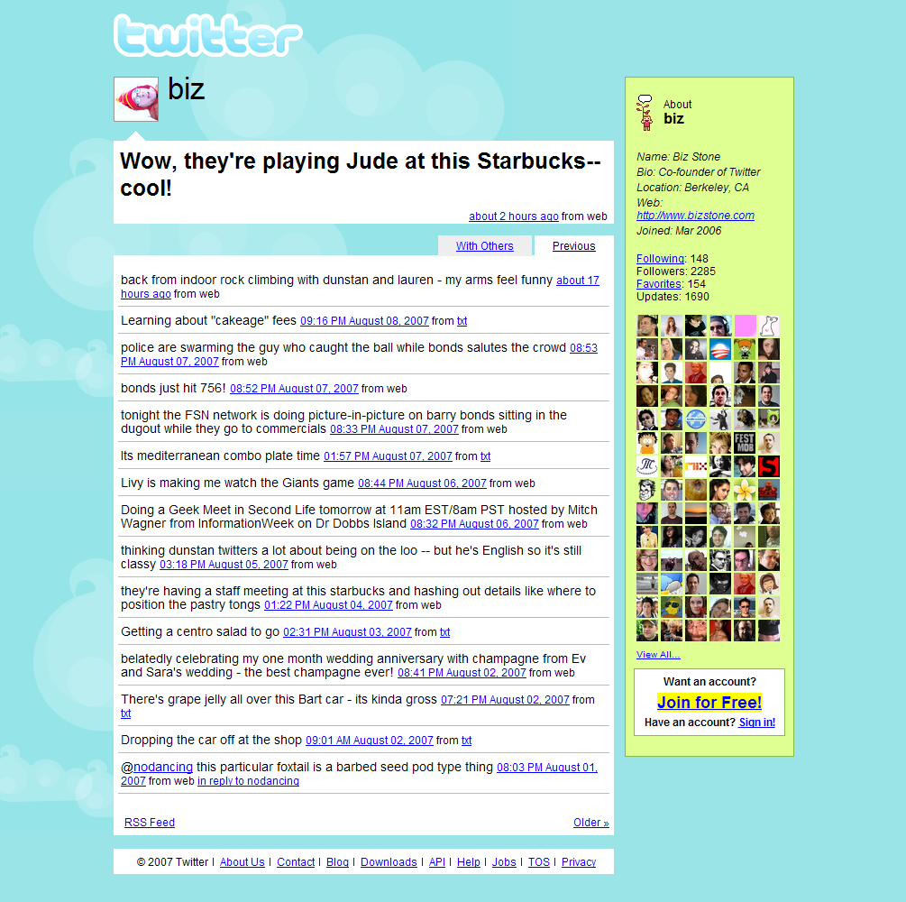

# Plateforme de Micro-Messages

## Contexte

L’idée du projet est simple : construire une petite plateforme de micro-messages, inspirée de X (Twitter), où chacun peut écrire et lire des messages courts.  
Ce TP est l’occasion idéale pour manipuler Laravel de manière concrète et autonome.

Au programme :  
Laravel, Breeze, routes, contrôleurs, middleware, modèles Eloquent, Blade et Tailwind (ou Bootstrap).

## Exemple de base données simplifié pour les messages :

- Table `users` :

  - `id` (PK)
  - `name`
  - `email`
  - `password`
  - timestamps

- Table `messages` :
  - `id` (PK)
  - `user_id` (FK vers users.id)
  - `content` (texte du message)
  - `created_at`
  - `updated_at`

Ce qui donne une migration + modèle Eloquent :

```php
php artisan make:model Message -m
```

Puis dans la migration :

```php
Schema::create('messages', function (Blueprint $table) {
    $table->id();
    $table->foreignId('user_id')->constrained()->onDelete('cascade');
    $table->string('content', 140);
    $table->timestamps();
});
```

Psst ! N’oubliez pas de définir la relation dans le modèle User et Message. Ainsi que le `$fillable` dans le modèle Message.

::: details Un doute sur les relations Eloquent ?

```php
// Dans User.php
public function messages(){
    return $this->hasMany(Message::class);
}

// Dans Message.php
public function user(){
    return $this->belongsTo(User::class);
}
```

C'est parti ! À partir de maintenant, fini les roulettes vous êtes le pilote !

## Rappel Twitter au début 2007



## Fonctionnalités

### Authentification

Le cœur de l’application repose sur une authentification avec **Laravel Breeze**.  
Un utilisateur connecté peut participer pleinement : publier et suivre d’autres personnes.  
Un visiteur non connecté reste simple spectateur.

- Utilisateur non connecté :
  - Lecture publique uniquement
  - Accès au mur des messages
  - Aucune action de publication

### Mur Public

Dès la page d’accueil, l’utilisateur découvre tous les messages publiés par la communauté.  
Le mur affiche les messages du plus récent au plus ancien — une vraie timeline.

Chaque message affiche :

- le nom ou pseudonyme de l’auteur
- le texte du message
- la date et l’heure

Une interface simple, directe et efficace.

### Mur d’un Utilisateur

Chaque utilisateur possède également son espace : son mur personnel.  
On peut le consulter via une URL du type :

`/user/{id}` ou `/@username`

On y retrouve le même affichage, mais filtré pour ne montrer que les messages d’un seul auteur.  
Pratique pour voir ce que quelqu’un publie.

### Publication d’un Message

Les utilisateurs authentifiés peuvent publier un message.  
Cependant, la plateforme encourage la concision : **140 caractères maximum**.

Un middleware et une validation côté client garantissent ce respect :

- au-delà de 140 caractères → rejet
- un message d’erreur est affiché

L’objectif : des messages courts, simples, percutants.

## Règles de Validation

- Le contenu est **obligatoire**
- La longueur est **limitée à 140 caractères**
- Le contrôle est assuré par un middleware (ex. `CheckMessageLength`)

L’utilisateur doit aller droit au but.

## Sécurité

Certaines actions nécessitent une connexion :

- publier
- suivre
- se désabonner

La lecture reste ouverte à tous pour favoriser la découverte et l’envie de s’inscrire.

## Interface

Quelques pages essentielles construisent l’interface :

- `/` : mur public
- `/dashboard` : espace utilisateur (Breeze)
- `/user/{id}` : mur d’un utilisateur
- `/feed` : messages des comptes suivis
- `/post/new` : formulaire de saisie (ou intégré sur une autre page)

Une navigation simple, pour se concentrer sur l’essentiel : le contenu.

## Évolution : Suivre une Personne

Suivre quelqu’un, c’est accéder à un flux personnalisé.  
On met en place une relation **N-N** via une table pivot `followers`.

Sur une page utilisateur apparaît un bouton :

- **Suivre**
- **Ne plus suivre**

Le flux des personnes suivies devient une expérience personnelle, centrée sur ce qu’on aime lire.

Trois zones de lecture sont ainsi disponibles :

- le mur public
- le mur d’un utilisateur spécifique
- le flux des suivis
- Affichage des followers / followings sur le profil utilisateur

## Modèle de Données (simplifié)

### Utilisateurs

Table : `users`  
Champs essentiels : `id`, `name`, `email`, `password`, timestamps

### Messages

Table : `messages`  
Champs : `id`, `user_id`, `content`, `created_at`

### Suivis

Table pivot : `followers`  
Champs :

- `user_id` : celui qui suit
- `followed_id` : celui qui est suivi

Une structure simple, mais suffisante pour modéliser une vraie interaction sociale.

## Évolutions Possibles

Pour enrichir l’expérience, plusieurs extensions facultatives peuvent être ajoutées.

### Likes

Les utilisateurs peuvent indiquer qu’ils apprécient un message.  
Un compteur rend visible la popularité de chaque publication.

### Commentaires

Sous chaque message, une zone permet de réagir.  
Courts, concis, expressifs — comme les messages, limités à environ 140 caractères.

### Avatar

Chaque utilisateur peut personnaliser son profil avec une image stockée dans `storage/app/public`.  
Le mur devient alors plus visuel et plus personnel.

### Pagination

Pour une navigation fluide, les murs supportent la pagination :

`->paginate(20)`

Simple, lisible, efficace.

### Recherche

Une barre de recherche permet de filtrer par :

- utilisateur
- mot-clé

Un moyen rapide de retrouver une idée, une personne, un message.

## Critères de Validation du TP

Pour valider le projet, chaque point doit être fonctionnel :

- Authentification Breeze opérationnelle
- Modèles et migrations créés
- Mur public affiché
- Mur utilisateur fonctionnel
- Middleware de contrôle de longueur en place
- Suivi / désabonnement fonctionnels
- Code propre : routes, contrôleurs, vues Blade
- Utilisation d’Eloquent pour les relations

## Conclusion

Ce TP est une excellente occasion de mettre en pratique Laravel dans un contexte concret. Il vous permettra de combiner plusieurs aspects du framework tout en construisant une application web simple mais complète. Bonne chance et amusez-vous bien !

La suite, ça sera [Larablog](./larablog.md), une plateforme de blog codé entièrement avec Laravel.
