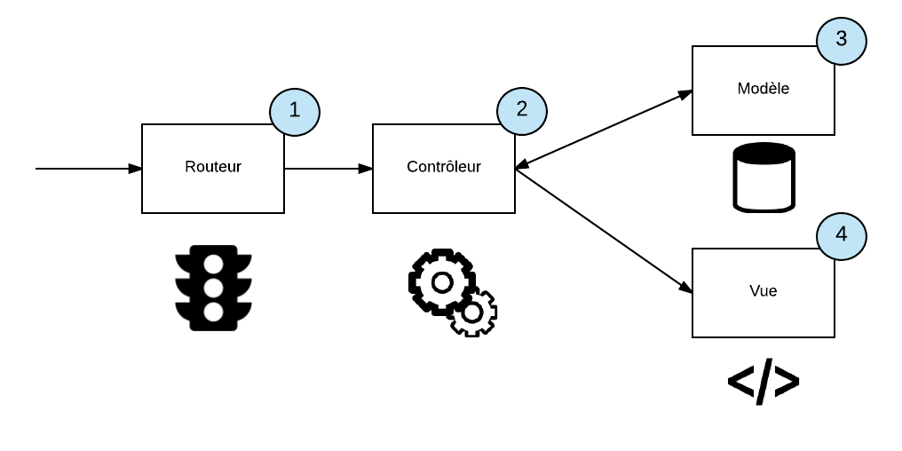

# MVC : Le développement organisé

## Introduction au code professionnel

Un code professionnel est essentiel pour le développement de projets durables et maintenables. Il se caractérise par plusieurs aspects clés :

- Documentation complète
- Structure modulaire
- Clarté et précision
- Utilisation de termes en anglais
- Réutilisabilité des composants
- Capacité d'évolution
- Organisation permettant le travail en équipe

L'objectif principal d'un code professionnel est de permettre à une équipe de travailler efficacement et de comprendre rapidement la structure du projet.

Il s'agit donc de gagner du temps pour les ajouts, les modifications et les évolutions d'un projet.

## L'importance de la structure

### Le point d'entrée unique

La structure d'un projet est tout aussi cruciale que le code lui-même. Un élément fondamental est le concept de point d'entrée unique.

Toutes les requêtes passent par un seul point d'entrée, généralement un fichier `index.php`, qui se charge ensuite de diriger le flux vers les composants appropriés.

::: danger include ?

Ici, nous utilisons l'include pour inclure les pages dans une autre. Cette technique est très courante en PHP, elle est pourtant parfois risquée. En effet, si vous ne filtrez pas ce que vous tentez d'inclure vous avez créé une faille **grave de sécurité**.

Ici, nous réduisons le risque en mettant en place ce que l'on appelle une `Whiteliste` (liste d'autorisations). Cette whiteliste est à mettre en parallèle avec ce que vous connaissez également une `Blackliste` (liste de filtres).

- Avec une `Whiteliste` nous allons tout interdire **sauf** ce que nous souhaitons autoriser.
- Avec une `Blackliste` nous allons tout autoriser **sauf** ce que nous souhaitons interdire.

La Blackliste est donc moins contraignante pour le développeur… **Mais elle est surtout moins sécurisée**.

:::

### Évolution par rapport au code de première année

En comparaison avec le code souvent produit en première année d'études, qui mélange fréquemment HTML, PHP et requêtes SQL, une approche plus structurée est nécessaire pour des projets professionnels.

Exemple d'un code pas ranger :

Voici, comment découper / identifier les différentes parties du code à ranger dans une structure type MVC :

## Le pattern MVC (Modèle-Vue-Contrôleur)

Le MVC est un pattern de conception qui permet de séparer les responsabilités au sein d'une application.

Nous avons ici Trois tiers, mais sachez que plus globalement on parle de développement en N-tiers (N étant un nombre variable).

### Modèle

- Gère la logique de données.
- Interagit avec la base de données.
- En POO, on crée généralement un objet ou entité.

::: tip Requête ou pas requête ici ?

En fonction du framework utilisé, plusieurs options sont possibles.

- Laravel => ORM. Ici nous allons utiliser 100% des options de l'objet. Nous n'aurons donc pas de requête SQL comme vous les connaissez.
- MiniMVC Sample => Pas d'ORM, ici nous allons utiliser des requêtes classiques avec PDO comme vous le faisiez en première année.
- …

:::

### Vue

- S'occupe de l'affichage
- Contient le HTML et le minimum de logique d'affichage
- Ne doit pas contenir de logique métier

::: dange Attention !

Pas de traitemement ici. Le découpage est la clé de la réussite. Vous devez ici ne faire que la logique d'affichage des données.

- Boucle
- Mise en forme
- Pas d'accès au(x) modèle(s) ici.

:::

### Contrôleur

- Fait le lien entre le Modèle et la Vue
- Contient la logique de l'application
- Traite les requêtes, manipule les données via le Modèle, et prépare les données pour la Vue

::: danger Attention !

Pas de requête SQL dans un contrôleur. Ici nous **devons** faire appel à un Modèle pour acceder aux données.

:::

## Le Routeur

Le routeur est un composant crucial dans une architecture MVC :

- Il définit la correspondance entre les URLs et les actions du contrôleur
- Il dirige les requêtes vers le bon contrôleur et la bonne méthode

::: tip Comment le représenter ?

Intéractions entre les composants du MVC :

Comment le lien est traité par le routeur :

Exemple du code d'un routeur simple :

:::

## Conclusion

L'approche MVC représente une évolution significative dans la façon d'organiser et de structurer le code. Elle permet de créer des applications plus maintenables, évolutives et adéquate au travail en équipe.

::: tip Important

Bien que plus complexe au départ, cette structure apporte des bénéfices importants sur le long terme, notamment en termes de lisibilité du code et de facilité de maintenance.

:::
