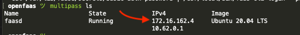
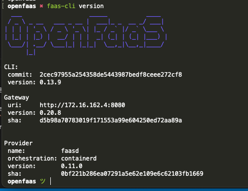

# Création stack OpenFaas (faasd) local via Multipass

::: details Sommaire
[[toc]]
:::

Ce document s'intéresse uniquement à la création de la stack initiale faasd qui nous permettra d'utiliser OpenFaas. Le but est de monter rapidement et simplement une stack OpenFaas pour tester la solution.

Pour simplifier la création de l'environnement, nous utiliserons [Faasd](https://github.com/openfaas/faasd/).

## Installer Multipass

Multipass, « Ubuntu VMs on demand for any workstation », est une solution qui nous permettra de monter rapidement des VM administrables et accessibles en ligne de commande.

Installez [Multipass](https://multipass.run/).

Multipass est une bonne solution pour tester rapidement des outils en ligne de commande Linux sans quitter votre machine Windows / macOS.

👉 Vous souhaitez être full-stack ? Ce que nous allons voir ici fait partie des bases à connaître.

## Installer faas-cli

### Linux et Mac

Sans être root :

```sh
curl -sSL https://cli.openfaas.com | sh
```

Via brew (macOS) :

```sh
brew install faas-cli
```

### Windows Powershell

Vous êtes sous Windows ? C'est également installable via PowerShell :

```sh
$version = (Invoke-WebRequest "https://api.github.com/repos/openfaas/faas-cli/releases/latest" | ConvertFrom-Json)[0].tag_name
(New-Object System.Net.WebClient).DownloadFile("https://github.com/openfaas/faas-cli/releases/download/$version/faas-cli.exe", "faas-cli.exe")
```

## Configuration Cloud-config

Pour créer la machine, nous allons utiliser `Cloud-config`. Ce fichier de configuration va initialiser la VM avec l'ensemble des dépendances nécessaires au bon fonctionnement.

```sh
curl -sSLO https://raw.githubusercontent.com/openfaas/faasd/master/cloud-config.txt
```

Cloud-config va nous permettre de préparamétrer notre VM : dès le démarrage, celle-ci sera préconfigurée avec les paramétrages spécifiés dans `cloud-config.txt`.

::: danger
👋 Vous avez confiance ? Vous avez ouvert le fichier ? Vous ne devriez pas… Je vous invite **vivement** à regarder son contenu.
:::

## SSH Key

Afin de pouvoir vous connecter à la machine, il faut modifier le fichier `cloud-config.txt` pour y ajouter votre clé SSH :

```sh
ssh-add -L
```

Éditez dans le fichier `cloud-config.txt` la ligne `ssh-rsa` pour y mettre votre clé.

::: warning
Je ne pense pas vous apprendre quelque chose ici… Mais préférez toujours une connexion via une clé à un mot de passe. **TOUJOURS**.

Vous n'en avez pas ? Je suis là !
:::

## Créer et démarrer la VM

```sh
multipass launch --cloud-init cloud-config.txt --name faasd
```

Vous allez constater la force de Multipass. Ici, rien à faire sauf attendre.

::: tip Opération longue
Cette opération va prendre quelques minutes en fonction de votre machine. Votre ordinateur (via cloud-init) est en train de créer une machine disposant d'`OpenFaas`, mais également de l'ensemble des dépendances nécessaires au bon fonctionnement.
:::

## Récupération de l'authentification

Votre machine est maintenant créée. Pour pouvoir vous connecter à OpenFaas, vous devez récupérer le fichier `basic-auth-password`. Pour ça, nous allons :

- Récupérer l'IP de votre VM.
- Récupérer via SSH le fichier d'authentification.

```sh
multipass ls
```



Dans mon cas, l'IP est `172.16.162.4`. Via la commande :

```sh
ssh ubuntu@172.16.162.4 "sudo cat /var/lib/faasd/secrets/basic-auth-password" > basic-auth-password
```

## Connexion à l'instance

```sh
export OPENFAAS_URL=http://172.16.162.4:8080 && cat basic-auth-password | faas-cli login -s
```

::: danger N'oubliez pas l'IP
Dans mon exemple, l'IP est `172.16.162.4`, mais ce n'est peut-être pas votre cas… Je vous invite à vérifier avant de lancer la commande.
:::

## Valider le fonctionnement

```sh
faas-cli version
```



Vous pouvez également accéder à l'interface d'administration web via :

[http://172.16.162.4:8080](http://172.16.162.4:8080)

Votre ordinateur est maintenant prêt, nous avons donc :

- Une VM contenant OpenFaas (votre serveur).
- Le CLI pour contrôler `OpenFaas`.
- La connexion entre votre ordinateur et votre serveur.

Source : [https://github.com/openfaas/faasd/blob/master/docs/MULTIPASS.md](https://github.com/openfaas/faasd/blob/master/docs/MULTIPASS.md)

## La suite ?

Maintenant que nous avons notre serveur, nous allons pouvoir déployer une fonction : [la suite, c'est par ici](./openfaas-quicky-create-faas.md).
