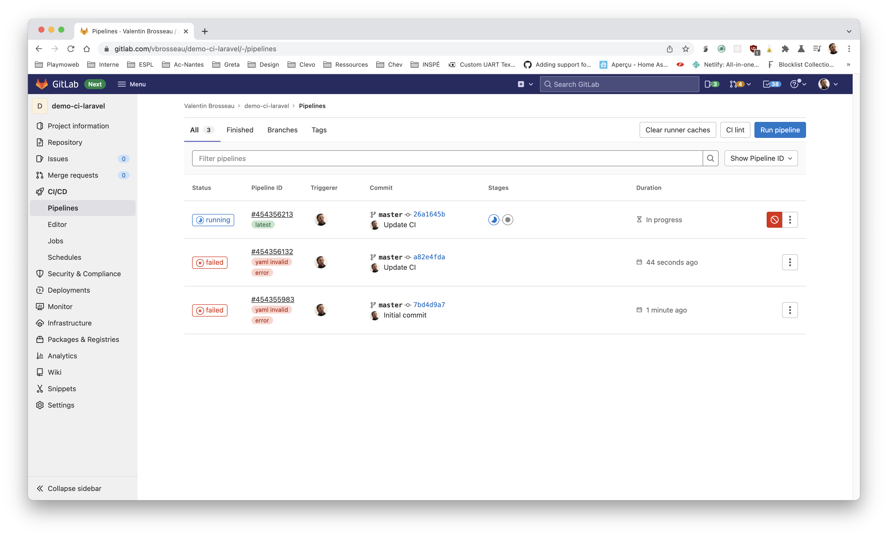
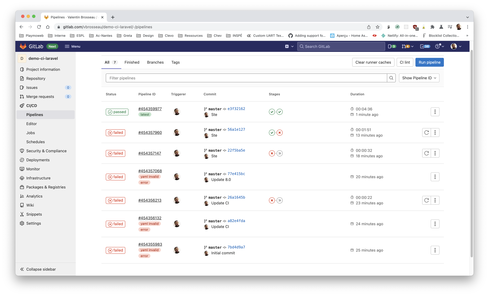

# Intégration continue avec Laravel

Dans ce TP nous allons voir comment mettre en place de l'intégration continue avec Laravel. Dans le [précédent TP](./deployer-laravel-docker.md) nous avons vu en détail comment « lancer / héberger » votre site avec Docker + Compose, nous avons ici la suite à savoir comment packager votre code dans un conteneur réutilisable sans envoyer votre code source sur le serveur.

::: details Sommaire

[[toc]]

:::

## Avant-propos

Nous allons dans ce TP mettre en place les briques réutilisables qui vous permettront de packager vos applications avec Docker et un hub privé (Gitlab-CI). La procédure est relativement guidée, vous devez donc vous poser les bonnes questions pour contrôler si vous êtes capables de le refaire dans votre propre projet.


Notre objectif ici est donc :

- Paramétrer une CI (Gitlab-CI)
- Créer l'image (en continu) de votre projet.
- Le partager sur le Hub **privé** de Gitlab.
- Regarder comment le déployer sur votre serveur.

## Les objectifs d'une CI

L'objectif de faire construire une image Docker directement depuis la CI est d'automatiser à 100% le processus de packaging de votre application. Plus d'humain == plus de risque.

::: tip Plus de risque ?

Façon de parler évidemment… En sécurité l'humain est source de vulnérabilité « volontaire » et « involontaire ». En automatisant au maximum les opérations de packaging, nous pourrons par la même réduire les risques :

- D'erreurs.
- De corruption du livrable.
- de perte de temps.

:::

La finalité est donc de créer directement depuis le CI le livrable **ici l'image Docker de notre application**. Nous utiliserons Gitlab-ci, mais la même opération est possible maintenant avec [Github](https://docs.github.com/en/packages/learn-github-packages/introduction-to-github-packages).

Avec Gitlab ce service s'appelle le [Gitlab Container Registry](https://docs.gitlab.com/ee/user/packages/container_registry/index.html), le service est gratuit et est **intégré** à Gitlab (quelle que soit la version que vous avez). **Bonus** vous avez un registry intégré à chaque projet 👍.

## Créer un projet Laravel

Pour illustrer, nous allons créer un nouveau projet Laravel, vous pouvez bien évidemment utiliser le votre, mais pour faire simple je vais créer un projet tout neuf.

```sh
composer create-project laravel/laravel demo-ci
```

Le projet est complètement standard… Rien de spécial.

::: danger Un instant!

- À votre avis, est-ce que Docker et Gitlab-CI se limitent à Laravel ?

:::

## Ajout de Docker

Comme dans le [TP précédent](./deployer-laravel-docker.md) nous allons ajouter le support de Docker pour pouvoir le packager. Ajouter le support de Docker c'est très simple il suffit d'ajouter « un fichier ». Le fichier, vous vous en souvenez c'est le `Dockerfile`, vous vous souvenez aussi que ce fichier dans le cas de Laravel est « relativement générique » c'est à dire toujours le même.

Je vous laisse ajouter le fichier `Dockerfile` à la racine de votre site (à côté du `.env` donc) :

```dockerfile
FROM webdevops/php-nginx:8.0-alpine

# Installation dans votre Image du minimum pour que Docker fonctionne
RUN apk add oniguruma-dev libxml2-dev
RUN docker-php-ext-install \
        bcmath \
        ctype \
        fileinfo \
        mbstring \
        pdo_mysql \
        tokenizer \
        xml

# Installation dans votre image de Composer
COPY --from=composer:latest /usr/bin/composer /usr/bin/composer

ENV WEB_DOCUMENT_ROOT /app/public
ENV APP_ENV production
WORKDIR /app
COPY . .

RUN cp -n .env.example .env

# Installation et configuration de votre site pour la production
# https://laravel.com/docs/8.x/deployment#optimizing-configuration-loading
RUN composer install --no-interaction --optimize-autoloader --no-dev
# Generate security key
RUN php artisan key:generate
# Optimizing Configuration loading
RUN php artisan config:cache
# Optimizing Route loading
RUN php artisan route:cache
# Optimizing View loading
RUN php artisan view:cache

RUN chown -R application:application .
```

::: tip Un Instant

- Avez-vous vérifié le contenu du Dockerfile ?
- Pourquoi est-ce important ?

:::

## Gitlab-CI

Vous connaissez déjà Gitlab, mais avez-vous vu l'option Gitlab-CI ? Gitlab-CI est la plateforme « gratuite » d'intégration continue proposée par Gitlab. L'intégration continue pour rappel :

> L'intégration continue est une méthode de développement de logiciel DevOps avec laquelle les développeurs intègrent régulièrement leurs modifications de code à un référentiel centralisé, suite à lequel des opérations de création et de test sont automatiquement menées.

Gitlab-CI est donc une plateforme prête à l'emploi permettant de packager, tester, valider votre code sources. Elle possède une version gratuite permettant de valider votre solution, en entreprise vous avez la possibilité [d'installer un Runner](/tp/ci/gitlab/runner.md) qui lèvera toute limitation.

### Création du projet sur GitLab

Avec votre compte GitLab vous pouvez créer un nombre illimité de projets. La première étape est donc de créer un projet sur votre [compte Gitlab](https://gitlab.com/projects/new).


⚠️ Je vous conseille de mettre votre projet en mode « Private ».

::: tip Un instant !

Arrêtons-nous un instant…

- Pourquoi créer le projet en mode privée ?
- Avez-vous regardé les limites du monde gratuit de Gitlab-CI ? ([En savoir plus](https://about.gitlab.com/pricing/))

:::

### Envoyer votre code source

Ça semble évident… Vue que nous allons faire travailler Gitlab, nous devons envoyer notre code source ! Vous savez déjà le faire, c'est comme avec Github, à savoir :

- Ajout de le remote (suivez la procédure sur gitlab)
- Création d'un commit en local (`git commit …`)
- Envoi du commit (`git push`)

::: tip Un instant !

- Pourquoi envoyer le coude source sur Gitlab ?
- Combien de commit avez-vous faits ?

:::

## Activer Gitlab-CI

Gitlab-CI est déjà actif sur votre projet ! Il n'attend que la configuration. Nous avons vu en cours que cette étape était un simple fichier `yaml` à ajouter dans votre projet, l'idée ici n'est pas de vous faire écrire le fichier (car ça prendra beaucoup de temps pour des novices). L'idée est de vous faire utiliser une configuration que l'on peut trouver dans la documentation de Gitlab-CI.

La documentation est réellement bien faite, vous pouvez aller la voir pour comprendre en détail les étapes: [C'est par ici](https://docs.gitlab.com/ee/ci/docker/using_docker_build.html)

Nous avons maintenant tout le nécessaire pour packager notre application directement sur Gitlab-CI et la publier sur le Registry interne à GitLab. Nous allons devoir modifier notre fichier `.gitlab-ci.yml` pour y ajouter les steps

- Tester le code (simplement avec du `lint`)
- Celle de « release » / « packaging » / « encapsulation ».

La conception de ce Gitlab-ci, est un peu plus complexe, je vous propose de vous le donner pour que nous le décortiquer ensemble :

```yaml
stages:
  - test
  - release

test:
  image: composer
  stage: test
  script:
    - cp .env.example .env
    - composer install
    - php artisan key:generate
    - php vendor/bin/phpunit --colors

release:
  image: docker:20.10.12
  stage: release
  dependencies:
    - test
  services:
    - docker:20.10.12-dind
  variables:
    IMAGE_TAG: $CI_REGISTRY_IMAGE:$CI_COMMIT_REF_SLUG
  script:
    - docker login -u $CI_REGISTRY_USER -p $CI_REGISTRY_PASSWORD $CI_REGISTRY
    - docker build -t $IMAGE_TAG .
    - docker push $IMAGE_TAG
  only:
    - master
```

Je vous laisse créer un fichier `.gitla-ci.yaml` (dans le même dossier que le `Dockerfile`) avec le contenu précédent.

::: tip Un Instant !

- Combien d'étapes possèdent notre « Intégration Continue » ?
- Dans quel ordre les étapes seront exécutées ?
- Pourquoi avons-nous une étape de test ? Pourquoi est-ce important ?
- Avez-vous écrit les tests ? Si non d'où proviennent-ils ?

:::

Maintenant que le fichier est présent, je vous laisse :

- Créer un nouveau commit.
- L'envoyer sur le Gitlab avec un Push.

Normalement, votre processus d'intégration continue doit avoir démarré automatiquement et doit ressembler à ceci :



::: tip Un Instant !

- Que fait la première étape ?
- Pouvons nous voir ce que fait le serveur ?
- Est-ce que l'étape `build` et `test` sont réalisés en même temps ?
- Comment identifier que votre étape s'est bien passée ?

:::

::: danger C'est long !

L'intégration continue peut parfois prendre un peu de temps… C'est le bon moment de réaliser un peu de veilles :

- [Installer un Runner](https://cours.brosseau.ovh/tp/ci/gitlab/runner.html)
- [HackerNews](https://news.ycombinator.com/)

Bref, profitez du temps pour vous autoformer.

:::

## Un long fleuve tranquille ?

Nous voyons ici le côté simple et clé en main de l'intégration continue… Au début c'est un peu plus complexe ! Voyez par vous-même avec l'écriture de ce TP :



Donc c'est normal… Ne vous inquiétez pas !

## Déployer sur votre serveur !

Si tout c'est bien passé, vous avez maintenant sur votre serveur une image prête à être utilisée :


### Vous connecter

Votre image est maintenant sauvegardée sur les serveurs de Gitlab, nous pouvons donc maintenant nous en servir sans la builder sur notre poste préalablement. Cependant ce « hub » n'est pas public comme l'officiel, il faudra donc se connecter préalablement / s'authentifier auprès des serveurs de Gitlab.

::: danger STOP
Votre mot de passe ne fonctionnera pas ! Pour des raisons de sécurité, vous ne pourrez pas utiliser votre propre mot de passe pour vous authentifié. [Vous allez devoir générer un Token depuis votre profil.](https://gitlab.com/-/profile/personal_access_tokens)


:::

Une fois le token généré, il suffit de vous connecter au Registry via la commande :

```sh
docker login registry.gitlab.com
```

### Lancer votre image

Pour lancer votre image, rien de bien complexe ! Il suffit de spécifier le bon projet et le bon tag. Dans mon cas voilà à quoi ça ressemble :

```sh
docker pull registry.gitlab.com/vbrosseau/ci-packaging:master
docker run -p "8080:80" registry.gitlab.com/vbrosseau/ci-packaging:master
```


::: Un Instant !

- À quoi correspond le `docker pull`?
- Où ai-je trouvé l'information après le run ?
- Nous avions utilisé la dernière fois un fichier, `docker-compose.yml` est-ce encore possible ?

:::
