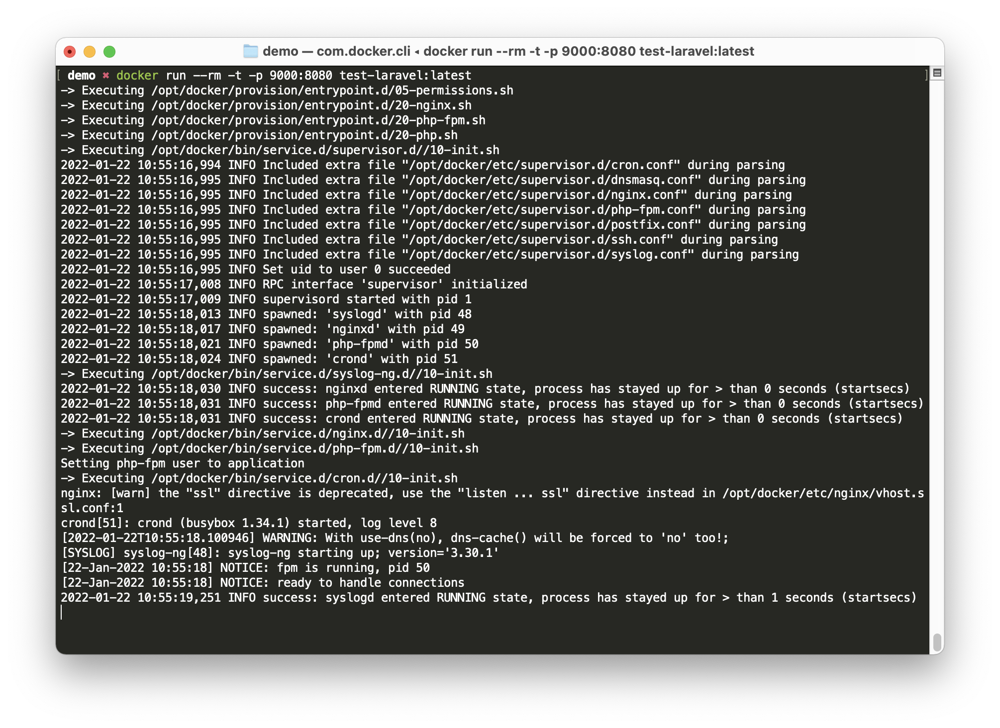
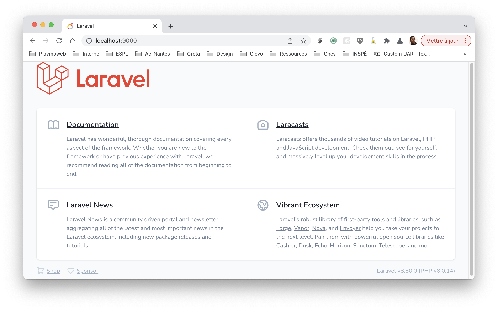

# Déployer un site Laravel avec Docker

Dans le TP [Déployer Laravel](./deployer-laravel.md) nous avons vu comment déployer un site Laravel directement sur la machine. Cette fois-ci nous allons voir comment le faire avec Docker.

::: tip Docker ?
Vous débutez avec Docker ? Je vous conseille plutôt de [démarrer par ici](../docker/introduction.md)
:::

::: details Sommaire
[[toc]]
:::

## Avant-propos

Docker c'est simple ! Les étapes peuvent paraitre effrayante, mais non. Pour vous le prouver, voilà une vidéo de la procédure entière (2min top chrono de la création du projet à la mise à disposition sur votre machine) :

<iframe width="560" height="315" src="https://www.youtube-nocookie.com/embed/l6vrilZQ7G4" title="YouTube video player" frameborder="0" allow="accelerometer; autoplay; clipboard-write; encrypted-media; gyroscope; picture-in-picture" allowfullscreen></iframe>

## Votre site Web

Pour tester (et pour être certains d'avoir un projet propre), nous allons créer un nouveau projet. Mais bien évidemment, dans votre cas, vous utiliserez **vos sources** / **votre projet.**

```sh
composer create-project laravel/laravel demo
cd demo
php artisan serve
```

Rendez-vous sur [http://localhost:8000](http://localhost:8000) votre site doit fonctionner correctement.

## Dockeriser votre application

Maintenant que vous avez validé que votre application fonctionne correctement, nous allons la Dockeriser… La Dockeriser signifie finalement que nous allons la Packager pour pouvoir la déployer sur n'importe quel serveur sans avoir à y installer autre chose que `Docker`.

### Créer le Dockerfile

Dockeriser une application requiert un nouveau fichier dans votre code source. Celui-ci doit se nommer `Dockerfile` je vous laisse créer à la racine de votre site (au même endroit que le `.env`) un fichier nommé `Dockerfile` avec comme contenu :

```dockerfile
FROM webdevops/php-nginx:8.0-alpine

# Installation dans votre Image du minimum pour que Docker fonctionne
RUN apk add oniguruma-dev libxml2-dev
RUN docker-php-ext-install \
        bcmath \
        ctype \
        fileinfo \
        mbstring \
        pdo_mysql \
        tokenizer \
        xml

# Installation dans votre image de Composer
COPY --from=composer:latest /usr/bin/composer /usr/bin/composer

ENV WEB_DOCUMENT_ROOT /app/public
ENV APP_ENV production
WORKDIR /app
COPY . .

# Installation et configuration de votre site pour la production
# https://laravel.com/docs/8.x/deployment#optimizing-configuration-loading
RUN composer install --no-interaction --optimize-autoloader --no-dev
# Optimizing Configuration loading
RUN php artisan config:cache
# Optimizing Route loading
RUN php artisan route:cache
# Optimizing View loading
RUN php artisan view:cache

RUN cp -n .env.example .env
RUN php artisan key:generate

RUN chown -R application:application .
```

::: tip Dockerfile ?

Ce fichier contient l'ensemble de la configuration pour que Laravel fonctionne correctement. Il est en quelque sorte **générique** et pourra servir, quel que soit votre projet.

C'est donc un outil très très pratique surtout avec ce que l'on appelle des plateformes d'intégration continue comme par exemple **Gitlab-CI**.

:::

::: danger le .env

Vous vous souvenez du `.env` ? Ici nous allons avoir le même problème. Dans le fichier `Dockerfile` je me sers du `.env.example` comme référence de configuration.

Je vous laisse adapter / modifier celui-ci pour **indiquer la bonne configuration de votre projet pour la production**.

:::

### Compiler une première fois votre image

Maintenant que nous avons configuré notre fichier Dockerfile, nous allons tenter de la compiler une première fois pour valider son bon fonctionnement.

L'image que vous allez créer sera identique à ce que vous déploierez à la fin sur votre serveur. Vous pouvez donc tester l'ensemble des fonctionnalités.

Pour compiler une première version de votre application, ça va se passer dans le terminal, dans le dossier où vous avez créé le fichier `Dockerfile`

```sh
docker build -t test-laravel:latest .
```

::: danger C'est long ?

Cette étape est un peu longue, c'est normal, votre machine créée en quelque sorte votre machine. Mais rassurez vous l'objectif final c'est que vous ne fassiez plus cette action.

Pourquoi ? Et bien l'objectif c'est que cette étape soit automatisée :

- À chaque fois que vous commitiez.
- Et faite sur un serveur distant de Gitlab-CI.

:::

Que fait cette commande ?

Cette commande va créer votre image, c'est-à-dire que votre machine va créer un conteneur qui sera paramétré avec l'ensemble de la configuration que vous avez indiqué dans votre fichier `Dockerfile`.

C'est comme une sorte de template réutilisable.

PS: Je vous laisse observer ce que fait votre terminal !

Sur ma machine :

<iframe width="560" height="315" src="https://www.youtube-nocookie.com/embed/CB2l0cYkRJM" title="YouTube video player" frameborder="0" allow="accelerometer; autoplay; clipboard-write; encrypted-media; gyroscope; picture-in-picture" allowfullscreen></iframe>

### Lancer votre projet en local pour tester

Pour lancer notre projet en local, rien de plus simple :

```sh
docker run --rm -t -p 9000:80 test-laravel:latest
```

Cette commande va prendre l'image que vous venez de créer puis la lancer. Votre site sera accessible sur le port `9000` notez au passage que nous avons spécifié le nom de l'image à la fin `test-laravel:latest`.




## Docker Compose : prêt à déployer sur votre serveur

Vous avez maintenant « un serveur » qui fonctionne, nous allons ajouter un fichier nommé qui sera utilisé par Docker Compose, cette configuration au format YAML.

Docker Compose vas nous permet de créer de véritable environnement multi conteneur, dans notre cas pour l'instant nous n'aurons que Laravel, mais qui peux le plus peux le moins.

Je vous laisse créer (dans le même dossier que le `Dockerfile`) un fichier nommé `docker-compose.yaml`, pour le contenu le voilà :

```dockerfile
version: "3.9"
services:
  web:
    build: .
    restart: unless-stopped
    ports:
      - "8080:80"
```

Ce fichier indique que vous avez :

- **Un** service.
- Qui expose un port le **8080**. (accessible sur `http://votre.ip:8080`)
- Qui (re)démarrera automatiquement au démarrage de le votre serveur.

### Tester

Pour tester, c'est encore plus simple !

```sh
docker-compose up -d
```

Patientez quelques instants et votre site sera disponible sur le port `8080`.

::: tip C'est ce fichier…

Ce fichier est celui qui nous permettra de lancer facilement votre site sur votre serveur 👌

:::

## Installer Docker sur votre serveur Debian

La procédure est assez similaire à l'installation d'un package classique :

```sh
# Ajout des éléments nécessaire à l'installation
sudo apt-get update
sudo apt-get -y install \
    ca-certificates \
    curl \
    gnupg \
    lsb-release

# Ajout du dépôt permettant d'installer Docker
curl -fsSL https://download.docker.com/linux/debian/gpg | sudo gpg --dearmor -o /usr/share/keyrings/docker-archive-keyring.gpg
echo "deb [arch=$(dpkg --print-architecture) signed-by=/usr/share/keyrings/docker-archive-keyring.gpg] https://download.docker.com/linux/debian  $(lsb_release -cs) stable" | sudo tee /etc/apt/sources.list.d/docker.list > /dev/null

# Update la liste des packages et installation de Docker
sudo apt-get update
sudo apt-get -y install docker-ce docker-ce-cli containerd.io

# Installation de docker Compose
sudo curl -L "https://github.com/docker/compose/releases/download/1.29.2/docker-compose-$(uname -s)-$(uname -m)" -o /usr/local/bin/docker-compose
sudo chmod +x /usr/local/bin/docker-compose
```

**Félicitation,** vous avez maintenant Docker sur votre Serveur.

## Déployer votre site

Pour déployer votre site, il vous suffit :

- Envoyer le code source sur votre serveur (ftp, sftp, git au choix).
- Lancer la commande :

```sh
docker-compose up -d
```

::: tip En modifiant le docker-compose.yml

Vous pouvez évidemment modifier le port d'écoute en éditant le fichier `docker-compose.yml`

:::

## Mettre à jour votre site

Pour mettre à jour votre site, il vous suffit :

- Envoyer le code source sur votre serveur (ftp, sftp, git au choix).
- Lancer la commande :

```sh
docker-compose up --build -d
```
