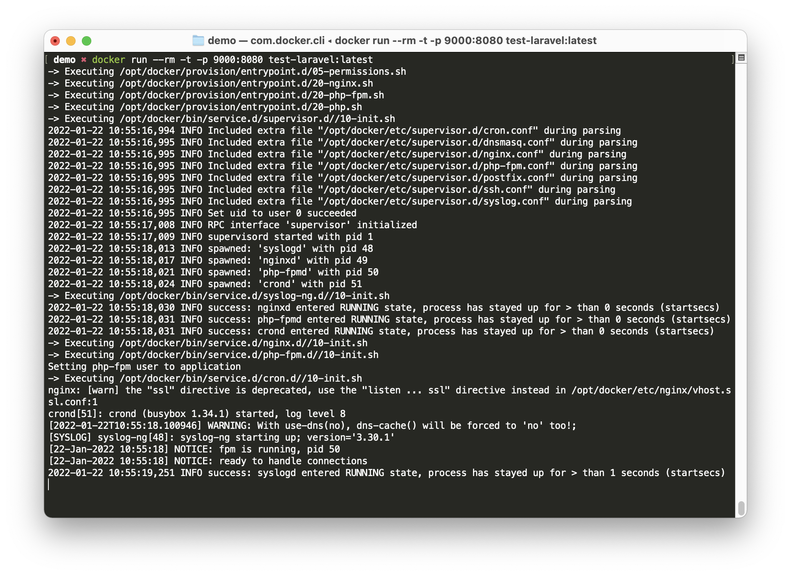
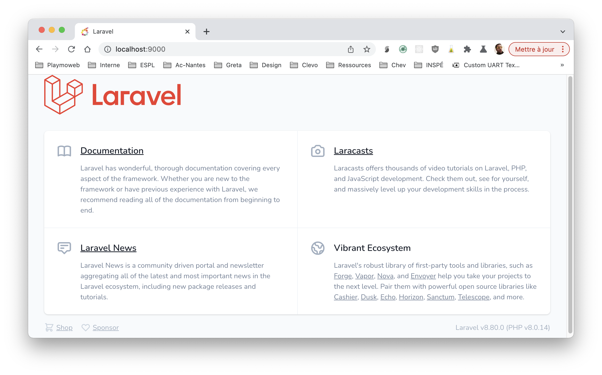

# Déployer un site Laravel avec Docker

Dans le TP [Déployer Laravel](./deployer-laravel.md) nous avons vu comment déployer un site Laravel directement sur la machine. Cette fois-ci nous allons voir comment le faire avec Docker.

::: tip Docker ?
Vous débutez avec Docker ? Je vous conseille plutôt de [démarrer par ici](../docker/introduction.md)
:::

::: details Sommaire
[[toc]]
:::

::: details TL;DR

Vous êtes pressé ? Vous ne voulez pas lire ?

Installation de Docker sur votre serveur :

```sh
# Ajout des éléments nécessaires à l'installation
apt-get update
apt-get install -y \
    ca-certificates \
    curl \
    gnupg \
    lsb-release

# Ajout du dépôt permettant d'installer Docker
install -m 0755 -d /etc/apt/keyrings
curl -fsSL https://download.docker.com/linux/debian/gpg -o /etc/apt/keyrings/docker.asc
chmod a+r /etc/apt/keyrings/docker.asc
echo \
  "deb [arch=$(dpkg --print-architecture) signed-by=/etc/apt/keyrings/docker.asc] https://download.docker.com/linux/debian \
  $(. /etc/os-release && echo "$VERSION_CODENAME") stable" | \
  tee /etc/apt/sources.list.d/docker.list > /dev/null

# Mise à jour de la liste des paquets et installation de Docker
apt-get update
apt-get install -y docker-ce docker-ce-cli containerd.io docker-buildx-plugin docker-compose-plugin
```

Création de votre fichier `Dockerfile` :

```dockerfile
FROM webdevops/php-nginx:8.3-alpine

# Installation des dépendances système
RUN apk add oniguruma-dev libxml2-dev nodejs npm

RUN docker-php-ext-install \
        bcmath \
        ctype \
        fileinfo \
        mbstring \
        pdo_mysql \
        xml

# Installation de Composer
COPY --from=composer:latest /usr/bin/composer /usr/bin/composer

ENV WEB_DOCUMENT_ROOT /app/public
ENV APP_ENV production
WORKDIR /app
COPY . .

# Copie du fichier .env (modifiez .env.example avec votre configuration de production)
RUN cp -n .env.example .env

# Installation des dépendances PHP et optimisations Laravel pour la production
# https://laravel.com/docs/deployment#optimizing-configuration-loading
RUN composer install --no-interaction --optimize-autoloader --no-dev
RUN php artisan key:generate
RUN php artisan config:cache
RUN php artisan route:cache
RUN php artisan view:cache

# Compilation des assets front-end
RUN npm install
RUN npm run build

RUN chown -R application:application .
```

Création de votre fichier `docker-compose.yaml` :

```yaml
services:
  web:
    build: .
    restart: unless-stopped
    ports:
      - "8080:80"
    depends_on:
      - db

  db:
    image: mariadb:11.3
    restart: unless-stopped
    ports:
      - "3306:3306"
    environment:
      MARIADB_DATABASE: demo
      MARIADB_USER: demo
      MARIADB_PASSWORD: demo
      MARIADB_ROOT_PASSWORD: root
    volumes:
      - ./data/db:/var/lib/mysql
```

Déploiement de votre site :

```sh
docker compose up -d
```

:::
## Avant-propos

Docker c'est simple ! Les étapes peuvent paraître effrayantes, mais non. Pour vous le prouver, voilà une vidéo de la procédure entière (2 min top chrono, de la création du projet à la mise à disposition sur votre machine) :

<iframe width="560" height="315" src="https://www.youtube-nocookie.com/embed/l6vrilZQ7G4" title="YouTube video player" frameborder="0" allow="accelerometer; autoplay; clipboard-write; encrypted-media; gyroscope; picture-in-picture" allowfullscreen></iframe>

## Votre site Web

Pour tester (et pour être certains d'avoir un projet propre), nous allons créer un nouveau projet. Mais bien évidemment, dans votre cas, vous utiliserez **vos sources** / **votre projet.**

```sh
composer create-project laravel/laravel demo
cd demo
php artisan serve
```

Rendez-vous sur [http://localhost:8000](http://localhost:8000) — votre site doit fonctionner correctement.

## Dockeriser votre application

Maintenant que vous avez validé que votre application fonctionne correctement, nous allons la dockeriser. Dockeriser signifie packager l'application pour pouvoir la déployer sur n'importe quel serveur sans avoir à y installer autre chose que Docker.

### Créer le Dockerfile

Dockeriser une application requiert un nouveau fichier dans votre code source, nommé `Dockerfile`. Créez-le à la racine de votre projet (au même endroit que le `.env`) avec le contenu suivant :

```dockerfile
FROM webdevops/php-nginx:8.3-alpine

# Installation des dépendances système
RUN apk add oniguruma-dev libxml2-dev nodejs npm

RUN docker-php-ext-install \
        bcmath \
        ctype \
        fileinfo \
        mbstring \
        pdo_mysql \
        xml

# Installation de Composer
COPY --from=composer:latest /usr/bin/composer /usr/bin/composer

ENV WEB_DOCUMENT_ROOT /app/public
ENV APP_ENV production
WORKDIR /app
COPY . .

# Copie du .env.example en .env
# Modifiez .env.example pour indiquer la configuration de production avant de builder
RUN cp -n .env.example .env

# Installation des dépendances PHP et optimisations Laravel
# https://laravel.com/docs/deployment#optimizing-configuration-loading
RUN composer install --no-interaction --optimize-autoloader --no-dev
RUN php artisan key:generate
RUN php artisan config:cache
RUN php artisan route:cache
RUN php artisan view:cache

# Compilation des assets front-end
RUN npm install
RUN npm run build

RUN chown -R application:application .
```

::: tip Dockerfile ?

Ce fichier contient l'ensemble de la configuration pour que Laravel fonctionne correctement. Il est en quelque sorte **générique** et pourra servir quel que soit votre projet Laravel.

C'est donc un outil très pratique, surtout dans le cadre de ce que l'on appelle l'intégration continue — avec **GitLab CI** par exemple.

**Attention, ce fichier doit être placé à la racine de votre projet, au même niveau que le `.env`.**

:::

::: danger Le .env

Vous vous souvenez du `.env` ? Ici nous allons avoir le même problème. Dans le `Dockerfile`, nous utilisons le `.env.example` comme référence de configuration.

Adaptez ce fichier pour **indiquer la bonne configuration de votre projet pour la production** avant de lancer le build.

:::

### Compiler votre image une première fois

Maintenant que le `Dockerfile` est prêt, nous allons compiler l'image pour valider son bon fonctionnement.

L'image créée sera identique à ce que vous déploierez sur votre serveur. Vous pouvez donc tester l'ensemble des fonctionnalités.

```sh
docker build -t test-laravel:latest .
```

::: danger C'est long ?

C'est normal : votre machine construit une image complète avec toutes les dépendances. Rassurez-vous, l'objectif final c'est de ne plus faire cette action manuellement.

Pourquoi ? Parce que cette étape sera automatisée :

- À chaque fois que vous commitez.
- Sur un serveur distant via GitLab CI.

:::

Cette commande crée votre image Docker : un template réutilisable contenant votre application et toute sa configuration.

Observez ce que fait votre terminal pendant la construction !

Sur ma machine :

<iframe width="560" height="315" src="https://www.youtube-nocookie.com/embed/CB2l0cYkRJM" title="YouTube video player" frameborder="0" allow="accelerometer; autoplay; clipboard-write; encrypted-media; gyroscope; picture-in-picture" allowfullscreen></iframe>

## Lancer votre image pour tester

Maintenant que l'image est créée, lancez-la pour vérifier que tout fonctionne :

```sh
docker run -p 8080:80 test-laravel:latest
```

Détail de la commande :

- `docker run` : lance un conteneur.
- `-p 8080:80` : redirige le port `8080` de votre machine vers le port `80` du conteneur.
- `test-laravel:latest` : nom de l'image à utiliser.

Testez votre site sur [http://localhost:8080](http://localhost:8080).

Pour la suite, nous allons utiliser Docker Compose afin de décrire l'ensemble de la configuration dans un seul fichier et préparer le déploiement.

## Docker Compose : prêt à déployer sur votre serveur

Vous avez maintenant un conteneur qui fonctionne. Nous allons créer un fichier `docker-compose.yaml` pour décrire l'ensemble de l'environnement de façon déclarative. Docker Compose permet de gérer des environnements multi-conteneurs — pour l'instant nous n'aurons que Laravel, mais qui peut le plus peut le moins.

Créez (dans le même dossier que le `Dockerfile`) un fichier nommé `docker-compose.yaml` :

```yaml
services:
  web:
    build: .
    restart: unless-stopped
    ports:
      - "8080:80"
```

Ce fichier déclare :

- **Un** service nommé `web`.
- Qui expose le port **8080** (accessible sur `http://votre.ip:8080`).
- Qui redémarre automatiquement au démarrage du serveur.

::: tip Un instant ?

À votre avis :

- Quelles autres valeurs sont disponibles pour `restart` ? [C'est par ici.](https://docs.docker.com/config/containers/start-containers-automatically/)
- À quoi correspond `"8080:80"` ? Pourquoi le site tourne sur le port `80` à l'intérieur du conteneur mais est accessible sur le `8080` depuis l'extérieur ?
- Est-il possible de déclarer plusieurs services ? [C'est par ici.](https://docs.docker.com/compose/compose-file/)

:::

### Tester

```sh
docker compose up -d
```

Votre site sera disponible sur [http://localhost:8080](http://localhost:8080).

::: tip C'est ce fichier…

Ce fichier est celui qui nous permettra de lancer facilement votre site sur votre serveur 👌

:::




### Ajouter une base de données

Ajoutons maintenant une base de données. Il suffit d'ajouter un service dans le fichier `docker-compose.yaml` :

```yaml
services:
  web:
    build: .
    restart: unless-stopped
    ports:
      - "8080:80"
    depends_on:
      - db

  db:
    image: mariadb:11.3
    restart: unless-stopped
    ports:
      - "3306:3306"
    environment:
      MARIADB_DATABASE: demo
      MARIADB_USER: demo
      MARIADB_PASSWORD: demo
      MARIADB_ROOT_PASSWORD: root
    volumes:
      - ./data/db:/var/lib/mysql
```

Nous avons maintenant deux services :

- `web` : notre application Laravel.
- `db` : notre base de données MariaDB.

Pour que Laravel utilise cette base de données, modifiez le fichier `.env.example` avant de rebuilder l'image :

::: tip Le fichier .env

Modifiez les variables suivantes dans `.env.example` :

```txt
DB_CONNECTION=mysql
DB_HOST=db
DB_PORT=3306
DB_DATABASE=demo
DB_USERNAME=demo
DB_PASSWORD=demo
```

`DB_HOST=db` correspond au nom du service `db` déclaré dans le `docker-compose.yaml`. Docker Compose crée automatiquement un réseau interne qui permet aux conteneurs de se joindre par leur nom de service.

:::

## Installer Docker sur votre serveur Debian

```sh
# Ajout des éléments nécessaires à l'installation
apt-get update
apt-get install -y \
    ca-certificates \
    curl \
    gnupg \
    lsb-release

# Ajout du dépôt Docker
install -m 0755 -d /etc/apt/keyrings
curl -fsSL https://download.docker.com/linux/debian/gpg -o /etc/apt/keyrings/docker.asc
chmod a+r /etc/apt/keyrings/docker.asc
echo \
  "deb [arch=$(dpkg --print-architecture) signed-by=/etc/apt/keyrings/docker.asc] https://download.docker.com/linux/debian \
  $(. /etc/os-release && echo "$VERSION_CODENAME") stable" | \
  tee /etc/apt/sources.list.d/docker.list > /dev/null

# Mise à jour et installation de Docker
apt-get update
apt-get install -y docker-ce docker-ce-cli containerd.io docker-buildx-plugin docker-compose-plugin
```

**Félicitations,** vous avez maintenant Docker sur votre serveur.

::: tip Un instant !

À votre avis :

- D'où viennent ces commandes ? [Des informations ici.](https://docs.docker.com/engine/install/debian/)
- Pourquoi devez-vous être vigilant quand vous copiez/collez des commandes provenant d'internet ?

:::

## Déployer votre site

Pour déployer votre site :

1. Envoyez le code source sur votre serveur (FTP, SFTP, Git, au choix).
2. Lancez la commande :

```sh
docker compose up -d
```

::: tip Un instant !

À votre avis :

- Pouvez-vous modifier le port d'écoute de votre serveur ? (oui, dans le `docker-compose.yaml` — mais comment ?)
- Est-ce que votre service démarrera automatiquement si vous redémarrez votre serveur ?

:::

## Mettre à jour votre site

Pour mettre à jour votre site :

1. Envoyez le code source mis à jour sur votre serveur.
2. Lancez la commande :

```sh
docker compose up --build -d
```

Le flag `--build` force la reconstruction de l'image avant de relancer les conteneurs.

## C'est à vous

Ajoutez une nouvelle page dans votre site — une page « Conditions générales » par exemple. Une fois cette page ajoutée, déployez-la sur votre serveur.

## La suite ?

La suite, c'est peut-être l'automatisation du déploiement avec [Dokploy](/tp/devops/paas/dokploy.md). L'objectif : ne plus avoir à lancer `docker compose up -d` manuellement à chaque mise à jour.

Consultez le TP [Dokploy](/tp/devops/paas/dokploy.md) pour en savoir plus.