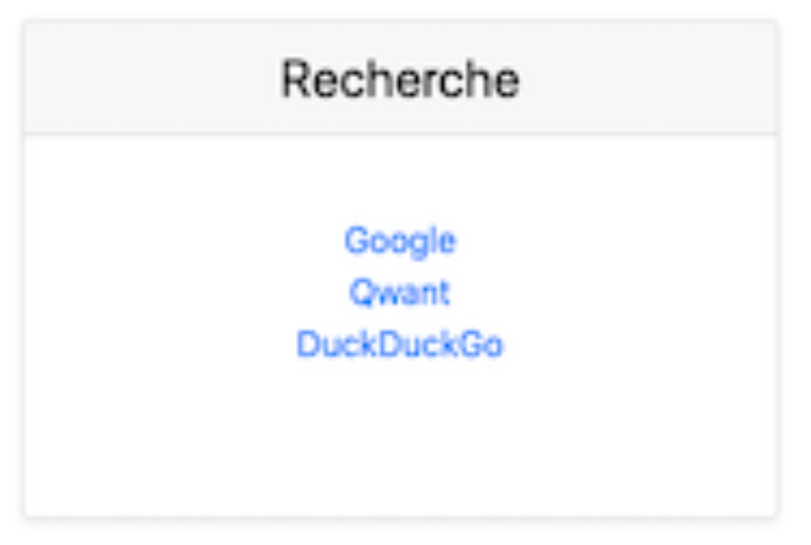

# (Ré)organiser mon code

## Introduction

Dans ce TP, nous allons voir comment « ré-organiser » du code pour le rendre plus facilement maintenable.

⚠️ Le code original fourni est clairement de mauvaise qualité. Il ne doit pas être pris comme référence. ⚠️

## Code

Le code est [disponible ici](./shitty-app.zip). Les premières étapes sont :

- Installer Wamp (si pas déjà fait).
- Télécharger et « installer » les sources dans votre WAMP.
- Prendre en main l'application (naviguer dans les écrans).
- Regarder le code source.

L'application doit ressembler à :


## Première analyse du code

Maintenant que vous avez pris en main le code source, quelles sont les remarques sur le code pouvez-vous émettre :

```text
Vos remarques


```

PS : cette première analyse est importante !



- Non-utilisation de template.
- Le code des listes est répété (sans utilisation de fonction).
- Le Header et le Footer HTML sont dupliqués entre les deux pages.
- Le « Widget » HTML des listes est répété 3x.
- L'accès à la donnée n'est pas centralisé. (les fichiers JSON sont ouverts directement depuis la page.)
- Il n'y a pas de DAO.
- Il n'y a aucun modèle de données.
- Pas de configuration centralisée.



## Détail des fonctionnalités

Avant de commencer à modifier le code, il faut « lister / détailler » les différentes fonctionnalités de l'application. Pour moi voilà les points clef

- Deux pages. (une complète, l'autre de détail.)
- Utilisation de bootstrap.
- Les données sont stockées dans des fichiers JSON.
- L'interface est responsive.
- Il est possible d'ajouter des éléments via l'interface web.

## Début des modifications

Comme vous l'avez constaté l'application comporte de nombreux défauts (plus ou moins important). Nous allons les prendre dans l'ordre :

- Le découpage (pour éviter la duplication du code HTML).
- Réécrire la page d'accueil pour ne plus avoir 3x le même code à la suite.
- Créer un modèle qui représente un « lien ».
- Créer un DAO pour l'accès à la donnée (lecture, ajout).
- Créer un fichier PHP « avec les paramètres/constantes » de l'application.

## Le découpage du code HTML

### Header & Footer

La première étape est de découper le HTML pour éviter la duplication de code HTML.

- Sortir le Header dans une fonction avec paramètre pour le titre.
- Sortir le Footer dans une fonction.

Pour l'organisation, je vous propose d'écrire un fichier PHP `index.php`. Bien évidemment, nous n'allons pas le mettre à la racine. Mais dans un dossier nommé (par exemple) `fonctions`.

C'est à vous :

- Créer le dossier.
- Créer un fichier `index.php` à l'interieur de celui-ci.

Votre arborescence doit maintenant ressembler à :

```shell
├── data
│   ├── reddit.json
│   ├── search.json
│   └── twitter.json
├── detail.php
├── fonctions
│   └── index.php
├── index.php
└── public
    └── main.css
```

Pour vous aider dans votre mission voilà la structure du fichier :

```php
<?php

function header($titre) {
    echo "…";
}

function footer($titre) {
    echo "…";
}
```

C'est à vous, dans la page `index.php` actuelle isolez le code relatif au `header` et au `footer` et mettez le dans les bonnes fonctions.

Utilisez maintenant les fonctions dans votre code.

> Rappel : en PHP vous devez `include` les fichiers pour rendre le code accessible dans la page. Exemple :

```php
<?php
    include("fonctions/index.php);

    header();
```

### Tester

Valider le bon fonctionnement de votre modification avant d'aller plus loin.

### Reflechissons ensemble

C'est bien, mais est-il possible de faire autrement ? Pouvons-nous utiliser un objet plutôt que deux fonctions ?

- Est-ce intéressant ?
- Quel est l'avantage ?

### Réécriture des listes de lien

Comme vous l'avez constaté, les listes de lien (ainsi que le code PHP) sont répétés 3x. Procéder ainsi est à la fois inefficace et inutile. Prendre du temps pour éviter ce genre de choses est primordiale et vous évitera bien des tracas en cas de mise à jour de votre code (ou de celui d'un collègue).

Pour rappel, les listes de liens ressemblent à :



Regardons ensemble le code source de cet élément :

```html
<div class="card mb-4 shadow-sm">
    <div class="card-header">
    <a class="nolink" href="detail.php?c=search"><h4 class="my-0 font-weight-normal">Recherche <i class="material-icons">edit</i></h4></a>
    </div>
    <div class="card-body">
    <ul class="list-unstyled mt-3 mb-4">
        <?php
        $data = json_decode(file_get_contents("./data/search.json"));
        foreach($data as $d){
            echo "<li><a rel='nofollow' target='_blank' href='" . $d->lien . "'>" . $d->name . "</a></li>";
        }
        ?>
    </ul>
    </div>
</div>
```

- Quels éléments sont variables ?
- Comment re-formater le code pour le transformer en fonction ?

### Place au code

Cette fois-ci pas ou peu d'expliquation… Dans `fonctions/index.php` ajouter une fonction nommée `genereListe`. Pour la suite, je vous laisse chercher.

```php
function genereListe($title, $file){
    // Votre code ici.
}
```

Remplacer le code dupliqué, par l'appel à votre fonction.

### Tester

Valider le bon fonctionnement de votre modification avant d'aller plus loin.

### Page detail.php

Utilisez vos nouvelles fonctions dans la page `detail.php`. Cette fois-ci pas d'aide.

## L'organisation du code PHP

Comme vous devez le constater, nous n'avons pas retiré le code dupliqué… Nous l'avons simplifié, mais pas supprimé.

À votre avis, comment procéder ?



```php
$elements = [
    ["file" => "search", "title" => "Rechercher"],
    ["file" => "reddit", "title" => "Reddit"],
    ["file" => "twitter", "title" => "Twitter"],
];

foreach($elements as $el){
    genereListe($el['title'], $el['file']);
}
```

- Quel est l'avantage de ma solution ?
- Est-ce meilleur que la vôtre ?



## Le modèle de la donnée

Lors de l'analyse du code, vous avez remarqué qu'il était possible d'ajouter des liens dans les fichiers JSON.

L'ajout est fait « à l'arrache », oui ça fonctionne… Mais ce n'est clairement pas optimal.

Nous allons donc commencer par créer un modèle, le modèle va permettre de « normaliser » notre développement et va simplifier la réutilisation du code.

Par formalisme, nous allons appeler notre dossier `modeles` avec dedans un fichier `lien.php`.

C'est à vous créer le dossier et le fichier.

Votre arborescence doit maintenant ressembler à :

```shell
├── data
│   ├── reddit.json
│   ├── search.json
│   └── twitter.json
├── detail.php
├── fonctions
│   └── index.php
├── index.php
├── modeles
│   └── lien.php
└── public
    └── main.cs
```

### La class PhP

Pour vous aider, voilà la classe Lien :

```php
<?php
class Lien {
    public $lien = "";
    public $name = "";

    function __construct($lien, $name)
    {
        $this->lien = $lien;
        $this->name = $name;
    }
}
```

### Utiliser la class

Maintenant que nous avons défini la classe utilisons là !

Dans le fichier `detail.php` :

- Trouvez l'endroit où se trouve l'ajout (`array_push`…)
- Remplacez le Tableau par l'utilisation de l'objet.

### Tester

Valider que le site fonctionne toujours.

### Faire évoluer la classe

Le gros plus d'avoir un modèle, c'est la possibilité d'ajouter des méthodes. Je vous propose d'ajouter une méthode permettant de valider que le lien est bien un lien.

Créer une méthode avec le code suivant :

```php
$url = filter_var($this->link, FILTER_SANITIZE_URL);
return filter_var($url, FILTER_VALIDATE_URL) !== false;
```

⏩ Utiliser la méthode dans votre code pour n'ajouter le lien que si celui-ci est valide.

### Tester

Valider que le site fonctionne toujours.

## Le DAO

Le DAO, est également un élément important. Cette classe va nous centraliser le code pour tout ce qui est l'accès à la donnée (ajout, suppression, liste).

Comme vu en cours, l'une des possibilités pour un DAO est de créer une classe avec des méthodes `static` (c'est-à-dire accessible sans créer l'objet). C'est cette solution que je vous propose de faire.

Dans le code, nous avons deux actions possibles :

- Avoir le contenu (liste).
- Ajouter du contenu.

### L'organisation

La première étape est de créer les dossiers, par convention, nous allons « ranger » notre `DAO` dans un dossier nommée dao et dans un fichier qui regroupe les actions similaires (ou qui font référence à la même chose). Dans notre cas :

- Créer un dossier nommé `dao`
- Créer un fichier dedans nommé `liens.php`

Votre arborescence doit maintenant ressembler à :

```shell
├── dao
│   └── liens.php
├── data
│   ├── reddit.json
│   ├── search.json
│   └── twitter.json
├── detail.php
├── fonctions
│   └── index.php
├── index.php
├── modeles
│   └── lien.php
└── public
    └── main.css
```

### Base du code PHP

Pour vous aider voilà la base du code :

```php
<?php
class LienDao {
    static function get($fichier){
        // Votre code ici
        // return [];
    }
    static function put($fichier, $lien, $name){
        // Votre code ici
        // return ???;
    }
}
```

- Compléter les méthodes avec le code précédemment réalisé, en ne gardant bien évidemment que le code PHP…
- Utiliser le DAO dans votre code PHP (`index.php` et `detail.php`)

⚠️ Rappel les méthodes `static` en PHP sont appelées comme ça `LienDao::get("")`.

### Tester

Valider que le site fonctionne toujours.

## Les paramètres

Nous avons maintenant mis en place la structure. Mais comme vous pouvez le constater nous avons encore à un certains nombre d'endroit « des éléments en dur ».

Par exemple le tableau « $elements », celui-ci contient des valeurs static « twitter », « search », etc. Si vous souhaitez ajouter une nouvelle catégorie, vous allez devoir ajouter un élément dans le tableau (et surtout vous souvenir à quel endroit celui-ci est défini).

De la même façon, le chemin vers les « data » est également écrit en dur dans votre DAO.

Également le nom de votre site est également écrit en dur.

Les 3 points que j'ai évoqués ne gênent évidemment en rien le bon fonctionnement de votre site web. Cependant ça rend votre code très « opaque » au changement. Une bonne habitude est donc de sortir dans « un fichier de paramètre » ce qui vous semble pouvoir varier ou changer un jour.

### Modification du code

Nous allons donc créer un dossier « paramètre » et un fichier « parametres.php »

- Créer un dossier `parametre`.
- Créer un fichier `parametres.php`.

Votre structure doit maintenant ressembler à quelques choses comme :

```bash
├── dao
│   └── liens.php
├── data
│   ├── reddit.json
│   ├── search.json
│   └── twitter.json
├── detail.php
├── fonctions
│   └── index.php
├── index.php
├── modeles
│   └── lien.php
├── parametre
│   └── parametres.php
└── public
    └── main.css
```

### Le fichier parametres.php

Le fichier `parametres.php` va contenir l'ensemble des éléments susceptible de changer dans « la vie » de votre application.

C'est ce que l'on va appeler des constantes.

Voici un exemple de contenu :

```php
<?php

$_SITE_TITLE = "Shitty Application";
$_ELEMENTS = [
    ["file" => "search", "title" => "Rechercher"],
    ["file" => "reddit", "title" => "Reddit"],
    ["file" => "twitter", "title" => "Twitter"],
];
$_DATA_PATH = "../data/";

```

Placer ce contenu dans le fichier `parametres.php`.

### Utiliser les « constantes »

Modifier vos différentes pages PHP pour utiliser les constantes nouvellement définies.

## En plus : Ne pas autoriser plusieurs lien identique

Pour l'instant, il est possible d'insérer plusieurs fois le même lien dans la base de données.

- Modifier la méthode `put` du DAO pour qu'elle n'autorise plus ce genre de choses.

## En plus : Migration vers MySQL

Nous allons profiter de la mise en place d'un DAO pour migrer notre code ! Les JSON c'est pratique pour tester, mais pas forcément pérenne dans le temps.

- Concevez une petite base de données simple.
- Modifier votre DAO pour utiliser votre base de données.
- N'oubliez pas de mettre dans le fichier `parametres.php` la configuration de votre connexion. (️⚠️ Surtout ne l'écrivez pas dans le DAO ⚠️).

⚠️ Vous avez vu l'avantage ! Nous avons modifier **un seul fichier** et l'ensemble de votre code utilise maintenant MySQL comme système de base de données.
