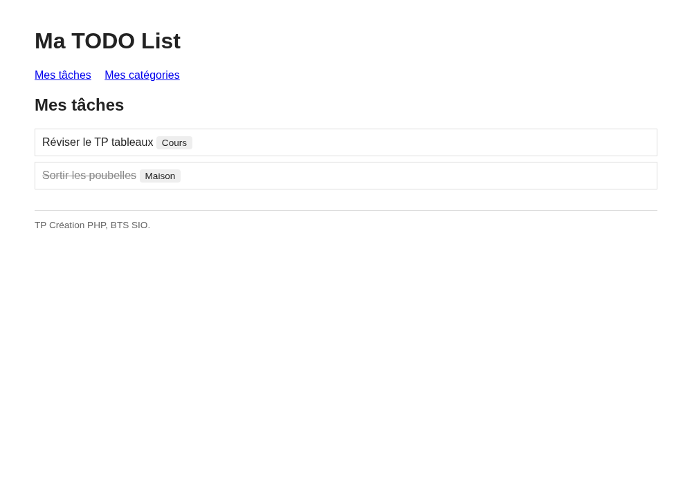
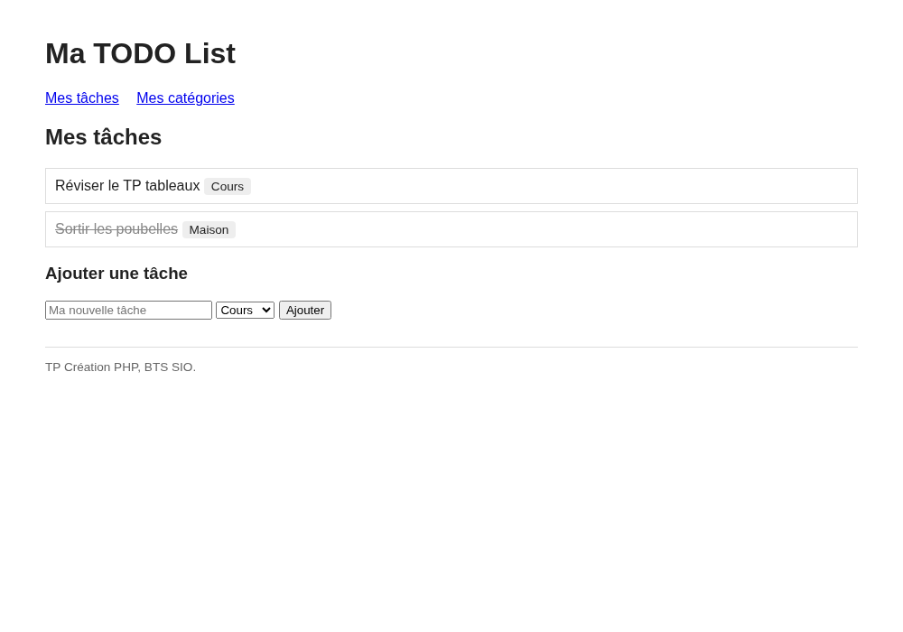
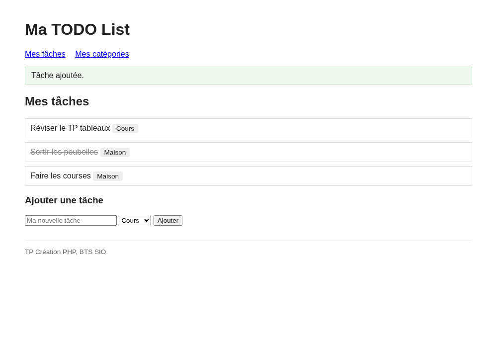
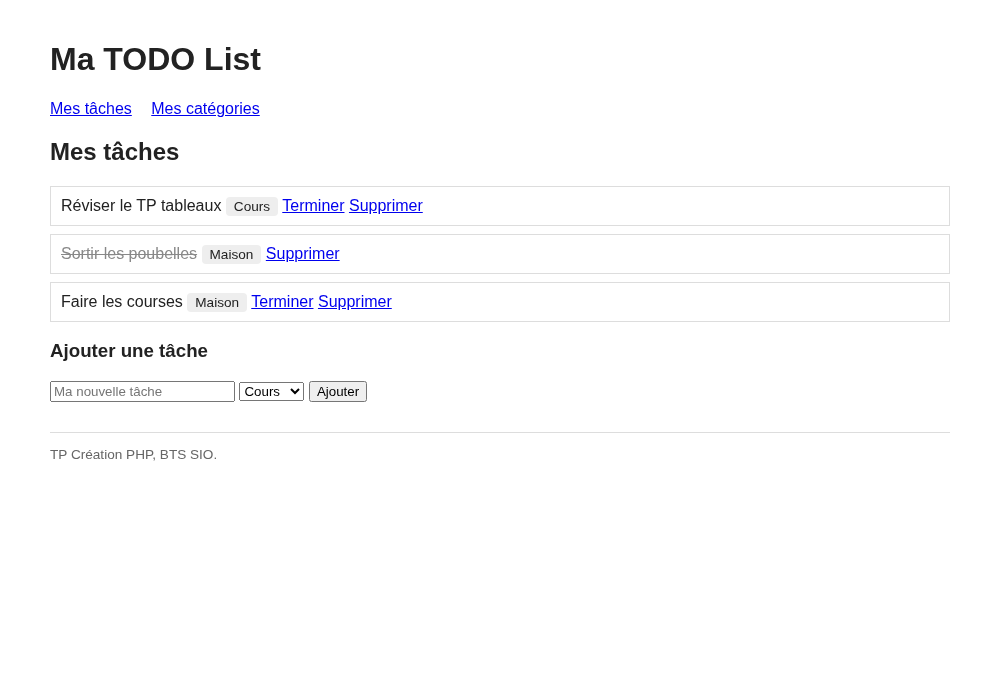
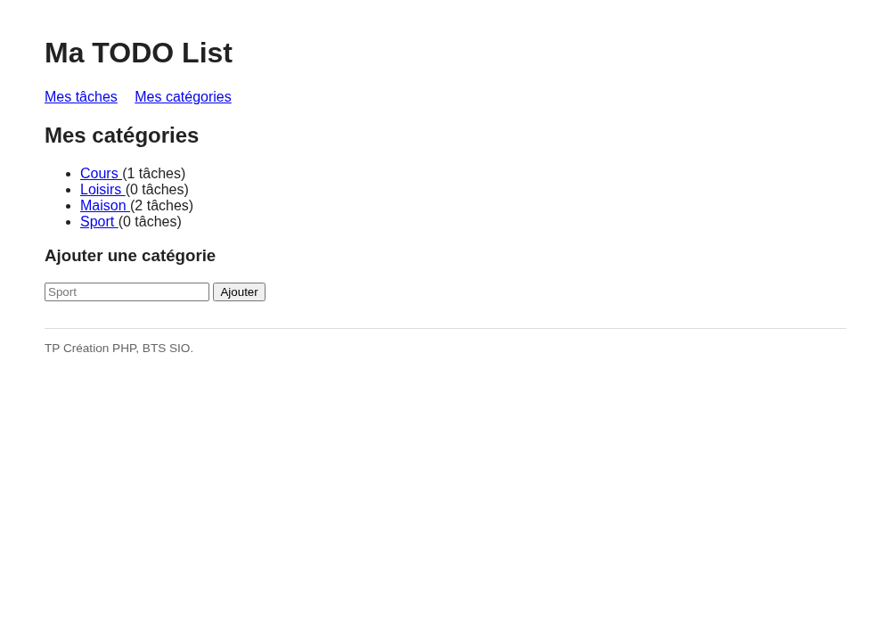
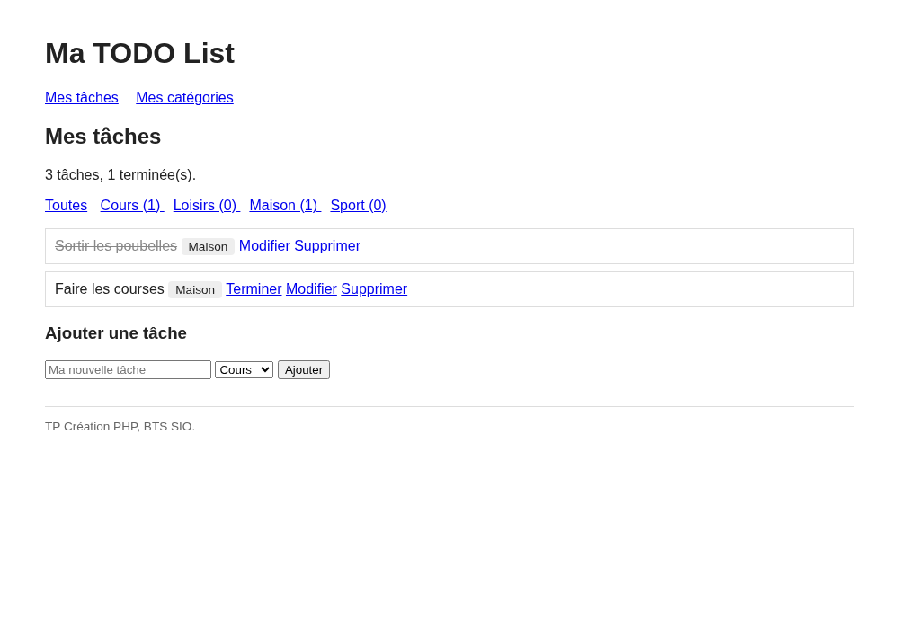
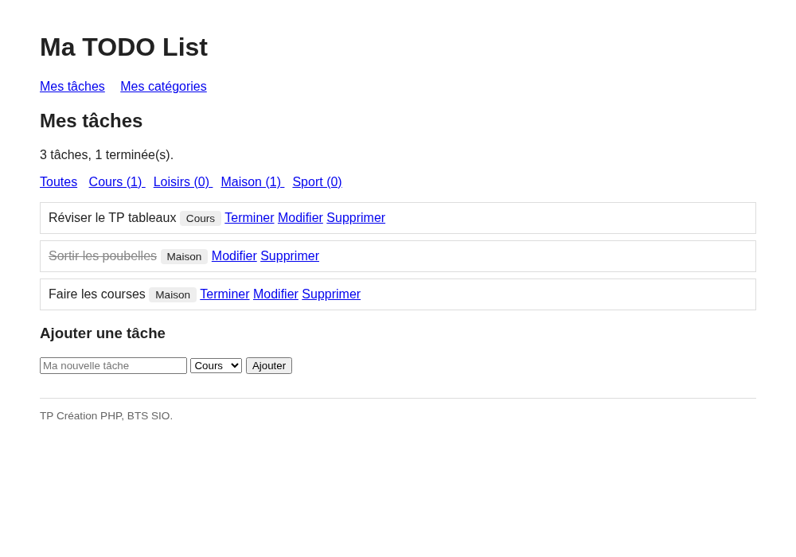
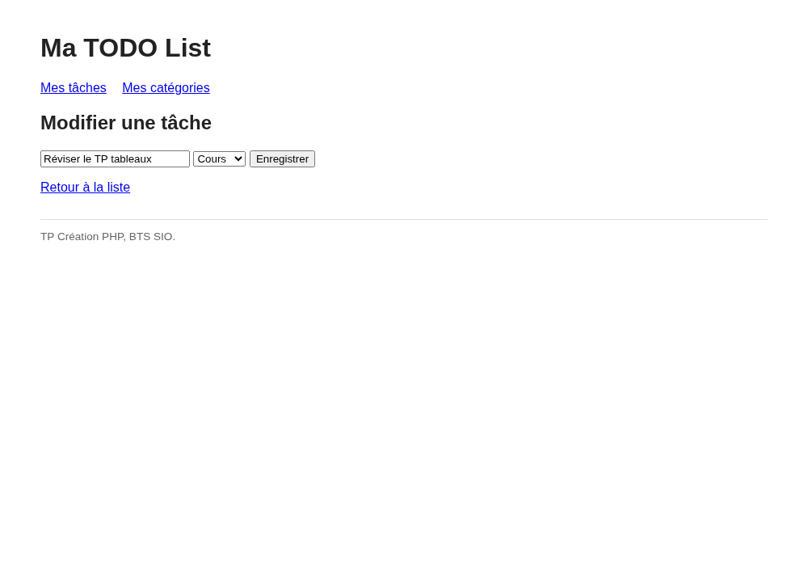

# TP Création : La TODO List

::: details Sommaire
[[toc]]
:::

Depuis le [TP 2](./tp2.md), vous savez lire et écrire dans une base de données avec PDO. Au [TP 3](./tp3.md), vous avez mis en place la structure « entry-point » avec un `index.php` et sa whitelist. Au [TP Tableaux](./tp-tableaux.md), vous avez appris à parcourir des données avec un `foreach`. Aux [TP 4](./tp4.md) et [TP 5](./tp5.md), vous avez vu que la session sert à retenir l'**état du visiteur** (un message, une préférence, « connecté ou non »), et au [TP Authentification](./sql/tp-authentification.md) vous avez mis tout ça bout à bout.

Aujourd'hui, on assemble le tout pour construire une vraie petite application : **une liste de tâches** (une TODO List), avec des catégories, dans laquelle on peut ajouter, terminer, modifier et supprimer. Et cette fois, les données vivent là où elles doivent vivre : dans une **base de données**.

Attention, ce TP n'est pas un point étape noté. C'est un **TP de création** : il commence en séance (2 heures : les slides puis la partie 1, très guidée) et il se termine à la maison (parties 2 et 3). À la fin, vous déposez votre travail et je le **valide** à l'aide d'une grille de validation : « validé » ou « à revoir ».

Ce qui est attendu :

- **En fin de séance** : la partie 1 terminée, c'est à dire une liste dans laquelle on peut ajouter une tâche, la terminer et la supprimer.
- **À la maison** : la partie 2 (les catégories, le filtre, les compteurs) puis la première étape de la partie 3 (modifier une tâche).

::: tip Ce n'est pas un TP de design
L'objectif ici, c'est la **logique** : décrire des données, les lire avec une requête, boucler dessus, et transformer un clic en action. Une simple liste `<ul>` avec des liens suffit largement. Je vous fournis même la CSS pour que ce soit lisible. Un peu de décoration à la fin si le cœur vous en dit, mais ça ne rapporte rien.
:::

::: tip Et le SQL dans tout ça ?
Le langage SQL et la modélisation, c'est le cours de votre collègue enseignant de base de données. Ici, on **applique** depuis PHP : je vous fournis la base et les requêtes dont vous avez besoin, et nous nous concentrons sur la façon de les brancher à une page web.
:::

Dans ce TP, je vous invite à avoir en parallèle :

- [Le complément de cours SQL](./sql/support.md), et notamment [obtenir des données](./sql/support.md#obtenir-des-donnees), [ajouter](./sql/support.md#ajouter-des-donnees), [modifier](./sql/support.md#modifier-des-donnees) et [supprimer](./sql/support.md#supprimer-une-donnee).
- [L'aide mémoire PHP](/cheatsheets/php/), en particulier [le PHP et la base de données](/cheatsheets/php/#le-php-et-la-base-de-donnees).
- [Le complément de cours sécurité](./securite/support.md#les-requetes-preparees) pour les requêtes préparées.

## Les slides

Avant de commencer, un tour rapide des compétences du jour : où vivent les données d'une application, ce qu'est une ligne dans une table, et comment un clic devient une requête.

<ClientOnly>
<SlidesDeck src="php_creation_todo" />
</ClientOnly>

## Prérequis

- **XAMPP ou WAMP** démarré (Apache + MySQL/MariaDB) et **phpMyAdmin** accessible (en général [http://localhost/phpmyadmin](http://localhost/phpmyadmin)).
- La structure de projet du [TP 3](./tp3.md) : un `index.php` en point d'entrée avec sa whitelist, les dossiers `common/`, `pages/`, `public/` et le fichier `utils/db.php`.
- Les requêtes préparées du [TP 2](./tp2.md).

::: details Rattrapage express : le contenu de `utils/db.php`

Vous ne retrouvez plus votre fichier ? Le voici, seule la première partie est à adapter (c'est celui du [support SQL](./sql/support.md#utils-db-php), avec deux options en plus) :

```php
<?php
// Cette partie est à customiser
$server = "localhost";
$db = "todo";
$user = "root";
$passwd = "";
// Fin de la partie customisable

$dsn = "mysql:host=$server;dbname=$db;charset=utf8mb4";
$pdo = new PDO($dsn, $user, $passwd);
$pdo->setAttribute(PDO::ATTR_ERRMODE, PDO::ERRMODE_EXCEPTION);
```

- `charset=utf8mb4` : sans lui, vos accents s'affichent en « é ». 😬
- `ERRMODE_EXCEPTION` : en cas d'erreur SQL, PHP vous affiche un vrai message plutôt que de continuer en silence.

:::

::: details Rattrapage express : requête normale ou requête préparée ?

La règle tient en une phrase : **une valeur qui vient de l'utilisateur ne se concatène jamais dans une requête**, elle passe par un paramètre.

```php
// Aucune valeur variable : requête normale
$tasks = $pdo->query("SELECT * FROM taches")->fetchAll(PDO::FETCH_ASSOC);

// Une valeur qui vient de l'utilisateur : requête préparée
$stmt = $pdo->prepare("SELECT * FROM taches WHERE id = ?");
$stmt->execute([$_GET['id']]);
$task = $stmt->fetch(PDO::FETCH_ASSOC);
```

Le `?` est un emplacement, et `execute()` fournit la valeur qui viendra s'y loger. Le détail est [dans le support](./sql/support.md#requete-prepare-ou-requete-normal), et le « pourquoi » est [dans le complément sécurité](./securite/support.md#les-requetes-preparees).

:::

::: warning Une convention pour tout le TP
Les variables et les fonctions sont nommées **en anglais** (`$tasks`, `$task`, `$categories`…), les tables et les colonnes **en français** (`taches`, `titre`, `terminee`…), les pages en français (`home`, `ajouter`, `terminer`…). Pour les tableaux, j'écris `[...]` dans ce TP, mais `array(...)` fait exactement la même chose. Choisissez-en une et gardez-la partout.
:::

## Objectifs

À la fin de ce TP vous saurez :

- Décrire les **données** d'une application avant d'écrire la moindre ligne de code.
- Afficher une liste venant de deux tables reliées, avec une jointure et un `foreach`.
- Ajouter une ligne avec un formulaire en POST et un `INSERT` préparé, puis rediriger.
- Agir sur une ligne précise (la terminer, la modifier, la supprimer) à partir de son `id`.
- Vérifier systématiquement ce qui arrive dans `$_GET` et `$_POST` avant de toucher à la base.
- Filtrer et compter avec `WHERE`, `COUNT(*)` et `GROUP BY`.

## Le projet

Une TODO List, vous voyez tous ce que c'est : une liste de choses à faire, que l'on coche quand c'est fait.

Dans notre version, chaque tâche a un **titre**, une **catégorie** et un **état** (faite ou pas faite). Les catégories sont une liste que l'utilisateur peut compléter.

Le vocabulaire que nous utiliserons dans tout le TP :

| Terme | Ce que c'est |
| --- | --- |
| Une tâche (task) | Une **ligne** de la table `taches` : un titre, une catégorie, un état. |
| La liste (tasks) | Le résultat d'un `SELECT` sur la table `taches`. |
| Une catégorie (category) | Une **ligne** de la table `categories` : « Cours », « Maison », « Loisirs »… |
| Terminée (terminee) | L'état d'une tâche : `1` si elle est faite, `0` sinon. |
| L'identifiant (id) | Le numéro que la base donne à la ligne à sa création, et qui ne change **jamais**. |

## Partie 1 : la liste qui fonctionne (en séance)

Cette première partie est **très guidée** : je vous donne le code complet et commenté, vous le recopiez, vous le lisez et vous le comprenez. À chaque étape, je vous montre à quoi le résultat doit ressembler. Ne passez jamais à l'étape suivante sans avoir vu la même chose que moi à l'écran.

### Étape 1 : la base et la structure du projet

#### La base de données

Ouvrez phpMyAdmin, allez dans l'onglet **SQL** et exécutez le script suivant. Il crée la base `todo`, ses deux tables et quelques données de départ.

```sql
CREATE DATABASE IF NOT EXISTS todo CHARACTER SET utf8mb4 COLLATE utf8mb4_unicode_ci;
USE todo;

DROP TABLE IF EXISTS taches;
DROP TABLE IF EXISTS categories;

CREATE TABLE categories (
  id INT AUTO_INCREMENT PRIMARY KEY,
  nom VARCHAR(50) NOT NULL UNIQUE
) ENGINE=InnoDB DEFAULT CHARSET=utf8mb4 COLLATE=utf8mb4_unicode_ci;

CREATE TABLE taches (
  id INT AUTO_INCREMENT PRIMARY KEY,
  titre VARCHAR(150) NOT NULL,
  categorie_id INT NOT NULL,
  terminee TINYINT(1) NOT NULL DEFAULT 0,
  date_creation DATETIME NOT NULL DEFAULT CURRENT_TIMESTAMP,
  FOREIGN KEY (categorie_id) REFERENCES categories(id)
) ENGINE=InnoDB DEFAULT CHARSET=utf8mb4 COLLATE=utf8mb4_unicode_ci;

INSERT INTO categories (nom) VALUES ('Cours'), ('Maison'), ('Loisirs');

INSERT INTO taches (titre, categorie_id, terminee) VALUES
('Réviser le TP tableaux', 1, 0),
('Sortir les poubelles', 2, 1);
```

Trois choses à remarquer dans ce script :

- `id INT AUTO_INCREMENT PRIMARY KEY` : la base numérote elle même les lignes. Vous n'écrivez jamais l'`id`, vous le lisez.
- `FOREIGN KEY (categorie_id) REFERENCES categories(id)` : la clé étrangère que vous avez vue en cours de base de données. La tâche ne contient pas le nom de sa catégorie, elle **pointe vers** sa catégorie.
- `terminee TINYINT(1) NOT NULL DEFAULT 0` : il n'y a pas de type « booléen » en MySQL, on utilise un petit entier qui vaut 0 ou 1. Côté PHP, `0` est faux et `1` est vrai, donc `if ($task['terminee'])` fonctionne comme vous l'espérez.

::: warning Le script efface et recrée les tables
Si vous relancez l'import, les tables sont supprimées puis recréées : les tâches que vous aurez ajoutées disparaissent. C'est pratique pour repartir de zéro, mais ne le faites pas au milieu de vos tests.
:::

:::: tip Question de réflexion
Pourquoi l'identifiant donné par la base est-il meilleur que la position dans un tableau ?

::: details La réponse
Parce qu'il **appartient à la ligne** et ne change jamais.

Dans un tableau PHP, si vous supprimez la case 0, la case 1 devient la case 0 : l'identifiant d'un élément dépend de ce que font les autres. Un onglet resté ouvert avec le lien `supprimer&id=2` effacerait alors une tâche qui n'est pas celle que l'utilisateur voyait.

En base, la tâche numéro 7 reste la tâche numéro 7 jusqu'à sa suppression, même si on efface les six premières. Et son numéro n'est jamais réattribué à quelqu'un d'autre.
:::
::::

#### La structure du projet

Créez un **nouveau projet** (ne modifiez pas vos TP précédents) avec cette arborescence :

```txt
todo/
├── index.php            Le point d'entrée (session, connexion, whitelist, includes)
├── common/
│   ├── header.php       Le début du HTML, le menu et le message flash
│   └── footer.php       La fin du HTML
├── pages/
│   └── home.php         La liste des tâches
├── public/
│   └── main.css         La CSS (je vous la fournis)
└── utils/
    └── db.php           La connexion PDO (voir le rattrapage plus haut)
```

Voici le contenu de `index.php`. Il reprend le point d'entrée du [TP 3](./tp3.md), avec deux nouveautés en tête : une ligne `ob_start()` (je vous l'explique à l'étape 3) et l'`include` de la connexion à la base, **avant** le header, pour que toutes vos pages disposent de `$pdo`.

```php
<?php
// Permet d'utiliser header() même si du HTML a déjà été envoyé (voir l'étape 3)
ob_start();

// La session : elle ne sert ici qu'au message flash
session_start();

// La connexion à la base de données, elle fabrique la variable $pdo
include('utils/db.php');

// Affichage de la partie haute du site
include('common/header.php');

// Pages autorisées
$whitelist = ['home'];

// Gestion de l'affichage de la page demandée
if (isset($_GET['page']) && in_array($_GET['page'], $whitelist)) {
    include('pages/' . $_GET['page'] . '.php');
} else {
    include('pages/home.php');
}

// Affichage de la partie basse du site
include('common/footer.php');
```

::: tip Que se passe-t-il derrière ?
La session ne contient **aucune** tâche. C'est volontaire, et c'est le grand changement par rapport à vos TP précédents : les données métier vivent en base, la session ne retient que l'**état du visiteur**. Ici, elle ne servira qu'à une chose : transporter un petit message (« Tâche ajoutée. ») d'une page à l'autre après une redirection. C'est ce qu'on appelle un **message flash** (flash message), vu au [TP 4](./tp4.md).
:::

Maintenant `common/header.php`, qui contient le menu du site et l'affichage du message flash :

```php
<!DOCTYPE html>
<html lang="fr">

<head>
    <meta charset="UTF-8">
    <meta name="viewport" content="width=device-width, initial-scale=1.0">
    <title>Ma TODO List</title>
    <link rel="stylesheet" href="public/main.css">
</head>

<body>
    <header>
        <h1>Ma TODO List</h1>
        <nav>
            <a href="index.php?page=home">Mes tâches</a>
            <a href="index.php?page=categories">Mes catégories</a>
        </nav>
    </header>
    <main>
        <?php if (isset($_SESSION['flash'])) { ?>
            <p class="flash"><?php echo $_SESSION['flash']; ?></p>
            <?php unset($_SESSION['flash']); ?>
        <?php } ?>
```

Le `unset()` juste après l'affichage est important : un message flash s'affiche **une seule fois**, puis il disparait.

Et `common/footer.php`, qui referme ce que le header a ouvert :

```php
    </main>
    <footer>
        <p>TP Création PHP, BTS SIO.</p>
    </footer>
</body>

</html>
```

::: details La CSS, à copier dans public/main.css

Rien d'obligatoire ici, c'est juste pour que vos captures soient lisibles. Copiez, et n'y pensez plus.

```css
body {
    font-family: system-ui, sans-serif;
    max-width: 900px;
    margin: 0 auto;
    padding: 20px;
    color: #222;
}

nav a {
    margin-right: 15px;
}

ul.tasks {
    list-style: none;
    padding: 0;
}

ul.tasks li {
    border: 1px solid #ddd;
    padding: 10px;
    margin-bottom: 8px;
}

ul.tasks li.done .title {
    text-decoration: line-through;
    color: #888;
}

.category {
    background: #eee;
    border-radius: 4px;
    padding: 2px 8px;
    font-size: 0.85em;
}

.error {
    color: #b00;
}

.flash {
    background: #eef7ee;
    border: 1px solid #cbe3cb;
    padding: 8px 12px;
}

.filters a {
    margin-right: 10px;
}

footer {
    margin-top: 30px;
    border-top: 1px solid #ddd;
    font-size: 0.85em;
    color: #666;
}
```

:::

Créez enfin `pages/home.php` avec une seule ligne pour l'instant :

```php
<h2>Mes tâches</h2>
```

::: tip Point de contrôle
Deux vérifications avant d'aller plus loin.

1. Dans phpMyAdmin, onglet **SQL** de la base `todo`, lancez `SELECT * FROM taches;`. Vous devez voir vos **deux** tâches, avec leurs `id` (1 et 2), leur `categorie_id` (1 et 2) et leur `date_creation` remplie toute seule.
2. Ouvrez `index.php` dans votre navigateur. Vous devez voir le titre « Ma TODO List », le menu et « Mes tâches », **sans aucune erreur**.

Si vous obtenez `SQLSTATE[HY000] [1049] Unknown database 'todo'`, c'est que le script SQL n'a pas été exécuté. Si c'est `Access denied`, revoyez le `$user` et le `$passwd` de `utils/db.php`.
:::

### Étape 2 : afficher la liste

Nos tâches sont en base, il est temps de les afficher.

Petit problème : la table `taches` ne contient pas le nom de la catégorie, seulement son `categorie_id`. Il faut donc aller chercher le nom dans l'autre table : c'est le rôle de la **jointure**. Je vous donne la requête :

```sql
SELECT taches.*, categories.nom AS categorie
FROM taches
JOIN categories ON categories.id = taches.categorie_id
ORDER BY taches.id;
```

::: tip Que se passe-t-il derrière ?
`JOIN categories ON categories.id = taches.categorie_id` se lit : « pour chaque tâche, va chercher dans `categories` la ligne dont l'`id` correspond au `categorie_id` de la tâche ».

Résultat : chaque ligne du `SELECT` contient les colonnes de la tâche **et** le nom de sa catégorie. Le `AS categorie` donne un nom court à cette colonne, ce qui nous permettra d'écrire `$task['categorie']` côté PHP. Sans lui, il faudrait écrire `$task['nom']`, et on ne saurait plus de quel « nom » on parle.
:::

Remplacez le contenu de `pages/home.php` par :

```php
<?php
$sql = "SELECT taches.*, categories.nom AS categorie
        FROM taches
        JOIN categories ON categories.id = taches.categorie_id
        ORDER BY taches.id";

$tasks = $pdo->query($sql)->fetchAll(PDO::FETCH_ASSOC);
?>

<h2>Mes tâches</h2>

<ul class="tasks">
    <?php foreach ($tasks as $task) { ?>
        <li class="<?php if ($task['terminee']) { echo 'done'; } ?>">
            <span class="title"><?php echo $task['titre']; ?></span>
            <span class="category"><?php echo $task['categorie']; ?></span>
        </li>
    <?php } ?>
</ul>
```

Trois détails à bien comprendre :

- `$pdo->query(...)` suffit ici : la requête ne contient **aucune** valeur venant de l'utilisateur.
- `fetchAll(PDO::FETCH_ASSOC)` rend un **tableau de tableaux associatifs** : exactement la structure du [TP Tableaux](./tp-tableaux.md). Une ligne de la table donne un tableau `['id' => 1, 'titre' => '…', 'categorie' => 'Cours', …]`.
- `class="<?php if ($task['terminee']) { echo 'done'; } ?>"` est du PHP qui écrit dans un attribut HTML : si la tâche est terminée, la balise devient `<li class="done">` et la CSS barre le titre.

::: tip Point de contrôle
Vous devez voir vos deux tâches, la seconde barrée puisque sa colonne `terminee` vaut `1` :


:::

### Étape 3 : ajouter une tâche

Nos tâches ont été insérées à la main dans phpMyAdmin. Il est temps de laisser l'utilisateur en créer.

Nous allons procéder en deux temps, comme au [TP 2](./tp2.md) : un **formulaire** sur la page d'accueil, et une **page de traitement** qui reçoit les données, les vérifie, les insère et redirige.

D'abord le formulaire. Il a besoin de la liste des catégories pour remplir son menu déroulant : ajoutez donc une seconde requête en haut de `pages/home.php`, juste après la première.

```php
$categories = $pdo->query("SELECT * FROM categories ORDER BY nom")->fetchAll(PDO::FETCH_ASSOC);
```

Puis le formulaire lui même, à la fin de `pages/home.php`, après la `</ul>` :

```php
<h3>Ajouter une tâche</h3>

<form method="post" action="index.php?page=ajouter">
    <input type="text" name="titre" placeholder="Ma nouvelle tâche">
    <select name="categorie_id">
        <?php foreach ($categories as $category) { ?>
            <option value="<?php echo $category['id']; ?>"><?php echo $category['nom']; ?></option>
        <?php } ?>
    </select>
    <button type="submit">Ajouter</button>
</form>
```

::: tip Que se passe-t-il derrière ?
La liste déroulante n'est pas écrite à la main : un `foreach` sur les catégories venues de la base génère une balise `<option>` par catégorie. Le jour où l'utilisateur ajoutera la catégorie « Sport » (partie 2), elle apparaitra toute seule dans le menu déroulant.

Remarquez surtout ce qui est envoyé : `value="<?php echo $category['id']; ?>"`. Le formulaire ne transporte pas le mot « Maison », il transporte le **numéro** de la catégorie. C'est exactement ce que la table `taches` attend dans sa colonne `categorie_id`.
:::

::: tip Point de contrôle

:::

Maintenant le traitement. Créez `pages/ajouter.php` :

```php
<?php

// Le formulaire a-t-il bien été envoyé ?
if (isset($_POST['titre']) && isset($_POST['categorie_id'])) {

    $titre = trim($_POST['titre']);

    // La catégorie existe-t-elle vraiment en base ?
    $stmt = $pdo->prepare("SELECT COUNT(*) FROM categories WHERE id = ?");
    $stmt->execute([$_POST['categorie_id']]);
    $exists = $stmt->fetchColumn() > 0;

    // Le titre n'est pas vide, et la catégorie existe bien
    if ($titre !== '' && $exists) {
        $stmt = $pdo->prepare("INSERT INTO taches (titre, categorie_id) VALUES (?, ?)");
        $stmt->execute([$titre, $_POST['categorie_id']]);

        $_SESSION['flash'] = "Tâche ajoutée.";
    } else {
        $_SESSION['flash'] = "Tâche refusée : titre vide ou catégorie inconnue.";
    }
}

// Dans tous les cas, on repart sur la liste
header('location: index.php?page=home');
die();
```

Et n'oubliez pas d'autoriser la page dans `index.php` :

```php
$whitelist = ['home', 'ajouter'];
```

Quatre détails à bien comprendre :

- `trim()` retire les espaces au début et à la fin. Sans lui, une tâche dont le titre est `"   "` serait acceptée.
- La vérification de la catégorie est le réflexe de la whitelist du TP 3, version base de données : `SELECT COUNT(*) … WHERE id = ?` répond « combien de catégories portent ce numéro ? ». `fetchColumn()` récupère cette unique valeur. Le `<select>` ne protège de rien, n'importe qui peut envoyer `categorie_id=99`.
- L'`INSERT` ne donne ni `id`, ni `terminee`, ni `date_creation` : la base les remplit toute seule (`AUTO_INCREMENT` et les `DEFAULT`).
- Les deux valeurs viennent de l'utilisateur, donc **requête préparée**, sans exception.

:::: tip Question de réflexion
Et si on oubliait la vérification de la catégorie, que se passerait-il avec `categorie_id=99` ?

::: details La réponse
La clé étrangère refuserait l'insertion, et vous obtiendriez une erreur PHP brute du type `Cannot add or update a child row: a foreign key constraint fails`. Votre base resterait cohérente (c'est le rôle de la clé étrangère), mais votre utilisateur verrait une page d'erreur.

Une contrainte en base est un **filet de sécurité**, pas une interface. On vérifie d'abord dans le code pour afficher un message propre.
:::
::::

::: details Question : pourquoi rediriger après un POST ?

Parce que sans redirection, la page affichée est le résultat direct de l'envoi du formulaire. Si l'utilisateur appuie sur F5, le navigateur lui propose de **renvoyer les données**, et la tâche est insérée une deuxième fois. Puis une troisième. C'est la cause n°1 des doublons dans les applications web.

Avec `header('location: ...')` suivi de `die()`, le navigateur repart sur une page normale, en GET. Un F5 ne fait plus que réafficher la liste.

Les deux lignes vont ensemble, toujours : `header()` demande la redirection, `die()` arrête le script pour être sûr que rien d'autre ne s'exécute.

Et comme la page de traitement n'affiche rien, c'est la session qui transporte le message jusqu'à la page suivante : `$_SESSION['flash']` est écrit ici, lu et effacé dans le header.
:::

::: tip Que se passe-t-il derrière avec `ob_start()` ?
Une redirection doit partir **avant** le moindre caractère de HTML. Or `index.php` inclut `common/header.php` avant votre page. C'est pour ça que la première ligne de votre `index.php` est `ob_start()` : PHP garde le HTML en mémoire et n'envoie tout qu'à la fin du script, ce qui laisse passer vos redirections. Sans cette ligne, selon la configuration du serveur, vous auriez le célèbre message `headers already sent`.
:::

::: tip Point de contrôle
Saisissez « Faire les courses », choisissez « Maison », cliquez sur Ajouter. La tâche apparait en bas de la liste, l'URL est redevenue `index.php?page=home` et le message flash s'affiche une fois :



Rechargez la page : le message a disparu. Essayez aussi de valider le formulaire **vide** : rien ne doit être ajouté, et le message doit vous le dire. Enfin, vérifiez dans phpMyAdmin que la ligne est bien là, avec son `id` tout neuf.
:::

### Étape 4 : terminer une tâche

Ajouter, c'était un formulaire. Terminer, ce sera un simple **lien**, puisqu'il n'y a rien à saisir : il suffit de dire de quelle tâche on parle.

Et pour la désigner, nous avons ce qu'il faut : son `id`, celui que la base lui a donné.

Dans `pages/home.php`, ajoutez le lien à l'intérieur du `<li>`, juste après la catégorie :

```php
<li class="<?php if ($task['terminee']) { echo 'done'; } ?>">
    <span class="title"><?php echo $task['titre']; ?></span>
    <span class="category"><?php echo $task['categorie']; ?></span>
    <?php if (!$task['terminee']) { ?>
        <a href="index.php?page=terminer&id=<?php echo $task['id']; ?>">Terminer</a>
    <?php } ?>
</li>
```

Le lien n'apparait que si la tâche n'est pas déjà terminée, d'où le `if (!$task['terminee'])`.

::: danger Ne jamais faire confiance à `$_GET`
La page `terminer` va recevoir un `id` par l'URL. Un utilisateur curieux peut y écrire ce qu'il veut : `&id=42`, `&id=bonjour`, ou pire `&id=1 OR 1=1`. Deux réflexes, toujours : on **vérifie** ce qu'on reçoit, et on passe la valeur par une **requête préparée**.
:::

Créez `pages/terminer.php` :

```php
<?php

// L'identifiant est-il présent, et composé uniquement de chiffres ?
if (isset($_GET['id']) && ctype_digit($_GET['id'])) {

    $stmt = $pdo->prepare("UPDATE taches SET terminee = 1 WHERE id = ?");
    $stmt->execute([$_GET['id']]);
}

header('location: index.php?page=home');
die();
```

Et ajoutez `terminer` à la whitelist.

::: tip Que se passe-t-il derrière ?
`ctype_digit()` répond « vrai » si la chaine ne contient que des chiffres. C'est ce qui élimine `id=bonjour` avant même de parler à la base.

Et pour `id=42`, alors qu'aucune tâche ne porte ce numéro ? Il n'y a rien à faire : le `WHERE id = ?` ne trouve aucune ligne, l'`UPDATE` ne modifie rien, et personne ne se plaint. C'est beaucoup plus simple que la version tableau, où il fallait tester l'existence de la case avant d'y toucher.

Retenez bien la forme de la requête : `UPDATE taches SET terminee = 1 WHERE id = ?`. Sans le `WHERE`, vous termineriez **toutes** les tâches d'un coup.
:::

::: tip Point de contrôle
Cliquez sur « Terminer » : la tâche est barrée et son lien a disparu.

Testez maintenant les cas tordus en tapant directement dans la barre d'adresse : `index.php?page=terminer&id=42` puis `index.php?page=terminer&id=bonjour`. Dans les deux cas, vous devez simplement revenir à la liste, **sans aucun message d'erreur ni avertissement PHP**.
:::

### Étape 5 : supprimer une tâche

Même mécanisme, une seule nouveauté : la requête.

Ajoutez le lien dans le `<li>` de `pages/home.php`, après le lien « Terminer » (celui là s'affiche toujours, terminée ou non) :

```php
<a href="index.php?page=supprimer&id=<?php echo $task['id']; ?>">Supprimer</a>
```

Puis créez `pages/supprimer.php` (et ajoutez `supprimer` à la whitelist) :

```php
<?php

if (isset($_GET['id']) && ctype_digit($_GET['id'])) {

    $stmt = $pdo->prepare("DELETE FROM taches WHERE id = ?");
    $stmt->execute([$_GET['id']]);
}

header('location: index.php?page=home');
die();
```

C'est tout. Pas de renumérotation, pas de trou à reboucher : la ligne disparait, les autres ne bougent pas, et leurs `id` restent les mêmes. La tâche numéro 5 reste la numéro 5 même si vous supprimez la numéro 3.

::: danger Le `WHERE` du `DELETE`
`DELETE FROM taches` sans `WHERE` vide la table entière, sans confirmation et sans retour en arrière. Relisez toujours vos `DELETE` et vos `UPDATE` avant de les lancer.
:::

::: tip Point de contrôle de fin de séance
Votre TODO List fonctionne complètement :



- Vous ajoutez une tâche, elle apparait en bas de la liste, et vous la retrouvez dans phpMyAdmin.
- Vous cliquez sur « Terminer », elle est barrée.
- Vous cliquez sur « Supprimer », elle disparait, et les `id` des autres ne changent pas.
- Un `id` fantaisiste dans l'URL ne provoque aucune erreur.
- Vous fermez le navigateur, vous le rouvrez : **vos tâches sont toujours là**.

Si vous en êtes là, la séance est réussie. La suite se fait à la maison. 👋 Si vous avez des questions, n'hésitez pas.
:::

## Partie 2 : les catégories (à la maison)

Le guidage diminue. Ici, je décris ce qui est attendu et je vous montre le résultat, mais c'est vous qui écrivez le code. Une aide repliée vous attend à chaque étape si vous bloquez.

### Étape 6 : gérer les catégories

Le menu contient déjà un lien « Mes catégories » qui ne mène nulle part. Réparons ça.

- Créez la page `pages/categories.php` (whitelist !).
- Elle affiche la liste des catégories existantes dans un `<ul>`.
- Elle propose un formulaire en POST pour en ajouter une nouvelle.
- Une catégorie vide est refusée, une catégorie **déjà existante** aussi (pas de doublon).
- Après l'ajout, on redirige vers `index.php?page=categories` avec un message flash.



::: details Besoin d'aide pour refuser les doublons ?

Vous avez déjà écrit cette vérification à l'étape 3, il suffit de changer la colonne et d'inverser la réponse :

```php
$stmt = $pdo->prepare("SELECT COUNT(*) FROM categories WHERE nom = ?");
$stmt->execute([$nom]);
$exists = $stmt->fetchColumn() > 0;

if ($nom !== '' && !$exists) {
    $stmt = $pdo->prepare("INSERT INTO categories (nom) VALUES (?)");
    $stmt->execute([$nom]);
}
```

Notez que la colonne `nom` est déclarée `UNIQUE` dans le script SQL : la base refuserait de toute façon le doublon, mais avec une erreur brute à l'écran. Deux protections valent mieux qu'une, à condition que la vôtre arrive en premier.

Cette fois, le traitement peut vivre **dans la même page** que le formulaire : un `if (isset($_POST['nom']))` tout en haut, le traitement, la redirection, puis l'affichage. Les deux organisations (page séparée ou page unique) sont correctes, à vous de choisir.
:::

::: tip Point de contrôle
Ajoutez la catégorie « Sport », puis retournez sur vos tâches : elle est proposée dans le menu déroulant du formulaire d'ajout, sans que vous ayez touché à `home.php`. Essayez ensuite d'ajouter « Sport » une deuxième fois : elle doit être refusée avec un message, et **pas** avec une erreur PHP.
:::

### Étape 7 : filtrer par catégorie

Quand la liste s'allonge, on veut pouvoir n'afficher qu'une catégorie.

- Sur `home`, affichez au dessus de la liste un lien par catégorie, de la forme `index.php?page=home&categorie=2` (le **numéro** de la catégorie, pas son nom), plus un lien « Toutes » qui pointe simplement vers `index.php?page=home`.
- Quand `categorie` est présent dans l'URL, seules les tâches de cette catégorie sont affichées.
- Si la liste obtenue est vide, affichez un message clair plutôt qu'une liste vide.



::: details Besoin d'aide pour filtrer ?

Le filtre ne se fait pas en PHP : il se fait **dans la requête**, avec un `WHERE`. Et comme la valeur vient de l'URL, c'est une requête préparée.

```php
// Y a-t-il un filtre, et est-il bien formé ?
$filterId = null;

if (isset($_GET['categorie']) && ctype_digit($_GET['categorie'])) {
    $filterId = (int) $_GET['categorie'];
}

if ($filterId === null) {
    // La requête de l'étape 2, sans changement
} else {
    $sql = "SELECT taches.*, categories.nom AS categorie
            FROM taches
            JOIN categories ON categories.id = taches.categorie_id
            WHERE taches.categorie_id = ?
            ORDER BY taches.id";

    $stmt = $pdo->prepare($sql);
    $stmt->execute([$filterId]);
    $tasks = $stmt->fetchAll(PDO::FETCH_ASSOC);
}
```

Pour le message, `count($tasks) === 0` suffit : peu importe que la catégorie n'existe pas ou qu'elle soit simplement vide, le résultat à afficher est le même.
:::

### Étape 8 : les compteurs

Un peu de chiffres pour finir.

- Sur `home`, affichez au dessus de la liste quelque chose comme « 3 tâches, 1 terminée ».
- À côté de chaque lien de filtre, affichez le nombre de tâches **restantes** (non terminées) de cette catégorie : « Cours (1) », « Maison (1) », « Loisirs (0) ».



::: details Besoin d'aide pour compter ?

Pour le total, une seule requête suffit :

```php
$counters = $pdo->query("SELECT COUNT(*) AS total, SUM(terminee) AS terminees FROM taches")->fetch(PDO::FETCH_ASSOC);
```

`COUNT(*)` compte les lignes, et comme `terminee` vaut 0 ou 1, en faire la somme revient à compter les tâches terminées. Astucieux, non ?

Pour les compteurs par catégorie, on demande à la base de faire des paquets. Je vous donne la requête, elle remplace celle qui listait vos catégories :

```sql
SELECT categories.id, categories.nom, COUNT(taches.id) AS nb_restantes
FROM categories
LEFT JOIN taches ON taches.categorie_id = categories.id AND taches.terminee = 0
GROUP BY categories.id, categories.nom
ORDER BY categories.nom;
```

`GROUP BY` regroupe les lignes par catégorie et `COUNT()` compte celles de chaque paquet. Le `LEFT JOIN` garantit qu'une catégorie **sans aucune tâche** apparaisse quand même, avec un compteur à 0 (avec un `JOIN` classique, elle disparaitrait de la liste). Et la condition `terminee = 0` est **dans la jointure**, pas dans un `WHERE` : c'est ce qui permet d'afficher « Loisirs (0) » plutôt que de faire disparaitre la ligne.

Vous récupérez ensuite `$category['nb_restantes']` dans la boucle qui affiche déjà vos liens de filtre.
:::

:::: tip Question de réflexion
Et si je veux compter en PHP, avec une boucle ?

::: details La réponse
Vous pouvez, et les deux réponses sont acceptées pour ce TP. Récupérer toutes les tâches, puis :

```php
function countDone($tasks)
{
    $count = 0;

    foreach ($tasks as $task) {
        if ($task['terminee']) {
            $count = $count + 1;
        }
    }

    return $count;
}
```

C'est parfaitement lisible, et rangé dans une fonction de `common/functions.php`, c'est propre.

Mais posez-vous la question du jour où la table contiendra 50 000 tâches : la version PHP les transporte **toutes** depuis la base vers le serveur web pour en compter quelques unes, là où `COUNT(*)` rend un seul nombre. Quand la base peut répondre à la question, laissez-la répondre.
:::
::::

## Partie 3 : pour aller plus loin (en autonomie)

Plus de code, plus d'aide détaillée : juste l'objectif et une ligne pour vous orienter.

::: warning Ce qui est attendu
La **première étape (modifier une tâche) fait partie de la validation**. Tout le reste de cette partie 3 est du bonus, à faire si le sujet vous plait.
:::

### Étape 9 : modifier une tâche

Ajoutez un lien « Modifier » sur chaque tâche, qui mène à `index.php?page=modifier&id=X`. Cette page affiche un formulaire **prérempli** avec le titre et la catégorie actuels de la tâche. À la validation, la tâche est mise à jour et l'utilisateur revient sur la liste.

Quatre lignes d'aide :

- La page commence par les vérifications de l'étape 4, plus une requête préparée qui va chercher la tâche (`SELECT * FROM taches WHERE id = ?`). Si `fetch()` rend `false`, la tâche n'existe pas : redirigez vers la liste sans rien faire.
- Pour préremplir le champ texte : `<input type="text" name="titre" value="<?php echo $task['titre']; ?>">`.
- Pour présélectionner la bonne option du `<select>`, l'attribut HTML s'appelle `selected` : à l'intérieur de votre boucle sur les catégories, ajoutez le seulement quand l'`id` du tour correspond au `categorie_id` de la tâche.
- La mise à jour est un `UPDATE taches SET titre = ?, categorie_id = ? WHERE id = ?`. Trois valeurs, trois `?`, dans l'ordre.



### Étape 10 : les bonus

**Tout terminer** : un lien qui passe toutes les tâches à l'état terminé. Une seule requête suffit, et cette fois elle n'a pas de `WHERE` sur l'`id`.

:::: tip Question de réflexion
`UPDATE taches SET terminee = 1` : pourquoi n'y a-t-il pas de `WHERE` ici, et est-ce grave ?

::: details La réponse
Ce n'est pas grave, parce que c'est **exactement** ce qu'on demande : « termine tout ». L'absence de `WHERE` n'est pas une erreur en soi, elle est une erreur quand elle est involontaire.

La vraie question à se poser avant chaque `UPDATE` ou `DELETE` est : « combien de lignes cette requête va-t-elle toucher, et est-ce bien ce que je veux ? ». Ici la réponse est « toutes, et oui ». Dans `terminer.php`, la réponse était « une seule, celle de l'`id` ».

Une habitude de professionnel : dans phpMyAdmin, écrivez d'abord votre requête en `SELECT * FROM taches WHERE …` pour voir les lignes concernées, puis remplacez le début par `UPDATE` ou `DELETE` une fois rassuré.

Et si votre table contenait les tâches de plusieurs utilisateurs, alors oui, l'absence de `WHERE` deviendrait une catastrophe : vous termineriez les tâches de tout le monde.
:::
::::

**Vider les tâches terminées** : un lien qui supprime toutes les tâches déjà faites. Un `DELETE` avec un `WHERE terminee = 1`, et un message flash qui annonce le résultat.

**Trier la liste** : affichez les tâches non terminées en premier, puis les plus récentes en haut. Tout se joue dans le `ORDER BY` de votre requête, et la colonne `date_creation` est là pour ça.

**Une priorité** : ajoutez une colonne à la table avec `ALTER TABLE taches ADD COLUMN priorite INT NOT NULL DEFAULT 1;` (1 = normale, 2 = importante, 3 = urgente), un `<select>` dans le formulaire d'ajout, et un petit badge coloré dans la liste.

**Supprimer une catégorie** : ajoutez un lien de suppression sur la page des catégories, puis essayez de supprimer une catégorie qui contient des tâches.

:::: tip Question de réflexion
Que se passe-t-il quand vous supprimez une catégorie utilisée par des tâches ?

Testez-le pour de vrai avant de lire la réponse.

::: details La réponse
Vous obtenez une erreur du type `Cannot delete or update a parent row: a foreign key constraint fails`.

C'est **normal**, et c'est même une bonne nouvelle : la clé étrangère **protège** vos données. Si MySQL acceptait la suppression, vos tâches pointeraient vers une catégorie qui n'existe plus, et votre jointure les ferait disparaitre de l'affichage. Des données incohérentes, en somme.

Vous avez trois options, et il faut en choisir une :

1. **Interdire** la suppression : comptez d'abord les tâches de la catégorie, et si le compteur n'est pas nul, affichez un message clair (« Cette catégorie contient encore 3 tâches ») sans rien supprimer.
2. **Supprimer les tâches d'abord**, puis la catégorie. Simple, mais l'utilisateur perd des données sans forcément s'y attendre : prévenez-le.
3. **Ne proposer le lien** que pour les catégories vides (vous avez déjà le compteur de l'étape 8).

Dans tous les cas, votre page ne doit **pas** planter avec une erreur PHP brute. Justifiez votre choix dans le README.
:::
::::

**Une vraie CSS** : c'est le dernier de vos soucis, ne commencez pas par là. 😉

## Grille de validation

Votre rendu sera relu avec cette grille. Chaque critère est **observable** dans votre code ou dans l'application.

| Critère | Attendu |
| --- | --- |
| Structure du projet | Organisation du TP 3 respectée : `index.php` en point d'entrée, dossiers `common/`, `pages/`, `public/`, `utils/`. |
| Whitelist | Toutes les pages du projet sont déclarées, aucune inclusion libre. |
| La base | Base `todo` importée, connexion PDO isolée dans `utils/db.php` (avec `utf8mb4` et `ERRMODE_EXCEPTION`). |
| Les données | Aucune donnée métier en session : les tâches et les catégories vivent en base. |
| Requêtes préparées | **Critère bloquant.** Toute valeur venant de `$_GET` ou `$_POST` passe par un paramètre de requête préparée. |
| L'affichage | Liste produite par un `foreach` sur le résultat d'une requête, avec la jointure qui donne le nom de la catégorie. |
| Les tâches terminées | Visuellement distinctes (classe CSS), et leur lien « Terminer » n'apparait plus. |
| Ajouter | Formulaire en POST, titre vide refusé, existence de la catégorie vérifiée avant l'`INSERT`. |
| Les entrées `$_GET` | `id` vérifié (présence et `ctype_digit`) avant toute requête. |
| La redirection | `header()` suivi de `die()` après chaque traitement, message flash en session, URL finale propre. |
| Terminer et supprimer | `UPDATE` et `DELETE` préparés, avec un `WHERE id = ?`. |
| Les catégories | Page dédiée, ajout en POST, vide et doublon refusés, `<select>` du formulaire d'ajout alimenté par la table. |
| Le filtre | Liens par catégorie (par `id`), filtrage fait dans la requête avec un `WHERE`, message clair si la liste est vide. |
| Les compteurs | Total, nombre de terminées et nombre de restantes par catégorie. |
| Modifier | Formulaire prérempli (titre et catégorie), `UPDATE` effectif, identifiant vérifié. |
| Le README.md | Présent à la racine, complet, avec les captures demandées et le script SQL de la base. |
| La qualité du code | Code indenté, variables et fonctions en anglais, tables et colonnes en français, pas de copier / coller inutile. |

::: tip Validé ou à revoir ?
- **Validé** : tous les critères des parties 1 et 2 sont respectés, plus la modification d'une tâche.
- **À revoir** : il manque un ou plusieurs critères. Je vous indique lesquels, vous corrigez et vous **redéposez**. Un rendu « à revoir » n'est pas une sanction, c'est une étape.
:::

::: danger Le critère bloquant
Une **seule** requête dans laquelle une valeur utilisateur est concaténée (`"... WHERE id = " . $_GET['id']`), et le rendu est « à revoir » d'office, même si tout le reste fonctionne parfaitement.

Ce n'est pas de la sévérité gratuite : c'est **la** faille la plus exploitée du web, et vous avez tous les outils pour ne jamais la commettre.
:::

## Le README.md

Votre projet doit contenir un fichier `README.md` à la racine. Le contenu attendu est **exactement le même que pour l'évaluation 1** : [reportez-vous à la section dédiée](./eval1.md#le-readme-md).

Pour ce projet, ajoutez-y :

- Le **script SQL** de création de la base (ou le fichier `todo.sql` à la racine du dépôt), pour que je puisse rejouer votre projet chez moi.
- Les **captures d'écran** suivantes (à ranger dans un dossier `docs/` de votre dépôt) : la liste avec plusieurs tâches dont au moins une terminée, la liste filtrée sur une catégorie, et la page des catégories.
- Jusqu'où vous êtes allé dans la **partie 3**, dans la liste des fonctionnalités.

## Restitution

Le rendu se fait en deux temps :

1. **Poussez votre projet sur un dépôt Git** sur le GitLab du lycée : [https://gitlab.dombtsig.local](https://gitlab.dombtsig.local). Le `README.md` doit être à la racine du dépôt.
2. **Déposez le lien du dépôt dans Moodle**.

::: tip Besoin d'un rappel sur Git ?
- [Initiation à Git](/tp/git_initiation/)
- [Utiliser GitLab](/tp/gitlab/)
- [L'aide mémoire Git](/cheatsheets/git/)
:::

::: danger Vérifiez l'accès
Un lien vers un dépôt auquel je n'ai pas accès = un rendu vide. Vérifiez la visibilité de votre projet (ou ajoutez-moi en membre) **avant** de déposer le lien.
:::

## Conclusion

Vous venez d'écrire une petite application complète, et surtout vous avez pratiqué la démarche qui compte :

- Décrire les **données** avant d'écrire le code : une tâche est une ligne, une catégorie est une ligne, une clé étrangère les relie.
- Générer l'affichage à partir d'une requête : un `foreach` sur le résultat, jamais de HTML recopié.
- Transformer une action en requête : un formulaire pour créer, un lien avec un `id` pour agir sur une ligne précise, puis une redirection.
- Vérifier systématiquement ce qui arrive dans `$_GET` et `$_POST`, et utiliser des requêtes préparées **partout** où une valeur vient de l'utilisateur.
- Réserver la session à ce qu'elle sait bien faire : l'état du visiteur, ici un simple message flash.

Et la grande différence avec vos TP précédents : **vos données survivent à la session**. Fermez le navigateur, redémarrez votre machine, revenez demain : vos tâches sont toujours là, chacune avec son identifiant, qui ne bougera jamais.

N'oubliez pas de pousser votre projet et de déposer le lien.

Envie de continuer ? Deux projets vous attendent dans la même veine : [le BTS TV administrable](./sql/tp6.md), où vous concevez la base vous même, et [le TP Création : la médiathèque](./sql/creation-mediatheque.md), où vous héritez d'une base existante avec quatre tables à explorer.

C'est à vous de jouer !
