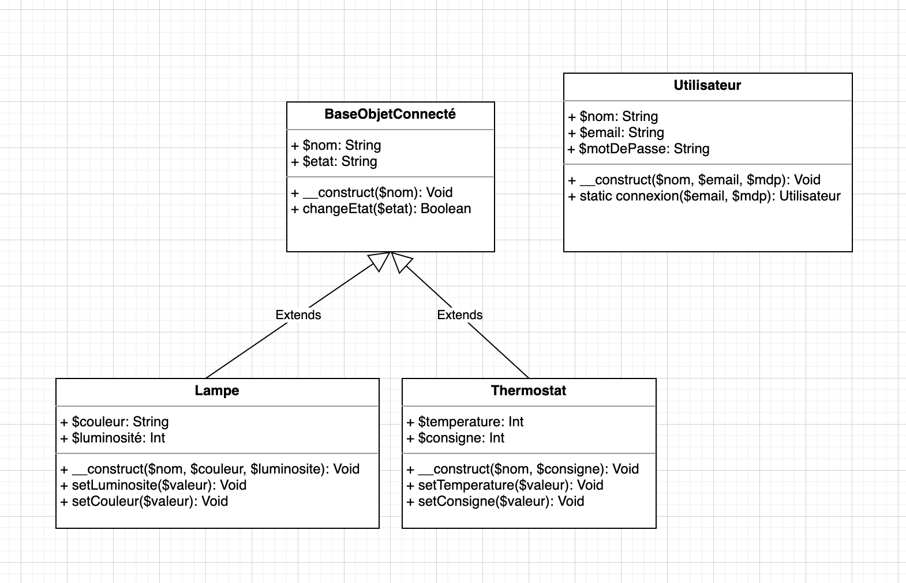

# Définition du projet

::: details Sommaire
[[toc]]
:::

## Introduction

Afin de vous remettre en marche, je vous propose un « petit » TP qui vous permettra de vous remémorer le développement objet mais également le développement Web. Nous allons dans cette série de TP réaliser un site Internet qui a pour but de lister / gérer / afficher l'état de'objets connectés. Pour cette réalisation nous allons utiliser plusieurs technologies :

- HTML (5).
- CSS. (Voir du SCSS/SASS pour ceux qui le souhaiterai).
- PHP 8 (avec de la POO évidemment).
- Bootsrap ou Tailwind au choix.

Vous etes prêt, c'est parti !

::: tip Vous avez tout oublié ?
Pas d'inquiétude, je suis là pour vous aider. L'idée ici est de remetter en route la machine avec un TP guidé 🚀.
:::

## Définition du besoin

Avant d'aller plus loin, qu'allons nous réaliser ? C'est toujours par là que vous devez commencer ! Comprendre le besoin de votre « client », c'est lui qui a un besoin, des idées. Vous devez donc le comprendre ce mettre à sa place (être force de proposition si vous avez des idées à ajouter). Dans un premier temps voilà mon idée, c'est de celle-ci que nous allons partir :

J'aimerais réaliser un « Dashboard », c'est à dire une page web. Celle-ci est principalement administrative, le style est important mais pas principale, elle doit donc propre et moderne (privilégier au maximum l'usage de [Bootstrap](https://getbootstrap.com/) et/ou [TailWindCSS](https://tailwindcss.com/)).

### Espace public

Le dashboard doit être accessible à tous dans une version consultative (sans actions possible). Cette interface doit être accessible sans connexion / session utilisateur.

L'espace / la version public va permetter la consultation des informations et **aucune actions ne doit être possible.**

### Espace privé

L'espace privé doit être accessible depuis le menu principale

## Définition des objets

La première étape, **avant même de coder**, dans la réalisation d'un projet informatique est de modéliser le problème qui vous a été donnés.

Dans notre cas, nous alons réaliser un UML (et un MCD si vous le souhaitez) qui représentera le problème que le client vous a donné. Dans notre projet nous avons donc à représenter :

- Des « objets connectés » réfléchissons ensemble à ce que va être un « objet connectés ».
  - Un objet connecté c'est toujours « une base » (avec des informations génériques).
  - Des objets spécifique (lampe, thermostat, prise, etc) avec des capacités spécifique (héritage d'un objet de base).
- Des utilisateurs représente la partie connexion (Privée / Public).

### UML

Je vous laisse commencer à réfléchir au sujet, vous avez plusieurs façon de procéder :

- Avec un papier et un crayon.
- Avec un outil « en ligne ».

Pour ma part, j'aime bien l'[outil Diagram.io](https://app.diagrams.net/).

::: tip C'est à vous !
Je vous laisse réfléchir à une solution (il y en a plusieurs).
:::

::: details Voir ma solution

Vous avez cliqué un peu vite non ?

:::

## La base de données

Avec les objets correctement défini, nous allons pouvoir maintenant définir notre base de données. En effet, la base de données doit-être un mirroir de la problématique qui vous a été donnés, et donc évidemment une représentation « Relationnel » de vos objets défini dans votre code.

### Définition

Je vous laisse créer le MCD de votre base de données.

## L'authentification

### La session

### Les droits d'accès

### La sécurité

## La suite

Nous avons défini la base de notre projet, [continuons la suite ici](./tp1.md)
