# Prise en main structure MVC

Dans ce TP, nous allons prendre en main [la structure de code présente ici](./tp1.md).

::: details Sommaire
[[toc]]
:::

## Introduction

Comme précisé dans le cours et dans nos échanges, la structure « MVC » est proposée ici comme phase transitoire entre votre code PHP de première année et du Laravel que l'on peut retrouver en entreprise. En effet, même si la structure MVC a été créée avec la prise en compte de contrainte de sécurité elle n’est en aucun cas dimensionnée pour réaliser un site client avec plusieurs centaines d'utilisateurs.

- [Aide mémoire Programmation Orientée Objet](/cheatsheets/poo/)

::: tip C'est important
Le point d'introduction est important. Savoir justifier d'une solution est tout aussi important que la solution en elle-même. Si vous décider décider d'utiliser ma structure dans d'autres développements vous devez le faire avec conviction et pas juste « parceque ».

Ceci étant dit, nous pouvons continuer 🚀 !
:::

## Le projet

Si vous avez déjà testé de nouvelles technologies, il existe un type de projet qui permet « de prendre en main » facilement du code inconnu. Ce type de projet est une TODO List.

Je vous propose donc de réaliser une TODO List en utilisant la structure MVC.

_Voilà ce que nous allons réaliser :_

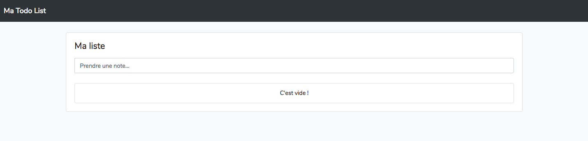

## La structure

La structure de code MVC reprend les bases des frameworks modernes types Laravel. C'est-à-dire un découpage « MVC », le découpage MVC signifie :

- **M**odèle
- **V**ue
- **C**ontrôleur

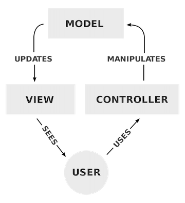

### Le Modèle

Le modèle représente la couche de votre application qui va manipuler les données. Concrètement c'est celle-ci qui va parler en SQL avec votre moteur de base de données.

Vous trouverez dans celle-ci **autant de méthodes que nécessaire**, vous pouvez _(et à mon avis vous devez)_ spécialiser vos modèles aux différentes tables présentes dans votre projet.

Par exemple si nous avons la base de données suivante :

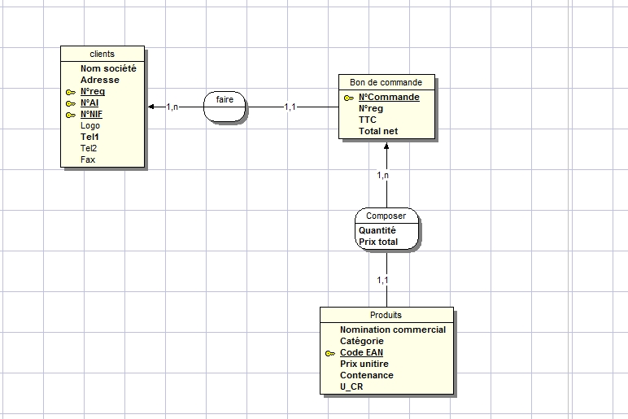

Nous devrions créer au minimum _3 modèles_ :

- Client
- BonDeCommande
- Produit

Avec à chaque fois des méthodes spécifiques exemple, nous pourrions avoir

| Modèle        | Méthodes                                                    |
| :------------ | :---------------------------------------------------------- |
| Client        | `CreerClient()`, `ModifierClient()`, `SupprimerClient()`    |
| BonDeCommande | `CreerBdc()`, `ModifierBdc()`, `SupprimerBdc()`             |
| Produit       | `CreerProduit()`, `ModifierProduit()`, `SupprimerProduit()` |

::: danger STOP ! Ce qu'il faut retenir
Ce qu'il faut retenir c'est :

- Autant d'objets que de tables.
- Des méthodes spécifiques aux actions à faire dans la table.

:::

::: tip CRUD
Ce genre d'objet s'appelle un CRUD (Create, Update, Delete). C'est une structure que nous retrouverons très souvent. Vous allez voir que c'est tellement courant qu'en général ils sont écrits automatiquement par le Framework.

<iframe src="https://giphy.com/embed/11ISwbgCxEzMyY" width="480" height="360" frameBorder="0" class="giphy-embed" allowFullScreen></iframe>
:::

### La Vue

La vue vous connaissez! Ici rien de nouveau. Le `V` de MVC c'est juste la représentation graphique de ce que vous souhaitez afficher (en HTML + CSS + JavaScript).

Cependant par rapport à vos premiers développements nous allons découper au maximum le code HTML en différents fichiers ; Objectif éviter le code dupliqué en utilisant une organisation qui ressemblera à :


::: tip L'objectif ?

- Éviter le code dupliqué.
- Faciliter la modification.
- Se concentrer sur la partie du code « Métier » de la page en cours.

:::

### Le Contrôleur

Et le contrôleur dans tout ça ? Et bien le contrôleur va assembler :

- Votre modèle (l'accès aux données).
- Votre Vue (l'affichage).

Le code va prendre les demandes des clients « appel HTTP » réaliser le traitement en base de données et afficher « la vue » résultat au client.

Comme pour le modèle, le contrôleur est un objet qui doit posséder idéalement autant de méthode que de page (et peut-être plus).

### Le Routeur

Nous l'avons vu en cours, en plus du MVC classique, nous allons ajouter une dernière brique « essentiel » au bon fonctionnement et à la maintenance de votre site Internet. Cette brique est nommée un **Routeur**.

Le routeur va contenir la déclaration des « liens » de votre site Internet afin de les aiguiller vers la bonne fonctionnalité dans votre contrôleur.

Nous pouvons schématiser le fonctionnement :

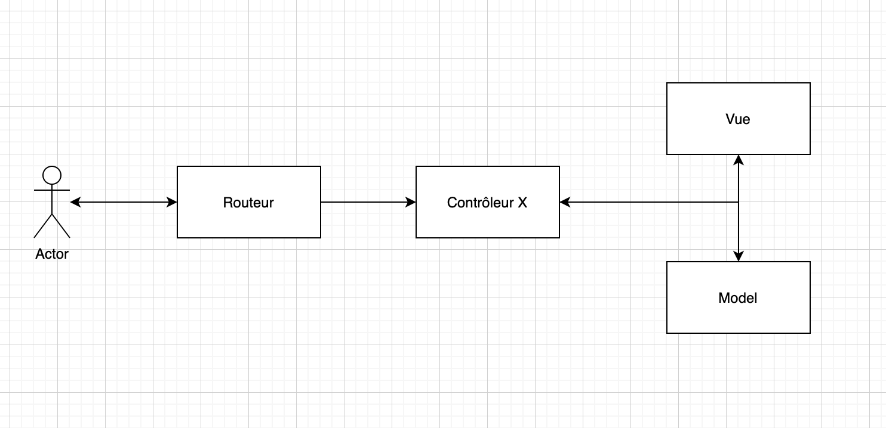

::: tip Vous êtes ici ?

Appeler-moi nous allons discuter un peu de cette architecture, qui est la base de presque l'ensemble des frameworks modernes (Laravel, VueJS, React …)

:::

### Vous souhaitez plus de détail ?

L'idée ici était de rappeler les bases, si vous souhaitez plus de détail sur l'architecture MVC que je vous propose [rendez-vous ici](./tp1.md)

## Récupérer le code source d'exemple

Un peu comme pour un projet Laravel, nous n'allons pas partir de 0 ! Vous allez partir d'un code initial qui vous servira de base de travail.

Le code en question est « vide », il s'agit uniquement d'une structure que **vous devez** respecter. Un peu comme en entreprise vous vous intégrez dans une équipe, je vous propose ici de respecter quelques règles qui sont des standards du développement.

Comme indiqué en introduction, la structuration d'un développement est aussi importante que le développement en
lui-même. C'est pour ça qu'avant même de développer il est important de prendre en main la structure des dossiers et
fichiers proposés dans le code présenté en exemple.

La structure de base en termes de dossier ressemble à :


::: tip Compliqué ?
Pas d'inquiétude, pas de stress ! nous allons voir ensemble comment prendre en main le code.
:::

### Globalement

Le code présent utilise différents aspects du développement objet :

- Des objets permettant d'encapsuler / organiser la logique autour de représentation.
- De l'héritage afin d'organiser le code hiérarchiquement.
- Des interfaces permettant de définir un comportement.

Les éléments de `base` sont toujours dans un dossier nommé `base`. Vous retrouverez ce dossier pour les contrôleurs, les routes, les modèles.

### La configuration

Avant d'aller plus loin, intéressons-nous à la configuration. Dans un projet, il est évident qu'il ne faut pas mettre la configuration n'importe où. Vous l'avez vécu en entreprise, vous avez peut-être eu à votre disposition plusieurs serveurs / machines / ordinateurs.

Votre code va fonctionner de manière identique entre chaque environnement, par contre ce qui va certainement changer c'est l'accès à la base de données. Cet accès, est dépendant d'une configuration (Utilisateur, Mot de passe, Serveur …) dans une structure MVC on essai de ne pas mettre cette configuration n'importe où !

Dans l'organisation que je vous propose, cette configuration est centralisée dans le fichier `configs.php` à la racine du code source.

::: tip La configuration c'est bien !
C'est peut-être un détail pour vous… Mais pour moi ça veut dire beaucoup ! Actuellement vous avez un serveur, mais demain peut-être 20… Et pour votre projet final, vous aurez à déployer rapidement votre application sur un autre serveur que celui sur lequel vous avez développé.

Prenez **dès maintenant** l'habitude de mettre votre configuration (IP, Serveur, mot de passe de BDD, etc.) dans le fichier `configs.php`. Dans l'architecture que je vous propose vous y trouverez le minimum nécessaire au bon fonctionnement d'une application.
:::

### Télécharger le code source

Le projet de base est disponible [à l'adresse suivante en cliquant ici](https://github.com/c4software/mini-mvc-sample/archive/refs/tags/1.4.zip)

::: tip C'est un projet vide
Même si celui-ci contient à première vue « beaucoup de fichiers », le projet vous avez téléchargé est bien un projet vide.
:::

## Faire fonctionner le code

La première étape est de faire fonctionner le code sur votre machine. Je vous laisse mettre en place le code fourni dans votre dossier `htdocs` ou `www` en fonction de l'outil que vous utilisez.

**Attention au fichiers cachés**, dans l'archive il y a un fichier .htaccess ne l'oubliez pas !

::: tip .htaccess ?
Vous avez déjà entendu parler de ce fichier ? C'est un fichier important, il va nous permettre de définir / redéfinir le comportement de votre serveur Web pour par exemple activer l’URL REWRITING` (réécriture d'URL).

La réécriture d'url va nous permettre d'avoir de beaux liens exemple `index.php?page=toto` deviendra seulement `toto.html`. Vous voulez en savoir plus ? Je suis là 👋, je vais vous donner un complément d'information.
:::

|                                                                               |
| :---------------------------------------------------------------------------: |
|                                    |
| Si tout fonctionne correctement, vous devriez avoir 👆 (superbe n'est-ce pas) |

## Modifier la page « Home »

Le meilleur moyen pour prendre en main un projet c'est de le modifier, je vous propose donc une première modification très simple :

- Modifier la page d'accueil.

Je vous propose de mettre en place sur la page d'accueil une photo / image (de votre choix) centrée via de la CSS.

::: tip C'est à vous

La bonne démarche à mon sens est là suivante :

- Utiliser un IDE pertinent (exemple PHPStorm ou VSCode).
- Repensé à l'introduction et la notion de MVC. Nous allons effectivement toucher le `Vue` (elle même appelé par le contrôleur), ça veut dire que vous allez trouver votre fichier dans le dossier `views`.
- Pour trouver le bon fichier, je vous laisse un peu investiguer, mais sachez que regarder dans le contrôleur semble être une bonne idée…

👋 Je suis là pour ceux qui sont perdus 🤕

:::

## Créer la page « About »

Maintenant que vous avez réalisé votre modification, je vous propose de regarder « Comment ajouter une nouvelle page dans cette superbe architecture (que je trouve déjà géniale) ».

J'imagine que pour l'instant vous avez peur :

- Mais comment faire pour ajouter une page?
- J'ai bien du HTML dans `views` mais comment je l'appelle?

Et bien la réponse à vos questions est

- Une **nouvelle** méthode dans le bon contrôleur.
- Un fichier `about.php` dans `views`.
- Une correspondance entre « Votre méthode » et une route dans le `routes/Web.php`.

::: tip Nous l'avons vu ensemble

Le routeur est un « composant » très important du web moderne. Il va nous permettre de piloter les ressources accessibles à notre client en les déclarant dans un fichier.

- À votre avis, pourquoi est-ce important de travailler avec une `WHITELIST` plutôt qu'une `BLACKLIST` dans ce genre de situation ?

:::

Vu que c'est la première fois, nous allons le faire ensemble… N'hésitez pas à poser vos questions !

### Créer la méthode

Nous allons dans un premier temps créer une méthode dans le contrôleur `SampleWeb.php`, pour le contenu pas grand-chose pour l'instant. Vous pouvez vous inspirer du contenu de la méthode `home()`.

```php
function about()
{
    $this->header(); // Va afficher le header de la page (mais comment ? Avez-vous regardé ?)
    include("views/global/about.php");
    $this->footer(); // Va afficher le footer de la page (mais comment ? Avez-vous regardé ?)
}
```

Pour l'instant aucun changement, si vous utilisez PHPStorm celui-ci va vous proposer de créer le fichier `about.php` directement en cliquant sur « la petite lampe jaune ».

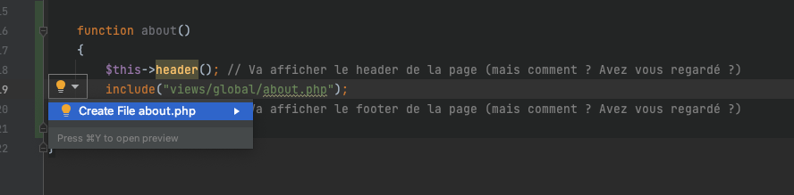

### Créer la vue / page

Si ce n'est pas déjà fait, créé le fichier `views/global/about.php`. Pour le contenu, je vous laisse libre. Je vous rappelle juste que nous sommes entrain de créer une page « À propos ».

::: tip Rappel
ici nous n'écrivons que le contenu, l'entête et le pied de page sont « automatiquement » ajoutés grâce au code présent dans la méthode home de votre contrôleur.
:::

### Créer la route

Voilà nous avons maintenant l'ensemble du code, mais celui-ci n'est pas encore accessible. Pour le rendre accessible, vous devez le déclarer dans le routeur.

Ici nous sommes entrain de faire une page `Web`, vous devez donc ajouter dans le routeur `Web.php` l'accès à votre page via l'ajout de la ligne suivante :

```php
Route::Add('/about', [$main, 'about']);
```

- **Évidemment** c'est à ajouter après la route existante.
- Le premier paramètre correspond au « Chemin / lien d'accès », le second étant la méthode à appeler dans le bon contrôleur.

👋 Je vous laisse tester l'accès à votre page

## Place au projet « La TODO list »

Maintenant que nous avons pris en main le code existant, je vous propose de réaliser une plus grosse modification, l'ajout d'une nouvelle fonctionnalité « La TodoList », pour réaliser l'ensemble du code, je vais bien évidemment vous guider.

Nous allons donc créer une TODO List. Une TODO List c'est toujours le même genre d'action :

- Une Liste.
- Un ajout dans la liste.
- Un marqué comme terminer « une todo ».
- Un supprimé qui supprime uniquement les taches « avec comme statut, termine = 1 ».

Nous allons donc avoir 4 fonctionnalités dans notre application. Chaque fonctionnalité je le rappelle sera une méthode de notre contrôleur :

|    Route     | Méthode dans le contrôleur |
| :----------: | -------------------------: |
|   `/list`    |                  `liste()` |
|  `/ajouter`  |          `ajouter($texte)` |
| `/terminer`  |            `terminer($id)` |
| `/supprimer` |           `supprimer($id)` |

L'étape de définition des différentes actions est **primordiale**, ça va nous permettre de créer notre objet de manière efficace, l'autre bonne façon de représenter notre objet est via une modélisation UML.

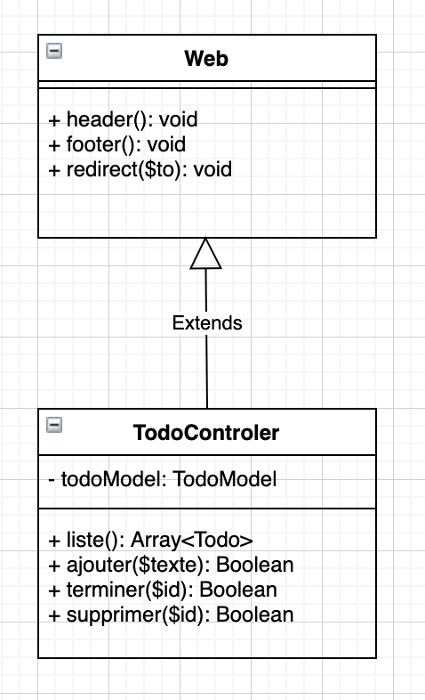

::: tip Vous vous intégrez dans un framework
Parlons un peu de la modélisation UML que je vous propose, comme vous pouvez le constater nous avons ici la définition de la class avec les différentes méthodes définies dans le tableau.

Nous avons également une classe en plus ; cette classe est « la base » d'un contrôleur, elle définit les méthodes de bases communes à l'ensemble des contrôleurs du framework.

🗣 Cette classe ne sera **jamais** instanciée directement, la flèche « extends » défini la notion d'héritage.
:::

### Bootstrap

Nous allons utiliser Bootstrap pour coder l'interface, n'hésitez donc pas à consulter la documentation :

- [Bootstrap](https://getbootstrap.com/docs/5.0/getting-started/introduction/)
- [Bootstrap Icon](https://icons.getbootstrap.com/)

### Modélisation de la base de données

Avant de continuer, je vous propose de définir le format de la base de données. En effet, notre modèle reposera sur celle-ci il faut donc réfléchir à celle-ci. L'idée ici est de faire du code, j'ai donc réfléchi (un peu) à votre place. Le minimum pour que nous puissions réaliser notre « TodoList » est la création de la table suivante :

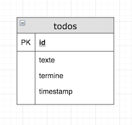

PS: Oui, oui je sais c'est impressionnant !

### Créer le modèle

Le modèle va être le moyen d'accéder à nos données, c'est ici que nous allons écrire nos requêtes SQL (**et uniquement ici**). Utiliser un framework signifie en général gagner du temps ! Pour l'instant, j'imagine que vous n'en avez pas l'impression, mais je vous assure quand vous maitrisez un framework et/ou une architecture vous gagnerez un temps fou. Ce gain de temps vient de deux éléments :

- L'architecture des dossiers et du code propre et bien organisé.
- Des outils pour créer les différents éléments.
- Du code partagé, utilisé sans copier / collé.

Le framework que je vous propose entre directement dans cette catégorie « Gagner du temps ». Pour créer notre modèle au lieu de copier / coller du code vous avez de base (intégrer dans le code) un outil en ligne de commande qui s'occupe de tout (si si). Pour créer votre modèle pour accéder au TodoList il vous suffit de :

```sh
# Hors Windows
php index.php model:create TodoModel

# Sous Windows (avec XAMPP)
C:/xampp/php/php index.php model:create TodoModel

# Sous Windows (avec WAMP)
C:/wamp64/bin/php/php7.4.9/php index.php model:create TodoModel
```

**Et c'est tout !** votre modèle pour accéder aux données est prêt 🤝. Nous avons maintenant une classe qui nous permettra d'accéder aux données contenues dans la base de données. L'accès aux données se fera :

- Via les méthodes « de base » (comme vu en cours via l'héritage présent dans la classe).
- Via **_vos méthodes_** directement écrite par vous.

::: tip Pas de magie (jamais)
Je vous invite à regarder comment fonctionne cette partie dans le code. Ce n’est pas bien compliqué. D'ailleurs, regardons ensemble !
:::

::: warning Vous avez du mal à voir ce que nous avons créé non ?

Et oui, les commandes magiques c'est bien … mais voilà ce que nous avons créé :

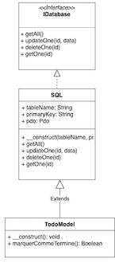

- SQL est « une classe de base », elle est intégrée dans le framework.
- Votre classe `TodoModel` hérite de la classe SQL. (Vous pouvez m'en dire plus ?)
- Votre classe `TodoModel` a été créée dans le dossier `models`. (Je vous laisse aller regarder)
- Pourquoi notre classe ne possède-t-elle qu'une seule méthode ?

:::

### Modifier le constructeur

Dans le constructeur de la classe, je vous laisse modifier les paramètres lors de la création du parent ; afin de spécifier le bon tableName et primmaryKey.

Je vous redonne le schéma de la base de données :


### Créer la méthode « marquerCommeTermine() »

Dans le diagramme UML j'indique la présence d'une méthode `marquerCommeTermine()`, si vous avez ouvert la classe créée vous allez voir que cette méthode n'est pas présente. Nous allons donc devoir la créer…

- Pourquoi la méthode n'est pas présente ?
- Pourquoi ne pas utiliser les méthodes fournies par le parent ?

Cette méthode doit marquer comme terminé un enregistrement en base de données, nous allons donc avoir besoin

- D'un `id` en paramètre de la méthode.
- D'une requête d'update.
- D'un connecteur PDO (pour parler à la base de données)

Vu que c'est la première fois je vous donne du code, mais attention à bien comprendre ce que vous copié/collé :

```php
function marquerCommeTermine($id){
    $stmt = $this->pdo->prepare("UPDATE todos SET termine = 1 WHERE id = ?");
    $stmt->execute([$id]);
}
```

::: details Besoin d'aide ?
Votre classe doit maintenant ressembler à

```php
<?php
namespace models;

use models\base\SQL;

class TodoModel extends SQL
{
    public function __construct()
    {
        parent::__construct('todos', 'id');
    }

    function todoNonTermine()
    {
        $stmt = $this->pdo->prepare("SELECT * FROM todos WHERE termine = 0;");
        $stmt->execute();
        return $stmt->fetchAll(\PDO::FETCH_ASSOC);
    }

    function marquerCommeTermine($id){
        $stmt = $this->pdo->prepare("UPDATE todos SET termine = 1 WHERE id = ?");
        $stmt->execute([$id]);
    }
}
```

:::

Questions :

- À votre avis est-ce la seule façon de faire ?
- Avons-nous toutes les méthodes nécessaires pour réaliser notre application ?

### Initialiser la base de données

Votre projet avance petit à petit, nous avons déjà créé :

- La base du projet (structure).
- Le modèle pour accéder aux données.
- Les méthodes permettant de modifier les données.

C'est déjà pas mal, mais il manque maintenant la base de données en elle-même. Dans un framework cette partie-là est également automatisable (vous verrez avec Laravel c'est encore plus puissant). Dans un framework appliqué les modifications dans la base de données s'appellent réaliser une « migration », avec notre « mini framework » pour créer la base de données il suffit de créer **un fichier** dans le dossier `migrations` :

- Créer le fichier `init.sql` dans le dossier Migration, y mettre le contenu suivant :

```sql
--
-- Structure de la table `todos`
--

CREATE TABLE `todos` (
  `id` int(11) NOT NULL,
  `texte` varchar(200) NOT NULL,
  `termine` tinyint(1) NOT NULL DEFAULT 0,
  `timestamp` timestamp NOT NULL DEFAULT current_timestamp()
) ENGINE=InnoDB DEFAULT CHARSET=utf8mb4;

--
-- Index pour les tables déchargées
--

--
-- Index pour la table `todos`
--
ALTER TABLE `todos`
  ADD PRIMARY KEY (`id`);

--
-- AUTO_INCREMENT pour les tables déchargées
--

--
-- AUTO_INCREMENT pour la table `todos`
--
ALTER TABLE `todos`
  MODIFY `id` int(11) NOT NULL AUTO_INCREMENT;
COMMIT;
```

- Installer la migration (appliquer les modifications sur votre base de données) via la commande :

```sh
# Hors Windows
php index.php db:migrate

# Sous Windows (avec XAMPP)
C:/xampp/php/php index.php db:migrate

# Sous Windows (avec WAMP)
C:/wamp64/bin/php/php7.4.9/php index.php db:migrate
```

Si tout va bien vous devriez avoir le résultat suivant:

```sh
=> Start migration of « migrations/init.sql »
=> End migration of « migrations/init.sql »
```

::: tip Point d'avancement

- Ça ne fonctionne pas ? Avez-vous vérifié si vous avez configuré votre projet (`configs.php`).
- Vérifier si la base a bien été créée dans votre PhpMyAdmin / DataGrip 👌
- Mais c'est génial !

<iframe src="https://giphy.com/embed/SACoDGYTvVNhZYNb5a" width="480" height="360" frameBorder="0" class="giphy-embed" allowFullScreen></iframe>

:::

### Créer le contrôleur

Notre base est prête… Et si nous écrivions vraiment le code ? Comme pour créer le modèle, le framework vous fait gagner du temps ! Ici aussi pas besoin de copier / coller du code, une simple ligne de commande va vous initialiser un Contrôleur « vide » :

```sh
# Hors Windows
php index.php controller:create TodoWeb

# Sous Windows (avec XAMPP)
C:/xampp/php/php index.php controller:create TodoWeb

# Sous Windows (avec WAMP)
C:/wamp64/bin/php/php7.4.9/php index.php controller:create TodoWeb
```

Cette commande va initialiser un contrôleur de type Web. Celui-ci est pour l'instant vide de méthode :


Ce contrôleur est pour l'instant vide, nous allons dans un premier temps devoir lui créer un constructeur afin de créer le modèle permettant l'accès à la base de données.

### Définir les routes dans le routeur

Vous vous souvenez lors de la création de notre première page, nous avions dû ajouter une ligne dans le routeur afin de rendre accessibles les méthodes. Pour notre nouveau contrôleur, ça sera la même chose !

|     Routes      | Contrôleur |   Méthodes    |
| :-------------: | :--------: | :-----------: |
|   /todo/liste   | `TodoWeb`  |   `liste()`   |
|  /todo/ajouter  | `TodoWeb`  |  `ajouter()`  |
| /todo/terminer  | `TodoWeb`  | `terminer()`  |
| /todo/supprimer | `TodoWeb`  | `supprimer()` |

Dans le fichier `routes/Web.php`, ajouter le lignes :

```php
  $todo = new TodoWeb();
  Route::Add('/todo/liste', [$todo, 'liste']);
  Route::Add('/todo/ajouter', [$todo, 'ajouter']);
  Route::Add('/todo/terminer', [$todo, 'terminer']);
  Route::Add('/todo/supprimer', [$todo, 'supprimer']);
```

- Où les ajouter ?
- À quoi correspondent-t-elles ?

### Ajouter le constructeur `__construct()`

Le contrôleur aura pour but d'aller récupérer les Todo en base **via** le modèle. Il faut donc donner un accès au modèle depuis la classe. Nous allons donc écrire **le constructeur** de la méthode. En PHP, le constructeur s'écrit :

```php
    private $todoModel;

    function __construct(){
        $this->todoModel = new TodoModel();
    }
```

Je vous laisse réfléchir sur l'endroit ou mettre le code en question.

::: details Voir une solution

```php
<?php
namespace controllers;

use controllers\base\Web;
use models\TodoModel;

class TodoWeb extends Web
{
    private $todoModel;

    function __construct(){
        $this->todoModel = new TodoModel();
    }
}
```

:::

### La méthode `liste()`

La première méthode que nous allons créer est celle de la liste. Elle se nommera `liste()`, cette méthode sera automatiquement appelée via le `routeur` à **chaque visite d'un utilisateur**. L'objectif de cette méthode est :

- Afficher le header de la page (`$this->header()` méthode héritée du parent).
- Récupérer l'ensemble des TODO (Array) actuellement en base via la méthode `getAll()` du TodoModel modèle.
- Afficher votre `vue` via un include.
- Afficher le footer de la page (`$this->footer()` méthode héritée du parent).

::: tip Toujours la même forme

Vous allez rapidement vous apercevoir que la structure de base est toujours la même. Nous allons toujours faire la même chose lors de la création d'une méthode dans un contrôleur à savoir :

```php
    function maMethodeQueJaiCopierColler()
    {
        // Pourquoi j'ai copier / coller ceci ? C'est un exemple seulement
        $this->header();
        include("views/global/home.php");
        $this->footer();
    }
```

**Pssst**, ne copier / coller pas le code précédent !! C'est un simple exemple.

:::

Dans notre cas, la méthode va ressembler à :

```php
function liste()
    {
        $this->header(); // Affichage de l'entête.
        $todos = $this->todoModel->getAll(); // Récupération des TODOS présents en base.
        include("views/todos/liste.php"); // Affichage de votre vue.
        $this->footer(); // Affichage de votre pied de page.
    }
```

Et c'est tout ! La puissance d'un Frawerork c'est aussi ça, écrire finalement pas énormément de ligne pour afficher une page. Pourtant cette page :

- Affiche une entête.
- Récupère en base de données les éléments.
- Affiche la page.
- Affiche le pied de page.

### Le template de la page liste

Votre IDE doit actuellement être moyen content… Effectivement, nous avons fait un `include` de `"views/todos/liste.php"` pourtant ce fichier n'existe pas.

Vu qu'il s'agit ici d'un projet découvert, je vais vous en donner le contenu (si vous le souhaitez, vous pouvez également l'écrire) voilà le rendu :


```php
<div class="container p-3">
    <div class="card">
        <div class="card-body p-2">
            <!-- Action -->
            <form action="./ajouter" method="post" class="add">
                <div class="input-group">
                    <input id="texte" name="texte" type="text" class="form-control" placeholder="Prendre une note…" aria-label="My new idea" aria-describedby="basic-addon1"/>
                </div>
            </form>

            <!-- Liste -->
            <ul class="list-group pt-3">
                <?php
                foreach ($todos as $todo) {
                    ?>
                    <li class="list-group-item">
                        <div class="d-flex">
                            <div class="flex-grow-1 align-self-center"><?= $todo['texte'] ?></div>
                            <div>
                                <a href="./terminer?id=<?= $todo['id'] ?>" class="btn btn-outline-success">
                                    <i class="bi bi-check"></i>
                                </a>
                                <!-- Action à ajouter pour Supprimer -->
                            </div>
                        </div>
                    </li>
                    <?php
                }

                if (sizeof($todos) == 0) {
                    ?>
                    <li class="list-group-item text-center">C'est vide !</li>
                    <?php
                }
                ?>
            </ul>
        </div>
    </div>
</div>
```

Je vous laisse mettre le contenu dans votre fichier `views/todos/liste.php`.

::: tip Valider le bon fonctionnement

Si vous accédez à votre page `todo/liste` vous devriez avoir le contenu suivant :

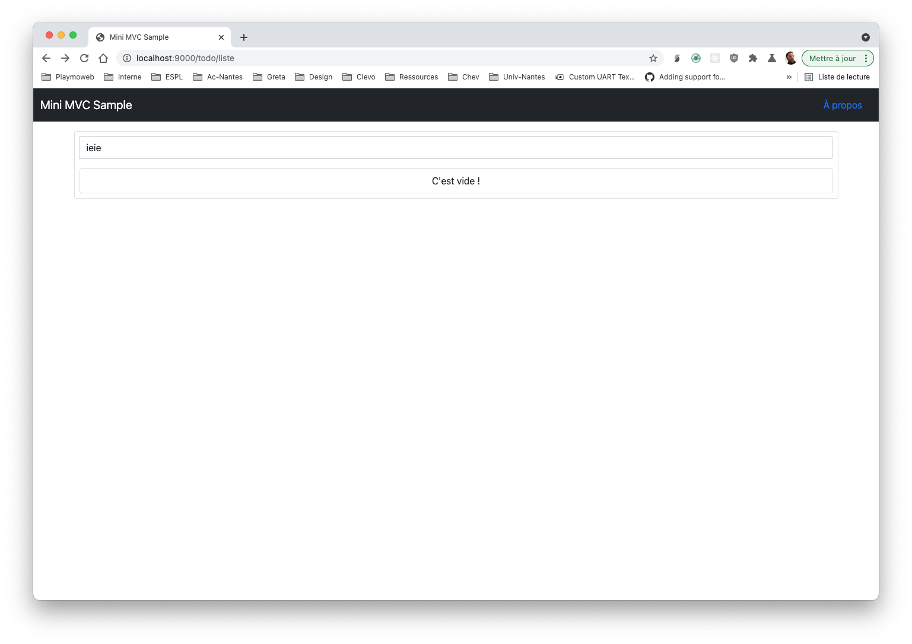

:::

### La méthode `ajouter($texte = '')`

Cette méthode sera automatiquement appelé quand vous aller appuyer sur la touche **Entrer** de votre clavier dans le champ de saisie sur la page `Liste`. L'objectif de cette méthode est de traiter l'action « J'ajoute un nouvel enregistrement dans la base Todo ».

Pour le code, je vais vous aider un peu, voilà le code du contrôleur :

```php
function ajouter($texte = "")
{
    $this->todoModel->ajouterTodo($texte);
    $this->redirect("./liste");
}
```

- À quoi correspond la méthode `redirect(…)` ? D'où provient-elle ?

_C'est à vous :_

- Mettre en place le code dans le contrôleur.
- Écrire la méthode ajouterTodo dans le modèle `TodoModel` (n'oubliez pas l'autocomplétion).
  - Écrire la requête `INSERT …`
- Tester le bon fonctionnement

Dans mon cas voilà le résultat :

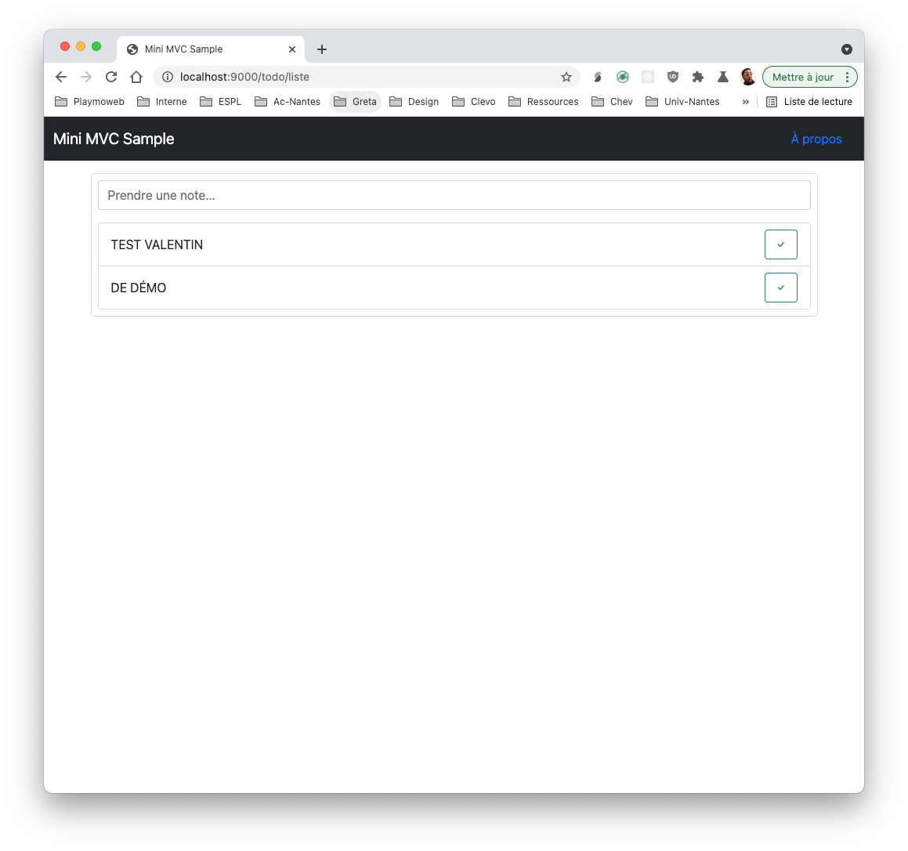

#### Ajouter une validation

Actuellement dans le code que vous avez copié il est possible d'ajouter des « TODO » sans texte. Je vous propose donc d'ajouter un contrôle de saisie **dans le PHP**.

Le contrôle doit empêcher l'ajoute d'une TODO si `$texte == ''`.

- Où placez-vous le contrôle ?
- Pourquoi ?

### La méthode `terminer($id = '')`

Vous l'avez compris… Je vous donne de moins en moins de code ! La méthode `terminer` sera très proche de `ajouter` sauf que celle-ci va prendre en paramètre l'id de l'élément à marquer comme terminé :

```php
function terminer($id = ''){
    if($id != ""){
        $this->todoModel->marquerCommeTermine($id);
    }

    $this->redirect("./liste");
}
```

- D'où arrive le paramètre `$id` ?
- Pourquoi est-ce automatique ?

_À faire_ :

- Mettre en place le code, valider le bon fonctionnement avec **PHPMyAdmin**
- Modifier la vue pour afficher le bouton vert **seulement si** la tâche est non terminée
- Ajouter un bouton supprimé visible **uniquement si** la tâche est terminée

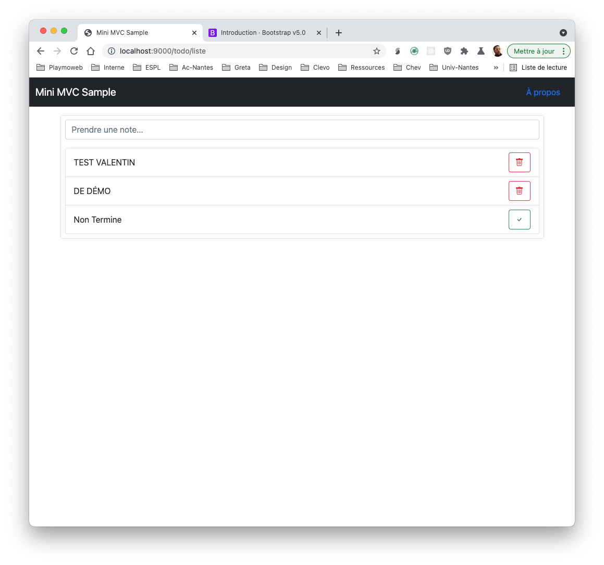

### La méthode `supprimer($id = '')`

En utilisant le code précédemment fourni, écrire :

- La méthode dans le modèle permettant de supprimer un élément dans la base de données pour un id donné.
- La méthode dans le contrôleur permettant de traiter l'action.
- **Ne permettre la suppression** que des Todo ayant `termine = 1`. La vérification **ne doit pas être** présente que dans la vue.

C'est à vous.

### Un serveur de dev ?

Si vous souhaitez tester votre code sans démarrer XAMPP c'est possible. PHP intègre un serveur Web de « développement », pour le lancer il suffit de :

```sh
# Windows (avec XAMPP)
C:/xampp/php/php -S localhost:9000

# Windows (avec WAMP)
C:/wamp64/bin/php/php7.4.9/php -S localhost:9000

# Linux / OSX
php -S localhost:9000
```

### Évolution 0

Ajouter dans la page d'accueil du site un lien permettant d'accéder à votre TodoList. Quelques consignes à respecter :

- Le lien doit être centré dans la page.
- Le lien doit avoir l'**apparence** d'un bouton. [Voir la documentation](https://getbootstrap.com/docs/5.0/components/buttons/)

### Évolution 1

Je souhaite finalement masquer de l'affichage par défaut l'ensemble des enregistrements de la table `TODO` ayant `termine = 1`.

Je vous laisse modifier :

- Le code du modèle afin d'y ajouter une méthode.
- Appeler cette méthode depuis votre page à la place du `getAll()`.

### Évolution 2

La partie TODOList ne doit pas être accessible à tous. En utilisant les techniques vu avec la SESSION (`$_SESSION`) ainsi qu'en réfléchissant sur les impacts en termes de sécurité (protection dans le routeur par exemple). Limiter l'accès de la partie TODOList seulement aux personnes avec un compte sur la plateforme.

- Quels impacts sont à prévoir dans le routeur ?
- Est-ce nécessaire de créer un nouveau modèle ?
- Est-ce nécessaire de créer un nouveau contrôleur ?
- Combien de vue sera(ont) nécessaire(s) en plus de celles existantes ?

### Évolution 3

Maintenant que nous avons un système d'authentification, je vous propose de sauvegarder qui a créé la TODO pour ce faire :

- Modifier la base de données afin d'ajouter « l'email / nom d'utilisateur » de la personne ayant créé la TODO
- Modifier la méthode d'ajout dans le modèle pour enregistrer l'information
  - Attention, comment allez-vous procéder pour récupérer la personne actuellement connectée ?
- Ajouter **dans la vue**, l'affichage de l'identité de la personne.
  - Idéalement en groupant les TODO par nom d'utilisateur / email.

### Évolution 4

Modifier la page d'accueil de votre site afin que celle-ci présente votre projet.
