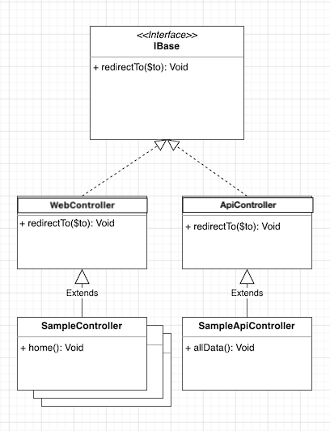
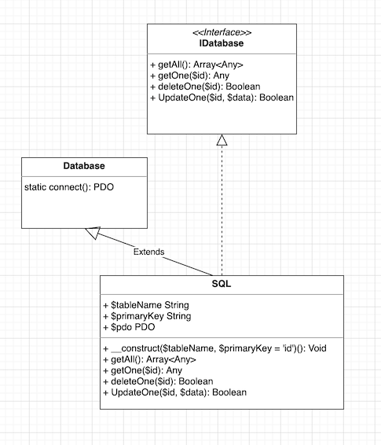

# Structure de développement MVC

Cette structure est réalisée à des fins pédagogiques. Elle est un intermédiaire permettant d'introduire les concepts du
framework Laravel sur des bases de développement PHP connu.

::: tip Attention
Si vous souhaitez réaliser un développement d'envergure, je vous déconseille vivement l'utilisation de ce code.
Préférez plutôt l'utilisation d'un framework tel que Laravel
:::

::: details Sommaire
[[toc]]
:::

- [Aide mémoire Programmation Orientée Objet](/cheatsheets/poo/)
- [La modélisation objet](/cheatsheets/poo-uml/)
- [Aide mémoire Mini MVC Sample](/cheatsheets/mini-mvc-sample/)

## Introduction

Un des plus célèbres design patterns s’appelle MVC (Modèle - Vue - Contrôleur) ce pattern permet une bonne organisation du son code source. Pour l'instant vous codiez sans vraiment de structure, avec globalement, même si c'était rangé ; des pages Web qui mélangent traitement (PHP), accès aux données (SQL) et présentation (balises HTML). Même si c'est complètement fonctionnel, nous allons nous efforcer à partir de maintenant à séparer ces parties.

La structure MVC présentée dans cet exemple est classique. Elle intègre les concepts MVC classiques à savoir :

- Modèle (Accès à la base de données)
- Vue (Représentation pour le client)
- Contrôleur (Traitement des requêtes HTTP entrant)

Le projet proposé dépasse le simple MVC, il intègre en effet les bases pour un développement serein à savoir :

- Un routeur : Correspondance entre un chemin (route) et une fonctionnalité (méthode d'un contrôleur).
- Un ensemble d'interfaces et class permettant
  - la réalisation d'API.
  - l'Accès à la base de données.
  - La gestion de la SESSION.
- Une organisation structurée permettant la réalisation de projet de taille moyenne / grande.

::: tip Point important sur la structure.
Cette base de développement intègre une structure **qu'il faut respecter** pour développer dans de bonnes conditions.
:::

## Les sources

Vous pouvez télécharger un code de démonstration [à l'adresse suivante en cliquant ici](https://github.com/c4software/mini-mvc-sample/archive/refs/tags/3.1.zip)

Voilà le rendu :

<iframe width="560" height="315" src="https://www.youtube-nocookie.com/embed/HiJp6sgn0NY" title="YouTube video player" frameborder="0" allow="accelerometer; autoplay; clipboard-write; encrypted-media; gyroscope; picture-in-picture" allowfullscreen></iframe>

## Structure

Comme indiqué en introduction, la structuration d'un développement est aussi importante que le développement en
lui-même. C'est pour ça qu'avant même de développer il est important de prendre en main la structure des dossiers et
fichiers proposés dans le code présenté en exemple.

La structure de base en termes de dossier ressemble à :


::: tip Compliqué ?
Pas d'inquiétude, pas de stress ! nous allons voir ensemble comment prendre en main le code.
:::

### Globalement

Le code présent utilise différents aspects du développement objet :

- Des objets permettant d'encapsuler / organiser la logique autour de représentation.
- De l'héritage afin d'organiser le code hiérarchiquement.
- Des interfaces permettant de définir un comportement.

Les éléments de `base` sont toujours dans un dossier nommé `base`. Vous retrouverez ce dossier pour les contrôleurs, les routes, les modèles.

### La configuration

Avant d'aller plus loin, intéressons-nous à la configuration. Dans un projet, il est évident qu'il ne faut pas mettre la configuration n'importe où. Vous l'avez vécu en entreprise, vous avez peut-être eu à votre disposition plusieurs serveurs / machines / ordinateurs.

Votre code va fonctionner de manière identique entre chaque environnement, par contre ce qui va certainement changer c'est l'accès à la base de données. Cet accès, est dépendant d'une configuration (Utilisateur, Mot de passe, Serveur …) dans une structure MVC on essai de ne pas mettre cette configuration n'importe où !

Dans l'organisation que je vous propose, cette configuration est centralisée dans le fichier `configs.php` à la racine du code source.

::: tip La configuration c'est bien !
C'est peut-être un détail pour vous… Mais pour moi ça veut dire beaucoup ! Actuellement vous avez un serveur, mais demain peut-être 20… Et pour votre projet final, vous aurez à déployer rapidement votre application sur un autre serveur que celui sur lequel vous avez développé.

Prenez **dès maintenant** l'habitude de mettre votre configuration (IP, Serveur, mot de passe de BDD, etc.) dans le fichier `configs.php`. Dans l'architecture que je vous propose vous y trouverez le minimum nécessaire au bon fonctionnement d'une application.
:::

::: details Voilà un exemple

```php
<?php

$DB_SERVER = "127.0.0.1";
$DB_DATABASE = "VOTRE_BDD";

return array(
    "DB_USER" => "VOTRE_UTILISATEUR",
    "DB_PASSWORD" => "ET_LE_MOT_DE_PASSE",
    "DB_DSN" => "mysql:host=$DB_SERVER;dbname=$DB_DATABASE",
    "DEBUG" => true
);


```

:::

- Debug ? Vous avez dit debug ? À quoi correspond cette variable à votre avis ? Comment faire pour. Est-ce important de la mettre à `true` ?

::: details Non, mais un instant ? Mon code est différent.

Et oui ! L'exemple que je vous communique plus haut est simpliste. Dans le code que vous avez récupéré, le fichier `configs.php` est légèrement différent. En effet, celui-ci prend un ensemble de variables depuis `les variables d'environnements` kézako !? Les variables d'environnement sont des variables définies au niveau du système qui nous permettra de changer la configuration sans modifier le code.

Ce système de variables d'environnements est très intéressant, car il nous permettra avec l'intégration continue de personnaliser le programme au moment de l'exécution sans en changer le code source (Exemple PROD et DEV).

:::

### Lancer votre site Internet

La structure MVC possède un serveur web intégré, celui-ci vous permettra de tester votre site web en local sans même avoir besoin de Wamp / Xampp ou autre serveur Apache + PHP.

::: tip Si votre ordinateur est correctement configuré

Vous devriez être capable de faire :

```sh
php mvc serve
```

Cette commande intégrée à la structure MVC lancera un serveur automatiquement (sur le port 9000).

:::

::: details Comment ça fonctionne? 

```sh
# Windows (avec XAMPP)
C:/xampp/php/php -S localhost:9000

# Windows (avec WAMP)
C:/wamp64/bin/php/php8.4.0/php -S localhost:9000

# Linux / OSX
php -S localhost:9000
```

:::

### L'entry Point (`index.php`)

Le fichier `index.php` présent à la racine du projet est, ce que l'on appelle, un **entry point**. Ce point d'entrée en
français est le fichier qui va « prendre le trafic » de votre projet.

Concrètement, qu'est-ce que ça veut dire ? Ça veut dire que ce fichier est grandement générique ; en effet, quel que soit
le projet celui-ci restera grandement inchangé. Il intègre les initialisations de base permettant à votre projet de
fonctionner correctement. Je vous invite par curiosité à regarder son contenu. Mais pas de modification à prévoir dans
ce fichier.

Une représentation possible peut-être la suivante :


### Le dossier `routes/`

Le dossier `routes/` contient l'ensemble du code relatif au Router. Le router est la brique centrale de cette structure
MVC, en effet votre utilisateur passera obligatoirement par celui-ci.

Le routeur est un élément simple qui permet de sécuriser votre code. Celui-ci est en réalité un simple « tableau »
contenant l'ensemble des fichiers / ressources accessible depuis le navigateur du client.

Cet élément repose sur le principe de la `WhiteList` (Liste blanche), nous avons donc de lister l'ensemble « paths
» (chemins) autorisé pour deux types de ressources :

- Web (`Web.php`) : Page Web classique, affichée dans un navigateur Web (Chrome, Firefox, etc.)
- Api (`Api.php`) : Échange entre un client et le serveur (Ajax, Application, etc.)
- Cli (`Cli.php`) : Définission d'actions accessibles uniquement via la ligne de commande (initialisation de Model, contrôleur, initialisation de la base de données)

Nous avons un fichier `Router.php` qui comme l'entry-point est générique, il initialise seulement le code (je vous laisse
le regarder par curiosité).

La logique de chargement d'une route est dans `routes/base/Route.php`, c'est dans ce fichier que ce cache la
fameuse, `Whitelist` mais également la logique de chargement d'une page par rapport à une demande d'un utilisateur (
chargement en GET ou en POST).

#### `Web.php` et `Api.php`

Les deux fichiers ont une syntaxe identique, c'est normal, il s’agit de la réaliser la déclaration des routes, celle-ci
prendra toujours la même forme :

```php
<?php
class Web
{
    function __construct()
    {
        $monControleur = new MonControleur();
        $monControleur2 = new MonControleur2();

        Route::Add('/', [$monControleur, 'laMethodeAAppeler']);
        Route::Add('/autreChemin', [$monControleur, 'lautreMethode']);

        // {monParametre} est dynamique en fonction du lien utilisateur
        // Exemple /exemple/avec/param/1 ou /exemple/avec/param/2
        Route::Add('/exemple/avec/param/{monParametre}', [$monControleur, 'methodeAvecParametre']); 


        Route::Add('/fonction2/home', [$monControleur2, 'ma2ndMethode']); 

        // etc…
        // Vous pouvez avoir autant de routes que nécessaire.
        // Attention en cas de doublon, la dernière route définie sera celle qui sera utilisée
    }
}
```

Je pense qu'ici pas de problème! Vous comprenez l'idée, une nouvelle page ?

- Une nouvelle route
- Une nouvelle méthode dans le contrôleur…
- Et c'est tout !

#### Une route sans contrôleur ?

Même s’il est préférable d'avoir toujours un contrôleur, il peut arriver parfois d'avoir besoin d’une route qui ne dépend pas d'un contrôleur. Avec la structure MVC, vous pouvez écrire :

```php
class Web
{
    function __construct()
    {
        // Vos autres routes
        // …

        Route::Add('/about', function () {
            return Template::render('views/global/about.php');
        });
        
        Route::Add('/exemple2/{p1}', function ($p1 = 'Valeur par défaut') {
            return "Function inline 2, Voilà votre paramètre : $p1";
        });

        // Vos autres routes
        // …
    }
}
```

::: danger 👋

Utile pour du code très simple, ou lors d’un test **uniquement**. L’utilisation d'un contrôleur est préférable.

:::

#### Gérer l'authentification ?

Vous allez rapidement avoir besoin d'authentifier un utilisateur. Dans ce cas, évidemment vous n'allez pas ajouter / lister des routes non accessibles à tous **(pour des raisons évidentes de sécurité)**.

Il conviendra donc de mettre un `if` autour des routes que vous souhaitez protéger. Par exemple :

```php
<?php

namespace routes;

use controllers\Account;
use controllers\Main;
use controllers\VideoWeb;
use routes\base\Route;
use utils\SessionHelpers;

class Web
{
    function __construct()
    {
        $videoWeb = new VideoWeb();
        $main = new Main();
        $account = new Account();

        Route::Add('/', [$videoWeb, 'home']);
        Route::Add('/tv', [$videoWeb, 'tv']);
        Route::Add('/about', [$main, 'about']);
        Route::Add('/login', [$account, 'login']);

        // Les liens /me et /logout ne seront disponibles que pour les utilisateurs ayant un compte.
        if (SessionHelpers::isLogin()) {
            Route::Add('/me', [$account, 'me']);
            Route::Add('/logout', [$account, 'logout']);
        }
    }
}


```

### Le dossier `controllers/`

Le dossier `controllers/` contiendra l'ensemble des contrôleurs de votre projet. Pour l'instant il y en a trois (`GlobalWeb.php`, `VideoApi.php`, `VideoWeb.php`) ils ont chacun un but différent propre à mon exemple.

**Ça veut dire** que vous pouvez créer autant de contrôleurs que nécessaire, il s'agit ici d'un découpage logique des fonctionnalités que vous souhaitez mettre en place.

Le contrôleur est la class PHP qui va faire le lien entre la demande de l'utilisateur (Route) et la donnée (modèle), son rôle sera donc toujours un peu le même :

- Récupéré de la donnée (BDD, Session, Fichier, etc.).
- La mettre en forme si nécessaire.
- La retourner à l'utilisateur.

Si nous reprenons la base d'un contrôleur, celui-ci aura toujours au minimum la forme suivante :

```php
<?php
namespace controllers;

use controllers\base\Web;
use utils\Template;

class MonControleur extends WebController
{
    // Méthode d'exemple
    function methodeDExemple()
    {
        return Template::render("views/monControleur/methodeDExemple.php", array());
    }
}
```

Comme vous pouvez le constater ici pas énormément de code, en effet une partie de la complexité est encapsulée dans l'héritage (`extends WebController`).

Un contrôleur est donc une classe, avec un ensemble de méthodes technique permettant de réaliser des opérations. La ligne :

```php
Template::render("views/monControleur/methodeDExemple.php", array());
```

Seront votre « traitement » / « votre page », nous avons :

- `Template::render` méthode qui permet d'afficher votre **vue**. Le premier argument est le fichier à utiliser, le second est un tableau de paramètre.
- La tableau de paramètre (`array()`), contiendra l'ensemble des variables accessible dans votre vue. Exemple, `array("nom" => "valentin")` va déclarer une variable `$nom` dans votre **vue**.

Techniquement, si vous regardez le contenu de la méthode, `render` vous verrez 3 lignes :

- `header();` : Le haut de votre page (avant votre contenu)
- `include($filepath);` : Votre contenu HTML (**et uniquement votre contenu**)
- `footer();` : Le bas de votre page (après le contenu)

Nous pouvons le représenter de cette façon-ci :


::: tip L'astuce du chef

Si vous avez regardé un peu le code, vous avez certainement remarqué que les paramètres `$_GET` était automatiquement disponible en tant que paramètre de votre méthode. Exemple :

```php
// Si l'utilisateur accède à /home?nom=brosseau&prenom=valentin

function home($nom, $prenom){
    // $prenom contiendra ici "brosseau" et $prenom contiendra "valentin"
}
```

:::

#### L'héritage

Les contrôleurs **doivent hériter** de l'une des deux interfaces `Web` ou `Api`. Ces deux classes définissent un comportement standardisé entre les différents contrôleurs que vous allez écrire.

Les différentes relations peuvent être représentées avec l'UML suivant :



La méthode `redirectTo` permet de gérer la redirection vers une autre ressource. Rien de bien compliqué c'est un simple appel de la méthode `header` de PHP. Je vous laisse regarder le code dans `controller/base/WebController.php`.

::: tip Be curious !
Ne prenez pas automatiquement pour acquis ce que je vous écris. Allez voir le code source du projet afin de constater par vous-même ce que je viens de dire / écrire.
:::

### Le dossier `views/`

Le dossier `views/` va contenir l'ensemble des fichiers « d'interface » de votre application. Ces fichiers sont en réalité massivement des fichiers HTML classiques.

Détail important, nous allons ici privilégier le découpage et la réutilisation. Il est donc important de constater que nous avons un dossier `views/common/` celui-ci contient l'ensemble des éléments commun à toutes vos pages comme vues précédemment. (haut de page et pied de page).

Vos différentes pages **ne contiendront donc** que le contenu réel de la page exemple :

```html
<h1>Ceci est un titre</h1>
<p>Et voici le contenu</p>
```

::: tip Pourquoi est-ce important ?
Au-delà de tout ce que nous voyons ensemble, mon but est de vous rendre autonome pour que vous puissiez réaliser vos propres projets. Et quand il s'agit de projet, le plus important à retenir c'est l'organisation, mais également éviter toutes répétitions.

L'une des principales sources de répétition dans un site Web c'est le code présent dans le header et dans le footer de votre site. C'est pourquoi je vous propose de ne pas le mettre dans chaque page.

<center><iframe src="https://giphy.com/embed/eBpiVHAzU8XXtvPCae" width="480" height="353" frameBorder="0" class="giphy-embed" allowFullScreen></iframe></center>
:::

### Le dossier `models/`

<iframe width="560" height="315" src="https://www.youtube-nocookie.com/embed/TFzF4XtoS4U" title="YouTube video player" frameborder="0" allow="accelerometer; autoplay; clipboard-write; encrypted-media; gyroscope; picture-in-picture" allowfullscreen></iframe>

Le dossier `models/` contiens les classes qui vont représenter les tables en base de données. Ces classes vont faire « l'interface » entre votre contrôleur et votre base de données.

Finis donc les requêtes SQL partout dans votre code. À partir de maintenant, vos requêtes sont **dans le modèle** et uniquement dans le modèle.

::: warning Un instant
Cette notion de modèle **est très importante**, en effet il s'agit ici d'être explicit et de ne pas faire une classe fourretout!

Je ne veux donc pas voir de fichier model.php avec 5000 lignes de code. Et encore moins de requêtes SQL dans vos contrôleurs.
:::

Comme pour les contrôleurs, vous avez à votre disposition (dans le dossier, base) une classe générique vous permettant d'automatiser certaines requêtes (`getAll`, `getOne`, `deleteOne`, `updateOne`). Bien évidemment ce ne sont que des raccourcis, vous pouvez sans problème écrire les requêtes via PDO.

Voici un exemple minimal de Modèle :

```php
<?php

namespace models;

use models\base\SQL;

class DBVideo extends SQL
{
    public function __construct()
    {
        parent::__construct('LE_NOM_DE_VOTRE_TABLE');
    }
}
```

Voici un exemple plus complet :

```php
<?php

namespace models;

use models\base\SQL;

class DBVideo extends SQL
{
    public function __construct()
    {
        parent::__construct('LE_NOM_DE_VOTRE_TABLE');
    }

    function getVideos()
    {
        // Retourne l'ensemble des vidéos de la table
        return $this->getAll();
    }

    function getByVideoId($videoId)
    {
        // Utilisation d'une query à la place d'un simple getOne car la requête
        // est réalisé sur un champ différent que l'ID de la table.

        $stmt = $this->getPdo()->prepare("SELECT * FROM video WHERE videoId = ?");
        $stmt->execute([$videoId]);
        return $stmt->fetch(\PDO::FETCH_OBJ);
    }
}
```

#### L'accès à la base de données

Si vous avez été curieux… Vous avez certainement remarqué qu'à aucun moment nous n’avons parlé de la connexion à la base de données ! C'est aussi ça l'avantage d'une organisation structurée, je me suis occupé de cette partie-là pour vous.

La connexion à la base de données est intégrée dans la classe `models/base/Database.php` qui est utilisé dans la classe fille `models/base/SQL.php`.

Pour l'instant vous serez « utilisateur » de cette architecture. Mais, voilà le diagramme de classe de celle-ci :



::: tip Pourquoi faire une Interface ?

Le diagramme de classe vous semble peut-être très compliqué au vu de la problématique… Mais c'est tout là l'intérêt de réaliser des Interfaces. En effet, je vous offre (c'est cadeau, c'est pour moi) la classe SQL ; mais peut-être que vous voulez faire du Oracle ? Ou bien du MongoDB ?

Avec une Interface, aucun problème. Votre code restera inchangé, quelle que soit l'implémentation de votre connecteur. En effet, implémenter l'interface vous obligera l'écriture des 4 méthodes minimale au bon fonctionnement de votre code.

Ne vous inquiétez pas! L'interface est une notion que nous reverrons ensemble plus tard… Sachez juste qu'elle est une des bases de la programmation orientée objet.

:::

::: tip Be curious (bis)
Ne vous contentez pas de dire « ça marche », allez regarder ma classe `SQL`! Je pense qu'elle est intéressante, et que vous devriez la regarder.
:::

### Le dossier `public/`

Le dossier `public/` va contenir l'ensemble des données « publics » de votre projet. Ces fichiers sont ceux distribués directement au navigateur de votre client.

Ça semble un détail peut-être ? Pourtant c'est un élément important ! En effet pourquoi solliciter votre code PHP pour distribuer de la CSS ou des images en plus d'être inutile ça surcharge votre serveur inutilement ?

### Le dossier `utils/`

Le dossier `utils/` contient dans la structure de base une classe permettant de gérer la SESSION et une classe permettant de générer une image [Gravatar](https://www.gravatar.com/).

Mais vous allez placer ici l'ensemble des **librairies PHP** nécessaire au bon fonctionnement de votre projet.

Un morceau de code que vous avez trouvé sur StackOverflow ? Une librairie que vous avez conçue ? Pas de problème ! Rangez-les dans le dossier. `utils/`

### Le dossier `migrations/`

Le dossier `migrations/` contient l'ensemble des fichiers nécessaire à l'installation de votre base de données. Le fichier `RunMigration.php` **(à lancer depuis la console)** charge et exécute l'ensemble des fichiers `*.sql`. Cette fonctionnalité vous permettra :

- De garder une trace de votre schéma.
- Lancer simplement l'installation de votre base de données.
- Historiser vos « migrations ». En effet le script va charger **l'ensemble** des fichiers SQL.

Pour l'utiliser, vous devez passer via la ligne de commande. En effet, pour des raisons de sécurité, impossible de lancer les migrations depuis votre navigateur.

```php
php mvc db:migrate
```

## Ajouter une page dans un contrôleur existant

Ajouter une nouvelle page dans un contrôleur se résumera à 3 opérations :

- Ajouter la méthode dans le contrôleur.
- Ajouter la route permettant l'accès à la méthode.
- Ajouter la vue (template) dans le dossier `view`.

Par exemple, si vous souhaitez ajouter une page `/ping` faisant référence au contrôleur `Main`:

- Ajout dans les routeurs `/routes/Web.php` :

```php
    Route::Add('/ping', [$main, 'ping']);
```

- Déclarer la méthode `ping()` dans le contrôleur :

```php
    function ping()
    {
        Template::render("views/global/ping.php", array("generateAt", date('d-m-Y à H:i')));
    }
```

- Créer la vue `views/global/ping.php` :

```php
<h1>PONG</h1>
<center><?= $generateAt ?></center>
```

Je sais que vous aimez les vidéos… Voilà la même procédure résumée en vidéo :

<iframe width="560" height="315" src="https://www.youtube-nocookie.com/embed/HO7_O10S30o" title="YouTube video player" frameborder="0" allow="accelerometer; autoplay; clipboard-write; encrypted-media; gyroscope; picture-in-picture" allowfullscreen></iframe>

## Ajouter un modèle

Pour rappel, le modèle est une classe qui va centraliser la partie communication avec la source de données (SQL ou autre). Dans la structure MVC, **je vous encourage à créer autant de `modèles` que de tables dans votre base de données**.

Une classe modèle de type SQL (ce qui vous intéressera dans 99.9% des cas) possède toujours la même structure :

```php
<?php

namespace models;

use models\base\SQL;
use utils\Template;

class VotreTable extends SQL
{
    public function __construct()
    {
        parent::__construct('votreTable');
    }
}
```

- Le `namespace models;` permet de structure votre code, et permettra via l'auto-loader l'import automatique de vos classes.
- `class VotreTable extends SQL` indique que votre classe hérite de SQL. Elle possèdera donc automatiquement des méthodes (accessible via `$this`) :
  - `getAll`
  - `getOne`
  - `deleteOne`
  - `updateOne`
- Le constructeur `__construct()` va permettre de créer le parent (Class SQL), le premier paramètre est le nom de votre table en **base de données**.

::: danger On ne range pas le model n'importe où !
Vos modèles doivent être obligatoirement dans le dossier `models/`
:::

::: warning Version alternative

La structure de code intègre également quelques commandes accessibles en ligne de commande. Pour créer un nouveau modèle rapidement vous pouvez également faire :

```sh
php mvc model:create NomDeVotreModel
```

:::

::: tip Vous n'etes pas limité
Le modèle va centraliser l'ensemble de vos requêtes, même si de base nous avons quelques méthodes de base, vous pouvez évidemment en ajouter autant que vous souhaitez.

Exemple :

```php
<?php

namespace models;

use models\base\SQL;

class Video extends SQL
{
    public function __construct()
    {
        parent::__construct('video');
    }

    function getPublicVideos()
    {
        // utilise la connexion BDD pour réaliser les requêtes vers les données
        // ici retourne l'ensemble des vidéos de type accessibles à tous (public)

        $stmt = $this->getPdo()->prepare("SELECT * FROM video WHERE public = 1");
        $stmt->execute();
        return $stmt->fetch(\PDO::FETCH_OBJ);
    }

    function getByVideoId($videoId)
    {
        // Utilisation d'une query à la place d'un simple getOne car la requête
        // est réalisé sur un champs différent que l'ID de la table.

        $stmt = $this->getPdo()->prepare("SELECT * FROM video WHERE videoId = ?");
        $stmt->execute([$videoId]);
        return $stmt->fetch(\PDO::FETCH_OBJ);
    }
}
```

:::

## Ajouter un nouveau contrôleur

Le contrôleur est le morceau de code (classe) permettant de « relier » un lien et une fonctionnalité. Comme les modèles je vous encourage à découper votre code au maximum pour regrouper ensemble le code ayant une symbolique commune (exemple, gestion des vidéos dans contrôleur `Video`, gestion de l'utilisateur dans `Account`, etc.).

Comme les modèles, les contrôleurs ont une structure de base. La différence est qu'il y a actuellement deux possibilités (Web et API). Dans 99.9% des cas, vous allez réaliser des contrôleurs de type Web :

```php
<?php

namespace controllers;

use controllers\base\Web;
use utils\Template;

class VotreControleur extends WebController
{
    function methodeDExemple()
    {
        Template::render("views/votreVue.php", []);
    }
}
```

- Le `namespace controllers;` permet de structure votre code, et permettra via l'auto-loader l'import automatique de vos classes.
- `class VotreControleur extends WebController` indique que votre classe hérite de Web (une page client). Elle possèdera donc automatiquement la méthode (accessible via `$this`) :
  - `redirectTo`

::: tip Et c'est tout !
Créer un contrôleur est aussi simple que ça. C'est tellement simple que je vous encourage à en créer autant que nécessaire.

Dans mon exemple il y a qu'une seule méthode `methodeDExemple()`, évidemment vous pouvez en créer autant que vous le souhaitez **(il n'y a pas de limite)**.
:::

::: warning Version alternative

La structure de code intègre également quelques commandes accessibles en ligne de commande. Pour créer un nouveau contrôleur rapidement vous pouvez également faire :

```sh
php mvc controller:create NomDeVotreControleur
```

:::

## Utiliser un contrôleur récemment créé

Nous avons créé un contrôleur, mais pour l'utiliser il faut le déclarer dans le routeur (par exemple dans le router Web). Mieux que des mots voilà une vidéo résumant comment procéder :

<iframe width="560" height="315" src="https://www.youtube-nocookie.com/embed/6oTe_fO0fVI" title="YouTube video player" frameborder="0" allow="accelerometer; autoplay; clipboard-write; encrypted-media; gyroscope; picture-in-picture" allowfullscreen></iframe>
