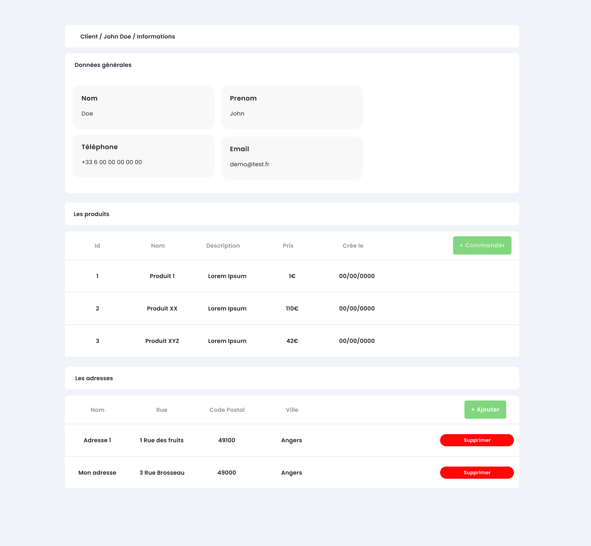

# Pratiquer la POO et le MVC

Dans ce TP, nous allons continuer notre découverte de la POO au travers du MVC.

::: details Sommaire
[[toc]]
:::

## Le projet

Dans le [TP todo liste](./tp1.1.md) nous avons vu la mise en place du design pattern MVC. Le découpage en 3 classes est le minimum, nous allons voir ici qu'il est possible d'exploiter la puissance de la programmation orientée objet (POO) pour organiser son code autour de classes qui auront un sens dans le cadre de votre projet.

- [Aide mémoire Programmation Orientée Objet](/cheatsheets/poo/)
- [La modélisation objet](/cheatsheets/poo-uml/)
- [Aide mémoire Mini MVC Sample](/cheatsheets/mini-mvc-sample/)

Le projet que vous allez réaliser est ce que l'on appelle une CRM (Customer Relationship Management), c'est un site (outil) qui va permettre d'afficher des informations clients sous le format d'une `Fiche Client`. Vous allez donc de voir créer quelques éléments de cette application à savoir :

- Lister les clients.
- Rechercher les clients.
- Voir la fiche d'un client (et afficher ces informations).
- Voir la liste des produits commandée par le client consulté.
- _Bonus_ : Afficher la liste des contacts d'un client.

::: danger Un instant

Nous allons nous placer ici dans un contexte type « entreprise » ou vous aurez à votre disposition un code existant. Pas d'inquiétude, le code de base est relativement petit, cependant il intègre des fonctionnements nouveaux. Donc, comme d'habitude je vous demande d'être curieux et de fouiner dans le code avant d'attaquer votre travail.

:::

## Récupérer le projet de base

Le projet de base est disponible [à l'adresse suivante en cliquant ici](https://github.com/c4software/mini-mvc-sample/archive/refs/tags/2.8.zip)

::: tip C'est un projet vide
Même si celui-ci contient à première vue « beaucoup de fichiers », le projet que vous avez téléchargé est bien un projet vide.
:::

## PDO vous connaissez ?

Évidemment [PDO](https://www.php.net/manual/en/book.pdo.php) vous connaissez… Mais connaissez-vous `FETCH_CLASS` ? Vous ne l'avez peut-être pas remarqué, mais la structure MVC n'utilise pas l'habituel`FETCH_ASSOC` , mais `FETCH_CLASS`. Ça veut dire qu'à partir de maintenant nous utiliser une syntaxe objet plutôt que des tableaux lors de la récupération de données en base !


Rassurez-vous, la lecture et l'écriture du code en seront grandement simplifiées ! Voilà quelques exemples :

```php
<?php
/** @var Client[] $clients */
foreach ($clients as $c) { ?>

    <div class="card m-3 p-3">
        <h3><?= $c->generalInfo() ?></h3>
        <p class="small"><?= $c->contactInfo() ?></p>

        <?php
        // Liste des produits
        $produits = $c->lesProduits();
        if (sizeof($produits) > 0) {
            ?>
            <h4>Les produits</h4>
            <ul>
                <?php foreach ($produits as $p) { ?>
                    <li><?= $p->toString() ?></li>
                <?php } ?>
            </ul>
        <?php } ?>


        <?php
        // Liste des adresses
        $adresses = $c->lesAdresses();
        if (sizeof($adresses) > 0) {
            ?>
            <h4>Les adresses</h4>
            <ul>
                <?php foreach ($adresses as $a) { ?>
                    <li><?= $a->toString() ?></li>
                <?php } ?>
            </ul>
        <?php } ?>
    </div>
<?php } ?>

```

Plus simple, non ? Ça va être surtout beaucoup plus puissant ! Nous allons être capables d'encapsuler la logique dans des objets que nous manipulerons directement dans notre vue.

## Avant d'aller plus loin… un usage avancé du routeur

La structure MVC que vous avez à votre disposition incorpore également la possibilité d'avoir des routes « dynamiques », exemple :

- `/sample/utilisateur/42`
- `/sample/utilisateur/420`

ou encore :

- `/sample/fiche/1`
- `/sample/fiche/123`

=> Que constatez-vous ?

::: details Élément de réponse

Nous avons effectivement une partie « variable » dans notre route, dans le cas des exemples :

- `/sample/utilisateur/42` => Consulter l'utilisateur avec comme identifiant **42**.
- `/sample/utilisateur/420` => Consulter l'utilisateur avec comme identifiant **420**.

ou encore :

- `/sample/fiche/1` => Consulter la fiche avec comme identifiant **1**.
- `/sample/fiche/123` => Consulter la fiche avec comme identifiant **123**.

C'est routes sont des équivalents à :

- `/sample/utilisateur?id=42` => Consulter l'utilisateur avec comme identifiant **42**.
- `/sample/utilisateur?id=420` => Consulter l'utilisateur avec comme identifiant **420**.
- `/sample/fiche?id=1` => Consulter la fiche avec comme identifiant **1**.
- `/sample/fiche?id=123` => Consulter la fiche avec comme identifiant **123**.

**Mais en beaucoup plus lisible !**

:::

Ce type de lien est très présent sur Internet, la structure MVC permet évidemment la création de ceux-ci.

Testons ça dans votre routeur :

```php
Route::Add('/client/{id}', [$main, 'client']);
```

Et dans votre Contrôleur :

```php
function client($id)
{
    echo "Voici le client avec l'identifiant $id";
}
```

Je vous laisse tester.

::: tip Valider le bon fonctionnement

- Tester le code proposé.
- Écrire une vue plutôt qu'un simple `echo`.
- À votre avis à quoi cela sert-il ?

:::

## Le code de base

Ici dans ce TP vous ne partirez pas de 0. J'ai écrit pour vous la partie « couche de données », il faudra donc avant d'attaquer analyser les différents diagrammes pour comprendre le code fourni.

### Les modèles

Dans ce TP vous allez travailler essentiellement la manipulation d'objet. Pour attaquer directement ce qui nous intéresse, voilà quelques modèles à télécharger et à déposer dans le dossier `models` de votre projet.

[Télécharger les classes et modèles](https://cours.brosseau.ovh/demo/php/poo-mvc/tp2-modele-class.zip)

### La base de données

Pour faire fonctionner les modèles, vous devez évidemment avoir la base de données compatible. La voilà :

[Télécharger la base de données](https://cours.brosseau.ovh/demo/php/poo-mvc/tp2-bdd.sql.zip)

Afin de vous permettre de la comprendre, voilà le diagramme de celle-ci.


Je vous laisse importer la base de données sur votre ordinateur.

::: tip Import ?

Point important la base de données n'oublier pas le dossier migration. En déposant le script dans le dossier `migration` de votre projet. Vous pourrez initialiser la base de données avec la commande suivante :

```sh
php mvc db:migrate
```

:::

### Diagramme de classe / UML relative aux modèles

Pour bien comprendre les classes que je vous fournis, voilà le diagramme de classe qui permet de les comprendre.

#### Diagramme des classes


#### Diagramme des modèles


::: warning STOP
Arrêtons-nous un instant pour analyser les diagrammes.

<iframe src="https://giphy.com/embed/xCwYFe19SldXLrJlwm" width="480" height="480" frameBorder="0" class="giphy-embed" allowFullScreen></iframe>

:::

## La page de liste / recherche

Maintenant que vous avez vu l'ensemble des méthodes à votre disposition pour accéder aux données présentes en base. Je vous propose de travailler sur la liste des clients présents en base de données.

Cette fonctionnalité est appelée la page de « Liste et de Recherche ». Elle va lister l'ensemble des clients présent en base et permettra l'accès à la fiche client.

Pour vous aider dans votre conception l'entreprise vous fournit le « mockup » d'interface suivant :


::: tip Quelques éléments pour vous aider.

Les zones « blanches » visibles dans le design sont appelées des Cards. Ils sont fournis de base dans Bootstrap ou Tailwind. N'hésitez pas à les utiliser.

Les résultats (liste des clients) sont une donnée tabulée, plutôt que de réinventer ce genre de choses avec des `div` n'hésitez pas à utiliser l'élément HTML prévu à cet effet à savoir une `table`.

:::

Maintenant que vous avez les bases en tête, nous allons pouvoir attaquer la conception de cette première page.

### Créer le contrôleur

La première étape dans une structure (MVC) comme celle que vous avez à votre disposition est de créer un contrôleur. Ce premier contrôleur sera dédié à la gestion de la liste des clients ainsi que la recherche. Nous pouvons le nommer par exemple `ClientController` (très original oui…).

::: tip Pour rappel

La structure MVC intègre un outil en ligne de commande afin de simplifier la création. Vous pouvez donc saisir dans le terminal la commande suivante :

```bash
php mvc controller:create ClientController
```

Vous avez maintenant un contrôleur vide dans votre projet !

:::

Je vous laisse créer une première méthode dedans qui aura pour but à terme d'afficher la liste des clients. Vous pouvez la nommer par exemple `liste` ou `listeClient`.

### Créer la vue

Maintenant que nous avons créé la base de notre contrôleur, nous pouvons préparer la vue. Je vous laisse créer celle-ci dans le dossier `views/liste/`.

::: tip Quelques éléments pour vous aider.

Les zones « blanches » visibles dans le design sont appelées des Cards. Ils sont fournis de base dans Bootstrap ou Tailwind. N'hésitez pas à les utiliser.

Les résultats (liste des clients) sont une donnée tabulée, plutôt que de réinventer ce genre de choses avec des `div` n'hésitez pas à utiliser l'élément HTML prévu à cet effet à savoir une `table`.

:::

### Créer la route /

Maintenant que nous avons notre contrôleur et notre vue, nous devons ajouter notre route. Le client souhaite une CRM Client, il faut donc remplacer la page d'accueil de base de la structure par votre page fraîchement créé. 

Modifier votre routeur pour faire pointer le lien `/` vers votre contrôleur ainsi que vers votre méthode. Pour vous aider, vous devriez avoir dans votre routeur **une** ligne ressemblant à ceci :

```php
Route::Add('/', [$clientControleur, 'liste']);
```

::: danger `$clientControleur` ?

Ceci est un objet instancié à partir de la classe de votre ClientControleur. Pour que ça fonctionne, il faut évidemment avoir créé un objet de type `ClientControleur` dans votre code.

:::

### Afficher la liste des clients

Nous y voilà ! Vous avez Votre Vue, Votre Controleur… Il ne manque plus que le modèle. Dans ce projet vous n'allez pas écrire de modèle, mais vous allez utiliser des modèles existants créés par un tiers (ce qui risque d'arriver par exemple … en stage).

Avant de continuer cette première page, il faut trouver le bon modèle à utiliser pour pouvoir construire votre liste de client. Vu que c'est le premier, je vous propose que nous le fassions ensemble…

Vous avez dans le diagramme UML de classe une classe nommée `ClientModele`, celle-ci contient l'ensemble du code permettant de rechercher des données dans la base client. Si vous regardez le diagramme en détail, vous avez accès à une méthode `liste` (avec deux paramètres). Celle-ci retourne un tableau (`array`), mais pas un array de n'importe quoi ! Elle retourne un `array` de client, que nous pouvons nommer ainsi `Client[]`.

L'objet client représente un client en base de données, il inclut donc l'ensemble des champs, **mais également** des méthodes permettant d'accéder par exemple à la liste des produits ou des adresses d'un client.

::: danger Ne pas copier/coller le code suivant c'est un exemple.

Concrètement ça permet d'écrire quelque chose comme :

```php
// À mettre dans le constructeur évidemment
$clientModele = new ClientModele();

// Récupère les clients en base.
$lesClients = $clientModele->liste();

// Affiche l'ensemble des clients en base. 
// Pour chaque client, affiche les informations général de celui
// La méthode generalInfo() est disponible dans la classe Client.
foreach ($lesClients as $leClient){
    echo $leClient->generalInfo();
}
```

**Hyper pratique, non ?**
:::

Vu qu'il s'agit de la première fois, je vous aide un peu sur la méthode de votre contrôleur (mais attention, ça sera la seule fois dans le TP).

_Extrait de code du contrôleur_:

```php
function __construct()
{
    $this->clientModele = new ClientsModele();
}

function liste($page = 0): string
{
    $clients = $this->clientModele->liste(10, $page);
    return Template::render(
        "views/liste/client.php",
        array("page" => $page, "clients" => $clients)
    );
}
```

### Ajouter la pagination et la fonctionnalité de recherche

Vous avez à votre disposition dans le bon modèle `ClientModele` une méthode permettant d'effectuer une recherche. Après l'avoir trouvé, je vous laisse écrire le code dans votre contrôleur pour effectuer une recherche dans la base de données des clients.

⚠️ Un instant ! Ici pas besoin de créer une nouvelle route ! Vous devez modifier la méthode de liste pour ajouter de nouveaux paramètres pour la pagination et la partie recherche.

## La fiche client

Maintenant que la liste des clients fonctionne, nous allons créer la fiche client. Celle-ci a pour but d'afficher les informations **d'un client**, il va donc falloir être capables de récupérer les informations d'un client via `son identifiant` puis d'en afficher le détail. L'entreprise pour vous aider vous propose le design suivant :



### Créer le contrôleur

Comme pour la liste, la fonctionnalité Fiche Client, sera mise dans une contrôleuse dédiée. Je vous laisse créer le contrôleur à l'aide de la ligne de commande. Vous pouvez le nommer `FicheControleur`.

Vous pouvez également en profiter pour créer le code qui afficher la fiche d'un client.

```php
public function fiche($id="")
{
    // À compléter avec les bons appels de méthode.
    return Template::render("views/fiche/client", []);
}
```

### Créer la route /client/{id}

Nous avons vu en introduction de ce TP qu'il était possible de réaliser des routes assez jolies. Je vous laisse créer une nouvelle route dans votre projet. Celle-ci va devoir devra appeler la méthode `fiche` de votre contrôleur `FicheControleur`.

### Créer la fiche client

À cette étape il s'agit de créer la vue qui permettra d'afficher les données d'un client.

::: tip Quelques éléments pour vous aider.

Les zones « blanches » visibles dans le design sont appelées des Cards. Ils sont fournis de base dans Bootstrap ou Tailwind. N'hésitez pas à les utiliser.

Les différentes listes (produits, adresses) sont des données tabulées, plutôt que de réinventer ce genre de choses avec des `div` n'hésitez pas à utiliser l'élément HTML prévu à cet effet à savoir une `table`.

:::

### Récupérer un client

Pour que votre vue affiche votre client, vous devez trouver la bonne méthode dans le bon modèle. Vous avez à votre disposition une méthode `getClientById` qui prend en paramètre l'id d'un client et qui retourne un objet de type `Client`. Je pense que j'en ai dit assez pour que vous puissiez avancer.

::: tip Vous ne pouvez pas deviner
Ici, pas d'invention possible. Vous devez vous référer aux deux diagrammes UML pour connaître les méthodes à appeler et connaître le fonctionnement de l'objet `Client`.
:::

::: details Besoin d'aide ?

Vous ne devriez pas en avoir besoin… Cependant, voici un petit coup de pouce.

```php
// Modèle permettant l'accès à la BDD
$clientModele = new ClientModele();

// Récupération du client avec 1 comme identifiant.
$leClient = $clientModele->getByClientId(1);

// Exemple, retourne le nom du client.
$leClient->getNom();

// Exemple, retourne la liste des clients du produit.
$lesProduitDuClient = $leClient->lesProduits();
```

:::

### Afficher la liste des produits d'un client

Si vous avez avancé comme prévu, vous avez à votre disposition dans votre vue un objet de type Client. Cet objet possède une méthode `lesProduits()` (comme indiqué dans le diagramme UML), celle-ci va pour permettre de récupérer la liste des produits commandés par le client. Vous allez devoir l'utiliser dans votre HTML.

Cette méthode va retourner une liste (array). Cette liste ne sera pas de n'importe quel type ça sera une liste de `Produit`, nous pouvons donc écrire que cette liste retourne `Produit[]`.

_Exemple d'utilisation_ :

```php
<ul>
    <?php foreach($leClient->lesProduits() as $leProduit){ ?>
        <li> <?= $leProduit->toString(); ?> </li>
    <?php } ?>
</ul>
```

Je vous laisse écrire le code dans votre vue afin d'afficher la liste des produits d'un client comme demandé.

### Ajouter un produit au client

Ajouter le code permettant d'ajouter un produit à un client. Pour réaliser cette action, vous aller avoir besoin :

- D'une vue avec un formulaire (pour choisir le produit).
- D'une route permettant d'ajouter le produit choisi à l'utilisateur actuellement consulté.
- D'une méthode dans votre contrôleur qui prendra deux paramètres `$clientId` et `$produitId`
  - Cette méthode va appeler la bonne méthode dans le bon modèle.
  - Rediriger l'utilisateur vers la fiche du client.

## Les adresses clients

En reprenant le principe de la liste des produits dans la fiche client, écrire le code qui permet : 

- D'afficher la liste des adresses d'un client.
- Créer et ajouter une adresse à un client.

::: warning Vous manquer d'inspiration ?

Pour traiter la demande d'affichage des adresses d'un utilisateur, vous devez regarder l'UML et plus précisément les méthodes accessibles dans l'objet `Client`. En regardant attentivement, vous devriez trouver une méthode nommée `lesAdresses()`. Cette méthode retourne un tableau des adresses utilisateur.

Pour l'ajout, vous allez devoir utiliser le modèle `AdresseModele` et plus particulièrement la méthode `creerAdresseClient` qui vous permettra d'ajouter une adresse.

:::

## La liste des contacts

En reprenant le principe de la partie « Produit » ou « Adresse ». Le développeur de la société vous demande d'ajouter le code nécessaire pour que :

- Votre client possède plusieurs données de contact `(Nom du contact, Numéro, Email)`.

Il vous demande de modifier l'objet `Client` pour ajouter un nouveau `getters` permettant d'obtenir l'ensemble des contacts d'un client.

::: tip À faire

Pour traiter ce problème, vous devez découper votre travail en différentes étapes :

- Créer un nouveau modèle `php mvc model:create ContactModele`
- Ajouter en base les deux tables.
- Écrire les requêtes dans votre modèle.
- Créer un objet `Contact` (prendre exemple sur ceux déjà présents dans le code, dans le dossier `classes`).
- Afficher les contacts du client dans la partie Fiche Client.

:::

## Les bonus

Un bon TP se termine toujours par de bons bonus. Les bonus vont vous permettre devoir si vous avez compris les manipulations précédemment réalisées.

### Bonus : Ajouter une pagination dans la vue liste / recherche.

Modifier votre code pour ajouter un système de pagination (10 clients par 10 clients) dans votre liste. Les méthodes que vous avez utilisées comportent différents paramètres permettant de réaliser des listes paginées. Après l'avoir trouvé, je vous laisse donc :

- Modifier l'interface afin de permettre la pagination.
- Modifier vos appels aux modèles pour réaliser des listes paginées.

### Bonus : Les produits

Vous avez précédemment codé la partie Fiche client. Le développeur de l'entreprise vous demande maintenant d'ajouter les différents écrans pour afficher les produits. La première étape va donc être la création d'un contrôleur.

#### Lister les produits en base

- Créer la vue permettant de liste les produits présente en base.
- Créer la route permettant d'afficher votre vue.
- À l'aide du bon modèle affiché la liste de l'ensemble des produits.

Voilà à quoi pourrait ressembler l'écran :


#### Ajouter un produit en base

- Créer la vue permettant d'ajouter un nouveau produit en base.
- Créer la route permettant d'afficher cette nouvelle vue.
- Écrire la logique dans votre nouveau contrôleur pour ajouter un produit en base à l'aide des modèles déjà présents.

### Bonus : L'authentification

Le développeur de l'entreprise vous demande d'ajouter un système d'authentification afin de sécuriser l'accès à votre CRM. Pour cela, vous allez devoir :

- Créer un nouveau modèle `php mvc model:create UtilisateurModele`
- Créer une nouvelle table `utilisateur` en base de données.
- Créer une nouvelle vue permettant de se connecter.
- Créer une nouvelle route permettant d'afficher la vue.
- Écrire la logique dans votre nouveau contrôleur pour authentifier un utilisateur à l'aide des modèles déjà présents.

::: tip À faire

- N'oubliez pas de modifier votre routeur pour que la page d'accueil pointe vers votre nouvelle page de connexion.

- N'oublier pas également de modifier votre routeur afin de ne pas autoriser l'accès à votre CRM sans être connecté (sauf la page de connexion évidemment).