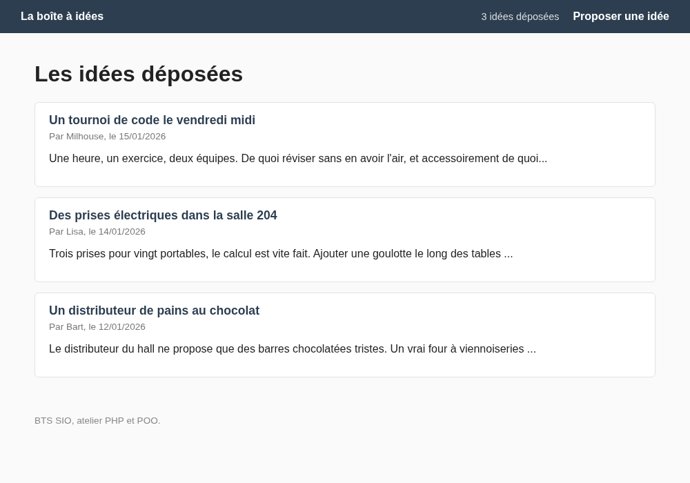
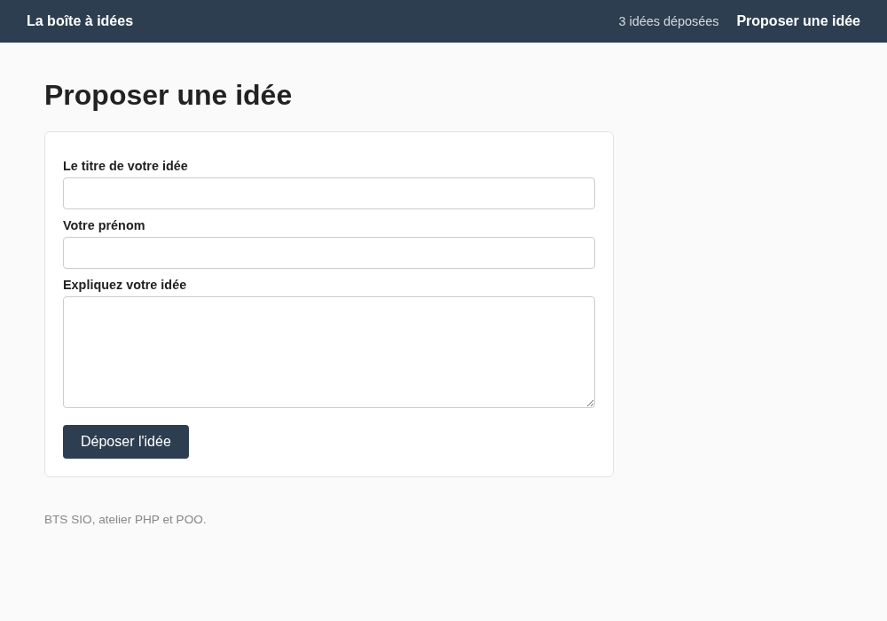
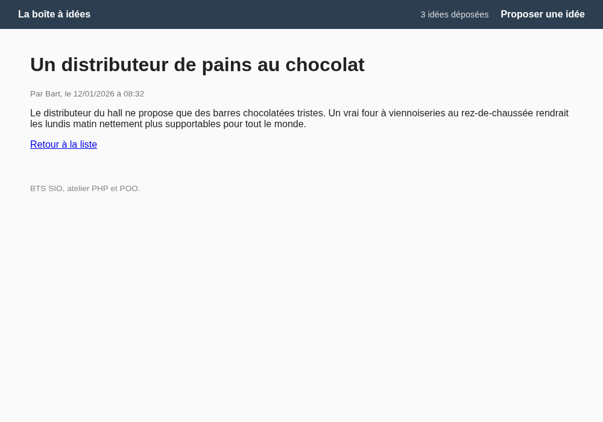

# TP 1 POO : La boîte à idées

::: details Sommaire
[[toc]]
:::

Vous savez déjà faire un site en PHP : un `index.php` qui sert de point d'entrée, une whitelist, des pages dans `pages/`, un header et un footer communs, et depuis le [TP 6 SQL](../sql/tp6.md), une base de données interrogée avec PDO et des requêtes préparées.

Aujourd'hui, nous ne changeons pas de métier : **nous réécrivons ce que vous savez déjà faire, mais avec des classes**. Le site sera volontairement simple (une boîte à idées pour améliorer le lycée), pour que toute votre attention aille sur la nouveauté : la manière dont le code est **rangé**.

À la fin de la séance, vous aurez un site qui liste des idées, un formulaire pour en déposer une, et surtout deux classes que vous retrouverez, sous un autre nom, dans tous les frameworks du monde.

Dans ce TP, je vous invite à avoir en parallèle :

- [Le complément de cours POO](./support.md)
- [Les slides du cours sur la POO](/cours/php_poo.md)
- [L'aide mémoire PHP](/cheatsheets/php/)

## Les slides

Avant de commencer, un tour rapide des compétences du jour : un site construit autour de deux classes, une ligne de la base qui devient un objet, et l'autoloader qui remplace vos `include`.

<ClientOnly>
<SlidesDeck src="php_poo_tp1" />
</ClientOnly>

## Prérequis

Pour travailler confortablement, il vous faut :

- **XAMPP ou WAMP** démarré (Apache + MySQL/MariaDB), et **phpMyAdmin** accessible (en général [http://localhost/phpmyadmin](http://localhost/phpmyadmin)).
- La structure « entry-point » du [TP 3](../tp3.md) bien en tête : `index.php`, `$whitelist`, `common/`, `pages/`, `public/`.
- Les bases de PDO : `prepare()`, `execute()`, `fetch()`, `fetchAll()`.
- Le vocabulaire du cours : classe, objet, propriété, méthode, constructeur, visibilité.

::: details Rattrapage : classe, objet, propriété, méthode

Une **classe** (class) est un moule : elle décrit ce qu'un objet sait **contenir** (ses propriétés) et ce qu'il sait **faire** (ses méthodes).

Un **objet** (object) est une réalisation concrète de ce moule, fabriquée avec `new`.

```php
class Dog
{
    public string $name;

    public function bark(): string
    {
        return $this->name . " aboie !";
    }
}

$dog = new Dog();
$dog->name = "Petit Papa Noël";
echo $dog->bark();
```

Tout est repris en détail dans [le support](./support.md#une-classe) et [la partie sur les objets](./support.md#les-objets).

:::

## Objectifs

À la fin de ce TP vous saurez :

- Organiser un projet PHP avec un dossier `classes/` et un **autoloader**.
- Écrire une classe utilitaire avec une **méthode statique** (`Database::getPdo()`).
- Écrire une classe **modèle** avec des propriétés typées et un constructeur.
- Donner à cette classe les méthodes qui lisent et écrivent en base : tout le SQL au même endroit.
- Transformer une ligne de base de données (un tableau associatif) en **objet**.
- Faire vivre un formulaire : saisie, objet, enregistrement, redirection, message de confirmation.

::: tip Le visuel n'est pas l'objectif
Une CSS minimale vous est fournie. Ce que je regarde aujourd'hui, ce sont vos classes et la façon dont vos pages les utilisent.
:::

## Ce que nous allons construire

Un site avec deux pages principales :

- **L'accueil** : la liste des idées déposées (titre, auteur, extrait, date).
- **Proposer une idée** : un formulaire qui enregistre en base et renvoie sur l'accueil.

Et deux classes, une par responsabilité :

```txt
Database          Se connecter à MySQL (et une seule fois).
Idea              Représenter UNE idée, et savoir la lire, l'enregistrer, la supprimer.
```

`Idea`, c'est ce qu'on appelle un **modèle** (*model* en anglais) : la classe qui représente une ligne de la table `idees` **et** qui sait aller la chercher en base. Retenez cette découpe, c'est le cœur du TP : **une classe = une responsabilité**.

## Étape 1 : la base de données et la structure du projet

### La base

Dans phpMyAdmin, onglet **SQL**, collez et exécutez ce script. Il crée la base, la table et trois idées d'exemple :

```sql
CREATE DATABASE IF NOT EXISTS boite_idees CHARACTER SET utf8mb4 COLLATE utf8mb4_unicode_ci;
USE boite_idees;

DROP TABLE IF EXISTS idees;

CREATE TABLE idees (
  id INT AUTO_INCREMENT PRIMARY KEY,
  titre VARCHAR(150) NOT NULL,
  auteur VARCHAR(100) NOT NULL,
  contenu TEXT NOT NULL,
  date_creation DATETIME NOT NULL DEFAULT CURRENT_TIMESTAMP
) ENGINE=InnoDB DEFAULT CHARSET=utf8mb4 COLLATE=utf8mb4_unicode_ci;

INSERT INTO idees (titre, auteur, contenu, date_creation) VALUES
('Un distributeur de pains au chocolat', 'Bart', 'Le distributeur du hall ne propose que des barres chocolatées tristes. Un vrai four à viennoiseries au rez-de-chaussée rendrait les lundis matin nettement plus supportables pour tout le monde.', '2026-01-12 08:32:00'),
('Des prises électriques dans la salle 204', 'Lisa', 'Trois prises pour vingt portables, le calcul est vite fait. Ajouter une goulotte le long des tables éviterait la course aux places près du mur.', '2026-01-14 10:05:00'),
('Un tournoi de code le vendredi midi', 'Milhouse', 'Une heure, un exercice, deux équipes. De quoi réviser sans en avoir l''air, et accessoirement de quoi décider qui paye les croissants du lundi.', '2026-01-15 12:47:00');
```

::: warning Les noms sont en français côté base, en anglais côté code
La table s'appelle `idees` et ses colonnes `titre`, `auteur`, `contenu`. Votre classe, elle, s'appellera `Idea`, avec des propriétés `title`, `author`, `content`. C'est la convention que nous suivons depuis le début de l'année, et c'est aussi celle que vous croiserez en entreprise. La traduction se fera à **un seul endroit** : dans le modèle.
:::

### L'arborescence

Créez un **nouveau projet** nommé `boite-a-idees` avec cette organisation :

```txt
boite-a-idees/
├── index.php                  Le point d'entrée (autoloader, session, whitelist)
├── classes/
│   ├── Database.php           La connexion à la base
│   └── Idea.php               Le modèle : une idée, et l'accès aux idées
├── common/
│   ├── header.php             Le début du HTML
│   └── footer.php             La fin du HTML
├── pages/
│   ├── home.php               La liste des idées
│   └── proposer.php           Le formulaire
└── public/
    └── main.css               La feuille de style
```

Vous reconnaissez tout, sauf `classes/`. La règle y est simple et **non négociable** : **un fichier par classe, et le nom du fichier est exactement le nom de la classe**. `Database.php` contient `class Database`, `Idea.php` contient `class Idea`. Majuscules comprises.

### Le point d'entrée

Voici `index.php`, complet et commenté :

```php
<?php

// Permet d'utiliser header() même si du HTML a déjà été envoyé (voir plus bas)
ob_start();

// L'autoloader : PHP appelle cette fonction dès qu'une classe inconnue est utilisée.
spl_autoload_register(function ($className) {
    require_once('classes/' . $className . '.php');
});

// La session sert (entre autres) à transporter le message de confirmation.
session_start();

include('common/header.php');

// Les pages autorisées, et elles seules.
$whitelist = ['home', 'proposer'];

if (isset($_GET['page']) && in_array($_GET['page'], $whitelist)) {
    include('pages/' . $_GET['page'] . '.php');
} else {
    include('pages/home.php');
}

include('common/footer.php');
```

Comparez avec votre `index.php` du TP 3 : c'est le **même fichier**. Seule nouveauté, les quatre premières lignes, qui remplacent les `include` de vos fichiers de fonctions.

:::: tip Que se passe-t-il derrière ?
**Question : que fait vraiment `spl_autoload_register` ?**

::: details La réponse
Vous lui donnez une fonction, et PHP la met de côté. Ensuite, dès que votre code mentionne une classe que PHP ne connait pas encore (par exemple au moment du `new Idea(...)` ou de l'appel `Database::getPdo()`), PHP **appelle votre fonction** en lui passant le nom de la classe manquante, ici `"Idea"` ou `"Database"`.

Votre fonction fait alors la seule chose utile : `require_once('classes/Idea.php')`. Le fichier est chargé, la classe existe, et PHP continue comme si de rien n'était.

Deux conséquences importantes :

- Vous n'écrivez **plus jamais** de `require` pour vos classes. Vous les utilisez, elles arrivent.
- Une classe qui n'est jamais utilisée n'est **jamais chargée**. Votre code reste léger même avec cinquante classes.

Les vrais projets utilisent un autoloader tout fait, en beaucoup plus sophistiqué (gestion des namespaces, cache, etc). Le principe, lui, ne change pas. Tout est [dans le support](./support.md#charger-les-classes-automatiquement).
:::
::::

### Le header, le footer et la CSS

`common/header.php` :

```php
<!DOCTYPE html>
<html lang="fr">

<head>
    <meta charset="UTF-8">
    <meta name="viewport" content="width=device-width, initial-scale=1.0">
    <title>La boîte à idées</title>
    <link rel="stylesheet" href="./public/main.css">
</head>

<body>
    <header>
        <a href="index.php?page=home">La boîte à idées</a>
        <a href="index.php?page=proposer">Proposer une idée</a>
    </header>
    <main>
```

`common/footer.php` :

```php
    </main>
    <footer>
        BTS SIO, atelier PHP et POO.
    </footer>
</body>

</html>
```

::: details La feuille de style `public/main.css`

Rien d'obligatoire ici, c'est juste pour que vos captures soient lisibles. Copiez, et n'y revenez plus.

```css
body {
    margin: 0;
    font-family: "Segoe UI", Tahoma, Geneva, Verdana, sans-serif;
    background-color: #fafafa;
    color: #222;
}

header {
    display: flex;
    align-items: center;
    gap: 20px;
    padding: 15px 30px;
    background-color: #2c3e50;
    color: white;
}

header a {
    color: white;
    text-decoration: none;
    font-weight: bold;
}

header span {
    margin-left: auto;
    font-size: 0.9em;
    opacity: 0.8;
}

main {
    max-width: 900px;
    margin: 0 auto;
    padding: 20px 30px;
}

.idea {
    background: white;
    border: 1px solid #e2e2e2;
    border-radius: 6px;
    padding: 15px 20px;
    margin-bottom: 15px;
}

.idea h2 {
    margin: 0 0 5px 0;
    font-size: 1.1em;
}

.idea h2 a {
    color: #2c3e50;
    text-decoration: none;
}

.meta {
    color: #777;
    font-size: 0.85em;
    margin: 0 0 10px 0;
}

.message {
    background: #e8f6ef;
    border-left: 4px solid #27ae60;
    padding: 10px 15px;
}

.error {
    background: #fdecea;
    border-left: 4px solid #c0392b;
    padding: 10px 15px;
}

form {
    background: white;
    border: 1px solid #e2e2e2;
    border-radius: 6px;
    padding: 20px;
    max-width: 600px;
}

label {
    display: block;
    margin: 10px 0 5px 0;
    font-weight: bold;
    font-size: 0.9em;
}

input,
textarea {
    width: 100%;
    padding: 8px;
    border: 1px solid #ccc;
    border-radius: 4px;
    box-sizing: border-box;
    font-family: inherit;
    font-size: 1em;
}

button {
    margin-top: 15px;
    padding: 10px 20px;
    border: 0;
    border-radius: 4px;
    background: #2c3e50;
    color: white;
    font-size: 1em;
    cursor: pointer;
}

footer {
    max-width: 900px;
    margin: 0 auto;
    padding: 20px 30px;
    color: #888;
    font-size: 0.85em;
}
```

:::

Créez enfin un `pages/home.php` provisoire, avec un simple `<h1>Les idées déposées</h1>`.

::: tip Point de contrôle
En ouvrant `http://localhost/boite-a-idees/index.php`, vous voyez le bandeau bleu, le titre et le pied de page. Aucune erreur PHP à l'écran. Le squelette est en place, on peut passer aux choses sérieuses.
:::

## Étape 2 : la classe Database

Dans les TP SQL, votre connexion vivait dans `utils/db.php`, un fichier qui créait une variable globale `$pdo`. Nous remplaçons ce fichier par une classe.

Créez `classes/Database.php` :

```php
<?php

class Database
{
    // La connexion, partagée par toute l'application.
    private static ?PDO $pdo = null;

    public static function getPdo(): PDO
    {
        // Première demande : on se connecte.
        if (self::$pdo === null) {
            $dsn = "mysql:host=localhost;dbname=boite_idees;charset=utf8mb4";
            self::$pdo = new PDO($dsn, "root", "");
            self::$pdo->setAttribute(PDO::ATTR_ERRMODE, PDO::ERRMODE_EXCEPTION);
        }

        // Les fois suivantes : on rend la connexion déjà ouverte.
        return self::$pdo;
    }
}
```

Ligne par ligne :

- `private static ?PDO $pdo = null;` : une propriété qui appartient à la **classe** et non à un objet. Le `?` signifie « un PDO **ou** `null` » : au démarrage, il n'y a pas encore de connexion. `private` interdit d'y toucher depuis l'extérieur.
- `public static function getPdo(): PDO` : une méthode que l'on appelle **sans créer d'objet**, avec `Database::getPdo()` (deux-points doubles, pas de flèche).
- `self::$pdo` : « la propriété `$pdo` de ma propre classe ». `self` est à la classe ce que `$this` est à l'objet.
- Le `if` : si la connexion n'existe pas encore, on la crée. Sinon, on rend celle qui existe déjà.
- `charset=utf8mb4` : sans lui, les accents s'affichent en « é ».
- `ERRMODE_EXCEPTION` : en cas d'erreur SQL, PHP vous affiche un vrai message plutôt que d'échouer en silence.

::: warning Adaptez à votre configuration
Sur XAMPP et WAMP, l'utilisateur est `root` et le mot de passe est vide. Si votre configuration diffère, c'est la seule ligne à changer, et elle est au **même endroit pour tout le projet**. C'est déjà un bénéfice concret.
:::

:::: tip Question de réflexion
**Pourquoi `static` ? Pourquoi ne pas simplement écrire `$db = new Database();` dans chaque page ?**

Prenez une minute avant d'ouvrir la réponse.

::: details La réponse
Parce qu'une connexion à MySQL coûte cher (une ouverture réseau, une authentification). Si chaque page, chaque classe, chaque bout de code créait sa propre `Database`, vous ouvririez cinq connexions pour afficher une page.

Avec `static`, la propriété `$pdo` est unique **pour toute l'application** : la première ligne qui appelle `Database::getPdo()` paye la connexion, toutes les suivantes la réutilisent instantanément. Et comme il n'y a rien à instancier, la connexion est accessible de n'importe où sans avoir à trimballer une variable `$pdo` de fonction en fonction.

Ce motif porte un nom : on parle de **singleton** (un seul exemplaire). Vous en reparlerez en deuxième année. Détails dans [le support](./support.md#une-classe-pour-la-base-de-donnees).
:::
::::

Pour vérifier que tout fonctionne, mettez temporairement ceci en haut de `pages/home.php` :

```php
<?php
var_dump(Database::getPdo());
```

::: tip Point de contrôle
Votre page affiche quelque chose comme `object(PDO)#2 (0) { }`. Vous n'avez écrit **aucun** `require` : c'est l'autoloader qui est allé chercher `classes/Database.php` tout seul.

Une erreur `SQLSTATE[HY000] [1049] Unknown database` ? Le script SQL de l'étape 1 n'a pas été exécuté, ou le nom de la base est mal orthographié dans le `$dsn`.
:::

Supprimez le `var_dump` avant de continuer.

## Étape 3 : la classe Idea, les données

`Database` sait se connecter. Il nous faut maintenant de quoi représenter **une idée**.

Cette classe, c'est le **modèle** (*model* en anglais) de la table `idees`. Nous la construisons en deux temps : aujourd'hui les **données** (ce qu'est une idée), et à l'étape suivante les **méthodes d'accès** (comment on va la chercher en base).

Créez `classes/Idea.php` :

```php
<?php

class Idea
{
    public function __construct(
        public ?int $id,
        public string $title,
        public string $author,
        public string $content,
        public string $createdAt
    ) {
    }

    public function getShortContent(int $length = 100): string
    {
        if (mb_strlen($this->content) <= $length) {
            return $this->content;
        }

        return mb_substr($this->content, 0, $length) . '...';
    }
}
```

Ça mérite quelques explications.

**Les propriétés typées.** Écrire `public string $title` plutôt que `public $title` engage un contrat : cette propriété contient une chaine de caractères, et rien d'autre. Si quelqu'un tente d'y mettre un tableau, PHP refuse **tout de suite** au lieu de laisser passer un bug qui explosera trois écrans plus loin.

**Le `?int` de l'id.** Le point d'interrogation veut dire « un entier **ou** `null` ». Pourquoi ? Parce qu'une idée qui vient d'être saisie dans le formulaire **n'a pas encore d'id** : c'est MySQL qui le lui donnera, avec l'`AUTO_INCREMENT`, au moment de l'enregistrement. Une idée relue depuis la base, elle, a un id. Les deux situations sont légitimes, le type le dit.

**La promotion de constructeur.** Le code ci-dessus est une écriture raccourcie, disponible depuis PHP 8. Sans elle, il faudrait écrire :

```php
class Idea
{
    public ?int $id;
    public string $title;
    // ... et ainsi de suite

    public function __construct(?int $id, string $title, /* ... */)
    {
        $this->id = $id;
        $this->title = $title;
        // ... et ainsi de suite
    }
}
```

Vingt lignes pour recopier des paramètres dans des propriétés. En mettant `public` devant chaque paramètre du constructeur, PHP **déclare la propriété et fait l'affectation pour vous**. C'est strictement équivalent, en beaucoup plus court. On appelle ça la **promotion de constructeur** (constructor promotion), c'est expliqué dans [le support](./support.md#le-constructeur).

**La méthode `getShortContent`.** C'est là que la POO devient intéressante. Une idée sait produire un extrait d'elle-même. `$length = 100` est une **valeur par défaut** : si on appelle `getShortContent()` sans rien, la longueur vaut 100 ; on peut aussi demander `getShortContent(40)`. `$this->content` désigne le contenu **de cet objet précis**. Et l'on utilise `mb_strlen` et `mb_substr` plutôt que `strlen` et `substr` pour que les accents soient comptés comme **un** caractère.

Testez maintenant. Dans `pages/home.php`, temporairement :

```php
<?php
$idea = new Idea(null, 'Test', 'Bart', 'Un contenu de test, écrit à la main pour vérifier que tout fonctionne.', date('Y-m-d H:i:s'));

echo $idea->title;
echo " par ";
echo $idea->author;
echo "<br>";
echo $idea->getShortContent(20);
```

::: tip Point de contrôle
Vous lisez `Test par Bart`, puis `Un contenu de test, ...` (vingt caractères suivis des points de suspension). Vous venez de créer un objet et d'appeler une méthode dessus. Notez bien la **flèche** `->` : à gauche l'objet, à droite ce qu'on lui demande.
:::

:::: tip Question de réflexion
**Et si j'écris `$idea->titre` au lieu de `$idea->title` ?**

Essayez pour de vrai, puis ouvrez la réponse.

::: details La réponse
PHP vous répond `Warning: Undefined property: Idea::$titre`, et n'affiche rien.

Et c'est une **excellente nouvelle**. Souvenez-vous de vos tableaux associatifs du TP 6 SQL : `$row['titre']`, `$row['titer']`, `$row['Titre']`... une faute de frappe donnait une case vide, sans le moindre avertissement, et vous passiez dix minutes à chercher pourquoi la colonne était blanche.

Avec un objet, la liste des propriétés est **écrite dans la classe**. Ce qui n'y figure pas n'existe pas, et PHP vous le dit. Bonus : votre éditeur, lui aussi, connait cette liste, et vous propose l'autocomplétion. Vous ne reviendrez pas en arrière.
:::
::::

Supprimez le code de test avant de continuer.

## Étape 4 : le modèle va chercher les idées

Nous avons une connexion et un moule à idées. Il manque le lien entre les deux : de quoi aller chercher les données en base.

Ce lien, nous n'allons pas le mettre dans une nouvelle classe : nous l'ajoutons **à `Idea`**. C'est tout l'intérêt du modèle, une seule classe par table, qui représente une ligne **et** qui sait la lire, l'enregistrer, la supprimer.

La règle : **tout le SQL de l'application vit dans le modèle**. Aucune requête ne doit apparaitre dans `pages/`. Vos pages, elles, ne font plus que de l'affichage.

Ajoutez cette méthode dans `classes/Idea.php`, à la suite de `getShortContent()` :

```php
    // Toutes les idées, la plus récente en premier.
    public static function all(): array
    {
        $pdo = Database::getPdo();
        $rows = $pdo->query("SELECT * FROM idees ORDER BY date_creation DESC")->fetchAll(PDO::FETCH_ASSOC);

        $ideas = [];
        foreach ($rows as $row) {
            $ideas[] = new Idea(
                $row['id'],
                $row['titre'],
                $row['auteur'],
                $row['contenu'],
                $row['date_creation']
            );
        }

        return $ideas;
    }
```

Regardez bien cette méthode, elle est le cœur du TP.

La variable `$rows` contient **exactement** ce que PDO vous renvoyait dans les TP SQL : un tableau de tableaux associatifs, avec les noms de colonnes **français** comme clés. Rien de nouveau.

La boucle, elle, fait la traduction : pour chaque ligne, elle fabrique un `Idea`. Une ligne de la base entre, un objet sort. Et c'est ici, **à un seul endroit dans tout le projet**, que `titre` devient `title` et `contenu` devient `content`. Si demain la colonne `contenu` est renommée en base, vous corrigez cette ligne, et rien d'autre.

Le type de retour `: array` annonce que la méthode rend un tableau. Ici, un tableau d'objets `Idea`.

**Et pourquoi `static` ?** Parce qu'on appelle `all()` sur la **classe** : `Idea::all()`, avec le double deux-points, et non `$idea->all()`. C'est le même raisonnement que pour `Database::getPdo()` : au moment où l'on demande la liste des idées, **on n'a encore aucun objet sous la main**. C'est justement le travail de la méthode que d'en fabriquer.

::: tip Que se passe-t-il derrière ?
Pourquoi `query()` ici et pas `prepare()` ? Parce que cette requête ne contient **aucune valeur venant de l'utilisateur** : elle est écrite en dur, en entier, dans votre code. Dès qu'une valeur variable entre dans une requête, la règle ne change pas d'un millimètre par rapport aux TP SQL : `prepare()` et `execute()`, sans exception. Vous le ferez dès l'étape suivante.
:::

À vous de jouer pour l'affichage. Voici `pages/home.php`, la boucle est à écrire :

```php
<?php
$ideas = Idea::all();
?>

<h1>Les idées déposées</h1>

<?php foreach ($ideas as $idea) { ?>
    <article class="idea">
        <h2><!-- À vous : le titre de l'idée --></h2>
        <p class="meta">
            <!-- À vous : l'auteur et la date au format jj/mm/aaaa -->
        </p>
        <p><!-- À vous : l'extrait du contenu --></p>
    </article>
<?php } ?>
```

::: details Besoin d'aide pour afficher une date ?

La colonne `date_creation` contient une chaine du type `2026-01-12 08:32:00`. Pour l'afficher joliment, deux fonctions que vous connaissez déjà :

```php
echo date('d/m/Y', strtotime($idea->createdAt));
```

`strtotime` transforme la chaine en date manipulable par PHP, `date` la remet en forme.

:::

::: details Voir l'une des solutions possibles

```php
<?php
$ideas = Idea::all();
?>

<h1>Les idées déposées</h1>

<?php foreach ($ideas as $idea) { ?>
    <article class="idea">
        <h2><?php echo $idea->title; ?></h2>
        <p class="meta">
            Par <?php echo $idea->author; ?>,
            le <?php echo date('d/m/Y', strtotime($idea->createdAt)); ?>
        </p>
        <p><?php echo $idea->getShortContent(); ?></p>
    </article>
<?php } ?>
```

:::

::: tip Point de contrôle
Votre page d'accueil affiche les trois idées d'exemple, la plus récente en premier, chacune avec son auteur, sa date et un extrait de cent caractères.



Prenez trente secondes pour relire `home.php` : il n'y a **plus une seule ligne de SQL** dedans. Une ligne suffit à obtenir les données, le reste est du HTML. C'est exactement l'objectif.
:::

## Étape 5 : déposer une idée

Une boîte à idées où personne ne peut déposer d'idée, ça manque d'ambition. Passons au formulaire.

### Le modèle sait enregistrer

Première chose, ajouter une méthode `save()` à `Idea`. Cette fois, c'est vous qui l'écrivez. Elle doit :

- S'écrire `public function save(): void`, **sans** le mot `static` et **sans** paramètre.
- Préparer un `INSERT INTO idees (titre, auteur, contenu, date_creation) VALUES (?, ?, ?, ?)`.
- L'exécuter avec les propriétés de l'objet, `$this->title`, `$this->author`, etc.
- Pour finir, ranger dans `$this->id` le numéro attribué par MySQL, que `lastInsertId()` vous donne.

Le `: void` annonce que la méthode ne renvoie rien. Et oui, cette requête contient des valeurs venant de l'utilisateur : **requête préparée obligatoire**.

:::: tip Pourquoi `save()` n'est-elle pas `static`, alors que `all()` l'est ?

::: details La réponse
Parce que `save()` a besoin d'un objet pour travailler : elle enregistre **cette** idée-là, celle dont elle lit les propriétés avec `$this`. On l'appelle donc sur un objet, `$idea->save()`.

`all()`, à l'inverse, sert à **obtenir** des objets : au moment de l'appel, il n'y en a aucun. D'où `Idea::all()`, sur la classe.

La règle, en une phrase : si la méthode a besoin d'un objet, elle n'est pas statique ; si elle sert à en obtenir un, elle l'est. C'est détaillé dans [le support](./support.md#le-modele).
:::
::::

::: details Besoin d'aide pour écrire `save()` ?

La structure est la même que pour `all()` : on demande la connexion à `Database`, on prépare, on exécute. La seule différence, c'est que les valeurs à passer à `execute()` viennent des propriétés de l'objet courant, par exemple `$this->title`. Le cheminement complet est décrit dans [le support](./support.md#le-modele).

:::

::: details Voir l'une des solutions possibles

```php
    // Enregistre CETTE idée en base.
    public function save(): void
    {
        $pdo = Database::getPdo();
        $stmt = $pdo->prepare(
            "INSERT INTO idees (titre, auteur, contenu, date_creation) VALUES (?, ?, ?, ?)"
        );
        $stmt->execute([$this->title, $this->author, $this->content, $this->createdAt]);

        $this->id = (int) $pdo->lastInsertId();
    }
```

La dernière ligne est un petit bonus bien pratique : juste après l'enregistrement, votre objet connait son propre identifiant, celui que MySQL vient de lui attribuer. Le `?` de `?int $id` prend tout son sens.

:::

### Le formulaire

Créez `pages/proposer.php`. Voici le HTML, je vous le donne :

```php
<h1>Proposer une idée</h1>

<form method="post" action="index.php?page=proposer">
    <label for="titre">Le titre de votre idée</label>
    <input type="text" name="titre" id="titre" maxlength="150">

    <label for="auteur">Votre prénom</label>
    <input type="text" name="auteur" id="auteur" maxlength="100">

    <label for="contenu">Expliquez votre idée</label>
    <textarea name="contenu" id="contenu" rows="6"></textarea>

    <button type="submit">Déposer l'idée</button>
</form>
```

Le formulaire s'envoie **sur lui-même** (`action="index.php?page=proposer"`), comme au TP 5 : la même page affiche le formulaire et traite la réponse.



### Le traitement

À placer **au-dessus** du HTML du formulaire. Le squelette est là, les trous sont pour vous :

```php
<?php
$error = null;

if ($_SERVER['REQUEST_METHOD'] === 'POST') {
    $title = trim($_POST['titre'] ?? '');
    $author = trim($_POST['auteur'] ?? '');
    $content = trim($_POST['contenu'] ?? '');

    if ($title === '' || $author === '' || $content === '') {
        $error = "Tous les champs sont obligatoires.";
    } else {
        // 1. À vous : créer l'objet Idea (quel id pour une idée qui n'existe pas encore ?)
        $idea = /* ... */;

        // 2. À vous : demander à l'objet de s'enregistrer

        // 3. À vous : déposer un message de confirmation dans la session

        // 4. À vous : rediriger vers la page d'accueil (et ne pas oublier le die())
    }
}
?>

<h1>Proposer une idée</h1>

<?php if ($error !== null) { ?>
    <p class="error"><?php echo $error; ?></p>
<?php } ?>

<!-- Le formulaire donné plus haut -->
```

Quelques indications sur le squelette fourni :

- `$_SERVER['REQUEST_METHOD'] === 'POST'` : « le formulaire vient-il d'être envoyé ? ». Au premier affichage de la page, c'est un GET, on ne traite rien.
- `$_POST['titre'] ?? ''` : l'opérateur de coalescence (`??`) rend `''` si la case n'existe pas. Cela évite un warning si quelqu'un bricole la requête.
- `trim()` : supprime les espaces avant et après. Sans lui, un titre composé de trois espaces passerait pour rempli.

::: details Besoin d'aide pour le message de confirmation ?

Un « message flash » (flash message), c'est une information que l'on dépose en session juste avant une redirection, pour l'afficher **une seule fois** sur la page suivante :

```php
$_SESSION['message'] = "Merci, votre idée a bien été déposée.";
```

Et côté `home.php`, on l'affiche puis on le **supprime**, sinon il resterait collé sur toutes les pages suivantes :

```php
<?php if (isset($_SESSION['message'])) { ?>
    <p class="message"><?php echo $_SESSION['message']; ?></p>
    <?php unset($_SESSION['message']); ?>
<?php } ?>
```

:::

::: details Voir l'une des solutions possibles

Le traitement dans `pages/proposer.php` :

```php
<?php
$error = null;

if ($_SERVER['REQUEST_METHOD'] === 'POST') {
    $title = trim($_POST['titre'] ?? '');
    $author = trim($_POST['auteur'] ?? '');
    $content = trim($_POST['contenu'] ?? '');

    if ($title === '' || $author === '' || $content === '') {
        $error = "Tous les champs sont obligatoires.";
    } else {
        $idea = new Idea(null, $title, $author, $content, date('Y-m-d H:i:s'));
        $idea->save();

        $_SESSION['message'] = "Merci, votre idée a bien été déposée.";
        header('location: index.php?page=home');
        die();
    }
}
?>
```

L'id vaut `null` : l'idée n'existe pas encore en base, c'est l'`AUTO_INCREMENT` de MySQL qui lui donnera son numéro. Vous voyez maintenant à quoi servait le `?` de `?int $id`.

Et l'affichage du message, en haut de `pages/home.php`, juste après le `<h1>` :

```php
<?php if (isset($_SESSION['message'])) { ?>
    <p class="message"><?php echo $_SESSION['message']; ?></p>
    <?php unset($_SESSION['message']); ?>
<?php } ?>
```

:::

::: tip Que se passe-t-il derrière avec `ob_start()` ?
Une redirection doit partir **avant** le moindre caractère de HTML. Or `index.php` inclut `common/header.php` avant votre page. C'est pour ça que la première ligne de votre `index.php` est `ob_start()` : PHP garde le HTML en mémoire et n'envoie tout qu'à la fin du script, ce qui laisse passer vos redirections. Sans cette ligne, selon la configuration du serveur, vous auriez le célèbre message `headers already sent`.
:::

::: tip Point de contrôle
Déposez une idée. Vous devez être renvoyé sur l'accueil, avec le bandeau vert de confirmation, et votre idée **en haut de la liste** (puisque c'est la plus récente). Rechargez la page : le message a disparu, l'idée est toujours là.

Testez aussi le cas d'erreur : envoyez le formulaire vide, le message rouge doit s'afficher et **aucune** ligne ne doit être créée en base.
:::

::: tip Le chemin complet, en une phrase
Un formulaire HTML est devenu un tableau `$_POST`, qui est devenu un objet `Idea`, qui s'est lui-même transformé en `INSERT`, qui a produit une ligne dans MySQL. Chaque étape a **une** responsabilité, et une seule. C'est tout l'intérêt de la découpe.
:::

## Étape 6 : compter et retrouver une idée

Cette fois, les consignes seules. L'aide est repliée, ouvrez-la si vous bloquez plus de cinq minutes.

### Le compteur

Ajoutez une méthode `count(): int` à `Idea`, qui renvoie le nombre d'idées en base, et affichez ce nombre dans `common/header.php`, à droite du bandeau, sous la forme « 3 idées déposées ».

Petite question à vous poser avant d'écrire : `static`, ou pas ? Compter les idées ne demande aucune idée en particulier.

::: details Besoin d'aide pour compter ?

Côté SQL, `SELECT COUNT(*) FROM idees` renvoie une unique valeur : `fetchColumn()` la récupère directement, sans passer par un tableau. Pensez à la convertir en entier avec `(int)` pour respecter le type de retour annoncé.

Côté header, vous pouvez appeler la méthode directement : c'est un fichier PHP comme un autre, et l'autoloader fonctionne aussi là-bas.

:::

::: details Voir l'une des solutions possibles

Dans `classes/Idea.php` :

```php
    public static function count(): int
    {
        return (int) Database::getPdo()->query("SELECT COUNT(*) FROM idees")->fetchColumn();
    }
```

Elle est `static` : on compte les lignes de la table, pas les propriétés d'une idée précise. Dans le `<header>` :

```php
<span><?php echo Idea::count(); ?> idées déposées</span>
```

Aucune variable à créer, aucun risque de collision de noms avec vos pages.

:::

### La page d'une idée

Les extraits, c'est bien, mais on aimerait lire une idée en entier. Créez une page `idee`, accessible par `index.php?page=idee&id=3`, qui affiche le titre, l'auteur, la date complète et le contenu intégral, plus un lien de retour vers l'accueil. Pensez à ajouter `'idee'` à la whitelist, et à rendre les titres de l'accueil cliquables vers cette page.

Côté modèle, il vous faut une méthode `find(int $id): ?Idea`, statique elle aussi (comme `all()`, elle sert à **obtenir** une idée). Le `?` du type de retour est là pour une bonne raison : si l'id demandé n'existe pas, la méthode renvoie `null`, et c'est à la page de gérer ce cas proprement (pas de page blanche, pas de message d'erreur PHP).

Deux situations à traiter dans la page :

- Aucun `id` dans l'URL : on renvoie l'utilisateur sur l'accueil.
- Un `id` qui ne correspond à rien (essayez `index.php?page=idee&id=999`) : un message « Idée introuvable » et un lien de retour.

::: details Besoin d'aide pour `find()` ?

C'est la même mécanique que `all()`, avec trois différences : la requête est **préparée** (l'id vient de l'utilisateur !), on utilise `fetch()` et non `fetchAll()` (on n'attend qu'une ligne), et il faut tester le résultat : si `fetch()` renvoie `false`, c'est qu'aucune ligne ne correspond, donc `return null;`.

:::

::: details Voir l'une des solutions possibles

Dans `classes/Idea.php` :

```php
    // Une idée précise, ou null si l'identifiant n'existe pas.
    public static function find(int $id): ?Idea
    {
        $stmt = Database::getPdo()->prepare("SELECT * FROM idees WHERE id = ?");
        $stmt->execute([$id]);
        $row = $stmt->fetch(PDO::FETCH_ASSOC);

        if (!$row) {
            return null;
        }

        return new Idea(
            $row['id'],
            $row['titre'],
            $row['auteur'],
            $row['contenu'],
            $row['date_creation']
        );
    }
```

`pages/idee.php` :

```php
<?php
if (!isset($_GET['id'])) {
    header('location: index.php?page=home');
    die();
}

$idea = Idea::find((int) $_GET['id']);

if ($idea === null) {
    echo "<h1>Idée introuvable</h1>";
    echo '<p><a href="index.php?page=home">Retour à la liste</a></p>';
    return;
}
?>

<h1><?php echo $idea->title; ?></h1>
<p class="meta">
    Par <?php echo $idea->author; ?>,
    le <?php echo date('d/m/Y à H:i', strtotime($idea->createdAt)); ?>
</p>
<p><?php echo nl2br($idea->content); ?></p>
<p><a href="index.php?page=home">Retour à la liste</a></p>
```

Le `return` arrête la page **sans** arrêter le script : le footer du site s'affiche quand même. Avec un `die()`, la page serait coupée en plein milieu du HTML.

Et dans `pages/home.php`, le titre devient un lien :

```php
<h2>
    <a href="index.php?page=idee&id=<?php echo $idea->id; ?>">
        <?php echo $idea->title; ?>
    </a>
</h2>
```

Sans oublier `index.php` :

```php
$whitelist = ['home', 'proposer', 'idee'];
```

:::

::: tip Point de contrôle
Le compteur du bandeau évolue quand vous déposez une idée. Un clic sur un titre ouvre l'idée complète, et `index.php?page=idee&id=999` affiche « Idée introuvable » sans la moindre erreur PHP.


:::

## Vous êtes en avance ?

Deux bonus, dans l'ordre. Le second est plus important que le premier, ne le sautez pas.

### Supprimer une idée

Ajoutez une méthode `delete(): void` au modèle (un `DELETE FROM idees WHERE id = ?`, en requête préparée évidemment), et un lien « Supprimer » sur la page d'une idée.

Celle-ci supprime **cette** idée : elle n'est donc pas statique, elle n'a pas de paramètre, et elle utilise `$this->id`. On l'appellera avec `$idea->delete()`.

:::: tip Question de réflexion
**Qui a le droit de supprimer une idée ?**

::: details La réponse
Pour l'instant : **tout le monde**. N'importe quel visiteur, et même n'importe quel robot qui passe sur votre site, peut appeler l'URL de suppression et vider votre base.

C'est un vrai problème, et il n'a rien à voir avec la POO : il manque une **authentification**. C'est précisément le sujet du [TP 2](./tp2.md), où vous ajouterez une notion d'utilisateur connecté à ce projet.

En attendant, retenez la règle : une action qui modifie ou détruit des données doit **toujours** se demander qui la déclenche.
:::
::::

### Échapper l'affichage

Déposez une idée dont le titre est exactement :

```html
<script>alert('Bonjour !');</script>
```

:::: tip Question de réflexion
**Que se passe-t-il en rechargeant la page d'accueil ?**

::: details La réponse
Une boite de dialogue s'ouvre. Votre site vient d'exécuter le JavaScript écrit par un visiteur, parce que `echo $idea->title;` recrache le contenu de la base tel quel dans la page.

Cette faille s'appelle une **XSS** (cross-site scripting), et elle est l'une des plus répandues du web. Avec un `alert()` c'est amusant ; avec un script qui vole les cookies de session des visiteurs, beaucoup moins.

La parade tient en une fonction : `htmlspecialchars()` transforme `<` en `&lt;`, `>` en `&gt;`, etc. Le navigateur affiche alors les caractères au lieu de les interpréter.

```php
<h2><?php echo htmlspecialchars($idea->title); ?></h2>
```

Je vous laisse l'appliquer à **toutes** les valeurs qui viennent de la base ou de l'utilisateur : titre, auteur, contenu, extrait, message flash. La règle est simple et sans exception : **jamais un `echo` sans échappement sur une donnée qu'on n'a pas écrite soi-même**.
:::
::::

## Conclusion

Bravo, vous venez d'écrire votre premier site en orienté objet. Faisons le point sur ce que vous avez mis en place :

- Un dossier `classes/` et un **autoloader** : plus aucun `require` à écrire à la main.
- Une classe **`Database`** avec une méthode **statique** : une seule connexion pour toute l'application, configurée à un seul endroit.
- Une classe **`Idea`**, votre premier **modèle** : des propriétés typées, un constructeur avec promotion, une méthode qui rend service (`getShortContent`), et surtout tout le SQL du projet rassemblé au même endroit.
- La distinction entre les méthodes **statiques** (`Idea::all()`, `Idea::find()`, `Idea::count()`, celles qui fabriquent des objets) et les méthodes **d'instance** (`$idea->save()`, `$idea->delete()`, celles qui agissent sur un objet).
- Des pages qui ne font plus que de l'affichage, et un formulaire dont le trajet complet (POST, objet, INSERT) est maintenant limpide.

Et surtout, une idée à garder en tête : **une classe, une responsabilité**.

Le chemin vers le découpage MVC (Modèle, Vue, Contrôleur) est esquissé dans [le support](./support.md#vers-le-mvc).

### La suite

Votre boîte à idées fonctionne, mais elle est grande ouverte : tout le monde peut tout faire. Dans le [TP 2](./tp2.md), nous reprenons **exactement ce projet** pour y ajouter des utilisateurs, une page de connexion et des pages protégées, toujours en orienté objet.

Gardez donc précieusement votre dossier `boite-a-idees`, vous en aurez besoin dès la prochaine séance.

👋 Si vous avez des questions, n'hésitez pas.
