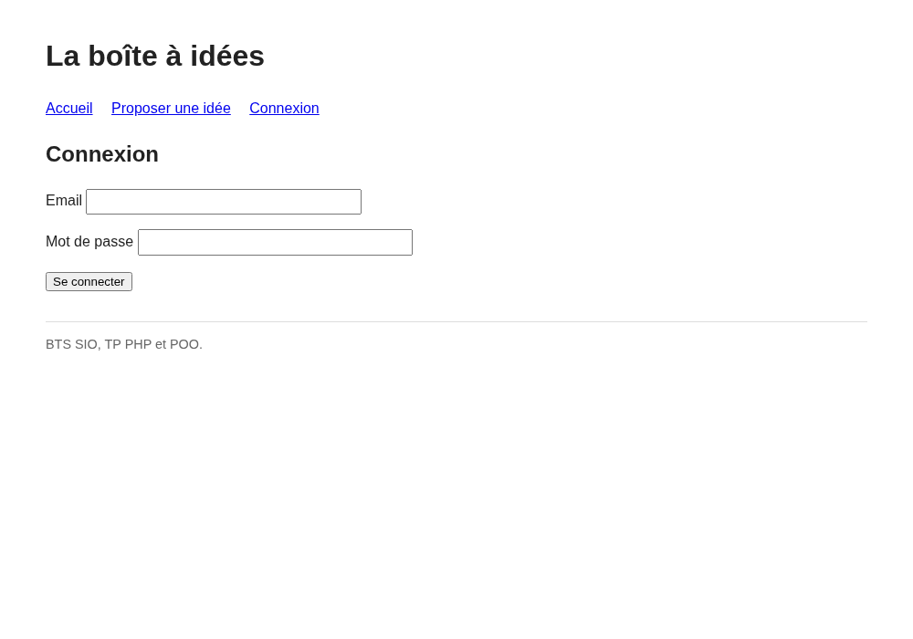
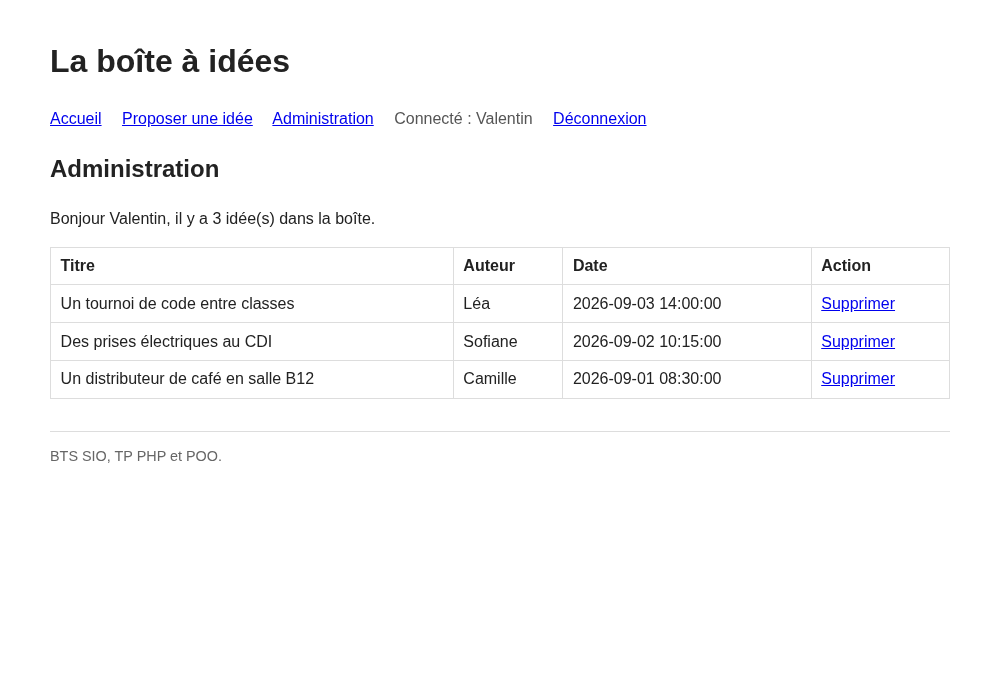

# Sécuriser la boîte à idées : home et connexion en POO

::: details Sommaire
[[toc]]
:::

Au [TP précédent](./tp1.md), vous avez transformé la boîte à idées en projet orienté objet : une classe `Database` pour la connexion, un modèle `Idea` qui porte à la fois les données d'une idée et tout le SQL, et un autoloader qui charge tout ça sans un seul `require`.

Aujourd'hui, nous ajoutons la partie qui manque à toute application sérieuse : **qui a le droit de faire quoi**. N'importe qui peut proposer une idée, mais seul l'administrateur pourra voir l'espace d'administration et supprimer une idée.

Vous connaissez déjà la logique : c'est exactement celle du [TP 5 sur la protection des pages](../tp5.md) (une home publique, une page de connexion, une whitelist qui change selon l'état de connexion). La différence, c'est qu'aujourd'hui tout ce mécanisme va vivre dans une classe : `Auth`.

Dans ce TP, je vous invite à avoir en parallèle :

- [Le complément de cours POO](./support.md)
- [Le TP sur l'authentification](../sql/tp-authentification.md) (le hachage des mots de passe, c'est là)
- [Le complément sécurité](../securite/support.md)
- [L'aide mémoire PHP](/cheatsheets/php/)

## Les slides

Avant de commencer, un tour rapide des compétences du jour : le flux de connexion, la classe `Auth` et la whitelist conditionnelle.

<ClientOnly>
<SlidesDeck src="php_poo_tp2" />
</ClientOnly>

## Prérequis

Pour suivre ce TP, il vous faut :

- **XAMPP ou WAMP** démarré (Apache + MySQL/MariaDB) et **phpMyAdmin** accessible.
- Le **projet `boite-a-idees` du [TP 1](./tp1.md)**, en état de marche.

::: details Rattrapage : votre projet du TP 1 est incomplet ?
Pas de panique, mais il n'y a pas d'archive toute faite : la suite du TP s'appuie sur **votre** code. Reprenez [le TP 1](./tp1.md) et vérifiez que vous avez bien tout ça avant d'aller plus loin :

```
boite-a-idees/
├── index.php               (session_start, spl_autoload_register, whitelist, entry-point)
├── classes/
│   ├── Database.php        (méthode statique getPdo())
│   └── Idea.php            (le modèle : les données, puis all(), find(), count(), save())
├── common/
│   ├── header.php
│   └── footer.php
├── pages/
│   ├── home.php
│   ├── proposer.php
│   └── idee.php
└── public/
    └── main.css
```

Plus la base `boite_idees` avec la table `idees (id, titre, auteur, contenu, date_creation)`.

Si `Idea::delete()` (le bonus du TP 1) vous manque, ce n'est pas grave : nous l'écrirons ensemble à l'étape 5.
:::

## Objectifs

À la fin de ce TP vous saurez :

- Stocker des utilisateurs en base avec un mot de passe **haché**, jamais en clair.
- Écrire un modèle `User` **en autonomie**, sur le modèle de `Idea`.
- Regrouper toute la logique de connexion dans une classe de service : `Auth`.
- Utiliser des **méthodes statiques** là où elles ont du sens (`Auth::check()`, `Auth::attempt()`).
- Conditionner la whitelist de votre entry-point à l'état de connexion.
- Protéger un espace d'administration et y proposer une suppression.

## Étape 1 : la table des utilisateurs

Nos utilisateurs vont vivre en base, à côté des idées. Voici le script, à exécuter dans l'onglet **SQL** de phpMyAdmin (après avoir sélectionné la base `boite_idees` à gauche) :

```sql
CREATE TABLE utilisateurs (
  id INT AUTO_INCREMENT PRIMARY KEY,
  email VARCHAR(150) NOT NULL UNIQUE,
  mot_de_passe VARCHAR(255) NOT NULL,
  nom VARCHAR(100) NOT NULL
) ENGINE=InnoDB DEFAULT CHARSET=utf8mb4 COLLATE=utf8mb4_unicode_ci;
```

Trois remarques sur cette table :

- `email` est en `UNIQUE` : deux comptes ne peuvent pas partager la même adresse, et c'est la base qui le garantit.
- `mot_de_passe` fait **255 caractères**, alors qu'un hash `bcrypt` en fait 60. C'est la taille conseillée par la documentation de PHP : le jour où l'algorithme par défaut changera (et il changera), votre colonne sera déjà assez grande.
- La colonne s'appelle `mot_de_passe`, mais elle ne contiendra **jamais** de mot de passe. Elle contient une empreinte.

### Créer votre compte administrateur

Il nous faut maintenant une ligne dans cette table. Et là, attention :

::: danger Jamais de mot de passe en clair
On ne stocke **jamais** un mot de passe en clair dans une base de données. Jamais. Pas « en attendant », pas « juste pour tester ». On stocke une **empreinte** (un hash) calculée par `password_hash()`, qui est impossible à inverser.

Pourquoi ? Parce que le jour où votre base fuite (et ça arrive tous les jours à des entreprises bien plus grosses que nous), les mots de passe de vos utilisateurs sont dans la nature. Et comme beaucoup de gens réutilisent le même mot de passe partout, vous ne leur faites pas perdre un compte sur votre site : vous leur faites perdre leur boîte mail.

Toute la théorie est dans [le TP sur l'authentification](../sql/tp-authentification.md) et dans [le complément sécurité](../securite/support.md#les-mots-de-passe-haches).
:::

Pour obtenir le hash de votre mot de passe, créez un petit script **jetable** à la racine de votre projet :

```php
<?php
// hash.php : à exécuter une fois, puis à SUPPRIMER
echo password_hash("motdepasse", PASSWORD_DEFAULT);
```

Ouvrez `http://localhost/boite-a-idees/hash.php`, copiez la chaîne affichée (elle commence par `$2y$`), puis **supprimez le fichier**. Insérez ensuite votre compte, toujours dans l'onglet SQL :

```sql
INSERT INTO utilisateurs (email, mot_de_passe, nom) VALUES
('admin@exemple.com', 'COLLEZ-ICI-VOTRE-HASH', 'Valentin');
```

::: tip Point de contrôle
Dans phpMyAdmin, la table `utilisateurs` contient une ligne, et la colonne `mot_de_passe` affiche quelque chose comme `$2y$10$JwcxeB9JYpPA1sVJvO67E.bY6tCTus…`.

Relancez `hash.php` (avant de le supprimer) plusieurs fois avec le **même** mot de passe : vous obtenez un hash **différent** à chaque fois. Surpris ? C'est le sel (« salt ») qui est tiré au hasard et rangé dans le hash lui-même. Deux utilisateurs avec le même mot de passe auront deux empreintes différentes, et une table arc-en-ciel ne sert plus à rien. L'explication complète est dans [le TP sur l'authentification](../sql/tp-authentification.md).
:::

## Étape 2 : le modèle User

Vous avez écrit `Idea` au TP 1. Ici, c'est exactement la même logique, appliquée à une autre table : une classe `User`, avec les données d'une ligne **et** la méthode qui va la chercher en base. Je vous donne les squelettes, à vous de remplir les trous.

### Les données

Un modèle représente **une ligne** de la table. Quatre propriétés, typées, avec la [promotion de constructeur](./support.md#le-constructeur) :

```php
<?php

class User
{
    public function __construct(
        public ?int $id,
        public string $email,
        public string $passwordHash,
        public string $name
    ) {
    }
}
```

::: tip Pourquoi `passwordHash` et pas `password` ?
Le nom d'une propriété, ça se lit. `password`, ça laisse croire qu'on manipule un mot de passe. `passwordHash`, ça dit clairement qu'on manipule une empreinte, et donc qu'on ne pourra jamais la comparer avec un `==`. Nommer correctement, c'est déjà documenter.

Au passage : les propriétés sont en **anglais** (`passwordHash`), les colonnes SQL en **français** (`mot_de_passe`). C'est la convention du projet, et c'est le modèle qui fait la traduction entre les deux.
:::

### L'accès à la base

Reste la méthode qui parle à la base et qui **fabrique** un objet `User`. Pour l'instant, une seule nous suffit. Ajoutez-la dans `classes/User.php`, à la suite du constructeur :

```php
    // Retrouve un utilisateur à partir de son email, ou null s'il n'existe pas.
    public static function findByEmail(string $email): ?User
    {
        // 1. Préparer un SELECT sur la table utilisateurs, filtré sur l'email
        // 2. Exécuter la requête avec l'email reçu en paramètre
        // 3. Récupérer la ligne avec fetch(PDO::FETCH_ASSOC)

        // 4. Si fetch() n'a rien renvoyé : aucun utilisateur, on renvoie null

        // 5. Sinon : construire et renvoyer un objet User à partir de la ligne
    }
```

Elle est `static`, comme `Idea::find()` : au moment où on l'appelle, on n'a pas encore d'utilisateur sous la main, c'est justement ce qu'on lui demande de fabriquer. On l'appellera donc avec `User::findByEmail(...)`.

::: danger Requête préparée obligatoire
L'email vient d'un formulaire, donc de l'utilisateur, donc d'un attaquant potentiel. Il ne doit **jamais** être concaténé dans la requête SQL. Requête préparée, paramètre, point final. Si le mot « injection SQL » ne vous dit plus rien, un petit tour par [le complément sécurité](../securite/support.md#les-requetes-preparees) s'impose.
:::

::: details Besoin d'aide pour le type de retour `?User` ?
Le `?` devant un type veut dire « ce type **ou** `null` ». `findByEmail()` renvoie donc soit un objet `User`, soit `null` quand l'email n'existe pas.

C'est exactement ce que fait déjà votre `Idea::find(int $id): ?Idea`. Ouvrez-le, la structure est la même, seuls la requête et la classe construite changent.
:::

::: tip Point de contrôle
Créez temporairement une page de test (ou ajoutez ces deux lignes en haut de `pages/home.php`) :

```php
var_dump(User::findByEmail('admin@exemple.com'));
var_dump(User::findByEmail('personne@exemple.com'));
```

Vous devez obtenir :

- un `object(User)#…` avec vos quatre propriétés remplies (et un `passwordHash` qui commence par `$2y$`) ;
- puis un `NULL`.

Si les deux renvoient `NULL`, votre requête ou votre base ne sont pas d'accord. Pensez à retirer ce `var_dump()` ensuite.
:::

## Étape 3 : la classe Auth

Nous avons de quoi retrouver un utilisateur. Il faut maintenant vérifier son mot de passe et se souvenir qu'il est connecté.

:::: tip Pourquoi une classe `Auth` plutôt que ce code dans la page connexion ?
Posez-vous la question avant de lire la réponse. Qu'est-ce qui vous gênerait si toute la vérification vivait dans `pages/connexion.php` ?

::: details La réponse
Deux raisons, et ce sont les deux raisons qui justifient à peu près toute la POO :

1. **La réutilisation.** « Est-ce que l'utilisateur est connecté ? », vous allez vous le demander dans `index.php`, dans `header.php`, dans `admin.php`. Si le test est écrit dans la page de connexion, vous allez le recopier trois fois. Et le jour où vous changez la clé de session, vous oubliez forcément l'un des trois.
2. **La responsabilité unique.** Le rôle d'une page, c'est d'afficher. Le rôle de `Auth`, c'est de savoir qui est connecté. Chaque chose à sa place, et quand quelque chose casse, vous savez où regarder.

Bonus : si demain vous ajoutez un « se souvenir de moi » ou une connexion via Google, vous modifiez `Auth` et **rien d'autre**.
:::
::::

### Le squelette

Créez `classes/Auth.php`. Je vous donne les signatures, le corps de `attempt()` est à vous :

```php
<?php

class Auth
{
    public static function attempt(string $email, string $password): bool
    {
        // À vous !
    }

    public static function check(): bool
    {
        return isset($_SESSION['user_id']);
    }

    public static function name(): ?string
    {
        return $_SESSION['user_name'] ?? null;
    }

    public static function logout(): void
    {
        unset($_SESSION['user_id'], $_SESSION['user_name']);
        session_destroy();
    }
}
```

::: tip Pourquoi des méthodes `static` ici ?
Une [méthode statique](./support.md#les-methodes) s'appelle sur la **classe**, pas sur un objet : `Auth::check()` et non `$auth->check()`.

C'est le bon choix ici parce que `Auth` ne représente rien de concret : ce n'est pas « un » quelque chose, c'est une boîte à outils. Il n'y a aucune donnée à lui donner à la construction, et il n'y a qu'une session par visiteur. Exactement le même raisonnement que pour `Database::getPdo()` au TP 1.

Même raisonnement pour `User::findByEmail()` : elle sert à **obtenir** un utilisateur, elle ne peut donc pas en supposer un. En revanche, le jour où vous ajouterez un `save()` à `User`, il ne sera pas statique : il enregistrera **cet** utilisateur-là.
:::

::: details Pourquoi `Auth::name()` et pas `Auth::user()` qui renverrait un objet `User` ?
Bonne question, et les deux se défendent.

Renvoyer un objet `User` complet obligerait à **relire la base à chaque page** (on ne stocke pas un objet entier en session, on stocke son id). Or, pour l'instant, la seule chose que nous affichons, c'est le nom. Une requête SQL sur toutes les pages pour afficher un prénom, c'est cher payé.

Nous stockons donc deux choses en session : `user_id` (l'identité, dont nous aurons besoin plus tard) et `user_name` (l'affichage). Et `Auth::name()` se contente de lire la session.

À retenir pour la suite : les frameworks proposent bien un `Auth::user()` qui renvoie l'objet complet, parce qu'ils savent mettre le résultat en cache pour la durée de la requête. Nous y viendrons.
:::

### L'algorithme de attempt()

En « algo », ce que doit faire `attempt()` :

```
SI utilisateur = CHERCHER_PAR_EMAIL(email) EST NULL ALORS
    RENVOYER faux
FIN SI

SI password_verify(mot_de_passe_saisi, utilisateur.hash) EST FAUX ALORS
    RENVOYER faux
FIN SI

REGENERER_ID_DE_SESSION
SESSION[user_id] = utilisateur.id
SESSION[user_name] = utilisateur.nom
RENVOYER vrai
```

::: tip Que se passe-t-il derrière ?
**`password_verify($saisi, $hash)`** : on ne compare **jamais** deux hashs avec `==`. Pourquoi ? Parce que re-hacher le mot de passe saisi donnerait une empreinte différente (le sel est tiré au hasard, souvenez-vous de l'étape 1). `password_verify()` fait le travail correctement : il relit le sel et l'algorithme **à l'intérieur** du hash stocké, recalcule l'empreinte du mot de passe saisi avec ce sel-là, et compare le résultat en temps constant (pour ne pas donner d'indice à un attaquant qui chronomètre les réponses).

**`session_regenerate_id(true)`** : au moment où l'utilisateur change de statut (anonyme, puis connecté), on lui donne un **nouvel identifiant de session** et on détruit l'ancien (c'est le rôle du `true`). Ça bloque une attaque qui s'appelle la « fixation de session » : un attaquant qui aurait réussi à imposer un identifiant de session à sa victime avant sa connexion se retrouve avec un identifiant périmé juste après. Une ligne, une classe d'attaque en moins.
:::

::: details Voir l'une des solutions possibles

```php
public static function attempt(string $email, string $password): bool
{
    $user = User::findByEmail($email);

    if ($user === null) {
        return false;
    }

    if (!password_verify($password, $user->passwordHash)) {
        return false;
    }

    session_regenerate_id(true);
    $_SESSION['user_id'] = $user->id;
    $_SESSION['user_name'] = $user->name;

    return true;
}
```

Remarquez l'ordre : on sort **tôt** (`return false`) dès qu'une condition n'est pas remplie, plutôt que d'empiler des `if` imbriqués. Le code se lit mieux, et le chemin « tout va bien » reste en bas, sans indentation.
:::

## Étape 4 : la page de connexion et la whitelist

Vous avez le moteur, il manque le tableau de bord.

### La page connexion

Créez `pages/connexion.php`. Elle doit :

- afficher un formulaire en **POST** (email + mot de passe) qui poste vers `index.php?page=connexion` ;
- si le formulaire a été soumis, appeler `Auth::attempt()` ;
- en cas de succès, rediriger vers `index.php?page=admin` ;
- en cas d'échec, réafficher le formulaire avec un message d'erreur.



::: danger Un message d'erreur, un seul
Le message doit être **générique** : « Identifiants incorrects. »

Surtout pas « Cet email n'existe pas » d'un côté et « Mot de passe incorrect » de l'autre. Sinon vous offrez à un attaquant un moyen de savoir **quels comptes existent** sur votre site, ce qui est la moitié du travail. Même message, même comportement, quelle que soit la raison de l'échec.
:::

::: details Besoin d'aide pour la structure de la page ?
La structure est celle d'un traitement de formulaire classique, vue au [TP 4](../tp4.md) :

```php
<?php
$error = null;

if ($_SERVER['REQUEST_METHOD'] === 'POST') {
    // Récupérer $_POST['email'] et $_POST['password'] (avec ?? '' au cas où)
    // Si Auth::attempt(...) renvoie true : header('location: …'); die();
    // Sinon : $error = "Identifiants incorrects.";
}
?>
<h2>Connexion</h2>
<!-- Si $error n'est pas null, l'afficher -->
<!-- Le formulaire method="post" action="index.php?page=connexion" -->
```

Et n'oubliez pas le `die()` après le `header('location: …')` : `header()` n'arrête **pas** le script, il se contente d'ajouter une entête. Sans le `die()`, la suite de la page s'exécute quand même.
:::

### Rendre la redirection possible

Rappel du TP 1 : votre `index.php` commence par `ob_start()`. Sans cette ligne, `header('location: …')` et `session_regenerate_id()` (qui envoient des entêtes HTTP) échoueraient puisque `header.php` est affiché avant la page. Vérifiez qu'elle est bien là avant de continuer.

### La whitelist conditionnelle

C'est la partie que vous avez déjà faite au [TP 5](../tp5.md#autoriser-l-acces-a-la-page-de-generation-ou-pas), en procédural. Le principe ne change pas d'un pouce, seule la manière de poser la question change : au lieu d'un `isset($_SESSION[...])` écrit à la main, vous appelez `Auth::check()`.

En algo :

```
SI Auth::check() ALORS
    $whitelist = ['home', 'proposer', 'idee', 'admin', 'deconnexion']
SINON
    $whitelist = ['home', 'proposer', 'idee', 'connexion']
FIN SI
```

Je vous laisse l'écrire dans `index.php`, à la place de votre whitelist actuelle.

::: tip Prenez le temps de regarder ce tableau
- Pourquoi `connexion` **disparait** de la liste quand on est connecté ?
- Pourquoi `admin` et `deconnexion` ne sont-ils **pas** dans la liste des visiteurs anonymes ?
- Et `home`, `proposer`, `idee` : pourquoi sont-ils dans les deux ?
:::

### Le header

Adaptez `common/header.php` pour que la navigation s'adapte :

- si `Auth::check()` : un lien vers l'administration, le texte « Connecté : Nom » et un lien « Déconnexion » ;
- sinon : un lien « Connexion ».

::: details Besoin d'aide pour écrire du HTML conditionnel proprement ?
Dans un fichier majoritairement HTML, la syntaxe alternative est bien plus lisible que des accolades :

```php
<?php if (Auth::check()) : ?>
    <a href="index.php?page=admin">Administration</a>
    <span>Connecté : <?= htmlspecialchars(Auth::name()) ?></span>
    <a href="index.php?page=deconnexion">Déconnexion</a>
<?php else : ?>
    <a href="index.php?page=connexion">Connexion</a>
<?php endif; ?>
```

Et `<?= ?>` est simplement un raccourci pour `<?php echo ?>`.
:::

### La déconnexion

Créez `pages/deconnexion.php`. Deux lignes utiles : appeler `Auth::logout()`, puis rediriger vers la home. Vous savez faire.

::: tip Point de contrôle
- `index.php?page=connexion` affiche le formulaire.
- Un mauvais mot de passe réaffiche le formulaire avec « Identifiants incorrects. ».
- Le bon couple email / mot de passe vous emmène ailleurs, et le header affiche « Connecté : … ».
- « Déconnexion » vous ramène à la home, avec le lien « Connexion » de retour.
:::

## Étape 5 : l'espace d'administration

Cette fois, pas de squelette : **vous avez tout ce qu'il faut**. Voici le cahier des charges, à vous de jouer.

La page `pages/admin.php` doit :

1. Afficher la liste complète des idées dans un tableau HTML (titre, auteur, date).
2. Afficher un petit résumé du type « Bonjour Nom, il y a N idée(s) dans la boîte » (vous avez déjà `count()` et `Auth::name()`).
3. Proposer sur chaque ligne un lien « Supprimer » qui supprime l'idée, puis revient sur la page d'administration.



Si vous n'avez pas fait le bonus `delete()` du TP 1, ajoutez-le à `Idea` : c'est un `DELETE FROM idees WHERE id = ?` en requête préparée sur `$this->id`, la méthode n'a pas de paramètre et ne renvoie rien (`public function delete(): void`).

::: details Besoin d'aide pour le lien « Supprimer » ?
Un lien, c'est une requête **GET**. Il suffit donc de passer l'id à supprimer en paramètre, en plus de la page :

```php
<a href="index.php?page=admin&delete=<?= $idea->id ?>">Supprimer</a>
```

Et tout en haut de `admin.php`, avant l'affichage :

```php
if (isset($_GET['delete'])) {
    // Retrouver l'idée avec Idea::find((int) $_GET['delete'])
    // Si elle existe, lui demander de se supprimer : $idea->delete()
    // Puis rediriger vers index.php?page=admin et die()
}
```

Pourquoi rediriger après la suppression plutôt que d'afficher directement la liste ? Pour que l'URL affichée dans le navigateur ne contienne plus `&delete=…`. Sinon, un simple F5 relance la suppression. C'est le motif « Post / Redirect / Get », et il vaut aussi pour les liens.

Le `(int)` devant `$_GET['delete']`, lui, n'est pas décoratif : il garantit qu'on passe bien un entier à `delete(int $id)`, quoi que l'utilisateur ait tapé dans l'URL. Rappelez-vous la règle d'or : [on ne fait jamais confiance aux données reçues](../securite/support.md#ne-jamais-faire-confiance-aux-donnees-recues).
:::

:::: tip Que se passe-t-il si je tape `index.php?page=admin` sans être connecté ?
Réfléchissez avant de tester : où se joue l'autorisation, dans votre projet ?

::: details La réponse
Dans la whitelist, et nulle part ailleurs. Si vous n'êtes pas connecté, `admin` n'est pas dans la liste des pages autorisées : `in_array()` renvoie `false`, et votre `index.php` affiche la home. La page `pages/admin.php` n'est même **pas chargée**. C'est bien plus solide qu'un test écrit dans la page, parce qu'on ne peut pas l'oublier : toutes les pages passent par l'entry-point.

Un point de vigilance tout de même : l'accès direct à `pages/admin.php` dans l'URL, lui, contourne l'entry-point. Sur un vrai serveur, on empêche ça en plaçant `pages/` hors de la racine web (c'est ce que font tous les frameworks, dont seul le dossier `public/` est exposé). Pour ce TP, on s'en tient à la règle : on passe **toujours** par `index.php?page=…`.
:::
::::

::: tip Point de contrôle
Faites le test pour de vrai, dans une **fenêtre de navigation privée** (pas de session) :

1. `index.php?page=admin` : vous devez voir la page d'accueil publique, pas l'administration.
2. Connectez-vous dans la fenêtre normale, puis `index.php?page=admin` : le tableau s'affiche.
3. Supprimez une idée : elle disparait du tableau **et** de la page d'accueil.
4. Déconnectez-vous, retentez `index.php?page=admin` : retour à la home.
:::

## Pour aller plus loin

Vous avez terminé et il vous reste du temps ? Voici trois évolutions, de la plus simple à la plus intéressante.

### Limiter les tentatives

Un attaquant qui teste 10 000 mots de passe à la seconde finira par trouver. Comptez les échecs dans la session (par exemple `$_SESSION['login_attempts']`) et, au-delà de 5, refusez la connexion avec un message du type « Trop de tentatives ». Remettez le compteur à zéro après une connexion réussie.

::: tip Une protection, pas LA protection
Ce compteur vit en session, donc dans le navigateur de l'attaquant : il lui suffit de supprimer son cookie pour repartir à zéro. C'est une vraie protection contre un humain qui tâtonne, pas contre un script. Les vraies défenses (compteur en base par compte et par IP, délai croissant, captcha) sont détaillées dans [le TP sur l'authentification](../sql/tp-authentification.md).
:::

### Échapper systématiquement

Relisez toutes vos pages : chaque valeur qui vient de la base ou d'un formulaire et qui est affichée doit passer par `htmlspecialchars()`. Proposez une idée intitulée `<script>alert('coucou')</script>` et vérifiez qu'elle s'affiche comme du texte, et ne s'exécute pas.

### La page d'inscription

Ajoutez une page `inscription` (publique, donc dans la whitelist des anonymes) avec un formulaire nom / email / mot de passe. Ajoutez une méthode `save(): void` à `User` (non statique, comme celle de `Idea`), et n'oubliez pas : c'est au moment de l'insertion qu'on appelle `password_hash()`. Pensez aussi au cas de l'email déjà pris (votre contrainte `UNIQUE` va lever une exception, à vous de l'attraper et d'afficher un message propre).

## Conclusion

Beau travail ! Faisons le point sur ce que vous venez de construire :

- Une table `utilisateurs` avec des mots de passe **hachés**, jamais en clair.
- Un modèle `User`, écrit presque sans aide : la POO commence à devenir une routine.
- Une classe de service `Auth`, qui regroupe en un seul endroit tout ce que votre application sait de la connexion.
- Une whitelist conditionnelle : l'autorisation est décidée à l'entrée du site, pas au fond d'une page.
- Un espace d'administration protégé, avec une suppression qui fonctionne.

Et surtout, le réflexe qui compte : quand un même bout de logique commence à être recopié à plusieurs endroits, c'est qu'il demande une classe.

### La suite

Vous avez maintenant deux modèles (`Idea`, `User`), une classe utilitaire (`Database`), une classe de service (`Auth`) et des pages qui ne font plus que de l'affichage et du traitement. C'est, à peu de chose près, le découpage **MVC**, dont le principe est résumé dans [le support](./support.md#vers-le-mvc).

La suite du parcours, c'est [le TP 6](../tp6.md) et [le MVC](/tp/php/mvc/tp1.md).

👋 Si vous avez des questions, n'hésitez pas. C'est à vous de jouer !
