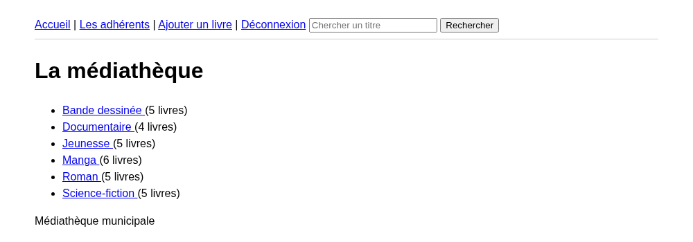
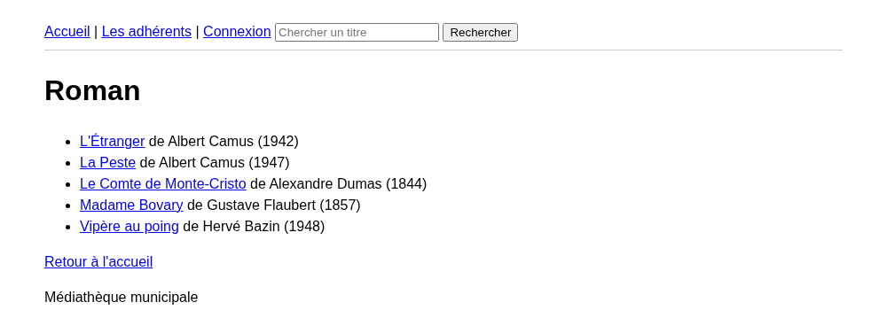
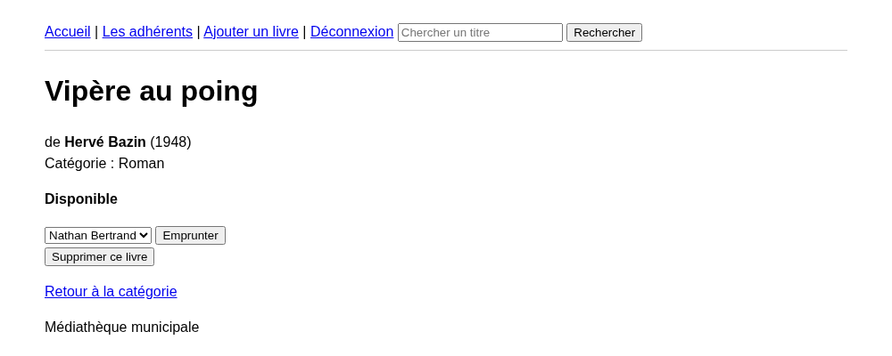
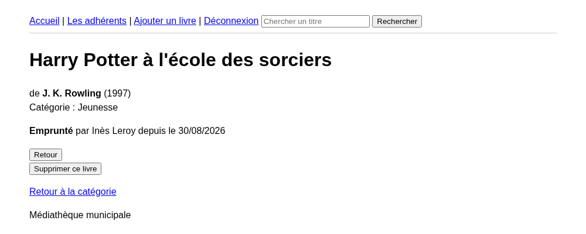
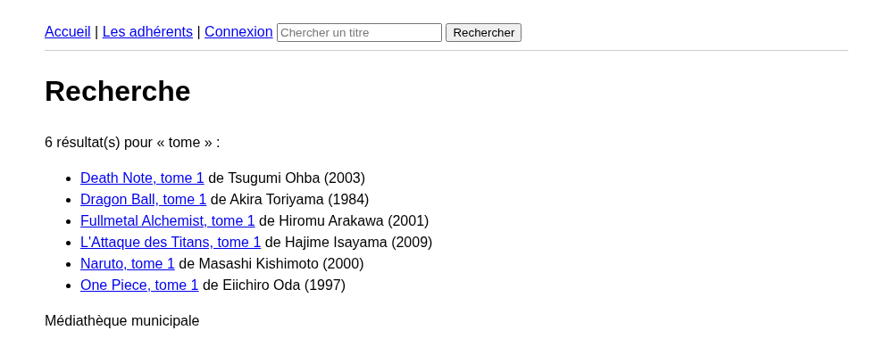
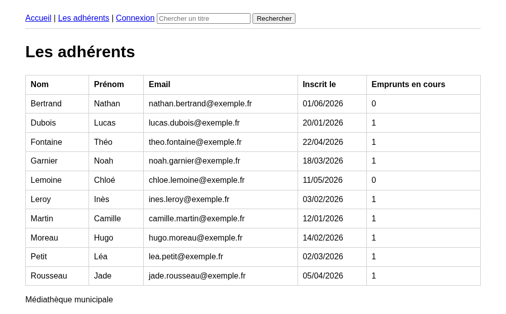

# TP Création : La médiathèque

::: details Sommaire
[[toc]]
:::

Jusqu'ici, les bases de vos projets étaient petites et vous les connaissiez par cœur : une table `phrases` pour Bart, des tâches et des catégories pour la TODO List, puis les vidéos et la clé étrangère du [TP 6 SQL](./tp6.md).

Dans la vraie vie, c'est assez rare. Le plus souvent vous arrivez sur un projet qui existe déjà, avec une base qui contient parfois des milliers de lignes, et **personne pour vous expliquer le schéma**. Votre premier travail consiste alors à lire la base, comprendre les relations, et écrire vos premières requêtes.

C'est exactement ce que nous allons faire aujourd'hui. Je vous fournis la base d'une petite médiathèque (des livres, des catégories, des adhérents et des emprunts) et vous allez construire le site PHP qui permet de la consulter et de la gérer.

::: tip Comment se déroule ce TP
Ce **n'est pas** un point étape noté sur 20. C'est un **TP de création** :

- **En séance (2 heures)** : les slides, puis la **partie 1**. En fin de séance, vous devez avoir une navigation qui fonctionne et une recherche.
- **À la maison** : la **partie 2** (les manipulations : emprunt, retour, ajout, suppression) et la **partie 3** (la protection des pages).
- **Le rendu** est ensuite évalué avec une **grille de validation** : « validé » ou « à revoir » (avec redépôt possible).

Pas de panique : tout ce dont vous avez besoin a déjà été vu en cours, et les aides sont là.
:::

Dans ce TP, je vous invite à avoir en parallèle :

- [Le complément de cours SQL](./support.md)
- [L'aide mémoire PHP](/cheatsheets/php/), et en particulier [le PHP et la base de données](/cheatsheets/php/#le-php-et-la-base-de-donnees)

## Les slides

Avant de commencer, un tour rapide des compétences du jour : lire un schéma dont on hérite, la jointure, le `GROUP BY` et les manipulations de données.

<ClientOnly>
<SlidesDeck src="sql_creation_mediatheque" />
</ClientOnly>

## Prérequis

Pour travailler confortablement, il vous faut :

- **XAMPP ou WAMP** démarré (Apache + MySQL/MariaDB).
- **phpMyAdmin** accessible (en général [http://localhost/phpmyadmin](http://localhost/phpmyadmin)).
- La **structure de projet du [TP 6 SQL](./tp6.md)** : un entry-point `index.php` avec sa whitelist, un dossier `pages/`, un dossier `common/` et le fichier `utils/db.php`. Pensez à la ligne `ob_start();` en tête d'`index.php` (vue au [TP Authentification](./tp-authentification.md)) : vos pages feront des redirections après l'affichage du header, cette ligne les rend possibles partout.

::: details Rattrapage : le contenu minimal de `utils/db.php`
Vous ne retrouvez plus votre fichier ? Le voici, il n'y a que la première partie à adapter (c'est celui du [support SQL](./support.md#utils-db-php), avec deux options en plus que je vous explique juste après) :

```php
<?php
// Cette partie est à customiser
$server = "localhost";
$db = "mediatheque";
$user = "root";
$passwd = "";
// Fin de la partie customisable

$dsn = "mysql:host=$server;dbname=$db;charset=utf8mb4";
$pdo = new PDO($dsn, $user, $passwd);
$pdo->setAttribute(PDO::ATTR_ERRMODE, PDO::ERRMODE_EXCEPTION);
```

- `charset=utf8mb4` : sans lui, les accents de vos livres s'affichent en « é ». 😬
- `ERRMODE_EXCEPTION` : en cas d'erreur SQL, PHP vous affiche un vrai message plutôt que de continuer en silence. Croyez-moi, ça change la vie quand une requête ne fonctionne pas.

:::

::: details Une petite CSS pour y voir clair

C'est totalement **facultatif**, le TP fonctionne très bien sans. Mais si les tableaux bruts vous piquent les yeux, créez un fichier `public/main.css` avec ceci et ajoutez `<link rel="stylesheet" href="public/main.css">` dans votre `common/header.php`. C'est le strict minimum, et c'est ce qui est utilisé pour les copies d'écran de ce TP :

```css
body {
    font-family: system-ui, sans-serif;
    max-width: 900px;
    margin: 0 auto;
    padding: 1rem;
    line-height: 1.5;
}

table {
    border-collapse: collapse;
    width: 100%;
    margin-bottom: 1rem;
}

th,
td {
    border: 1px solid #ccc;
    padding: 0.4rem 0.6rem;
    text-align: left;
}

header {
    padding-bottom: 0.5rem;
    border-bottom: 1px solid #ccc;
}
```

:::

## Objectifs

À la fin de ce TP vous saurez :

- Lire un schéma de base de données **existant** et retrouver les relations entre les tables.
- Écrire des requêtes de lecture : `SELECT`, jointures, `GROUP BY`, `COUNT`, `LIKE`.
- Écrire des requêtes de manipulation : `INSERT`, `UPDATE`, `DELETE`.
- Utiliser systématiquement des **requêtes préparées** dès qu'une valeur vient de l'utilisateur.
- Traduire une question métier (« ce livre est-il disponible ? ») en une requête SQL.
- Réutiliser la structure entry-point + `utils/db.php` sur un nouveau projet.

::: tip On se concentre sur le SQL
Le visuel n'est pas l'objectif de ce TP. Un tableau HTML propre et lisible suffit largement. Ce que je regarde, c'est vos requêtes et votre logique.
:::

## La base fournie

### Télécharger et importer

Première étape, récupérer le script de la base :

<a href="/tp/php/mediatheque.sql" download="mediatheque.sql">Télécharger le script de la base</a>

Ensuite, dans phpMyAdmin :

1. Cliquez sur l'onglet **Importer** (en haut).
2. **Choisissez le fichier** `mediatheque.sql`.
3. Cliquez sur **Exécuter** (tout en bas de la page).

Le script crée lui-même la base `mediatheque` : vous n'avez pas besoin de la créer avant. Après l'import, vous devez voir apparaitre à gauche une base `mediatheque` contenant **4 tables**.

::: warning Le script efface et recrée les tables
Si vous relancez l'import, les tables sont supprimées puis recréées : vos éventuelles données ajoutées sont perdues. C'est pratique pour repartir de zéro, mais ne le faites pas au milieu de vos tests.
:::

### Le schéma

::: details Le schéma de la base

```sql
CREATE TABLE categories (
  id INT AUTO_INCREMENT PRIMARY KEY,
  nom VARCHAR(100) NOT NULL
) ENGINE=InnoDB DEFAULT CHARSET=utf8mb4 COLLATE=utf8mb4_unicode_ci;

CREATE TABLE livres (
  id INT AUTO_INCREMENT PRIMARY KEY,
  titre VARCHAR(255) NOT NULL,
  auteur VARCHAR(255) NOT NULL,
  annee INT NOT NULL,
  categorie_id INT NOT NULL,
  FOREIGN KEY (categorie_id) REFERENCES categories(id)
) ENGINE=InnoDB DEFAULT CHARSET=utf8mb4 COLLATE=utf8mb4_unicode_ci;

CREATE TABLE adherents (
  id INT AUTO_INCREMENT PRIMARY KEY,
  nom VARCHAR(100) NOT NULL,
  prenom VARCHAR(100) NOT NULL,
  email VARCHAR(255) NOT NULL,
  date_inscription DATE NOT NULL
) ENGINE=InnoDB DEFAULT CHARSET=utf8mb4 COLLATE=utf8mb4_unicode_ci;

CREATE TABLE emprunts (
  id INT AUTO_INCREMENT PRIMARY KEY,
  livre_id INT NOT NULL,
  adherent_id INT NOT NULL,
  date_emprunt DATE NOT NULL,
  date_retour DATE DEFAULT NULL,
  FOREIGN KEY (livre_id) REFERENCES livres(id),
  FOREIGN KEY (adherent_id) REFERENCES adherents(id)
) ENGINE=InnoDB DEFAULT CHARSET=utf8mb4 COLLATE=utf8mb4_unicode_ci;
```

:::

### Les relations, en une image

Les clés étrangères racontent toute l'histoire de la base. Lisez-les et vous obtenez ceci :

```text
categories   1 ────< n   livres      (une catégorie contient plusieurs livres)
livres       1 ────< n   emprunts    (un livre peut être emprunté plusieurs fois)
adherents    1 ────< n   emprunts    (un adhérent peut emprunter plusieurs livres)
```

Autrement dit :

- Un **livre** appartient à **une** catégorie, et une catégorie contient **plusieurs** livres.
- Un **emprunt** relie **un** livre et **un** adhérent, à une date donnée.
- Un livre peut avoir été emprunté **plusieurs fois** (à des dates différentes) : chaque ligne de `emprunts` est un emprunt.
- La colonne `date_retour` vaut `NULL` tant que le livre **n'est pas revenu**.

::: tip Le NULL raconte quelque chose
Retenez bien ce dernier point, c'est la clé de tout le TP : `date_retour IS NULL`, c'est un emprunt **en cours**.
:::

## Partie 1 : découvrir et consulter (en séance)

Cette partie est guidée. Suivez-la dans l'ordre, elle construit le socle du projet.

### Étape 1 : explorer la base dans phpMyAdmin

Avant d'écrire une ligne de PHP, on regarde ce qu'on a sous la main. Ouvrez phpMyAdmin, sélectionnez la base `mediatheque`, puis l'onglet **SQL**, et répondez aux questions suivantes **par une requête**.

Besoin d'un rappel sur la forme d'un `SELECT` ? Tout est [dans le support](./support.md#obtenir-des-donnees).

1. Combien y a-t-il de livres dans la médiathèque ?
2. Quels sont les livres de la catégorie **Manga** (leur titre et leur auteur) ?
3. Quels emprunts n'ont pas de date de retour ?
4. Quel adhérent s'est inscrit en premier ?

::: details Voir l'une des solutions possibles

```sql
-- 1. Le nombre de livres
SELECT COUNT(*) FROM livres;

-- 2. Les mangas (la catégorie « Manga » porte l'id 6, mais passer par le nom est plus robuste)
SELECT livres.titre, livres.auteur
FROM livres
LEFT JOIN categories ON categories.id = livres.categorie_id
WHERE categories.nom = 'Manga';

-- 3. Les emprunts en cours
SELECT * FROM emprunts WHERE date_retour IS NULL;

-- 4. Le premier inscrit
SELECT * FROM adherents ORDER BY date_inscription ASC LIMIT 1;
```

:::

:::: tip Question de réflexion
**Comment savoir qu'un livre est disponible ?**

Prenez 2 minutes pour y réfléchir avant d'ouvrir la réponse : il n'y a pas de colonne `disponible` dans la table `livres`.

::: details La réponse
Un livre est disponible s'il **n'existe aucun emprunt en cours** pour ce livre, c'est-à-dire aucune ligne dans `emprunts` avec ce `livre_id` **et** `date_retour IS NULL`.

L'information n'est pas stockée : elle se **déduit** des données. C'est très courant, et c'est même une bonne pratique (si on stockait un booléen `disponible`, il faudrait penser à le mettre à jour partout, et tôt ou tard il serait faux).

```sql
-- Le livre 16 est-il disponible ? S'il n'y a aucun résultat : oui.
SELECT * FROM emprunts WHERE livre_id = 16 AND date_retour IS NULL;
```

:::
::::

### Étape 2 : se connecter et lister les catégories

On passe au PHP. Créez votre projet (ou repartez de celui du TP 6) avec la structure habituelle, et mettez en place `utils/db.php` avec le code du rattrapage plus haut (n'oubliez pas `dbname=mediatheque`).

La page d'accueil doit afficher la **liste des catégories avec le nombre de livres de chacune**. Voici la requête, je vous la donne :

```sql
SELECT categories.id, categories.nom, COUNT(livres.id) AS nb_livres
FROM categories
LEFT JOIN livres ON livres.categorie_id = categories.id
GROUP BY categories.id, categories.nom
ORDER BY categories.nom;
```

Et le code PHP correspondant :

```php
<?php
include('./utils/db.php');

$sql = "SELECT categories.id, categories.nom, COUNT(livres.id) AS nb_livres
        FROM categories
        LEFT JOIN livres ON livres.categorie_id = categories.id
        GROUP BY categories.id, categories.nom
        ORDER BY categories.nom";

$categories = $pdo->query($sql)->fetchAll(PDO::FETCH_ASSOC);
?>

<h1>La médiathèque</h1>
<ul>
    <?php foreach ($categories as $category) { ?>
        <li>
            <a href="index.php?page=categorie&id=<?php echo $category['id']; ?>">
                <?php echo $category['nom']; ?>
            </a>
            (<?php echo $category['nb_livres']; ?> livres)
        </li>
    <?php } ?>
</ul>
```

::: tip Que se passe-t-il derrière ?
`GROUP BY` regroupe les lignes qui ont la même catégorie, et `COUNT()` compte les lignes de chaque paquet. Le `LEFT JOIN` garantit qu'une catégorie **sans aucun livre** apparaisse quand même, avec un compteur à 0. Avec un `JOIN` classique, elle disparaitrait de la liste.

`AS nb_livres` donne un nom à la colonne calculée : sans lui, il faudrait écrire `$category['COUNT(livres.id)']`… bon courage.
:::

Voici ce que vous devez obtenir :



### Étape 3 : les livres d'une catégorie

Créez maintenant la page `categorie`, appelée via `index.php?page=categorie&id=1`. Elle doit afficher le nom de la catégorie et la liste de ses livres (titre, auteur, année), chaque titre étant un lien vers la fiche du livre (`index.php?page=livre&id=…`).

::: danger L'id vient de l'utilisateur
`$_GET['id']` est une valeur **variable**, saisie dans l'URL par n'importe qui. Elle ne doit **jamais** être concaténée dans la requête. C'est une **requête préparée**, sans exception. Un rappel complet est [dans le support](./support.md#requete-prepare-ou-requete-normal).
:::

Voici le squelette, je vous laisse le compléter :

```php
<?php
include('./utils/db.php');

// 1. Le paramètre est-il présent ?
if (!isset($_GET['id'])) {
    header('location: index.php');
    die();
}

// 2. La catégorie existe-t-elle ? (requête préparée !)
$stmt = $pdo->prepare("SELECT * FROM categories WHERE id = ?");
$stmt->execute([$_GET['id']]);
$category = $stmt->fetch(PDO::FETCH_ASSOC);

if (!$category) {
    echo "Catégorie introuvable";
    die();
}

// 3. À vous : récupérer les livres de cette catégorie (requête préparée également)
$books = /* … */;
?>

<!-- 4. À vous : afficher le nom de la catégorie et la liste de ses livres -->
```

::: details Voir l'une des solutions possibles

```php
$stmt = $pdo->prepare("SELECT * FROM livres WHERE categorie_id = ? ORDER BY titre");
$stmt->execute([$_GET['id']]);
$books = $stmt->fetchAll(PDO::FETCH_ASSOC);
```

Et pour l'affichage :

```php
<h1><?php echo $category['nom']; ?></h1>
<ul>
    <?php foreach ($books as $book) { ?>
        <li>
            <a href="index.php?page=livre&id=<?php echo $book['id']; ?>"><?php echo $book['titre']; ?></a>
            de <?php echo $book['auteur']; ?> (<?php echo $book['annee']; ?>)
        </li>
    <?php } ?>
</ul>
```

:::

Voici ce que vous devez obtenir :



### Étape 4 : la fiche d'un livre

Créez la page `livre` (`index.php?page=livre&id=…`). Elle doit afficher :

- Le titre, l'auteur, l'année et **le nom de la catégorie** (donc une jointure avec `categories`).
- L'état du livre :
  - « Disponible » s'il n'y a aucun emprunt en cours.
  - « Emprunté par Prénom Nom depuis le JJ/MM/AAAA » sinon (donc une jointure entre `emprunts` et `adherents`).
- Un lien de retour vers sa catégorie.

::: tip Question de réflexion
Faut-il **une** requête ou **deux** requêtes pour cette page ?

Les deux réponses sont acceptées, et c'est justement ça qui est intéressant : une seule grosse requête avec deux `LEFT JOIN` c'est élégant mais moins lisible ; deux requêtes séparées (« le livre » puis « l'emprunt en cours ») c'est plus long mais beaucoup plus facile à débugger. Choisissez, et soyez capable de justifier votre choix.
:::

::: details Besoin d'aide pour l'emprunt en cours ?

En deux requêtes, la seconde ressemble à ça :

```php
$stmt = $pdo->prepare("SELECT adherents.nom, adherents.prenom, emprunts.date_emprunt
                       FROM emprunts
                       LEFT JOIN adherents ON adherents.id = emprunts.adherent_id
                       WHERE emprunts.livre_id = ? AND emprunts.date_retour IS NULL");
$stmt->execute([$_GET['id']]);
$loan = $stmt->fetch(PDO::FETCH_ASSOC);

// $loan vaut false s'il n'y a pas d'emprunt en cours : le livre est donc disponible.
```

La forme générale de la jointure est [dans le support](./support.md#obtenir-de-donnees-de-plusieurs-tables).
:::

Voici ce que vous devez obtenir pour un livre disponible, puis pour un livre emprunté (les boutons de manipulation, eux, arriveront en partie 2) :





### Étape 5 : la recherche

Ajoutez un formulaire de recherche (en **GET**) qui permet de chercher un livre par son titre. Le formulaire peut être dans votre barre de navigation, les résultats s'affichent sur une page `recherche`.

Consignes :

- Le champ de saisie s'appelle `search` (ou ce que vous voulez, mais restez cohérent).
- La recherche se fait avec `LIKE` pour trouver les titres qui **contiennent** le texte saisi.
- Requête préparée, évidemment.
- Si la recherche ne donne rien, affichez un message (pas une page vide).

::: details Besoin d'aide pour le `LIKE` ?

Le piège classique : les `%` ne se mettent **pas** dans la requête, mais dans le paramètre.

```php
// Ne fonctionne pas comme vous l'espérez
$stmt = $pdo->prepare("SELECT * FROM livres WHERE titre LIKE '%?%'");

// La bonne façon, les % sont dans le paramètre
$stmt = $pdo->prepare("SELECT * FROM livres WHERE titre LIKE ?");
$stmt->execute(['%' . $_GET['search'] . '%']);
$books = $stmt->fetchAll(PDO::FETCH_ASSOC);
```

Le `%` signifie « n'importe quoi ». `'%Potter%'` trouve donc tous les titres qui contiennent « Potter », peu importe ce qu'il y a avant et après.
:::

Voici ce que vous devez obtenir en cherchant « tome » :



::: tip Point de contrôle
Fin de séance. À ce stade, vous devez pouvoir :

- Ouvrir la page d'accueil et voir les 6 catégories avec leur nombre de livres.
- Cliquer sur une catégorie et voir ses livres.
- Cliquer sur un livre et voir sa fiche, avec « Disponible » ou « Emprunté par … ».
- Chercher « Potter », « Astérix » ou « tome » et obtenir des résultats.

Si c'est bon, la suite se fait à la maison. Sinon, terminez cette partie **avant** d'attaquer la partie 2, tout le reste s'appuie dessus.

👋 Si vous avez des questions, n'hésitez pas.
:::

## Partie 2 : manipuler les données (à la maison)

À partir d'ici, je vous donne les consignes et une aide repliée par étape, mais plus de code complet. C'est à vous de jouer !

### Étape 6 : la liste des adhérents

Créez une page `adherents` qui affiche tous les adhérents (nom, prénom, email, date d'inscription) **avec le nombre d'emprunts en cours** de chacun.

:::: tip Question de réflexion
Pourquoi un `LEFT JOIN` et pas un `JOIN` ?

::: details La réponse
Parce qu'avec un `JOIN` classique, les adhérents qui n'ont **jamais rien emprunté** disparaitraient purement et simplement de la liste. Or ils existent, et une médiathèque a plutôt envie de les voir. Le `LEFT JOIN` garde toutes les lignes de la table de gauche (`adherents`) et met des `NULL` à droite quand il n'y a pas de correspondance : le `COUNT()` renvoie alors 0.

Dans la base fournie, deux adhérents n'ont aucun emprunt. Si votre liste n'en affiche que 8 sur 10, vous savez pourquoi. 😉
:::
::::

::: details Besoin d'aide pour le compteur d'emprunts en cours ?
La difficulté : il ne faut compter que les emprunts **en cours**. Si vous mettez la condition dans le `WHERE`, vous perdez les adhérents sans emprunt (le `WHERE` s'applique après la jointure et élimine les lignes à `NULL`). La condition doit donc être **dans la jointure** :

```sql
SELECT adherents.*, COUNT(emprunts.id) AS nb_emprunts
FROM adherents
LEFT JOIN emprunts ON emprunts.adherent_id = adherents.id AND emprunts.date_retour IS NULL
GROUP BY adherents.id
ORDER BY adherents.nom;
```

:::

Voici ce que vous devez obtenir :



### Étape 7 : enregistrer un emprunt

Sur la fiche d'un livre **disponible**, ajoutez un formulaire (en **POST**) permettant d'enregistrer un emprunt :

- Un `<select>` listant tous les adhérents (alimenté depuis la base, valeur = `id`, texte = prénom et nom).
- Un bouton « Emprunter ».
- Au traitement : un `INSERT` dans `emprunts` avec le `livre_id`, l'`adherent_id` et la date du jour, `date_retour` restant à `NULL`.
- Puis une redirection vers la fiche du livre (`header('location: …'); die();`).

::: danger On revérifie toujours côté serveur
Le formulaire n'est affiché que si le livre est disponible… mais rien n'empêche quelqu'un d'envoyer le POST quand même. **Avant** l'`INSERT`, revérifiez en base qu'il n'existe pas déjà un emprunt en cours pour ce livre. Une règle métier ne se protège pas en cachant un bouton.
:::

::: details Besoin d'aide pour l'`INSERT` ?
La forme générale de l'`INSERT` est [dans le support](./support.md#ajouter-des-donnees). Avec PDO et une requête préparée :

```php
$stmt = $pdo->prepare("INSERT INTO emprunts (livre_id, adherent_id, date_emprunt, date_retour)
                       VALUES (?, ?, CURDATE(), NULL)");
$stmt->execute([$bookId, $_POST['adherent_id']]);
```

`CURDATE()` est la fonction SQL qui donne la date du jour. Côté PHP, l'équivalent serait `date('Y-m-d')` : les deux marchent, choisissez.
:::

### Étape 8 : le retour d'un livre

Sur la fiche d'un livre **emprunté**, ajoutez un bouton « Retour ». Au clic, l'emprunt en cours de ce livre doit recevoir une `date_retour`, et le livre redevient donc disponible.

::: details Besoin d'aide pour l'`UPDATE` ?
La forme générale de l'`UPDATE` est [dans le support](./support.md#modifier-des-donnees). Ici, on ne met à jour **que** l'emprunt en cours :

```php
$stmt = $pdo->prepare("UPDATE emprunts SET date_retour = CURDATE()
                       WHERE livre_id = ? AND date_retour IS NULL");
$stmt->execute([$bookId]);
```

⚠️ Ne jamais oublier le `WHERE` sur un `UPDATE`. Sans lui, vous rendez d'un coup **tous** les livres de la médiathèque.
:::

### Étape 9 : ajouter un livre

Créez une page avec un formulaire d'ajout de livre : titre, auteur, année, et la catégorie dans un `<select>` alimenté depuis la table `categories`. À la validation, le livre est inséré puis vous redirigez vers sa fiche (ou vers sa catégorie).

::: details Besoin d'aide pour le `select` des catégories ?
C'est exactement la même logique que le `select` des adhérents de l'étape 7 : une requête qui récupère les catégories, une boucle qui génère les `<option>` avec l'`id` en `value`.

```php
<select name="categorie_id">
    <?php foreach ($categories as $category) { ?>
        <option value="<?php echo $category['id']; ?>"><?php echo $category['nom']; ?></option>
    <?php } ?>
</select>
```

Pensez à vérifier que les champs sont bien remplis avant d'insérer (`isset()` et champs non vides).
:::

### Étape 10 : supprimer un livre

Ajoutez la possibilité de supprimer un livre depuis sa fiche (la forme générale du `DELETE` est [dans le support](./support.md#supprimer-une-donnee)).

:::: tip Question de réflexion
Que se passe-t-il si vous essayez de supprimer un livre qui a **déjà été emprunté** ?

Testez-le pour de vrai avant de lire la réponse (le livre d'`id` 1 a été emprunté deux fois).

::: details La réponse
Vous obtenez une erreur du type `Cannot delete or update a parent row: a foreign key constraint fails`.

C'est **normal**, et c'est même une bonne nouvelle : la clé étrangère **protège** vos données. Si MySQL acceptait la suppression, vous vous retrouveriez avec des lignes dans `emprunts` pointant vers un livre qui n'existe plus. Des données incohérentes, en somme.

Vous avez trois options, et il faut en choisir une :

1. **Interdire** la suppression : si le livre a été emprunté, on affiche un message clair (« Ce livre ne peut pas être supprimé, il a un historique d'emprunts ») et on ne supprime pas. C'est souvent la bonne réponse métier : un historique, ça ne s'efface pas.
2. **Supprimer les emprunts d'abord**, puis le livre. Simple, mais vous perdez l'historique.
3. **Ne pas proposer la suppression** pour les livres empruntés, et ne l'afficher que pour ceux qui n'ont aucun emprunt (les `id` 5, 10, 12, 15, 19, 20, 21, 23, 24, 29 et 30 sont dans ce cas).

Dans tous les cas, votre page ne doit **pas** planter avec une erreur PHP brute.
:::
::::

Choisissez votre option, implémentez-la, et **justifiez votre choix dans le README**.

## Partie 3 : protéger et aller plus loin (en autonomie)

Ici, plus d'aide : juste des consignes. La première étape est **attendue** pour la validation, les bonus sont là si vous voulez pousser.

### Étape 11 : protéger les manipulations (attendue)

Consulter la médiathèque peut être ouvert à tous. **Modifier** la base, non.

Les pages d'ajout, de suppression, d'emprunt et de retour ne doivent être accessibles qu'à un utilisateur **connecté**. Vous avez déjà mis en place exactement ce mécanisme au [TP 5 PHP](../tp5.md), puis proprement au [TP Authentification](./tp-authentification.md) : session, page de connexion, page de déconnexion et vérification avant d'afficher la page.

Deux niveaux acceptés :

- **Suffisant** : des identifiants en dur dans le code (un login et un mot de passe dans une variable).
- **Pour aller plus loin** : une table `utilisateurs` que vous créez vous-même, avec le mot de passe stocké via `password_hash()` et vérifié avec `password_verify()`, exactement comme au [TP Authentification](./tp-authentification.md).

::: danger La protection se fait côté serveur
Masquer le lien « Ajouter un livre » dans le menu, ce n'est **pas** protéger la page. Il faut la vérification dans l'entry-point (ou en tête de chaque page concernée). L'astuce de la whitelist différente selon que l'on est connecté ou non, vue au TP 6, fonctionne très bien ici.
:::

### Étape 12 : les bonus

Vous avez terminé et vous voulez pousser ? Au choix :

- **La page « Retards »** : la liste des emprunts en cours depuis **plus de 21 jours**, avec le livre, l'adhérent et le nombre de jours de retard. En SQL avec `DATEDIFF(CURDATE(), date_emprunt) > 21`, ou en PHP en comparant les dates. Dans la base fournie, plusieurs emprunts en cours sont largement dépassés (et plus le temps passe, plus il y en a).
- **Le top 5 des livres les plus empruntés** : un `GROUP BY` sur `livre_id`, un `COUNT()`, un `ORDER BY … DESC` et un `LIMIT 5`.
- **La pagination de la liste des livres** : 10 livres par page, avec des liens « précédent » et « suivant ». Le `LIMIT` / `OFFSET` est expliqué [dans le support](./support.md#gerer-de-la-pagination).

## Grille de validation

Votre rendu sera relu avec cette grille. Il n'y a pas de note : chaque ligne est « validé » ou « à revoir ».

| Critère | Attendu |
| --- | --- |
| Base de données | La base `mediatheque` est importée et la connexion PDO est isolée dans `utils/db.php` (avec `utf8mb4` et `ERRMODE_EXCEPTION`). |
| Navigation | Accueil (catégories + compteur) vers liste des livres vers fiche d'un livre, sans impasse ni erreur PHP. |
| Disponibilité | La fiche affiche correctement « Disponible » ou « Emprunté par Prénom Nom depuis le … ». |
| Recherche | Le formulaire GET filtre les titres avec `LIKE` et gère le cas « aucun résultat ». |
| Requêtes préparées | **Critère bloquant.** Toute valeur venant de l'utilisateur (`$_GET`, `$_POST`) passe par un paramètre de requête préparée. |
| Adhérents | La liste affiche tous les adhérents, y compris ceux sans emprunt, avec leur nombre d'emprunts en cours. |
| Emprunt | L'enregistrement d'un emprunt fonctionne, avec une vérification de disponibilité côté serveur. |
| Retour | Le bouton « Retour » met bien à jour l'emprunt en cours (et uniquement celui-là). |
| Ajout | Le formulaire d'ajout de livre fonctionne, avec la catégorie choisie dans un `select` alimenté par la base. |
| Suppression | Le cas de la clé étrangère est géré proprement (pas d'erreur brute) et le choix est justifié dans le README. |
| Protection | Les pages d'ajout, suppression, emprunt et retour sont inaccessibles sans être connecté. |
| Structure | Entry-point avec whitelist, `pages/`, `common/`, `utils/db.php` : l'organisation vue en cours est respectée. |
| README.md | Présent à la racine et complet (voir la section dédiée). |

**Validé** : les parties 1 et 2 sont complètes **et** la protection de l'étape 11 est en place.

**À revoir** : sinon. Ce n'est pas grave : vous corrigez les points signalés et vous redéposez.

::: danger Le critère bloquant
Une **seule** requête dans laquelle une valeur utilisateur est concaténée (`"... WHERE id = " . $_GET['id']`), et le rendu est « à revoir » d'office, même si tout le reste fonctionne parfaitement.

Ce n'est pas de la sévérité gratuite : c'est **la** faille la plus exploitée du web, et vous avez tous les outils pour ne jamais la commettre.
:::

## Le README.md

Votre projet doit contenir un fichier `README.md` **à la racine**. Le contenu attendu est celui défini dans [l'évaluation 1](../eval1.md#le-readme-md) : titre, votre nom, présentation, comment lancer le projet, liste des fonctionnalités réalisées (et non terminées).

Pour ce TP, ajoutez-y en plus :

- Les **captures d'écran** suivantes (dans un dossier `docs/` de votre dépôt) : la page d'accueil avec les catégories, la fiche d'un livre **disponible**, la fiche d'un livre **emprunté**, un résultat de recherche et la liste des adhérents.
- Votre **choix pour la suppression** d'un livre (étape 10) et pourquoi.
- Le **login et le mot de passe** permettant d'accéder aux pages protégées (pour que je puisse tester).
- Les **bonus** réalisés, s'il y en a.

## Restitution

Le rendu se fait en deux temps :

1. **Poussez votre projet sur un dépôt Git** sur le GitLab du lycée : [https://gitlab.dombtsig.local](https://gitlab.dombtsig.local). Le `README.md` doit être à la racine du dépôt.
2. **Déposez le lien du dépôt dans Moodle**.

::: tip Besoin d'un rappel sur Git ?
- [Initiation à Git](/tp/git_initiation/)
- [Utiliser GitLab](/tp/gitlab/)
- [L'aide mémoire Git](/cheatsheets/git/)

:::

::: danger Vérifiez l'accès
Un lien vers un dépôt auquel je n'ai pas accès = un rendu vide. Vérifiez la visibilité de votre projet (ou ajoutez-moi en membre) **avant** de déposer le lien.
:::

## Conclusion

Bravo, vous venez de faire quelque chose que vous referez très souvent en entreprise. Récapitulons :

- Vous avez **hérité** d'une base existante et vous l'avez lue grâce à ses clés étrangères.
- Vous avez traduit une question métier (« ce livre est-il disponible ? ») en requête SQL, sans colonne toute faite.
- Vous avez manipulé les quatre opérations de base : `SELECT`, `INSERT`, `UPDATE`, `DELETE`.
- Vous avez vu qu'une clé étrangère ne se contente pas de relier : elle **protège** la cohérence des données.
- Et vous avez utilisé des requêtes préparées **partout**, parce qu'il n'y a pas d'exception.

N'oubliez pas de pousser votre code sur le dépôt et de déposer le lien dans Moodle.

La suite ? [La transition vers Laravel](../tp6.md). Demain, un framework écrira une bonne partie de ce SQL à votre place. La différence entre vous et quelqu'un qui n'aura pas fait ce TP : vous saurez **ce qu'il fait** derrière, et le jour où il ne fera pas ce que vous voulez, vous saurez reprendre la main.

👋 Si vous avez des questions, n'hésitez pas.
