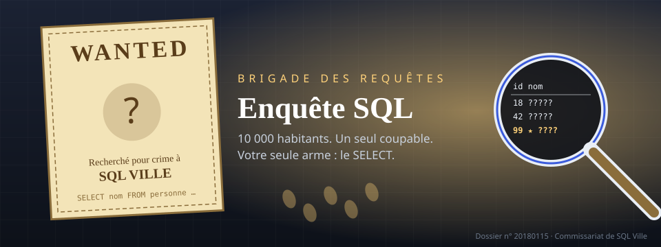
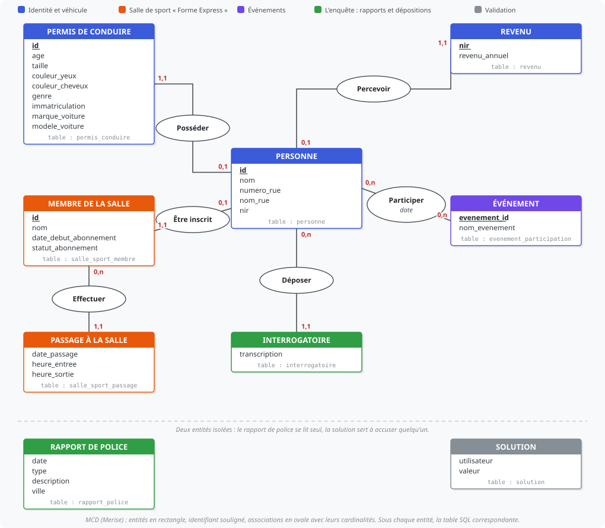

# TP Bonus : Enquête SQL



::: details Sommaire
[[toc]]
:::

Vous savez maintenant écrire des requêtes SQL et les exécuter depuis PHP avec PDO. Il est temps de vérifier que vous savez aussi **lire des données** pour en tirer une conclusion. Un crime a été commis à SQL Ville, la police a une base de données… et rien d'autre. C'est à vous de jouer !

Ce TP est une adaptation en français du [SQL Murder Mystery](https://github.com/NUKnightLab/sql-mysteries) de NUKnightLab, avec plusieurs histoires différentes pour ne pas refaire toujours la même enquête.

::: tip Pour les étudiants en avance
Ce TP est un **bonus** : il n'est pas noté et ne demande aucun rendu. Vous pouvez le faire en autonomie, seul ou à deux, dès que vous avez terminé le TP en cours. Comptez environ une heure par histoire.
:::

## Avant de commencer

Il vous faut le [TP 5 SQL](./tp5.md) (SELECT, WHERE, jointures) et [l'aide-mémoire SQL](/cheatsheets/sql/) sous la main. À la fin, vous saurez explorer une base que vous n'avez pas conçue, croiser plusieurs tables avec `JOIN`, et réduire 10 000 habitants à un seul nom avec `LIKE`, `BETWEEN`, `ORDER BY` et `GROUP BY … HAVING`.

::: details Rattrapage express : les mots-clés dont vous aurez besoin
- `SELECT … FROM … WHERE …` : filtrer des lignes.
- `LIKE 'abc%'`, `LIKE '%abc'`, `LIKE '%abc%'` : commence par, se termine par, contient.
- `BETWEEN a AND b` : un intervalle (dates et nombres).
- `ORDER BY … DESC LIMIT 1` : la plus grande valeur.
- `JOIN table t ON t.colonne = autre.colonne` : relier deux tables.
- `GROUP BY … HAVING COUNT(*) = n` : compter par personne.
:::

## Les règles du jeu

- Toutes les histoires se passent dans la même base : mêmes tables, mêmes colonnes. Seules les données changent.
- Chaque enquête commence par la table `rapport_police`. Le rapport vous dit comment trouver les témoins, les témoins vous décrivent le coupable, et parfois le coupable vous mène plus loin encore.
- Les dates sont stockées sous la forme d'un nombre entier `AAAAMMJJ` (le 15 janvier 2018 s'écrit `20180115`), les heures sous la forme `HHMM` (`1830` pour 18h30).
- Quand vous pensez avoir trouvé, vous **accusez** quelqu'un (champ « J'accuse » sous l'éditeur, ou à la main) : la base vous répond si c'est la bonne personne… et si l'enquête continue. Derrière, c'est une simple insertion :

```sql
INSERT INTO solution VALUES (1, 'Prénom Nom');
SELECT valeur FROM solution;
```

- Le journal de bord au-dessus de l'éditeur retient les noms validés (dans votre navigateur uniquement).

::: warning Interdit
Pas de `SELECT * FROM personne` en espérant repérer le coupable à l'œil : il y a 10 000 habitants. L'objectif est justement d'écrire des requêtes qui **réduisent** le nombre de résultats jusqu'à n'en avoir qu'un.
:::

::: details La méthode, en quatre étapes (à lire une fois, puis à garder sous le coude)
Quelle que soit l'histoire, la démarche est toujours la même.

**Étape 1 : lire le rapport de police**

Vous connaissez la date, le type de crime et la ville : c'est un simple filtre.

```sql
SELECT * FROM rapport_police
WHERE ville = 'SQL Ville' AND type = 'meurtre' AND date = 20180115;
```

Attention, il peut y avoir plusieurs rapports le même jour dans la même ville. Lisez la `description` : elle vous dit comment **retrouver les témoins** (une rue, un prénom, un numéro, un revenu…).

**Étape 2 : identifier les témoins**

Le rapport ne donne jamais un nom, seulement une manière de le retrouver. Quelques exemples de formulations et la requête qui va avec :

| Le rapport dit… | Vous cherchez… |
| --- | --- |
| « la dernière maison de la rue X » | `ORDER BY numero_rue DESC LIMIT 1` |
| « le plus petit numéro de la rue X » | `ORDER BY numero_rue ASC LIMIT 1` |
| « prénommé Lucas, rue X » | `nom LIKE 'Lucas %'` |
| « la personne au revenu le plus élevé de la rue X » | une jointure avec `revenu` puis `ORDER BY revenu_annuel DESC LIMIT 1` |

Une fois les témoins identifiés, lisez leur `interrogatoire` : c'est là que se trouvent les indices sur le coupable.

**Étape 3 : croiser les indices**

Chaque témoin donne un ou plusieurs indices (une plaque, une salle de sport, un événement, une description physique…). **Tous** les indices sont nécessaires : la base contient volontairement des personnes qui correspondent à presque tout.

Construisez une requête qui part de `personne` et ajoute une jointure par indice. Testez au fur et à mesure : à chaque condition ajoutée, le nombre de lignes doit diminuer.

**Que se passe-t-il derrière ?**
Quand un indice parle de « trois fois à un événement », un simple `WHERE` ne suffit pas : il faut compter les participations par personne avec `GROUP BY personne_id HAVING COUNT(*) = 3`. C'est exactement ce que vous ferez plus tard pour compter les commandes d'un client ou les articles d'un panier.

**Étape 4 : valider, puis continuer**

Validez avec `INSERT INTO solution`. Si le message vous dit que l'histoire continue, lisez l'interrogatoire du coupable : il a peut-être été payé par quelqu'un.
:::

## Le plan de la ville : les tables



Tout ce que la police sait tient dans ces neuf tables. Une flèche part d'une clé étrangère (FK, en bleu) vers la clé primaire (PK) qu'elle désigne : c'est exactement le `ON` de vos jointures. `rapport_police` et `solution` ne sont reliées à rien : la première se lit seule, la seconde sert à valider votre réponse.

Question de réflexion : comment relie-t-on une personne à sa voiture ? Et à son revenu ?

::: details Réponse
- `personne.permis_id` → `permis_conduire.id` pour la voiture et la description physique.
- `personne.nir` → `revenu.nir` pour le revenu.
- `personne.id` → `salle_sport_membre.personne_id`, puis `salle_sport_membre.id` → `salle_sport_passage.membre_id` pour la salle de sport.
- `personne.id` → `evenement_participation.personne_id` et `interrogatoire.personne_id`.
:::

## À vous de jouer : choisissez votre enquête

Sélectionnez une histoire, lisez le brief, puis écrivez vos requêtes dans l'éditeur. Tout s'exécute dans votre navigateur (rien n'est envoyé sur un serveur) et le bouton « Réinitialiser » remet la base dans son état d'origine.

<ClientOnly>
<SqlEnquete />
</ClientOnly>

::: tip Vous préférez un vrai client SQL ?
Le lien « Télécharger la base » vous donne le fichier `.sqlite`. Ouvrez-le avec [DB Browser for SQLite](https://sqlitebrowser.org/), PhpStorm ou la ligne de commande `sqlite3`. Les requêtes sont exactement les mêmes.
:::

## Enquête n° 1 : on la fait ensemble

Pour prendre en main l'outil, nous allons résoudre **Le meurtre de SQL Ville** ensemble, requête par requête. Sélectionnez cette histoire dans l'éditeur ci-dessus, puis copiez chaque requête et comparez votre résultat au mien. Les autres histoires seront à faire seul.

### 1. Le rapport de police

Le brief vous donne trois informations : un meurtre, le 15 janvier 2018, à SQL Ville. Le lien « Insérer la requête de départ » écrit cette requête pour vous :

```sql
SELECT * FROM rapport_police
WHERE ville = 'SQL Ville' AND type = 'meurtre' AND date = 20180115;
```

Vous devez obtenir **une ligne**. Lisez sa description : deux témoins, le premier habite la dernière maison de « Rue du Nord-Ouest », le second se prénomme Annabel et habite « Avenue Franklin ».

::: tip Que se passe-t-il si j'enlève le `type` ?
Essayez ! Vous obtenez trois rapports ce jour-là. C'est le principe de toute l'enquête : chaque condition retire des lignes.
:::

### 2. Retrouver les deux témoins

« La dernière maison » = le plus grand numéro de la rue. On trie les habitants de cette rue par numéro décroissant et on garde le premier :

```sql
SELECT * FROM personne
WHERE nom_rue = 'Rue du Nord-Ouest'
ORDER BY numero_rue DESC
LIMIT 1;
```

Résultat attendu : **Martin Chapuis**.

Pour Annabel, on filtre sur le début du nom (le prénom est suivi d'une espace) :

```sql
SELECT * FROM personne
WHERE nom_rue = 'Avenue Franklin' AND nom LIKE 'Annabel %';
```

Résultat attendu : **Annabel Meunier**.

### 3. Lire leurs dépositions

Les dépositions sont dans `interrogatoire`, reliée à `personne` par `personne_id` (suivez la flèche sur le schéma). Plutôt que de recopier les `id`, faisons une jointure et filtrons sur les noms :

```sql
SELECT p.nom, i.transcription
FROM interrogatoire i
JOIN personne p ON p.id = i.personne_id
WHERE p.nom IN ('Martin Chapuis', 'Annabel Meunier');
```

Lisez bien les deux textes. Martin donne : un sac de la salle « Forme Express » dont le numéro de membre commence par « 48Z », un abonnement « or », un passage à la salle le 9 janvier 2018 et une plaque contenant « H42W ». Annabel confirme le passage à la salle le 9 janvier.

### 4. Traduire chaque indice en condition SQL

| Indice | Table | Condition |
| --- | --- | --- |
| numéro de membre commence par 48Z | `salle_sport_membre` | `m.id LIKE '48Z%'` |
| abonnement or | `salle_sport_membre` | `m.statut_abonnement = 'or'` |
| passage le 9 janvier 2018 | `salle_sport_passage` | `s.date_passage = 20180109` |
| plaque contient H42W | `permis_conduire` | `pc.immatriculation LIKE '%H42W%'` |

On part de `personne` et on ajoute les jointures **une par une**, en exécutant à chaque fois pour voir le nombre de lignes diminuer :

```sql
-- Étape a : seulement la salle de sport (plusieurs résultats)
SELECT p.nom, m.id, m.statut_abonnement
FROM personne p
JOIN salle_sport_membre m ON m.personne_id = p.id
WHERE m.id LIKE '48Z%' AND m.statut_abonnement = 'or';

-- Étape b : on ajoute le passage du 9 janvier (moins de résultats)
SELECT p.nom, m.id, s.date_passage
FROM personne p
JOIN salle_sport_membre m ON m.personne_id = p.id
JOIN salle_sport_passage s ON s.membre_id = m.id
WHERE m.id LIKE '48Z%' AND m.statut_abonnement = 'or'
  AND s.date_passage = 20180109;

-- Étape c : on ajoute la plaque (un seul résultat)
SELECT p.nom, pc.immatriculation
FROM personne p
JOIN salle_sport_membre m ON m.personne_id = p.id
JOIN salle_sport_passage s ON s.membre_id = m.id
JOIN permis_conduire pc ON pc.id = p.permis_id
WHERE m.id LIKE '48Z%' AND m.statut_abonnement = 'or'
  AND s.date_passage = 20180109
  AND pc.immatriculation LIKE '%H42W%';
```

Résultat attendu à l'étape c : **Jeremy Boivin**.

### 5. Valider

```sql
INSERT INTO solution VALUES (1, 'Jeremy Boivin');
SELECT valeur FROM solution;
```

La base vous félicite… et vous dit que l'enquête continue : lisez l'interrogatoire de Jeremy Boivin (même requête qu'à l'étape 3 avec son nom). Il décrit la femme qui l'a payé. À vous de traduire ces nouveaux indices en conditions, comme à l'étape 4. Le seul piège : « trois fois au concert » demande de **compter** les participations par personne :

```sql
SELECT p.nom, COUNT(*) AS participations
FROM personne p
JOIN evenement_participation e ON e.personne_id = p.id
WHERE e.nom_evenement = 'Concert Symphonique SQL'
  AND e.date BETWEEN 20171201 AND 20171231
GROUP BY p.id
HAVING COUNT(*) = 3;
```

Il reste à combiner avec la description physique et la voiture (dans `permis_conduire`). Si vous bloquez, la solution complète est dans la section suivante.

::: tip Point de contrôle
Vous avez validé les deux noms de la première histoire et vous savez expliquer chaque `JOIN`. Vous êtes prêt pour les trois autres enquêtes, sans pas-à-pas cette fois.
:::

## Enquêtes suivantes : indices et solutions

Les trois autres enquêtes sont à faire seul. Essayez d'abord sans rien ouvrir. Si vous bloquez, dépliez les indices dans l'ordre : ils sont de plus en plus précis, la solution complète vient en dernier.

### Le meurtre de SQL Ville

<!--@include: ../../../public/sqlite/enquete/solutions/meurtre.md-->

### Le braquage du SQL Express

<!--@include: ../../../public/sqlite/enquete/solutions/sql_express.md-->

### La formule du professeur Noside

<!--@include: ../../../public/sqlite/enquete/solutions/formule.md-->

### Panique à la septième séance

<!--@include: ../../../public/sqlite/enquete/solutions/septieme_seance.md-->

## Pour aller plus loin

- Résolvez la dernière étape d'une histoire en **une seule requête** (toutes les jointures d'un coup).
- Pour chaque histoire, écrivez la requête qui liste **tous** les habitants qui correspondent à un indice mais pas aux autres : ce sont les fausses pistes que la base a glissées exprès.
- Réécrivez l'une de vos requêtes finales en PHP avec PDO et une requête préparée, en passant la date et le type de crime en paramètres.

## Conclusion

Dans ce TP vous avez :

- Exploré une base inconnue en partant de son schéma.
- Enchaîné filtres, jointures et agrégats pour passer de 10 000 habitants à un seul nom.
- Vu que chaque indice correspond à une condition SQL, et qu'une condition manquante laisse toujours plusieurs suspects.

👋 Si vous avez des questions, n'hésitez pas. Et si vous avez résolu les quatre histoires, venez me voir : j'ai peut-être une cinquième enquête pour vous.
