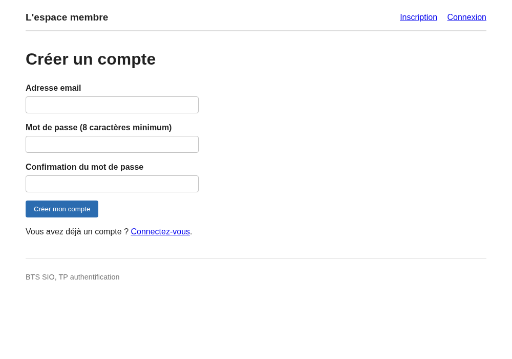
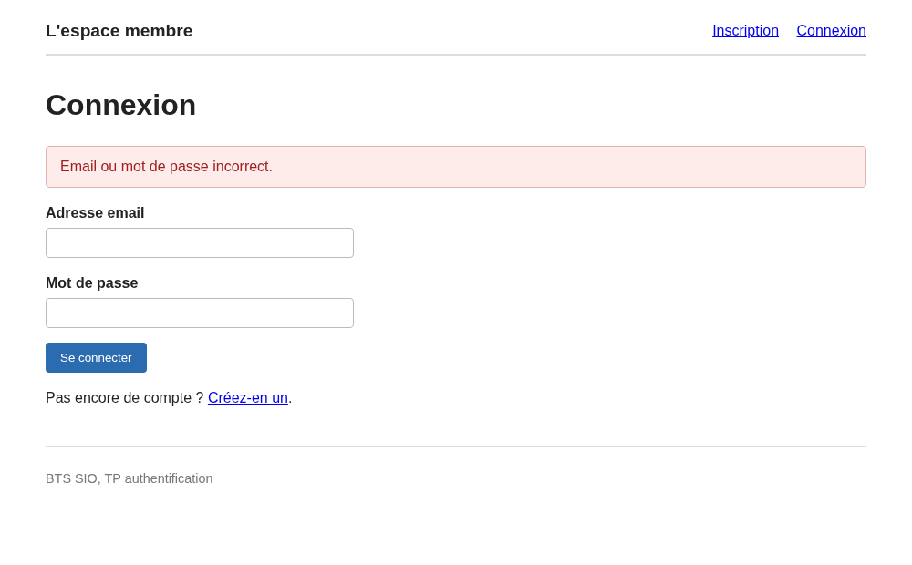
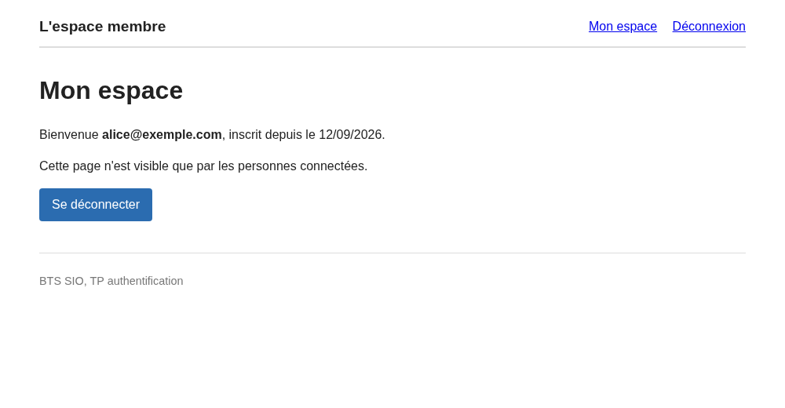

# TP Authentification : les bonnes pratiques

::: details Sommaire
[[toc]]
:::

Ce TP est la **seconde partie du [TP 5](../tp5.md)**. En première partie, pour protéger une page, nous avions écrit `admin@exemple.com` et `mdp` **en dur** dans le code. Ça fonctionnait, et c'était parfait pour comprendre la session et la whitelist conditionnelle. Mais nous étions d'accord sur un point : en termes de sécurité, c'était catastrophique.

Aujourd'hui, nous faisons les choses correctement. Nous allons construire un petit site complet, « l'espace membre », dans lequel n'importe qui peut **créer un compte**, **se connecter**, accéder à une **page réservée**, et se **déconnecter**. Les mots de passe seront stockés en base de données, hachés, salés, et impossibles à relire.

Ce mécanisme, vous allez le réutiliser tout le temps. Dès le [TP Création : la médiathèque](./creation-mediatheque.md) d'ailleurs, dont l'étape 11 vous demande exactement ceci.

::: tip Votre projet, ou celui-ci ?
Le projet « espace membre » décrit ici est **autonome** : vous pouvez le créer de zéro en suivant le TP, c'est ce que je vous conseille si vous voulez un projet propre et dédié à l'authentification.

Mais vous pouvez tout aussi bien **repartir de votre projet Bart** du TP 5 : la table `utilisateurs`, `password_hash()`, `password_verify()` et la whitelist conditionnelle s'y installent exactement de la même façon. Dans ce cas, remplacez simplement la base `espace_membre` par votre base `bart`, et la page protégée par votre page de génération de punitions.
:::

::: tip Un TP entièrement guidé
Ici, je vous donne le code clé, commenté ligne par ligne. Votre travail n'est pas de deviner : c'est de **comprendre** ce que fait chaque ligne, de l'assembler, et de le tester. Prenez le temps de lire les explications, elles valent plus que le code lui-même.

Comptez 2 heures.
:::

Dans ce TP, je vous invite à avoir en parallèle :

- [Le complément de cours SQL](./support.md)
- [Le complément sécurité](../securite/support.md), en particulier [les mots de passe hachés](../securite/support.md#les-mots-de-passe-haches) et [les requêtes préparées](../securite/support.md#les-requetes-preparees)
- [L'aide mémoire PHP](/cheatsheets/php/)

## Les slides

Avant de commencer, un tour rapide des compétences du jour : le hachage, le sel, `password_hash()`, `password_verify()` et la session qui se régénère.

<ClientOnly>
<SlidesDeck src="sql_tp_authentification" />
</ClientOnly>

Le cours complet sur le sujet est [dans les slides sécurité](/cours/securite_bases.md).

## Prérequis

- **XAMPP ou WAMP** démarré (Apache + MySQL/MariaDB), et **phpMyAdmin** accessible.
- La structure « entry-point » du [TP 3](../tp3.md) : `index.php` avec sa whitelist, `common/`, `pages/`, `public/` et `utils/db.php`.
- Les requêtes préparées avec PDO, vues au [TP 6 SQL](./tp6.md).

::: details Rattrapage : à quoi ressemble `utils/db.php` ?

C'est le fichier du [support SQL](./support.md#utils-db-php), avec deux options en plus :

```php
<?php
// Cette partie est à customiser
$server = "localhost";
$db = "espace_membre";
$user = "root";
$passwd = "";
// Fin de la partie customisable

$dsn = "mysql:host=$server;dbname=$db;charset=utf8mb4";
$pdo = new PDO($dsn, $user, $passwd);
$pdo->setAttribute(PDO::ATTR_ERRMODE, PDO::ERRMODE_EXCEPTION);
```

- `charset=utf8mb4` : sans lui, les accents s'affichent en « é ».
- `ERRMODE_EXCEPTION` : en cas d'erreur SQL, PHP affiche un vrai message au lieu de continuer en silence.

:::

## Objectifs

À la fin de ce TP vous saurez :

- Expliquer la différence entre **chiffrer** et **hacher**, et pourquoi md5 ne suffit plus.
- Stocker un mot de passe avec `password_hash()` et le vérifier avec `password_verify()`.
- Écrire un formulaire d'inscription qui **valide** ce qu'il reçoit avant d'enregistrer.
- Écrire une connexion avec une requête préparée et un message d'erreur **générique**.
- Protéger des pages avec une whitelist conditionnelle et une session régénérée.
- Faire une déconnexion propre.

## Étape 1 : comprendre avant de coder

Avant la première ligne de PHP, prenons dix minutes de théorie. Sans elle, le code que vous allez écrire n'est qu'une recette de cuisine.

### La question qui change tout

Imaginez : votre base de données se retrouve dans la nature. Une injection SQL, une sauvegarde oubliée sur une clé USB, un mot de passe d'hébergement trop faible. Ça arrive, tous les mois, à des entreprises bien plus grandes que les nôtres.

:::: tip Question de réflexion
**Que découvre la personne qui ouvre votre base ?**

Prenez 30 secondes avant de lire la suite.

::: details La réponse
Si vous avez stocké les mots de passe en clair, elle découvre ceci :

```text
| id | email               | mot_de_passe |
|  1 | alice@exemple.com   | azerty123    |
|  2 | bob@exemple.com     | jaimelechat  |
|  3 | carole@exemple.com  | Soleil2024!  |
```

Tous les comptes de votre site sont ouverts d'un coup. Et comme la plupart des gens réutilisent leur mot de passe, ce sont aussi leurs boites mail, leurs réseaux sociaux et parfois leur banque que vous venez de donner.

C'est pour cette raison qu'une base **ne doit jamais** contenir un mot de passe lisible.
:::
::::

### Hacher, ce n'est pas chiffrer

Deux mots que l'on confond souvent :

- **Chiffrer** (encrypt), c'est **réversible** : avec la clé, on retrouve la valeur d'origine. C'est ce qu'on utilise pour un message que le destinataire doit pouvoir lire.
- **Hacher** (hash), c'est **à sens unique** : on transforme une valeur en une empreinte, et on ne peut pas faire le chemin inverse.

:::: tip Question de réflexion
**Pour un mot de passe : chiffrer ou hacher ?**

::: details La réponse
**Hacher.** Et la raison est simple : vous n'avez **jamais** besoin de relire le mot de passe d'un utilisateur.

Quand quelqu'un se connecte, vous ne comparez pas des mots de passe, vous comparez des **empreintes** : celle du mot de passe saisi et celle stockée en base. Si elles correspondent, c'est la bonne personne.

D'ailleurs, c'est pour ça qu'un site sérieux ne vous renvoie jamais votre mot de passe par email : il ne le connait pas. Il vous propose de le **réinitialiser**.
:::
::::

Deux propriétés d'un hachage, à retenir :

- La même entrée donne **toujours** la même sortie (sinon on ne pourrait rien vérifier).
- On ne peut pas revenir en arrière à partir de la sortie.

### md5 et sha1, c'est fini

Historiquement, on hachait avec `md5()` ou `sha1()`. Testez, c'est instructif :

```php
echo md5('mdp'); // 6f8db599de986fab7a21625b7916589c
```

Le mot de passe n'est plus lisible. Alors pourquoi est-ce insuffisant aujourd'hui ?

- Ces fonctions sont **extrêmement rapides** : une carte graphique en calcule des **milliards par seconde**. Tester tous les mots de passe d'un dictionnaire prend quelques minutes.
- Le résultat est **déjà calculé** : il existe des **tables arc-en-ciel** (rainbow tables), d'immenses listes « empreinte, mot de passe d'origine ». Copiez-collez l'empreinte ci-dessus dans un moteur de recherche, vous retrouverez `mdp` en un clic.
- Deux utilisateurs avec le même mot de passe ont **exactement la même empreinte** : il suffit d'en casser une pour les avoir tous les deux.

### Le sel

Le **sel** (salt), c'est une valeur aléatoire ajoutée au mot de passe **avant** de le hacher. Conséquence : deux personnes ayant choisi le même mot de passe n'ont pas le même résultat en base.

```php
echo password_hash('mdp', PASSWORD_DEFAULT);
// $2y$10$hjWMUhizSij9iB8LTl01..pK0w2nPBMQrDzNlhzugI8RMTRPnE8RW

echo password_hash('mdp', PASSWORD_DEFAULT);
// $2y$10$mT3em04Vba3dJ52zQju/Juct9Ae2HsyDzoOmJNPOc7YsQ0lN4Tnv2
```

Même fonction, même mot de passe, deux résultats différents : le sel n'est pas le même. Les tables arc-en-ciel deviennent inutilisables, il faudrait en recalculer une **par utilisateur**.

::: tip Que se passe-t-il derrière ?
Si le sel est différent à chaque fois, comment `password_verify()` fait-il pour vérifier ?

Parce que le sel est **stocké dans le hash lui-même**. C'est tout l'intérêt du format que nous voyons juste en dessous : la chaîne enregistrée contient l'algorithme, le coût, le sel **et** l'empreinte. Vous n'avez donc rien d'autre à sauvegarder.
:::

### bcrypt, lent exprès

`password_hash()` utilise aujourd'hui l'algorithme **bcrypt**, conçu pour être **volontairement lent**. Pour vous, c'est quelques dizaines de millisecondes au moment de la connexion : imperceptible. Pour quelqu'un qui veut tester des millions de mots de passe, c'est rédhibitoire.

La lenteur est ici une **fonctionnalité**, pas un défaut.

### L'anatomie d'un hash

Voici ce que vous verrez dans votre base à la fin de ce TP :

```text
$2y$10$hjWMUhizSij9iB8LTl01..pK0w2nPBMQrDzNlhzugI8RMTRPnE8RW
 |   |  |
 |   |  +-- le sel (22 caractères) puis l'empreinte
 |   +----- le coût : 2^10 = 1024 tours de calcul
 +--------- l'algorithme : 2y = bcrypt
```

Retenez juste ceci : **un hash bcrypt commence par `$2y$` et fait 60 caractères**. C'est votre point de contrôle visuel tout au long du TP. Pour laisser la place aux futurs algorithmes (plus longs), la colonne sera déclarée en `VARCHAR(255)`.

::: danger Ne jamais écrire son propre système de hachage
« J'ai une idée : je mets le mot de passe à l'envers, j'ajoute la date et je fais un md5. »

**Non.** Jamais. La cryptographie est un domaine où des équipes entières de chercheurs passent des années à trouver des failles dans des algorithmes déjà publiés. Votre bricolage du vendredi après-midi ne tiendra pas dix minutes.

La règle, dans votre vie professionnelle entière : **utilisez les fonctions standard du langage**. En PHP, ce sont `password_hash()` et `password_verify()`, et rien d'autre.
:::

## Étape 2 : la base et la structure du projet

### La base de données

Créez un nouveau projet (ne modifiez pas vos TP précédents). Dans phpMyAdmin, ouvrez l'onglet **SQL** et exécutez ce script :

```sql
CREATE DATABASE IF NOT EXISTS espace_membre
  CHARACTER SET utf8mb4 COLLATE utf8mb4_unicode_ci;

USE espace_membre;

CREATE TABLE utilisateurs (
  id INT AUTO_INCREMENT PRIMARY KEY,
  email VARCHAR(150) NOT NULL UNIQUE,
  mot_de_passe VARCHAR(255) NOT NULL,
  date_inscription DATETIME NOT NULL DEFAULT CURRENT_TIMESTAMP
) ENGINE=InnoDB DEFAULT CHARSET=utf8mb4 COLLATE=utf8mb4_unicode_ci;
```

La table est **vide**, et c'est normal : vous allez vous inscrire vous-même dans quelques minutes. Trois détails méritent votre attention :

- `email ... UNIQUE` : la base refusera deux comptes avec le même email. C'est une sécurité de dernier recours, nous ferons quand même la vérification en PHP (pour afficher un message propre plutôt qu'une erreur SQL).
- `mot_de_passe VARCHAR(255)` : la place nécessaire pour un hash, aujourd'hui et demain.
- `date_inscription ... DEFAULT CURRENT_TIMESTAMP` : la base met la date du jour toute seule, nous n'aurons pas à l'envoyer dans l'`INSERT`.

### L'arborescence

```txt
espace-membre/
├── index.php                Le point d'entrée (session, whitelist, includes)
├── common/
│   ├── header.php           Le début du HTML et le menu
│   └── footer.php           La fin du HTML
├── pages/
│   ├── home.php             L'accueil (public)
│   ├── inscription.php      Le formulaire de création de compte
│   ├── connexion.php        Le formulaire de connexion
│   ├── deconnexion.php      La destruction de la session
│   └── espace.php           La page protégée
├── public/
│   └── main.css             Un minimum de style
└── utils/
    └── db.php               La connexion PDO
```

::: details La CSS, si vous voulez que vos captures ressemblent aux miennes

Le visuel n'est pas l'objectif de ce TP, mais un peu de lisibilité ne fait pas de mal. À placer dans `public/main.css` :

```css
body {
    font-family: system-ui, sans-serif;
    max-width: 900px;
    margin: 0 auto;
    padding: 20px;
    color: #222;
    line-height: 1.5;
}

header {
    display: flex;
    justify-content: space-between;
    align-items: center;
    border-bottom: 2px solid #ddd;
    padding-bottom: 10px;
    margin-bottom: 30px;
}

header .logo {
    font-weight: bold;
    font-size: 1.2em;
    text-decoration: none;
    color: #222;
}

nav a {
    margin-left: 15px;
}

label {
    display: block;
    font-weight: bold;
    margin-bottom: 4px;
}

input {
    padding: 8px;
    width: 320px;
    max-width: 100%;
    border: 1px solid #bbb;
    border-radius: 4px;
}

button,
.button {
    display: inline-block;
    padding: 9px 16px;
    border: 0;
    border-radius: 4px;
    background: #2b6cb0;
    color: #fff;
    text-decoration: none;
    cursor: pointer;
}

.erreur {
    background: #fdecea;
    border: 1px solid #e0b4b4;
    color: #a02020;
    padding: 10px 15px;
    border-radius: 4px;
}

.succes {
    background: #eaf7ea;
    border: 1px solid #b4e0b4;
    color: #206020;
    padding: 10px 15px;
    border-radius: 4px;
}

footer {
    margin-top: 40px;
    border-top: 1px solid #ddd;
    padding-top: 10px;
    color: #777;
    font-size: 0.9em;
}
```

:::

### Le point d'entrée

Voici `index.php` en entier. Nous reviendrons sur la whitelist à l'étape 5, pour l'instant recopiez-le :

```php
<?php
// Démarrage de la session
session_start();

// Permet d'utiliser header() même si du HTML a déjà été envoyé
ob_start();

// La connexion à la base de données, disponible dans toutes les pages
include('utils/db.php');

// Affichage de la partie haute du site
include('common/header.php');

// Pages autorisées : elles dépendent de l'état de connexion
if (isset($_SESSION['user_id'])) {
    $whitelist = ['home', 'espace', 'deconnexion'];
} else {
    $whitelist = ['home', 'inscription', 'connexion'];
}

// Gestion de l'affichage de la page demandée
if (isset($_GET['page']) && in_array($_GET['page'], $whitelist)) {
    include("pages/" . $_GET['page'] . '.php');
} else {
    include('pages/home.php');
}

// Affichage de la partie basse du site
include('common/footer.php');
```

::: tip Que se passe-t-il derrière avec `ob_start()` ?
Nos pages sont incluses **après** `header.php`, donc après l'envoi de HTML au navigateur. Or `header('location: …')` ne fonctionne que si rien n'a encore été envoyé, sinon vous obtenez le célèbre message `Cannot modify header information, headers already sent`.

`ob_start()` (output buffering) demande à PHP de **garder le HTML en mémoire** au lieu de l'envoyer tout de suite. Du coup, nos redirections restent possibles dans les pages. Une ligne, un problème classique évité.

Selon la configuration de votre serveur, ça peut fonctionner sans. Mettez-la quand même : elle ne coute rien et vous évitera une soirée de débogage.
:::

::: details Le contenu de `common/header.php` et `common/footer.php`

`common/header.php` :

```php
<!DOCTYPE html>
<html lang="fr">

<head>
    <meta charset="UTF-8">
    <meta name="viewport" content="width=device-width, initial-scale=1.0">
    <title>L'espace membre</title>
    <link rel="stylesheet" href="./public/main.css">
</head>

<body>
    <header>
        <a class="logo" href="index.php">L'espace membre</a>
        <nav>
            <?php if (isset($_SESSION['user_id'])) { ?>
                <a href="index.php?page=espace">Mon espace</a>
                <a href="index.php?page=deconnexion">Déconnexion</a>
            <?php } else { ?>
                <a href="index.php?page=inscription">Inscription</a>
                <a href="index.php?page=connexion">Connexion</a>
            <?php } ?>
        </nav>
    </header>
    <main>
```

`common/footer.php` :

```php
    </main>
    <footer>
        <p>BTS SIO, TP authentification</p>
    </footer>
</body>

</html>
```

:::

Enfin, `pages/home.php`, la page publique d'accueil. Rien de compliqué, je vous laisse l'adapter :

```php
<h1>Bienvenue</h1>

<p>
    Ce site est un espace membre : vous pouvez créer un compte, vous connecter,
    et accéder à une page réservée aux personnes connectées.
</p>

<p>
    <a class="button" href="index.php?page=inscription">Créer un compte</a>
    <a class="button" href="index.php?page=connexion">Se connecter</a>
</p>
```

::: tip Point de contrôle
Ouvrez `http://localhost/espace-membre/index.php`. Vous devez voir la page d'accueil, avec « Inscription » et « Connexion » dans le menu. Aucune erreur PHP, aucune erreur de connexion à la base.

Si vous avez une erreur PDO, c'est `utils/db.php` : vérifiez le nom de la base (`espace_membre`), l'utilisateur (`root`) et le mot de passe (vide sur XAMPP).
:::

## Étape 3 : l'inscription

C'est la page la plus importante du TP : c'est ici que le mot de passe est haché.

### Le formulaire

Commençons par la partie visible, à mettre dans `pages/inscription.php` :

```php
<h1>Créer un compte</h1>

<form method="post" action="index.php?page=inscription">
    <p>
        <label for="email">Adresse email</label>
        <input type="email" name="email" id="email" required>
    </p>
    <p>
        <label for="password">Mot de passe (8 caractères minimum)</label>
        <input type="password" name="password" id="password" required>
    </p>
    <p>
        <label for="confirmation">Confirmation du mot de passe</label>
        <input type="password" name="confirmation" id="confirmation" required>
    </p>
    <p>
        <button type="submit">Créer mon compte</button>
    </p>
</form>

<p>Vous avez déjà un compte ? <a href="index.php?page=connexion">Connectez-vous</a>.</p>
```

Trois points de vocabulaire :

- `method="post"` : un mot de passe ne transite **jamais** en GET. En GET, il s'afficherait dans l'URL, dans l'historique du navigateur et dans les journaux (logs) du serveur.
- `type="password"` : le navigateur masque la saisie.
- `required` et `type="email"` : le navigateur fait une première vérification. Pratique pour l'utilisateur, **inutile pour la sécurité** : n'importe qui peut envoyer le formulaire sans passer par votre page. La vraie vérification est côté serveur, c'est celle que nous écrivons maintenant. Le sujet est développé dans [le complément sécurité](../securite/support.md#ne-jamais-faire-confiance-aux-donnees-recues).

### Le traitement

Ce bloc se place **tout en haut** de `pages/inscription.php`, avant le HTML. Lisez les commentaires, ils expliquent chaque étape :

```php
<?php
// La liste des erreurs rencontrées (vide = tout va bien)
$errors = [];
$email = "";

if ($_SERVER['REQUEST_METHOD'] === 'POST') {
    // 1. Récupération des valeurs envoyées par le formulaire
    $email = trim($_POST['email'] ?? '');
    $password = $_POST['password'] ?? '';
    $confirmation = $_POST['confirmation'] ?? '';

    // 2. Validation des saisies
    if (!filter_var($email, FILTER_VALIDATE_EMAIL)) {
        $errors[] = "L'adresse email n'est pas valide.";
    }

    if (strlen($password) < 8) {
        $errors[] = "Le mot de passe doit contenir au moins 8 caractères.";
    }

    if ($password !== $confirmation) {
        $errors[] = "Les deux mots de passe ne sont pas identiques.";
    }

    // 3. L'email est-il déjà utilisé ? (requête préparée)
    if (count($errors) === 0) {
        $stmt = $pdo->prepare("SELECT id FROM utilisateurs WHERE email = ?");
        $stmt->execute([$email]);

        if ($stmt->fetch()) {
            $errors[] = "Cette adresse email est déjà utilisée.";
        }
    }

    // 4. Tout est bon : on hache le mot de passe et on enregistre
    if (count($errors) === 0) {
        $hash = password_hash($password, PASSWORD_DEFAULT);

        $stmt = $pdo->prepare("INSERT INTO utilisateurs (email, mot_de_passe) VALUES (?, ?)");
        $stmt->execute([$email, $hash]);

        header('location: index.php?page=connexion&inscription=ok');
        die();
    }
}
?>
```

Reprenons calmement :

- `$_SERVER['REQUEST_METHOD'] === 'POST'` : le formulaire a-t-il été envoyé ? Si on arrive sur la page par un simple lien, on saute tout le bloc et on affiche juste le formulaire.
- `$_POST['email'] ?? ''` : l'opérateur `??` renvoie la valeur si elle existe, sinon la chaîne vide. C'est une écriture courte de `isset($_POST['email']) ? $_POST['email'] : ''`.
- `trim()` supprime les espaces au début et à la fin (l'utilisateur qui copie-colle son email avec un espace, ça arrive tous les jours). Attention : **jamais** de `trim()` sur le mot de passe, un espace peut faire partie du mot de passe.
- `filter_var($email, FILTER_VALIDATE_EMAIL)` : la fonction standard de PHP pour valider un email. Elle renvoie `false` si l'adresse n'a pas une forme correcte.
- La vérification d'unicité est une **requête préparée** : `$email` vient de l'utilisateur, donc elle ne sera jamais concaténée dans la requête. Un rappel complet est [dans le support](./support.md#requete-prepare-ou-requete-normal).
- `password_hash($password, PASSWORD_DEFAULT)` : la ligne clé. `PASSWORD_DEFAULT` signifie « le meilleur algorithme disponible dans cette version de PHP ». Le jour où PHP en changera, votre code n'aura pas à bouger.
- `header(...)` puis `die()` : **les deux, toujours**. `header()` n'interrompt pas le script, sans `die()` la suite de la page continuerait de s'exécuter.

Il reste à afficher les erreurs. Juste après le `<h1>` :

```php
<?php if (count($errors) > 0) { ?>
    <ul class="erreur">
        <?php foreach ($errors as $error) { ?>
            <li><?php echo htmlspecialchars($error); ?></li>
        <?php } ?>
    </ul>
<?php } ?>
```

::: tip Pourquoi accumuler les erreurs dans un tableau ?
Parce qu'il est bien plus agréable de voir d'un coup « email invalide » **et** « mot de passe trop court », plutôt que de les découvrir une par une au fil des tentatives. C'est un réflexe de qualité à prendre dès maintenant.
:::

Votre page doit ressembler à ceci :



::: tip Point de contrôle
Créez un compte (par exemple `alice@exemple.com` avec le mot de passe `motdepasse1`), puis ouvrez la table `utilisateurs` dans phpMyAdmin. Vous devez voir une ligne qui ressemble à ceci :

```text
id : 1
email : alice@exemple.com
mot_de_passe : $2y$10$hjWMUhizSij9iB8LTl01..pK0w2nPBMQrDzNlhzugI8RMTRPnE8RW
date_inscription : 2026-09-12 09:38:07
```

La colonne `mot_de_passe` contient bien une chaîne commençant par `$2y$` et longue de 60 caractères, **et pas** `motdepasse1`. Si vous voyez le mot de passe en clair, relisez le point 4 du traitement.

Testez aussi les cas qui doivent échouer : un email invalide (`pasunemail`), un mot de passe de 5 caractères, une confirmation différente, et une deuxième inscription avec le même email. Chacun doit afficher son message, sans enregistrer quoi que ce soit.
:::

## Étape 4 : la connexion

L'inscription enregistre une empreinte. La connexion la vérifie. Créez `pages/connexion.php`, en commençant par le traitement :

```php
<?php
$error = null;

if ($_SERVER['REQUEST_METHOD'] === 'POST') {
    // 1. Récupération des valeurs envoyées par le formulaire
    $email = trim($_POST['email'] ?? '');
    $password = $_POST['password'] ?? '';

    // 2. On cherche l'utilisateur par son email (requête préparée)
    $stmt = $pdo->prepare("SELECT * FROM utilisateurs WHERE email = ?");
    $stmt->execute([$email]);
    $user = $stmt->fetch(PDO::FETCH_ASSOC);

    // 3. L'utilisateur existe et le mot de passe correspond au hash stocké
    if ($user && password_verify($password, $user['mot_de_passe'])) {
        // Nouvel identifiant de session : on repart sur une session « propre »
        session_regenerate_id(true);

        $_SESSION['user_id'] = $user['id'];
        $_SESSION['user_email'] = $user['email'];

        header('location: index.php?page=espace');
        die();
    }

    // 4. Échec : un seul message, toujours le même
    $error = "Email ou mot de passe incorrect.";
}
?>
```

Les points à comprendre :

- On **ne cherche jamais** l'utilisateur avec son mot de passe dans le `WHERE`. C'est impossible : le hash stocké contient un sel aléatoire, il ne correspondra jamais à un nouveau calcul. La démarche est donc en deux temps : on récupère la ligne par l'email, puis on compare.
- `password_verify($password, $user['mot_de_passe'])` : la fonction relit le sel et le coût dans le hash stocké, recalcule l'empreinte du mot de passe saisi, et compare. Elle renvoie `true` ou `false`.
- `$user && password_verify(...)` : l'ordre compte. Si `$user` vaut `false` (email inconnu), PHP n'évalue même pas la suite. On évite une erreur sur `$user['mot_de_passe']`.
- `session_regenerate_id(true)` : PHP crée un **nouvel** identifiant de session et détruit l'ancien. Si quelqu'un avait réussi à imposer un identifiant de session à votre visiteur avant sa connexion (une attaque nommée « fixation de session »), cet identifiant ne vaut plus rien. Une ligne, à mettre systématiquement au moment où l'on connecte quelqu'un. Plus de détails [dans le complément sécurité](../securite/support.md#la-session).
- En session, on stocke l'`id` et l'email, **jamais** le mot de passe ni le hash.

:::: tip Question de réflexion
**Pourquoi ne pas afficher « Cet email est inconnu » quand l'email n'existe pas ?**

Ce serait pourtant plus aimable pour l'utilisateur.

::: details La réponse
Parce que votre formulaire deviendrait un outil pour **découvrir les comptes existants** (on parle d'énumération des comptes).

Il suffirait d'essayer des milliers d'adresses : celles qui répondent « mot de passe incorrect » existent, les autres non. Résultat, l'attaquant obtient la liste de vos membres, et il n'a plus qu'à concentrer ses tentatives (ou son hameçonnage) sur des adresses dont il sait qu'elles sont valides.

Sur un site quelconque, c'est déjà gênant. Sur un site médical, une application de rencontre ou un forum d'entraide, c'est une fuite de données personnelles.

Un seul message, donc : « Email ou mot de passe incorrect. »
:::
::::

Il reste le formulaire, à la suite du traitement :

```php
<h1>Connexion</h1>

<?php if (isset($_GET['inscription'])) { ?>
    <p class="succes">Votre compte est créé, vous pouvez maintenant vous connecter.</p>
<?php } ?>

<?php if ($error !== null) { ?>
    <p class="erreur"><?php echo htmlspecialchars($error); ?></p>
<?php } ?>

<form method="post" action="index.php?page=connexion">
    <p>
        <label for="email">Adresse email</label>
        <input type="email" name="email" id="email" required>
    </p>
    <p>
        <label for="password">Mot de passe</label>
        <input type="password" name="password" id="password" required>
    </p>
    <p>
        <button type="submit">Se connecter</button>
    </p>
</form>

<p>Pas encore de compte ? <a href="index.php?page=inscription">Créez-en un</a>.</p>
```

::: tip Point de contrôle
Saisissez un mauvais mot de passe : vous devez obtenir ceci, et rien de plus bavard.



Essayez ensuite avec un email qui n'existe pas : **le message doit être exactement le même**.
:::

## Étape 5 : la page protégée et la déconnexion

### La whitelist conditionnelle

Vous connaissez déjà le principe, c'est celui du [TP 5](../tp5.md) : la liste des pages autorisées **dépend de l'état de connexion**. Il est déjà dans votre `index.php` :

```php
if (isset($_SESSION['user_id'])) {
    $whitelist = ['home', 'espace', 'deconnexion'];
} else {
    $whitelist = ['home', 'inscription', 'connexion'];
}
```

Relisez-le : une personne non connectée ne peut **pas** demander `page=espace`. Ce n'est pas le lien qui est caché, c'est la page qui n'existe tout simplement pas pour elle. Le fichier `pages/espace.php` n'est jamais inclus, donc jamais exécuté.

::: danger Cacher un lien, ce n'est pas protéger une page
Retirer « Mon espace » du menu ne protège rien du tout : l'URL reste connue et n'importe qui peut la saisir. La protection se fait **côté serveur**, dans l'entry-point (ou en tête de chaque page concernée). C'est exactement le même raisonnement que pour les champs `required` du formulaire.
:::

### L'espace membre

Créez `pages/espace.php`. Puisque cette page n'est incluse que si `$_SESSION['user_id']` existe, nous pouvons l'utiliser en confiance :

```php
<?php
// On récupère les informations de l'utilisateur connecté (requête préparée)
$stmt = $pdo->prepare("SELECT email, date_inscription FROM utilisateurs WHERE id = ?");
$stmt->execute([$_SESSION['user_id']]);
$user = $stmt->fetch(PDO::FETCH_ASSOC);
?>

<h1>Mon espace</h1>

<p>
    Bienvenue <strong><?php echo htmlspecialchars($user['email']); ?></strong>,
    inscrit depuis le <?php echo date('d/m/Y', strtotime($user['date_inscription'])); ?>.
</p>

<p>Cette page n'est visible que par les personnes connectées.</p>

<p><a class="button" href="index.php?page=deconnexion">Se déconnecter</a></p>
```

`strtotime()` transforme la date de la base (`2026-09-12 09:38:07`) en un format que `date()` sait mettre en forme, ici `12/09/2026`.



::: tip Pourquoi relire la base alors que l'email est déjà en session ?
Deux raisons. D'abord parce qu'il nous faut la date d'inscription, qui n'est pas en session. Ensuite parce que la base est la **source de vérité** : si le compte est modifié (ou supprimé) pendant que la session est ouverte, la page affiche l'information à jour.

En session, on garde le strict minimum : de quoi savoir **qui** est connecté.
:::

### La déconnexion

`pages/deconnexion.php`, trois lignes utiles :

```php
<?php
// On vide puis on détruit la session
$_SESSION = [];
session_destroy();

header('location: index.php');
die();
```

- `$_SESSION = []` vide les données pour la fin du script en cours.
- `session_destroy()` supprime le fichier de session côté serveur.
- La redirection renvoie vers l'accueil : comme la session n'existe plus, le menu réaffiche « Inscription » et « Connexion ».

::: tip Point de contrôle
Le cycle complet doit fonctionner : inscription, connexion, « Mon espace » avec votre email et votre date d'inscription, déconnexion, retour à l'accueil avec le menu public.

👋 Si vous avez des questions, n'hésitez pas.
:::

## Étape 6 : vérifier que c'est solide

Le code fonctionne. Maintenant, essayons de le casser. Quatre tests, à faire dans l'ordre.

### Test 1 : accéder à l'espace sans être connecté

Déconnectez-vous, puis saisissez directement dans la barre d'adresse :

```text
index.php?page=espace
```

Vous devez atterrir sur la page d'accueil. Pas d'erreur, pas de page blanche, pas de « Bienvenue » : la page protégée n'est pas dans la whitelist des visiteurs non connectés.

### Test 2 : l'injection SQL dans le formulaire

Sur la page de connexion, saisissez dans le champ email :

```text
' OR 1=1 --
```

Et n'importe quoi comme mot de passe. Résultat attendu : « Email ou mot de passe incorrect. » Il ne se passe **rien**.

:::: tip Question de réflexion
**Pourquoi cette saisie ne fonctionne-t-elle pas ?**

::: details La réponse
Parce que la requête est **préparée**. Avec `prepare()` puis `execute([$email])`, la structure de la requête est envoyée à la base **avant** les valeurs. Le `' OR 1=1 --` n'est donc pas lu comme du SQL : c'est une chaîne de caractères, que la base va sagement chercher dans la colonne `email`. Elle ne trouve rien, `fetch()` renvoie `false`, et on affiche le message d'erreur.

Si nous avions écrit `"SELECT * FROM utilisateurs WHERE email = '$email'"`, cette même saisie aurait transformé la requête en « donne-moi tous les utilisateurs » et la première ligne aurait été récupérée. Le détail complet est [dans le complément sécurité](../securite/support.md#les-requetes-preparees).
:::
::::

### Test 3 : deux mots de passe identiques

Inscrivez un deuxième compte (`bob@exemple.com`) avec **exactement le même mot de passe** que le premier. Regardez ensuite la table dans phpMyAdmin :

```text
alice@exemple.com   $2y$10$hjWMUhizSij9iB8LTl01..pK0w2nPBMQrDzNlhzugI8RMTRPnE8RW
bob@exemple.com     $2y$10$mT3em04Vba3dJ52zQju/Juct9Ae2HsyDzoOmJNPOc7YsQ0lN4Tnv2
```

Même mot de passe, deux hashs complètement différents : c'est le **sel** à l'œuvre. Et les deux comptes se connectent parfaitement, puisque le sel voyage avec le hash.

### Test 4 : le mot de passe ne doit apparaitre nulle part

Relisez votre code et posez-vous la question : y a-t-il un endroit où le mot de passe en clair est écrit ? Un `echo $password` oublié pendant vos essais, un `var_dump($_POST)`, un fichier de log ?

::: danger Jamais, nulle part
Le mot de passe en clair ne doit exister que dans deux endroits : le champ du formulaire, et la variable `$password` le temps du traitement. **Jamais** dans le code, **jamais** en base, **jamais** dans un `echo` de débogage, **jamais** dans un fichier de journalisation (log), **jamais** dans une URL.

Et pensez à supprimer vos `var_dump()` avant de rendre votre travail. 😉
:::

::: tip Note pour le vous du futur : `password_needs_rehash()`
Un jour, PHP changera l'algorithme par défaut, ou vous augmenterez le coût du calcul. Vos anciens comptes seront alors hachés « à l'ancienne ».

La fonction `password_needs_rehash()` sert exactement à ça : au moment d'une connexion réussie (c'est le seul moment où vous avez le mot de passe en clair sous la main), elle vous dit si le hash mérite d'être recalculé.

```php
if (password_needs_rehash($user['mot_de_passe'], PASSWORD_DEFAULT)) {
    $nouveauHash = password_hash($password, PASSWORD_DEFAULT);
    // puis un UPDATE de la colonne mot_de_passe pour cet utilisateur
}
```

Ce n'est pas demandé dans ce TP, mais retenez que ça existe : c'est ce qui permet de migrer une base d'utilisateurs sans jamais demander à personne de changer son mot de passe.
:::

## Étape 7 : les bonus

Vous avez terminé et il vous reste du temps ? Voici trois pistes, de la plus simple à la plus ambitieuse.

### Limiter les tentatives

Rien n'empêche aujourd'hui quelqu'un d'essayer des milliers de mots de passe sur votre formulaire. Comptez les échecs en session et bloquez au bout de 5 essais.

::: details Voir l'une des solutions possibles

Dans `pages/connexion.php`, autour du traitement existant :

```php
<?php
$error = null;

// Compteur de tentatives
if (!isset($_SESSION['attempts'])) {
    $_SESSION['attempts'] = 0;
}

if ($_SERVER['REQUEST_METHOD'] === 'POST') {
    if ($_SESSION['attempts'] >= 5) {
        $error = "Trop de tentatives, patientez un instant avant de réessayer.";
    } else {
        // … le traitement de l'étape 4 …

        // En cas de succès, ne pas oublier de remettre le compteur à zéro
        // $_SESSION['attempts'] = 0;

        // En cas d'échec, on incrémente
        $_SESSION['attempts'] = $_SESSION['attempts'] + 1;
        $error = "Email ou mot de passe incorrect.";
    }
}
```

:::

::: warning Une protection, pas une forteresse
Le compteur est en **session** : il suffit de supprimer son cookie pour repartir à zéro. C'est donc une gêne, pas un rempart. Une vraie protection compte les tentatives **en base de données**, par compte et par adresse IP, et ajoute un délai croissant. C'est au programme de la deuxième année.
:::

### La force du mot de passe en JavaScript

Ajoutez sous le champ mot de passe de l'inscription un indicateur qui se met à jour à la frappe : « trop court », « correct », « solide » selon la longueur et la présence de chiffres ou de majuscules.

::: danger Le JavaScript n'est qu'un confort
C'est de l'aide à la saisie, pour **guider** l'utilisateur. La vérification des 8 caractères minimum reste **obligatoire côté serveur** : le JavaScript se désactive en trois clics, et un formulaire peut être envoyé sans passer par votre page.

Règle générale, valable pour tout le reste de votre carrière : **tout ce qui se passe dans le navigateur peut être modifié par l'utilisateur**.
:::

### Pour aller plus loin en deuxième année

Ce TP couvre les fondations. En deuxième année, la série sécurité va beaucoup plus loin sur le sujet avec le [TP 4 : authentification, mots de passe et sessions](/tp/securite/tp4_authentification.md) : attaques par force brute et comment les ralentir vraiment, jetons CSRF, double authentification (2FA), sécurisation fine des cookies de session.

Si le sujet vous intéresse, allez y jeter un œil : vous avez maintenant tout le vocabulaire pour le comprendre.

## Conclusion

Vous venez de construire une authentification correcte, et ce mécanisme vous servira dans **tous** vos projets. Les bonnes pratiques à recopier partout, dès aujourd'hui :

- Le mot de passe est **haché**, jamais stocké en clair, jamais chiffré.
- `password_hash($password, PASSWORD_DEFAULT)` pour enregistrer, `password_verify()` pour vérifier. On n'écrit **jamais** son propre système de hachage.
- La colonne du mot de passe est un `VARCHAR(255)`, et un hash bcrypt commence par `$2y$`.
- Toute valeur venant de l'utilisateur passe par une **requête préparée**, sans exception.
- Les saisies sont **validées côté serveur**, même si le navigateur les a déjà vérifiées.
- Un seul **message d'erreur générique** en cas d'échec de connexion.
- `session_regenerate_id(true)` au moment de la connexion, `session_destroy()` à la déconnexion.
- Les pages protégées le sont **côté serveur** (whitelist conditionnelle), pas en cachant un lien.
- Le mot de passe en clair n'apparait ni dans le code, ni en base, ni dans les logs, ni dans une URL.

Et maintenant ?

- Direction le [TP Création : la médiathèque](./creation-mediatheque.md). Son étape 11 vous demande exactement ce que vous venez de faire : vous savez déjà comment vous y prendre.
- Un peu plus tard, [le TP 2 de la POO](/tp/php/poo/tp2.md) reprendra la même chose, mais en objets. Le raisonnement sera identique, seule l'organisation du code changera.

👋 Si vous avez des questions, n'hésitez pas.
