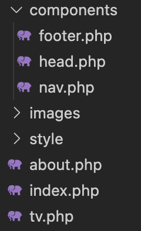

# Le passage de paramètres

Nous allons illustrer le passage de paramètres grâce à la Greta TV. Ce TP va nous permettre de mieux comprendre l'intérêt des paramètres.

Nous allons produire le code qui va nous permettre de réaliser les deux pages suivantes :

<iframe width="560" height="315" src="https://www.youtube-nocookie.com/embed/sGStM92OIG0" frameborder="0" allow="accelerometer; autoplay; clipboard-write; encrypted-media; gyroscope; picture-in-picture" allowfullscreen></iframe>

L'objectif de ce code est d'illustrer le passage de paramètres entre deux pages via un paramètre GET. Celui-ci contiendra :

- Deux pages
- Responsive
- Un paramètre (?id=...)

## Rappel sur les paramètres

| Variables | Usage                                                                                                           |
| --------- | --------------------------------------------------------------------------------------------------------------- |
| `$_GET`   | Contiens les paramètres envoyés dans l'URL.                                                                     |
|           | `index.php?prenom=valentin`, `prenom` est donc un paramètre et `valentin` la valeur.                            |
|           | Vous pouvez avoir plusieurs paramètres avec le caractère `&`. <br> Ex. `index.php?nom=brosseau&prenom=valentin` |

```php
// Exemple $_GET Contiendra
array(
    "prenom" => "valentin",
    "nom" => "brosseau",
);

echo $_GET['nom']; // Affichera brosseau
echo $_GET['prenom']; // Affichera valentin

echo $_GET['nom'] . " " . $_GET['prenom']; // Affichera brosseau valentin
```

## Évolution 0

Nous allons nous servir des `includes` pour « organiser » notre code. L'idée derrière cette organisation est simple, évitée de multiplier le code identique entre différentes pages. Si vous regardez votre code, vous allez rapidement remarquer que certains éléments sont identiques sur les deux pages :

- le `<nav>`
- le `<head>`

Nous avons en PHP la possibilité de « sortir » les éléments en question pour les inclure ou ça est nécessaire. Par exemple, pour le `<nav>` je vous propose de créer un fichier `nav.php` dans un dossier nommé `components`. Dans mon cas le fichier contiendra **uniquement**:

```php
<nav class="navbar navbar-expand-lg navbar-dark bg-dark">
    <div class="container-fluid">
        <a class="navbar-brand" href="/">GRETA TV</a>
    </div>
</nav>
```

Puis pour l'utiliser, il vous suffira de le mettre à l'endroit où vous souhaitez l'afficher :

```php
<body>
    <?php include("./components/nav.php"); ?>

<!-- La suite de votre code -->
```

::: tip Hé oui !
C'est effectivement aussi simple que ça. N'oubliez pas, 50% de votre travail repose sur votre bonne organisation !
:::

Je vous laisse faire de même pour la partie `head` de votre site.

::: tip Bon ok…
Un petit indice pour la suite, votre structure de dossier ressemblera à :

:::

## Évolution 1

Je vous propose comme évolution d'ajouter un paramètre. Celui-ci devra nous permettre la personnalisation du thème de la page `tv.php` (celle affichant les vidéos). Pour ça nous allons :

- Ajouter un paramètre `&bg=noel` ou `&bg=brick`, etc.
- Utiliser le paramètre pour personnaliser le thème de la page. (Le paramètre doit être utilisé en tant que `class`).

## Évolution 2

### Cas 1

Ajouter une CSS qui s'affichera uniquement aujourd'hui. Celle-ci doit modifier l'apparence de votre site Internet.

### Cas 2

Afficher une sélection de vidéo (`card`) en fonction de la période de l'année. Par exemple 4 vidéos sur le thème de Noël pendant la période de Noël.

## Évolution 3

La dernière grosse évolution à réaliser dans ce site, je vous propose de rendre dynamique la liste des vidéos sur la page d'`index.php`. Pour ça :

- Ajouter un tableau `array`.
- Faire une boucle (`foreach`, `for`, `while`).

_Exemple simple **à ne pas recopier**_

```php
$videos = array("BcgsOgjHgWA","lcOxhH8N3Bo","jTuBnZrLbq0", "M2VtfZDOcHQ", "i1iIaSbK9bg", "MTaHw-S6IDo", "KfMCApWc5xE", "igtN49I1CtM");

foreach ($videos as $id) {
    echo "- <a href='tv.php?id=".$id."> Video " .$id.  "<a/>";
}
```

::: tip Attention
Le code précédent est **un exemple** ! Il faut le modifier/l'adapter pour afficher les cards tels que c'était demandé initialement.
:::
