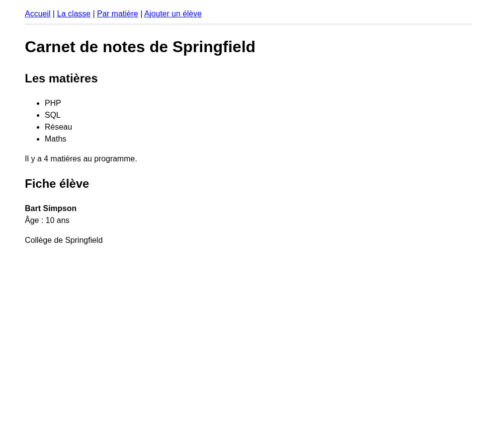
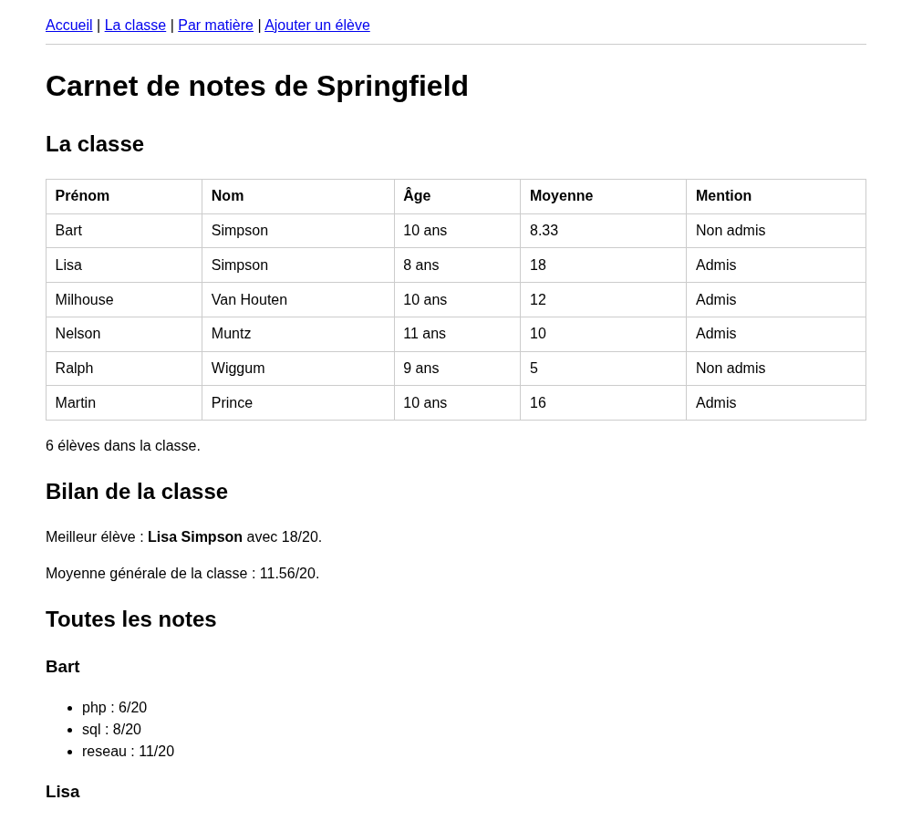
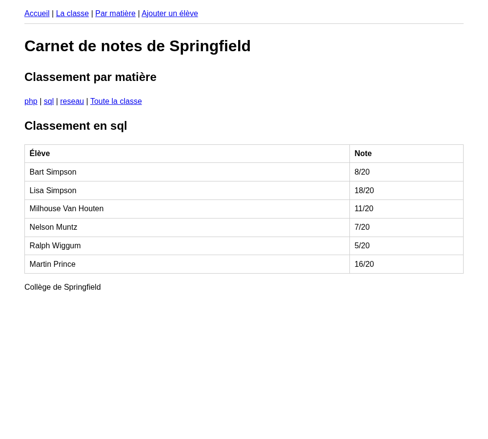
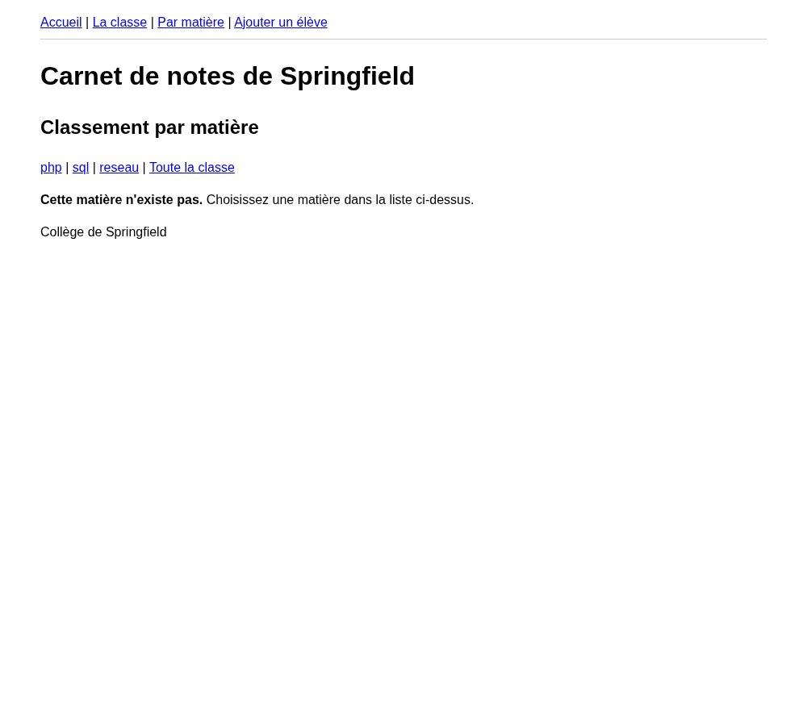
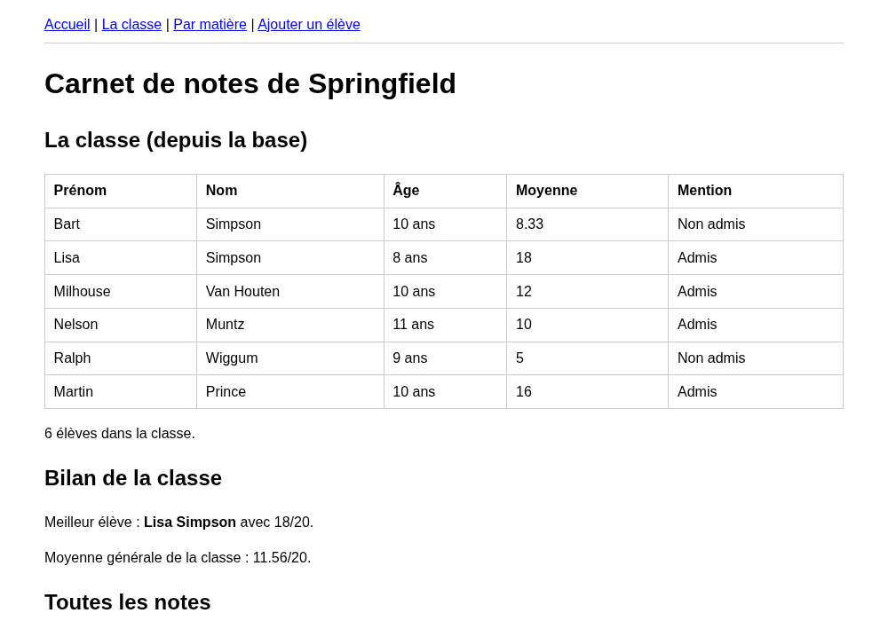

# TP Tableaux : Le carnet de notes de Springfield

Skinner veut son carnet de notes en ligne. L'occasion parfaite pour découvrir les tableaux à plusieurs dimensions, le foreach imbriqué et les fonctions qui font le travail à votre place.

::: details Sommaire
[[toc]]
:::

Depuis le premier TP, vous utilisez des tableaux sans forcément le savoir. `$_GET`, `$_POST`, `$_SERVER`, `$_SESSION` : ce sont tous des tableaux. Et quand vous avez écrit la whitelist de votre `index.php`, vous avez écrit un tableau, puis vous l'avez parcouru.

Aujourd'hui, nous allons prendre le sujet par le bon bout. Skinner en a assez de son classeur papier : il veut le carnet de notes de la classe de Bart sur le réseau du collège. Une classe, des élèves, des matières, des notes, des moyennes. Pour représenter tout ça, une variable simple ne suffit plus.

Vous savez déjà interroger une base de données depuis PHP (c'était le [TP 2](./tp2.md), avec PDO et les requêtes préparées). Nous allons commencer par écrire nos données « à la main » dans un fichier PHP, pour nous concentrer sur leur **structure**, puis, à l'étape 7, nous irons chercher exactement les mêmes données dans une base. Vous verrez alors que rien d'autre ne change dans le projet : c'est tout l'intérêt de séparer les données de l'affichage.

::: warning Le visuel, on s'en occupe plus tard
Dans ce TP, nous nous concentrons sur **la logique** et sur **les données**. Un `<table>` HTML tout simple suffira largement. Si vous voulez ajouter Bootstrap à la fin, libre à vous, mais seulement à la fin.
:::

## Les slides

Avant de commencer, un tour rapide des compétences du jour : le tableau de tableaux, l'accès à plusieurs niveaux et le foreach imbriqué.

<ClientOnly>
<SlidesDeck src="php_tp_tableaux" />
</ClientOnly>

## Prérequis

- Un environnement PHP qui fonctionne (XAMPP, WAMP, ou le serveur intégré `php -S localhost:9000`).
- Avoir fait les TP 1 à 5 : variables, boucles, conditions, `include`, `$_GET`.
- Connaître la structure « entry-point » du [TP 3](./tp3.md) (un `index.php`, une whitelist, des dossiers `common/` et `pages/`) : c'est celle que nous allons réutiliser.
- Savoir interroger une base de données avec PDO depuis le [TP 2](./tp2.md) : le fichier `utils/db.php`, `query()`, `fetchAll()` et les requêtes préparées. Tout est rappelé dans [le support SQL, section « Obtenir des données »](./sql/support.md#obtenir-des-donnees). Vous en aurez besoin à l'étape 7.
- Avoir lu (ou relu) la partie [Les tableaux](./support.md#les-tableaux) du support, en particulier [À plusieurs dimensions](./support.md#a-plusieurs-dimensions).

::: details Rattrapage express sur le foreach

`foreach` sert à parcourir un tableau, du premier au dernier élément, sans avoir à gérer de compteur :

```php
$subjects = array('PHP', 'SQL', 'Réseau');

foreach ($subjects as $subject) {
    echo $subject;
}
```

Et si la clé vous intéresse aussi (utile pour un tableau associatif) :

```php
foreach ($subjects as $key => $subject) {
    echo $key . ' : ' . $subject;
}
```

:::

## Objectifs

À la fin de ce TP vous saurez :

- Créer et parcourir un tableau numéroté et un tableau associatif.
- Construire un tableau à plusieurs dimensions (un tableau qui contient des tableaux).
- Accéder à une valeur imbriquée avec `$students[0]['notes']['php']`.
- Écrire un `foreach` imbriqué pour parcourir deux niveaux.
- Inspecter une structure de données avec `print_r()`.
- Utiliser `count()`, `array_sum()`, `in_array()` et `array_key_exists()`.
- Séparer les données (un fichier `common/data.php`) des pages qui les affichent.
- Remplacer ces données écrites à la main par les mêmes données lues en base, sans toucher à une seule page.

::: tip Pour tenir les 2 heures
Voici un rythme indicatif, gardez un oeil sur l'horloge :

| Étape | Sujet | Durée |
| --- | --- | --- |
| 1 | La liste des matières | 10 min |
| 2 | La fiche d'un élève | 10 min |
| 3 | La classe entière | 20 min |
| 4 | Les notes et les moyennes | 25 min |
| 5 | Un peu de logique | 20 min |
| 6 | Filtrer avec l'URL | 15 min |
| 7 | Les mêmes données, depuis la base | 20 min |
| 8 | Bonus | si vous êtes en avance |

Si vous prenez du retard sur une étape, passez à la suivante et revenez-y à la fin. L'important est d'arriver à l'étape 4, puis de prendre le temps de l'étape 7 qui referme le TP.
:::

## Préparer le projet

Nous repartons de l'organisation du [TP 3](./tp3.md) : un point d'entrée unique, une whitelist, et des pages rangées dans `pages/`. Créez un **nouveau projet** `carnet` avec l'arborescence suivante :

```
carnet/
├── index.php          <- le point d'entrée (whitelist et includes)
├── common/
│   ├── header.php     <- le début du HTML et le menu
│   ├── footer.php     <- la fin du HTML
│   └── data.php       <- les données (les tableaux)
└── pages/
    └── home.php       <- la première page
```

Pourquoi un fichier `data.php` à part ? Parce que les données et l'affichage sont deux choses différentes. À l'étape 7, vos données viendront d'une base de données : seul `common/data.php` changera, vos pages continueront de fonctionner sans qu'on y touche. C'est exactement le même réflexe que les `include` du TP 3.

Le fichier `index.php` est celui du TP 3, auquel on ajoute l'include des données **avant** le header, pour que les tableaux soient disponibles dans toutes les pages. La première ligne, `ob_start()`, demande à PHP de garder le HTML en mémoire jusqu'à la fin du script : elle permet de faire une redirection depuis une page même si le header est déjà affiché, vous en aurez besoin dans le bonus, prenez l'habitude de la mettre :

```php
<?php
// Permet d'utiliser header() même si du HTML a déjà été envoyé (utile pour le bonus)
ob_start();

// Les données, disponibles dans toutes les pages
include('common/data.php');

// Affichage de la partie haute du site
include('common/header.php');

// Pages autorisées
$whitelist = array('home');

// Gestion de l'affichage de la page demandée
if (isset($_GET['page']) && in_array($_GET['page'], $whitelist)) {
    include("pages/" . $_GET['page'] . '.php');
} else {
    include('pages/home.php');
}

// Affichage de la partie basse du site
include('common/footer.php');
```

::: tip Vous l'avez sous les yeux
`$whitelist` est un tableau numéroté, et `in_array()` cherche une valeur dedans. Vous utilisez donc déjà, depuis le TP 3, deux des notions du jour. Vous ajouterez une valeur à cette whitelist à chaque nouvelle page du TP.
:::

Un `common/header.php` minimal, avec un menu que nous compléterons au fil des pages :

```php
<!DOCTYPE html>
<html lang="fr">
<head>
    <meta charset="utf-8">
    <title>Carnet de notes de Springfield</title>
    <link rel="stylesheet" href="public/main.css">
</head>
<body>
    <header>
        <a href="index.php?page=home">Accueil</a>
    </header>
    <h1>Carnet de notes de Springfield</h1>
```

Un `common/footer.php` :

```php
    <footer>Collège de Springfield</footer>
</body>
</html>
```

::: details Une petite CSS pour y voir clair

C'est totalement **facultatif** : le TP fonctionne très bien sans. Mais si les tableaux bruts vous piquent les yeux, créez un fichier `public/main.css` avec ceci, c'est le strict minimum pour que les copies d'écran de ce TP ressemblent à votre page :

```css
body {
    font-family: system-ui, sans-serif;
    max-width: 900px;
    margin: 0 auto;
    padding: 1rem;
    line-height: 1.5;
}

table {
    border-collapse: collapse;
    width: 100%;
    margin-bottom: 1rem;
}

th,
td {
    border: 1px solid #ccc;
    padding: 0.4rem 0.6rem;
    text-align: left;
}

header {
    padding-bottom: 0.5rem;
    border-bottom: 1px solid #ccc;
}
```

Le `<link rel="stylesheet" href="public/main.css">` du header ci-dessus s'occupe de la charger. Si vous ne créez pas le fichier, la page s'affiche quand même, sans mise en forme.

:::

Une page `pages/home.php` vide pour l'instant (un simple `<h2>Bienvenue</h2>` suffit pour vérifier que tout s'affiche), et dans `common/data.php`, uniquement l'ouverture de PHP :

```php
<?php
// Les données de notre carnet de notes
```

::: warning Pas de balise fermante dans data.php
Un fichier qui ne contient **que** du PHP n'a pas besoin de `?>` à la fin. C'est même recommandé de ne pas en mettre : ça évite d'envoyer par erreur un espace ou un retour à la ligne au navigateur.
:::

::: tip Point de contrôle
`index.php` affiche le titre, le menu, votre page d'accueil et le pied de page. `index.php?page=nimportequoi` affiche aussi l'accueil : la whitelist fait son travail.
:::

## Étape 1 : la liste des matières

Skinner commence petit : il veut la liste des matières enseignées.

Dans `common/data.php`, ajoutez le tableau suivant. Il s'agit d'un tableau **numéroté** (les clés sont des nombres, générés automatiquement à partir de zéro) :

```php
// Les matières enseignées, tableau numéroté
$subjects = array('PHP', 'SQL', 'Réseau');
```

::: tip array() ou les crochets ?
Vous verrez les deux écritures dans la nature : `array('PHP', 'SQL')` et `['PHP', 'SQL']`. Elles sont **strictement équivalentes**. Dans ce TP nous utiliserons `array(...)`, comme dans le support, pour rester cohérents. Choisissez-en une et gardez-la sur tout un projet.
:::

Maintenant, dans `pages/home.php`, affichez cette liste dans un `<ul>` :

```php
<h2>Les matières</h2>
<ul>
    <?php foreach ($subjects as $subject) { ?>
        <li><?= $subject ?></li>
    <?php } ?>
</ul>
```

::: tip Que se passe-t-il derrière ?
`foreach` prend le tableau `$subjects` et, à chaque tour de boucle, met **un** élément dans la variable `$subject`. Trois éléments dans le tableau, donc trois tours, donc trois `<li>`. Notez au passage l'écriture `<?= $subject ?>` : c'est un raccourci pour `<?php echo $subject; ?>`.
:::

### Compter les matières

Combien de matières y a-t-il ? Ne les comptez pas à la main, PHP le fait pour vous :

```php
<p>Il y a <?= count($subjects) ?> matières au programme.</p>
```

### Ajouter une matière

Skinner veut aussi les Mathématiques. Dans `common/data.php`, juste après la création du tableau, ajoutez :

```php
// Ajout d'un élément à la fin du tableau
$subjects[] = 'Maths';
```

Les crochets vides veulent dire « à la fin, à la prochaine case libre ». PHP se charge de trouver le bon numéro.

::: tip Point de contrôle
Rechargez votre page. Vous devez voir quatre matières dans la liste, et la phrase doit indiquer « Il y a 4 matières au programme ». Si le compteur affiche encore 3, c'est que votre `$subjects[] = 'Maths';` est écrit dans le mauvais fichier (il doit être dans `common/data.php`, juste après la création du tableau).
:::

::: details Question : que vaut `$subjects[0]` ? Et `$subjects[3]` s'il n'y a que trois matières ?

`$subjects[0]` vaut `'PHP'` : la première case d'un tableau numéroté porte le numéro **zéro**, pas un. C'est la source d'erreur numéro un chez les débutants.

`$subjects[3]` sur un tableau de trois éléments (donc numérotés 0, 1 et 2) : la case n'existe pas. PHP affiche un avertissement de type :

```
Warning: Undefined array key 3
```

et la valeur utilisée est vide. Le programme ne s'arrête pas, mais votre page affiche n'importe quoi. Pour éviter ça, quand vous n'êtes pas sûr qu'une case existe, testez-la :

```php
if (isset($subjects[3])) {
    echo $subjects[3];
} else {
    echo 'Cette matière n\'existe pas';
}
```

Vous connaissez déjà `isset()` : c'est exactement ce que vous faisiez sur `$_GET` dans le TP sur les paramètres.

:::

## Étape 2 : la fiche d'un élève

Passons à un élève. Un élève, ce n'est pas une liste de valeurs interchangeables : c'est un prénom, un nom, un âge. Chaque information a un rôle différent. C'est le cas d'usage typique du tableau **associatif**, où la clé est un texte.

Dans `common/data.php` :

```php
// Un élève, tableau associatif
$student = array(
    'prenom' => 'Bart',
    'nom' => 'Simpson',
    'age' => 10,
);
```

Et dans `pages/home.php`, sous la liste des matières, affichez sa fiche :

```php
<h2>Fiche élève</h2>
<p>
    <strong><?= $student['prenom'] ?> <?= $student['nom'] ?></strong><br>
    Âge : <?= $student['age'] ?> ans
</p>
```

::: details Question : pourquoi une clé texte plutôt qu'un numéro ?

Comparez les deux écritures :

```php
echo $student[2];        // 10, mais 10 quoi ? L'âge ? La note ? Le numéro de classe ?
echo $student['age'];    // aucun doute possible
```

Un tableau associatif se **relit**. Six mois plus tard, ou pour un collègue qui ouvre votre code, `$student['age']` se comprend tout seul alors que `$student[2]` oblige à remonter jusqu'à la création du tableau.

L'autre avantage : l'ordre n'a plus d'importance. Si demain vous insérez la clé `classe` au milieu du tableau, tout votre code continue de fonctionner. Avec des numéros, tout aurait décalé.

Retenez la règle : **des choses de même nature, on numérote (une liste de matières) ; des informations de nature différente, on nomme (les champs d'un élève)**.

:::

Voici ce que vous devez obtenir :



## Étape 3 : la classe entière

Un élève, c'est bien. Skinner en a une classe entière. Et là, la question intéressante : comment stocker six élèves ?

On pourrait faire `$student1`, `$student2`, `$student3`… mais alors comment les afficher avec une boucle ? Impossible. La bonne réponse : un tableau **numéroté** dont chaque case contient un tableau **associatif**. Un tableau de tableaux, autrement dit un tableau à plusieurs dimensions.

Dans `common/data.php`, remplacez votre `$student` par la classe complète (attention, `$student` n'existe donc plus : dans `pages/home.php`, remplacez-le par `$students[0]`, c'est-à-dire « le premier élève de la classe ») :

```php
// La classe : un tableau numéroté qui contient des tableaux associatifs
$students = array(
    array('prenom' => 'Bart', 'nom' => 'Simpson', 'age' => 10),
    array('prenom' => 'Lisa', 'nom' => 'Simpson', 'age' => 8),
    array('prenom' => 'Milhouse', 'nom' => 'Van Houten', 'age' => 10),
    array('prenom' => 'Nelson', 'nom' => 'Muntz', 'age' => 11),
    array('prenom' => 'Ralph', 'nom' => 'Wiggum', 'age' => 9),
    array('prenom' => 'Martin', 'nom' => 'Prince', 'age' => 10),
);
```

### Regarder ce qu'il y a dedans

La classe mérite sa propre page : créez `pages/classe.php`, ajoutez `classe` à la whitelist et un lien « La classe » dans le menu du header. Avant d'écrire quoi que ce soit, prenez le temps de **regarder** votre tableau. Dans `pages/classe.php` :

```php
<pre><?php print_r($students); ?></pre>
```

Rechargez la page. Vous obtenez quelque chose comme :

```
Array
(
    [0] => Array
        (
            [prenom] => Bart
            [nom] => Simpson
            [age] => 10
        )

    [1] => Array
        (
            [prenom] => Lisa
            ...
```

::: tip Que se passe-t-il derrière ?
`print_r()` affiche la structure complète d'une variable, tableaux imbriqués compris. Le `<pre>` autour n'est pas décoratif : sans lui, le navigateur écraserait les retours à la ligne et l'indentation, et vous auriez une bouillie illisible sur une seule ligne.

**Gardez ce réflexe pour tout le TP** : dès que vous ne comprenez pas ce que contient une variable, faites un `print_r()` dedans. C'est l'outil de débogage numéro un en PHP.
:::

### Accéder directement à une valeur

Regardez bien la sortie de `print_r()` : elle vous donne le chemin. Pour atteindre le prénom du troisième élève, on descend niveau par niveau, un crochet par niveau :

```php
echo $students[2]['prenom']; // Milhouse
```

D'abord `[2]` : la case numéro 2 du tableau (donc le troisième élève, on part de zéro). Cette case contient un tableau associatif. Ensuite `['prenom']` : la clé `prenom` dans ce tableau.

Testez-le, puis essayez `$students[0]['nom']` et `$students[5]['age']`.

### Afficher le tableau HTML

À vous de jouer ! Voici le squelette du `<table>`, la boucle est à écrire :

```php
<h2>La classe</h2>
<table border="1">
    <thead>
        <tr>
            <th>Prénom</th>
            <th>Nom</th>
            <th>Âge</th>
        </tr>
    </thead>
    <tbody>
        <?php // À vous : un foreach sur $students, et un <tr> par élève ?>
    </tbody>
</table>
```

::: details Besoin d'aide pour la boucle ?

La structure est exactement la même qu'à l'étape 1, sauf qu'à chaque tour la variable de boucle contient un **tableau** et non une chaîne de caractères. Il faut donc utiliser ses clés pour en sortir les valeurs :

```php
<?php foreach ($students as $student) { ?>
    <tr>
        <td><?= $student['prenom'] ?></td>
        <!-- et ainsi de suite -->
    </tr>
<?php } ?>
```

:::

::: details Voir l'une des solutions possibles

```php
<h2>La classe</h2>
<table border="1">
    <thead>
        <tr>
            <th>Prénom</th>
            <th>Nom</th>
            <th>Âge</th>
        </tr>
    </thead>
    <tbody>
        <?php foreach ($students as $student) { ?>
            <tr>
                <td><?= $student['prenom'] ?></td>
                <td><?= $student['nom'] ?></td>
                <td><?= $student['age'] ?> ans</td>
            </tr>
        <?php } ?>
    </tbody>
</table>
<p><?= count($students) ?> élèves dans la classe.</p>
```

:::

::: tip Point de contrôle
`index.php?page=classe` affiche six lignes, une par élève, dans l'ordre du fichier `common/data.php`. Ajoutez un septième élève dans `common/data.php` (Todd Flanders, 10 ans, par exemple) : la ligne doit apparaître **sans que vous touchiez à `pages/classe.php`**. Si c'est le cas, vous avez compris l'intérêt de séparer les données de l'affichage. Vous pouvez ensuite le retirer.
:::

## Étape 4 : les notes

Nous y voilà. Skinner veut les notes, et une note appartient à un élève **et** à une matière. Nous allons donc ajouter à chaque élève une clé `notes`, qui contient elle-même un tableau associatif matière vers note. Nous passons à trois niveaux.

Dans `common/data.php` :

```php
$students = array(
    array(
        'prenom' => 'Bart',
        'nom' => 'Simpson',
        'age' => 10,
        'notes' => array('php' => 6, 'sql' => 8, 'reseau' => 11),
    ),
    array(
        'prenom' => 'Lisa',
        'nom' => 'Simpson',
        'age' => 8,
        'notes' => array('php' => 19, 'sql' => 18, 'reseau' => 17),
    ),
    array(
        'prenom' => 'Milhouse',
        'nom' => 'Van Houten',
        'age' => 10,
        'notes' => array('php' => 12, 'sql' => 11, 'reseau' => 13),
    ),
    array(
        'prenom' => 'Nelson',
        'nom' => 'Muntz',
        'age' => 11,
        'notes' => array('php' => 9, 'sql' => 7, 'reseau' => 14),
    ),
    array(
        'prenom' => 'Ralph',
        'nom' => 'Wiggum',
        'age' => 9,
        'notes' => array('php' => 4, 'sql' => 5, 'reseau' => 6),
    ),
    array(
        'prenom' => 'Martin',
        'nom' => 'Prince',
        'age' => 10,
        'notes' => array('php' => 17, 'sql' => 16, 'reseau' => 15),
    ),
);
```

::: tip Trois niveaux, trois crochets
La note de Lisa en PHP se lit ainsi :

```php
echo $students[1]['notes']['php']; // 19
```

`[1]` la deuxième case du tableau, `['notes']` le tableau des notes de cet élève, `['php']` la note de la matière PHP. Un crochet par niveau, toujours de gauche à droite. Relancez un `print_r($students)` pour bien visualiser les trois étages.
:::

### Afficher toutes les notes de tous les élèves

Pour parcourir deux niveaux, il faut deux `foreach`, l'un dans l'autre. Voici le principe, à placer dans `pages/classe.php` :

```php
<h2>Toutes les notes</h2>
<?php foreach ($students as $student) { ?>
    <h3><?= $student['prenom'] ?></h3>
    <ul>
        <?php foreach ($student['notes'] as $subject => $note) { ?>
            <li><?= $subject ?> : <?= $note ?>/20</li>
        <?php } ?>
    </ul>
<?php } ?>
```

::: tip Que se passe-t-il derrière ?
La boucle extérieure tourne six fois, une fois par élève. À chaque tour, `$student` contient le tableau complet d'un élève. La boucle intérieure repart alors de zéro sur `$student['notes']`, et tourne trois fois. Résultat : 6 × 3 = 18 affichages de notes.

Notez la forme `as $subject => $note` : sur un tableau associatif, elle vous donne à la fois **la clé** (le nom de la matière) et **la valeur** (la note). Sans le `$subject =>`, vous auriez les notes mais pas les matières.
:::

### Calculer une moyenne à la main

Une moyenne, c'est la somme des notes divisée par leur nombre. Faisons-le d'abord « à la main », avec une boucle et un accumulateur : c'est la logique de base, et vous la retrouverez toute votre vie de développeur.

```php
<?php
// La moyenne du premier élève
$total = 0;

foreach ($students[0]['notes'] as $note) {
    $total = $total + $note; // on accumule
}

$average = $total / count($students[0]['notes']);
echo 'Moyenne de ' . $students[0]['prenom'] . ' : ' . $average;
?>
```

::: tip Le principe de l'accumulateur
On part d'une variable à zéro **avant** la boucle, on y ajoute quelque chose à chaque tour, et on la lit **après** la boucle. Si vous mettez `$total = 0;` à l'intérieur de la boucle, elle est remise à zéro à chaque tour et vous obtiendrez toujours la dernière note. Erreur classique, vous êtes prévenu.

Au passage, `$total = $total + $note;` s'écrit aussi `$total += $note;`, c'est exactement la même chose en plus court.
:::

À vous : affichez la moyenne de **chaque** élève dans une colonne supplémentaire de votre tableau HTML.

::: details Voir l'une des solutions possibles

```php
<table border="1">
    <thead>
        <tr><th>Prénom</th><th>Nom</th><th>Moyenne</th></tr>
    </thead>
    <tbody>
        <?php foreach ($students as $student) { ?>
            <?php
            $total = 0;
            foreach ($student['notes'] as $note) {
                $total += $note;
            }
            $average = $total / count($student['notes']);
            ?>
            <tr>
                <td><?= $student['prenom'] ?></td>
                <td><?= $student['nom'] ?></td>
                <td><?= round($average, 2) ?></td>
            </tr>
        <?php } ?>
    </tbody>
</table>
```

`round($average, 2)` arrondit à deux chiffres après la virgule, sinon vous risquez d'afficher `11.666666666667`.

:::

::: details Question : existe-t-il une fonction qui fait ça ?

Oui, bien sûr. PHP fournit des dizaines de fonctions pour les tableaux, et additionner les valeurs d'un tableau en fait partie :

```php
$total = array_sum($student['notes']);
$average = $total / count($student['notes']);
```

Ou en une seule ligne :

```php
$average = array_sum($student['notes']) / count($student['notes']);
```

Votre boucle de quatre lignes tient maintenant en une. Est-ce que l'écrire à la main était inutile ? Non : vous avez appris le mécanisme de l'accumulateur, et vous vous en servirez dans dix minutes pour trouver le meilleur élève, là où aucune fonction toute faite ne fera exactement ce que vous voulez.

Le réflexe à prendre : **avant d'écrire une boucle, demandez-vous si PHP n'a pas déjà la fonction**. La liste complète est [dans la documentation](https://www.php.net/manual/en/ref.array.php), et un résumé des plus utiles se trouve dans [le support](./support.md#quelques-fonctions-utiles).

:::

Remplacez votre boucle d'accumulation par `array_sum()`, votre code doit continuer d'afficher exactement les mêmes moyennes.

::: tip Point de contrôle
Lisa a 19, 18 et 17. Sa moyenne affichée doit être **18**. Bart a 6, 8 et 11, sa moyenne doit être **8.33**. Si vous obtenez autre chose (souvent la dernière note, ou une valeur énorme), c'est que votre accumulateur n'est pas remis à zéro au bon endroit.
:::

## Étape 5 : un peu de logique

Cette fois, plus de code donné. Vous avez tout ce qu'il faut, ce sont les consignes seules. Prenez une feuille et écrivez l'algorithme avant de taper, ça va beaucoup plus vite ensuite.

Trois choses à ajouter à `pages/classe.php` :

1. **Le meilleur élève de la classe.** Affichez son prénom, son nom et sa moyenne. Attention : le meilleur n'est pas forcément le premier ni le dernier du tableau, il faut parcourir toute la classe.
2. **La moyenne générale de la classe.** La moyenne des moyennes de tous les élèves.
3. **La mention « Admis » ou « Non admis »** dans le tableau HTML, sur la ligne de chaque élève : admis si sa moyenne est supérieure ou égale à 10.

::: details Besoin d'aide pour trouver le maximum ?

C'est le même principe que l'accumulateur, mais au lieu d'additionner, on **compare et on retient**.

Avant la boucle, on crée une variable qui contiendra le meilleur trouvé jusqu'ici. On la démarre à une valeur volontairement très basse (ou à `null`) pour être sûr que le premier élève la remplacera :

```
meilleureMoyenne = -1
meilleurEleve = null

POUR CHAQUE eleve DE la classe
    moyenne = array_sum(...) / count(...)
    SI moyenne > meilleureMoyenne ALORS
        meilleureMoyenne = moyenne
        meilleurEleve = eleve
    FIN SI
FIN POUR
```

Après la boucle, `meilleurEleve` contient le tableau complet du meilleur élève, donc `$bestStudent['prenom']` vous donne son prénom.

Pour la moyenne générale, c'est un accumulateur classique : additionnez les moyennes individuelles dans la même boucle, puis divisez par `count($students)` après la boucle.

:::

::: details Voir l'une des solutions possibles

```php
<?php
$bestAverage = -1;
$bestStudent = null;
$classTotal = 0;

foreach ($students as $student) {
    $average = array_sum($student['notes']) / count($student['notes']);
    $classTotal += $average;

    if ($average > $bestAverage) {
        $bestAverage = $average;
        $bestStudent = $student;
    }
}

$classAverage = $classTotal / count($students);
?>

<h2>Bilan de la classe</h2>
<p>
    Meilleur élève :
    <strong><?= $bestStudent['prenom'] ?> <?= $bestStudent['nom'] ?></strong>
    avec <?= round($bestAverage, 2) ?>/20.
</p>
<p>Moyenne générale de la classe : <?= round($classAverage, 2) ?>/20.</p>
```

Et pour la mention, dans la boucle d'affichage du tableau :

```php
<td>
    <?php if ($average >= 10) { ?>
        Admis
    <?php } else { ?>
        Non admis
    <?php } ?>
</td>
```

:::

Voici ce que vous devez obtenir :



::: tip Point de contrôle
Le meilleur élève doit être **Lisa** avec 18/20, et deux élèves seulement doivent être « Non admis » : Bart et Ralph. Si Nelson apparaît comme admis, revérifiez le calcul de sa moyenne (9 + 7 + 14 = 30, donc 10, il est donc admis de justesse, le `>=` compte).
:::

## Étape 6 : filtrer avec l'URL

Skinner veut maintenant pouvoir consulter le classement d'**une** matière. Nous allons créer une page `pages/matiere.php` (whitelist !) qui reçoit la matière en paramètre. L'adresse ressemblera à :

```
index.php?page=matiere&matiere=php
```

Deux paramètres dans la même URL : `page`, que votre `index.php` utilise pour choisir la page, et `matiere`, que votre page utilisera pour choisir le classement. Le `&` les sépare.

Le comportement attendu :

- Sans paramètre `matiere` dans l'URL, la page affiche uniquement la liste des matières disponibles.
- Avec un paramètre valide, la page affiche la liste des élèves avec leur note dans cette matière uniquement.
- Avec un paramètre inconnu (`index.php?page=matiere&matiere=cuisine`), la page affiche un message d'erreur clair. Pas d'avertissement PHP, pas de page blanche.
- En haut de page, une liste de liens vers chaque matière, **générée par une boucle** et non écrite à la main.
- Un lien « Par matière » dans le menu du header.

Ici, aucun code n'est donné. Vous avez déjà fait du `$_GET` au TP sur les paramètres, et vous savez faire une boucle. C'est à vous de jouer !

::: details Besoin d'aide pour valider la matière ?

Trois points de vigilance.

**Premier point : le paramètre existe-t-il ?** Vous connaissez déjà la réponse depuis le TP sur les paramètres :

```php
if (isset($_GET['matiere'])) {
    // il y a un filtre
}
```

**Deuxième point : la matière demandée est-elle valide ?** Ne testez jamais un paramètre d'URL avec une suite de `if` écrits à la main : c'est exactement l'esprit de la whitelist de votre `index.php`, et le même outil convient. Deux fonctions vous rendent le service selon la façon dont vous stockez vos matières :

```php
// Si vos matières sont dans un tableau numéroté, on cherche une valeur
in_array('php', $validSubjects); // true ou false

// Si vos matières sont les clés d'un tableau associatif, on cherche une clé
array_key_exists('php', $students[0]['notes']); // true ou false
```

Astuce : les clés du tableau `notes` d'un élève **sont** déjà la liste des matières. `array_keys($students[0]['notes'])` vous rend `array('php', 'sql', 'reseau')` sans que vous ayez à la réécrire.

**Troisième point : générer les liens.** Une boucle sur la liste des matières, et dans chaque tour un `<a href="index.php?page=matiere&matiere=...">`. Pensez à concaténer la valeur dans l'URL.

:::

::: details Voir l'une des solutions possibles

```php
<?php
// La liste des matières valides, déduite des notes du premier élève
$validSubjects = array_keys($students[0]['notes']);
?>

<h2>Classement par matière</h2>
<p>
    <?php foreach ($validSubjects as $subject) { ?>
        <a href="index.php?page=matiere&matiere=<?= $subject ?>"><?= $subject ?></a> |
    <?php } ?>
    <a href="index.php?page=classe">Toute la classe</a>
</p>

<?php if (isset($_GET['matiere'])) { ?>
    <?php if (in_array($_GET['matiere'], $validSubjects)) { ?>
        <?php $filter = $_GET['matiere']; ?>
        <h2>Classement en <?= $filter ?></h2>
        <table border="1">
            <tr><th>Élève</th><th>Note</th></tr>
            <?php foreach ($students as $student) { ?>
                <tr>
                    <td><?= $student['prenom'] ?> <?= $student['nom'] ?></td>
                    <td><?= $student['notes'][$filter] ?>/20</td>
                </tr>
            <?php } ?>
        </table>
    <?php } else { ?>
        <p><strong>Cette matière n'existe pas.</strong> Choisissez une matière dans la liste ci-dessus.</p>
    <?php } ?>
<?php } else { ?>
    <p>Choisissez une matière ci-dessus.</p>
<?php } ?>
```

Notez `$student['notes'][$filter]` : la clé peut parfaitement être une **variable**. C'est ce qui rend le filtre générique, vous n'écrivez le code qu'une fois pour toutes les matières.

:::

Voici ce que vous devez obtenir pour `index.php?page=matiere&matiere=sql` :



Et pour une matière qui n'existe pas :



::: tip Point de contrôle
Testez les trois cas dans votre navigateur : `index.php?page=matiere`, `index.php?page=matiere&matiere=sql` et `index.php?page=matiere&matiere=cuisine`. Le troisième doit afficher **votre** message d'erreur, et surtout aucun `Warning: Undefined array key` de PHP. Si vous voyez un avertissement, c'est que vous accédez au tableau avant d'avoir vérifié la validité de la matière.
:::

## Étape 7 : les mêmes données, depuis la base

Depuis le début du TP, la classe de Skinner est écrite à la main dans `common/data.php`. C'est pratique pour apprendre, mais ce n'est évidemment pas comme ça qu'on travaille : dans la vraie vie, les élèves sont dans une base de données. Et vous savez déjà l'interroger, c'était le [TP 2](./tp2.md).

Nous allons donc remplacer le contenu de `common/data.php`. Rien d'autre. Pas une ligne de `pages/classe.php`, pas une ligne de `pages/matiere.php`.

### La base de données

Dans phpMyAdmin, créez une base `carnet`, puis, dans l'onglet SQL, collez et exécutez le script suivant. Il crée deux tables et y insère exactement les six élèves et les 18 notes que vous avez sous les yeux :

```sql
CREATE TABLE eleves (
  id INT AUTO_INCREMENT PRIMARY KEY,
  prenom VARCHAR(50) NOT NULL,
  nom VARCHAR(50) NOT NULL,
  age INT NOT NULL
) ENGINE=InnoDB DEFAULT CHARSET=utf8mb4;

CREATE TABLE notes (
  id INT AUTO_INCREMENT PRIMARY KEY,
  eleve_id INT NOT NULL,
  matiere VARCHAR(50) NOT NULL,
  note INT NOT NULL,
  FOREIGN KEY (eleve_id) REFERENCES eleves(id)
) ENGINE=InnoDB DEFAULT CHARSET=utf8mb4;

INSERT INTO eleves (id, prenom, nom, age) VALUES
(1, 'Bart', 'Simpson', 10),
(2, 'Lisa', 'Simpson', 8),
(3, 'Milhouse', 'Van Houten', 10),
(4, 'Nelson', 'Muntz', 11),
(5, 'Ralph', 'Wiggum', 9),
(6, 'Martin', 'Prince', 10);

INSERT INTO notes (eleve_id, matiere, note) VALUES
(1, 'php', 6), (1, 'sql', 8), (1, 'reseau', 11),
(2, 'php', 19), (2, 'sql', 18), (2, 'reseau', 17),
(3, 'php', 12), (3, 'sql', 11), (3, 'reseau', 13),
(4, 'php', 9), (4, 'sql', 7), (4, 'reseau', 14),
(5, 'php', 4), (5, 'sql', 5), (5, 'reseau', 6),
(6, 'php', 17), (6, 'sql', 16), (6, 'reseau', 15);
```

Ajoutez ensuite à votre projet le fichier `utils/db.php` du [TP 2](./tp2.md), avec `carnet` comme nom de base :

```php
<?php
// Cette partie est à customiser
$server = "localhost";
$db = "carnet";
$user = "root";
$passwd = "";
// Fin de la partie customisable

$dsn = "mysql:host=$server;dbname=$db;charset=utf8mb4";
$pdo = new PDO($dsn, $user, $passwd);
$pdo->setAttribute(PDO::ATTR_ERRMODE, PDO::ERRMODE_EXCEPTION);
```

Et dans `index.php`, incluez-le **avant** `common/data.php` (sinon la variable `$pdo` n'existera pas encore quand les données en auront besoin) :

```php
<?php
ob_start();

// La connexion à la base de données
include('utils/db.php');

// Les données, disponibles dans toutes les pages
include('common/data.php');

// ... la suite ne change pas
```

### Premier temps : les élèves

Commencez petit. Dans `common/data.php`, mettez temporairement de côté votre grand tableau `$students` (commentez-le, ne le supprimez pas tout de suite) et écrivez à la place :

```php
// La classe, lue depuis la base de données
$students = $pdo->query('SELECT * FROM eleves')->fetchAll(PDO::FETCH_ASSOC);

echo '<pre>';
print_r($students);
echo '</pre>';
```

Regardez la sortie de `print_r()`. Vous devez reconnaître quelque chose :

```
Array
(
    [0] => Array
        (
            [id] => 1
            [prenom] => Bart
            [nom] => Simpson
            [age] => 10
        )
    ...
```

C'est un **tableau de tableaux**. Exactement votre `$students` du début de TP, à la clé `notes` près (et avec un `id` en plus, qui va nous servir tout de suite).

::: tip Que se passe-t-il derrière ?
`fetchAll(PDO::FETCH_ASSOC)` vous rend une ligne de la table par case du tableau, et dans chaque case un tableau associatif dont les clés sont les **noms des colonnes**. C'est précisément la structure que vous manipulez depuis deux heures, et c'est pour cela que nous avons commencé par les tableaux : quand vous savez parcourir un tableau à plusieurs dimensions, vous savez afficher n'importe quel résultat de requête.
:::

Pensez à retirer le `print_r()` une fois que vous l'avez vu.

### Deuxième temps : les notes de chaque élève

Il manque la clé `notes`. Les notes sont dans une autre table, et on veut celles d'**un** élève à la fois : la valeur change à chaque tour de boucle, c'est donc une **requête préparée**.

```php
// La requête est préparée une seule fois, on la réutilise à chaque tour
$stmt = $pdo->prepare('SELECT matiere, note FROM notes WHERE eleve_id = ?');

foreach ($students as $key => $student) {
    $stmt->execute(array($student['id']));

    foreach ($stmt->fetchAll(PDO::FETCH_ASSOC) as $row) {
        $students[$key]['notes'][$row['matiere']] = $row['note'];
    }
}
```

Relisez la ligne importante : `$students[$key]['notes'][$row['matiere']] = $row['note'];`. La requête vous rend des lignes (`php`, `6`), (`sql`, `8`)… et la boucle les range dans un tableau associatif matière vers note, sous la clé `notes` de l'élève. Vous reconstruisez, ligne par ligne, la structure à trois niveaux de l'étape 4.

::: tip Pourquoi `as $key => $student` et pas juste `as $student` ?
Parce que `$student` est une **copie** de la case du tableau : si vous écrivez dedans, vous écrivez dans la copie, et le vrai tableau `$students` ne bouge pas. En récupérant aussi la clé, vous écrivez dans `$students[$key]`, c'est-à-dire dans l'original. Testez les deux, faites un `print_r($students)` après la boucle : c'est une erreur très fréquente, autant l'avoir vue une fois.
:::

### Troisième temps : le fichier final

Votre `common/data.php` ne contient plus aucun élève écrit à la main. Vous pouvez supprimer l'ancien tableau commenté : voilà le fichier complet.

```php
<?php
// Les données de notre carnet de notes

// Les matières enseignées, tableau numéroté
$subjects = array('PHP', 'SQL', 'Réseau');

// Ajout d'un élément à la fin du tableau
$subjects[] = 'Maths';

// La classe, lue depuis la base de données
$students = $pdo->query('SELECT * FROM eleves')->fetchAll(PDO::FETCH_ASSOC);

// Pour chaque élève, on ajoute sa clé « notes »
$stmt = $pdo->prepare('SELECT matiere, note FROM notes WHERE eleve_id = ?');

foreach ($students as $key => $student) {
    $stmt->execute(array($student['id']));

    foreach ($stmt->fetchAll(PDO::FETCH_ASSOC) as $row) {
        $students[$key]['notes'][$row['matiere']] = $row['note'];
    }
}
```

Le tableau `$subjects` reste écrit à la main : la liste des matières au programme n'est pas en base, ce n'est pas grave.



::: tip Point de contrôle
Rechargez `index.php?page=classe` : **aucune page ne change**. Mêmes six élèves, même moyenne de 8.33 pour Bart et de 18 pour Lisa, Nelson toujours admis avec 10, moyenne générale de la classe toujours à 11.56. `index.php?page=matiere&matiere=sql` fonctionne aussi, sans que vous ayez ouvert `pages/matiere.php`.

C'est **tout l'intérêt** de la séparation données / affichage : vous venez de changer la source de vos données, et vos pages n'en ont rien su. Si vous avez dû modifier une page, c'est que quelque chose ne colle pas dans la structure reconstruite : un `print_r($students)` et comparez avec celle de l'étape 4.
:::

::: details Question : deux requêtes par élève, c'est beaucoup, existe-t-il mieux ?

Vous avez l'oeil, et la réponse est oui. Avec six élèves, nous envoyons déjà 7 requêtes à la base (une pour les élèves, une par élève pour ses notes). Avec 500 élèves, ce serait 501 requêtes : votre page ramerait.

La bonne solution est d'aller chercher les élèves **et** leurs notes en une seule requête, en reliant les deux tables. C'est une **jointure**, et vous la voyez (ou la verrez) en cours de base de données. Le code ci-dessous est donné pour votre culture, nous ne l'expliquons pas ici :

```php
$rows = $pdo->query('SELECT e.id, e.prenom, e.nom, e.age, n.matiere, n.note
                     FROM eleves e
                     LEFT JOIN notes n ON n.eleve_id = e.id')->fetchAll(PDO::FETCH_ASSOC);

$students = array();

foreach ($rows as $row) {
    $id = $row['id'];

    if (!isset($students[$id])) {
        $students[$id] = array(
            'prenom' => $row['prenom'],
            'nom' => $row['nom'],
            'age' => $row['age'],
            'notes' => array(),
        );
    }

    $students[$id]['notes'][$row['matiere']] = $row['note'];
}

$students = array_values($students);
```

Une seule requête, qui renvoie 18 lignes (une par note, avec l'élève répété), puis une boucle qui **regroupe** ces lignes par élève. Remarquez que la partie PHP, elle, ne vous surprend plus du tout : c'est encore une construction de tableau à plusieurs dimensions.

:::

## Étape 8 : vous êtes en avance ?

::: tip Pour les étudiants en avance
Les évolutions qui suivent sont bonus. Si vous n'y arrivez pas aujourd'hui, ce n'est pas grave : nous les reverrons.
:::

### Ajouter un élève avec un formulaire

Créez une page `pages/ajouter.php` (whitelist !) avec un petit formulaire (prénom, nom, âge) qui, à la soumission, ajoute l'élève **dans la base**, puis redirige vers la page de la classe. Vous savez déjà tout faire : un `<form method="post">`, un test sur `$_POST`, et un `INSERT` en requête préparée (les valeurs viennent de l'utilisateur, donc jamais de concaténation dans la requête).

::: details Besoin d'aide pour l'insertion ?

L'élève d'abord :

```php
$stmt = $pdo->prepare('INSERT INTO eleves (prenom, nom, age) VALUES (?, ?, ?)');
$stmt->execute(array($_POST['prenom'], $_POST['nom'], $_POST['age']));
```

Attention au piège : votre nouvel élève n'a aucune note, et `pages/classe.php` calcule une moyenne pour tout le monde. Créez-lui donc ses trois notes à zéro dans la foulée. Pour cela il faut son `id`, que la base vient de générer : `$pdo->lastInsertId()` vous le donne.

```php
$id = $pdo->lastInsertId();
$stmt = $pdo->prepare('INSERT INTO notes (eleve_id, matiere, note) VALUES (?, ?, 0)');

foreach (array('php', 'sql', 'reseau') as $subject) {
    $stmt->execute(array($id, $subject));
}
```

Et pour finir, une redirection vers la classe (c'est là que le `ob_start()` du tout début vous sauve la mise) :

```php
header('Location: index.php?page=classe');
die();
```

:::

::: details Question : pourquoi l'élève survit-il maintenant au rechargement ?

Parce qu'il n'est plus dans une variable PHP, il est **dans la base**. Un script PHP recommence de zéro à chaque requête : toutes vos variables meurent à la fin du script. Si vous aviez simplement fait `$students[] = array(...)`, PHP aurait relu `common/data.php` au rechargement suivant et votre ajout aurait disparu, comme le formulaire de Bart avant que nous découvrions la session.

Là, le `INSERT` a écrit une ligne sur le disque du serveur de base de données. Votre `common/data.php` la relit à chaque chargement de page, donc votre élève est là. Et il y sera encore demain, après un redémarrage du serveur, et pour **tous** les visiteurs, pas seulement pour vous (c'est la différence avec la session, qui ne concerne qu'un visiteur et une navigation).

Rechargez, fermez le navigateur, revenez : Todd Flanders est toujours dans la classe. Pour l'enlever, il faudra un `DELETE`, ou un passage par phpMyAdmin.

:::

### Trier les élèves par moyenne

Affichez le classement de la classe, du meilleur au moins bon. Deux pistes, au choix :

- La méthode « algorithme » : construisez un nouveau tableau en cherchant à chaque fois le maximum restant. C'est long, mais vous comprendrez ce qu'est un tri.
- La méthode « PHP » : cherchez du côté de `usort()`, qui trie un tableau selon une règle de comparaison que vous fournissez. C'est plus abstrait, prenez le temps de lire des exemples.

## Conclusion

Vous avez de quoi être fiers, cette séance couvre une notion centrale de toute votre année.

- Un tableau **numéroté** sert à stocker une liste d'éléments de même nature, un tableau **associatif** à décrire un objet par des clés qui portent du sens.
- Un tableau à plusieurs dimensions (un tableau qui contient des tableaux) permet de représenter des données réelles : une classe, ses élèves, et pour chaque élève ses notes.
- On accède à une valeur imbriquée avec un crochet par niveau : `$students[1]['notes']['php']`.
- On parcourt deux niveaux avec un `foreach` imbriqué, un `foreach` par étage.
- `print_r()` dans un `<pre>` est votre outil de débogage : quand vous êtes perdu, regardez la structure.
- `count()`, `array_sum()`, `in_array()`, `array_key_exists()`, `array_keys()` vous évitent d'écrire des boucles inutiles. Mais savoir écrire la boucle à la main reste indispensable, car aucune fonction ne fera jamais exactement ce que vous voulez.
- Séparer les données (`common/data.php`) des pages qui les affichent vous permet de changer l'un sans casser l'autre. Et la structure du TP 3 (entry-point, whitelist, `pages/`) tient toujours : gardez-la pour tous vos projets.
- Un `fetchAll(PDO::FETCH_ASSOC)` vous rend **exactement** un tableau numéroté de tableaux associatifs : une case par ligne, une clé par colonne.

Retenez surtout ceci : à l'étape 7, vous avez remplacé six élèves écrits à la main par six élèves lus en base, et **aucune page n'a bougé**. Mêmes moyennes, même classement, même filtre par matière. C'est la preuve que vos pages ne travaillaient pas sur « des données écrites dans un fichier » mais sur une **structure** : un tableau à plusieurs dimensions. C'est ce format que la base vous rendra pour le reste de votre année, et vous savez déjà le parcourir, l'afficher et le filtrer.

Pour la suite, place à un projet complet où vous allez tout combiner : [TP Création : La TODO List](./creation-todo.md).

👋 Si vous avez des questions, n'hésitez pas.
