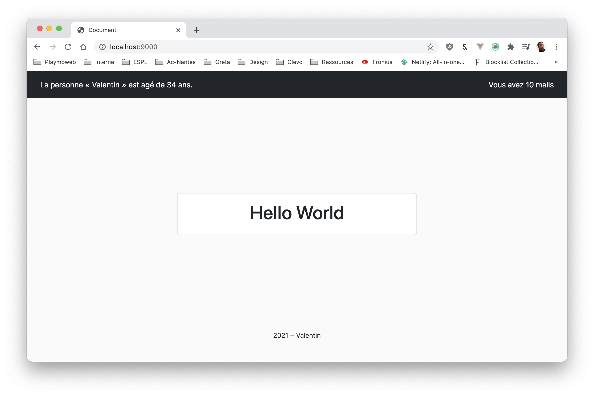
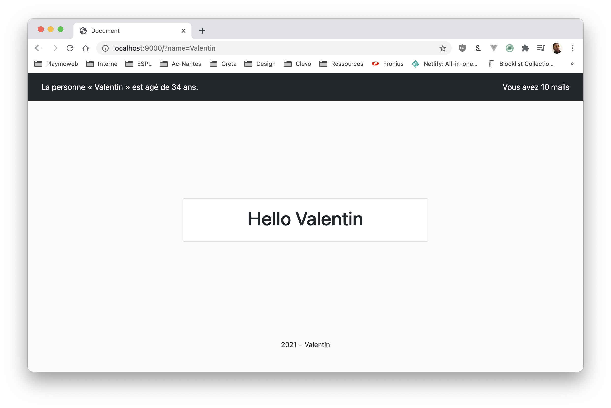

# Utiliser des includes et une librairie

Nous avons vu dans le cours qu'il était possible grace à la fonction PHP `include` d'inclure une page dans une autre. Cette fonction nous permet également d'utiliser des librairies en les incluant dans les différentes pages ou ça est nécessaire.

## Création d'un nouveau projet

Je vous laisse créer un nouveau projet. Ce projet sera constitué pour l'instant de :

- Une page (nommée `index.php`).
- La librairie Bootstrap. [Disponible ici](https://getbootstrap.com/docs/5.0/getting-started/introduction/)
- Un header avec dedans une [NavBar](https://getbootstrap.com/docs/5.0/components/navbar/).
- Un Footer (avec l'année actuelle `<?php echo date('Y'); ?>`)

## Utiliser les includes pour l'organisation

En reprenant [les propositions faites dans le cours](/tp/php/support.md#le-code) réorganisez votre code pour le séparer dans différents fichiers.

## La librairie

J'ai travaillé pour vous ! Je vous propose une super librairie. Celle-ci intègre quelques fonctions (utile ou non) que nous allons pouvoir utiliser dans notre page.

La librairie est [disponible à l'adresse suivante](/demo/php/library/sample.php)

Je vous laisse télécharger la librairie et la mettre dans votre projet.

::: tip N'oubliez pas le rangement
Essayer de vous organiser _correctement_, je vous propose de mettre le fichier dans un dossier par exemple `lib`.
:::

## Utiliser la librairie

Pour utiliser la librairie **il suffit** de l'inclure dans la page. Nous avons dans ce projet qu'une seule page, il faut donc écrire _en haut_ de votre fichier `index.php` :

```php
<?php
    include('lib/sample.php');
?>
```

À partir de cette instance, nous avons accès maintenant à l'ensemble des fonctions présent dans le fichier. Mais quelles sont ces fonctions ?

Pour connaitre les fonctions, il n'y a pas de miracle. Il faut lire la documentation ! Celle-ci est <a target="_blank" href="/demo/php/library/phpdoc/build/index.html">disponible ici</a>

::: details Voilà la liste des fonctions disponible

- isChristmas
- daysBeforeChristmas
- isDecember
- getOrDefault
- postOrDefault
- formatIdentity
- mailCountFormat

<a target="_blank" href="/demo/php/library/phpdoc/build/index.html">Voir la documentation complete</a>

:::

## Utiliser les fonctions

Afin de tester les différentes fonctionnalités, je vous propose de réaliser les éléments suivants :

- À gauche de la dans la Toolbar, afficher votre identité (fonction `formatIdentity`).
- À droite de la Toolbar, afficher un nombre d'emails (fonction `mailCountFormat`).
- Dans votre page, afficher dans une card le nombre de jours avant Noël (fonction `daysBeforeChristmas`).
- Votre page doit afficher un fond « sapin de Noël » si nous sommes au mois de décembre.
- Votre page doit afficher un fond « père Noël » si nous sommes le jour de Noël.
- Au **milieu de votre page** afficher une `,card`, le contenu de cette, `card` doit-être :
  - `Hello $prenom`, la valeur `$prenom` **doit venir** d'un paramètre `GET`.
  - Si aucune valeur n'est présente dans le paramètre `GET` vous devez afficher `world` (fonction `getOrDefault`)
  - Le lien d'accès sera donc `index.php?prenom=Valentin`

Voilà à quoi ça va ressembler :



