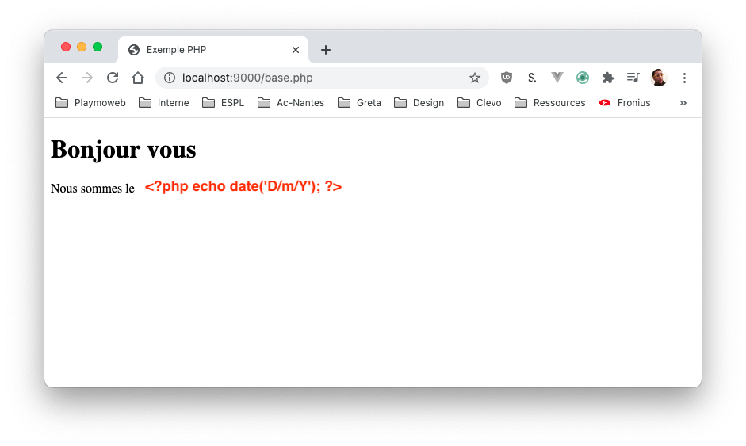

# Créer ma première page web

Dans ce TP nous allons créer votre première page PHP. Rassurez-vous, elle sera très simple, pas très jolie… Mais elle nous permettra de voir les concepts de bases.

## Introduction

Je vous disais [tout à l'heure](./support.html#et-le-php-dans-tout-ca) que nous avions un texte « à trou », c'est littéralement le cas. Nous allons pouvoir mettre du PHP **partout** dans notre page pour rendre certaines parties **dynamique**

Exemple avec le script de démo (le même que tout à l'heure):

```php
<!DOCTYPE html>
<html lang="en">
<head>
    <title>Exemple PHP</title>
</head>
<body>
    <h1>Bonjour vous</h1>
    <p>Nous sommes le <?php echo date("d/m/Y") ?></p>
</body>
</html>
```

Nous pouvons donc le visualiser tels que :



Ce qui donnera après traitement de la part de votre serveur :


## C'est à vous

Je vous laisse tester le code précédent dans votre navigateur :

- Créer un nouveau fichier dans le dossier `www` de wamp nommée `index.php`. (:hand: noté que le fichier n'est plus un `.html` mais un fichier `.php`)
- Accéder à votre serveur web : http://localhost/index.php

## Les balises

En regardant le code nous avons plusieurs, nouveaux éléments :

- Les balises PHP : `<?php … ?>`.
- Un mot `echo`.
- Une fonction Date.

### Les balises PHP

Les balises PHP ont pour but d'indiquer « au moteur PHP » les endroits qu'il doit exécuter. Lors de la lecture de fichier, partout ou vous avez mis des `<?php /* … */ ?>` sera remplacé par « une exécution de code.

Vous allez donc pouvoir mettre dans votre code :

```php
<?PHP ?>
```

ou encore

```php
<?PHP
/**
 * Votre code ICI
 *
 *
 *
 *
 * */
?>
```

Il n'y a pas de limite à la longueur de votre code PHP.

::: tip Astuce de pro
Nous avons la possibilité de mettre du code en commentaires en PHP. Du code en commentaire est du code qui ne sera **pas exécuté par notre serveur**. En PHP plusieurs notations sont possibles:

```php
// Commentaire sur une seule ligne

ou

/* Votre commentaire à placer n'importe où */

ou

/**
 * Votre commentaire
 * sur plusieurs lignes
 * Pratique pour donner le but d'un fichier par exemple.
 **/
```

:::

### echo ? sierra tango papa

Aaah le mot-clé `echo` vous allez l'aimer ! Sans celui-ci votre code PHP n'affichera rien à l'utilisateur.

Exemple concret sans le echo:

```php
<!DOCTYPE html>
<html lang="en">
<head>
    <title>Exemple PHP</title>
</head>
<body>
    <p>Nous sommes le <?php date("d/m/Y") ?></p>
</body>
</html>
```

::: tip Je vous laisse tester
Tester le code suivant, vous allez voir… sans le echo aucun signe de la date
:::

### La fonction date

La fonction date est l'une des nombreuses fonctions disponibles **de base** dans PHP. Cette fonction permet de formater la date que nous lui passons en paramètre. Si il n'y a aucun paramètre ? Et bien ça prend **now()** soit **maintenant**.

Dans notre cas : `date("d/m/Y")` affiche la date actuelle avec un format « français ».

[En savoir plus sur la fonction date](https://www.php.net/manual/en/function.date.php)

### À faire

Dans l'exemple, je vous laisse modifier la date pour en changer le format **et** ajouter l'heure.

## Allons plus loin

Je vous le disais au début… Nous pouvons mettre du PHP partout dans notre code. La seule contrainte pour que celui-ci soit affiché? Qu'il contienne une ou plusieurs fois le mot echo.

::: warning Attention au « ; »
Attention en PHP chaque instruction doit-être terminé par un `;`. Si vous l'oubliez votre script sera en `erreur`.
:::

Voilà le code source d'un second script PHP :

```php
<!DOCTYPE html>
<html lang="en">
<head>
    <title><?php echo date('H:i:s'); ?></title>
</head>
<body>
    <h1>Bonjour <?php echo "valentin"; ?></h1>
    <?php
        /**
         * J'affiche du code HTML depuis le PHP
         **/
        echo "Je suis une page écrite en PHP, <strong>avec du texte statique</strong>, mais dynamique";
    ?>
</body>
</html>
```


Nous avons donc un code HTML et du code PHP entremêlé. Il possible de mettre du texte dans du code PHP, du texte sans fonction PHP rien… **Je vous déconseille vivement** de le faire ! Ça n'a aucun intérêt et en plus vous faites travailler inutilement votre serveur PHP.

:hand: Réservé vos balises PHP pour du code dynamique.

::: tip Astuce de pro
Votre code PHP ne sera jamais envoyé au client. Il est exécuté sur le serveur, seul le résultat est reçu par votre client.
:::

### C'est à vous

Je vous laisse tester le code précédent. Modifiez-le pour y mettre vos informations.

:eye: Regarder à l'aide de votre navigateur le code reçu du serveur :eye:

::: danger Ha oui j'oubliai

Il est possible également de faire un fichier entièrement en PHP qui ne retourne que du HTML :

```php
<?php
echo '
<!DOCTYPE html>
<html lang="en">
<head>
    <title>Ma page</title>
</head>
<body>
    <h1>Bonjour Valentin</h1>
</body>
</html>
';
```

Bien évidement en

**AUCUN CAS VOUS NE DEVEZ FAIRE ÇA !**

:::
