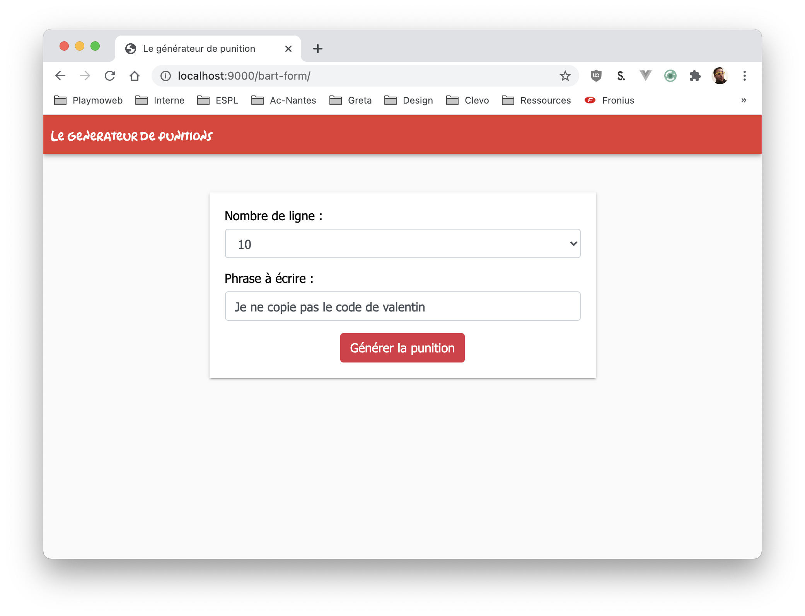
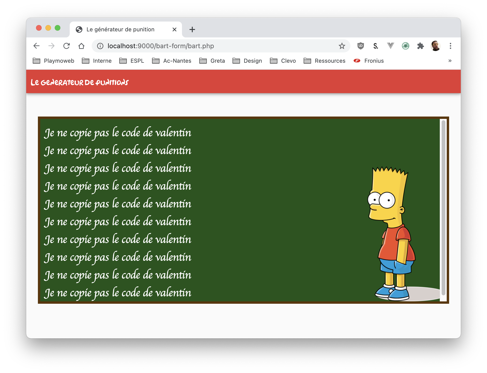

# Jouer avec les formulaires

Faire des sites « statiques » c'est bien… Mais c'est mieux si nous pouvions échanger un peu avec notre utilisateur. La première étape de l'échange va passer par la construction de formulaire pour récolter des informations utilisateurs.

## Introduction

Dans le TP [précédent](./tp1.1.md) nous avons vu comment créer une page dynamique avec la punition de Bart… Mais la page était cependant très statique, à chaque chargement les valeurs sont identiques. Dans ce TP nous allons dynamiser tout ça :

- Plusieurs pages
- Nombre de lignes dynamiques.
- Phrase personnalisable.

::: tip N'oubliez pas
Nous avons précédemment complété le projet avec une fonction et un include. Nous repartirons donc de cette version.
:::

## Structuration du projet

Nous allons retoucher votre site pour ajouter quelques éléments « de navigation », nous allons donc :

- Créer une page d'accueil (`index.php`).
- Créer une « toolbar » permettant de revenir à l'accueil.
- Créer une page de résultat (`bart.php`) qui affichera le tableau avec les choix de l'utilisateur.

::: tip
Nous allons bien évidemment structurer nos dossiers et notre architecture comme vue précédemment. C'est-à-dire en utilisant autant qu'il semble nécessaire la mécanique d'`include` (`common/functions.php`, `common/header.php` etc…)
:::

## La structure

Le projet final va ressembler à :

<iframe width="560" height="315" src="https://www.youtube.com/embed/3OydDaemW-0" frameborder="0" allow="accelerometer; autoplay; clipboard-write; encrypted-media; gyroscope; picture-in-picture" allowfullscreen></iframe>

## La page avec le formulaire (index.php)

La page `index.php` va afficher le formulaire, celui-ci permettra à l'utilisateur de choisir :

- La taille de la punition.
- La phase à écrire sur le tableau

Voilà à quoi celle-ci doit ressembler :



### Le formulaire

Cette page va contenir le formulaire, comme vu ensemble dans le cours de formulaire nous permettra de recueillir le choix de l'utilisateur. Une fois ce choix soumis au serveur via l'action votre page de traitement `bart.php` affichera le résultat de la demande.

Pour rappel le minimum nécessaire pour faire votre formulaire est :

```html
<form action="bart.php" method="post">
  <input type="submit" value="Punir !" />
</form>
```

::: warning Un instant
N'oubliez pas de regarder ma proposition de design. Le choix du nombre de phrase n'est pas libre, il s'agit d'un `select` HTML.
:::

## La page « résultat » (bart.php)

La page `bart.php` va contenir la logique d'affichage de votre projet, elle va se charger :

1 - Prendre les valeurs en provenance du `$_POST`.
2 - Afficher les valeurs reçues sur le tableau de Bart (de manière identique à précédemment).
3 - Permettre à l'utilisateur de revenir sur la page d'accueil via la `toolbar`.



### Affichage

Pour l'affichage nous allons utiliser les valeurs en provenance de votre formulaire, celles-ci seront reçues dans la variable super-globales `$_POST`.

Cette variable est un tableau, nous y accédons donc via `un clé`, exemple :

```php
# La valeur du champ suivant (nommé phrase):
<input type="text" name="phrase">

# Sera accessible dans :
$_POST["phrase"];

# Et pourra être affiché avec :
echo $_POST["phrase"];
```

::: tip Astuce rapide

Vous ne savez pas ce que contient `$_POST` ?

Vous pouvez facilement afficher **temporairement** son contenu avec la ligne de code suivante:

```php
echo "<pre>" . print_r($_POST) . "</pre>";
```

:::

En vous inspirant du code précédent et du code que vous avez déjà fait. Écrire le code permettant d'afficher la phrase choisi par l'utilisateur autant de fois que celui-ci le souhaite.

### Valeur par défaut

Votre page est maintenant fonctionnelle. BRAVO ! Cependant… Si vous accédez directement à la page `bart.php` (sans passer par le formulaire), celle-ci n'affiche rien… C'est dommage !

Je vous propose de modifier ça avec des conditions (`if`). Voilà un exemple de condition :

```php
<?php
$phrase = "Je ne copie pas le code de valentin";

if(isset($_POST['phrase'])){
    $phrase = $_POST['phrase'];
}

echo $phrase;
```

::: tip un doute sur quelque chose ?
`isset` nous ne l'avons jamais vu celui-ci ? Pas grave [pour plus d'information le bon réflexe la documentation](https://www.php.net/manual/en/function.isset.php)
:::

Avec cet exemple de code et les informations que nous avons vus ensemble. Je pense que vous serez capable d'écrire seule le code permettant d'afficher la page `bart.php` même sans les données du formulaire.

### Allons plus loin

Vous n'aimez pas Bart ? Je vous propose d'ajouter la sélection du type de personnage sur le formulaire :

- Ajouter un `select` avec dedans (bart, leela, lisa, ou autre…).
- Trouver les images pour l'affichage.
- Utiliser la valeur obtenue dans le `$_POST` pour afficher la bonne personne.

:hand: Je ne vous donne pas plus d'information! Avec ce que nous avons vu ensemble vous pouvez y arriver seule.
