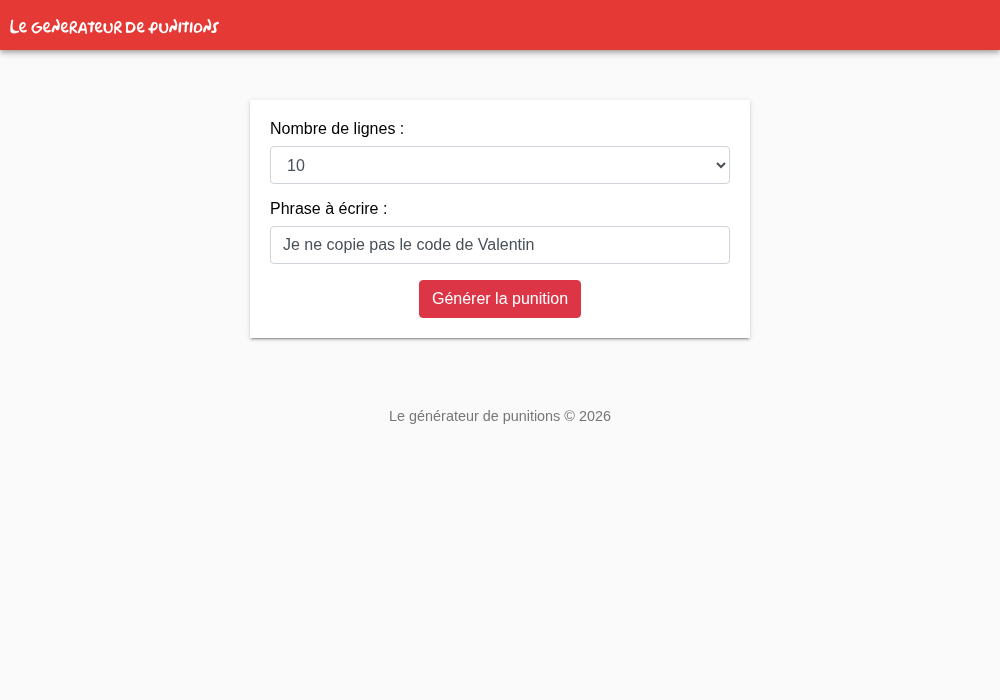
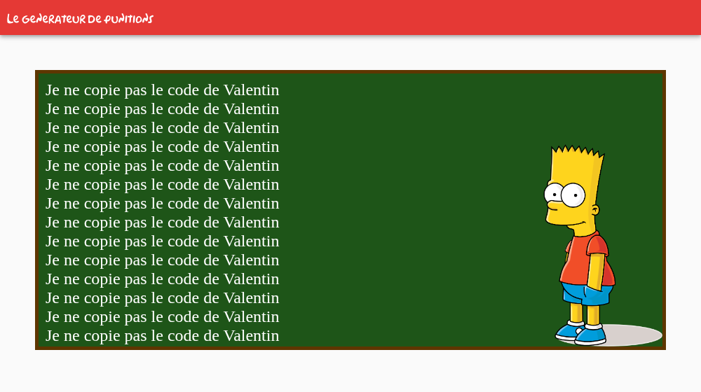
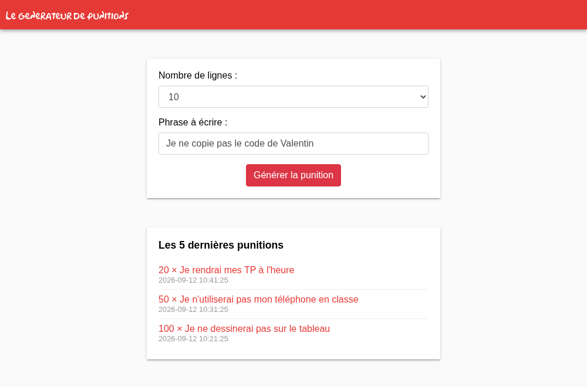
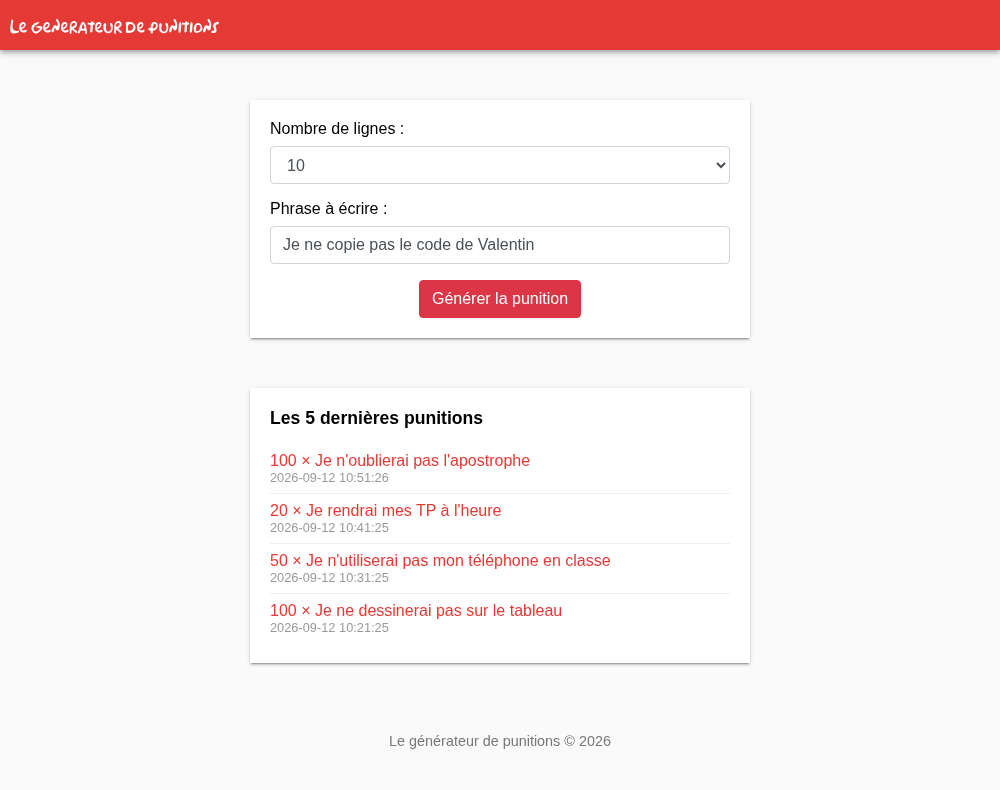

# Les formulaires et la première table

::: details Sommaire
[[toc]]
:::

Dans le [TP précédent](./tp1.2.md) nous avons rangé le générateur de punitions de Bart avec des `include` et une fonction. Mais la page reste figée : c'est **vous** qui décidez de la phrase et du nombre de lignes, directement dans le code.

Dans ce TP nous allons faire deux choses, dans la même séance :

1. **Demander à l'utilisateur** ce qu'il veut écrire, avec un formulaire (`$_POST`).
2. **Garder une trace** de ses punitions, dans une base de données (votre première table !).

Dans ce TP, je vous invite à avoir en parallèle :

- [Le complément du cours PHP, partie formulaires](./support.md#les-formulaires)
- [Le complément PHP et base de données](./sql/support.md)
- [L'aide mémoire PHP](/cheatsheets/php/)

## Les slides

Avant de commencer, un tour rapide des compétences du jour : GET ou POST, `$_POST`, la connexion PDO, le `SELECT` et l'`INSERT` préparé.

<ClientOnly>
<SlidesDeck src="php_tp2" />
</ClientOnly>

## Prérequis

Pour travailler confortablement, il vous faut :

- **XAMPP ou WAMP démarré**, avec cette fois **Apache ET MySQL** (le petit bouton « Start » à côté de MySQL, celui que vous n'aviez jamais utilisé jusqu'ici 😉).
- **phpMyAdmin** accessible, en général sur [http://localhost/phpmyadmin](http://localhost/phpmyadmin).
- Le projet du générateur de Bart des TP précédents ([TP 1.1](./tp1.1.md) et [TP 1.2](./tp1.2.md)).

::: details Rattrapage : vous n'avez plus le projet Bart ?
Pas de panique. Créez un dossier `bart` dans votre `htdocs` avec, pour l'instant :

- Une page `index.php`.
- Un dossier `public/` avec votre feuille de style `main.css` et l'image de Bart.
- Un dossier `common/` avec `header.php` et `footer.php`.

Si vous n'avez pas de CSS sous la main, celle utilisée pour les captures de ce TP est fournie plus bas, dans l'étape 1.
:::

## Objectifs

À la fin de ce TP vous saurez :

- Écrire un formulaire HTML et récupérer la saisie de l'utilisateur avec `$_POST`.
- Prévoir une valeur par défaut avec `isset` quand la donnée n'arrive pas.
- Créer une base de données et une table dans phpMyAdmin à partir d'un script SQL.
- Connecter votre projet PHP à cette base avec PDO (`utils/db.php`).
- Lire des lignes (`SELECT`, `query`, `fetchAll`) et les afficher avec un `foreach`.
- Enregistrer une saisie utilisateur **sans risque** avec une requête préparée (`prepare` et `execute`).

## Première partie : le formulaire

Nous commençons par la partie « visible » : demander son choix à l'utilisateur.

### Étape 1 : la structure du projet

Notre projet va maintenant contenir **deux pages** :

- `index.php` : la page d'accueil, avec le formulaire.
- `bart.php` : la page de résultat, qui affiche le tableau.

Et comme nous savons faire des `include`, les éléments communs restent dans `common/`. Voilà l'organisation visée :

```text
bart/
├── index.php
├── bart.php
├── common/
│   ├── header.php
│   ├── footer.php
│   └── functions.php
└── public/
    ├── main.css
    └── img/
        └── bart.png
```

Le fichier `common/header.php` contient tout le haut de la page (jusqu'à la barre rouge, la « toolbar ») et `common/footer.php` tout le bas :

```php
<!-- common/header.php -->
<!DOCTYPE html>
<html lang="fr">

<head>
    <meta charset="UTF-8">
    <meta name="viewport" content="width=device-width, initial-scale=1.0">
    <title>Le générateur de punition</title>
    <link rel="stylesheet" href="./public/main.css">
</head>

<body>

    <header>
        <a href="index.php">Le generateur de punitions</a>
    </header>
```

```php
<!-- common/footer.php -->
    <footer>
        Le générateur de punitions &copy; <?php echo date('Y'); ?>
    </footer>

</body>

</html>
```

::: tip La toolbar
Le lien dans le `header` est important : il permet de **revenir à l'accueil** depuis la page de résultat. Comme il est dans l'include, il est présent sur toutes vos pages, sans le recopier.
:::

Et la fonction du TP précédent trouve sa place dans `common/functions.php` :

```php
<?php
// Affiche la phrase autant de fois que demandé.
function displayPunition(string $phrase, int $count): void
{
    for ($i = 0; $i < $count; $i++) {
        echo htmlspecialchars($phrase) . '<br />';
    }
}
```

Le `htmlspecialchars` peut vous surprendre : c'est une sécurité minimale, nous y revenons dans la seconde partie. Retenez pour l'instant qu'il rend inoffensif le texte saisi par un visiteur.

::: details Besoin d'aide pour la CSS ?
C'est la feuille de style utilisée pour les captures de ce TP. Elle n'est pas l'objectif du TP, prenez-la telle quelle dans `public/main.css` si la vôtre ne vous convient pas.

<a target="_blank" href="/demo/php/bart/bart-form-sql.zip">Télécharger le projet complet du TP (CSS, image et code)</a>
:::

### Étape 2 : la page d'accueil et son formulaire (index.php)

La page `index.php` affiche le formulaire. Celui-ci permet de choisir :

- Le **nombre de lignes** de la punition (une liste déroulante, pas une saisie libre).
- La **phrase** à écrire au tableau.

Voilà le code complet, prenez le temps de le lire :

```php
<?php include('common/header.php'); ?>

<div class="card">
    <form action="bart.php" method="post">
        <div class="form-group">
            <label for="count">Nombre de lignes :</label>
            <select name="count" id="count" class="form-control">
                <option value="10">10</option>
                <option value="20">20</option>
                <option value="50">50</option>
                <option value="100">100</option>
                <option value="1000">1000</option>
            </select>
        </div>

        <div class="form-group">
            <label for="phrase">Phrase à écrire :</label>
            <input type="text" class="form-control" name="phrase" id="phrase" value="Je ne copie pas le code de Valentin">
        </div>

        <input type="submit" value="Générer la punition" class="btn btn-danger ma-auto">
    </form>
</div>

<?php include('common/footer.php'); ?>
```

Trois attributs à retenir, ce sont **toujours** les mêmes :

| Attribut | Rôle                                                                 |
| -------- | -------------------------------------------------------------------- |
| `action` | La page qui **reçoit** les données (ici `bart.php`).                  |
| `method` | La façon d'envoyer : `get` ou `post`.                                 |
| `name`   | Le **nom de la donnée**, c'est lui que vous retrouverez côté serveur. |

::: tip Pourquoi POST et pas GET ?
Avec `get`, la saisie passe dans l'URL (`bart.php?phrase=...`), elle est visible, limitée en taille et conservée dans l'historique du navigateur. Pour un formulaire, prenez l'habitude du `post`, c'est [expliqué dans le complément de cours](./support.md#les-formulaires).
:::

::: tip Point de contrôle
Ouvrez `http://localhost/bart/index.php`, vous devez obtenir :



Cliquez sur le bouton : vous arrivez sur `bart.php`, qui n'existe pas encore. C'est normal, c'est l'étape suivante.
:::

### Étape 3 : la page de résultat (bart.php)

La page `bart.php` reçoit les valeurs du formulaire et affiche le tableau, comme au TP 1.1.

Les valeurs saisies arrivent dans la super-globale `$_POST`. C'est un **tableau associatif** : la clé est l'attribut `name` de votre champ.

```php
// Le champ suivant (nommé phrase) :
<input type="text" name="phrase">

// Sera accessible dans :
$_POST['phrase'];

// Et pourra être affiché avec :
echo $_POST['phrase'];
```

::: tip Vous ne savez pas ce que contient $_POST ?
Affichez-le **temporairement** en haut de votre page :

```php
echo "<pre>";
print_r($_POST);
echo "</pre>";
```

C'est le réflexe numéro 1 quand « ça ne marche pas » : regarder ce que l'on reçoit vraiment.
:::

À vous de jouer : écrivez `bart.php` pour qu'elle affiche la phrase choisie autant de fois que demandé, en réutilisant le header, le footer et la fonction `displayPunition`.

::: details Voir l'une des solutions possibles

```php
<?php
include('common/functions.php');

$phrase = $_POST['phrase'];
$count = $_POST['count'];
?>
<?php include('common/header.php'); ?>

<div class="tableau">
    <?php displayPunition($phrase, $count); ?>
</div>

<?php include('common/footer.php'); ?>
```

:::

::: tip Point de contrôle
Remplissez le formulaire, validez, et vous devez obtenir votre tableau :


:::

### Étape 4 : les valeurs par défaut

Votre page fonctionne, bravo ! Mais tapez directement `http://localhost/bart/bart.php` dans la barre d'adresse, **sans passer par le formulaire** : PHP vous affiche un avertissement `Undefined array key "phrase"` et la page est vide. C'est dommage.

La raison est simple : sans formulaire soumis, il n'y a **rien** dans `$_POST`. Il faut donc prévoir le coup avec une condition et la fonction `isset` :

```php
<?php
$phrase = "Ceci est une phrase d'exemple";

if (isset($_POST['phrase'])) {
    $phrase = $_POST['phrase'];
}
```

On lit ce code de haut en bas : « je pose une valeur par défaut, **et si** le formulaire m'a envoyé quelque chose, je la remplace ».

::: tip Un doute sur isset ?
`isset($_POST['phrase'])` répond juste à la question « cette case existe-t-elle dans le tableau ? ». Le bon réflexe reste [la documentation officielle](https://www.php.net/manual/fr/function.isset.php).
:::

Je vous laisse appliquer la même logique aux **deux** valeurs (`phrase` et `count`) dans `bart.php`.

::: details Voir l'une des solutions possibles

```php
<?php
include('common/functions.php');

// Les valeurs reçues du formulaire (avec une valeur par défaut)
$phrase = "Ceci est une phrase d'exemple";
if (isset($_POST['phrase'])) {
    $phrase = $_POST['phrase'];
}

$count = 3;
if (isset($_POST['count'])) {
    $count = $_POST['count'];
}
?>
<?php include('common/header.php'); ?>

<div class="tableau">
    <?php displayPunition($phrase, $count); ?>
</div>

<?php include('common/footer.php'); ?>
```

:::

::: tip Point de contrôle
`bart.php` appelée directement affiche maintenant 3 lignes d'exemple, sans aucun avertissement PHP.
:::

## Seconde partie : la première table

Faites une punition, puis rechargez la page d'accueil. Où est passée votre punition ? **Nulle part.** Chaque chargement de page repart de zéro : les variables PHP meurent à la fin du script.

Pour garder une trace, il nous faut un endroit où **ranger les données durablement** : une base de données.

::: tip Ce que nous allons faire (et ne pas faire)
La modélisation (le MCD, les cardinalités) et le langage SQL, c'est le cours de votre professeur de base de données. Ici, nous appliquons : **exécuter depuis PHP** des requêtes qui vous sont données. Je vous fournis donc la table et les requêtes, votre travail est de les brancher au bon endroit dans le code.
:::

### Étape 5 : créer la base et la table

Ouvrez phpMyAdmin ([http://localhost/phpmyadmin](http://localhost/phpmyadmin)), puis cliquez sur l'onglet **SQL** en haut. Cette zone permet d'exécuter directement des requêtes SQL.

Copiez-collez le script suivant, puis cliquez sur « Exécuter » :

```sql
-- Base de données du générateur de punitions
CREATE DATABASE IF NOT EXISTS bart CHARACTER SET utf8mb4 COLLATE utf8mb4_general_ci;

USE bart;

CREATE TABLE IF NOT EXISTS phrases (
    id INT AUTO_INCREMENT PRIMARY KEY,
    phrase VARCHAR(255) NOT NULL,
    nombre INT NOT NULL,
    date_creation DATETIME NOT NULL DEFAULT CURRENT_TIMESTAMP
);
```

Quatre colonnes, et c'est tout :

| Colonne         | Rôle                                                                 |
| --------------- | -------------------------------------------------------------------- |
| `id`            | L'identifiant unique, rempli automatiquement (`AUTO_INCREMENT`).      |
| `phrase`        | La phrase saisie par l'utilisateur (255 caractères maximum).          |
| `nombre`        | Le nombre de lignes demandées.                                        |
| `date_creation` | La date et l'heure, remplie **toute seule** au moment de l'insertion. |

::: tip Point de contrôle
Dans la colonne de gauche de phpMyAdmin, une base `bart` est apparue, et dedans une table `phrases`. Cliquez dessus : la table existe, avec ses 4 colonnes, mais elle est **vide**.


:::

Avant de coder, donnons-nous deux ou trois lignes à afficher. Toujours dans phpMyAdmin, sélectionnez la table `phrases`, puis l'onglet **Insérer** : saisissez une `phrase` et un `nombre` (laissez `id` et `date_creation` vides, ils se remplissent seuls), et validez. Recommencez deux fois.

::: details Vous préférez le faire en une seule fois ?
L'onglet SQL accepte aussi ceci, c'est exactement ce que phpMyAdmin fabrique pour vous quand vous utilisez le formulaire « Insérer » :

```sql
INSERT INTO phrases (phrase, nombre) VALUES
    ('Je ne dessinerai pas sur le tableau', 100),
    ('Je n''utiliserai pas mon téléphone en classe', 50),
    ('Je rendrai mes TP à l''heure', 20);
```

:::

::: tip Point de contrôle
Onglet « Parcourir » de la table `phrases` : vos trois lignes sont là, avec un `id` différent pour chacune et une `date_creation` remplie.
:::

### Étape 6 : se connecter à la base depuis PHP

Notre code PHP doit maintenant parler à ce serveur de base de données. En PHP, on utilise **PDO**, il est livré avec PHP, il n'y a rien à installer.

Plutôt que de recopier la connexion dans chaque page, nous l'écrivons **une seule fois** dans un fichier à part. Créez le dossier `utils/` et dedans le fichier `db.php` :

```php
<?php
// Cette partie est à personnaliser
$server = "localhost";
$db = "bart";
$user = "root";
$passwd = "";
// Fin de la partie personnalisable

$dsn = "mysql:host=$server;dbname=$db;charset=utf8mb4";
$pdo = new PDO($dsn, $user, $passwd);
$pdo->setAttribute(PDO::ATTR_ERRMODE, PDO::ERRMODE_EXCEPTION);
```

C'est exactement le code du [complément de cours](./sql/support.md#utils-db-php). Sur XAMPP, l'utilisateur est `root` et le mot de passe est **vide**, ne cherchez pas plus loin.

Il ne reste qu'à l'inclure, **tout en haut** de `index.php` et de `bart.php` :

```php
<?php
include('utils/db.php');
```

À partir de là, la variable `$pdo` est disponible dans la page.

::: tip Que se passe-t-il derrière ?
`new PDO(...)` ouvre une **connexion réseau** vers le serveur MySQL, comme votre navigateur ouvre une connexion vers un site. L'objet `$pdo` est le « tuyau » : toutes vos requêtes passeront par lui, et PHP referme le tuyau tout seul à la fin du script.

`ERRMODE_EXCEPTION` demande à PDO de **crier** quand une requête est fautive, plutôt que d'échouer en silence. Croyez-moi, ça change la vie.
:::

::: details Besoin d'aide pour vérifier la connexion ?
Chargez `index.php`. Si la page s'affiche normalement, la connexion fonctionne. Si vous obtenez une erreur du type `SQLSTATE[HY000] [1049] Unknown database 'bart'`, c'est que le nom de la base ne correspond pas à ce que vous avez créé à l'étape 5. `Connection refused` ? MySQL n'est pas démarré dans XAMPP.
:::

### Étape 7 : afficher les dernières punitions

Nous allons afficher, **sous le formulaire**, les 5 dernières punitions générées. La requête vous est donnée :

```sql
SELECT phrase, nombre, date_creation FROM phrases ORDER BY date_creation DESC LIMIT 5
```

Et côté PHP, cela tient en une ligne. Ajoutez ceci dans `index.php`, juste après l'include de `utils/db.php` :

```php
$sql = "SELECT phrase, nombre, date_creation FROM phrases ORDER BY date_creation DESC LIMIT 5";
$punitions = $pdo->query($sql)->fetchAll(PDO::FETCH_ASSOC);
```

Deux méthodes enchaînées : `query()` envoie la requête, `fetchAll(PDO::FETCH_ASSOC)` récupère **toutes** les lignes.

Avant d'afficher quoi que ce soit de joli, regardons ce que nous avons reçu. Ajoutez **temporairement** dans la page :

```php
<pre><?php print_r($punitions); ?></pre>
```

Vous obtenez quelque chose comme :

```text
Array
(
    [0] => Array
        (
            [phrase] => Je rendrai mes TP à l'heure
            [nombre] => 20
            [date_creation] => 2026-09-12 10:41:25
        )

    [1] => Array
        (
            [phrase] => Je n'utiliserai pas mon téléphone en classe
            [nombre] => 50
            [date_creation] => 2026-09-12 10:31:25
        )

)
```

::: tip Une structure que vous connaissez déjà
C'est un **tableau de tableaux associatifs** : une case par ligne de la table, et dans chaque case le nom des colonnes comme clés. Exactement ce que nous avons manipulé dans [le cours sur les tableaux à plusieurs dimensions](./support.md#a-plusieurs-dimensions). Vous savez donc déjà le parcourir : un `foreach`.
:::

Question : combien de fois la boucle va-t-elle tourner si la table est vide ?

::: details La réponse
Zéro fois, et c'est très bien ainsi. `fetchAll()` renvoie un **tableau vide** quand il n'y a aucun résultat, le `foreach` ne s'exécute simplement pas. Pas d'erreur, pas de page cassée.
:::

Remplacez maintenant le `print_r` par un affichage propre : une liste où chaque ligne affiche « Nombre × phrase ».

::: details Voir l'une des solutions possibles

```php
<div class="card">
    <h2>Les 5 dernières punitions</h2>

    <ul class="punitions">
        <?php foreach ($punitions as $punition) { ?>
            <li>
                <?php echo $punition['nombre']; ?> ×
                <?php echo htmlspecialchars($punition['phrase']); ?>
                <span class="date"><?php echo $punition['date_creation']; ?></span>
            </li>
        <?php } ?>
    </ul>
</div>
```

:::

::: tip Pourquoi htmlspecialchars ?
La phrase a été saisie par un visiteur. Si celui-ci tape `<script>`, votre page l'exécute. `htmlspecialchars` transforme ces caractères en texte inoffensif. C'est systématique dès que vous affichez une donnée venue de l'utilisateur ou de la base.
:::

::: tip Point de contrôle
Votre page d'accueil affiche le formulaire **et** la liste de vos punitions de test :


:::

### Étape 8 : enregistrer la punition

La lecture fonctionne, passons à l'écriture. Dans `bart.php`, **avant** l'affichage du tableau, nous allons ajouter une ligne dans la table.

Ici, les valeurs viennent de l'utilisateur : la requête doit obligatoirement être **préparée**. Voilà le code :

```php
$sql = "INSERT INTO phrases (phrase, nombre) VALUES (?, ?)";
$stmt = $pdo->prepare($sql);
$stmt->execute([$phrase, $count]);
```

En trois temps :

1. `prepare()` envoie le **modèle** de la requête au serveur, avec des `?` à la place des valeurs.
2. `execute([...])` envoie les **valeurs**, dans l'ordre des `?`.
3. Le serveur assemble les deux, sans jamais confondre le code SQL et les données.

:::: danger Jamais de concaténation avec une valeur utilisateur
Vous verrez en ligne des exemples comme `"INSERT INTO phrases (phrase) VALUES ('" . $_POST['phrase'] . "')"`. **Ne faites jamais ça.** La saisie de l'utilisateur se retrouve mélangée à votre code SQL : c'est une **injection SQL**, la faille la plus répandue du web.

Question : que se passe-t-il si quelqu'un tape une apostrophe dans la phrase, par exemple « Je n'oublierai pas l'apostrophe » ?

::: details La réponse
Avec une requête préparée : **rien**, justement. La phrase est enregistrée telle quelle, apostrophe comprise, parce que la valeur ne passe jamais par l'analyseur SQL. Avec une concaténation, l'apostrophe aurait fermé la chaîne SQL et cassé votre requête (au mieux), ou ouvert la porte à une injection (au pire).

Pour approfondir : [les requêtes préparées](./securite/support.md#les-requetes-preparees) et [quand préparer, quand ne pas préparer](./sql/support.md#requete-prepare-ou-requete-normal).
:::

::::

Je vous laisse placer ce code au bon endroit dans `bart.php`. Une précaution en plus : n'enregistrez **que** si la punition vient réellement du formulaire, sinon un simple rafraîchissement de `bart.php` remplirait votre base de phrases d'exemple.

::: details Voir l'une des solutions possibles

```php
<?php
include('utils/db.php');
include('common/functions.php');

// Les valeurs reçues du formulaire (avec une valeur par défaut)
$phrase = "Ceci est une phrase d'exemple";
if (isset($_POST['phrase'])) {
    $phrase = $_POST['phrase'];
}

$count = 3;
if (isset($_POST['count'])) {
    $count = $_POST['count'];
}

// Enregistrement de la punition (uniquement si elle vient du formulaire)
if (isset($_POST['phrase']) && isset($_POST['count'])) {
    $sql = "INSERT INTO phrases (phrase, nombre) VALUES (?, ?)";
    $stmt = $pdo->prepare($sql);
    $stmt->execute([$phrase, $count]);
}
?>
<?php include('common/header.php'); ?>

<div class="tableau">
    <?php displayPunition($phrase, $count); ?>
</div>

<?php include('common/footer.php'); ?>
```

Vous remarquez que nous n'envoyons ni `id` ni `date_creation` : la base les remplit toute seule. C'est le rôle de `AUTO_INCREMENT` et de `DEFAULT CURRENT_TIMESTAMP`.
:::

::: tip Point de contrôle
Générez une punition avec une phrase contenant une apostrophe, puis revenez à l'accueil : elle apparaît **en tête de liste**. Vérifiez aussi dans phpMyAdmin, onglet « Parcourir » de la table `phrases` : la ligne y est, avec sa date.


:::

### Étape 9 : réutiliser une punition

Dernière touche, très pratique : rendre chaque phrase de la liste **cliquable**, pour qu'un clic la remette dans le formulaire.

La logique, vous la connaissez déjà, c'est celle du [passage de paramètres](./tp-param.md) :

- Chaque phrase de la liste devient un lien vers `index.php?phrase=...`.
- En haut d'`index.php`, on récupère `$_GET['phrase']` (avec une valeur par défaut, comme à l'étape 4).
- On place cette valeur dans l'attribut `value` du champ texte.

Deux fonctions vous seront utiles, et elles ne sont pas interchangeables :

- `urlencode($phrase)` dans le **lien** : une phrase contient des espaces et des apostrophes, il faut les coder pour qu'ils survivent à l'URL.
- `htmlspecialchars($phrase)` dans l'attribut **value** : sans lui, une phrase contenant un guillemet ferait exploser votre HTML.

C'est à vous de jouer !

::: details Voir l'une des solutions possibles

Le haut de `index.php` :

```php
<?php
include('utils/db.php');

// La phrase proposée dans le formulaire (modifiable via index.php?phrase=...)
$phrase = "Je ne copie pas le code de Valentin";
if (isset($_GET['phrase'])) {
    $phrase = $_GET['phrase'];
}

// Les 5 dernières punitions enregistrées
$sql = "SELECT phrase, nombre, date_creation FROM phrases ORDER BY date_creation DESC LIMIT 5";
$punitions = $pdo->query($sql)->fetchAll(PDO::FETCH_ASSOC);
?>
```

Le champ du formulaire :

```php
<input type="text" class="form-control" name="phrase" id="phrase" value="<?php echo htmlspecialchars($phrase); ?>">
```

Et la liste :

```php
<ul class="punitions">
    <?php foreach ($punitions as $punition) { ?>
        <li>
            <a href="index.php?phrase=<?php echo urlencode($punition['phrase']); ?>">
                <?php echo $punition['nombre']; ?> ×
                <?php echo htmlspecialchars($punition['phrase']); ?>
            </a>
            <span class="date"><?php echo $punition['date_creation']; ?></span>
        </li>
    <?php } ?>
</ul>
```

:::

::: tip Point de contrôle
Un clic sur une punition de la liste recharge l'accueil avec la phrase **déjà saisie** dans le champ. Regardez l'URL au passage : c'est bien du `GET` cette fois, et c'est normal, il n'y a aucune donnée à protéger.
:::

## Allons plus loin

Vous avez terminé ? Voilà de quoi vous occuper, dans l'ordre que vous voulez.

**Le compteur de punitions.** Affichez sur l'accueil le nombre total de punitions générées depuis le début. La requête :

```sql
SELECT COUNT(*) AS total FROM phrases
```

Attention, cette requête ne renvoie qu'**une seule ligne** : `fetch()` est plus adapté que `fetchAll()`.

::: details Besoin d'aide pour le compteur ?
Coup de pouce : `$total = $pdo->query("SELECT COUNT(*) AS total FROM phrases")->fetch(PDO::FETCH_ASSOC);` puis `echo $total['total'];`.
:::

**Vous n'aimez pas Bart ?** Ajoutez la sélection du personnage dans le formulaire :

- Un `select` avec plusieurs personnages (bart, leela, lisa, ou autre).
- Les images correspondantes dans `public/img/`.
- La valeur reçue dans `$_POST` sert à choisir la bonne image à l'affichage.

✋ Je ne vous donne pas plus d'informations, avec ce que nous avons vu vous pouvez y arriver seul.

**Afficher plus de punitions.** Passez la liste à 20, puis ajoutez un lien « voir les suivantes » (`LIMIT` et `OFFSET`, expliqués dans [le complément SQL](./sql/support.md#obtenir-des-donnees)).

## Conclusion

Belle séance ! Récapitulons ce que vous savez faire maintenant :

- Écrire un formulaire (`action`, `method`, `name`) et lire la saisie dans `$_POST`.
- Toujours prévoir le cas « la donnée n'est pas là » avec `isset` et une valeur par défaut.
- Créer une base et une table depuis phpMyAdmin, à partir d'un script SQL.
- Vous connecter avec PDO grâce à `utils/db.php`, inclus dans vos pages.
- Lire des données (`query` + `fetchAll`) et comprendre ce que vous recevez : un **tableau de tableaux associatifs**.
- Écrire des données avec une requête **préparée** (`prepare` + `execute`), la seule façon acceptable de manipuler une saisie utilisateur.

Votre projet contient maintenant deux pages qui incluent chacune `utils/db.php`, le header et le footer. Ça fonctionne, mais vous voyez sans doute la répétition arriver : chaque nouvelle page devra penser à tout inclure, dans le bon ordre.

Cette structure va donc être réorganisée dès le prochain TP autour d'un **point d'entrée unique** : [Structurer mon code](./tp3.md).

<a target="_blank" href="/demo/php/bart/bart-form-sql.zip">Le projet complet de ce TP est disponible ici</a> (le script `bart.sql` est à la racine de l'archive).

👋 Si vous avez des questions, n'hésitez pas.
