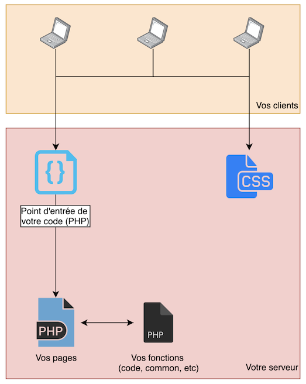
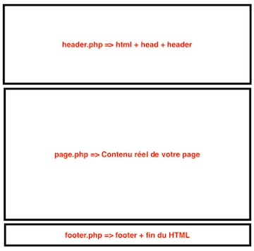

# Structurer mon code

Vous avez écrit du code oui… Mais il n'était pas forcément « bien organisé ». Je vous propose dans ce TP une façon d'organiser votre code qui vous permettra de vous organiser, quelles que soient les évolutions de votre projet.

## Introduction

Comme [je l'indiquai dans le cours](./support.md#la-structure) la structuration du code est un point **très important** voir même je pense central dans votre future métier de développeur informatique. C'est pour ça qui me semble important de créer un TP dédié à cette problématique.

::: tip
La structure que je vais vous proposer dans ce TP n'est évidement pas la réponse universelle. Elle répond à une problématique à un moment donné, il faut l'utiliser et la prendre avec du recule.
:::

Pour réaliser ce TP, nous allons modifier votre projet [« Bart » (celui avec plusieurs page)](./tp2.md)

## La structure

Cette structure repose sur un point d'entrée unique pour l'ensemble des demandes pages. Dans ce point d'entrée, nous gèrerons les éléments communs à toutes les pages :

- La session / cookie.
- Le login utilisateur.
- Connexion à la base de données
- Le routeur.
- Et bien plus encore.

Quelles différences avec avant ? Nous allons « juste » découper un peu plus votre travail. Et nous allons ajouter « un nouveau fichier », que l'on appellera à partir de maintenant le point d'entrée (entry point).

|  |
| :----------------------------------------------: |
|    Représentation visuelle de l'organisation     |

## Créer les dossiers et les fichiers

Je vous laisse créer l'ensemble des dossiers et des fichiers en suivant l'organisation suivante :


::: tip c'est « juste la base »
Dans votre projet vous avez plus de fichiers, notamment des images, c'est fichiers sont à destination du navigateur. Ils sont donc à placer **dans le dossier public**.  
:::

## Le point d'entrée

```php
<?php
// Démarrage de la session
session_start();

// Affichage « de la partie haute » de votre site, commun à l'ensemble de votre site
include('common/header.php');

// Pages autorisées (configuration à sortir dans un autre fichier PHP)
$whitelist = array('home','bart');

// Gestion de l'affichage de la page demandée
if(isset($_GET['page']) && in_array($_GET['page'], $whitelist)) {
  include("pages/" . $_GET['page'] . '.php');
} else {
  include('pages/home.php');
}

// Affichage de la partie basse de votre site, commun à l'ensemble de votre site.
include('common/footer.php');

?>
```

Voilà, nous avons le code de notre « entry-point ». Un peu de détail :

- Le dossier `common` contiendra les éléments communs à l'ensemble de nos pages. (header, footer, fonctions, etc).
- Les pages sont maintenant rangées dans le dossier `pages`.
- La page incluse n'est pas libre ! Afin de sécuriser le code nous limitons l'include uniquement aux pages autorisées.
  - Si aucune page n'est fournie ou si celle-ci n'est pas autorisée, nous chargeons la page `home.php`
  - Les liens entre vous pages seront différents. Ils seront sous la forme : `index.php?page=bart`, `index.php?page=page1`…

## Le Header et le Footer

Contrairement à précédemment nous allons mettre un peu plus de code dans les fichiers `header.php` et `footer.php`. Ils vont maintenant contenir tout le code jusqu'au contenu. Si on découpe grossièrement la page, ça donnera quelque chose comme ça :



Je ne connais pas **votre code**, mais avec le mien ça donne :

_header.php_ :

```php
<!DOCTYPE html>
<html lang="en">

<head>
    <meta charset="UTF-8">
    <meta name="viewport" content="width=device-width, initial-scale=1.0">
    <title>Le générateur de punition</title>
    <link rel="stylesheet" href="./public/main.css">
</head>

<body>
    <header>
        <a href="./">Le generateur de punitions</a>
    </header>
```

_footer.php_ :

```php
<footer> Pied de page du site </footer>
</body>

</html>
```

## Les pages

Pour les pages, je vous laisse faire, c'est « juste le contenu de votre site ». Par exemple dans mon cas le code du fichier `home.php` est uniquement la partie form:

```php
<div class="card">
    <form action="index.php?page=bart" method="post">
        <div class="form-group">
            <label for="count">Nombre de ligne :</label>
            <select name="count" class="form-control">
                <option value="10">10</option>
                <option value="20">20</option>
                <option value="50">50</option>
                <option value="100">100</option>
                <option value="1000">1000</option>
            </select>
        </div>

        <div class="form-group">
            <label for="sentence">Phrase à écrire : </label>
            <input type="text" class="form-control" name="sentence" value="Je ne copie pas le code de valentin">
        </div>

        <input type="submit" value="Générer la punition" class="btn btn-danger ma-auto">
    </form>
</div>
```

::: danger Attention au lien
Comme évoqué dans le cours, le format des liens va changer ! Ils seront maintenant dynamiques via un paramètre `GET`. Pensez donc bien à changer vos différents liens.
:::

## C'est à vous

Je vous laisse modifier votre code pour que votre projet utilise cette nouvelle façon « de s'organiser ».

::: tip Une remarque au passage
Cette façon de s'organiser est une première étape vers ce que nous appellerons pour l'instant une organisation en template. Les templates seront une manière de s'organiser qui nous évitera tout mélange PHP et HTML afin de se simplifier encore plus l'esprit.
:::

## Allons plus loin.

Maintenant que nous avons notre nouvelle structure en place, je vous laisse ajouter une nouvelle page « à propos » dans votre site :

- Créer la page.
- Y mettre un contenu.
- Ajouter un lien dans le pied de page.
- Faire en sorte de pouvoir accéder à la page.
