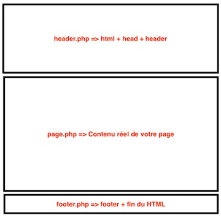
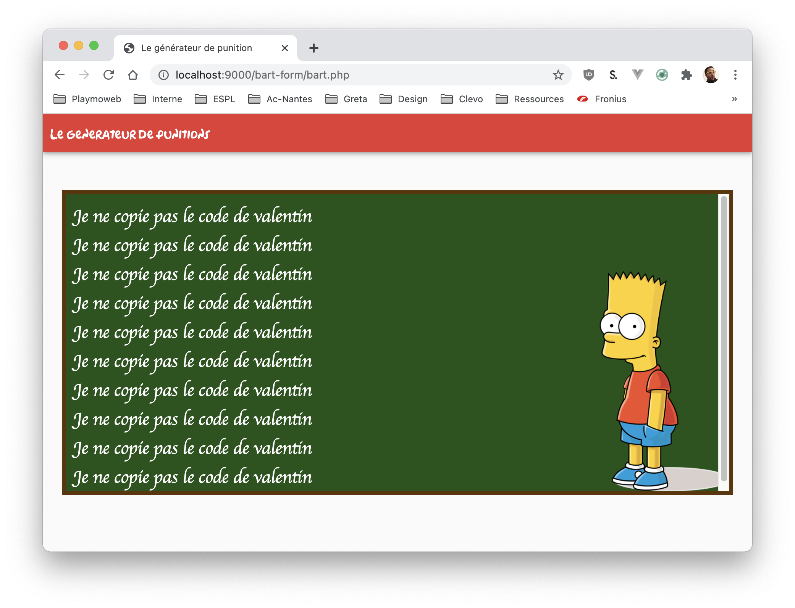

# Structurer mon code

Vous avez écrit du code oui… Mais il n'était pas forcément « bien organisé ». Je vous propose dans ce TP une façon d'organiser votre code qui vous permettra de vous organiser, quelles que soient les évolutions de votre projet.

::: details Sommaire
[[toc]]
:::

## Les slides

Avant de commencer, un tour rapide des compétences du jour : l'entry-point, le `?page=` et la whitelist.

<ClientOnly>
<SlidesDeck src="php_tp3" />
</ClientOnly>

## Introduction

Comme [je l'indiquai dans le cours,](./support.md#la-structure) la structuration du code est un point **très important** voir même je pense central dans votre futur métier de développeur informatique. C'est pour ça qui me semble important de créer un TP dédié à cette problématique.

::: tip
La structure que je vais vous proposer dans ce TP n'est évidemment pas la réponse universelle. Elle répond à une problématique à un moment donné, il faut l'utiliser et la prendre avec du recule.
:::

Pour réaliser ce TP, nous allons modifier votre projet [« Bart » du TP 2](./tp2.md), celui qui enregistre déjà les punitions dans la base de données `bart`.

Vous partez donc d'un projet qui contient :

- `index.php` : le formulaire et la liste des 5 dernières punitions.
- `bart.php` : l'enregistrement de la punition (`INSERT` préparé) puis l'affichage du tableau.
- `utils/db.php` : la connexion PDO.
- `common/header.php`, `common/footer.php`, `common/functions.php`.
- `public/main.css` (et les images).

::: tip Vous n'avez pas terminé le TP 2 ?
Pas de panique, [récupérez le projet complet ici](/demo/php/bart/bart-form-sql.zip). Le script `bart.sql` est dans l'archive, importez-le dans phpMyAdmin (onglet SQL) avant de commencer.
:::

## La structure

Cette structure repose sur un point d'entrée unique pour l'ensemble des demandes pages. Dans ce point d'entrée, nous gèrerons les éléments communs à toutes les pages :

- La session / cookie.
- Le login utilisateur.
- Connexion à la base de données
- Le routeur.
- Et bien plus encore.

Quelles différences avec avant ? Nous allons « juste » découper un peu plus votre travail. Et nous allons ajouter « un nouveau fichier », que l'on appellera à partir de maintenant le point d'entrée (entry point).

|  |
| :----------------------------------------------: |
|    Représentation visuelle de l'organisation     |

## Créer les dossiers et les fichiers

Je vous laisse créer l'ensemble des dossiers et des fichiers en suivant l'organisation suivante :


Dans notre cas, avec la base de données, ça donne :

```txt
index.php          <= le point d'entrée (le seul fichier appelé par le navigateur)
.htaccess
common/header.php
common/footer.php
common/functions.php
pages/home.php     <= l'ancien index.php (le formulaire et la liste)
pages/bart.php     <= l'ancien bart.php (l'INSERT et le tableau)
utils/db.php
public/main.css
```

::: tip c'est « juste la base »
Dans votre projet vous avez plus de fichiers, notamment des images, ces fichiers sont à destination du navigateur. Ils sont donc à placer **dans le dossier public**.  
:::

## Le point d'entrée

```php
<?php
// Le tampon de sortie (nous l'expliquons juste en dessous)
ob_start();

// Le démarrage de la session (nous l'expliquons au TP 4)
session_start();

// La connexion à la base de données, une seule fois pour tout le site
include('utils/db.php');

// Les fonctions communes du site
include('common/functions.php');

// La partie haute du site, commune à toutes les pages
include('common/header.php');

// Les pages autorisées
$whitelist = ['home', 'bart', 'about'];

// L'affichage de la page demandée
if (isset($_GET['page']) && in_array($_GET['page'], $whitelist)) {
    include('pages/' . $_GET['page'] . '.php');
} else {
    include('pages/home.php');
}

// La partie basse du site, commune à toutes les pages
include('common/footer.php');
```

Voilà, nous avons le code de notre « entry-point ». Un peu de détail :

- Le dossier `common` contiendra les éléments communs à l'ensemble de nos pages. (header, footer, fonctions, etc).
- Les pages sont maintenant rangées dans le dossier `pages`.
- `include('utils/db.php')` est écrit **une seule fois pour tout le site** : c'est tout l'intérêt du point d'entrée. Vos pages n'ont plus à se soucier de la connexion, la variable `$pdo` est déjà là quand elles sont incluses.
- La page incluse n'est pas libre ! Afin de sécuriser le code nous limitons l'include uniquement aux pages autorisées.
  - Si aucune page n'est fournie ou si celle-ci n'est pas autorisée, nous chargeons la page `home.php`
  - Les liens entre vous pages seront différents. Ils seront sous la forme : `index.php?page=bart`, `index.php?page=about`…

::: tip Que se passe-t-il derrière avec ob_start() ?

`ob_start()` démarre un **tampon de sortie** (output buffering) : au lieu d'envoyer immédiatement au navigateur tout ce que vous affichez, PHP le garde de côté et l'envoie à la toute fin.

Pourquoi ? Parce qu'une réponse HTTP commence toujours par ses **en-têtes** (headers), puis le contenu. Dès qu'un seul caractère est affiché, les en-têtes sont partis, et il devient impossible d'en ajouter un. Or nous en aurons besoin dès le TP 4 pour rediriger le visiteur avec `header('location: …')`, alors que le `header.php` est déjà affiché.

Avec `ob_start()` en toute première ligne, rien n'est réellement envoyé avant la fin du script : la redirection reste possible. C'est une ligne que vous garderez dans tous vos projets.

:::

::: tip La session ?
Oui, il y a aussi un `session_start()`. Nous ne l'utilisons pas encore, mais il ne coûte rien et nous l'exploiterons au [TP 4](./tp4.md). Retenez simplement qu'il doit être appelé **avant tout affichage**, donc ici, tout en haut.
:::

## Le Header et le Footer

Contrairement à précédemment nous allons mettre un peu plus de code dans les fichiers `header.php` et `footer.php`. Ils vont maintenant contenir tout le code jusqu'au contenu. Si on découpe grossièrement la page, ça donnera quelque chose comme ça :



Je ne connais pas **votre code**, mais avec le mien ça donne :

_header.php_ :

```php
<!DOCTYPE html>
<html lang="fr">

<head>
    <meta charset="UTF-8">
    <meta name="viewport" content="width=device-width, initial-scale=1.0">
    <title>Le générateur de punition</title>
    <link rel="stylesheet" href="./public/main.css">
</head>

<body>

    <header>
        <a href="index.php?page=home">Le generateur de punitions</a>
    </header>
```

_footer.php_ :

```php
    <footer>
        <a href="index.php?page=about">À propos</a>
        &middot;
        Le générateur de punitions &copy; <?php echo date('Y'); ?>
    </footer>

</body>

</html>
```

::: details La partie CSS

La feuille de style est celle du TP 2, vous n'avez rien à changer. Si vous l'avez perdue, elle est dans [l'archive du TP 2](/demo/php/bart/bart-form-sql.zip) (`public/main.css`).

Pour la police d'écriture « Simpson », vous pouvez la [télécharger ici](https://www.dafont.com/simpsonfont.font) et la placer dans le dossier `public`.

Une seule petite règle à ajouter, pour le lien du pied de page :

```css
footer a {
  color: #e53935;
}
```

:::

## Les pages

Pour les pages, je vous laisse faire, c'est « juste le contenu de votre site ». Le contenu de votre ancien `index.php` devient `pages/home.php`, et celui de votre ancien `bart.php` devient `pages/bart.php`.

Attention à deux choses : le `include('utils/db.php')` et les `include` du header et du footer **disparaissent de vos pages** (ils sont dans le point d'entrée maintenant), et l'action du formulaire change.

_pages/home.php_ (la partie formulaire) :

```php
<div class="card">
    <form action="index.php?page=bart" method="post">
        <div class="form-group">
            <label for="count">Nombre de lignes :</label>
            <select name="count" id="count" class="form-control">
                <option value="10">10</option>
                <option value="20">20</option>
                <option value="50">50</option>
                <option value="100">100</option>
                <option value="1000">1000</option>
            </select>
        </div>

        <div class="form-group">
            <label for="phrase">Phrase à écrire :</label>
            <input type="text" class="form-control" name="phrase" id="phrase" value="<?php echo htmlspecialchars($phrase); ?>">
        </div>

        <input type="submit" value="Générer la punition" class="btn btn-danger ma-auto">
    </form>
</div>
```

La liste des 5 dernières punitions, elle, ne change pas : le `SELECT` est toujours là, en haut de `pages/home.php`, et il utilise la variable `$pdo` fournie par le point d'entrée.

```php
<?php
// Les 5 dernières punitions enregistrées
$sql = "SELECT phrase, nombre, date_creation FROM phrases ORDER BY date_creation DESC LIMIT 5";
$punitions = $pdo->query($sql)->fetchAll(PDO::FETCH_ASSOC);
?>
```

::: danger Attention au lien
Comme évoqué dans le cours, le format des liens va changer ! Ils seront maintenant dynamiques via un paramètre `GET`. Pensez donc bien à changer vos différents liens (celui du header, celui du footer, l'action du formulaire, et les liens de la liste des punitions).
:::

## Écrire la page Bart

Je vous laisse écrire la page `pages/bart.php` en repartant de votre code précédent. Cette page doit :

- Enregistrer la punition en base avec votre requête préparée (`INSERT`).
- Afficher la phrase autant de fois que demandé.

```php
<?php
// Les valeurs reçues du formulaire (avec une valeur par défaut)
$phrase = "Ceci est une phrase d'exemple";
if (isset($_POST['phrase'])) {
    $phrase = $_POST['phrase'];
}

$count = 3;
if (isset($_POST['count'])) {
    $count = $_POST['count'];
}

// Enregistrement de la punition (uniquement si elle vient du formulaire)
if (isset($_POST['phrase']) && isset($_POST['count'])) {
    $sql = "INSERT INTO phrases (phrase, nombre) VALUES (?, ?)";
    $stmt = $pdo->prepare($sql);
    $stmt->execute([$phrase, $count]);
}
?>
<div class="tableau">
    <?php displayPunition($phrase, $count); ?>
</div>
```

L'affichage doit être :



## C'est à vous

Je vous laisse modifier votre code pour que votre projet utilise cette nouvelle façon « de s'organiser ».

::: tip Point de contrôle

Après la migration, tout doit fonctionner **exactement comme avant** :

- `index.php` affiche le formulaire et la liste des 5 dernières punitions.
- Le formulaire envoie vers `index.php?page=bart`, la punition s'affiche.
- Et surtout : la punition est **toujours enregistrée** en base. Rechargez l'accueil, elle est en haut de la liste.
- Un `index.php?page=nimportequoi` vous ramène sur l'accueil, sans erreur.

Si l'un de ces points ne passe pas, c'est le moment de m'appeler. 👋
:::

::: tip Une remarque au passage
Cette façon de s'organiser est une première étape vers ce que nous appellerons pour l'instant une organisation en template. Les templates seront une manière de s'organiser qui nous évitera tout mélange PHP et HTML afin de se simplifier encore plus l'esprit.
:::

## Allons plus loin.

Maintenant que nous avons notre nouvelle structure en place, je vous laisse ajouter une nouvelle page « à propos » dans votre site :

- Créer la page (`pages/about.php`).
- Y mettre un contenu.
- Ajouter un lien dans le pied de page.
- Faire en sorte de pouvoir accéder à la page.

::: details Besoin d'aide pour la nouvelle page ?

Deux choses à faire, et une seule est « du code » :

1. Créer le fichier `pages/about.php` avec votre contenu (du HTML, rien de plus).
2. Ajouter `'about'` dans le tableau `$whitelist` du point d'entrée. Sans ça, votre page n'existe pas pour le site.

:::

## Réécrire les URL

Nous avons vu que les liens ne sont pas très beaux. Avec Apache, il est possible de réécrire les liens pour rendre transparente l'opération.

Pour ça, il faut créer un fichier `.htaccess` avec comme contenu:

```txt
RewriteEngine On
RewriteCond %{REQUEST_URI} !index.php
RewriteRule (.*).html index.php?page=$1 [L,QSA]
```

Nous pouvons donc maintenant écrire :

- home.html (`index.php?page=home`)
- bart.html (`index.php?page=bart`)
- about.html (`index.php?page=about`)

::: tip Comment ça fonctionne ?

Nous avons donc une règle qui indique :

`(.*).html` => `index.php?page=$1 [L,QSA]`

Le `(.*).html` veut dire n'importe quel texte saisi avant le `.html` sera transformé en `index.php?page=$1`. `$1` étant « le n'importe quoi saisi avant le `.html`.
:::

## Toujours plus loin

Nous avons ici travaillé sur un format « minimaliste », une structure seulement des dossiers et une organisation saine des imbrications du code. Sachez qu'il est possible d'aller bien plus loin en mettant en place un design pattern connu et reconnu comme un standard en termes de développement.

Ce n'est pas l'idée tout de suite, mais sachez que [celui-ci est détaillé ici](/tp/php/mvc/tp1.html)

## Conclusion

Récapitulons ce que vous venez de mettre en place :

- Un **point d'entrée unique** (`index.php`) : un seul endroit pour la session, la connexion à la base et le code commun.
- Une **whitelist** : seules les pages déclarées sont accessibles, c'est de la sécurité.
- Des dossiers qui ont un sens : `common/`, `pages/`, `public/`, `utils/`.
- Le `ob_start()` qui nous servira dès le prochain TP.

[Le projet complet de ce TP est téléchargeable ici](/demo/php/bart/bart-form-structure-sql.zip) (le script `bart.sql` est dans l'archive).

Pour la suite, [TP 4 : utiliser la session](./tp4.md), où nous allons enfin nous servir de ce `session_start()`.

👋 Si vous avez des questions, n'hésitez pas.
